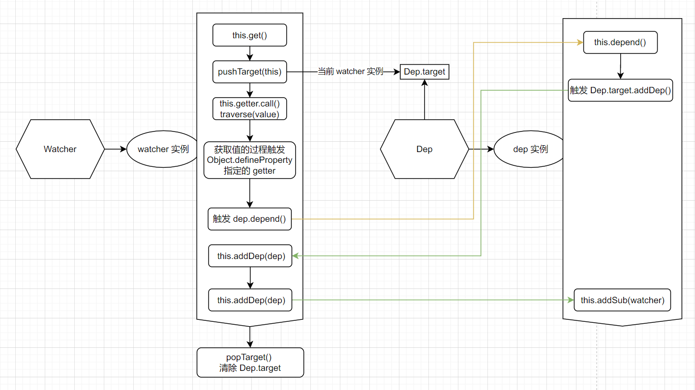

## 响应式系统（四）

关于 Vue 2 响应式系统的前三节已经讲述了 “数据劫持 Observer” 与 “依赖收集分发 Dep”，但是关于 “依赖收集分发” 部分还有还有 “观察者 Watcher” 没有解析。

上文也提到了，Dep 不能脱离 Watcher 单独使用。

### 1. Watcher 定义

该类定义位于 **src/core/observer/watcher.ts**，定义如下：

```typescript
export default class Watcher implements DepTarget {
  vm?: Component | null
  expression: string
  cb: Function
  id: number
  deep: boolean
  user: boolean
  lazy: boolean
  sync: boolean
  dirty: boolean
  active: boolean
  deps: Array<Dep>
  newDeps: Array<Dep>
  depIds: SimpleSet
  newDepIds: SimpleSet
  before?: Function
  onStop?: Function
  noRecurse?: boolean
  getter: Function
  value: any
  post: boolean

  constructor(
    vm: Component | null,
    expOrFn: string | (() => any),
    cb: Function,
    options?: WatcherOptions | null,
    isRenderWatcher?: boolean
  ) {
    recordEffectScope(this, activeEffectScope || (vm ? vm._scope : undefined))
    if ((this.vm = vm)) {
      if (isRenderWatcher) {
        vm._watcher = this
      }
    }
    if (options) {
      this.deep = !!options.deep
      this.user = !!options.user
      this.lazy = !!options.lazy
      this.sync = !!options.sync
      this.before = options.before
    } else {
      this.deep = this.user = this.lazy = this.sync = false
    }
    this.cb = cb
    this.id = ++uid
    this.active = true
    this.post = false
    this.dirty = this.lazy
    this.deps = []
    this.newDeps = []
    this.depIds = new Set()
    this.newDepIds = new Set()
    this.expression = ''
    if (isFunction(expOrFn)) {
      this.getter = expOrFn
    } else {
      this.getter = parsePath(expOrFn)
      !this.getter && (this.getter = noop)
    }
    this.value = this.lazy ? undefined : this.get()
  }
  get() {
    pushTarget(this)
    let value
    const vm = this.vm
    try {
      value = this.getter.call(vm, vm)
    } catch (e: any) {
    } finally {
      this.deep && traverse(value)
      popTarget()
      this.cleanupDeps()
    }
    return value
  }

  addDep(dep: Dep) {
    const id = dep.id
    if (!this.newDepIds.has(id)) {
      this.newDepIds.add(id)
      this.newDeps.push(dep)
      if (!this.depIds.has(id)) {
        dep.addSub(this)
      }
    }
  }

  cleanupDeps() {
    let i = this.deps.length
    while (i--) {
      const dep = this.deps[i]
      if (!this.newDepIds.has(dep.id)) {
        dep.removeSub(this)
      }
    }
    let tmp: any = this.depIds
    this.depIds = this.newDepIds
    this.newDepIds = tmp
    this.newDepIds.clear()
    tmp = this.deps
    this.deps = this.newDeps
    this.newDeps = tmp
    this.newDeps.length = 0
  }
  
  // ... 其他实例方法
}
```

### 2. 参数和属性分析

在 **class Watcher** 中定义了接近 20 个属性（排除了 dev 环境的 debug 支持），除了标识唯一性的 id 属性、当前组件实例的 vm 属性、观察变更时的回调 cb 之外，其他的属性大致可以进行以下分类：

1. 观察对象相关属性，包括 **expression，getter，value，deep**，其中 expression 主要是用来进行开发模式下的错误提示，getter 用来获取当前时刻下 expOrFn 获取到的值，deep 则表示深度监听处理
2. 观察对象改变时的回调函数执行控制，包括 **deep，lazy，dirty，sync，post，active，before，user**
   1. 其中 **user** 主要是用来处理回调函数执行时的错误信息处理，默认是 false，即不处理错误；
   2. **before** 则是一个可选的函数，会在 cb 回调函数执行前执行，这一点可以在 **$mount** 方法的定义中有明确体现（会在 before 中触发生命周期 beforeUpdate 的函数调用）
   3. **active** 用来控制是否可以触发，即是否执行 cb 回调
   4. **dirty** 则是控制 **computed** 计算属性的延迟更新，配合 **lazy** 一起实现；**sync** 与 **post** 用来确定 cb 执行时刻，是否是立即执行或者等待该次数据、试图更新结束之后再执行
3. 依赖处理部分属性，包括 **deps，newDeps，depIds，newDepIds** 和 **onStop**，其中 **onStop** 用来处理该观察者依赖项被情况时执行的操作，其他几个属性则是用来收集当前状态解析/执行 expOrFn 时的依赖，并且针对性能做了一些优化处理（下面会讲）

### 3. 实例化与更新过程

#### 3.1 属性初始化

在 **new Watcher()** 时，首先执行 **recordEffectScope()**，这个方法会将该 watcher 实例注册到 **`vm._scope.effects`** 数组中。

> 这里与 Vue 2.7 之前的版本有一些区别。在 Vue 2.6.14 及之前的版本中，组件内的 watcher 实例都是绑定在 `vm._watchers` 属性中的。

之后则是根据 **options** 参数进行属性初始化，这里有以下几点注意事项：

1. **depIds** 与 **newDepIds** 采用的是 ES6 的 Set 结构，在后续 **addDep** 添加依赖时可以通过 **depIds.has()** 来去除重复依赖
2. **getter** 会被定义成一个函数，就算是一个 **xxx.xxx.xxx** 结构的字符串，也会通过 **parsePath** 解析成一个函数
3. 非 **lazy** 情况（非 computed 或者特殊声明）下，会执行 **watcher.get()** 来初始化当前时刻监听到的 expOrFn 的值

#### 3.2 watcher.get() 收集依赖

在此过程中，首先就是通过 **pushTarget(this)** 将 **Dep.target** 指向当前的 watcher 实例，保证在 watcher.get 的过程中收集到的依赖都是对应到该 watcher 实例的。

之后则是执行 **this.getter.call(vm, vm)**，获取到 watcher 实例的监听对象 expOrFn 此时对应的值；并且在执行过程中，会进行数据读取，触发 **Object.defineProperty** 中定义的 **getter**，调用 **dep.depend()** 执行依赖收集。上一节也已经讲过，dep.depend() 其实就是调用 Dep.target（也就是此时的 watcher 实例）的 addDep(this) 方法，将自己（该数据对应的 dep 实例）插入到 watcher 的 **newDeps，newDepIds** 中，并且只有在 **原有的 watcher.deps** 中不存在这个 dep 实例，才会在 dep.subs 中插入该 watcher，这样可以避免 watcher 重复。

如果配置了深度监听（deep 为 true）时，还会通过 traverse(value) 遍历获取结果触发每一级子属性的 getter 来进行依赖收集。

最后则是调用 **popTarget()** 结束当前阶段的依赖收集，并调用 **cleanupDeps()** 将 **newDeps，newDepIds** 的值复制给 **deps, depIds** 并清空。



> 当然，渲染 watcher（isRenderWatcher 为 true）此时对应的 expOrFn 为：
>
> ```typescript
> updateComponent = () => {
>   vm._update(vm._render(), hydrating)
> }
> ```
>
> 这个模板解析过程中解析到的变量都会添加到 renderWatcher.deps 中

#### 3.3 cleanupDeps() 清除依赖

整个 **cleanupDeps()** 函数的执行过程，就是清除无用依赖，然后将 **newDeps, newDepIds** 的值赋值给原始的 **deps, depIds**，并把 **newDeps, newDepIds** 清空，方便下次执行 get() 和 addDep() 的执行。

上面定义里有体现，在 **addDep(dep)** 时，会首先判断 **newDepIds** 中不存在这个数据的依赖引用 dep，并将这个 dep 添加到 **newDepIds** 和 **newDeps** 中；且当 **depIds** 中也不存在该 dep 时，才会执行 **dep.addSub()**，将 watcher 观察者添加到 dep 的通知对象 subs 中。

而 **cleanupDeps()** 中最先执行的 **dep.removeSub(this)**，就是为了优化掉不需要被通知改变的一系列观察者。

最常见的场景就是使用 **v-if，v-else-if，v-else** 的场景，当节点对应的条件为 false 的时候，节点内部定义的一系列数据变化都是可以取消监听的，因为此时的节点都不会被渲染，也没有在 get() 中收集相关依赖，所以需要手动将原有的依赖从 dep.subs 中清理掉。

#### 3.4 run() 与 update() 状态更新

在数据更新的时候，会通过 **Observer - Object.defineProperty** 定义的 setter 方法来处理，此时会触发 **dep.notify()**

而 **dep.notify()** 的逻辑也很简单，就是遍历 **dep.subs** 数组，依次执行 **sub[i].update()**；上面的过程也可以看到，这里的 **sub[i]** 其实就是依赖这个数据的每一个 watcher 实例。

**首先我们来看 update()**

```typescript
update() {
  if (this.lazy) {
    this.dirty = true
  } else if (this.sync) {
    this.run()
  } else {
    queueWatcher(this)
  }
}
```

这里也比较清晰，就是三个判断：

1. lazy 为 true，表示延迟执行，此时把脏值标志（也就是 computed 的惰性更新机制）设置为 true
2. 如果 sync 为 true，表示立即同步执行回调，则直接执行 run() 方法
3. 其他情况则使用 queueWatcher 将该次回调插入到更新后的执行队列中，待当前的组件实例更新结束之后再依次执行（当然，最后也是通过 watcher.run() 执行回调方法 cb）

**然后就是核心方法之一 run()**

```typescript
run() {
  if (this.active) {
    const value = this.get()
    if (value !== this.value || isObject(value) || this.deep) {
      const oldValue = this.value
      this.value = value
      this.cb.call(this.vm, value, oldValue)
    }
  }
}
```

> 当然这里我省略了错误处理那部分内容。

这个方法也就处理了两个地方：

1. 更新当前 watcher 的 value
2. 执行 cb 函数

### 4. computed 支持

在上面的过程中，提到了 computed 配置产生的 watcher 实例（computedWatcher），默认会将 lazy 设置为 true，那么此时在执行 **watcher.update()** 时是会直接退出的，怎么处理这个 lazy 和 dirty 呢？

所以 Watcher 又定义了另外两个方法：**evaluate()** 和 **depend()**，其定义如下：

```typescript
evaluate() {
  this.value = this.get()
  this.dirty = false
}
depend() {
  let i = this.deps.length
  while (i--) {
    this.deps[i].depend()
  }
}
```

**evaluate：**

在触发 computed.getter（即读取 computed 配置的计算属性时），才会通过该方法获取到 watcher 实例当前的值，并作为 getter 返回值

**depend：**

处理 computed.getter 方法中遇到的变量，并生成一个 computedWatcher 插入到所有变量对应的 dep 实例的 subs 数组中

> 这里的逻辑可能有点绕，笔者的理解和描述也可能有误差，希望大家多多包涵和指出错误😘

### 5. v3 语法支持

因为在 Vue 2.7 之后是适配了 Vue 3 的 setup 语法（组合式 api）的，而 Vue 3 中的 watchEffect 支持取消监听，所以 Watcher 又增加了一个取消依赖订阅的方法。

**teardown：**

```typescript
teardown() {
  if (this.vm && !this.vm._isBeingDestroyed) {
    remove(this.vm._scope.effects, this)
  }
  if (this.active) {
    let i = this.deps.length
    while (i--) {
      this.deps[i].removeSub(this)
    }
    this.active = false
    if (this.onStop) {
      this.onStop()
    }
  }
}
```

作用如下：

1. 在实例还存在且没有被销毁时，在 **vm._scope.effects** 将该 watcher 实例移除掉
2. 如果该 watcher 实例是活动的（也就是没有配置取消监听），会依次在 watcher.deps 中清除掉当前 watcher 的依赖，并将 active 设置为 false
3. 如果有配置停止监听时的处理方法，还会执行 onStop()

