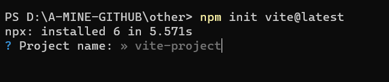
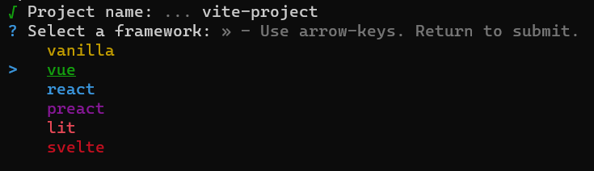
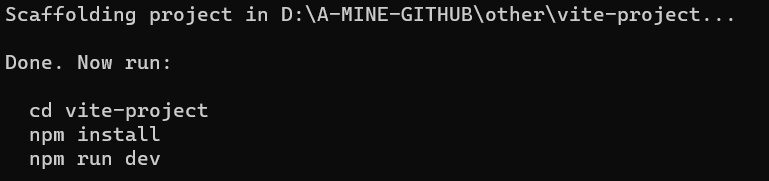
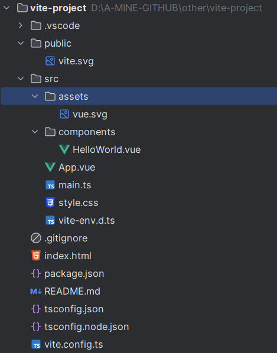

# 搭建 Vite + Vue 3 + TypeScript 的基础项目模板

## 前言

`Vue 3` 发布到现在已经一年多了，目前的版本也到了 `3.2.37`，`Vue` 相关的周边生态也陆续发布了自己的稳定版本，所以是时候开始学习和使用 `Vue 3.0` 了。

> 这里作者也算是炒个冷饭，简单的讲讲自己搭建一个后台管理项目模板的时候遇到的一些问题。

## 主要内容

1. `Vite` 使用与常用配置项
2. `TypeScript` 集成
3. `Vue` 周边生态：`Router` 与 `Pinia`
4. `eslint` 和 `prettier` 代码格式与代码检查
5. 依赖自动引入与组件库 `Naive UI`

## 1. 创建项目

### 1.1 按步骤选择依赖创建

> 后面的内容都使用 `npm` 作为包管理工具，建议使用 `vite CLI` 直接初始化项目

首先，先在本地找一个“宽敞”的目录，并在该目录下打开命令行（ `windows` 系统可以直接在资源管理器地址栏输入 `cmd` 进入命令行界面）。

```shell
npm init vite@latest
# or
npm create vite@latest
# or
yarn create vite
# or
pnpm create vite
```

如果没有安装 `vite`，`npm` 也会自动下载。



之后则是键入项目名称，并选择相应的库或者框架。



选择 `TypeScript`，并结束创建过程。



### 1.2 使用附加命令直接创建

```shell
# npm 6.x
npm create vite@latest my-vue-app --template vue-ts

# npm 7+, extra double-dash is needed:
npm create vite@latest my-vue-app -- --template vue-ts

# yarn
yarn create vite my-vue-app --template vue-ts

# pnpm
pnpm create vite my-vue-app --template vue-ts
```

`Vite` 官方文档也提供了多个预设模板，可以通过附加命令 `--template` 来指定需要使用的模板项目。

当前预设模板有：

-   `vanilla`
-   `vanilla-ts`
-   `vue`
-   `vue-ts`
-   `react`
-   `react-ts`
-   `preact`
-   `preact-ts`
-   `lit`
-   `lit-ts`
-   `svelte`
-   `svelte-ts`

---

到这里一个基础的 `vite` + `vue` + `ts` 的项目就创建完成了。该项目当前包含以下内容：



如果仅作为个人学习使用，到这里就可以算基本结束了，可以直接使用该项目执行 `npm install` 下载依赖并启动，进行后续的开发。

> 📌 Tips:
> 
> 官方推荐使用 `vs code` 搭配 `volar` 插件进行开发。

## 2. 项目配置

### 2.1 `TypeScript Node` 支持

在配置路径别名、进行文件读写等操作时，我们通常为了简化路径都会使用别名，但是直接配置的话 `TS` 环境无法正确识别 `node` 相关的包的类型声明，所以需要先配置 `node` 的 `types` 依赖。

```shell
npm install @types/node -D
# or 
yarn add @types/node -D
# or 
pnpm install @types/node -D
```

### 2.2 别名配置

`TS` 环境配置别名需要修改两个地方：`tsconfig.json` 和 `vite.config.ts`。

##### `tsconfig.json`

```json
{
  "compilerOptions": {
    // ...
    "paths": {
      "@/*": ["src/*"]
    }
  }
  // ...
}
```

在 `tsconfig.json` 中的 `compilerOptions` 内添加 `paths` 配置，`key` 为需要增加的别名，`value` 为别名对应的目录。

> 别名一般都是配置的文件目录，所以 `key` 和 `value` 都需要加上后缀 `/*`

##### `vite.config.ts`

`vite.config.ts` 配置别名也很简单，只需要增加一个配置项即可。

```typescript
import { defineConfig } from 'vite'
import vue from '@vitejs/plugin-vue'
import path from 'path'

// https://vitejs.dev/config/
export default defineConfig({
  plugins: [vue()],

  resolve: {
    alias: {
      '@': path.resolve(__dirname, 'src')
    }
  }
})
```

**这里注意需要和 `tsconfig.json` 中的别名配置匹配，只是 `key` 的末尾不需要添加 `/*`，`value` 需要用 `path` 指定对应的文件目录**

### 2.3 开发服务器和代理

本地开发时都需要启动一个 `node` 服务来预览页面效果，并通过 `proxy` 代理来访问后端接口。

```typescript
import { defineConfig } from 'vite'
// ...

export default defineConfig({
    // ...
    // 开发环境服务器的配置都在 server 配置项内
    server: {
        // 指定服务器应该监听哪个 IP 地址。 如果将此设置为 0.0.0.0 或者 true 将监听所有地址，包括局域网和公网地址。
        // 默认为 'localhost'，即仅能本机访问
        host: '0.0.0.0',
        // 启动端口
        port: 8080,
        // 设为 true 时若端口已被占用则会直接退出，而不是尝试下一个可用端口。
        strictPort: false,
        // HMR 连接配置（用于 HMR websocket 必须使用不同的 http 服务器地址的情况，或者禁用 hmr 模块），一般省略
        hmr: {
            host: '127.0.0.1',
            port: 8080
        },
        // 参数类型：boolean | string，配置启动时时候自动打开网页，是字符串时表示打开某个特定路径
        open: true,
        // 自定义代理规则，用来配合后端服务进行接口调用等。
        // 默认使用 [http-proxy](https://github.com/http-party/node-http-proxy) 模块，完整配置见官方仓库
        proxy: {
            // 字符串简写写法
            '/foo': 'http://localhost:4567',
            // 选项写法
            '/api': {
                target: 'http://jsonplaceholder.typicode.com',
                changeOrigin: true,
                rewrite: (path) => path.replace(/^\/api/, '')
            },
            // 正则表达式写法
            '^/fallback/.*': {
                target: 'http://jsonplaceholder.typicode.com',
                changeOrigin: true,
                rewrite: (path) => path.replace(/^\/fallback/, '')
            },
            // Proxying websockets or socket.io
            '/socket.io': {
                target: 'ws://localhost:3000',
                ws: true
            }
        }
    }
})
```

> 详细配置见 [Vite - 开发服务器选项](https://cn.vitejs.dev/config/server-options.html)

### 2.4 代码规范与检查

代码规范这部分通常包含两个部分：`eslint` 和 `prettier`，并且两者通常会结合使用。`eslint` 也提供了配合解析 `prettier` 配置的相关依赖。

##### 配置 `prettier`

首先，先安装 `prettier` 相关依赖

```shell
npm i prettier -D
```

然后，创建 `prettier.config.js` 或 `.prettierrc.js`，以及忽略检查配置 `.prettierignore`

```javascript
// .prettierrc.js
module.exports = {
    // 一行最多 120 字符
    printWidth: 120,
    // 使用 2 个空格缩进
    tabWidth: 2,
    // 不使用 tab 缩进，而使用空格
    useTabs: false,
    // 行尾需要有分号
    semi: true,
    // 使用单引号代替双引号
    singleQuote: true,
    // 对象的 key 仅在必要时用引号
    quoteProps: 'as-needed',
    // jsx 不使用单引号，而使用双引号
    jsxSingleQuote: false,
    // 末尾使用逗号
    trailingComma: 'all',
    // 大括号内的首尾需要空格 { foo: bar }
    bracketSpacing: true,
    // jsx 标签的反尖括号需要换行
    jsxBracketSameLine: false,
    // 箭头函数，只有一个参数的时候，也需要括号
    arrowParens: 'always',
    // 每个文件格式化的范围是文件的全部内容
    rangeStart: 0,
    rangeEnd: Infinity,
    // 不需要写文件开头的 @prettier
    requirePragma: false,
    // 不需要自动在文件开头插入 @prettier
    insertPragma: false,
    // 使用默认的折行标准
    proseWrap: 'preserve',
    // 根据显示样式决定 html 要不要折行
    htmlWhitespaceSensitivity: 'css',
    // 换行符使用 lf
    endOfLine: 'auto'
}

// .prettierignore
node_modules
dist
public
```

##### 配置 `eslint`

因为 `eslint` 不能识别 `TypeScript` 语法，所以我们要添加对应的 `@typescript-eslint/parser` 来替换原有解析器；并安装 `@typescript-eslint/eslint-plugin` 与 `eslint-plugin-vue` 来为 `ts` 等文件增加对应的语法规则。

并且为了配合 `prettier` 代码美化规则，还需要安装 `eslint-config-prettier` 和`eslint-plugin-prettier` 来读取 `prettier` 配置。

```shell
npm i eslint -D
npm i eslint-plugin-vue -D
npm i @typescript-eslint/parser -D
npm i @typescript-eslint/eslint-plugin -D
npm i eslint-config-prettier -D
npm i eslint-plugin-prettier -D
```

> 也可以直接写到一个安装命令里面，这里只是为了方便阅读。

然后创建配置文件 `.eslintrc.js` 或 `.eslintrc.json`，和忽略配置文件 `.eslintignore`

```javascript
// .eslintrc.js
module.exports = {
    // parser 代码解析依赖
    parser: 'vue-eslint-parser',
    parserOptions: {
        // 替换原有的代码解析器
        parser: '@typescript-eslint/parser',
        // 声明 es 版本
        ecmaVersion: 2020,
        // 声明源码类型
        sourceType: 'module',
        // 其他语言扩展，包含jsx，全局严格模式等
        ecmaFeatures: {
            jsx: true
        }
    },
    // 继承插件的规则配置
    extends: [
        'plugin:vue/vue3-recommended',
        'plugin:@typescript-eslint/recommended',
        'plugin:prettier/recommended',
        'prettier'
    ],
    // 自定义规则配置
    rules: {}
}

// .eslintignore
node_modules/
public/
es/
lib/
dist/
docs/
src/assets/
package.json
```

### 2.5 `jsx` 语法配置

上文 `eslint` 配置中已经启用了 `jsx` 检查，并且 `vite` 官方提供了 `vue` 对应的 `jsx` 插件。所以只需要简单配置就可以使用 `jsx` 或者 `tsx` 语法。

```shell
npm i @vitejs/plugin-vue-jsx -D
```

然后在 `vite.config.js` 中启用该插件。

```typescript
export default defineConfig({
    plugins: [ vue(), vueJsx() ]
})
```

### 2.6 引入 `pinia` 状态管理

`pinia` 与 `vuex` 一样，作为一个全局状态管理插件，它允许您跨组件/页面共享状态。但是在页面刷新之后依然会丢失状态！所以可以增加引入 `pinia-plugin-persistedstate` 来进行持久化。

```shell
npm i pinia pinia-plugin-persistedstate
```

然后在 `main.ts` 中初始化。

```ts
import { createApp } from 'vue'
import App from './App'
import router from './router'
import { createPinia } from 'pinia'
import piniaPluginPersistedstate from 'pinia-plugin-persistedstate'

const app = createApp(App)
const pinia = createPinia()
pinia.use(piniaPluginPersistedstate)

app.use(router)
app.use(pinia)
app.mount('#app')
```

### 2.7 依赖自动引入插件

在使用 `vue 3` 的组合式 `api` 的时候，页面上通常需要些很多的 `import`，所以 `vue` 与 `vite` 的主要贡献者 [Anthony Fu(antfu)](https://github.com/antfu) 根据 [unplugin](https://github.com/unjs/unplugin) 编写了几个自动引入插件，这里可以使用 `unplugin-auto-import` 和 `unplugin-vue-components`

##### `unplugin-auto-import`

为 Vite, Webpack, Rollup 和 esbuild 等提供的自动导入 API 的工具。

```shell
npm i unplugin-auto-import -D
```

因为我们使用的是 `vite + ts` 的环境，并使用了 `eslint`，所以我们需要进行一下配置

```typescript
import AutoImport from 'unplugin-auto-import/vite'

export default defineConfig({
    plugins: [
        AutoImport({
            // 这里使用了 NaiveUI，可以引入以下 4 个函数组件
            imports: [
                'vue',
                'vue-router',
                'pinia',
                {
                    'naive-ui': ['useDialog', 'useMessage', 'useNotification', 'useLoadingBar']
                }
            ],
            // 指定引入根目录下的 requests，config，utils 目录内的所有函数
            dirs: ['./src/requests/**', './src/config/**', './src/utils/**'],
            // 指定生成的 d.ts 文件位置与文件名
            dts: './src/auto-imports.d.ts',
            // 配置开启 eslint
            eslintrc: {
                enabled: true
            }
        }),
    ],
})
```

这里需要对原来的 `.eslintrc.js` 文件进行修改，增加 `unplugin-auto-import` 生成的规则文件。

```javascript
module.exports = {
    extends: [
        './.eslintrc-auto-import.json', // `unplugin-auto-import` 生成的规则配置文件
        // ...
    ]
}
```

##### `unplugin-vue-components`

这个仓库则是自动为 `vue` 项目按需导入组件的插件，并且可以自定义 `Resolver` 来配置引入规则。但是，**该插件不支持 `Jsx` 和 `Tsx` 语法**

该仓库内置了 `Ant Design Vue` `Arco Design Vue` `Element Plus` `Naive UI` `VueUse Components` 等 18 个组件库的 `Resolver` 方法。

```shell
npm i unplugin-vue-components -D
```

然后，在 `vite.config.ts` 中进行配置。

```typescript
import { defineConfig } from 'vite'
import Components from 'unplugin-vue-components/vite'
import { NaiveUiResolver } from 'unplugin-vue-components/resolvers'

export default defineConfig({
  plugins: [
    Components({
      // 指定组件位置，默认是src/components
      dirs: ['src/components'],
      // 配置文件生成位置
      dts: 'src/components.d.ts',
      resolvers: [NaiveUiResolver()]
    })
  ]
})

```

## 结语

到目前为止，这个项目模板还缺少 `vue-router`，`axios` 等基础配置，但是这部分内容大家跟着官方文档基本都可以实现，所以这里不在赘述。

如果是团队开发，这里还需要配置 `git` 对应的代码提交审核 `husky` 和 `lint-staged` 等插件。

但是个人认为，一个团队搭建项目模板，都是大家一起完成，需要综合考虑大家的代码编写习惯以及团队内部的一些开发规范，所以通常都有一个固定的项目模板。本文也仅对刚开始学习和使用 `vite` 与 `vue3` 的小伙伴提供一个项目搭建的思路，如有缺陷希望大家多多包涵。
