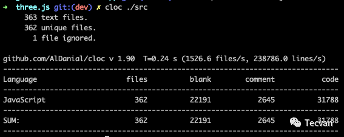
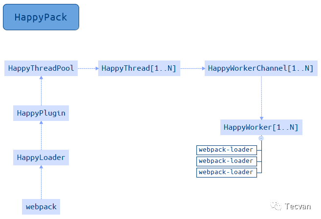

# Webpack 性能系列二：多进程打包

在上一篇《[Webpack 性能系列一: 使用 Cache 提升构建性能](./01.md)》中，我们讨论了 Webpack 语境下如何应用各种缓存措施提升构建性能，接下来我们继续聊聊 Webpack 中一些行之有效的并行计算方案。缓存的本质是首轮计算后将结果保存下来，下次直接复用计算结果而跳过计算过程；并行的本质则是在同一时间内并发执行多个运算，提升单位时间计算效率，两者都是计算机科学常见的提升性能优化手段。

受限于 Node.js 的单线程架构，原生 Webpack 对所有资源文件做的所有解析、转译、合并操作本质上都是在同一个线程内串行执行，CPU 利用率极低，因此，理所当然地社区出现了一些基于多进程方式运行 Webpack，或 Webpack 构建过程某部分工作的方案，例如：

-   HappyPack：多进程方式运行资源加载逻辑

-   Thread-loader：Webpack 官方出品，同样以多进程方式运行资源加载逻辑

-   TerserWebpackPlugin：支持多进程方式执行代码压缩、uglify 功能

-   Parallel-Webpack：多进程方式运行多个 Webpack 构建实例


这些方案的核心设计都很类似：针对某种计算任务创建子进程，之后将运行所需参数通过 IPC 传递到子进程并启动计算操作，计算完毕后子进程再将结果通过 IPC 传递回主进程，寄宿在主进程的组件实例再将结果提交给 Webpack。

下面，我将展开介绍每种方案的使用方法、原理及缺点，读者可按需选用。

## 1. 使用 HappyPack

HappyPack 是一个使用多进程方式运行文件加载器 —— Loader 序列，从而提升构建性能的 Webpack 组件库，算得上 Webpack 社区内最先流行的并发方案，不过作者已经明确表示不会继续维护，推荐读者优先使用 Webpack 官方推出的相似方案：Thread-loader。

> ❝ 官方链接：https://github.com/amireh/happypack ❞

使用方法
----

### 基本用法

使用上，首先安装依赖：

```shell
yarn add happypack
```

之后，需要将原有 loader 配置替换为 `happypack/loader`，如：

```javascript
module.exports = {
    // ...
    module: {
        rules: [{
            test: /\.js$/,
            // 使用 happypack/loader 替换原来的 Loader 配置
            use: 'happypack/loader',
            // use: [
            //  {
            //      loader: 'babel-loader',
            //      options: {
            //          presets: ['@babel/preset-env']
            //      }
            //  },
            //  'eslint-loader'
            // ]
        }]
    }
};
```

再之后，需要创建 `happypack` 插件实例，并将原有 loader 配置迁移到插件中，完整示例：

```javascript
const HappyPack = require('happypack');

module.exports = {
    // ...
    module: {
        rules: [{
            test: /\.js$/,
            use: 'happypack/loader',
            // use: [
            //  {
            //      loader: 'babel-loader',
            //      options: {
            //          presets: ['@babel/preset-env']
            //      }
            //  },
            //  'eslint-loader'
            // ]
        }]
    },
    plugins: [
        new HappyPack({
            loaders: [
                {
                    loader: 'babel-loader',
                    option: {
                        presets: ['@babel/preset-env']
                    }
                },
                'eslint-loader'
            ]
        })
    ]
};
```

配置完毕后，再次启动 `npx webpack` 命令即可使用 HappyPack 的多进程能力提升构建性能。以 Three.js 为例，该项目包含 362 份 JS 文件，合计约 3w 行代码：



开启 HappyPack 前，构建耗时大约为 11000ms 到 18000ms 之间，开启后耗时降低到 5800ms 到 8000ms 之间，提升约47%。

### 配置多实例

上述简单示例只能以相同的 Loader 序列处理同种文件类型，实际应用中还可以为不同的文件配置多个 相应的加载器数组，例如：

```javascript
const HappyPack = require('happypack');

module.exports = {
  // ...
  module: {
    rules: [{
        test: /\.js?$/,
        use: 'happypack/loader?id=js'
      },
      {
        test: /\.less$/,
        use: 'happypack/loader?id=styles'
      },
    ]
  },
  plugins: [
    new HappyPack({
      id: 'js',
      loaders: ['babel-loader', 'eslint-loader']
    }),
    new HappyPack({
      id: 'styles',
      loaders: ['style-loader', 'css-loader', 'less-loader']
    })
  ]
};
```

示例中，`js`、`less` 资源都使用 `happypack/loader` 作为唯一 loader，并分别赋予 `id = 'js' | 'styles'` 参数；其次，示例中创建了两个 `HappyPack` 插件实例并分别配置了用于处理 js 与 css 的 `loaders` 数组，`happypack/loader` 与 `HappyPack` 实例之间通过 `id` 值关联起来，以此实现多资源配置。

### 共享线程池

上述多实例模式更接近实际应用场景，但默认情况下，HappyPack 插件实例各自管理自身所消费的进程，导致整体需要维护一个数量庞大的进程池，反而带来新的性能损耗。

为此，HappyPack 提供了一套简单易用的共享进程池功能，使用上只需创建 `HappyPack.ThreadPool` 实例并通过 `size` 参数限定进程总量，之后将该实例配置到各个 HappyPack 插件的 `threadPool` 属性上即可，例如：

```javascript
const os = require('os')
const HappyPack = require('happypack');
const happyThreadPool = HappyPack.ThreadPool({
  size: os.cpus().length - 1
});

module.exports = {
  // ...
  plugins: [
    new HappyPack({
      id: 'js',
      threadPool: happyThreadPool,
      loaders: ['babel-loader', 'eslint-loader']
    }),
    new HappyPack({
      id: 'styles',
      threadPool: happyThreadPool,
      loaders: ['style-loader', 'css-loader', 'less-loader']
    })
  ]
};
```

使用共享进程池功能后，HappyPack 会预先创建好一组共享的 `HappyThread` 对象，所有插件实例的资源转译需求最终都会通过 `HappyThread` 对象转发到空闲进程做处理，从而保证整体进程数量可控。

### 原理

HappyPack 的运行过程如下图所示：



大致可划分为：

-   `happlypack/loader` 接受到转译请求后，从 Webpack 配置中读取出相应 HappyPack 插件实例
-   调用插件实例的 `compile` 方法，创建 `HappyThread` 实例(或从 `HappyThreadPool` 取出空闲实例)
-   `HappyThread` 内部调用 `child_process.fork` 创建子进程，并执行 `HappyWorkerChannel` 文件
-   `HappyWorkerChannel` 创建 `HappyWorker` ，开始执行 Loader 转译逻辑

中间流程辗转了几层，最终由 `HappyWorker` 类重新实现了一套与 Webpack Loader 相似的转译逻辑，代码复杂度较高，读者稍作了解即可。

### 缺点

HappyPack 虽然确实能有效提升 Webpack 的打包构建速度，但它有一些明显的缺点：

-   作者已经明确表示不会继续维护，扩展性与稳定性缺乏保障，随着 Webpack 本身的发展迭代，可以预见总有一天 HappyPack 无法完全兼容 Webpack
-   HappyPack 底层以自己的方式重新实现了加载器逻辑，源码与使用方法都不如 Thread-loader 清爽简单
-   不支持部分 Loader，如 `awesome-typescript-loader`

## 使用 Thread-loader

Thread-loader 也是一个以多进程方式运行 loader 从而提升 Webpack 构建性能的组件，功能上与HappyPack 极为相近，两者主要区别：

1.  Thread-loader 由 Webpack 官方提供，目前还处于持续迭代维护状态，理论上更可靠
2.  Thread-loader 只提供了一个单一的 loader 组件，用法上相对更简单
3.  HappyPack 启动后，会向其运行的 loader 注入 `emitFile` 等接口，而 Thread-loader 则不具备这一特性，因此对 loader 的要求会更高，兼容性较差

> ❝ 官方链接：https://github.com/webpack-contrib/thread-loader  ❞

### 使用方法

首先，需要安装 Thread-loader 依赖：

```
yarn add -D thread-loader
```

其次，需要将 Thread-loader 配置到 loader 数组首位，确保最先运行，如：

```javascript
module.exports = {
  module: {
    rules: [{
      test: /\.js$/,
      use: [
        'thread-loader',
        'babel-loader',
        'eslint-loader'
      ],
    }, ],
  },
};
```

配置完毕后，再次启动 `npx webpack` 命令即可。依然以 Three.js 为例，开启 Thread-loader 前，构建耗时大约为 11000ms 到 18000ms 之间，开启后耗时降低到 8000ms 左右，提升约37%。

### 原理

Webpack 将执行 Loader 相关逻辑都抽象到 `loader-runner` 库，Thread-loader 也同样复用该库完成 Loader 的运行逻辑，核心步骤：

-   启动时，以 `pitch` 方式拦截 Loader 执行链

-   分析 Webpack 配置对象，获取 `thread-loader` 后面的 Loader 列表

-   调用 `child_process.spawn` 创建工作子进程，并将Loader 列表、文件路径、上下文等参数传递到子进程

-   子进程中调用 `loader-runner`，转译文件内容

-   转译完毕后，将结果传回主进程


> 参考：
> https://github.com/webpack/loader-runner
> [Webpack 原理系列七：如何编写loader](https://mp.weixin.qq.com/s?__biz=Mzg3OTYwMjcxMA==&mid=2247484137&idx=1&sn=bbf2bd1350a5cd362d3de59bd6f0ec69&scene=21#wechat_redirect)


### 缺点

Thread-loader 是 Webpack 官方推荐的并行处理组件，实现与使用都非常简单，但它也存在一些问题：

-   Loader 中不能调用 `emitAsset` 等接口，这会导致 `style-loader` 这一类 Loader 无法正常工作，解决方案是将这类组件放置在 `thread-loader` 之前，如 `['style-loader', 'thread-loader', 'css-loader']`

-   Loader 中不能获取 `compilation`、`compiler` 等实例对象，也无法获取 Webpack 配置


这会导致一些 Loader 无法与 Thread-loader 共同使用，读者需要仔细加以甄别、测试。

## 使用 Parallel-Webpack

Thread-loader、HappyPack 这类组件所提供的并行能力都仅作用于执行加载器 —— Loader 的过程，对后续 AST 解析、依赖收集、打包、优化代码等过程均没有影响，理论收益还是比较有限的。对此，社区还提供了另一种并行度更高，以多个独立进程运行 Webpack 实例的方案 —— Parallel-Webpack。

> 官方链接：https://github.com/trivago/parallel-webpack ❞

###使用方法

#### 基本用法

使用前，依然需要安装依赖：

```
yarn add -D parallel-webpack
```

Parallel-Webpack 支持两种用法，首先介绍的是在 `webpack.config.js` 配置文件中导出多个 Webpack 配置对象，如：

```javascript
module.exports = [{
    entry: 'pageA.js',
    output: {
        path: './dist',
        filename: 'pageA.js'
    }
}, {
    entry: 'pageB.js',
    output: {
        path: './dist',
        filename: 'pageB.js'
    }
}];
```

之后，执行命令 `npx parallel-webpack` 即可完成构建，上面的示例配置会同时打包出 `pageA.js` 与 `pageB.js` 两份产物。

#### 组合变量

Parallel-Webpack 还提供了 `createVariants` 函数，用于根据给定变量组合，生成多份 Webpack 配置对象，如：

```javascript
const createVariants = require('parallel-webpack').createVariants
const webpack = require('webpack')


const baseOptions = {
  entry: './index.js'
}


// 配置变量组合
// 属性名为 webpack 配置属性；属性值为可选的变量
// 下述变量组合将最终产生 2*2*4 = 16 种形态的配置对象
const variants = {
  minified: [true, false],
  debug: [true, false],
  target: ['commonjs2', 'var', 'umd', 'amd']
}


function createConfig (options) {
  const plugins = [
    new webpack.DefinePlugin({
      DEBUG: JSON.stringify(JSON.parse(options.debug))
    })
  ]
  return {
    output: {
      path: './dist/',
      filename: 'MyLib.' +
                options.target +
                (options.minified ? '.min' : '') +
                (options.debug ? '.debug' : '') +
                '.js'
    },
    plugins: plugins
  }
}


module.exports = createVariants(baseOptions, variants, createConfig)
```

上述示例使用 `createVariants` 函数，根据 `variants` 变量搭配出 16 种不同的 `minified`、`debug`、`target` 组合，最终生成如下产物：

```
[WEBPACK] Building 16 targets in parallel
[WEBPACK] Started building MyLib.umd.js
[WEBPACK] Started building MyLib.umd.min.js
[WEBPACK] Started building MyLib.umd.debug.js
[WEBPACK] Started building MyLib.umd.min.debug.js

[WEBPACK] Started building MyLib.amd.js
[WEBPACK] Started building MyLib.amd.min.js
[WEBPACK] Started building MyLib.amd.debug.js
[WEBPACK] Started building MyLib.amd.min.debug.js

[WEBPACK] Started building MyLib.commonjs2.js
[WEBPACK] Started building MyLib.commonjs2.min.js
[WEBPACK] Started building MyLib.commonjs2.debug.js
[WEBPACK] Started building MyLib.commonjs2.min.debug.js

[WEBPACK] Started building MyLib.var.js
[WEBPACK] Started building MyLib.var.min.js
[WEBPACK] Started building MyLib.var.debug.js
[WEBPACK] Started building MyLib.var.min.debug.js
```

### 原理

parallel-webpack 的实现非常简单，基本上就是在 Webpack 上套了个壳，核心逻辑：

-   根据传入的配置项数量，调用 `worker-farm` 创建复数个工作进程
-   工作进程内调用 Webpack 执行构建
-   工作进程执行完毕后，调用 `node-ipc` 向主进程发送结束信号

到这里，所有工作就完成了。

### 缺点

虽然，parallel-webpack 相对于 Thread-loader、HappyPack 有更高的并行度，但进程实例与实例之间并没有做任何形式的通讯，这可能导致相同的工作在不同进程 —— 或者说不同 CPU 核上被重复执行。例如需要对同一份代码同时打包出压缩和非压缩版本时，在 parallel-webpack 方案下，前置的资源加载、依赖解析、AST 分析等操作会被重复执行，仅仅最终阶段生成代码时有所差异。

这种技术实现，对单 entry 的项目没有任何收益，只会徒增进程创建成本；但特别适合 MPA 等多 entry 场景，或者需要同时编译出 esm、umd、amd 等多种产物形态的类库场景。

## 并行压缩

Webpack 语境下通常使用 Uglify-js、Uglify-es、Terser 做代码混淆压缩，三者都不同程度上原生实现了多进程并行压缩功能。

> ❝ TerserWebpackPlugin 完整介绍：https://webpack.js.org/plugins/terser-webpack-plugin/ ❞

以 Terser 为例，插件 TerserWebpackPlugin 默认已开启并行压缩能力，通常情况下保持默认配置即 `parallel = true` 即可获得最佳的性能收益。开发者也可以通过 `parallel` 参数关闭或设定具体的并行进程数量，例如：

```javascript
const TerserPlugin = require("terser-webpack-plugin");

module.exports = {
    optimization: {
        minimize: true,
        minimizer: [new TerserPlugin({
            parallel: 2 // number | boolean
        })],
    },
};
```

上述配置即可设定最大并行进程数为2。

对于 Webpack 4 及之前的版本，代码压缩插件 UglifyjsWebpackPlugin 也有类似的功能与配置项，此处不再赘述。

## 最佳实践

理论上，并行确实能够提升系统运行效率，但 Node 单线程架构下，所谓的并行计算都只能依托与派生子进程执行，而创建进程这个动作本身就有不小的消耗 —— 大约 600ms，因此建议读者按实际需求斟酌使用上述多进程方案。

对于小型项目，构建成本可能很低，但引入多进程技术反而导致整体成本增加。

对于大型项目，由于 HappyPack 官方已经明确表示不维护，所以建议尽量使用 Thread-loader 组件提升 Make 阶段性能。生产环境下还可配合 terser-webpack-plugin 的并行压缩功能，提升整体效率。
