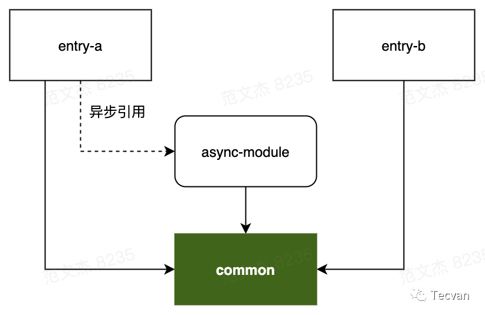
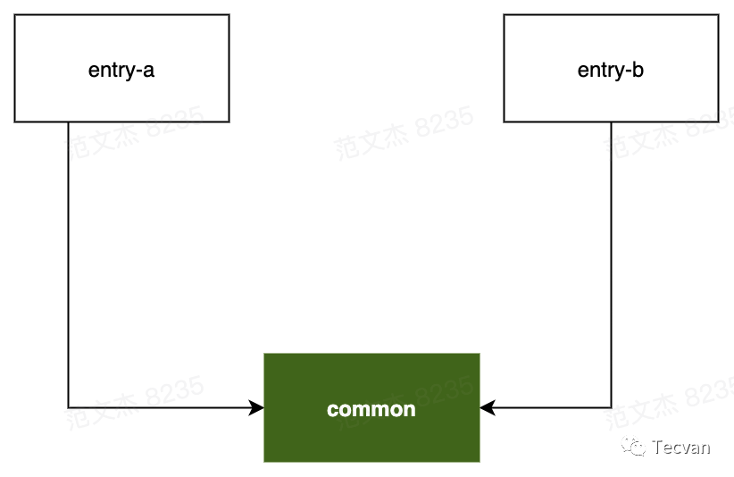
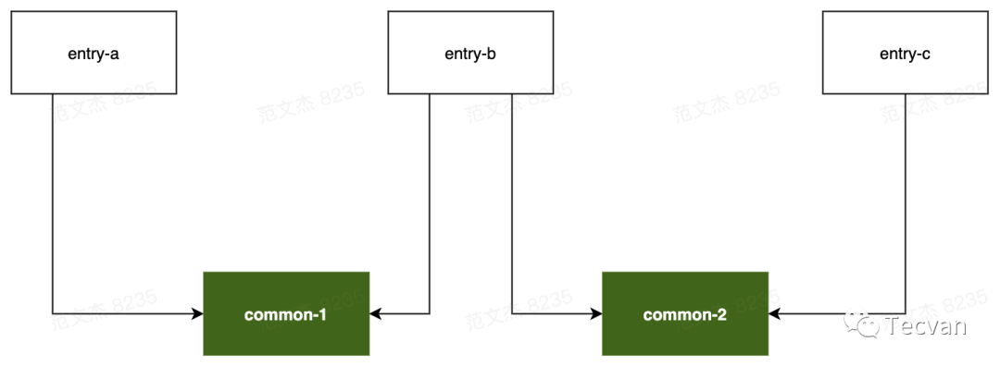

# Webpack 性能系列四：分包优化

一、什么是分包
-------

默认情况下，Webpack 会将所有代码构建成一个单独的包，这在小型项目通常不会有明显的性能问题，但伴随着项目的推进，包体积逐步增长可能会导致应用的响应耗时越来越长。归根结底这种将所有资源打包成一个文件的方式存在两个弊端：

-   **「资源冗余」**：客户端必须等待整个应用的代码包都加载完毕才能启动运行，但可能用户当下访问的内容只需要使用其中一部分代码

-   **「缓存失效」**：将所有资源达成一个包后，所有改动 —— 即使只是修改了一个字符，客户端都需要重新下载整个代码包，缓存命中率极低


这些问题都可以通过对产物做适当的分解拆包解决，例如 `node_modules` 中的资源通常变动较少，可以抽成一个独立的包，那么业务代码的频繁变动不会导致这部分第三方库资源被无意义地重复加载。为此，Webpack 专门提供了 `SplitChunksPlugin` 插件，用于实现产物分包。

二、使用 SplitChunksPlugin
----------------------

`SplitChunksPlugin` 是 Webpack 4 之后引入的分包方案(此前为 `CommonsChunkPlugin`)，它能够基于一些启发式的规则将 Module 编排进不同的 Chunk 序列，并最终将应用代码分门别类打包出多份产物，从而实现分包功能。

使用上，`SplitChunksPlugin` 的配置规则比较抽象，算得上 Webpack 的一个难点，仔细拆解后关键逻辑在于：

-   `SplitChunksPlugin` 通过 module 被引用频率、chunk 大小、包请求数三个维度决定是否执行分包操作，这些决策都可以通过 `optimization.splitChunks` 配置项调整定制，基于这些维度我们可以实现：

-   单独打包某些特定路径的内容，例如 `node_modules` 打包为 `vendors`

-   单独打包使用频率较高的文件

-   `SplitChunksPlugin` 还提供配置组概念 `optimization.splitChunks.cacheGroup`，用于为不同类型的资源设置更有针对性的配置信息

-   `SplitChunksPlugin` 还内置了 `default` 与 `defaultVendors` 两个配置组，提供一些开箱即用的特性：

-   `node_modules` 资源会命中 `defaultVendors` 规则，并被单独打包

-   只有包体超过 20kb 的 Chunk 才会被单独打包

-   加载 Async Chunk 所需请求数不得超过 30

-   加载 Initial Chunk 所需请求数不得超过 30


> ❝
> 这里所说的请求数不能等价对标到 http 资源请求数，下文会细讲
> ❞

综上，分包逻辑基本上都围绕着 Module 与 Chunk 展开，在介绍具体用法之前，有必要回顾一下 Chunk 的基础知识。

2.1 什么是 Chunk
-------------

在《[有点难的知识点：Webpack Chunk 分包规则详解](https://mp.weixin.qq.com/s?__biz=Mzg3OTYwMjcxMA==&mid=2247484029&idx=1&sn=7862737524e799c5eaf1605325171e32&scene=21#wechat_redirect)》一文中，我们已经了解到 Chunk 是打包产物的基本组织单位，读者可以等价认为有多少 Chunk 就会对应生成多少产物(Bundle)。Webpack 内部包含三种类型的 Chunk：

-   Initial Chunk：基于 Entry 配置项生成的 Chunk

-   Async Chunk：异步模块引用，如 `import(xxx)` 语句对应的异步 Chunk

-   Runtime Chunk：只包含运行时代码的 Chunk


> ❝
> 关于运行时的概念，可参考《[Webpack 原理系列六：彻底理解 Webpack 运行时](https://mp.weixin.qq.com/s?__biz=Mzg3OTYwMjcxMA==&mid=2247484088&idx=1&sn=41bf509a72f2cbcca1521747bf5e28f4&scene=21#wechat_redirect)》
> ❞

而 `SplitChunksPlugin` 默认只对 Async Chunk 生效，开发者也可以通过 `optimization.splitChunks.chunks` 调整作用范围，该配置项支持如下值：

-   字符串 `'all'` ：对 Initial Chunk 与 Async Chunk 都生效，建议优先使用该值

-   字符串 `'initial'` ：只对 Initial Chunk 生效

-   字符串 `'async'` ：只对 Async Chunk 生效

-   函数 `(chunk) => boolean` ：该函数返回 `true` 时生效


例如：

```javascript
module.exports = {
  //...
  optimization: {
    splitChunks: {
      chunks: 'all',
    },
  },
}
```

2.2 分包策略详解
----------

### 2.2.1 根据 Module 使用频率分包

`SplitChunksPlugin` 支持按 Module 被 Chunk 引用的次数决定是否进行分包，开发者可通过 `optimization.splitChunks.minChunks` 设定最小引用次数，例如：

```javascript
module.exports = {
  //...
  optimization: {
    splitChunks: {
      // 设定引用次数超过 4 的模块才进行分包
      minChunks: 3
    },
  },
}
```

需要注意，这里“被 Chunk 引用次数”并不直接等价于被 `import` 的次数，而是取决于上游调用者是否被视作 Initial Chunk 或 Async Chunk 处理，例如：

```javascript
// common.js
export default "common chunk";

// async-module.js
import common from './common'

// entry-a.js
import common from './common'
import('./async-module')

// entry-b.js
import common from './common'

// webpack.config.js
module.exports = {
  entry: {
    entry1: './src/entry-a.js',
    entry2: './src/entry-b.js'
  },
  // ...
  optimization: {
    splitChunks: {
      minChunks: 2
    }
  }
};
```

上例包含四个模块，形成如下模块关系图：



示例中，`entry-a`、`entry-b` 分别被视作 Initial Chunk 处理；`async-module` 被 `entry-a` 以异步方式引入，因此被视作 Async Chunk 处理。那么对于 `common` 模块来说，分别被三个不同的 Chunk 引入，此时引用次数为 3，命中 `optimization.splitChunks.minChunks = 2` 规则，因此该模块**「可能」**会被单独分包，最终产物：

-   `entry-a.js`
-   `entry-b.js`
-   `async-module.js`
-   `commont.js`


### 2.2.2 限制分包数量

在满足 `minChunks` 基础上，还可以通过 `maxInitialRequest/maxAsyncRequests` 配置项限定分包数量，配置项语义：

-   `maxInitialRequest`：用于设置 Initial Chunk 最大并行请求数

-   `maxAsyncRequests`：用于设置 Async Chunk 最大并行请求数


这里所说的“请求数”，是指加载一个 Chunk 时所需同步加载的分包数。例如对于一个 Chunk A，如果根据分包规则(如模块引用次数、第三方包)分离出了若干子 Chunk A¡，那么请求 A 时，浏览器需要同时请求所有的 A¡，此时并行请求数等于 ¡ 个分包加 A 主包，即 ¡+1。

举个例子，对于上例所说的模块关系：



若 `minChunks = 2` ，则 `common` 模块命中 `minChunks` 规则被独立分包，浏览器请求 `entry-a` 时，则需要同时请求 `common` 包，并行请求数为 1 + 1=2。

而对于下述模块关系：



若 `minChunks = 2` ，则 `common-1` 、`common-2` 同时命中 `minChunks` 规则被分别打包，浏览器请求 `entry-b` 时需要同时请求 `common-1` 、`common-2` 两个分包，并行数为 2 + 1 = 3，此时若 `maxInitialRequest = 2`，则分包数超过阈值，`SplitChunksPlugin` 会放弃 `common-1` 、`common-2` 中体积较小的分包。`maxAsyncRequest` 逻辑与此类似，不在赘述。

并行请求数关键逻辑总结如下：

-   Initial Chunk 本身算一个请求

-   Async Chunk 不算并行请求

-   通过 `runtimeChunk` 拆分出的 runtime 不算并行请求

-   如果同时有两个 Chunk 满足拆分规则，但是 `maxInitialRequests`(或 `maxAsyncRequest`) 的值只能允许再拆分一个模块，那么体积更大的模块会被优先拆解


### 2.2.3 限制分包体积

在满足 `minChunks` 与 `maxInitialRequests` 的基础上，`SplitChunksPlugin` 还会进一步判断 Chunk 包大小决定是否分包，这一规则相关的配置项非常多：

-   `minSize`：超过这个尺寸的 Chunk 才会正式被分包

-   `maxSize`：超过这个尺寸的 Chunk 会尝试继续做分包

-   `maxAsyncSize`：与 `maxSize` 功能类似，但只对异步引入的模块生效

-   `maxInitialSize`：与 `maxSize` 类似，但只对 `entry` 配置的入口模块生效

-   `enforceSizeThreshold`：超过这个尺寸的 Chunk 会被强制分包，忽略上述其它 size 限制


那么，结合前面介绍的两种规则，`SplitChunksPlugin` 的主体流程如下：

1.  `SplitChunksPlugin` 尝试将命中 `minChunks` 规则的 Module 统一抽到一个额外的 Chunk 对象；

2.  判断该 Chunk 是否满足 `maxInitialRequests` 阈值，若满足则进行下一步

3.  判断该 Chunk 资源的体积是否大于上述配置项 `minSize` 声明的下限阈值；


1.  如果体积**「小于」** `minSize` 则取消这次分包，对应的 Module 依然会被合并入原来的 Chunk

2.  如果 Chunk 体积**「大于」** `minSize` 则判断是否超过 `maxSize`、`maxAsyncSize`、`maxInitialSize` 声明的上限阈值，如果超过则尝试将该 Chunk 继续分割成更小的部分


> ❝
> 虽然 `maxSize` 等上限阈值逻辑会产生更多的包体，但缓存粒度会更小，命中率相对也会更高，配合持久缓存与 HTTP 2 的多路复用能力，网络性能反而会有正向收益。
> ❞

以上述模块关系为例：


若此时 Webpack 配置的 `minChunks` 大于 2，且 `maxInitialRequests` 也同样大于 2，如果 `common` 模块的体积大于上述说明的 `minxSize` 配置项则分包成功，`commont` 会被分离为单独的 Chunk，否则会被合并入原来的 3 个 Chunk。

> ❝
> 注意，这些属性的优先级顺序为：
> `maxInitialRequest/maxAsyncRequests < maxSize < minSize`
> 而命中 `enforceSizeThreshold` 阈值的 Chunk 会直接跳过这些属性判断，强制进行分包。
> ❞

2.3 使用 `cacheGroups`
--------------------

### 2.3.1 理解缓存组

除上述 `minChunks`、`maxInitialRequest`、`minSize` 等基础规则外，`SplitChunksPlugin` 还提供了 `cacheGroups` 配置项用于为不同文件组设置不同的规则，例如：

```javascript
module.exports = {
  //...
  optimization: {
    splitChunks: {
      cacheGroups: {
        vendors: {
            test: /[\\/]node_modules[\\/]/,
            minChunks: 1,
            minSize: 0
        }
      },
    },
  },
};
```

示例通过 `cacheGroups` 属性设置 `vendors` 缓存组，所有命中 `vendors.test` 规则的模块都会被视作 `vendors` 分组，优先应用该组下的 `minChunks`、`minSize` 等分包配置。

除了 `minChunks` 等分包基础配置项之外，`cacheGroups` 还支持一些与分组逻辑强相关的属性，包括：

-   `test`：接受正则表达式、函数及字符串，所有符合 `test` 判断的 Module 或 Chunk 都会被分到该组

-   `type`：接受正则表达式、函数及字符串，与 `test` 类似均用于筛选分组命中的模块，区别是它判断的依据是文件类型而不是文件名，例如 `type = 'json'` 会命中所有 JSON 文件

-   `idHint`：字符串型，用于设置 Chunk ID，它还会被追加到最终产物文件名中，例如 `idHint = 'vendors'` 时，输出产物文件名形如 `vendors-xxx-xxx.js`

-   `priority`：数字型，用于设置该分组的优先级，若模块命中多个缓存组，则优先被分到 `priority` 更大的组


缓存组的作用在于能为不同类型的资源设置更具适用性的分包规则，一个典型场景是将所有 `node_modules` 下的模块统一打包到 `vendors` 产物，从而实现第三方库与业务代码的分离。

### 2.3.2 默认分组

Webpack 提供了两个开箱即用的 `cacheGroups`，分别命名为 `default` 与 `defaultVendors`，默认配置：

```javascript
module.exports = {
  //...
  optimization: {
    splitChunks: {
      cacheGroups: {
        default: {
          idHint: "",
          reuseExistingChunk: true,
          minChunks: 2,
          priority: -20
        },
        defaultVendors: {
          idHint: "vendors",
          reuseExistingChunk: true,
          test: /[\\/]node_modules[\\/]/i,
          priority: -10
        }
      },
    },
  },
};
```

这两个配置组能帮助我们：

-   将所有 `node_modules` 中的资源单独打包到 `vendors-xxx-xx.js` 命名的产物

-   对引用次数大于等于 2 的模块，也就是被多个 Chunk 引用的模块，单独打包


开发者也可以将默认分组设置为 false，关闭分组配置，例如：

```javascript
module.exports = {
  //...
  optimization: {
    splitChunks: {
      cacheGroups: {
        default: false
      },
    },
  },
};
```

2.4 配置项回顾
---------

最后，我们再回顾一下 `SplitChunksPlugin` 支持的配置项：

-   `minChunks`：用于设置引用阈值，被引用次数超过该阈值的 Module 才会进行分包处理

-   `maxInitialRequest/maxAsyncRequests`：用于限制 Initial Chunk(或 Async Chunk) 最大并行请求数，本质上是在限制最终产生的分包数量

-   `minSize`：超过这个尺寸的 Chunk 才会正式被分包

-   `maxSize`：超过这个尺寸的 Chunk 会尝试继续做分包

-   `maxAsyncSize`：与 `maxSize` 功能类似，但只对异步引入的模块生效

-   `maxInitialSize`：与 `maxSize` 类似，但只对 `entry` 配置的入口模块生效

-   `enforceSizeThreshold`：超过这个尺寸的 Chunk 会被强制分包，忽略上述其它 size 限制

-   `cacheGroups`：用于设置缓存组规则，为不同类型的资源设置更有针对性的分包策略


三、拆分运行时包
--------

在《[Webpack 原理系列六：彻底理解 Webpack 运行时](https://mp.weixin.qq.com/s?__biz=Mzg3OTYwMjcxMA==&mid=2247484088&idx=1&sn=41bf509a72f2cbcca1521747bf5e28f4&scene=21#wechat_redirect)》一文中，已经比较深入介绍 Webpack 运行时的概念、组成、作用与生成机制，大致上我们可以将运行时理解为一种补齐模块化、异步加载等能力的应用骨架，用于支撑 Webpack 产物在各种环境下的正常运行。

运行时代码的内容由业务代码所使用到的特性决定，例如当 Webpack 检测到业务代码中使用了异步加载能力，就会将异步加载相关的运行时注入到产物中，因此业务代码用到的特性越多，运行时就会越大，有时甚至可以超过 1M 之多。

此时，可以将 `optimization.runtimeChunk` 设置为 true，以此将运行时代码拆分到一个独立的 Chunk，实现分包。

四、最佳实践
------

那么，如何设置最适合项目情况的分包规则呢？这个问题并没有放诸四海皆准的通用答案，因为软件系统与现实世界的复杂性，决定了很多计算机问题并没有银弹，不过我个人还是总结了几条可供参考的最佳实践：

1.  **「尽量将第三方库拆为独立分包」**

例如在一个 React + Redux 项目中，可想而知应用中的大多数页面都会依赖于这两个库，那么就应该将它们从具体页面剥离，避免重复加载。

但对于使用频率并不高的第三方库，就需要按实际情况灵活判断，例如项目中只有某个页面 A 接入了 Three.js，如果将这个库跟其它依赖打包在一起，那用户在访问其它页面的时候都需要加载 Three.js，最终效果可能反而得不偿失，这个时候可以尝试使用异步加载功能将 Three.js 独立分包

2.  **「保持按路由分包，减少首屏资源负载」**

设想一个超过 10 个页面的应用，假如将这些页面代码全部打包在一起，那么用户访问其中任意一个页面都需要等待其余 9 个页面的代码全部加载完毕后才能开始运行应用，这对 TTI 等性能指标明显是不友好的，所以应该尽量保持按路由维度做异步模块加载，所幸很多知名框架如 React、Vue 对此都有很成熟的技术支持

3.  **「尽量保持」** `**chunks = 'all'**`

`optimization.splitChunks.chunks` 配置项用于设置 `SplitChunksPlugin` 的工作范围，我们应该尽量保持 `chunks = 'all'` 从而最大程度优化分包逻辑
