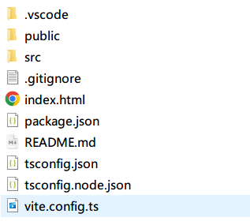
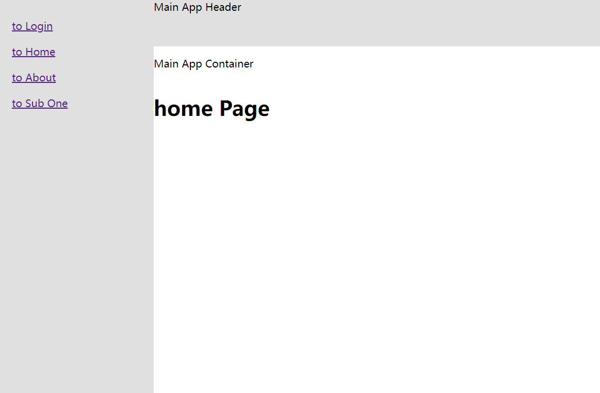

# qiankun

## 1. 介绍

**qiankun** 是蚂蚁金服基于 **Single SPA** 开发的一个微前端实现库，简化了微应用的注册方式，增加了微应用的沙箱管理(js、css隔离)与全局状态共享机制，并且 qiankun 内部实现了一个解析 **html** 字符串获取静态资源地址的解析库 [import-html-entry](https://github.com/kuitos/import-html-entry)，方便微应用接入与资源预加载。

虽然 **qiankun** 是基于 **Single SPA** 开发的，但是两者对项目的推荐架构有些许区别（个人理解，请轻喷）：

1. **Single SPA** 推荐 **动态模块加载** 的方式来搭建微前端架构，主应用作为一个纯净的“加载器”，仅提供一个基础 HTML 页面，配合 **SystemJS** 的 **importMap** 特性来加载微应用，所有微应用的注册以及版本管理通过 **import-map.json** 文件来控制。
2. **qiankun** 则依然推荐创建一个主应用（即使这个主应用只有一个 html 文件）来注册微应用并启动整个应用，依然需要在主应用中配置 **registerMicroApps** 和 **start** 方法。

> 虽然两者推荐的项目构建方式有些许区别，但是核心逻辑其实都是在主应用中通过引入 js 的方式来加载微应用。只是使用 **Single SPA** 来进行项目改造时，不仅需要在每个应用入口文件里面导出声明周期，还需要修改各自的路由配置、webpack打包配置等等；并且 **Single SPA** 也没有实现应用隔离、数据通信等功能，所以建议还是使用 **qiankun** 作为微前端框架选型。

## 2. 上手

> 这里可以根据 [qiankun / 项目实践](https://qiankun.umijs.org/zh/guide/tutorial) 的文档来使用

### 2.1 主应用

按照 **qiankun** 官方文档的说明，主应用主要用于提供一个 html 入口页面，以及注册微应用和启动项目。但是因为 **qiankun** 不支持 CDN 的方式引入，所以还是需要新建一个主应用工程。该工程包含一个 **index.html** 和一个 **index.js**，当然也需要 **package.json** 和 **webpack** 配置。

##### 2.1.1 创建 index.html

这个文件主要是用来提供一个 DOM 节点挂载微应用

```html
<!DOCTYPE html>
<html lang="en">
<head>
    <meta charset="UTF-8">
    <title>QianKun Example</title>
</head>
<body>
    <div class="main-app">
        <!-- 导航菜单  -->
        <ul class="main-app_side-menu">
            <li onclick="push('/vue')">Vue</li>
            <li onclick="push('/vue3')">Vue3</li>
        </ul>
        <!-- 子应用  -->
        <main id="sub-app_container"></main>
    </div>
    <script>
        // 应用切换
        function push(subapp) {
            history.pushState(null, subapp, subapp)
        }
    </script>
</body>
</html>
```

##### 2.1.2安装 qiankun 并配置微应用

首先，安装 **qiankun** 依赖

```shell
npm install qiankun
```

之后在 **index.js** 中注册两个微应用

```javascript
import { registerMicroApps, start } from 'qiankun';
// 注册微应用
registerMicroApps(
    [
        {
            name: 'vue',
            entry: '//localhost:3001',
            container: '#sub-app_container',
            loader,
            activeRule: '/vue',
        },
        {
            name: 'vue3',
            entry: '//localhost:3002',
            container: '#sub-app_container',
            loader,
            activeRule: '/vue3',
        },
    ],
    {
        beforeLoad: [
            (app) => console.log('[LifeCycle] before load %c%s', 'color: green;', app.name),
        ],
        beforeMount: [
            (app) => console.log('[LifeCycle] before mount %c%s', 'color: green;', app.name),
        ],
        afterUnmount: [
            (app) => console.log('[LifeCycle] after unmount %c%s', 'color: green;', app.name),
        ],
    },
);
// 启动
start()
```

当然，这里还需要配置 **webpack server** 和对应的 **loader**

```javascript
const HtmlWebpackPlugin = require('html-webpack-plugin');
module.exports = {
  entry: './index.js',
  devServer: {
    open: true,
    port: '3000',
    headers: {
      'Access-Control-Allow-Origin': '*',
    },
  },
  resolve: { extensions: ['.js'] },
  module: {
    rules: [
      {
        test: /\.js$/,
        exclude: /node_modules/,
        use: { loader: 'babel-loader' },
      }
    ],
  },
  plugins: [
    new HtmlWebpackPlugin({
      filename: 'index.html',
      template: './index.html',
      minify: {
        removeComments: true,
        collapseWhitespace: true,
      },
    }),
  ],
};
```

这样我们就算创建了一个基础的 **qiankun** 主应用了。

但是这个模板依然有很多缺陷，比如没有默认子应用、没有应用切换状态管理、没有状态数据等。所以一般推荐直接使用 **Vue** 或者 **React** 提供的脚手架直接创建一个新项目，再对其进行改造。

##### 2.1.3 通过脚手架配置完整的主应用

在很多场景下，主应用承担的都不仅是一个单纯的“微应用加载器”，更包含了项目的基础信息、权限校验、全局共享数据处理、第三方应用接入等等，所以这种情况下，上面所说的单纯的提供一个 html 页面和基础微应用注册脚本就不能满足我们的需求了。

目前个人觉得最好的方式还是使用脚手架或者内部的项目模板来创建主应用并改造。

因为笔者的常用框架是 Vue，所以这里的主应用也用 Vue CLI（主应用可以直接使用 Vite） 来搭建。

1. 第一步：通过 Vite 创建一个 Vue 项目。

```shell
# 创建一个 主应用项目
npm init vite@latest main-app -- --template vue-ts
```

这里使用的是社区的 Vue + TypeScript 的项目模板，创建结束会得到以下内容：




之后，便可以引入 **qiankun** 进行应用改造：

```shell
npm install qiankun
```

这里我们将**子应用注册的逻辑**提取出来放到单独的 **micro-apps.ts** 文件中

```typescript
import { registerMicroApps, start } from 'qiankun';
import NProgress from 'nprogress'
import "nprogress/nprogress.css";

// 加载动画
const setLoadingLoader = (loading: boolean) => {
  if (loading) {
    NProgress.start()
  } else {
    NProgress.done()
  }
}

// 子应用
const microApps = [
  {
    name: 'sub-app-one',
    entry: '//localhost:3001',
    activeRule: '/sub-one'
  }
]

// 生命周期处理
const lifeCycles = {
  beforeLoad: (app: any) => {
    console.log("before load app.name====>>>>>", app.name)
    return Promise.resolve(app)
  },
  beforeMount: (app: any) => {
    console.log("before mount app.name====>>>>>", app.name)
    return Promise.resolve(app)
  },
  afterMount: (app: any) => {
    console.log("after mount app.name====>>>>>", app.name)
    return Promise.resolve(app)
  }
}

// 子应用处理
const normalizeMicroApp = (apps = []) => {
  return apps.map((app: any) => ({
    container: '#sub-container',
    loader: setLoadingLoader,
    ...app
  }))
}

const register = () => registerMicroApps(normalizeMicroApp(microApps), lifeCycles)

export default {
    register,
    start
}
```

> 这里将生命周期配置和子应用配置单独提取了出来，对子应用的配置项做了一点点标准化处理，最后导出注册函数和原生的启动函数。
>
> 个人觉得这样的话逻辑会更加清晰一点，后面的配置默认加载应用等方式也可以这么设置

之后，在 **main.ts** 入口文件中引入该文件，并执行注册和启动即可。

```typescript
import { createApp } from 'vue'
import App from './App.vue'
import router from './router'
import microApps from "./micro-apps";

const app = createApp(App)
app.use(router)
app.mount('#app')

microApps.register()
microApps.start()
```

> 当然，因为我们的子应用配置的挂载目标是一个 ID 为 **sub-container** 的元素，所以还需要在 **App.vue** 中添加一个对应的 **Div**

##### 2.1.4 主应用路由与基础页面

为了让主应用不是一个纯粹的启动器，而是要负责系统的用户鉴权、页面布局、第三方页面嵌套等功能，这里我们假设主应用需要实现一个基础登录和页面布局。

首先，我们需要创建一个布局组件 **Layout**，一个登录页面 **Login**，与两个基础页面 **Home** 和 **About**。这里几个文件的大致内容如下：

```vue
// Login.vue
<template>
  <div class="Login">
    <h1>{{ name }} Page</h1>
    <router-link to="/home">登录</router-link>
  </div>
</template>
<script lang="ts">
import {defineComponent} from 'vue'
export default defineComponent({
  name: 'Login'
})
</script>

// Home.vue 和 About.vue，页面一样，所以只写了一个
<template>
  <div class="home">
    <h1>Home Page</h1>
  </div>
</template><script lang="ts">
import {defineComponent} from 'vue'
export default defineComponent({
  name: 'Home'
})
</script>

// Layout.vue，这里省略了样式部分
<template>
  <div class="main-content">
    <div class="main-slider">
      <router-link to="/login">to Login</router-link>
      <router-link to="/home">to Home</router-link>
      <router-link to="/about">to About</router-link>
      <router-link to="/sub-one">to Sub One</router-link>
    </div>
    <div class="main-header">
      Main App Header
    </div>
    <div class="main-container">
      <p>Main App Container</p>
      <router-view />
      <div id="sub-container"></div>
    </div>
  </div>
</template>
<script lang="ts">
import {defineComponent} from 'vue'
export default defineComponent({
  name: 'LayoutContent'
})
</script>
```

之后，我们还需要一个用来挂载所有子应用的通用页面组件 **SubApp.vue**，这个组件也很简单，只需要包含一个子应用注册时所使用的id的dom节点即可：

```vue
<template>
  <div class="sub-app">
    <h1>{{ name }} Page</h1>
    <!-- 子应用挂载节点 -->
    <div id="sub-container"></div>
  </div>
</template>
<script lang="ts">
import {defineComponent} from 'vue'
export default defineComponent({
  name: 'SubApp'
})
</script>

```

所有的页面准备好之后，我们再配置一下主页面的路由。

```typescript
import { createRouter, createWebHistory } from "vue-router";
import Layout from "../layout/Layout.vue"
import Home from "../views/home/index.vue"
import Login from "../views/login/index.vue"
import About from "../views/about/index.vue"
import SubApp from "../views/subapp/index.vue"

const router = createRouter({
  history: createWebHistory(import.meta.env.MODE === 'production' ? '/' : '/'),
  routes: [
    {
      path: '/login',
      name: 'login',
      component: Login
    },
    {
      path: '/',
      name: '',
      component: Layout,
      children: [
        {
          path: 'home',
          name: 'home',
          component: Home
        },
        {
          path: 'about',
          name: 'about',
          component: About
        },
        {
          // 匹配所有其他路由
          path: ':pathMatch(.*)*',
          name: 'sub',
          component: SubApp
        }
      ]
    },
  ],
  strict: true,
})

export default router
```

当然，这里也可以使用组件动态加载，但是个人觉得用来挂载微应用的那个组件还是直接引入好。另外这里还可以插入系统对应的 404,403 等页面。大致效果如下：



### 2.2 Vite 子应用

##### 2.2.1 Vite 子应用加载问题

在之前的介绍里面我们有提到，qiankun 是通过团队实现的 **import-html-entry** 这个库来解析子应用的入口 html 文件，获取到对应的 script、css 等资源之后在通过 **eval** 执行的。

但是 **Vite** 在开发模式下采用的是 GO 语言开发的 **esbuild** 来进行构建，并且只对 **vue, jsx, (le|sc)ss** 等文件进行简单的编辑和转换，直接以 **esm** 的形式提供给浏览器使用，所以 Vite 才能做到几乎秒开。

这两个问题已经导致了**开发环境**中 **qiankun 主应用** 没有办法直接加载 **Vite** 搭建的子应用项目；并且 **Vite** 是使用 **Rollup** 进行的代码打包，没有办法向 **Webpack** 一样支持运行时的 **publicPath**(也就是资源路径) ，所以即使部署到生产环境也会导致子应用图片、字体、css 样式等资源地址异常无法正常加载。

##### 2.2.2 解决 Vite 子应用集成

目前使用最多的方式，是通过引入插件 **[vite-plugin-qiankun](https://github.com/tengmaoqing/vite-plugin-qiankun)** 来解决。该插件介绍如下：

- 保留vite构建es模块的优势
- 一键配置，不影响已有的vite配置
- 支持vite开发环境

**首先，在子应用中安装 vite-plugin-qiankun**

```shell
npm install vite-plugin-qiankun
```

**修改 vite.config 配置**

```javascript
import { defineConfig } from 'vite'
import vue from '@vitejs/plugin-vue'
import qiankun from 'vite-plugin-qiankun';

export default defineConfig({
  plugins: [
    vue(),
    // 需要在这里注册子应用名称，
    qiankun('sub-app-one', {
      useDevMode: true
    })
  ],
  server: {
    port: 3001,
    cors: true // 需要开启跨域！
  },
})
```

**然后，在入口文件 main.ts 中初始化子应用**

```typescript
import { createApp } from 'vue'
import { createRouter, createWebHistory } from 'vue-router';
import { renderWithQiankun, qiankunWindow } from "vite-plugin-qiankun/dist/helper"

import App from './App.vue'
import routes from "./router";

let router = null;
let instance: any = null;
let history: any = null;

function render(props = {}) {
    const { container } = props;
    history = createWebHistory(qiankunWindow.__POWERED_BY_QIANKUN__ ? '/sub-one' : '/');
    router = createRouter({
        history,
        routes,
    });
    instance = createApp(App);
    instance.use(router);
    instance.mount(container ? container.querySelector('#app') :document.getElementById("app"));
    if (qiankunWindow.__POWERED_BY_QIANKUN__) {
        console.log('我正在作为子应用运行')
    }
}

renderWithQiankun({
    bootstrap() {
        console.log('sub app one bootstrap')
    },
    mount(props) {
        console.log('sub app one mount')
        render(props);
    },
    update() {
        console.log('sub app one update')
    },
    unmount(props) {
        console.log('sub app one unmount')
        instance.unmount();
        instance._container.innerHTML = '';
        history.destroy();
        router = null;
        instance = null;
    }
});

if (!qiankunWindow.__POWERED_BY_QIANKUN__) {
    render();
}
```

> 到这里一个子应用就基本注册成功了，已经可以简单使用。


### 2.3 Webpack 子应用

采用 Webpack （包含 Vue CLi，React CLI 等基于 Webpack 的脚手架）创建的子应用，在接入 qiankun 时是比较简单的，对原始项目侵入性比较小。

这里还是以 Vue 应用为例，根据官网介绍进行说明：

##### 2.3.1 创建 public-path.js 文件，通过判断 window 属性来设置运行时资源路径

```javascript
if (window.__POWERED_BY_QIANKUN__) {
  __webpack_public_path__ = window.__INJECTED_PUBLIC_PATH_BY_QIANKUN__;
}
```

##### 2.3.2 修改入口文件，配置生命周期

```javascript
import './public-path';
import Vue from 'vue';
import VueRouter from 'vue-router';
import App from './App.vue';
import routes from './router';
import store from './store';

Vue.config.productionTip = false;

let router = null;
let instance = null;
function render(props = {}) {
  const { container } = props;
  router = new VueRouter({
    base: window.__POWERED_BY_QIANKUN__ ? '/app-vue/' : '/',
    mode: 'history',
    routes,
  });

  instance = new Vue({
    router,
    store,
    render: (h) => h(App),
  }).$mount(container ? container.querySelector('#app') : '#app');
}

// 独立运行时
if (!window.__POWERED_BY_QIANKUN__) {
  render();
}

export async function bootstrap() {
  console.log('[vue] vue app bootstraped');
}
export async function mount(props) {
  console.log('[vue] props from main framework', props);
  render(props);
}
export async function unmount() {
  instance.$destroy();
  instance.$el.innerHTML = '';
  instance = null;
  router = null;
}
```

> 这里有以下几点需要注意：
>
> 1. 不管是 React ，Angular 还是 Vue，路由模式都只能使用 **history** 模式，并且需要根据之前注册的微应用 **activeRule** 规则来设置 base 路径
> 2. 需要在文件头部引入 **public-path.js**
> 3. 在 **mounted** 阶段会实例化单页子应用，在实例化子应用时，需要根据传入参数中的 **container** 来往下查找挂载节点，不然会导致与其他应用或者模块冲突
> 4. **unmount** 阶段需要销毁原有实例，并从父节点中移除到子应用的 dom 结构；Vue 应用还需要 **销毁路由实例**

##### 2.3.3 修改 Webpack 配置

因为 Webpack 在开发环境本身也会将源代码进行一次编译，所以在开发环境时并不需要在编译方面进行过多配置，只需要修改 Server 跨域配置和打包配置，调整输出代码格式即可。

```javascript
const { name } = require('./package');
module.exports = {
  devServer: {
    headers: {
      'Access-Control-Allow-Origin': '*',
    },
  },
  configureWebpack: {
    output: {
      library: `${name}-[name]`,
      libraryTarget: 'umd', // 把微应用打包成 umd 库格式
      jsonpFunction: `webpackJsonp_${name}`,
    },
  },
};
```

> React 应用和 Angular 应用在 Webpack 方面的配置与 Vue 基本相似，只是在 mian.js （也就是主入口文件）内的应用实例化有一些区别。
>
> 但 Angular 应用因为需要引入 **zone.js**，所以需要进行[其他调整](https://qiankun.umijs.org/zh/guide/tutorial#angular-%E5%BE%AE%E5%BA%94%E7%94%A8)
