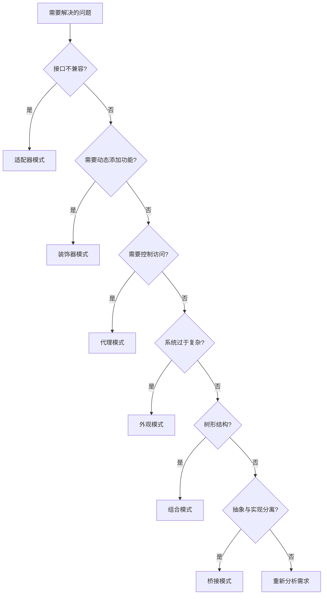

# 结构型模式：优雅组合的艺术

> 如果说创建型模式是"生产"对象的艺术，那么结构型模式就是"组装"对象的艺术。今天我们来看看如何优雅地组合对象，让代码结构更加清晰、灵活。

## 前言：为什么需要结构型模式？

想象一下，你正在开发一个复杂的前端应用，随着功能的增加，你发现：

- 组件之间的关系越来越复杂，难以维护
- 想要复用某些功能，但代码耦合度太高
- 需要适配不同的接口，但改动成本很大
- 想要动态地给对象添加功能，但不想修改原有代码

这时候，结构型模式就派上用场了。它们专注于如何将类或对象组合成更大的结构，让系统更加灵活和可扩展。

## 一、适配器模式：接口转换的"翻译官"

### 1.1 什么是适配器模式？

适配器模式允许接口不兼容的类一起工作，它充当两个不兼容接口之间的桥梁。在前端开发中，这种模式非常常见：

- 第三方库的接口适配
- 新旧 API 的兼容
- 不同数据格式的转换

### 1.2 第三方库适配实战

假设我们要集成多个地图服务提供商，但它们的 API 接口各不相同：

```javascript
// 百度地图 API（假设的接口）
class BaiduMap {
  constructor(container) {
    this.container = container;
    this.map = null;
  }
  
  init(lat, lng, zoom) {
    console.log(`初始化百度地图: 纬度${lat}, 经度${lng}, 缩放${zoom}`);
    this.map = {
      center: { lat, lng },
      zoom,
      type: 'baidu'
    };
  }
  
  addMarker(lat, lng, title, icon) {
    console.log(`百度地图添加标记: ${title} at (${lat}, ${lng})`);
    return {
      id: Date.now(),
      position: { lat, lng },
      title,
      icon
    };
  }
  
  setCenter(lat, lng) {
    console.log(`百度地图设置中心点: (${lat}, ${lng})`);
    this.map.center = { lat, lng };
  }
}

// 高德地图 API（假设的接口）
class AMapAPI {
  constructor(containerId) {
    this.containerId = containerId;
    this.mapInstance = null;
  }
  
  create(options) {
    const { center, zoomLevel } = options;
    console.log(`创建高德地图: 中心点[${center[0]}, ${center[1]}], 缩放级别${zoomLevel}`);
    this.mapInstance = {
      centerPoint: center,
      zoomLevel,
      type: 'amap'
    };
  }
  
  createMarker(position, options) {
    const { title, iconUrl } = options;
    console.log(`高德地图创建标记: ${title} at [${position[0]}, ${position[1]}]`);
    return {
      markerId: Date.now(),
      pos: position,
      title,
      iconUrl
    };
  }
  
  panTo(position) {
    console.log(`高德地图移动到: [${position[0]}, ${position[1]}]`);
    this.mapInstance.centerPoint = position;
  }
}

// 谷歌地图 API（假设的接口）
class GoogleMaps {
  constructor(element) {
    this.element = element;
    this.googleMap = null;
  }
  
  initialize(config) {
    const { lat, lng, zoom } = config;
    console.log(`初始化谷歌地图: 坐标(${lat}, ${lng}), 缩放${zoom}`);
    this.googleMap = {
      location: { latitude: lat, longitude: lng },
      zoomLevel: zoom,
      type: 'google'
    };
  }
  
  placeMarker(coords, markerOptions) {
    const { lat, lng } = coords;
    const { label, icon } = markerOptions;
    console.log(`谷歌地图放置标记: ${label} at (${lat}, ${lng})`);
    return {
      uuid: Date.now(),
      coordinates: { lat, lng },
      label,
      icon
    };
  }
  
  moveCenter(coords) {
    const { lat, lng } = coords;
    console.log(`谷歌地图移动中心: (${lat}, ${lng})`);
    this.googleMap.location = { latitude: lat, longitude: lng };
  }
}

// 统一的地图接口
class UnifiedMapInterface {
  initialize(lat, lng, zoom) {
    throw new Error('initialize 方法必须被实现');
  }
  
  addMarker(lat, lng, title, icon) {
    throw new Error('addMarker 方法必须被实现');
  }
  
  setCenter(lat, lng) {
    throw new Error('setCenter 方法必须被实现');
  }
  
  getMapInfo() {
    throw new Error('getMapInfo 方法必须被实现');
  }
}

// 百度地图适配器
class BaiduMapAdapter extends UnifiedMapInterface {
  constructor(container) {
    super();
    this.baiduMap = new BaiduMap(container);
  }
  
  initialize(lat, lng, zoom) {
    this.baiduMap.init(lat, lng, zoom);
  }
  
  addMarker(lat, lng, title, icon) {
    return this.baiduMap.addMarker(lat, lng, title, icon);
  }
  
  setCenter(lat, lng) {
    this.baiduMap.setCenter(lat, lng);
  }
  
  getMapInfo() {
    return {
      provider: 'baidu',
      center: this.baiduMap.map?.center,
      zoom: this.baiduMap.map?.zoom
    };
  }
}

// 高德地图适配器
class AMapAdapter extends UnifiedMapInterface {
  constructor(container) {
    super();
    this.amap = new AMapAPI(container);
  }
  
  initialize(lat, lng, zoom) {
    this.amap.create({
      center: [lng, lat], // 注意：高德地图是经度在前
      zoomLevel: zoom
    });
  }
  
  addMarker(lat, lng, title, icon) {
    return this.amap.createMarker([lng, lat], {
      title,
      iconUrl: icon
    });
  }
  
  setCenter(lat, lng) {
    this.amap.panTo([lng, lat]);
  }
  
  getMapInfo() {
    const center = this.amap.mapInstance?.centerPoint;
    return {
      provider: 'amap',
      center: center ? { lat: center[1], lng: center[0] } : null,
      zoom: this.amap.mapInstance?.zoomLevel
    };
  }
}

// 谷歌地图适配器
class GoogleMapAdapter extends UnifiedMapInterface {
  constructor(container) {
    super();
    this.googleMap = new GoogleMaps(container);
  }
  
  initialize(lat, lng, zoom) {
    this.googleMap.initialize({ lat, lng, zoom });
  }
  
  addMarker(lat, lng, title, icon) {
    return this.googleMap.placeMarker(
      { lat, lng },
      { label: title, icon }
    );
  }
  
  setCenter(lat, lng) {
    this.googleMap.moveCenter({ lat, lng });
  }
  
  getMapInfo() {
    const location = this.googleMap.googleMap?.location;
    return {
      provider: 'google',
      center: location ? { lat: location.latitude, lng: location.longitude } : null,
      zoom: this.googleMap.googleMap?.zoomLevel
    };
  }
}

// 地图工厂
class MapFactory {
  static createMap(provider, container) {
    switch (provider) {
      case 'baidu':
        return new BaiduMapAdapter(container);
      case 'amap':
        return new AMapAdapter(container);
      case 'google':
        return new GoogleMapAdapter(container);
      default:
        throw new Error(`不支持的地图提供商: ${provider}`);
    }
  }
  
  static getSupportedProviders() {
    return ['baidu', 'amap', 'google'];
  }
}

// 地图管理器
class MapManager {
  constructor() {
    this.maps = new Map();
    this.currentProvider = null;
  }
  
  // 初始化地图
  async initializeMap(provider, container, lat, lng, zoom) {
    try {
      const map = MapFactory.createMap(provider, container);
      map.initialize(lat, lng, zoom);
      
      this.maps.set(provider, map);
      this.currentProvider = provider;
      
      console.log(`✅ ${provider} 地图初始化成功`);
      return map;
    } catch (error) {
      console.error(`❌ ${provider} 地图初始化失败:`, error.message);
      throw error;
    }
  }
  
  // 切换地图提供商
  switchProvider(newProvider) {
    if (!this.maps.has(newProvider)) {
      throw new Error(`地图提供商 ${newProvider} 尚未初始化`);
    }
    
    const oldProvider = this.currentProvider;
    this.currentProvider = newProvider;
    
    console.log(`🔄 从 ${oldProvider} 切换到 ${newProvider}`);
    return this.getCurrentMap();
  }
  
  // 获取当前地图
  getCurrentMap() {
    if (!this.currentProvider || !this.maps.has(this.currentProvider)) {
      throw new Error('没有可用的地图实例');
    }
    
    return this.maps.get(this.currentProvider);
  }
  
  // 在所有地图上添加标记
  addMarkerToAll(lat, lng, title, icon) {
    const results = [];
    
    for (const [provider, map] of this.maps) {
      try {
        const marker = map.addMarker(lat, lng, title, icon);
        results.push({ provider, marker, success: true });
      } catch (error) {
        results.push({ provider, error: error.message, success: false });
      }
    }
    
    return results;
  }
  
  // 获取所有地图信息
  getAllMapInfo() {
    const info = {};
    
    for (const [provider, map] of this.maps) {
      info[provider] = map.getMapInfo();
    }
    
    return info;
  }
}

// 使用示例
async function mapDemo() {
  const mapManager = new MapManager();
  
  console.log('=== 支持的地图提供商 ===');
  console.log(MapFactory.getSupportedProviders());
  
  console.log('\n=== 初始化不同的地图 ===');
  const lat = 39.9042, lng = 116.4074, zoom = 10; // 北京坐标
  
  await mapManager.initializeMap('baidu', 'baidu-container', lat, lng, zoom);
  await mapManager.initializeMap('amap', 'amap-container', lat, lng, zoom);
  await mapManager.initializeMap('google', 'google-container', lat, lng, zoom);
  
  console.log('\n=== 在当前地图添加标记 ===');
  const currentMap = mapManager.getCurrentMap();
  currentMap.addMarker(lat, lng, '北京', 'beijing-icon.png');
  
  console.log('\n=== 切换地图提供商 ===');
  mapManager.switchProvider('amap');
  mapManager.getCurrentMap().setCenter(31.2304, 121.4737); // 上海坐标
  
  console.log('\n=== 在所有地图添加标记 ===');
  const results = mapManager.addMarkerToAll(31.2304, 121.4737, '上海', 'shanghai-icon.png');
  results.forEach(result => {
    if (result.success) {
      console.log(`✅ ${result.provider}: 标记添加成功`);
    } else {
      console.log(`❌ ${result.provider}: ${result.error}`);
    }
  });
  
  console.log('\n=== 获取所有地图信息 ===');
  const allMapInfo = mapManager.getAllMapInfo();
  console.log(JSON.stringify(allMapInfo, null, 2));
}

mapDemo();
```

### 1.3 数据格式适配器

在实际开发中，我们经常需要处理不同格式的数据：

```javascript
// 不同的数据源格式
class RestAPIDataSource {
  async fetchUsers() {
    // 模拟 REST API 返回的数据格式
    return {
      status: 'success',
      data: {
        users: [
          { id: 1, name: 'John Doe', email: 'john@example.com', age: 30 },
          { id: 2, name: 'Jane Smith', email: 'jane@example.com', age: 25 }
        ],
        total: 2,
        page: 1,
        pageSize: 10
      }
    };
  }
  
  async fetchUserById(id) {
    return {
      status: 'success',
      data: {
        user: { id, name: 'John Doe', email: 'john@example.com', age: 30 }
      }
    };
  }
}

class GraphQLDataSource {
  async query(query, variables = {}) {
    // 模拟 GraphQL 返回的数据格式
    if (query.includes('users')) {
      return {
        data: {
          users: {
            nodes: [
              { userId: 1, fullName: 'John Doe', emailAddress: 'john@example.com', userAge: 30 },
              { userId: 2, fullName: 'Jane Smith', emailAddress: 'jane@example.com', userAge: 25 }
            ],
            totalCount: 2,
            pageInfo: {
              hasNextPage: false,
              hasPreviousPage: false
            }
          }
        }
      };
    }
    
    if (query.includes('user') && variables.id) {
      return {
        data: {
          user: {
            userId: variables.id,
            fullName: 'John Doe',
            emailAddress: 'john@example.com',
            userAge: 30
          }
        }
      };
    }
  }
}

class WebSocketDataSource {
  constructor() {
    this.listeners = new Map();
    this.connected = false;
  }
  
  connect() {
    this.connected = true;
    console.log('WebSocket 连接已建立');
    
    // 模拟接收实时数据
    setTimeout(() => {
      this.emit('userUpdate', {
        type: 'USER_UPDATED',
        payload: {
          user_id: 1,
          user_name: 'John Doe Updated',
          user_email: 'john.updated@example.com',
          user_age: 31,
          timestamp: Date.now()
        }
      });
    }, 2000);
  }
  
  subscribe(event, callback) {
    if (!this.listeners.has(event)) {
      this.listeners.set(event, []);
    }
    this.listeners.get(event).push(callback);
  }
  
  emit(event, data) {
    if (this.listeners.has(event)) {
      this.listeners.get(event).forEach(callback => callback(data));
    }
  }
}

// 统一的数据接口
class UnifiedDataInterface {
  async getUsers(options = {}) {
    throw new Error('getUsers 方法必须被实现');
  }
  
  async getUserById(id) {
    throw new Error('getUserById 方法必须被实现');
  }
  
  subscribeToUpdates(callback) {
    throw new Error('subscribeToUpdates 方法必须被实现');
  }
}

// REST API 适配器
class RestAPIAdapter extends UnifiedDataInterface {
  constructor() {
    super();
    this.dataSource = new RestAPIDataSource();
  }
  
  async getUsers(options = {}) {
    const response = await this.dataSource.fetchUsers();
    
    // 转换为统一格式
    return {
      users: response.data.users.map(user => ({
        id: user.id,
        name: user.name,
        email: user.email,
        age: user.age
      })),
      total: response.data.total,
      pagination: {
        page: response.data.page,
        pageSize: response.data.pageSize,
        hasNext: response.data.total > response.data.page * response.data.pageSize
      }
    };
  }
  
  async getUserById(id) {
    const response = await this.dataSource.fetchUserById(id);
    
    return {
      id: response.data.user.id,
      name: response.data.user.name,
      email: response.data.user.email,
      age: response.data.user.age
    };
  }
  
  subscribeToUpdates(callback) {
    console.log('REST API 不支持实时更新订阅');
    return () => {}; // 返回空的取消订阅函数
  }
}

// GraphQL 适配器
class GraphQLAdapter extends UnifiedDataInterface {
  constructor() {
    super();
    this.dataSource = new GraphQLDataSource();
  }
  
  async getUsers(options = {}) {
    const query = `
      query GetUsers {
        users {
          nodes {
            userId
            fullName
            emailAddress
            userAge
          }
          totalCount
          pageInfo {
            hasNextPage
            hasPreviousPage
          }
        }
      }
    `;
    
    const response = await this.dataSource.query(query);
    
    // 转换为统一格式
    return {
      users: response.data.users.nodes.map(user => ({
        id: user.userId,
        name: user.fullName,
        email: user.emailAddress,
        age: user.userAge
      })),
      total: response.data.users.totalCount,
      pagination: {
        hasNext: response.data.users.pageInfo.hasNextPage,
        hasPrevious: response.data.users.pageInfo.hasPreviousPage
      }
    };
  }
  
  async getUserById(id) {
    const query = `
      query GetUser($id: ID!) {
        user(id: $id) {
          userId
          fullName
          emailAddress
          userAge
        }
      }
    `;
    
    const response = await this.dataSource.query(query, { id });
    
    return {
      id: response.data.user.userId,
      name: response.data.user.fullName,
      email: response.data.user.emailAddress,
      age: response.data.user.userAge
    };
  }
  
  subscribeToUpdates(callback) {
    console.log('GraphQL 订阅功能需要额外实现');
    return () => {};
  }
}

// WebSocket 适配器
class WebSocketAdapter extends UnifiedDataInterface {
  constructor() {
    super();
    this.dataSource = new WebSocketDataSource();
    this.cache = new Map();
  }
  
  async getUsers(options = {}) {
    // WebSocket 通常不用于获取列表数据，这里返回缓存的数据
    if (this.cache.has('users')) {
      return this.cache.get('users');
    }
    
    // 如果没有缓存，返回空数据
    return {
      users: [],
      total: 0,
      pagination: { hasNext: false }
    };
  }
  
  async getUserById(id) {
    // 从缓存中获取用户数据
    const cacheKey = `user:${id}`;
    if (this.cache.has(cacheKey)) {
      return this.cache.get(cacheKey);
    }
    
    throw new Error(`用户 ${id} 不在缓存中`);
  }
  
  subscribeToUpdates(callback) {
    if (!this.dataSource.connected) {
      this.dataSource.connect();
    }
    
    this.dataSource.subscribe('userUpdate', (data) => {
      // 转换 WebSocket 数据格式为统一格式
      const user = {
        id: data.payload.user_id,
        name: data.payload.user_name,
        email: data.payload.user_email,
        age: data.payload.user_age
      };
      
      // 更新缓存
      this.cache.set(`user:${user.id}`, user);
      
      // 调用回调函数
      callback({
        type: 'USER_UPDATED',
        user,
        timestamp: data.payload.timestamp
      });
    });
    
    return () => {
      console.log('取消 WebSocket 订阅');
    };
  }
}

// 数据源管理器
class DataSourceManager {
  constructor() {
    this.adapters = new Map();
    this.currentAdapter = null;
  }
  
  registerAdapter(name, adapter) {
    this.adapters.set(name, adapter);
    console.log(`✅ 注册数据适配器: ${name}`);
  }
  
  setCurrentAdapter(name) {
    if (!this.adapters.has(name)) {
      throw new Error(`数据适配器 ${name} 不存在`);
    }
    
    this.currentAdapter = name;
    console.log(`🔄 切换到数据适配器: ${name}`);
  }
  
  getCurrentAdapter() {
    if (!this.currentAdapter || !this.adapters.has(this.currentAdapter)) {
      throw new Error('没有可用的数据适配器');
    }
    
    return this.adapters.get(this.currentAdapter);
  }
  
  async getUsers(options) {
    const adapter = this.getCurrentAdapter();
    return await adapter.getUsers(options);
  }
  
  async getUserById(id) {
    const adapter = this.getCurrentAdapter();
    return await adapter.getUserById(id);
  }
  
  subscribeToUpdates(callback) {
    const adapter = this.getCurrentAdapter();
    return adapter.subscribeToUpdates(callback);
  }
  
  // 聚合多个数据源的数据
  async aggregateUsers() {
    const results = {};
    
    for (const [name, adapter] of this.adapters) {
      try {
        const data = await adapter.getUsers();
        results[name] = {
          success: true,
          data,
          userCount: data.users.length
        };
      } catch (error) {
        results[name] = {
          success: false,
          error: error.message
        };
      }
    }
    
    return results;
  }
}

// 使用示例
async function dataAdapterDemo() {
  const dataManager = new DataSourceManager();
  
  // 注册不同的数据适配器
  dataManager.registerAdapter('rest', new RestAPIAdapter());
  dataManager.registerAdapter('graphql', new GraphQLAdapter());
  dataManager.registerAdapter('websocket', new WebSocketAdapter());
  
  console.log('\n=== 使用 REST API 获取数据 ===');
  dataManager.setCurrentAdapter('rest');
  const restUsers = await dataManager.getUsers();
  console.log('REST 用户数据:', JSON.stringify(restUsers, null, 2));
  
  const restUser = await dataManager.getUserById(1);
  console.log('REST 单个用户:', JSON.stringify(restUser, null, 2));
  
  console.log('\n=== 使用 GraphQL 获取数据 ===');
  dataManager.setCurrentAdapter('graphql');
  const graphqlUsers = await dataManager.getUsers();
  console.log('GraphQL 用户数据:', JSON.stringify(graphqlUsers, null, 2));
  
  console.log('\n=== 订阅 WebSocket 实时更新 ===');
  dataManager.setCurrentAdapter('websocket');
  const unsubscribe = dataManager.subscribeToUpdates((update) => {
    console.log('📡 收到实时更新:', JSON.stringify(update, null, 2));
  });
  
  console.log('\n=== 聚合所有数据源 ===');
  const aggregatedData = await dataManager.aggregateUsers();
  console.log('聚合数据:', JSON.stringify(aggregatedData, null, 2));
  
  // 3秒后取消订阅
  setTimeout(() => {
    unsubscribe();
    console.log('\n📴 已取消 WebSocket 订阅');
  }, 3000);
}

dataAdapterDemo();
```

## 二、装饰器模式：动态增强对象功能

### 2.1 什么是装饰器模式？

装饰器模式允许向一个现有的对象添加新的功能，同时又不改变其结构。这种模式创建了一个装饰类，用来包装原有的类，并在保持类方法签名完整性的前提下，提供了额外的功能。

### 2.2 函数装饰器实战

```javascript
// 基础的日志装饰器
function logDecorator(target, propertyKey, descriptor) {
  const originalMethod = descriptor.value;
  
  descriptor.value = function(...args) {
    console.log(`🚀 调用方法: ${propertyKey}`);
    console.log(`📥 参数:`, args);
    
    const startTime = performance.now();
    const result = originalMethod.apply(this, args);
    const endTime = performance.now();
    
    console.log(`📤 返回值:`, result);
    console.log(`⏱️ 执行时间: ${(endTime - startTime).toFixed(2)}ms`);
    
    return result;
  };
  
  return descriptor;
}

// 缓存装饰器
function cacheDecorator(ttl = 60000) { // 默认缓存1分钟
  const cache = new Map();
  
  return function(target, propertyKey, descriptor) {
    const originalMethod = descriptor.value;
    
    descriptor.value = function(...args) {
      const cacheKey = `${propertyKey}:${JSON.stringify(args)}`;
      const cached = cache.get(cacheKey);
      
      if (cached && Date.now() - cached.timestamp < ttl) {
        console.log(`💾 缓存命中: ${propertyKey}`);
        return cached.value;
      }
      
      const result = originalMethod.apply(this, args);
      cache.set(cacheKey, {
        value: result,
        timestamp: Date.now()
      });
      
      console.log(`💿 缓存存储: ${propertyKey}`);
      return result;
    };
    
    return descriptor;
  };
}

// 重试装饰器
function retryDecorator(maxRetries = 3, delay = 1000) {
  return function(target, propertyKey, descriptor) {
    const originalMethod = descriptor.value;
    
    descriptor.value = async function(...args) {
      let lastError;
      
      for (let attempt = 1; attempt <= maxRetries; attempt++) {
        try {
          console.log(`🔄 尝试 ${attempt}/${maxRetries}: ${propertyKey}`);
          return await originalMethod.apply(this, args);
        } catch (error) {
          lastError = error;
          console.log(`❌ 尝试 ${attempt} 失败:`, error.message);
          
          if (attempt < maxRetries) {
            console.log(`⏳ 等待 ${delay}ms 后重试...`);
            await new Promise(resolve => setTimeout(resolve, delay));
          }
        }
      }
      
      console.log(`💥 所有重试都失败了`);
      throw lastError;
    };
    
    return descriptor;
  };
}

// 权限检查装饰器
function requirePermission(permission) {
  return function(target, propertyKey, descriptor) {
    const originalMethod = descriptor.value;
    
    descriptor.value = function(...args) {
      // 模拟权限检查
      const userPermissions = this.currentUser?.permissions || [];
      
      if (!userPermissions.includes(permission)) {
        throw new Error(`权限不足: 需要 ${permission} 权限`);
      }
      
      console.log(`✅ 权限检查通过: ${permission}`);
      return originalMethod.apply(this, args);
    };
    
    return descriptor;
  };
}

// 性能监控装饰器
function performanceMonitor(target, propertyKey, descriptor) {
  const originalMethod = descriptor.value;
  const metrics = {
    callCount: 0,
    totalTime: 0,
    averageTime: 0,
    minTime: Infinity,
    maxTime: 0
  };
  
  descriptor.value = function(...args) {
    const startTime = performance.now();
    const result = originalMethod.apply(this, args);
    const endTime = performance.now();
    const executionTime = endTime - startTime;
    
    // 更新性能指标
    metrics.callCount++;
    metrics.totalTime += executionTime;
    metrics.averageTime = metrics.totalTime / metrics.callCount;
    metrics.minTime = Math.min(metrics.minTime, executionTime);
    metrics.maxTime = Math.max(metrics.maxTime, executionTime);
    
    // 存储到全局性能监控器
    if (!window.performanceMetrics) {
      window.performanceMetrics = {};
    }
    window.performanceMetrics[`${target.constructor.name}.${propertyKey}`] = metrics;
    
    return result;
  };
  
  return descriptor;
}

// 使用装饰器的服务类
class UserService {
  constructor() {
    this.currentUser = null;
    this.users = [
      { id: 1, name: 'John', permissions: ['read', 'write'] },
      { id: 2, name: 'Jane', permissions: ['read'] },
      { id: 3, name: 'Admin', permissions: ['read', 'write', 'delete'] }
    ];
  }
  
  setCurrentUser(user) {
    this.currentUser = user;
    console.log(`👤 当前用户: ${user.name}`);
  }
  
  @logDecorator
  @performanceMonitor
  @cacheDecorator(30000) // 缓存30秒
  getUserById(id) {
    console.log(`🔍 从数据库查询用户 ${id}`);
    // 模拟数据库查询延迟
    const start = Date.now();
    while (Date.now() - start < 100) {} // 模拟100ms延迟
    
    const user = this.users.find(u => u.id === id);
    if (!user) {
      throw new Error(`用户 ${id} 不存在`);
    }
    
    return user;
  }
  
  @logDecorator
  @requirePermission('write')
  updateUser(id, updates) {
    const user = this.getUserById(id);
    Object.assign(user, updates);
    console.log(`✏️ 用户 ${id} 已更新`);
    return user;
  }
  
  @logDecorator
  @requirePermission('delete')
  deleteUser(id) {
    const index = this.users.findIndex(u => u.id === id);
    if (index === -1) {
      throw new Error(`用户 ${id} 不存在`);
    }
    
    const deletedUser = this.users.splice(index, 1)[0];
    console.log(`🗑️ 用户 ${id} 已删除`);
    return deletedUser;
  }
  
  @retryDecorator(3, 500)
  async fetchUserFromAPI(id) {
    console.log(`🌐 从 API 获取用户 ${id}`);
    
    // 模拟网络请求，70% 的概率失败
    if (Math.random() < 0.7) {
      throw new Error('网络请求失败');
    }
    
    return {
      id,
      name: `API User ${id}`,
      source: 'api'
    };
  }
}

// 函数式装饰器（不使用 ES6 装饰器语法）
function createDecoratedFunction(originalFn, decorators) {
  return decorators.reduce((fn, decorator) => decorator(fn), originalFn);
}

// 创建装饰器函数
function createLogDecorator() {
  return function(fn) {
    return function(...args) {
      console.log(`🚀 调用函数: ${fn.name}`);
      console.log(`📥 参数:`, args);
      
      const result = fn.apply(this, args);
      
      console.log(`📤 返回值:`, result);
      return result;
    };
  };
}

function createCacheDecorator(ttl = 60000) {
  const cache = new Map();
  
  return function(fn) {
    return function(...args) {
      const cacheKey = `${fn.name}:${JSON.stringify(args)}`;
      const cached = cache.get(cacheKey);
      
      if (cached && Date.now() - cached.timestamp < ttl) {
        console.log(`💾 缓存命中: ${fn.name}`);
        return cached.value;
      }
      
      const result = fn.apply(this, args);
      cache.set(cacheKey, {
        value: result,
        timestamp: Date.now()
      });
      
      console.log(`💿 缓存存储: ${fn.name}`);
      return result;
    };
  };
}

// 使用函数式装饰器
function calculateFibonacci(n) {
  if (n <= 1) return n;
  return calculateFibonacci(n - 1) + calculateFibonacci(n - 2);
}

// 装饰斐波那契函数
const decoratedFibonacci = createDecoratedFunction(
  calculateFibonacci,
  [
    createLogDecorator(),
    createCacheDecorator(60000)
  ]
);

// 使用示例
async function decoratorDemo() {
  const userService = new UserService();
  
  console.log('=== 设置当前用户 ===');
  userService.setCurrentUser({ name: 'John', permissions: ['read', 'write'] });
  
  console.log('\n=== 测试缓存装饰器 ===');
  console.log('第一次查询:');
  userService.getUserById(1);
  
  console.log('\n第二次查询（应该命中缓存）:');
  userService.getUserById(1);
  
  console.log('\n=== 测试权限装饰器 ===');
  try {
    userService.updateUser(1, { name: 'John Updated' });
  } catch (error) {
    console.log('❌ 权限错误:', error.message);
  }
  
  console.log('\n=== 测试权限不足 ===');
  userService.setCurrentUser({ name: 'Jane', permissions: ['read'] });
  try {
    userService.deleteUser(1);
  } catch (error) {
    console.log('❌ 权限错误:', error.message);
  }
  
  console.log('\n=== 测试重试装饰器 ===');
  try {
    const apiUser = await userService.fetchUserFromAPI(999);
    console.log('✅ API 用户:', apiUser);
  } catch (error) {
    console.log('❌ 最终失败:', error.message);
  }
  
  console.log('\n=== 测试函数式装饰器 ===');
  console.log('计算斐波那契数列:');
  decoratedFibonacci(10);
  decoratedFibonacci(10); // 第二次应该命中缓存
  
  console.log('\n=== 性能监控结果 ===');
  console.log(window.performanceMetrics);
}

decoratorDemo();
```

### 2.3 React 高阶组件（HOC）装饰器

```javascript
// React 组件装饰器示例
import React, { useState, useEffect, useRef } from 'react';

// 加载状态装饰器
function withLoading(WrappedComponent) {
  return function LoadingComponent(props) {
    const [isLoading, setIsLoading] = useState(false);
    
    const enhancedProps = {
      ...props,
      isLoading,
      setLoading: setIsLoading
    };
    
    if (isLoading) {
      return (
        <div className="loading-container">
          <div className="spinner">⏳ 加载中...</div>
        </div>
      );
    }
    
    return <WrappedComponent {...enhancedProps} />;
  };
}

// 错误边界装饰器
class ErrorBoundary extends React.Component {
  constructor(props) {
    super(props);
    this.state = { hasError: false, error: null };
  }
  
  static getDerivedStateFromError(error) {
    return { hasError: true, error };
  }
  
  componentDidCatch(error, errorInfo) {
    console.error('组件错误:', error, errorInfo);
  }
  
  render() {
    if (this.state.hasError) {
      return (
        <div className="error-container">
          <h3>❌ 出错了</h3>
          <p>{this.state.error?.message}</p>
          <button onClick={() => this.setState({ hasError: false, error: null })}>
            重试
          </button>
        </div>
      );
    }
    
    return this.props.children;
  }
}

function withErrorBoundary(WrappedComponent) {
  return function ErrorBoundaryComponent(props) {
    return (
      <ErrorBoundary>
        <WrappedComponent {...props} />
      </ErrorBoundary>
    );
  };
}

// 权限控制装饰器
function withPermission(requiredPermissions) {
  return function(WrappedComponent) {
    return function PermissionComponent(props) {
      const userPermissions = props.userPermissions || [];
      
      const hasPermission = requiredPermissions.every(permission => 
        userPermissions.includes(permission)
      );
      
      if (!hasPermission) {
        return (
          <div className="permission-denied">
            <h3>🔒 权限不足</h3>
            <p>需要权限: {requiredPermissions.join(', ')}</p>
          </div>
        );
      }
      
      return <WrappedComponent {...props} />;
    };
  };
}

// 性能监控装饰器
function withPerformanceMonitor(WrappedComponent) {
  return function PerformanceComponent(props) {
    const renderCount = useRef(0);
    const mountTime = useRef(Date.now());
    
    useEffect(() => {
      renderCount.current++;
      console.log(`📊 ${WrappedComponent.name} 渲染次数: ${renderCount.current}`);
    });
    
    useEffect(() => {
      const componentMountTime = Date.now() - mountTime.current;
      console.log(`⏱️ ${WrappedComponent.name} 挂载时间: ${componentMountTime}ms`);
      
      return () => {
        const componentLifetime = Date.now() - mountTime.current;
        console.log(`🔄 ${WrappedComponent.name} 生命周期: ${componentLifetime}ms`);
      };
    }, []);
    
    return <WrappedComponent {...props} />;
  };
}

// 数据获取装饰器
function withDataFetching(fetchFunction, dependencies = []) {
  return function(WrappedComponent) {
    return function DataFetchingComponent(props) {
      const [data, setData] = useState(null);
      const [loading, setLoading] = useState(true);
      const [error, setError] = useState(null);
      
      useEffect(() => {
        let cancelled = false;
        
        async function fetchData() {
          try {
            setLoading(true);
            setError(null);
            
            const result = await fetchFunction(props);
            
            if (!cancelled) {
              setData(result);
            }
          } catch (err) {
            if (!cancelled) {
              setError(err);
            }
          } finally {
            if (!cancelled) {
              setLoading(false);
            }
          }
        }
        
        fetchData();
        
        return () => {
          cancelled = true;
        };
      }, dependencies.map(dep => props[dep]));
      
      const enhancedProps = {
        ...props,
        data,
        loading,
        error,
        refetch: () => {
          setData(null);
          setLoading(true);
          setError(null);
        }
      };
      
      return <WrappedComponent {...enhancedProps} />;
    };
  };
}

// 基础组件
function UserList({ users, loading, error, userPermissions, setLoading }) {
  const handleRefresh = async () => {
    setLoading(true);
    // 模拟数据刷新
    await new Promise(resolve => setTimeout(resolve, 1000));
    setLoading(false);
  };
  
  if (error) {
    return <div>❌ 错误: {error.message}</div>;
  }
  
  return (
    <div>
      <h2>👥 用户列表</h2>
      <button onClick={handleRefresh}>🔄 刷新</button>
      
      {users && users.length > 0 ? (
        <ul>
          {users.map(user => (
            <li key={user.id}>
              {user.name} - {user.email}
            </li>
          ))}
        </ul>
      ) : (
        <p>暂无用户数据</p>
      )}
    </div>
  );
}

function AdminPanel({ data, loading, error }) {
  if (loading) return <div>⏳ 加载管理面板...</div>;
  if (error) return <div>❌ 加载失败: {error.message}</div>;
  
  return (
    <div>
      <h2>🛠️ 管理面板</h2>
      <p>管理员数据: {JSON.stringify(data)}</p>
    </div>
  );
}

// 应用装饰器
const EnhancedUserList = withPerformanceMonitor(
  withErrorBoundary(
    withLoading(UserList)
  )
);

const EnhancedAdminPanel = withPerformanceMonitor(
  withErrorBoundary(
    withPermission(['admin'])(
      withDataFetching(
        async () => {
          // 模拟 API 调用
          await new Promise(resolve => setTimeout(resolve, 1000));
          return { adminData: 'secret admin info' };
        },
        []
      )(AdminPanel)
    )
  )
);

// 使用示例组件
function App() {
  const [users] = useState([
    { id: 1, name: 'John', email: 'john@example.com' },
    { id: 2, name: 'Jane', email: 'jane@example.com' }
  ]);
  
  const [userPermissions] = useState(['read', 'admin']);
  
  return (
    <div>
      <h1>🎨 装饰器模式示例</h1>
      
      <EnhancedUserList 
        users={users}
        userPermissions={userPermissions}
      />
      
      <EnhancedAdminPanel 
        userPermissions={userPermissions}
      />
    </div>
  );
}

export default App;
```

## 三、代理模式：智能的"中间人"

### 3.1 什么是代理模式？

代理模式为其他对象提供一种代理以控制对这个对象的访问。代理对象在客户端和目标对象之间起到中介的作用。

### 3.2 虚拟代理：懒加载和缓存

```javascript
// 图片懒加载代理
class ImageProxy {
  constructor(src) {
    this.src = src;
    this.image = null;
    this.loaded = false;
    this.loading = false;
    this.observers = [];
  }
  
  // 添加观察者
  addObserver(observer) {
    this.observers.push(observer);
  }
  
  // 通知观察者
  notifyObservers(event, data) {
    this.observers.forEach(observer => {
      if (typeof observer[event] === 'function') {
        observer[event](data);
      }
    });
  }
  
  // 懒加载图片
  async load() {
    if (this.loaded || this.loading) {
      return this.image;
    }
    
    this.loading = true;
    this.notifyObservers('onLoadStart', { src: this.src });
    
    try {
      this.image = await this.loadImage();
      this.loaded = true;
      this.loading = false;
      
      this.notifyObservers('onLoadSuccess', { 
        src: this.src, 
        image: this.image 
      });
      
      return this.image;
    } catch (error) {
      this.loading = false;
      this.notifyObservers('onLoadError', { 
        src: this.src, 
        error 
      });
      throw error;
    }
  }
  
  // 实际加载图片的方法
  loadImage() {
    return new Promise((resolve, reject) => {
      const img = new Image();
      
      img.onload = () => {
        resolve({
          element: img,
          width: img.naturalWidth,
          height: img.naturalHeight,
          src: this.src
        });
      };
      
      img.onerror = () => {
        reject(new Error(`图片加载失败: ${this.src}`));
      };
      
      // 模拟网络延迟
      setTimeout(() => {
        img.src = this.src;
      }, Math.random() * 1000 + 500);
    });
  }
  
  // 获取图片信息（不触发加载）
  getInfo() {
    return {
      src: this.src,
      loaded: this.loaded,
      loading: this.loading
    };
  }
}

// 图片管理器
class ImageManager {
  constructor() {
    this.images = new Map();
    this.cache = new Map();
    this.loadingQueue = [];
    this.maxConcurrent = 3;
    this.currentLoading = 0;
  }
  
  // 创建图片代理
  createImage(src) {
    if (this.images.has(src)) {
      return this.images.get(src);
    }
    
    const imageProxy = new ImageProxy(src);
    this.images.set(src, imageProxy);
    
    // 添加缓存观察者
    imageProxy.addObserver({
      onLoadSuccess: (data) => {
        this.cache.set(src, data.image);
        console.log(`📦 图片已缓存: ${src}`);
      },
      
      onLoadError: (data) => {
        console.error(`❌ 图片加载失败: ${src}`, data.error);
      }
    });
    
    return imageProxy;
  }
  
  // 批量预加载
  async preloadImages(srcList) {
    console.log(`🚀 开始预加载 ${srcList.length} 张图片`);
    
    const promises = srcList.map(src => {
      const imageProxy = this.createImage(src);
      return this.queueLoad(imageProxy);
    });
    
    try {
      const results = await Promise.allSettled(promises);
      const successful = results.filter(r => r.status === 'fulfilled').length;
      const failed = results.filter(r => r.status === 'rejected').length;
      
      console.log(`✅ 预加载完成: 成功 ${successful}, 失败 ${failed}`);
      return results;
    } catch (error) {
      console.error('❌ 预加载失败:', error);
      throw error;
    }
  }
  
  // 队列加载（控制并发）
  async queueLoad(imageProxy) {
    return new Promise((resolve, reject) => {
      this.loadingQueue.push({ imageProxy, resolve, reject });
      this.processQueue();
    });
  }
  
  // 处理加载队列
  async processQueue() {
    if (this.currentLoading >= this.maxConcurrent || this.loadingQueue.length === 0) {
      return;
    }
    
    const { imageProxy, resolve, reject } = this.loadingQueue.shift();
    this.currentLoading++;
    
    try {
      const result = await imageProxy.load();
      resolve(result);
    } catch (error) {
      reject(error);
    } finally {
      this.currentLoading--;
      this.processQueue(); // 处理下一个
    }
  }
  
  // 获取缓存的图片
  getCachedImage(src) {
    return this.cache.get(src);
  }
  
  // 清理缓存
  clearCache() {
    this.cache.clear();
    console.log('🧹 图片缓存已清理');
  }
  
  // 获取统计信息
  getStats() {
    return {
      totalImages: this.images.size,
      cachedImages: this.cache.size,
      loadingQueue: this.loadingQueue.length,
      currentLoading: this.currentLoading
    };
  }
}

// API 代理：缓存和重试
class APIProxy {
  constructor(baseURL, options = {}) {
    this.baseURL = baseURL;
    this.cache = new Map();
    this.options = {
      timeout: 10000,
      retries: 3,
      retryDelay: 1000,
      cacheTimeout: 300000, // 5分钟
      ...options
    };
  }
  
  // 发起请求
  async request(endpoint, options = {}) {
    const url = `${this.baseURL}${endpoint}`;
    const cacheKey = this.generateCacheKey(url, options);
    
    // 检查缓存
    if (this.shouldUseCache(options) && this.cache.has(cacheKey)) {
      const cached = this.cache.get(cacheKey);
      if (Date.now() - cached.timestamp < this.options.cacheTimeout) {
        console.log(`💾 API 缓存命中: ${endpoint}`);
        return cached.data;
      } else {
        this.cache.delete(cacheKey);
      }
    }
    
    // 发起请求（带重试）
    const data = await this.requestWithRetry(url, options);
    
    // 缓存响应
    if (this.shouldUseCache(options)) {
      this.cache.set(cacheKey, {
        data,
        timestamp: Date.now()
      });
      console.log(`💿 API 响应已缓存: ${endpoint}`);
    }
    
    return data;
  }
  
  // 带重试的请求
  async requestWithRetry(url, options) {
    let lastError;
    
    for (let attempt = 1; attempt <= this.options.retries; attempt++) {
      try {
        console.log(`🌐 API 请求 (尝试 ${attempt}): ${url}`);
        
        const controller = new AbortController();
        const timeoutId = setTimeout(() => {
          controller.abort();
        }, this.options.timeout);
        
        const response = await fetch(url, {
          ...options,
          signal: controller.signal
        });
        
        clearTimeout(timeoutId);
        
        if (!response.ok) {
          throw new Error(`HTTP ${response.status}: ${response.statusText}`);
        }
        
        const data = await response.json();
        console.log(`✅ API 请求成功: ${url}`);
        return data;
        
      } catch (error) {
        lastError = error;
        console.log(`❌ API 请求失败 (尝试 ${attempt}): ${error.message}`);
        
        if (attempt < this.options.retries) {
          const delay = this.options.retryDelay * Math.pow(2, attempt - 1); // 指数退避
          console.log(`⏳ 等待 ${delay}ms 后重试...`);
          await new Promise(resolve => setTimeout(resolve, delay));
        }
      }
    }
    
    console.log(`💥 所有重试都失败了: ${url}`);
    throw lastError;
  }
  
  // 生成缓存键
  generateCacheKey(url, options) {
    const key = {
      url,
      method: options.method || 'GET',
      body: options.body,
      headers: options.headers
    };
    return JSON.stringify(key);
  }
  
  // 是否应该使用缓存
  shouldUseCache(options) {
    return options.method !== 'POST' && 
           options.method !== 'PUT' && 
           options.method !== 'DELETE' &&
           options.cache !== false;
  }
  
  // 清理过期缓存
  cleanupCache() {
    const now = Date.now();
    let cleaned = 0;
    
    for (const [key, value] of this.cache) {
      if (now - value.timestamp > this.options.cacheTimeout) {
        this.cache.delete(key);
        cleaned++;
      }
    }
    
    console.log(`🧹 清理了 ${cleaned} 个过期缓存`);
  }
  
  // 获取缓存统计
  getCacheStats() {
    return {
      size: this.cache.size,
      entries: Array.from(this.cache.entries()).map(([key, value]) => ({
        key: JSON.parse(key).url,
        age: Date.now() - value.timestamp
      }))
    };
  }
}

// 使用示例
async function proxyDemo() {
  console.log('=== 图片代理示例 ===');
  const imageManager = new ImageManager();
  
  // 模拟图片 URL
  const imageUrls = [
    'https://picsum.photos/200/300?random=1',
    'https://picsum.photos/200/300?random=2',
    'https://picsum.photos/200/300?random=3',
    'https://picsum.photos/200/300?random=4',
    'https://picsum.photos/200/300?random=5'
  ];
  
  // 创建图片代理
  const imageProxies = imageUrls.map(url => imageManager.createImage(url));
  
  console.log('📊 初始统计:', imageManager.getStats());
  
  // 预加载图片
  await imageManager.preloadImages(imageUrls.slice(0, 3));
  
  console.log('📊 预加载后统计:', imageManager.getStats());
  
  console.log('\n=== API 代理示例 ===');
  const apiProxy = new APIProxy('https://jsonplaceholder.typicode.com', {
    retries: 2,
    retryDelay: 500,
    cacheTimeout: 10000 // 10秒缓存
  });
  
  try {
    // 第一次请求
    console.log('第一次请求用户数据:');
    const users1 = await apiProxy.request('/users');
    console.log(`获取到 ${users1.length} 个用户`);
    
    // 第二次请求（应该命中缓存）
    console.log('\n第二次请求用户数据:');
    const users2 = await apiProxy.request('/users');
    console.log(`获取到 ${users2.length} 个用户`);
    
    console.log('\n📊 API 缓存统计:', apiProxy.getCacheStats());
    
  } catch (error) {
    console.error('API 请求失败:', error.message);
  }
}

proxyDemo();
```

## 四、外观模式：简化复杂接口

### 4.1 什么是外观模式？

外观模式为子系统中的一组接口提供一个一致的界面，定义一个高层接口，这个接口使得这一子系统更加容易使用。

### 4.2 浏览器兼容性外观

```javascript
// 浏览器兼容性外观
class BrowserFacade {
  // 事件监听器外观
  static addEventListener(element, event, handler, options = false) {
    if (element.addEventListener) {
      element.addEventListener(event, handler, options);
    } else if (element.attachEvent) {
      // IE8 及以下版本
      element.attachEvent(`on${event}`, handler);
    } else {
      // 最古老的方式
      element[`on${event}`] = handler;
    }
  }
  
  static removeEventListener(element, event, handler, options = false) {
    if (element.removeEventListener) {
      element.removeEventListener(event, handler, options);
    } else if (element.detachEvent) {
      element.detachEvent(`on${event}`, handler);
    } else {
      element[`on${event}`] = null;
    }
  }
  
  // AJAX 请求外观
  static async request(options) {
    const {
      url,
      method = 'GET',
      data = null,
      headers = {},
      timeout = 10000
    } = options;
    
    // 现代浏览器使用 fetch
    if (typeof fetch !== 'undefined') {
      const controller = new AbortController();
      const timeoutId = setTimeout(() => controller.abort(), timeout);
      
      try {
        const response = await fetch(url, {
          method,
          headers,
          body: data ? JSON.stringify(data) : null,
          signal: controller.signal
        });
        
        clearTimeout(timeoutId);
        
        if (!response.ok) {
          throw new Error(`HTTP ${response.status}: ${response.statusText}`);
        }
        
        return await response.json();
      } catch (error) {
        clearTimeout(timeoutId);
        throw error;
      }
    }
    
    // 降级到 XMLHttpRequest
    return new Promise((resolve, reject) => {
      const xhr = new XMLHttpRequest();
      
      xhr.open(method, url, true);
      xhr.timeout = timeout;
      
      // 设置请求头
      Object.keys(headers).forEach(key => {
        xhr.setRequestHeader(key, headers[key]);
      });
      
      xhr.onreadystatechange = function() {
        if (xhr.readyState === 4) {
          if (xhr.status >= 200 && xhr.status < 300) {
            try {
              resolve(JSON.parse(xhr.responseText));
            } catch (error) {
              resolve(xhr.responseText);
            }
          } else {
            reject(new Error(`HTTP ${xhr.status}: ${xhr.statusText}`));
          }
        }
      };
      
      xhr.onerror = () => reject(new Error('网络错误'));
      xhr.ontimeout = () => reject(new Error('请求超时'));
      
      xhr.send(data ? JSON.stringify(data) : null);
    });
  }
  
  // 本地存储外观
  static setStorage(key, value, type = 'localStorage') {
    try {
      const storage = type === 'sessionStorage' ? sessionStorage : localStorage;
      
      if (storage) {
        storage.setItem(key, JSON.stringify(value));
        return true;
      }
    } catch (error) {
      console.warn('存储失败，降级到 cookie:', error);
    }
    
    // 降级到 cookie
    this.setCookie(key, JSON.stringify(value));
    return true;
  }
  
  static getStorage(key, type = 'localStorage') {
    try {
      const storage = type === 'sessionStorage' ? sessionStorage : localStorage;
      
      if (storage) {
        const value = storage.getItem(key);
        return value ? JSON.parse(value) : null;
      }
    } catch (error) {
      console.warn('读取存储失败，降级到 cookie:', error);
    }
    
    // 降级到 cookie
    const cookieValue = this.getCookie(key);
    return cookieValue ? JSON.parse(cookieValue) : null;
  }
  
  static removeStorage(key, type = 'localStorage') {
    try {
      const storage = type === 'sessionStorage' ? sessionStorage : localStorage;
      
      if (storage) {
        storage.removeItem(key);
        return;
      }
    } catch (error) {
      console.warn('删除存储失败，降级到 cookie:', error);
    }
    
    // 降级到 cookie
    this.setCookie(key, '', -1);
  }
  
  // Cookie 操作辅助方法
  static setCookie(name, value, days = 30) {
    const expires = new Date();
    expires.setTime(expires.getTime() + (days * 24 * 60 * 60 * 1000));
    document.cookie = `${name}=${value};expires=${expires.toUTCString()};path=/`;
  }
  
  static getCookie(name) {
    const nameEQ = name + '=';
    const ca = document.cookie.split(';');
    
    for (let i = 0; i < ca.length; i++) {
      let c = ca[i];
      while (c.charAt(0) === ' ') c = c.substring(1, c.length);
      if (c.indexOf(nameEQ) === 0) return c.substring(nameEQ.length, c.length);
    }
    
    return null;
  }
  
  // 动画外观
  static animate(element, properties, duration = 300, easing = 'ease') {
    // 现代浏览器使用 Web Animations API
    if (element.animate) {
      return element.animate(properties, {
        duration,
        easing,
        fill: 'forwards'
      });
    }
    
    // 降级到 CSS Transitions
    return new Promise((resolve) => {
      const originalTransition = element.style.transition;
      element.style.transition = `all ${duration}ms ${easing}`;
      
      // 应用样式
      Object.keys(properties[1] || properties).forEach(prop => {
        element.style[prop] = properties[1] ? properties[1][prop] : properties[prop];
      });
      
      setTimeout(() => {
        element.style.transition = originalTransition;
        resolve();
      }, duration);
    });
  }
  
  // 全屏 API 外观
  static requestFullscreen(element = document.documentElement) {
    if (element.requestFullscreen) {
      return element.requestFullscreen();
    } else if (element.mozRequestFullScreen) {
      return element.mozRequestFullScreen();
    } else if (element.webkitRequestFullscreen) {
      return element.webkitRequestFullscreen();
    } else if (element.msRequestFullscreen) {
      return element.msRequestFullscreen();
    }
    
    throw new Error('浏览器不支持全屏 API');
  }
  
  static exitFullscreen() {
    if (document.exitFullscreen) {
      return document.exitFullscreen();
    } else if (document.mozCancelFullScreen) {
      return document.mozCancelFullScreen();
    } else if (document.webkitExitFullscreen) {
      return document.webkitExitFullscreen();
    } else if (document.msExitFullscreen) {
      return document.msExitFullscreen();
    }
    
    throw new Error('浏览器不支持退出全屏 API');
  }
  
  static isFullscreen() {
    return !!(document.fullscreenElement ||
             document.mozFullScreenElement ||
             document.webkitFullscreenElement ||
             document.msFullscreenElement);
  }
}

// 复杂表单处理外观
class FormFacade {
  constructor(formElement) {
    this.form = formElement;
    this.validators = new Map();
    this.formatters = new Map();
    this.errors = new Map();
    this.setupEventListeners();
  }
  
  // 设置事件监听
  setupEventListeners() {
    BrowserFacade.addEventListener(this.form, 'submit', (e) => {
      e.preventDefault();
      this.handleSubmit();
    });
    
    // 实时验证
    const inputs = this.form.querySelectorAll('input, select, textarea');
    inputs.forEach(input => {
      BrowserFacade.addEventListener(input, 'blur', () => {
        this.validateField(input.name);
      });
      
      BrowserFacade.addEventListener(input, 'input', () => {
        this.formatField(input.name);
        this.clearError(input.name);
      });
    });
  }
  
  // 添加验证器
  addValidator(fieldName, validator) {
    if (!this.validators.has(fieldName)) {
      this.validators.set(fieldName, []);
    }
    this.validators.get(fieldName).push(validator);
    return this;
  }
  
  // 添加格式化器
  addFormatter(fieldName, formatter) {
    this.formatters.set(fieldName, formatter);
    return this;
  }
  
  // 验证单个字段
  validateField(fieldName) {
    const field = this.form.querySelector(`[name="${fieldName}"]`);
    if (!field) return true;
    
    const validators = this.validators.get(fieldName) || [];
    
    for (const validator of validators) {
      const result = validator(field.value, this.getFormData());
      if (result !== true) {
        this.setError(fieldName, result);
        return false;
      }
    }
    
    this.clearError(fieldName);
    return true;
  }
  
  // 格式化字段
  formatField(fieldName) {
    const field = this.form.querySelector(`[name="${fieldName}"]`);
    const formatter = this.formatters.get(fieldName);
    
    if (field && formatter) {
      const cursorPosition = field.selectionStart;
      const oldValue = field.value;
      const newValue = formatter(field.value);
      
      if (oldValue !== newValue) {
        field.value = newValue;
        // 尝试保持光标位置
        const offset = newValue.length - oldValue.length;
        field.setSelectionRange(cursorPosition + offset, cursorPosition + offset);
      }
    }
  }
  
  // 设置错误
  setError(fieldName, message) {
    this.errors.set(fieldName, message);
    
    const field = this.form.querySelector(`[name="${fieldName}"]`);
    const errorElement = this.form.querySelector(`[data-error="${fieldName}"]`);
    
    if (field) {
      field.classList.add('error');
    }
    
    if (errorElement) {
      errorElement.textContent = message;
      errorElement.style.display = 'block';
    }
  }
  
  // 清除错误
  clearError(fieldName) {
    this.errors.delete(fieldName);
    
    const field = this.form.querySelector(`[name="${fieldName}"]`);
    const errorElement = this.form.querySelector(`[data-error="${fieldName}"]`);
    
    if (field) {
      field.classList.remove('error');
    }
    
    if (errorElement) {
      errorElement.textContent = '';
      errorElement.style.display = 'none';
    }
  }
  
  // 验证整个表单
  validate() {
    let isValid = true;
    const fields = this.form.querySelectorAll('[name]');
    
    fields.forEach(field => {
      if (!this.validateField(field.name)) {
        isValid = false;
      }
    });
    
    return isValid;
  }
  
  // 获取表单数据
  getFormData() {
    const formData = new FormData(this.form);
    const data = {};
    
    for (const [key, value] of formData.entries()) {
      if (data[key]) {
        // 处理多选
        if (Array.isArray(data[key])) {
          data[key].push(value);
        } else {
          data[key] = [data[key], value];
        }
      } else {
        data[key] = value;
      }
    }
    
    return data;
  }
  
  // 设置表单数据
  setFormData(data) {
    Object.keys(data).forEach(key => {
      const field = this.form.querySelector(`[name="${key}"]`);
      if (field) {
        if (field.type === 'checkbox' || field.type === 'radio') {
          field.checked = field.value === data[key] || 
                         (Array.isArray(data[key]) && data[key].includes(field.value));
        } else {
          field.value = data[key];
        }
      }
    });
  }
  
  // 处理表单提交
  async handleSubmit() {
    if (!this.validate()) {
      console.log('❌ 表单验证失败');
      return;
    }
    
    const formData = this.getFormData();
    console.log('✅ 表单验证通过，提交数据:', formData);
    
    try {
      // 这里可以调用 API
      await this.submitForm(formData);
      this.showSuccess('表单提交成功！');
    } catch (error) {
      this.showError(`提交失败: ${error.message}`);
    }
  }
  
  // 提交表单（可以被重写）
  async submitForm(data) {
    // 模拟 API 调用
    await new Promise(resolve => setTimeout(resolve, 1000));
    console.log('📤 表单已提交:', data);
  }
  
  // 显示成功消息
  showSuccess(message) {
    console.log('✅', message);
    // 这里可以显示成功提示
  }
  
  // 显示错误消息
  showError(message) {
    console.error('❌', message);
    // 这里可以显示错误提示
  }
}

// 常用验证器
const Validators = {
  required: (value) => {
    return value.trim() !== '' || '此字段为必填项';
  },
  
  email: (value) => {
    const emailRegex = /^[^\s@]+@[^\s@]+\.[^\s@]+$/;
    return emailRegex.test(value) || '请输入有效的邮箱地址';
  },
  
  minLength: (min) => (value) => {
    return value.length >= min || `最少需要 ${min} 个字符`;
  },
  
  maxLength: (max) => (value) => {
    return value.length <= max || `最多允许 ${max} 个字符`;
  },
  
  phone: (value) => {
    const phoneRegex = /^1[3-9]\d{9}$/;
    return phoneRegex.test(value) || '请输入有效的手机号码';
  },
  
  password: (value) => {
    const hasUpper = /[A-Z]/.test(value);
    const hasLower = /[a-z]/.test(value);
    const hasNumber = /\d/.test(value);
    const hasSpecial = /[!@#$%^&*(),.?":{}|<>]/.test(value);
    
    if (value.length < 8) {
      return '密码至少需要8个字符';
    }
    
    if (!(hasUpper && hasLower && hasNumber)) {
      return '密码必须包含大写字母、小写字母和数字';
    }
    
    return true;
  },
  
  confirmPassword: (passwordFieldName) => (value, formData) => {
    return value === formData[passwordFieldName] || '两次输入的密码不一致';
  }
};

// 常用格式化器
const Formatters = {
  phone: (value) => {
    // 格式化为 xxx-xxxx-xxxx
    const numbers = value.replace(/\D/g, '');
    if (numbers.length <= 3) return numbers;
    if (numbers.length <= 7) return `${numbers.slice(0, 3)}-${numbers.slice(3)}`;
    return `${numbers.slice(0, 3)}-${numbers.slice(3, 7)}-${numbers.slice(7, 11)}`;
  },
  
  currency: (value) => {
    // 格式化为货币格式
    const numbers = value.replace(/[^\d.]/g, '');
    const parts = numbers.split('.');
    parts[0] = parts[0].replace(/\B(?=(\d{3})+(?!\d))/g, ',');
    return parts.length > 1 ? `${parts[0]}.${parts[1].slice(0, 2)}` : parts[0];
  },
  
  uppercase: (value) => value.toUpperCase(),
  
  lowercase: (value) => value.toLowerCase(),
  
  removeSpaces: (value) => value.replace(/\s/g, '')
};

// 使用示例
function facadeDemo() {
  console.log('=== 浏览器兼容性外观示例 ===');
  
  // 存储示例
  BrowserFacade.setStorage('user', { name: 'John', age: 30 });
  const user = BrowserFacade.getStorage('user');
  console.log('存储的用户数据:', user);
  
  // 动画示例
  const testElement = document.createElement('div');
  testElement.style.width = '100px';
  testElement.style.height = '100px';
  testElement.style.backgroundColor = 'red';
  document.body.appendChild(testElement);
  
  BrowserFacade.animate(testElement, {
    transform: 'translateX(200px)',
    backgroundColor: 'blue'
  }, 1000);
  
  console.log('\n=== 表单外观示例 ===');
  
  // 创建示例表单
  const form = document.createElement('form');
  form.innerHTML = `
    <input name="email" type="email" placeholder="邮箱" />
    <div data-error="email"></div>
    
    <input name="phone" type="tel" placeholder="手机号" />
    <div data-error="phone"></div>
    
    <input name="password" type="password" placeholder="密码" />
    <div data-error="password"></div>
    
    <input name="confirmPassword" type="password" placeholder="确认密码" />
    <div data-error="confirmPassword"></div>
    
    <button type="submit">提交</button>
  `;
  
  document.body.appendChild(form);
  
  // 创建表单外观
  const formFacade = new FormFacade(form)
    .addValidator('email', Validators.required)
    .addValidator('email', Validators.email)
    .addValidator('phone', Validators.required)
    .addValidator('phone', Validators.phone)
    .addValidator('password', Validators.required)
    .addValidator('password', Validators.password)
    .addValidator('confirmPassword', Validators.required)
    .addValidator('confirmPassword', Validators.confirmPassword('password'))
    .addFormatter('phone', Formatters.phone);
  
  console.log('✅ 表单外观已设置完成');
}

// 如果在浏览器环境中运行
if (typeof document !== 'undefined') {
  facadeDemo();
}
```

## 五、组合模式：树形结构的统一处理

### 5.1 什么是组合模式？

组合模式将对象组合成树形结构以表示"部分-整体"的层次结构，使得用户对单个对象和组合对象的使用具有一致性。

### 5.2 文件系统组合

```javascript
// 文件系统组合模式
class FileSystemComponent {
  constructor(name) {
    this.name = name;
    this.parent = null;
  }
  
  // 抽象方法，子类必须实现
  getSize() {
    throw new Error('getSize() 方法必须被实现');
  }
  
  getPath() {
    if (this.parent) {
      return `${this.parent.getPath()}/${this.name}`;
    }
    return this.name;
  }
  
  // 默认实现，叶子节点不支持这些操作
  add(component) {
    throw new Error('不支持添加操作');
  }
  
  remove(component) {
    throw new Error('不支持删除操作');
  }
  
  getChild(index) {
    throw new Error('不支持获取子节点操作');
  }
  
  getChildren() {
    throw new Error('不支持获取子节点列表操作');
  }
  
  isComposite() {
    return false;
  }
}

// 文件（叶子节点）
class File extends FileSystemComponent {
  constructor(name, size, content = '') {
    super(name);
    this.size = size;
    this.content = content;
    this.type = 'file';
    this.createdAt = new Date();
    this.modifiedAt = new Date();
  }
  
  getSize() {
    return this.size;
  }
  
  getContent() {
    return this.content;
  }
  
  setContent(content) {
    this.content = content;
    this.size = new Blob([content]).size;
    this.modifiedAt = new Date();
  }
  
  getInfo() {
    return {
      name: this.name,
      type: this.type,
      size: this.size,
      path: this.getPath(),
      createdAt: this.createdAt,
      modifiedAt: this.modifiedAt
    };
  }
  
  copy() {
    const newFile = new File(this.name, this.size, this.content);
    newFile.createdAt = this.createdAt;
    newFile.modifiedAt = this.modifiedAt;
    return newFile;
  }
}

// 目录（组合节点）
class Directory extends FileSystemComponent {
  constructor(name) {
    super(name);
    this.children = new Map();
    this.type = 'directory';
    this.createdAt = new Date();
    this.modifiedAt = new Date();
  }
  
  add(component) {
    if (this.children.has(component.name)) {
      throw new Error(`文件或目录 "${component.name}" 已存在`);
    }
    
    this.children.set(component.name, component);
    component.parent = this;
    this.modifiedAt = new Date();
    return this;
  }
  
  remove(componentName) {
    const component = this.children.get(componentName);
    if (component) {
      this.children.delete(componentName);
      component.parent = null;
      this.modifiedAt = new Date();
      return component;
    }
    throw new Error(`文件或目录 "${componentName}" 不存在`);
  }
  
  getChild(name) {
    return this.children.get(name) || null;
  }
  
  getChildren() {
    return Array.from(this.children.values());
  }
  
  getSize() {
    let totalSize = 0;
    for (const child of this.children.values()) {
      totalSize += child.getSize();
    }
    return totalSize;
  }
  
  isComposite() {
    return true;
  }
  
  // 查找文件或目录
  find(name, recursive = false) {
    // 直接子节点查找
    if (this.children.has(name)) {
      return this.children.get(name);
    }
    
    // 递归查找
    if (recursive) {
      for (const child of this.children.values()) {
        if (child.isComposite()) {
          const found = child.find(name, true);
          if (found) return found;
        }
      }
    }
    
    return null;
  }
  
  // 列出所有文件
  listFiles(recursive = false) {
    const files = [];
    
    for (const child of this.children.values()) {
      if (child.type === 'file') {
        files.push(child);
      } else if (recursive && child.isComposite()) {
        files.push(...child.listFiles(true));
      }
    }
    
    return files;
  }
  
  // 获取目录树结构
  getTree(depth = 0, maxDepth = 10) {
    if (depth > maxDepth) {
      return `${'  '.repeat(depth)}[目录层级过深，已截断]`;
    }
    
    let tree = `${'  '.repeat(depth)}📁 ${this.name}/\n`;
    
    const children = Array.from(this.children.values())
      .sort((a, b) => {
        // 目录优先，然后按名称排序
        if (a.type !== b.type) {
          return a.type === 'directory' ? -1 : 1;
        }
        return a.name.localeCompare(b.name);
      });
    
    for (const child of children) {
      if (child.type === 'directory') {
        tree += child.getTree(depth + 1, maxDepth);
      } else {
        tree += `${'  '.repeat(depth + 1)}📄 ${child.name} (${this.formatSize(child.getSize())})\n`;
      }
    }
    
    return tree;
  }
  
  // 格式化文件大小
  formatSize(bytes) {
    const units = ['B', 'KB', 'MB', 'GB', 'TB'];
    let size = bytes;
    let unitIndex = 0;
    
    while (size >= 1024 && unitIndex < units.length - 1) {
      size /= 1024;
      unitIndex++;
    }
    
    return `${size.toFixed(1)} ${units[unitIndex]}`;
  }
  
  // 获取目录信息
  getInfo() {
    const children = this.getChildren();
    const files = children.filter(child => child.type === 'file');
    const directories = children.filter(child => child.type === 'directory');
    
    return {
      name: this.name,
      type: this.type,
      path: this.getPath(),
      size: this.getSize(),
      formattedSize: this.formatSize(this.getSize()),
      childCount: children.length,
      fileCount: files.length,
      directoryCount: directories.length,
      createdAt: this.createdAt,
      modifiedAt: this.modifiedAt
    };
  }
  
  // 复制目录
  copy() {
    const newDir = new Directory(this.name);
    newDir.createdAt = this.createdAt;
    newDir.modifiedAt = this.modifiedAt;
    
    for (const child of this.children.values()) {
      newDir.add(child.copy());
    }
    
    return newDir;
  }
  
  // 移动文件或目录
  move(componentName, targetDirectory) {
    const component = this.remove(componentName);
    targetDirectory.add(component);
    return component;
  }
  
  // 重命名
  rename(oldName, newName) {
    const component = this.children.get(oldName);
    if (!component) {
      throw new Error(`文件或目录 "${oldName}" 不存在`);
    }
    
    if (this.children.has(newName)) {
      throw new Error(`文件或目录 "${newName}" 已存在`);
    }
    
    this.children.delete(oldName);
    component.name = newName;
    this.children.set(newName, component);
    this.modifiedAt = new Date();
    
    return component;
  }
}

// 文件系统管理器
class FileSystemManager {
  constructor() {
    this.root = new Directory('root');
    this.currentDirectory = this.root;
    this.history = [];
  }
  
  // 创建文件
  createFile(name, content = '', directory = this.currentDirectory) {
    const size = new Blob([content]).size;
    const file = new File(name, size, content);
    directory.add(file);
    return file;
  }
  
  // 创建目录
  createDirectory(name, directory = this.currentDirectory) {
    const dir = new Directory(name);
    directory.add(dir);
    return dir;
  }
  
  // 切换目录
  changeDirectory(path) {
    this.history.push(this.currentDirectory);
    
    if (path === '/') {
      this.currentDirectory = this.root;
      return this.currentDirectory;
    }
    
    if (path === '..') {
      if (this.currentDirectory.parent) {
        this.currentDirectory = this.currentDirectory.parent;
      }
      return this.currentDirectory;
    }
    
    if (path.startsWith('/')) {
      // 绝对路径
      const parts = path.split('/').filter(part => part);
      let current = this.root;
      
      for (const part of parts) {
        const child = current.getChild(part);
        if (!child || child.type !== 'directory') {
          throw new Error(`目录 "${path}" 不存在`);
        }
        current = child;
      }
      
      this.currentDirectory = current;
    } else {
      // 相对路径
      const child = this.currentDirectory.getChild(path);
      if (!child || child.type !== 'directory') {
        throw new Error(`目录 "${path}" 不存在`);
      }
      this.currentDirectory = child;
    }
    
    return this.currentDirectory;
  }
  
  // 返回上一个目录
  back() {
    if (this.history.length > 0) {
      this.currentDirectory = this.history.pop();
    }
    return this.currentDirectory;
  }
  
  // 获取当前路径
  getCurrentPath() {
    return this.currentDirectory.getPath();
  }
  
  // 列出当前目录内容
  list() {
    return this.currentDirectory.getChildren();
  }
  
  // 搜索文件
  search(pattern, directory = this.root) {
    const results = [];
    const regex = new RegExp(pattern, 'i');
    
    function searchRecursive(dir) {
      for (const child of dir.getChildren()) {
        if (regex.test(child.name)) {
          results.push(child);
        }
        
        if (child.isComposite()) {
          searchRecursive(child);
        }
      }
    }
    
    searchRecursive(directory);
    return results;
  }
  
  // 获取系统统计信息
  getStats() {
    const allFiles = this.root.listFiles(true);
    const totalSize = this.root.getSize();
    
    const fileTypes = {};
    allFiles.forEach(file => {
      const ext = file.name.split('.').pop().toLowerCase();
      fileTypes[ext] = (fileTypes[ext] || 0) + 1;
    });
    
    return {
      totalFiles: allFiles.length,
      totalSize: totalSize,
      formattedSize: this.root.formatSize(totalSize),
      fileTypes,
      largestFile: allFiles.reduce((largest, file) => 
        file.getSize() > largest.getSize() ? file : largest, allFiles[0]),
      oldestFile: allFiles.reduce((oldest, file) => 
        file.createdAt < oldest.createdAt ? file : oldest, allFiles[0])
    };
  }
}

// 使用示例
function compositeDemo() {
  console.log('=== 文件系统组合模式示例 ===');
  
  const fs = new FileSystemManager();
  
  // 创建目录结构
  const projectDir = fs.createDirectory('my-project');
  fs.changeDirectory('my-project');
  
  // 创建源码目录
  const srcDir = fs.createDirectory('src');
  fs.changeDirectory('src');
  
  // 创建文件
  fs.createFile('index.js', `
    console.log('Hello, World!');
    export default function main() {
      return 'Hello from main!';
    }
  `);
  
  fs.createFile('utils.js', `
    export function formatDate(date) {
      return date.toISOString().split('T')[0];
    }
    
    export function debounce(func, wait) {
      let timeout;
      return function executedFunction(...args) {
        const later = () => {
          clearTimeout(timeout);
          func(...args);
        };
        clearTimeout(timeout);
        timeout = setTimeout(later, wait);
      };
    }
  `);
  
  // 创建组件目录
  const componentsDir = fs.createDirectory('components');
  fs.changeDirectory('components');
  
  fs.createFile('Button.js', `
    export default function Button({ children, onClick }) {
      return (
        <button onClick={onClick}>
          {children}
        </button>
      );
    }
  `);
  
  fs.createFile('Modal.js', `
    export default function Modal({ isOpen, onClose, children }) {
      if (!isOpen) return null;
      
      return (
        <div className="modal-overlay" onClick={onClose}>
          <div className="modal-content">
            {children}
          </div>
        </div>
      );
    }
  `);
  
  // 回到项目根目录
  fs.changeDirectory('/');
  fs.changeDirectory('my-project');
  
  // 创建配置文件
  fs.createFile('package.json', JSON.stringify({
    name: 'my-project',
    version: '1.0.0',
    main: 'src/index.js',
    scripts: {
      start: 'node src/index.js',
      build: 'webpack --mode production'
    },
    dependencies: {
      react: '^18.0.0',
      'react-dom': '^18.0.0'
    }
  }, null, 2));
  
  fs.createFile('README.md', `
    # My Project
    
    这是一个示例项目，展示了组合模式在文件系统中的应用。
    
    ## 安装
    
    \`\`\`bash
    npm install
    \`\`\`
    
    ## 运行
    
    \`\`\`bash
    npm start
    \`\`\`
  `);
  
  // 显示目录树
  console.log('📁 项目目录结构:');
  console.log(projectDir.getTree());
  
  // 显示统计信息
  console.log('📊 文件系统统计:');
  const stats = fs.getStats();
  console.log(`总文件数: ${stats.totalFiles}`);
  console.log(`总大小: ${stats.formattedSize}`);
  console.log('文件类型分布:', stats.fileTypes);
  
  if (stats.largestFile) {
    console.log(`最大文件: ${stats.largestFile.name} (${projectDir.formatSize(stats.largestFile.getSize())})`);
  }
  
  // 搜索文件
  console.log('\n🔍 搜索 ".js" 文件:');
  const jsFiles = fs.search('\\.js$');
  jsFiles.forEach(file => {
    console.log(`  ${file.getPath()} (${projectDir.formatSize(file.getSize())})`);
  });
  
  // 文件操作示例
  console.log('\n📝 文件操作示例:');
  
  // 复制目录
  const backupDir = projectDir.copy();
  backupDir.name = 'my-project-backup';
  fs.root.add(backupDir);
  console.log('✅ 项目已备份');
  
  // 移动文件
  const readmeFile = projectDir.remove('README.md');
  const docsDir = fs.createDirectory('docs', projectDir);
  docsDir.add(readmeFile);
  console.log('✅ README.md 已移动到 docs 目录');
  
  // 重命名文件
  docsDir.rename('README.md', 'PROJECT_README.md');
  console.log('✅ README.md 已重命名为 PROJECT_README.md');
  
  // 显示最终目录结构
  console.log('\n📁 最终目录结构:');
  console.log(fs.root.getTree());
}

compositeDemo();
```

## 六、桥接模式：分离抽象与实现

### 6.1 什么是桥接模式？

桥接模式将抽象部分与它的实现部分分离，使它们都可以独立地变化。这种模式通过组合而不是继承来实现功能扩展。

### 6.2 跨平台通知系统

```javascript
// 通知实现接口
class NotificationImplementation {
  send(title, message, options = {}) {
    throw new Error('send() 方法必须被实现');
  }
  
  isSupported() {
    throw new Error('isSupported() 方法必须被实现');
  }
  
  getCapabilities() {
    throw new Error('getCapabilities() 方法必须被实现');
  }
}

// 浏览器通知实现
class BrowserNotificationImpl extends NotificationImplementation {
  constructor() {
    super();
    this.permission = Notification.permission;
  }
  
  async send(title, message, options = {}) {
    if (!this.isSupported()) {
      throw new Error('浏览器不支持通知 API');
    }
    
    if (this.permission !== 'granted') {
      const permission = await Notification.requestPermission();
      if (permission !== 'granted') {
        throw new Error('用户拒绝了通知权限');
      }
      this.permission = permission;
    }
    
    const notification = new Notification(title, {
      body: message,
      icon: options.icon || '/favicon.ico',
      badge: options.badge,
      image: options.image,
      tag: options.tag || 'default',
      requireInteraction: options.persistent || false,
      silent: options.silent || false,
      vibrate: options.vibrate,
      data: options.data
    });
    
    // 设置事件监听器
    if (options.onClick) {
      notification.onclick = options.onClick;
    }
    
    if (options.onClose) {
      notification.onclose = options.onClose;
    }
    
    if (options.onError) {
      notification.onerror = options.onError;
    }
    
    // 自动关闭
    if (options.autoClose && options.autoClose > 0) {
      setTimeout(() => {
        notification.close();
      }, options.autoClose);
    }
    
    return notification;
  }
  
  isSupported() {
    return 'Notification' in window;
  }
  
  getCapabilities() {
    return {
      persistent: true,
      actions: false,
      badge: true,
      image: true,
      icon: true,
      silent: true,
      vibrate: 'vibrate' in navigator,
      maxActions: 0
    };
  }
}

// 移动端推送通知实现
class MobilePushImpl extends NotificationImplementation {
  constructor(serviceWorkerPath = '/sw.js') {
    super();
    this.serviceWorkerPath = serviceWorkerPath;
    this.registration = null;
    this.subscription = null;
  }
  
  async initialize() {
    if (!this.isSupported()) {
      throw new Error('浏览器不支持 Service Worker 或推送通知');
    }
    
    // 注册 Service Worker
    this.registration = await navigator.serviceWorker.register(this.serviceWorkerPath);
    
    // 等待 Service Worker 激活
    await navigator.serviceWorker.ready;
    
    console.log('✅ Service Worker 已注册并激活');
  }
  
  async send(title, message, options = {}) {
    if (!this.registration) {
      await this.initialize();
    }
    
    // 通过 Service Worker 发送通知
    const notificationData = {
      title,
      body: message,
      icon: options.icon || '/icon-192x192.png',
      badge: options.badge || '/badge-72x72.png',
      image: options.image,
      tag: options.tag || 'default',
      requireInteraction: options.persistent || false,
      silent: options.silent || false,
      vibrate: options.vibrate || [200, 100, 200],
      data: {
        ...options.data,
        timestamp: Date.now(),
        url: options.url || window.location.href
      },
      actions: options.actions || []
    };
    
    return this.registration.showNotification(title, notificationData);
  }
  
  isSupported() {
    return 'serviceWorker' in navigator && 'PushManager' in window;
  }
  
  getCapabilities() {
    return {
      persistent: true,
      actions: true,
      badge: true,
      image: true,
      icon: true,
      silent: true,
      vibrate: true,
      maxActions: 2
    };
  }
  
  // 订阅推送服务
  async subscribeToPush(vapidPublicKey) {
    if (!this.registration) {
      await this.initialize();
    }
    
    this.subscription = await this.registration.pushManager.subscribe({
      userVisibleOnly: true,
      applicationServerKey: this.urlBase64ToUint8Array(vapidPublicKey)
    });
    
    return this.subscription;
  }
  
  // 工具方法：转换 VAPID 密钥格式
  urlBase64ToUint8Array(base64String) {
    const padding = '='.repeat((4 - base64String.length % 4) % 4);
    const base64 = (base64String + padding)
      .replace(/-/g, '+')
      .replace(/_/g, '/');
    
    const rawData = window.atob(base64);
    const outputArray = new Uint8Array(rawData.length);
    
    for (let i = 0; i < rawData.length; ++i) {
      outputArray[i] = rawData.charCodeAt(i);
    }
    
    return outputArray;
  }
}

// 邮件通知实现
class EmailNotificationImpl extends NotificationImplementation {
  constructor(apiEndpoint, apiKey) {
    super();
    this.apiEndpoint = apiEndpoint;
    this.apiKey = apiKey;
  }
  
  async send(title, message, options = {}) {
    const emailData = {
      to: options.email || options.recipient,
      subject: title,
      html: this.generateEmailHTML(title, message, options),
      text: message,
      from: options.from || 'noreply@example.com'
    };
    
    const response = await fetch(this.apiEndpoint, {
      method: 'POST',
      headers: {
        'Content-Type': 'application/json',
        'Authorization': `Bearer ${this.apiKey}`
      },
      body: JSON.stringify(emailData)
    });
    
    if (!response.ok) {
      throw new Error(`邮件发送失败: ${response.statusText}`);
    }
    
    return await response.json();
  }
  
  generateEmailHTML(title, message, options) {
    return `
      <!DOCTYPE html>
      <html>
      <head>
        <meta charset="utf-8">
        <title>${title}</title>
        <style>
          body { font-family: Arial, sans-serif; line-height: 1.6; color: #333; }
          .container { max-width: 600px; margin: 0 auto; padding: 20px; }
          .header { background: #007bff; color: white; padding: 20px; text-align: center; }
          .content { padding: 20px; background: #f8f9fa; }
          .footer { padding: 10px; text-align: center; font-size: 12px; color: #666; }
          .button { display: inline-block; padding: 10px 20px; background: #007bff; color: white; text-decoration: none; border-radius: 5px; }
        </style>
      </head>
      <body>
        <div class="container">
          <div class="header">
            <h1>${title}</h1>
          </div>
          <div class="content">
            <p>${message.replace(/\n/g, '<br>')}</p>
            ${options.actionUrl ? `<p><a href="${options.actionUrl}" class="button">${options.actionText || '查看详情'}</a></p>` : ''}
          </div>
          <div class="footer">
            <p>此邮件由系统自动发送，请勿回复。</p>
          </div>
        </div>
      </body>
      </html>
    `;
  }
  
  isSupported() {
    return !!this.apiEndpoint && !!this.apiKey;
  }
  
  getCapabilities() {
    return {
      persistent: true,
      actions: true,
      badge: false,
      image: true,
      icon: false,
      silent: false,
      vibrate: false,
      maxActions: 1,
      html: true,
      attachments: true
    };
  }
}

// 控制台通知实现（用于开发和测试）
class ConsoleNotificationImpl extends NotificationImplementation {
  constructor() {
    super();
    this.notifications = [];
  }
  
  send(title, message, options = {}) {
    const notification = {
      id: Date.now() + Math.random(),
      title,
      message,
      options,
      timestamp: new Date(),
      read: false
    };
    
    this.notifications.push(notification);
    
    // 控制台输出
    console.group(`📢 通知: ${title}`);
    console.log(`消息: ${message}`);
    console.log('选项:', options);
    console.log('时间:', notification.timestamp.toLocaleString());
    console.groupEnd();
    
    // 模拟点击事件
    if (options.onClick) {
      console.log('🖱️ 点击通知可触发回调');
    }
    
    return Promise.resolve(notification);
  }
  
  isSupported() {
    return true; // 控制台总是可用的
  }
  
  getCapabilities() {
    return {
      persistent: true,
      actions: true,
      badge: false,
      image: false,
      icon: false,
      silent: false,
      vibrate: false,
      maxActions: 10,
      history: true
    };
  }
  
  getHistory() {
    return this.notifications;
  }
  
  markAsRead(notificationId) {
    const notification = this.notifications.find(n => n.id === notificationId);
    if (notification) {
      notification.read = true;
    }
  }
  
  clear() {
    this.notifications = [];
    console.log('🧹 通知历史已清空');
  }
}

// 通知抽象类
class Notification {
  constructor(implementation) {
    this.implementation = implementation;
    this.queue = [];
    this.isProcessing = false;
    this.retryAttempts = 3;
    this.retryDelay = 1000;
  }
  
  async send(title, message, options = {}) {
    return this.implementation.send(title, message, options);
  }
  
  isSupported() {
    return this.implementation.isSupported();
  }
  
  getCapabilities() {
    return this.implementation.getCapabilities();
  }
  
  // 队列发送
  async queueSend(title, message, options = {}) {
    return new Promise((resolve, reject) => {
      this.queue.push({ title, message, options, resolve, reject });
      this.processQueue();
    });
  }
  
  async processQueue() {
    if (this.isProcessing || this.queue.length === 0) {
      return;
    }
    
    this.isProcessing = true;
    
    while (this.queue.length > 0) {
      const { title, message, options, resolve, reject } = this.queue.shift();
      
      try {
        const result = await this.sendWithRetry(title, message, options);
        resolve(result);
      } catch (error) {
        reject(error);
      }
      
      // 避免发送过于频繁
      await new Promise(resolve => setTimeout(resolve, 100));
    }
    
    this.isProcessing = false;
  }
  
  async sendWithRetry(title, message, options = {}) {
    let lastError;
    
    for (let attempt = 1; attempt <= this.retryAttempts; attempt++) {
      try {
        return await this.send(title, message, options);
      } catch (error) {
        lastError = error;
        console.warn(`通知发送失败 (尝试 ${attempt}/${this.retryAttempts}):`, error.message);
        
        if (attempt < this.retryAttempts) {
          await new Promise(resolve => setTimeout(resolve, this.retryDelay * attempt));
        }
      }
    }
    
    throw lastError;
  }
}

// 具体通知类型
class BrowserNotification extends Notification {
  constructor() {
    super(new BrowserNotificationImpl());
  }
}

class MobilePushNotification extends Notification {
  constructor(serviceWorkerPath) {
    super(new MobilePushImpl(serviceWorkerPath));
  }
  
  async subscribeToPush(vapidPublicKey) {
    return this.implementation.subscribeToPush(vapidPublicKey);
  }
}

class EmailNotification extends Notification {
  constructor(apiEndpoint, apiKey) {
    super(new EmailNotificationImpl(apiEndpoint, apiKey));
  }
}

class ConsoleNotification extends Notification {
  constructor() {
    super(new ConsoleNotificationImpl());
  }
  
  getHistory() {
    return this.implementation.getHistory();
  }
  
  markAsRead(notificationId) {
    return this.implementation.markAsRead(notificationId);
  }
  
  clear() {
    return this.implementation.clear();
  }
}

// 通知管理器
class NotificationManager {
  constructor() {
    this.providers = new Map();
    this.defaultProvider = null;
    this.fallbackChain = [];
  }
  
  // 注册通知提供者
  registerProvider(name, notification) {
    this.providers.set(name, notification);
    
    if (!this.defaultProvider) {
      this.defaultProvider = name;
    }
    
    return this;
  }
  
  // 设置默认提供者
  setDefaultProvider(name) {
    if (!this.providers.has(name)) {
      throw new Error(`通知提供者 "${name}" 不存在`);
    }
    this.defaultProvider = name;
    return this;
  }
  
  // 设置降级链
  setFallbackChain(providers) {
    this.fallbackChain = providers.filter(name => this.providers.has(name));
    return this;
  }
  
  // 发送通知
  async send(title, message, options = {}) {
    const providerName = options.provider || this.defaultProvider;
    
    if (!providerName) {
      throw new Error('没有可用的通知提供者');
    }
    
    // 尝试指定的提供者
    try {
      const provider = this.providers.get(providerName);
      if (provider && provider.isSupported()) {
        return await provider.send(title, message, options);
      }
    } catch (error) {
      console.warn(`通知提供者 "${providerName}" 发送失败:`, error.message);
    }
    
    // 尝试降级链
    for (const fallbackName of this.fallbackChain) {
      try {
        const provider = this.providers.get(fallbackName);
        if (provider && provider.isSupported()) {
          console.log(`降级到通知提供者: ${fallbackName}`);
          return await provider.send(title, message, options);
        }
      } catch (error) {
        console.warn(`降级通知提供者 "${fallbackName}" 发送失败:`, error.message);
      }
    }
    
    throw new Error('所有通知提供者都不可用');
  }
  
  // 批量发送
  async sendBatch(notifications) {
    const results = [];
    
    for (const notification of notifications) {
      try {
        const result = await this.send(
          notification.title,
          notification.message,
          notification.options
        );
        results.push({ success: true, result });
      } catch (error) {
        results.push({ success: false, error: error.message });
      }
    }
    
    return results;
  }
  
  // 获取所有提供者的能力
  getCapabilities() {
    const capabilities = {};
    
    for (const [name, provider] of this.providers) {
      capabilities[name] = {
        supported: provider.isSupported(),
        capabilities: provider.getCapabilities()
      };
    }
    
    return capabilities;
  }
}

// 使用示例
async function bridgeDemo() {
  console.log('=== 桥接模式通知系统示例 ===');
  
  // 创建通知管理器
  const notificationManager = new NotificationManager();
  
  // 注册不同的通知提供者
  notificationManager
    .registerProvider('browser', new BrowserNotification())
    .registerProvider('console', new ConsoleNotification())
    .registerProvider('email', new EmailNotification('https://api.emailservice.com/send', 'your-api-key'))
    .setDefaultProvider('console')
    .setFallbackChain(['browser', 'console']);
  
  // 显示所有提供者的能力
  console.log('📋 通知提供者能力:');
  const capabilities = notificationManager.getCapabilities();
  Object.entries(capabilities).forEach(([name, info]) => {
    console.log(`${name}: 支持=${info.supported}`, info.capabilities);
  });
  
  // 发送简单通知
  console.log('\n📢 发送简单通知:');
  try {
    await notificationManager.send(
      '欢迎使用系统',
      '您已成功登录到我们的平台！',
      {
        icon: '/welcome-icon.png',
        autoClose: 5000,
        onClick: () => console.log('用户点击了欢迎通知')
      }
    );
  } catch (error) {
    console.error('发送通知失败:', error.message);
  }
  
  // 发送不同类型的通知
  const notifications = [
    {
      title: '系统更新',
      message: '系统将在今晚 2:00 进行维护更新，预计持续 30 分钟。',
      options: {
        persistent: true,
        vibrate: [200, 100, 200],
        actions: [
          { action: 'details', title: '查看详情' },
          { action: 'remind', title: '稍后提醒' }
        ]
      }
    },
    {
      title: '新消息',
      message: '您有 3 条未读消息',
      options: {
        badge: '/message-badge.png',
        tag: 'messages',
        data: { messageCount: 3, type: 'inbox' }
      }
    },
    {
      title: '任务提醒',
      message: '您的任务 "完成项目报告" 即将到期',
      options: {
        provider: 'browser', // 指定使用浏览器通知
        requireInteraction: true,
        actions: [
          { action: 'complete', title: '标记完成' },
          { action: 'snooze', title: '延期' }
        ]
      }
    }
  ];
  
  console.log('\n📬 批量发送通知:');
  const results = await notificationManager.sendBatch(notifications);
  results.forEach((result, index) => {
    if (result.success) {
      console.log(`✅ 通知 ${index + 1} 发送成功`);
    } else {
      console.log(`❌ 通知 ${index + 1} 发送失败: ${result.error}`);
    }
  });
  
  // 显示控制台通知历史
  const consoleProvider = notificationManager.providers.get('console');
  if (consoleProvider) {
    console.log('\n📜 通知历史:');
    const history = consoleProvider.getHistory();
    history.forEach((notification, index) => {
      console.log(`${index + 1}. ${notification.title} - ${notification.timestamp.toLocaleTimeString()}`);
    });
  }
}

bridgeDemo();
```

## 总结

结构型模式为我们提供了组织和组合对象的强大工具。通过本文的学习，我们了解了：

### 🎯 核心价值

1. **适配器模式**：让不兼容的接口能够协同工作
2. **装饰器模式**：动态地给对象添加新功能
3. **代理模式**：控制对象的访问，提供额外的功能层
4. **外观模式**：简化复杂子系统的使用
5. **组合模式**：统一处理单个对象和对象集合
6. **桥接模式**：分离抽象与实现，提高系统的灵活性

### 🚀 实际应用

这些模式在现代前端开发中随处可见：

- **React HOC** 就是装饰器模式的典型应用
- **Vue 的响应式系统** 大量使用了代理模式
- **组件库的 API 设计** 经常采用外观模式
- **虚拟 DOM** 可以看作是组合模式的实现
- **跨平台框架** 普遍使用桥接模式

### 💡 选择建议

选择合适的结构型模式时，考虑以下因素：



掌握这些结构型模式，能让我们写出更加灵活、可维护的代码。在下一篇文章中，我们将探讨行为型模式，看看如何优雅地处理对象间的交互和职责分配。

记住，设计模式不是银弹，关键是要理解其本质，在合适的场景下灵活运用。让我们继续在代码的世界里探索更多的可能性！ 🎉