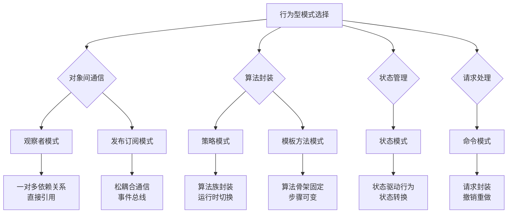

# 行为型模式：对象间的优雅协作

> 如果说创建型模式是"生孩子"，结构型模式是"搭积木"，那么行为型模式就是"谈恋爱" —— 它关注的是对象之间如何优雅地交流、协作和分工。

在前面两篇文章中，我们学习了如何创建对象和组织对象。今天，我们要深入探讨对象间的交互艺术 —— 行为型模式。这些模式就像是给对象们制定了一套"社交礼仪"，让它们能够和谐共处，各司其职。

## 一、观察者模式：消息传递的艺术

### 1.1 什么是观察者模式？

观察者模式定义了对象间的一对多依赖关系，当一个对象的状态发生改变时，所有依赖于它的对象都会得到通知并自动更新。这就像是微信群聊，群主发消息，所有群成员都能收到。

### 1.2 事件系统的实现

```javascript
// 观察者接口
class Observer {
  update(data) {
    throw new Error('update() 方法必须被实现');
  }
}

// 被观察者（主题）
class Subject {
  constructor() {
    this.observers = new Set();
    this.state = null;
  }
  
  // 添加观察者
  attach(observer) {
    if (!(observer instanceof Observer)) {
      throw new Error('观察者必须实现 Observer 接口');
    }
    this.observers.add(observer);
    return this;
  }
  
  // 移除观察者
  detach(observer) {
    this.observers.delete(observer);
    return this;
  }
  
  // 通知所有观察者
  notify(data) {
    for (const observer of this.observers) {
      try {
        observer.update(data);
      } catch (error) {
        console.error('观察者更新失败:', error);
      }
    }
  }
  
  // 设置状态并通知
  setState(newState) {
    const oldState = this.state;
    this.state = newState;
    this.notify({ oldState, newState, timestamp: Date.now() });
  }
  
  getState() {
    return this.state;
  }
  
  getObserverCount() {
    return this.observers.size;
  }
}

// 具体观察者实现
class Logger extends Observer {
  constructor(name) {
    super();
    this.name = name;
    this.logs = [];
  }
  
  update(data) {
    const logEntry = {
      timestamp: new Date().toISOString(),
      observer: this.name,
      data: JSON.stringify(data)
    };
    
    this.logs.push(logEntry);
    console.log(`[${this.name}] 状态变更:`, data);
  }
  
  getLogs() {
    return this.logs;
  }
  
  clearLogs() {
    this.logs = [];
  }
}

class EmailNotifier extends Observer {
  constructor(emailService) {
    super();
    this.emailService = emailService;
    this.subscribers = new Set();
  }
  
  addSubscriber(email) {
    this.subscribers.add(email);
  }
  
  removeSubscriber(email) {
    this.subscribers.delete(email);
  }
  
  update(data) {
    const subject = '系统状态变更通知';
    const message = `
      系统状态已从 "${data.oldState}" 变更为 "${data.newState}"
      变更时间: ${new Date(data.timestamp).toLocaleString()}
    `;
    
    for (const email of this.subscribers) {
      this.emailService.send(email, subject, message)
        .then(() => console.log(`✅ 邮件已发送到 ${email}`))
        .catch(error => console.error(`❌ 邮件发送失败 ${email}:`, error));
    }
  }
}

class MetricsCollector extends Observer {
  constructor() {
    super();
    this.metrics = {
      stateChanges: 0,
      lastChangeTime: null,
      stateHistory: [],
      averageChangeInterval: 0
    };
  }
  
  update(data) {
    this.metrics.stateChanges++;
    
    const now = data.timestamp;
    if (this.metrics.lastChangeTime) {
      const interval = now - this.metrics.lastChangeTime;
      this.metrics.averageChangeInterval = 
        (this.metrics.averageChangeInterval * (this.metrics.stateChanges - 1) + interval) / this.metrics.stateChanges;
    }
    
    this.metrics.lastChangeTime = now;
    this.metrics.stateHistory.push({
      state: data.newState,
      timestamp: now
    });
    
    // 只保留最近100条记录
    if (this.metrics.stateHistory.length > 100) {
      this.metrics.stateHistory.shift();
    }
    
    console.log('📊 指标更新:', this.getMetrics());
  }
  
  getMetrics() {
    return {
      ...this.metrics,
      averageChangeInterval: Math.round(this.metrics.averageChangeInterval)
    };
  }
  
  reset() {
    this.metrics = {
      stateChanges: 0,
      lastChangeTime: null,
      stateHistory: [],
      averageChangeInterval: 0
    };
  }
}

// 高级事件系统
class EventEmitter extends Subject {
  constructor() {
    super();
    this.events = new Map();
    this.maxListeners = 10;
    this.onceListeners = new Map();
  }
  
  // 监听事件
  on(eventName, listener) {
    if (!this.events.has(eventName)) {
      this.events.set(eventName, new Set());
    }
    
    const listeners = this.events.get(eventName);
    if (listeners.size >= this.maxListeners) {
      console.warn(`警告: 事件 "${eventName}" 的监听器数量已达到最大值 ${this.maxListeners}`);
    }
    
    listeners.add(listener);
    return this;
  }
  
  // 监听一次
  once(eventName, listener) {
    if (!this.onceListeners.has(eventName)) {
      this.onceListeners.set(eventName, new Set());
    }
    
    this.onceListeners.get(eventName).add(listener);
    return this;
  }
  
  // 移除监听器
  off(eventName, listener) {
    if (this.events.has(eventName)) {
      this.events.get(eventName).delete(listener);
    }
    
    if (this.onceListeners.has(eventName)) {
      this.onceListeners.get(eventName).delete(listener);
    }
    
    return this;
  }
  
  // 触发事件
  emit(eventName, ...args) {
    const timestamp = Date.now();
    
    // 触发普通监听器
    if (this.events.has(eventName)) {
      for (const listener of this.events.get(eventName)) {
        try {
          listener.call(this, ...args, { eventName, timestamp });
        } catch (error) {
          console.error(`事件监听器执行失败 (${eventName}):`, error);
        }
      }
    }
    
    // 触发一次性监听器
    if (this.onceListeners.has(eventName)) {
      const onceListeners = this.onceListeners.get(eventName);
      for (const listener of onceListeners) {
        try {
          listener.call(this, ...args, { eventName, timestamp });
        } catch (error) {
          console.error(`一次性事件监听器执行失败 (${eventName}):`, error);
        }
      }
      // 清除一次性监听器
      onceListeners.clear();
    }
    
    return this;
  }
  
  // 移除所有监听器
  removeAllListeners(eventName) {
    if (eventName) {
      this.events.delete(eventName);
      this.onceListeners.delete(eventName);
    } else {
      this.events.clear();
      this.onceListeners.clear();
    }
    return this;
  }
  
  // 获取监听器数量
  listenerCount(eventName) {
    const regularCount = this.events.has(eventName) ? this.events.get(eventName).size : 0;
    const onceCount = this.onceListeners.has(eventName) ? this.onceListeners.get(eventName).size : 0;
    return regularCount + onceCount;
  }
  
  // 设置最大监听器数量
  setMaxListeners(n) {
    this.maxListeners = n;
    return this;
  }
  
  // 获取所有事件名
  eventNames() {
    const names = new Set();
    for (const name of this.events.keys()) {
      names.add(name);
    }
    for (const name of this.onceListeners.keys()) {
      names.add(name);
    }
    return Array.from(names);
  }
}

// 模拟邮件服务
class MockEmailService {
  async send(to, subject, message) {
    // 模拟网络延迟
    await new Promise(resolve => setTimeout(resolve, Math.random() * 1000));
    
    // 模拟偶尔的发送失败
    if (Math.random() < 0.1) {
      throw new Error('网络错误');
    }
    
    return {
      messageId: `msg_${Date.now()}_${Math.random().toString(36).substr(2, 9)}`,
      to,
      subject,
      sentAt: new Date().toISOString()
    };
  }
}

// 使用示例
function observerDemo() {
  console.log('=== 观察者模式示例 ===');
  
  // 创建主题
  const systemStatus = new Subject();
  
  // 创建观察者
  const logger = new Logger('SystemLogger');
  const emailService = new MockEmailService();
  const emailNotifier = new EmailNotifier(emailService);
  const metricsCollector = new MetricsCollector();
  
  // 添加邮件订阅者
  emailNotifier.addSubscriber('admin@example.com');
  emailNotifier.addSubscriber('ops@example.com');
  
  // 注册观察者
  systemStatus
    .attach(logger)
    .attach(emailNotifier)
    .attach(metricsCollector);
  
  console.log(`观察者数量: ${systemStatus.getObserverCount()}`);
  
  // 模拟状态变化
  console.log('\n🔄 模拟系统状态变化:');
  
  systemStatus.setState('启动中');
  setTimeout(() => systemStatus.setState('运行中'), 1000);
  setTimeout(() => systemStatus.setState('维护中'), 2000);
  setTimeout(() => systemStatus.setState('运行中'), 3000);
  
  // 显示日志和指标
  setTimeout(() => {
    console.log('\n📋 系统日志:');
    logger.getLogs().forEach(log => {
      console.log(`${log.timestamp} [${log.observer}]: ${log.data}`);
    });
    
    console.log('\n📊 系统指标:');
    console.log(metricsCollector.getMetrics());
  }, 4000);
}

// 事件系统示例
function eventEmitterDemo() {
  console.log('\n=== 事件系统示例 ===');
  
  const eventBus = new EventEmitter();
  
  // 用户登录事件监听
  eventBus.on('user:login', (user, meta) => {
    console.log(`👤 用户登录: ${user.name} (${user.email})`);
    console.log(`登录时间: ${new Date(meta.timestamp).toLocaleString()}`);
  });
  
  // 用户登录统计
  let loginCount = 0;
  eventBus.on('user:login', () => {
    loginCount++;
    console.log(`📈 总登录次数: ${loginCount}`);
  });
  
  // 一次性欢迎消息
  eventBus.once('user:login', (user) => {
    console.log(`🎉 欢迎新用户: ${user.name}!`);
  });
  
  // 用户注销事件
  eventBus.on('user:logout', (user, meta) => {
    console.log(`👋 用户注销: ${user.name}`);
  });
  
  // 系统错误事件
  eventBus.on('system:error', (error, meta) => {
    console.error(`🚨 系统错误: ${error.message}`);
    console.error(`错误时间: ${new Date(meta.timestamp).toLocaleString()}`);
  });
  
  // 模拟事件触发
  console.log('\n🎭 模拟事件触发:');
  
  eventBus.emit('user:login', { name: 'Alice', email: 'alice@example.com' });
  eventBus.emit('user:login', { name: 'Bob', email: 'bob@example.com' });
  eventBus.emit('user:logout', { name: 'Alice', email: 'alice@example.com' });
  eventBus.emit('system:error', new Error('数据库连接失败'));
  
  // 显示事件统计
  console.log('\n📊 事件统计:');
  console.log('事件名称:', eventBus.eventNames());
  console.log('user:login 监听器数量:', eventBus.listenerCount('user:login'));
  console.log('user:logout 监听器数量:', eventBus.listenerCount('user:logout'));
}

observerDemo();
setTimeout(eventEmitterDemo, 5000);
```

## 二、策略模式：算法的可插拔设计

### 2.1 什么是策略模式？

策略模式定义了一系列算法，把它们一个个封装起来，并且使它们可以相互替换。这个模式让算法独立于使用它的客户而变化。就像是选择不同的出行方式：走路、骑车、开车、坐地铁，目标都是到达目的地，但策略不同。

### 2.2 支付系统的策略实现

```javascript
// 策略接口
class PaymentStrategy {
  async pay(amount, options = {}) {
    throw new Error('pay() 方法必须被实现');
  }
  
  validate(amount, options = {}) {
    throw new Error('validate() 方法必须被实现');
  }
  
  getInfo() {
    throw new Error('getInfo() 方法必须被实现');
  }
}

// 支付宝策略
class AlipayStrategy extends PaymentStrategy {
  constructor(appId, privateKey) {
    super();
    this.appId = appId;
    this.privateKey = privateKey;
    this.name = 'Alipay';
  }
  
  validate(amount, options = {}) {
    if (amount <= 0) {
      throw new Error('支付金额必须大于0');
    }
    
    if (amount > 50000) {
      throw new Error('支付宝单笔支付金额不能超过5万元');
    }
    
    if (!options.userId) {
      throw new Error('支付宝支付需要用户ID');
    }
    
    return true;
  }
  
  async pay(amount, options = {}) {
    this.validate(amount, options);
    
    console.log(`💰 使用支付宝支付 ¥${amount}`);
    
    // 模拟支付宝API调用
    const paymentData = {
      app_id: this.appId,
      method: 'alipay.trade.app.pay',
      charset: 'utf-8',
      sign_type: 'RSA2',
      timestamp: new Date().toISOString(),
      version: '1.0',
      biz_content: JSON.stringify({
        out_trade_no: `alipay_${Date.now()}`,
        total_amount: amount,
        subject: options.subject || '商品支付',
        product_code: 'QUICK_MSECURITY_PAY'
      })
    };
    
    // 模拟网络请求
    await this.simulateNetworkRequest(1000, 2000);
    
    // 模拟支付结果
    const success = Math.random() > 0.1; // 90% 成功率
    
    if (success) {
      return {
        success: true,
        transactionId: `alipay_${Date.now()}_${Math.random().toString(36).substr(2, 9)}`,
        amount,
        method: 'alipay',
        timestamp: Date.now(),
        fee: amount * 0.006, // 0.6% 手续费
        data: paymentData
      };
    } else {
      throw new Error('支付宝支付失败：余额不足或网络异常');
    }
  }
  
  getInfo() {
    return {
      name: this.name,
      maxAmount: 50000,
      minAmount: 0.01,
      feeRate: 0.006,
      supportedCurrencies: ['CNY'],
      features: ['扫码支付', '免密支付', '花呗分期']
    };
  }
  
  async simulateNetworkRequest(minDelay, maxDelay) {
    const delay = Math.random() * (maxDelay - minDelay) + minDelay;
    await new Promise(resolve => setTimeout(resolve, delay));
  }
}

// 微信支付策略
class WechatPayStrategy extends PaymentStrategy {
  constructor(appId, mchId, apiKey) {
    super();
    this.appId = appId;
    this.mchId = mchId;
    this.apiKey = apiKey;
    this.name = 'WechatPay';
  }
  
  validate(amount, options = {}) {
    if (amount <= 0) {
      throw new Error('支付金额必须大于0');
    }
    
    if (amount > 100000) {
      throw new Error('微信支付单笔支付金额不能超过10万元');
    }
    
    if (!options.openId) {
      throw new Error('微信支付需要用户openId');
    }
    
    return true;
  }
  
  async pay(amount, options = {}) {
    this.validate(amount, options);
    
    console.log(`💚 使用微信支付 ¥${amount}`);
    
    // 模拟微信支付API调用
    const paymentData = {
      appid: this.appId,
      mch_id: this.mchId,
      nonce_str: Math.random().toString(36).substr(2, 15),
      body: options.subject || '商品支付',
      out_trade_no: `wxpay_${Date.now()}`,
      total_fee: Math.round(amount * 100), // 微信支付金额单位为分
      spbill_create_ip: '127.0.0.1',
      notify_url: options.notifyUrl || 'https://example.com/notify',
      trade_type: 'JSAPI',
      openid: options.openId
    };
    
    // 模拟网络请求
    await this.simulateNetworkRequest(800, 1500);
    
    // 模拟支付结果
    const success = Math.random() > 0.05; // 95% 成功率
    
    if (success) {
      return {
        success: true,
        transactionId: `wxpay_${Date.now()}_${Math.random().toString(36).substr(2, 9)}`,
        amount,
        method: 'wechatpay',
        timestamp: Date.now(),
        fee: amount * 0.006, // 0.6% 手续费
        data: paymentData
      };
    } else {
      throw new Error('微信支付失败：支付密码错误或网络异常');
    }
  }
  
  getInfo() {
    return {
      name: this.name,
      maxAmount: 100000,
      minAmount: 0.01,
      feeRate: 0.006,
      supportedCurrencies: ['CNY'],
      features: ['扫码支付', '免密支付', '红包', '转账']
    };
  }
  
  async simulateNetworkRequest(minDelay, maxDelay) {
    const delay = Math.random() * (maxDelay - minDelay) + minDelay;
    await new Promise(resolve => setTimeout(resolve, delay));
  }
}

// 银行卡支付策略
class BankCardStrategy extends PaymentStrategy {
  constructor(bankCode) {
    super();
    this.bankCode = bankCode;
    this.name = 'BankCard';
  }
  
  validate(amount, options = {}) {
    if (amount <= 0) {
      throw new Error('支付金额必须大于0');
    }
    
    if (amount > 500000) {
      throw new Error('银行卡单笔支付金额不能超过50万元');
    }
    
    if (!options.cardNumber || !options.cvv || !options.expiryDate) {
      throw new Error('银行卡支付需要卡号、CVV和有效期');
    }
    
    // 简单的卡号验证（Luhn算法）
    if (!this.validateCardNumber(options.cardNumber)) {
      throw new Error('银行卡号格式不正确');
    }
    
    return true;
  }
  
  validateCardNumber(cardNumber) {
    const digits = cardNumber.replace(/\D/g, '');
    let sum = 0;
    let isEven = false;
    
    for (let i = digits.length - 1; i >= 0; i--) {
      let digit = parseInt(digits[i]);
      
      if (isEven) {
        digit *= 2;
        if (digit > 9) {
          digit -= 9;
        }
      }
      
      sum += digit;
      isEven = !isEven;
    }
    
    return sum % 10 === 0;
  }
  
  async pay(amount, options = {}) {
    this.validate(amount, options);
    
    console.log(`💳 使用银行卡支付 ¥${amount}`);
    
    // 模拟银行支付API调用
    const paymentData = {
      bank_code: this.bankCode,
      card_number: this.maskCardNumber(options.cardNumber),
      amount: amount,
      currency: 'CNY',
      order_no: `bank_${Date.now()}`,
      timestamp: Date.now()
    };
    
    // 模拟网络请求（银行支付通常较慢）
    await this.simulateNetworkRequest(2000, 5000);
    
    // 模拟支付结果
    const success = Math.random() > 0.15; // 85% 成功率
    
    if (success) {
      return {
        success: true,
        transactionId: `bank_${Date.now()}_${Math.random().toString(36).substr(2, 9)}`,
        amount,
        method: 'bankcard',
        timestamp: Date.now(),
        fee: amount * 0.005, // 0.5% 手续费
        data: paymentData
      };
    } else {
      throw new Error('银行卡支付失败：卡内余额不足或银行系统维护');
    }
  }
  
  maskCardNumber(cardNumber) {
    const digits = cardNumber.replace(/\D/g, '');
    return digits.replace(/.(?=.{4})/g, '*');
  }
  
  getInfo() {
    return {
      name: this.name,
      maxAmount: 500000,
      minAmount: 0.01,
      feeRate: 0.005,
      supportedCurrencies: ['CNY', 'USD', 'EUR'],
      features: ['分期付款', '积分兑换', '跨境支付']
    };
  }
  
  async simulateNetworkRequest(minDelay, maxDelay) {
    const delay = Math.random() * (maxDelay - minDelay) + minDelay;
    await new Promise(resolve => setTimeout(resolve, delay));
  }
}

// 支付上下文
class PaymentContext {
  constructor() {
    this.strategy = null;
    this.history = [];
    this.retryAttempts = 3;
    this.retryDelay = 1000;
  }
  
  setStrategy(strategy) {
    if (!(strategy instanceof PaymentStrategy)) {
      throw new Error('策略必须实现 PaymentStrategy 接口');
    }
    this.strategy = strategy;
    return this;
  }
  
  async pay(amount, options = {}) {
    if (!this.strategy) {
      throw new Error('请先设置支付策略');
    }
    
    const startTime = Date.now();
    let lastError;
    
    for (let attempt = 1; attempt <= this.retryAttempts; attempt++) {
      try {
        console.log(`🔄 支付尝试 ${attempt}/${this.retryAttempts}`);
        
        const result = await this.strategy.pay(amount, options);
        
        // 记录支付历史
        const paymentRecord = {
          ...result,
          attempt,
          duration: Date.now() - startTime,
          strategy: this.strategy.name
        };
        
        this.history.push(paymentRecord);
        
        console.log(`✅ 支付成功! 交易ID: ${result.transactionId}`);
        console.log(`💰 支付金额: ¥${result.amount}`);
        console.log(`💸 手续费: ¥${result.fee.toFixed(2)}`);
        console.log(`⏱️ 耗时: ${paymentRecord.duration}ms`);
        
        return result;
        
      } catch (error) {
        lastError = error;
        console.warn(`❌ 支付失败 (尝试 ${attempt}/${this.retryAttempts}): ${error.message}`);
        
        if (attempt < this.retryAttempts) {
          console.log(`⏳ ${this.retryDelay}ms 后重试...`);
          await new Promise(resolve => setTimeout(resolve, this.retryDelay));
          this.retryDelay *= 1.5; // 指数退避
        }
      }
    }
    
    // 记录失败的支付尝试
    this.history.push({
      success: false,
      amount,
      error: lastError.message,
      attempts: this.retryAttempts,
      duration: Date.now() - startTime,
      strategy: this.strategy.name,
      timestamp: Date.now()
    });
    
    throw new Error(`支付失败: ${lastError.message}`);
  }
  
  getStrategyInfo() {
    return this.strategy ? this.strategy.getInfo() : null;
  }
  
  getPaymentHistory() {
    return this.history;
  }
  
  clearHistory() {
    this.history = [];
  }
  
  getSuccessRate() {
    if (this.history.length === 0) return 0;
    
    const successCount = this.history.filter(record => record.success).length;
    return (successCount / this.history.length * 100).toFixed(2);
  }
  
  getTotalAmount() {
    return this.history
      .filter(record => record.success)
      .reduce((total, record) => total + record.amount, 0);
  }
  
  getTotalFees() {
    return this.history
      .filter(record => record.success)
      .reduce((total, record) => total + record.fee, 0);
  }
}

// 支付策略工厂
class PaymentStrategyFactory {
  static strategies = new Map();
  
  static register(name, strategyClass) {
    this.strategies.set(name, strategyClass);
  }
  
  static create(name, ...args) {
    const StrategyClass = this.strategies.get(name);
    if (!StrategyClass) {
      throw new Error(`未知的支付策略: ${name}`);
    }
    return new StrategyClass(...args);
  }
  
  static getAvailableStrategies() {
    return Array.from(this.strategies.keys());
  }
}

// 注册策略
PaymentStrategyFactory.register('alipay', AlipayStrategy);
PaymentStrategyFactory.register('wechatpay', WechatPayStrategy);
PaymentStrategyFactory.register('bankcard', BankCardStrategy);

// 使用示例
async function strategyDemo() {
  console.log('=== 策略模式支付系统示例 ===');
  
  const paymentContext = new PaymentContext();
  
  // 测试支付宝支付
  console.log('\n💰 测试支付宝支付:');
  const alipayStrategy = PaymentStrategyFactory.create('alipay', 'app123', 'private_key');
  console.log('支付宝策略信息:', alipayStrategy.getInfo());
  
  paymentContext.setStrategy(alipayStrategy);
  
  try {
    await paymentContext.pay(299.99, {
      userId: 'user123',
      subject: '购买会员套餐'
    });
  } catch (error) {
    console.error('支付宝支付失败:', error.message);
  }
  
  // 测试微信支付
  console.log('\n💚 测试微信支付:');
  const wechatStrategy = PaymentStrategyFactory.create('wechatpay', 'wx123', 'mch123', 'key123');
  console.log('微信支付策略信息:', wechatStrategy.getInfo());
  
  paymentContext.setStrategy(wechatStrategy);
  
  try {
    await paymentContext.pay(199.50, {
      openId: 'openid123',
      subject: '购买商品',
      notifyUrl: 'https://example.com/wechat/notify'
    });
  } catch (error) {
    console.error('微信支付失败:', error.message);
  }
  
  // 测试银行卡支付
  console.log('\n💳 测试银行卡支付:');
  const bankStrategy = PaymentStrategyFactory.create('bankcard', 'ICBC');
  console.log('银行卡策略信息:', bankStrategy.getInfo());
  
  paymentContext.setStrategy(bankStrategy);
  
  try {
    await paymentContext.pay(1299.00, {
      cardNumber: '4111111111111111', // 测试卡号
      cvv: '123',
      expiryDate: '12/25'
    });
  } catch (error) {
    console.error('银行卡支付失败:', error.message);
  }
  
  // 显示支付统计
  console.log('\n📊 支付统计:');
  console.log(`成功率: ${paymentContext.getSuccessRate()}%`);
  console.log(`总支付金额: ¥${paymentContext.getTotalAmount().toFixed(2)}`);
  console.log(`总手续费: ¥${paymentContext.getTotalFees().toFixed(2)}`);
  
  console.log('\n📋 支付历史:');
  paymentContext.getPaymentHistory().forEach((record, index) => {
    if (record.success) {
      console.log(`${index + 1}. ✅ ${record.strategy} - ¥${record.amount} (${record.duration}ms)`);
    } else {
      console.log(`${index + 1}. ❌ ${record.strategy} - ¥${record.amount} (${record.error})`);
    }
  });
}

strategyDemo();
```

## 三、命令模式：请求的封装与队列

### 3.1 什么是命令模式？

命令模式将请求封装成对象，从而使你可以用不同的请求对客户进行参数化，对请求排队或记录请求日志，以及支持可撤销的操作。就像是餐厅的点餐系统，服务员把顾客的订单写在纸上，厨师按照订单做菜，顾客还可以取消订单。

### 3.2 文本编辑器的命令系统

```javascript
// 命令接口
class Command {
  execute() {
    throw new Error('execute() 方法必须被实现');
  }
  
  undo() {
    throw new Error('undo() 方法必须被实现');
  }
  
  getDescription() {
    throw new Error('getDescription() 方法必须被实现');
  }
}

// 文本编辑器（接收者）
class TextEditor {
  constructor() {
    this.content = '';
    this.cursor = 0;
    this.selection = { start: 0, end: 0 };
    this.history = [];
    this.redoStack = [];
  }
  
  // 插入文本
  insertText(text, position = this.cursor) {
    const before = this.content.substring(0, position);
    const after = this.content.substring(position);
    this.content = before + text + after;
    this.cursor = position + text.length;
    this.updateHistory();
  }
  
  // 删除文本
  deleteText(start, end) {
    const deletedText = this.content.substring(start, end);
    this.content = this.content.substring(0, start) + this.content.substring(end);
    this.cursor = start;
    this.updateHistory();
    return deletedText;
  }
  
  // 替换文本
  replaceText(start, end, newText) {
    const oldText = this.content.substring(start, end);
    this.content = this.content.substring(0, start) + newText + this.content.substring(end);
    this.cursor = start + newText.length;
    this.updateHistory();
    return oldText;
  }
  
  // 设置选择区域
  setSelection(start, end) {
    this.selection = { start: Math.max(0, start), end: Math.min(this.content.length, end) };
  }
  
  // 获取选中的文本
  getSelectedText() {
    return this.content.substring(this.selection.start, this.selection.end);
  }
  
  // 移动光标
  moveCursor(position) {
    this.cursor = Math.max(0, Math.min(this.content.length, position));
  }
  
  // 获取当前状态
  getState() {
    return {
      content: this.content,
      cursor: this.cursor,
      selection: { ...this.selection },
      length: this.content.length
    };
  }
  
  // 恢复状态
  setState(state) {
    this.content = state.content;
    this.cursor = state.cursor;
    this.selection = { ...state.selection };
  }
  
  // 更新历史记录
  updateHistory() {
    this.history.push(this.getState());
    if (this.history.length > 100) {
      this.history.shift();
    }
  }
  
  // 查找文本
  findText(searchText, startFrom = 0) {
    const index = this.content.indexOf(searchText, startFrom);
    if (index !== -1) {
      this.setSelection(index, index + searchText.length);
      this.cursor = index;
      return { found: true, position: index };
    }
    return { found: false, position: -1 };
  }
  
  // 获取统计信息
  getStats() {
    const words = this.content.trim().split(/\s+/).filter(word => word.length > 0);
    const lines = this.content.split('\n');
    
    return {
      characters: this.content.length,
      charactersNoSpaces: this.content.replace(/\s/g, '').length,
      words: words.length,
      lines: lines.length,
      paragraphs: this.content.split(/\n\s*\n/).filter(p => p.trim().length > 0).length
    };
  }
}

// 具体命令实现
class InsertTextCommand extends Command {
  constructor(editor, text, position) {
    super();
    this.editor = editor;
    this.text = text;
    this.position = position !== undefined ? position : editor.cursor;
    this.previousState = null;
  }
  
  execute() {
    this.previousState = this.editor.getState();
    this.editor.insertText(this.text, this.position);
  }
  
  undo() {
    if (this.previousState) {
      this.editor.setState(this.previousState);
    }
  }
  
  getDescription() {
    return `插入文本: "${this.text.substring(0, 20)}${this.text.length > 20 ? '...' : ''}"`;
  }
}

class DeleteTextCommand extends Command {
  constructor(editor, start, end) {
    super();
    this.editor = editor;
    this.start = start;
    this.end = end;
    this.deletedText = '';
    this.previousState = null;
  }
  
  execute() {
    this.previousState = this.editor.getState();
    this.deletedText = this.editor.deleteText(this.start, this.end);
  }
  
  undo() {
    if (this.previousState) {
      this.editor.setState(this.previousState);
    }
  }
  
  getDescription() {
    return `删除文本: "${this.deletedText.substring(0, 20)}${this.deletedText.length > 20 ? '...' : ''}"`;
  }
}

class ReplaceTextCommand extends Command {
  constructor(editor, start, end, newText) {
    super();
    this.editor = editor;
    this.start = start;
    this.end = end;
    this.newText = newText;
    this.oldText = '';
    this.previousState = null;
  }
  
  execute() {
    this.previousState = this.editor.getState();
    this.oldText = this.editor.replaceText(this.start, this.end, this.newText);
  }
  
  undo() {
    if (this.previousState) {
      this.editor.setState(this.previousState);
    }
  }
  
  getDescription() {
    return `替换文本: "${this.oldText}" → "${this.newText}"`;
  }
}

class FindReplaceCommand extends Command {
  constructor(editor, searchText, replaceText, replaceAll = false) {
    super();
    this.editor = editor;
    this.searchText = searchText;
    this.replaceText = replaceText;
    this.replaceAll = replaceAll;
    this.replacements = [];
    this.previousState = null;
  }
  
  execute() {
    this.previousState = this.editor.getState();
    this.replacements = [];
    
    if (this.replaceAll) {
      let content = this.editor.content;
      let offset = 0;
      
      while (true) {
        const index = content.indexOf(this.searchText, offset);
        if (index === -1) break;
        
        this.replacements.push({
          position: index,
          oldText: this.searchText,
          newText: this.replaceText
        });
        
        content = content.substring(0, index) + this.replaceText + content.substring(index + this.searchText.length);
        offset = index + this.replaceText.length;
      }
      
      this.editor.content = content;
      this.editor.cursor = 0;
    } else {
      const result = this.editor.findText(this.searchText);
      if (result.found) {
        this.replacements.push({
          position: result.position,
          oldText: this.searchText,
          newText: this.replaceText
        });
        
        this.editor.replaceText(result.position, result.position + this.searchText.length, this.replaceText);
      }
    }
  }
  
  undo() {
    if (this.previousState) {
      this.editor.setState(this.previousState);
    }
  }
  
  getDescription() {
    const action = this.replaceAll ? '全部替换' : '替换';
    return `${action}: "${this.searchText}" → "${this.replaceText}" (${this.replacements.length}处)`;
  }
}

// 宏命令（组合命令）
class MacroCommand extends Command {
  constructor(commands = []) {
    super();
    this.commands = commands;
    this.executed = false;
  }
  
  addCommand(command) {
    this.commands.push(command);
  }
  
  execute() {
    for (const command of this.commands) {
      command.execute();
    }
    this.executed = true;
  }
  
  undo() {
    if (this.executed) {
      // 逆序撤销
      for (let i = this.commands.length - 1; i >= 0; i--) {
        this.commands[i].undo();
      }
      this.executed = false;
    }
  }
  
  getDescription() {
    return `宏命令 (${this.commands.length}个操作): ${this.commands.map(cmd => cmd.getDescription()).join(', ')}`;
  }
}

// 命令调用者（编辑器控制器）
class EditorController {
  constructor(editor) {
    this.editor = editor;
    this.commandHistory = [];
    this.currentIndex = -1;
    this.maxHistorySize = 100;
  }
  
  // 执行命令
  executeCommand(command) {
    // 清除当前位置之后的历史记录（用于重做）
    this.commandHistory = this.commandHistory.slice(0, this.currentIndex + 1);
    
    // 执行命令
    command.execute();
    
    // 添加到历史记录
    this.commandHistory.push(command);
    this.currentIndex++;
    
    // 限制历史记录大小
    if (this.commandHistory.length > this.maxHistorySize) {
      this.commandHistory.shift();
      this.currentIndex--;
    }
    
    console.log(`✅ 执行: ${command.getDescription()}`);
  }
  
  // 撤销
  undo() {
    if (this.canUndo()) {
      const command = this.commandHistory[this.currentIndex];
      command.undo();
      this.currentIndex--;
      console.log(`↶ 撤销: ${command.getDescription()}`);
      return true;
    }
    console.log('❌ 无法撤销');
    return false;
  }
  
  // 重做
  redo() {
    if (this.canRedo()) {
      this.currentIndex++;
      const command = this.commandHistory[this.currentIndex];
      command.execute();
      console.log(`↷ 重做: ${command.getDescription()}`);
      return true;
    }
    console.log('❌ 无法重做');
    return false;
  }
  
  // 检查是否可以撤销
  canUndo() {
    return this.currentIndex >= 0;
  }
  
  // 检查是否可以重做
  canRedo() {
    return this.currentIndex < this.commandHistory.length - 1;
  }
  
  // 获取历史记录
  getHistory() {
    return this.commandHistory.map((command, index) => ({
      index,
      description: command.getDescription(),
      executed: index <= this.currentIndex
    }));
  }
  
  // 清除历史记录
  clearHistory() {
    this.commandHistory = [];
    this.currentIndex = -1;
  }
  
  // 批量执行命令
  executeBatch(commands) {
    const macro = new MacroCommand(commands);
    this.executeCommand(macro);
  }
  
  // 创建快照
  createSnapshot() {
    return {
      editorState: this.editor.getState(),
      historyIndex: this.currentIndex,
      timestamp: Date.now()
    };
  }
  
  // 恢复快照
  restoreSnapshot(snapshot) {
    this.editor.setState(snapshot.editorState);
    this.currentIndex = snapshot.historyIndex;
    console.log(`📸 恢复快照: ${new Date(snapshot.timestamp).toLocaleString()}`);
  }
}

// 使用示例
function commandDemo() {
  console.log('=== 命令模式文本编辑器示例 ===');
  
  const editor = new TextEditor();
  const controller = new EditorController(editor);
  
  // 执行一系列编辑操作
  console.log('\n📝 执行编辑操作:');
  
  controller.executeCommand(new InsertTextCommand(editor, 'Hello, World!'));
  console.log('当前内容:', `"${editor.content}"`);
  
  controller.executeCommand(new InsertTextCommand(editor, '\n这是第二行。'));
  console.log('当前内容:', `"${editor.content}"`);
  
  controller.executeCommand(new InsertTextCommand(editor, '\n这是第三行，包含一些错误的文字。'));
  console.log('当前内容:', `"${editor.content}"`);
  
  // 查找并替换
  controller.executeCommand(new FindReplaceCommand(editor, '错误的', '正确的'));
  console.log('替换后内容:', `"${editor.content}"`);
  
  // 删除部分文本
  editor.setSelection(0, 5); // 选中 "Hello"
  controller.executeCommand(new DeleteTextCommand(editor, editor.selection.start, editor.selection.end));
  console.log('删除后内容:', `"${editor.content}"`);
  
  // 测试撤销和重做
  console.log('\n↶ 测试撤销操作:');
  controller.undo(); // 撤销删除
  console.log('撤销删除后:', `"${editor.content}"`);
  
  controller.undo(); // 撤销替换
  console.log('撤销替换后:', `"${editor.content}"`);
  
  controller.undo(); // 撤销插入第三行
  console.log('撤销插入后:', `"${editor.content}"`);
  
  console.log('\n↷ 测试重做操作:');
  controller.redo(); // 重做插入第三行
  console.log('重做插入后:', `"${editor.content}"`);
  
  controller.redo(); // 重做替换
  console.log('重做替换后:', `"${editor.content}"`);
  
  // 批量操作（宏命令）
  console.log('\n🔄 测试批量操作:');
  const batchCommands = [
    new InsertTextCommand(editor, '\n\n--- 批量操作开始 ---'),
    new InsertTextCommand(editor, '\n第一个批量插入'),
    new InsertTextCommand(editor, '\n第二个批量插入'),
    new FindReplaceCommand(editor, '批量', '宏命令', true)
  ];
  
  controller.executeBatch(batchCommands);
  console.log('批量操作后:', `"${editor.content}"`);
  
  // 撤销整个批量操作
  controller.undo();
  console.log('撤销批量操作后:', `"${editor.content}"`);
  
  // 显示编辑器统计信息
  console.log('\n📊 编辑器统计:');
  const stats = editor.getStats();
  console.log(`字符数: ${stats.characters}`);
  console.log(`单词数: ${stats.words}`);
  console.log(`行数: ${stats.lines}`);
  console.log(`段落数: ${stats.paragraphs}`);
  
  // 显示命令历史
  console.log('\n📜 命令历史:');
  const history = controller.getHistory();
  history.forEach(item => {
    const status = item.executed ? '✅' : '⏸️';
    console.log(`${status} ${item.index + 1}. ${item.description}`);
  });
}

commandDemo();
```

## 四、状态模式：对象状态的优雅转换

### 4.1 什么是状态模式？

状态模式允许对象在内部状态改变时改变它的行为，对象看起来好像修改了它的类。这个模式将状态封装成独立的类，并将动作委托到代表当前状态的对象。就像是一个人的情绪状态：开心时会笑，难过时会哭，愤怒时会发脾气。

### 4.2 音乐播放器的状态管理

```javascript
// 状态接口
class PlayerState {
  constructor(player) {
    this.player = player;
  }
  
  play() {
    throw new Error('play() 方法必须被实现');
  }
  
  pause() {
    throw new Error('pause() 方法必须被实现');
  }
  
  stop() {
    throw new Error('stop() 方法必须被实现');
  }
  
  next() {
    throw new Error('next() 方法必须被实现');
  }
  
  previous() {
    throw new Error('previous() 方法必须被实现');
  }
  
  setVolume(volume) {
    throw new Error('setVolume() 方法必须被实现');
  }
  
  getName() {
    throw new Error('getName() 方法必须被实现');
  }
  
  getAvailableActions() {
    throw new Error('getAvailableActions() 方法必须被实现');
  }
}

// 停止状态
class StoppedState extends PlayerState {
  play() {
    console.log('▶️ 开始播放音乐');
    this.player.startPlayback();
    this.player.setState(this.player.playingState);
  }
  
  pause() {
    console.log('⚠️ 播放器已停止，无法暂停');
  }
  
  stop() {
    console.log('⚠️ 播放器已经是停止状态');
  }
  
  next() {
    console.log('⏭️ 切换到下一首（从停止状态）');
    this.player.nextTrack();
    // 切换歌曲后自动播放
    this.play();
  }
  
  previous() {
    console.log('⏮️ 切换到上一首（从停止状态）');
    this.player.previousTrack();
    // 切换歌曲后自动播放
    this.play();
  }
  
  setVolume(volume) {
    console.log(`🔊 设置音量: ${volume}%`);
    this.player.volume = volume;
  }
  
  getName() {
    return 'Stopped';
  }
  
  getAvailableActions() {
    return ['play', 'next', 'previous', 'setVolume'];
  }
}

// 播放状态
class PlayingState extends PlayerState {
  play() {
    console.log('⚠️ 音乐已在播放中');
  }
  
  pause() {
    console.log('⏸️ 暂停播放');
    this.player.pausePlayback();
    this.player.setState(this.player.pausedState);
  }
  
  stop() {
    console.log('⏹️ 停止播放');
    this.player.stopPlayback();
    this.player.setState(this.player.stoppedState);
  }
  
  next() {
    console.log('⏭️ 切换到下一首');
    this.player.nextTrack();
    this.player.startPlayback();
    // 保持播放状态
  }
  
  previous() {
    console.log('⏮️ 切换到上一首');
    this.player.previousTrack();
    this.player.startPlayback();
    // 保持播放状态
  }
  
  setVolume(volume) {
    console.log(`🔊 调整播放音量: ${volume}%`);
    this.player.volume = volume;
    this.player.updatePlaybackVolume();
  }
  
  getName() {
    return 'Playing';
  }
  
  getAvailableActions() {
    return ['pause', 'stop', 'next', 'previous', 'setVolume'];
  }
}

// 暂停状态
class PausedState extends PlayerState {
  play() {
    console.log('▶️ 恢复播放');
    this.player.resumePlayback();
    this.player.setState(this.player.playingState);
  }
  
  pause() {
    console.log('⚠️ 音乐已暂停');
  }
  
  stop() {
    console.log('⏹️ 停止播放');
    this.player.stopPlayback();
    this.player.setState(this.player.stoppedState);
  }
  
  next() {
    console.log('⏭️ 切换到下一首（从暂停状态）');
    this.player.nextTrack();
    this.player.startPlayback();
    this.player.setState(this.player.playingState);
  }
  
  previous() {
    console.log('⏮️ 切换到上一首（从暂停状态）');
    this.player.previousTrack();
    this.player.startPlayback();
    this.player.setState(this.player.playingState);
  }
  
  setVolume(volume) {
    console.log(`🔊 设置音量: ${volume}%`);
    this.player.volume = volume;
  }
  
  getName() {
    return 'Paused';
  }
  
  getAvailableActions() {
    return ['play', 'stop', 'next', 'previous', 'setVolume'];
  }
}

// 加载状态
class LoadingState extends PlayerState {
  constructor(player) {
    super(player);
    this.loadingStartTime = Date.now();
  }
  
  play() {
    console.log('⚠️ 正在加载中，请稍候...');
  }
  
  pause() {
    console.log('⚠️ 正在加载中，无法暂停');
  }
  
  stop() {
    console.log('⏹️ 取消加载');
    this.player.cancelLoading();
    this.player.setState(this.player.stoppedState);
  }
  
  next() {
    console.log('⚠️ 正在加载中，请稍候...');
  }
  
  previous() {
    console.log('⚠️ 正在加载中，请稍候...');
  }
  
  setVolume(volume) {
    console.log(`🔊 设置音量: ${volume}%`);
    this.player.volume = volume;
  }
  
  getName() {
    return 'Loading';
  }
  
  getAvailableActions() {
    return ['stop', 'setVolume'];
  }
  
  getLoadingDuration() {
    return Date.now() - this.loadingStartTime;
  }
}

// 错误状态
class ErrorState extends PlayerState {
  constructor(player, error) {
    super(player);
    this.error = error;
    this.errorTime = Date.now();
  }
  
  play() {
    console.log('🔄 尝试重新播放...');
    this.player.retry();
  }
  
  pause() {
    console.log('⚠️ 播放器出错，无法暂停');
  }
  
  stop() {
    console.log('⏹️ 停止播放（清除错误状态）');
    this.player.clearError();
    this.player.setState(this.player.stoppedState);
  }
  
  next() {
    console.log('⏭️ 尝试播放下一首');
    this.player.nextTrack();
    this.player.retry();
  }
  
  previous() {
    console.log('⏮️ 尝试播放上一首');
    this.player.previousTrack();
    this.player.retry();
  }
  
  setVolume(volume) {
    console.log(`🔊 设置音量: ${volume}%`);
    this.player.volume = volume;
  }
  
  getName() {
    return 'Error';
  }
  
  getAvailableActions() {
    return ['play', 'stop', 'next', 'previous', 'setVolume'];
  }
  
  getError() {
    return this.error;
  }
  
  getErrorDuration() {
    return Date.now() - this.errorTime;
  }
}

// 音乐播放器上下文
class MusicPlayer {
  constructor() {
    // 初始化所有状态
    this.stoppedState = new StoppedState(this);
    this.playingState = new PlayingState(this);
    this.pausedState = new PausedState(this);
    this.loadingState = null; // 动态创建
    this.errorState = null; // 动态创建
    
    // 设置初始状态
    this.currentState = this.stoppedState;
    
    // 播放器属性
    this.playlist = [];
    this.currentTrackIndex = 0;
    this.volume = 50;
    this.position = 0;
    this.duration = 0;
    
    // 事件监听器
    this.listeners = new Map();
    
    // 播放历史
    this.playHistory = [];
    this.stateHistory = [];
    
    // 播放统计
    this.stats = {
      totalPlayTime: 0,
      tracksPlayed: 0,
      stateChanges: 0
    };
  }
  
  // 设置状态
  setState(state) {
    const oldState = this.currentState;
    this.currentState = state;
    
    // 记录状态变化
    this.stateHistory.push({
      from: oldState.getName(),
      to: state.getName(),
      timestamp: Date.now()
    });
    
    this.stats.stateChanges++;
    
    console.log(`🔄 状态变化: ${oldState.getName()} → ${state.getName()}`);
    
    // 触发状态变化事件
    this.emit('stateChange', {
      oldState: oldState.getName(),
      newState: state.getName(),
      player: this
    });
  }
  
  // 委托方法到当前状态
  play() {
    this.currentState.play();
  }
  
  pause() {
    this.currentState.pause();
  }
  
  stop() {
    this.currentState.stop();
  }
  
  next() {
    this.currentState.next();
  }
  
  previous() {
    this.currentState.previous();
  }
  
  setVolume(volume) {
    this.currentState.setVolume(Math.max(0, Math.min(100, volume)));
  }
  
  // 播放器内部方法
  startPlayback() {
    if (this.playlist.length === 0) {
      this.handleError(new Error('播放列表为空'));
      return;
    }
    
    const track = this.getCurrentTrack();
    console.log(`🎵 开始播放: ${track.title} - ${track.artist}`);
    
    // 模拟加载过程
    this.loadingState = new LoadingState(this);
    this.setState(this.loadingState);
    
    // 模拟异步加载
    setTimeout(() => {
      if (this.currentState === this.loadingState) {
        this.position = 0;
        this.duration = track.duration;
        this.setState(this.playingState);
        
        // 记录播放历史
        this.playHistory.push({
          track: { ...track },
          startTime: Date.now(),
          completed: false
        });
        
        this.stats.tracksPlayed++;
        this.emit('trackStart', track);
      }
    }, Math.random() * 2000 + 500); // 0.5-2.5秒加载时间
  }
  
  pausePlayback() {
    console.log('⏸️ 播放已暂停');
    this.emit('trackPause', this.getCurrentTrack());
  }
  
  resumePlayback() {
    console.log('▶️ 播放已恢复');
    this.emit('trackResume', this.getCurrentTrack());
  }
  
  stopPlayback() {
    console.log('⏹️ 播放已停止');
    this.position = 0;
    
    // 更新播放历史
    if (this.playHistory.length > 0) {
      const lastPlay = this.playHistory[this.playHistory.length - 1];
      if (!lastPlay.completed) {
        lastPlay.endTime = Date.now();
        lastPlay.playDuration = lastPlay.endTime - lastPlay.startTime;
        this.stats.totalPlayTime += lastPlay.playDuration;
      }
    }
    
    this.emit('trackStop', this.getCurrentTrack());
  }
  
  nextTrack() {
    if (this.playlist.length === 0) return;
    
    this.currentTrackIndex = (this.currentTrackIndex + 1) % this.playlist.length;
    const track = this.getCurrentTrack();
    console.log(`⏭️ 下一首: ${track.title} - ${track.artist}`);
    this.emit('trackChange', track);
  }
  
  previousTrack() {
    if (this.playlist.length === 0) return;
    
    this.currentTrackIndex = this.currentTrackIndex === 0 
      ? this.playlist.length - 1 
      : this.currentTrackIndex - 1;
    
    const track = this.getCurrentTrack();
    console.log(`⏮️ 上一首: ${track.title} - ${track.artist}`);
    this.emit('trackChange', track);
  }
  
  updatePlaybackVolume() {
    console.log(`🔊 播放音量已调整为: ${this.volume}%`);
    this.emit('volumeChange', this.volume);
  }
  
  cancelLoading() {
    console.log('❌ 取消加载');
  }
  
  retry() {
    console.log('🔄 重试播放...');
    this.startPlayback();
  }
  
  clearError() {
    console.log('✅ 错误已清除');
    this.errorState = null;
  }
  
  handleError(error) {
    console.error(`❌ 播放器错误: ${error.message}`);
    this.errorState = new ErrorState(this, error);
    this.setState(this.errorState);
    this.emit('error', error);
  }
  
  // 播放列表管理
  setPlaylist(tracks) {
    this.playlist = tracks;
    this.currentTrackIndex = 0;
    console.log(`📋 播放列表已更新 (${tracks.length} 首歌曲)`);
    this.emit('playlistChange', tracks);
  }
  
  addTrack(track) {
    this.playlist.push(track);
    console.log(`➕ 添加歌曲: ${track.title} - ${track.artist}`);
    this.emit('trackAdd', track);
  }
  
  removeTrack(index) {
    if (index >= 0 && index < this.playlist.length) {
      const removedTrack = this.playlist.splice(index, 1)[0];
      
      // 调整当前播放索引
      if (index < this.currentTrackIndex) {
        this.currentTrackIndex--;
      } else if (index === this.currentTrackIndex) {
        if (this.currentTrackIndex >= this.playlist.length) {
          this.currentTrackIndex = 0;
        }
        // 如果正在播放被删除的歌曲，停止播放
        if (this.currentState !== this.stoppedState) {
          this.stop();
        }
      }
      
      console.log(`➖ 移除歌曲: ${removedTrack.title} - ${removedTrack.artist}`);
      this.emit('trackRemove', removedTrack);
      return removedTrack;
    }
    return null;
  }
  
  getCurrentTrack() {
    return this.playlist[this.currentTrackIndex] || null;
  }
  
  // 获取播放器状态信息
  getStatus() {
    const currentTrack = this.getCurrentTrack();
    return {
      state: this.currentState.getName(),
      availableActions: this.currentState.getAvailableActions(),
      currentTrack: currentTrack ? {
        title: currentTrack.title,
        artist: currentTrack.artist,
        duration: currentTrack.duration
      } : null,
      trackIndex: this.currentTrackIndex,
      playlistLength: this.playlist.length,
      volume: this.volume,
      position: this.position,
      duration: this.duration
    };
  }
  
  // 获取播放统计
  getStats() {
    return {
      ...this.stats,
      totalPlayTimeFormatted: this.formatDuration(this.stats.totalPlayTime),
      averagePlayTime: this.stats.tracksPlayed > 0 
        ? Math.round(this.stats.totalPlayTime / this.stats.tracksPlayed)
        : 0
    };
  }
  
  // 获取状态历史
  getStateHistory() {
    return this.stateHistory.map(entry => ({
      ...entry,
      timestampFormatted: new Date(entry.timestamp).toLocaleTimeString()
    }));
  }
  
  // 获取播放历史
  getPlayHistory() {
    return this.playHistory.map(entry => ({
      ...entry,
      startTimeFormatted: new Date(entry.startTime).toLocaleTimeString(),
      endTimeFormatted: entry.endTime ? new Date(entry.endTime).toLocaleTimeString() : null,
      playDurationFormatted: entry.playDuration ? this.formatDuration(entry.playDuration) : null
    }));
  }
  
  // 事件系统
  on(event, listener) {
    if (!this.listeners.has(event)) {
      this.listeners.set(event, new Set());
    }
    this.listeners.get(event).add(listener);
  }
  
  off(event, listener) {
    if (this.listeners.has(event)) {
      this.listeners.get(event).delete(listener);
    }
  }
  
  emit(event, data) {
    if (this.listeners.has(event)) {
      for (const listener of this.listeners.get(event)) {
        try {
          listener(data);
        } catch (error) {
          console.error(`事件监听器错误 (${event}):`, error);
        }
      }
    }
  }
  
  // 工具方法
  formatDuration(ms) {
    const seconds = Math.floor(ms / 1000);
    const minutes = Math.floor(seconds / 60);
    const hours = Math.floor(minutes / 60);
    
    if (hours > 0) {
      return `${hours}:${(minutes % 60).toString().padStart(2, '0')}:${(seconds % 60).toString().padStart(2, '0')}`;
    } else {
      return `${minutes}:${(seconds % 60).toString().padStart(2, '0')}`;
    }
  }
}

// 使用示例
function stateDemo() {
  console.log('=== 状态模式音乐播放器示例 ===');
  
  const player = new MusicPlayer();
  
  // 添加事件监听器
  player.on('stateChange', (data) => {
    console.log(`📡 状态变化事件: ${data.oldState} → ${data.newState}`);
  });
  
  player.on('trackStart', (track) => {
    console.log(`🎵 开始播放事件: ${track.title}`);
  });
  
  player.on('error', (error) => {
    console.log(`🚨 错误事件: ${error.message}`);
  });
  
  // 设置播放列表
  const playlist = [
    { title: '夜曲', artist: '周杰伦', duration: 240000 },
    { title: '青花瓷', artist: '周杰伦', duration: 228000 },
    { title: '稻香', artist: '周杰伦', duration: 223000 },
    { title: '告白气球', artist: '周杰伦', duration: 207000 }
  ];
  
  player.setPlaylist(playlist);
  
  // 显示初始状态
  console.log('\n📊 初始状态:');
  console.log(player.getStatus());
  
  // 测试状态转换
  console.log('\n🎮 测试播放器操作:');
  
  // 尝试在停止状态下暂停（无效操作）
  player.pause();
  
  // 开始播放
  player.play();
  
  // 等待加载完成后继续测试
  setTimeout(() => {
    console.log('\n⏸️ 测试暂停和恢复:');
    player.pause();
    
    setTimeout(() => {
      player.play(); // 恢复播放
      
      setTimeout(() => {
        console.log('\n⏭️ 测试切换歌曲:');
        player.next();
        
        setTimeout(() => {
          console.log('\n🔊 测试音量调节:');
          player.setVolume(80);
          
          console.log('\n⏹️ 测试停止:');
          player.stop();
          
          // 模拟错误情况
          setTimeout(() => {
            console.log('\n❌ 模拟播放错误:');
            player.playlist = []; // 清空播放列表
            player.play(); // 尝试播放空列表
            
            setTimeout(() => {
              console.log('\n📊 最终统计信息:');
              console.log('播放器状态:', player.getStatus());
              console.log('播放统计:', player.getStats());
              
              console.log('\n📜 状态历史:');
              const stateHistory = player.getStateHistory();
              stateHistory.forEach((entry, index) => {
                console.log(`${index + 1}. ${entry.timestampFormatted}: ${entry.from} → ${entry.to}`);
              });
              
              console.log('\n🎵 播放历史:');
              const playHistory = player.getPlayHistory();
              playHistory.forEach((entry, index) => {
                console.log(`${index + 1}. ${entry.track.title} - ${entry.startTimeFormatted} (${entry.playDurationFormatted || '未完成'})`);
              });
            }, 1000);
          }, 1000);
        }, 1000);
      }, 1000);
    }, 1000);
  }, 3000); // 等待加载完成
}

stateDemo();
```

## 五、模板方法模式：算法骨架的定义

### 5.1 什么是模板方法模式？

模板方法模式在一个方法中定义一个算法的骨架，而将一些步骤延迟到子类中。模板方法使得子类可以在不改变算法结构的情况下，重新定义算法中的某些步骤。就像是做菜的流程：准备食材 → 加工食材 → 烹饪 → 装盘，每个步骤的具体实现可以不同，但流程是固定的。

### 5.2 数据处理管道的模板方法

```javascript
// 抽象数据处理器（模板类）
class DataProcessor {
  constructor() {
    this.startTime = null;
    this.endTime = null;
    this.processedCount = 0;
    this.errorCount = 0;
    this.warnings = [];
  }
  
  // 模板方法 - 定义算法骨架
  process(data) {
    console.log('🚀 开始数据处理流程...');
    this.startTime = Date.now();
    
    try {
      // 步骤1: 验证输入数据
      console.log('📋 步骤1: 验证输入数据');
      if (!this.validateInput(data)) {
        throw new Error('输入数据验证失败');
      }
      
      // 步骤2: 预处理数据
      console.log('🔧 步骤2: 预处理数据');
      const preprocessedData = this.preprocess(data);
      
      // 步骤3: 核心处理逻辑
      console.log('⚙️ 步骤3: 执行核心处理');
      const processedData = this.processCore(preprocessedData);
      
      // 步骤4: 后处理
      console.log('🎯 步骤4: 后处理数据');
      const finalData = this.postprocess(processedData);
      
      // 步骤5: 验证输出
      console.log('✅ 步骤5: 验证输出数据');
      if (!this.validateOutput(finalData)) {
        throw new Error('输出数据验证失败');
      }
      
      // 步骤6: 保存结果
      console.log('💾 步骤6: 保存处理结果');
      this.saveResult(finalData);
      
      this.endTime = Date.now();
      this.logSuccess();
      
      return finalData;
      
    } catch (error) {
      this.endTime = Date.now();
      this.handleError(error);
      throw error;
    } finally {
      // 清理资源（钩子方法）
      this.cleanup();
    }
  }
  
  // 抽象方法 - 子类必须实现
  validateInput(data) {
    throw new Error('validateInput() 方法必须被子类实现');
  }
  
  processCore(data) {
    throw new Error('processCore() 方法必须被子类实现');
  }
  
  validateOutput(data) {
    throw new Error('validateOutput() 方法必须被子类实现');
  }
  
  // 具体方法 - 提供默认实现，子类可以重写
  preprocess(data) {
    console.log('  📝 默认预处理: 数据清理和格式化');
    
    // 移除空值和无效数据
    if (Array.isArray(data)) {
      return data.filter(item => item != null && item !== '');
    }
    
    if (typeof data === 'object' && data !== null) {
      const cleaned = {};
      for (const [key, value] of Object.entries(data)) {
        if (value != null && value !== '') {
          cleaned[key] = value;
        }
      }
      return cleaned;
    }
    
    return data;
  }
  
  postprocess(data) {
    console.log('  🎨 默认后处理: 数据格式化');
    this.processedCount = Array.isArray(data) ? data.length : 1;
    return data;
  }
  
  saveResult(data) {
    console.log('  💾 默认保存: 输出到控制台');
    console.log('处理结果:', JSON.stringify(data, null, 2));
  }
  
  // 钩子方法 - 可选实现
  cleanup() {
    console.log('🧹 清理资源');
  }
  
  // 工具方法
  handleError(error) {
    this.errorCount++;
    console.error(`❌ 处理失败: ${error.message}`);
    this.logError(error);
  }
  
  logSuccess() {
    const duration = this.endTime - this.startTime;
    console.log(`✅ 处理完成! 耗时: ${duration}ms, 处理数量: ${this.processedCount}, 错误: ${this.errorCount}`);
    
    if (this.warnings.length > 0) {
      console.log(`⚠️ 警告 (${this.warnings.length}个):`);
      this.warnings.forEach((warning, index) => {
        console.log(`  ${index + 1}. ${warning}`);
      });
    }
  }
  
  logError(error) {
    const duration = this.endTime - this.startTime;
    console.log(`❌ 处理失败! 耗时: ${duration}ms, 错误: ${error.message}`);
  }
  
  addWarning(message) {
    this.warnings.push(message);
    console.log(`⚠️ 警告: ${message}`);
  }
  
  // 获取处理统计
  getStats() {
    return {
      startTime: this.startTime,
      endTime: this.endTime,
      duration: this.endTime ? this.endTime - this.startTime : null,
      processedCount: this.processedCount,
      errorCount: this.errorCount,
      warningCount: this.warnings.length,
      warnings: [...this.warnings]
    };
  }
}

// 具体实现1: CSV数据处理器
class CSVProcessor extends DataProcessor {
  constructor(options = {}) {
    super();
    this.delimiter = options.delimiter || ',';
    this.hasHeader = options.hasHeader !== false;
    this.encoding = options.encoding || 'utf-8';
  }
  
  validateInput(data) {
    if (typeof data !== 'string') {
      return false;
    }
    
    if (data.trim().length === 0) {
      return false;
    }
    
    // 检查是否包含分隔符
    if (!data.includes(this.delimiter)) {
      this.addWarning('数据中未找到指定的分隔符');
    }
    
    return true;
  }
  
  preprocess(data) {
    console.log('  📝 CSV预处理: 解析行和列');
    
    // 按行分割
    const lines = data.trim().split('\n').map(line => line.trim()).filter(line => line.length > 0);
    
    if (lines.length === 0) {
      throw new Error('没有有效的数据行');
    }
    
    // 解析CSV
    const rows = lines.map(line => {
      // 简单的CSV解析（不处理引号内的逗号）
      return line.split(this.delimiter).map(cell => cell.trim());
    });
    
    // 处理表头
    let headers = null;
    let dataRows = rows;
    
    if (this.hasHeader && rows.length > 0) {
      headers = rows[0];
      dataRows = rows.slice(1);
      console.log(`  📋 发现表头: ${headers.join(', ')}`);
    }
    
    return {
      headers,
      rows: dataRows,
      originalLines: lines.length,
      dataLines: dataRows.length
    };
  }
  
  processCore(data) {
    console.log('  ⚙️ CSV核心处理: 转换为对象数组');
    
    const { headers, rows } = data;
    const result = [];
    
    for (let i = 0; i < rows.length; i++) {
      const row = rows[i];
      
      if (headers) {
        // 转换为对象
        const obj = {};
        for (let j = 0; j < headers.length; j++) {
          const header = headers[j];
          const value = j < row.length ? row[j] : '';
          
          // 尝试转换数据类型
          obj[header] = this.convertValue(value);
        }
        
        // 验证行数据
        if (this.validateRow(obj, i + 1)) {
          result.push(obj);
        }
      } else {
        // 保持数组格式
        const processedRow = row.map(value => this.convertValue(value));
        if (this.validateRow(processedRow, i + 1)) {
          result.push(processedRow);
        }
      }
    }
    
    return result;
  }
  
  postprocess(data) {
    console.log('  🎨 CSV后处理: 数据统计和清理');
    
    // 统计信息
    this.processedCount = data.length;
    
    // 数据清理和验证
    const cleanedData = data.filter(item => {
      if (Array.isArray(item)) {
        return item.some(value => value !== null && value !== '');
      } else {
        return Object.values(item).some(value => value !== null && value !== '');
      }
    });
    
    if (cleanedData.length < data.length) {
      this.addWarning(`移除了 ${data.length - cleanedData.length} 行空数据`);
    }
    
    return cleanedData;
  }
  
  validateOutput(data) {
    if (!Array.isArray(data)) {
      return false;
    }
    
    if (data.length === 0) {
      this.addWarning('处理结果为空');
      return true; // 空结果也是有效的
    }
    
    // 检查数据一致性
    if (this.hasHeader && data.length > 0) {
      const firstItem = data[0];
      if (typeof firstItem === 'object' && !Array.isArray(firstItem)) {
        const keys = Object.keys(firstItem);
        const inconsistentRows = data.filter(item => {
          const itemKeys = Object.keys(item);
          return itemKeys.length !== keys.length || !keys.every(key => itemKeys.includes(key));
        });
        
        if (inconsistentRows.length > 0) {
          this.addWarning(`发现 ${inconsistentRows.length} 行数据结构不一致`);
        }
      }
    }
    
    return true;
  }
  
  saveResult(data) {
    console.log('  💾 CSV保存: 格式化输出');
    
    if (data.length === 0) {
      console.log('📄 处理结果: 无数据');
      return;
    }
    
    console.log(`📄 处理结果 (${data.length} 行):`);
    
    // 显示前几行作为示例
    const sampleSize = Math.min(3, data.length);
    for (let i = 0; i < sampleSize; i++) {
      console.log(`  ${i + 1}. ${JSON.stringify(data[i])}`);
    }
    
    if (data.length > sampleSize) {
      console.log(`  ... 还有 ${data.length - sampleSize} 行数据`);
    }
  }
  
  // 辅助方法
  convertValue(value) {
    if (value === '') return null;
    
    // 尝试转换为数字
    if (/^-?\d+$/.test(value)) {
      return parseInt(value, 10);
    }
    
    if (/^-?\d*\.\d+$/.test(value)) {
      return parseFloat(value);
    }
    
    // 尝试转换为布尔值
    if (value.toLowerCase() === 'true') return true;
    if (value.toLowerCase() === 'false') return false;
    
    // 保持字符串
    return value;
  }
  
  validateRow(row, rowNumber) {
    // 可以在这里添加行级别的验证逻辑
    return true;
  }
}

// 具体实现2: JSON数据处理器
class JSONProcessor extends DataProcessor {
  constructor(options = {}) {
    super();
    this.schema = options.schema || null;
    this.strictMode = options.strictMode || false;
  }
  
  validateInput(data) {
    if (typeof data !== 'string') {
      return false;
    }
    
    try {
      JSON.parse(data);
      return true;
    } catch (error) {
      console.error('JSON格式错误:', error.message);
      return false;
    }
  }
  
  preprocess(data) {
    console.log('  📝 JSON预处理: 解析JSON数据');
    
    const parsed = JSON.parse(data);
    
    // 统一转换为数组格式
    let items;
    if (Array.isArray(parsed)) {
      items = parsed;
    } else if (typeof parsed === 'object' && parsed !== null) {
      items = [parsed];
    } else {
      items = [{ value: parsed }];
    }
    
    console.log(`  📊 解析得到 ${items.length} 个数据项`);
    
    return {
      items,
      originalType: Array.isArray(parsed) ? 'array' : typeof parsed,
      totalItems: items.length
    };
  }
  
  processCore(data) {
    console.log('  ⚙️ JSON核心处理: 数据转换和验证');
    
    const { items } = data;
    const result = [];
    
    for (let i = 0; i < items.length; i++) {
      const item = items[i];
      
      try {
        // 应用schema验证（如果有）
        if (this.schema) {
          const validatedItem = this.applySchema(item, i);
          if (validatedItem !== null) {
            result.push(validatedItem);
          }
        } else {
          // 基本处理
          const processedItem = this.processItem(item, i);
          if (processedItem !== null) {
            result.push(processedItem);
          }
        }
      } catch (error) {
        this.errorCount++;
        if (this.strictMode) {
          throw new Error(`处理第 ${i + 1} 项时出错: ${error.message}`);
        } else {
          this.addWarning(`跳过第 ${i + 1} 项: ${error.message}`);
        }
      }
    }
    
    return result;
  }
  
  validateOutput(data) {
    if (!Array.isArray(data)) {
      return false;
    }
    
    // 检查数据完整性
    const invalidItems = data.filter(item => item === null || item === undefined);
    if (invalidItems.length > 0) {
      this.addWarning(`发现 ${invalidItems.length} 个无效数据项`);
    }
    
    return true;
  }
  
  saveResult(data) {
    console.log('  💾 JSON保存: 格式化JSON输出');
    
    const output = {
      success: true,
      timestamp: new Date().toISOString(),
      count: data.length,
      data: data
    };
    
    console.log('📄 处理结果:');
    console.log(JSON.stringify(output, null, 2));
  }
  
  // 辅助方法
  processItem(item, index) {
    // 基本的数据处理逻辑
    if (typeof item === 'object' && item !== null) {
      // 添加元数据
      return {
        ...item,
        _index: index,
        _processedAt: Date.now()
      };
    }
    
    return {
      value: item,
      _index: index,
      _processedAt: Date.now()
    };
  }
  
  applySchema(item, index) {
    // 简单的schema验证示例
    if (!this.schema || typeof this.schema !== 'object') {
      return this.processItem(item, index);
    }
    
    const result = {};
    
    for (const [key, rules] of Object.entries(this.schema)) {
      const value = item[key];
      
      // 检查必填字段
      if (rules.required && (value === undefined || value === null)) {
        throw new Error(`缺少必填字段: ${key}`);
      }
      
      // 类型检查
      if (value !== undefined && value !== null && rules.type) {
        if (typeof value !== rules.type) {
          if (rules.type === 'number' && typeof value === 'string' && !isNaN(value)) {
            result[key] = Number(value);
          } else {
            throw new Error(`字段 ${key} 类型错误，期望 ${rules.type}，实际 ${typeof value}`);
          }
        } else {
          result[key] = value;
        }
      } else if (value !== undefined) {
        result[key] = value;
      }
      
      // 应用默认值
      if (result[key] === undefined && rules.default !== undefined) {
        result[key] = rules.default;
      }
    }
    
    // 添加元数据
    result._index = index;
    result._processedAt = Date.now();
    
    return result;
  }
}

// 具体实现3: 图片处理器
class ImageProcessor extends DataProcessor {
  constructor(options = {}) {
    super();
    this.maxSize = options.maxSize || 1024 * 1024; // 1MB
    this.allowedFormats = options.allowedFormats || ['jpg', 'jpeg', 'png', 'gif', 'webp'];
    this.outputFormat = options.outputFormat || 'webp';
  }
  
  validateInput(data) {
    // 假设data是文件信息数组
    if (!Array.isArray(data)) {
      return false;
    }
    
    for (const file of data) {
      if (!file.name || !file.size || !file.type) {
        return false;
      }
      
      // 检查文件大小
      if (file.size > this.maxSize) {
        this.addWarning(`文件 ${file.name} 超过大小限制 (${file.size} > ${this.maxSize})`);
      }
      
      // 检查文件格式
      const extension = file.name.split('.').pop().toLowerCase();
      if (!this.allowedFormats.includes(extension)) {
        this.addWarning(`文件 ${file.name} 格式不支持 (${extension})`);
      }
    }
    
    return true;
  }
  
  preprocess(data) {
    console.log('  📝 图片预处理: 过滤和分类');
    
    const validFiles = data.filter(file => {
      const extension = file.name.split('.').pop().toLowerCase();
      return file.size <= this.maxSize && this.allowedFormats.includes(extension);
    });
    
    console.log(`  📊 有效文件: ${validFiles.length}/${data.length}`);
    
    return {
      files: validFiles,
      totalSize: validFiles.reduce((sum, file) => sum + file.size, 0),
      skippedCount: data.length - validFiles.length
    };
  }
  
  processCore(data) {
    console.log('  ⚙️ 图片核心处理: 模拟图片转换');
    
    const { files } = data;
    const results = [];
    
    for (let i = 0; i < files.length; i++) {
      const file = files[i];
      
      try {
        // 模拟图片处理
        const processed = this.processImage(file);
        results.push(processed);
        
        console.log(`  ✅ 处理完成: ${file.name} → ${processed.name}`);
      } catch (error) {
        this.errorCount++;
        this.addWarning(`处理 ${file.name} 失败: ${error.message}`);
      }
    }
    
    return results;
  }
  
  validateOutput(data) {
    if (!Array.isArray(data)) {
      return false;
    }
    
    // 检查处理结果
    for (const result of data) {
      if (!result.name || !result.processedSize || !result.originalSize) {
        return false;
      }
    }
    
    return true;
  }
  
  saveResult(data) {
    console.log('  💾 图片保存: 生成处理报告');
    
    const totalOriginalSize = data.reduce((sum, item) => sum + item.originalSize, 0);
    const totalProcessedSize = data.reduce((sum, item) => sum + item.processedSize, 0);
    const compressionRatio = ((totalOriginalSize - totalProcessedSize) / totalOriginalSize * 100).toFixed(2);
    
    console.log('📄 图片处理报告:');
    console.log(`  📊 处理文件数: ${data.length}`);
    console.log(`  📏 原始总大小: ${this.formatFileSize(totalOriginalSize)}`);
    console.log(`  📦 处理后大小: ${this.formatFileSize(totalProcessedSize)}`);
    console.log(`  📉 压缩率: ${compressionRatio}%`);
    
    console.log('\n  📋 详细列表:');
    data.forEach((item, index) => {
      const ratio = ((item.originalSize - item.processedSize) / item.originalSize * 100).toFixed(1);
      console.log(`    ${index + 1}. ${item.name} (${ratio}% 压缩)`);
    });
  }
  
  // 辅助方法
  processImage(file) {
    // 模拟图片处理逻辑
    const originalExtension = file.name.split('.').pop();
    const baseName = file.name.replace(`.${originalExtension}`, '');
    const newName = `${baseName}.${this.outputFormat}`;
    
    // 模拟压缩效果
    const compressionFactor = this.outputFormat === 'webp' ? 0.7 : 0.85;
    const processedSize = Math.floor(file.size * compressionFactor);
    
    return {
      name: newName,
      originalName: file.name,
      originalSize: file.size,
      processedSize: processedSize,
      format: this.outputFormat,
      processedAt: Date.now()
    };
  }
  
  formatFileSize(bytes) {
    const units = ['B', 'KB', 'MB', 'GB'];
    let size = bytes;
    let unitIndex = 0;
    
    while (size >= 1024 && unitIndex < units.length - 1) {
      size /= 1024;
      unitIndex++;
    }
    
    return `${size.toFixed(2)} ${units[unitIndex]}`;
  }
}

// 使用示例
function templateMethodDemo() {
  console.log('=== 模板方法模式数据处理示例 ===');
  
  // 示例1: CSV处理
  console.log('\n📊 CSV数据处理:');
  const csvData = `name,age,city,salary
John Doe,30,New York,50000
Jane Smith,25,Los Angeles,45000
Bob Johnson,35,Chicago,55000
,28,Boston,
Alice Brown,32,Seattle,60000`;
  
  const csvProcessor = new CSVProcessor({ delimiter: ',', hasHeader: true });
  
  try {
    const csvResult = csvProcessor.process(csvData);
    console.log('\n📈 CSV处理统计:', csvProcessor.getStats());
  } catch (error) {
    console.error('CSV处理失败:', error.message);
  }
  
  // 示例2: JSON处理
  console.log('\n\n📋 JSON数据处理:');
  const jsonData = JSON.stringify([
    { id: 1, name: 'Product A', price: '29.99', category: 'electronics' },
    { id: 2, name: 'Product B', price: 'invalid', category: 'books' },
    { id: 3, name: 'Product C', price: '15.50', category: 'clothing' },
    { name: 'Product D', price: '8.99' } // 缺少id
  ]);
  
  const jsonSchema = {
    id: { type: 'number', required: true },
    name: { type: 'string', required: true },
    price: { type: 'number', required: true },
    category: { type: 'string', default: 'uncategorized' }
  };
  
  const jsonProcessor = new JSONProcessor({ schema: jsonSchema, strictMode: false });
  
  try {
    const jsonResult = jsonProcessor.process(jsonData);
    console.log('\n📈 JSON处理统计:', jsonProcessor.getStats());
  } catch (error) {
    console.error('JSON处理失败:', error.message);
  }
  
  // 示例3: 图片处理
  console.log('\n\n🖼️ 图片数据处理:');
  const imageData = [
    { name: 'photo1.jpg', size: 2048000, type: 'image/jpeg' },
    { name: 'photo2.png', size: 1536000, type: 'image/png' },
    { name: 'photo3.gif', size: 512000, type: 'image/gif' },
    { name: 'document.pdf', size: 1024000, type: 'application/pdf' }, // 不支持的格式
    { name: 'large_image.jpg', size: 5120000, type: 'image/jpeg' } // 超大文件
  ];
  
  const imageProcessor = new ImageProcessor({
    maxSize: 3 * 1024 * 1024, // 3MB
    allowedFormats: ['jpg', 'jpeg', 'png', 'gif'],
    outputFormat: 'webp'
  });
  
  try {
    const imageResult = imageProcessor.process(imageData);
    console.log('\n📈 图片处理统计:', imageProcessor.getStats());
  } catch (error) {
    console.error('图片处理失败:', error.message);
  }
}

templateMethodDemo();
```

## 六、行为型模式总结

### 6.1 模式对比与选择



### 6.2 实际应用场景

**观察者模式**：
- Vue.js 的响应式系统
- React 的状态管理
- DOM 事件监听
- 数据绑定框架

**发布订阅模式**：
- EventBus 事件总线
- Node.js EventEmitter
- 微服务间通信
- 前端组件通信

**策略模式**：
- 表单验证规则
- 支付方式选择
- 排序算法切换
- 主题切换系统

**命令模式**：
- 编辑器撤销重做
- 宏命令录制
- 队列任务处理
- GUI 按钮操作

**状态模式**：
- 游戏角色状态
- 工作流引擎
- 播放器控制
- 订单状态管理

**模板方法模式**：
- 数据处理管道
- 测试框架结构
- 生命周期钩子
- 构建工具流程

### 6.3 最佳实践

1. **选择合适的模式**：根据具体问题选择最适合的模式，不要为了使用模式而使用模式。

2. **保持简单**：优先选择简单的解决方案，复杂的模式应该在确实需要时才使用。

3. **考虑性能**：某些模式（如观察者模式）可能会影响性能，需要合理控制监听器数量。

4. **文档化**：清楚地记录使用的模式和设计决策，便于团队理解和维护。

5. **测试覆盖**：为模式实现编写充分的测试，确保各种场景下的正确性。

行为型模式帮助我们优雅地处理对象间的交互和职责分配，让代码更加灵活、可维护。在实际开发中，这些模式经常组合使用，形成更强大的解决方案。掌握这些模式，能让我们写出更加专业和优雅的代码！
```