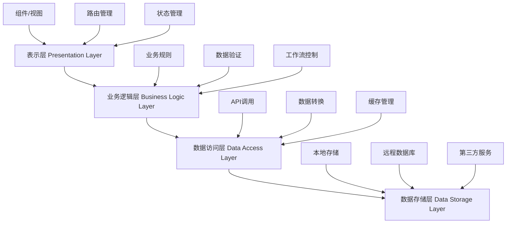
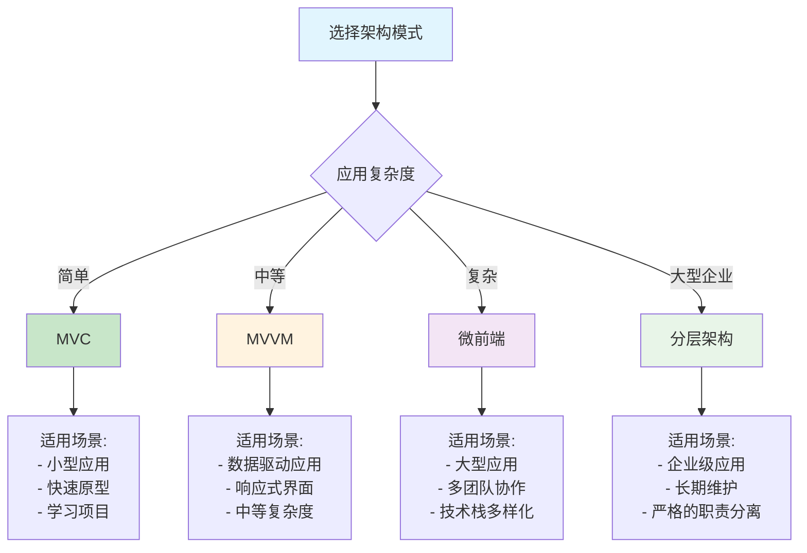

# 架构模式：构建可扩展的应用

> 从单体应用到微前端，从MVC到MVVM，架构模式决定了应用的生命力。好的架构就像城市规划，既要满足当前需求，又要为未来发展留足空间。

## 一、MVC模式：经典的三层架构

### 1.1 什么是MVC？

MVC（Model-View-Controller）是最经典的架构模式之一，将应用分为三个核心组件：
- **Model（模型）**：负责数据管理和业务逻辑
- **View（视图）**：负责用户界面展示
- **Controller（控制器）**：负责处理用户输入，协调Model和View

就像一个餐厅：厨师（Model）负责做菜，服务员（Controller）负责接单和传菜，餐桌（View）负责展示美食。

### 1.2 JavaScript中的MVC实现

```javascript
// Model层 - 数据模型和业务逻辑
class TodoModel {
  constructor() {
    this.todos = [];
    this.observers = [];
    this.currentId = 1;
  }
  
  // 观察者模式，通知视图更新
  addObserver(observer) {
    this.observers.push(observer);
  }
  
  removeObserver(observer) {
    this.observers = this.observers.filter(obs => obs !== observer);
  }
  
  notifyObservers(action, data) {
    this.observers.forEach(observer => {
      if (typeof observer.update === 'function') {
        observer.update(action, data);
      }
    });
  }
  
  // 业务逻辑方法
  addTodo(text, priority = 'medium') {
    if (!text || text.trim().length === 0) {
      throw new Error('Todo文本不能为空');
    }
    
    const todo = {
      id: this.currentId++,
      text: text.trim(),
      completed: false,
      priority: priority,
      createdAt: new Date(),
      updatedAt: new Date()
    };
    
    this.todos.push(todo);
    this.notifyObservers('add', todo);
    
    return todo;
  }
  
  removeTodo(id) {
    const index = this.todos.findIndex(todo => todo.id === id);
    if (index === -1) {
      throw new Error(`Todo with id ${id} not found`);
    }
    
    const removedTodo = this.todos.splice(index, 1)[0];
    this.notifyObservers('remove', removedTodo);
    
    return removedTodo;
  }
  
  updateTodo(id, updates) {
    const todo = this.todos.find(todo => todo.id === id);
    if (!todo) {
      throw new Error(`Todo with id ${id} not found`);
    }
    
    const oldTodo = { ...todo };
    Object.assign(todo, updates, { updatedAt: new Date() });
    
    this.notifyObservers('update', { old: oldTodo, new: todo });
    
    return todo;
  }
  
  toggleTodo(id) {
    const todo = this.todos.find(todo => todo.id === id);
    if (!todo) {
      throw new Error(`Todo with id ${id} not found`);
    }
    
    return this.updateTodo(id, { completed: !todo.completed });
  }
  
  getTodos(filter = 'all') {
    switch (filter) {
      case 'active':
        return this.todos.filter(todo => !todo.completed);
      case 'completed':
        return this.todos.filter(todo => todo.completed);
      case 'high':
      case 'medium':
      case 'low':
        return this.todos.filter(todo => todo.priority === filter);
      default:
        return [...this.todos];
    }
  }
  
  getStats() {
    const total = this.todos.length;
    const completed = this.todos.filter(todo => todo.completed).length;
    const active = total - completed;
    
    const priorityStats = this.todos.reduce((stats, todo) => {
      stats[todo.priority] = (stats[todo.priority] || 0) + 1;
      return stats;
    }, {});
    
    return {
      total,
      completed,
      active,
      completionRate: total > 0 ? (completed / total * 100).toFixed(1) : 0,
      priorityStats
    };
  }
  
  // 数据持久化
  save() {
    try {
      localStorage.setItem('todos', JSON.stringify(this.todos));
      localStorage.setItem('currentId', this.currentId.toString());
      return true;
    } catch (error) {
      console.error('保存数据失败:', error);
      return false;
    }
  }
  
  load() {
    try {
      const todosData = localStorage.getItem('todos');
      const currentIdData = localStorage.getItem('currentId');
      
      if (todosData) {
        this.todos = JSON.parse(todosData).map(todo => ({
          ...todo,
          createdAt: new Date(todo.createdAt),
          updatedAt: new Date(todo.updatedAt)
        }));
      }
      
      if (currentIdData) {
        this.currentId = parseInt(currentIdData, 10);
      }
      
      this.notifyObservers('load', this.todos);
      return true;
    } catch (error) {
      console.error('加载数据失败:', error);
      return false;
    }
  }
}

// View层 - 用户界面
class TodoView {
  constructor(containerId) {
    this.container = document.getElementById(containerId);
    if (!this.container) {
      throw new Error(`Container with id '${containerId}' not found`);
    }
    
    this.currentFilter = 'all';
    this.init();
  }
  
  init() {
    this.container.innerHTML = `
      <div class="todo-app">
        <header class="todo-header">
          <h1>📝 Todo MVC</h1>
          <div class="todo-stats" id="todoStats"></div>
        </header>
        
        <div class="todo-input-section">
          <input 
            type="text" 
            id="todoInput" 
            placeholder="添加新的待办事项..." 
            class="todo-input"
          >
          <select id="prioritySelect" class="priority-select">
            <option value="low">低优先级</option>
            <option value="medium" selected>中优先级</option>
            <option value="high">高优先级</option>
          </select>
          <button id="addBtn" class="add-btn">添加</button>
        </div>
        
        <div class="todo-filters">
          <button class="filter-btn active" data-filter="all">全部</button>
          <button class="filter-btn" data-filter="active">未完成</button>
          <button class="filter-btn" data-filter="completed">已完成</button>
          <button class="filter-btn" data-filter="high">高优先级</button>
          <button class="filter-btn" data-filter="medium">中优先级</button>
          <button class="filter-btn" data-filter="low">低优先级</button>
        </div>
        
        <div class="todo-list" id="todoList"></div>
        
        <div class="todo-actions">
          <button id="clearCompleted" class="action-btn">清除已完成</button>
          <button id="saveData" class="action-btn">保存数据</button>
          <button id="loadData" class="action-btn">加载数据</button>
        </div>
      </div>
    `;
    
    this.addStyles();
  }
  
  addStyles() {
    const style = document.createElement('style');
    style.textContent = `
      .todo-app {
        max-width: 600px;
        margin: 20px auto;
        padding: 20px;
        font-family: 'Segoe UI', Tahoma, Geneva, Verdana, sans-serif;
        background: #f8f9fa;
        border-radius: 12px;
        box-shadow: 0 4px 6px rgba(0, 0, 0, 0.1);
      }
      
      .todo-header {
        text-align: center;
        margin-bottom: 20px;
      }
      
      .todo-header h1 {
        color: #2c3e50;
        margin: 0 0 10px 0;
      }
      
      .todo-stats {
        background: #e9ecef;
        padding: 10px;
        border-radius: 8px;
        font-size: 14px;
        color: #6c757d;
      }
      
      .todo-input-section {
        display: flex;
        gap: 10px;
        margin-bottom: 20px;
      }
      
      .todo-input {
        flex: 1;
        padding: 12px;
        border: 2px solid #dee2e6;
        border-radius: 8px;
        font-size: 16px;
        outline: none;
        transition: border-color 0.3s;
      }
      
      .todo-input:focus {
        border-color: #007bff;
      }
      
      .priority-select {
        padding: 12px;
        border: 2px solid #dee2e6;
        border-radius: 8px;
        background: white;
        cursor: pointer;
      }
      
      .add-btn {
        padding: 12px 20px;
        background: #007bff;
        color: white;
        border: none;
        border-radius: 8px;
        cursor: pointer;
        font-weight: bold;
        transition: background-color 0.3s;
      }
      
      .add-btn:hover {
        background: #0056b3;
      }
      
      .todo-filters {
        display: flex;
        gap: 8px;
        margin-bottom: 20px;
        flex-wrap: wrap;
      }
      
      .filter-btn {
        padding: 8px 16px;
        border: 2px solid #dee2e6;
        background: white;
        border-radius: 20px;
        cursor: pointer;
        transition: all 0.3s;
        font-size: 14px;
      }
      
      .filter-btn.active {
        background: #007bff;
        color: white;
        border-color: #007bff;
      }
      
      .filter-btn:hover:not(.active) {
        background: #f8f9fa;
        border-color: #adb5bd;
      }
      
      .todo-list {
        min-height: 200px;
        margin-bottom: 20px;
      }
      
      .todo-item {
        display: flex;
        align-items: center;
        padding: 12px;
        margin-bottom: 8px;
        background: white;
        border-radius: 8px;
        box-shadow: 0 2px 4px rgba(0, 0, 0, 0.1);
        transition: transform 0.2s;
      }
      
      .todo-item:hover {
        transform: translateY(-1px);
      }
      
      .todo-item.completed {
        opacity: 0.7;
      }
      
      .todo-checkbox {
        margin-right: 12px;
        transform: scale(1.2);
        cursor: pointer;
      }
      
      .todo-text {
        flex: 1;
        font-size: 16px;
        transition: all 0.3s;
      }
      
      .todo-text.completed {
        text-decoration: line-through;
        color: #6c757d;
      }
      
      .todo-priority {
        padding: 4px 8px;
        border-radius: 12px;
        font-size: 12px;
        font-weight: bold;
        margin-right: 8px;
      }
      
      .priority-high {
        background: #dc3545;
        color: white;
      }
      
      .priority-medium {
        background: #ffc107;
        color: #212529;
      }
      
      .priority-low {
        background: #28a745;
        color: white;
      }
      
      .todo-meta {
        font-size: 12px;
        color: #6c757d;
        margin-right: 8px;
      }
      
      .todo-delete {
        background: #dc3545;
        color: white;
        border: none;
        border-radius: 4px;
        padding: 6px 10px;
        cursor: pointer;
        font-size: 12px;
        transition: background-color 0.3s;
      }
      
      .todo-delete:hover {
        background: #c82333;
      }
      
      .todo-actions {
        display: flex;
        gap: 10px;
        justify-content: center;
        flex-wrap: wrap;
      }
      
      .action-btn {
        padding: 10px 16px;
        border: 2px solid #6c757d;
        background: white;
        color: #6c757d;
        border-radius: 8px;
        cursor: pointer;
        transition: all 0.3s;
      }
      
      .action-btn:hover {
        background: #6c757d;
        color: white;
      }
      
      .empty-state {
        text-align: center;
        padding: 40px 20px;
        color: #6c757d;
      }
      
      .empty-state-icon {
        font-size: 48px;
        margin-bottom: 16px;
      }
    `;
    
    document.head.appendChild(style);
  }
  
  // 渲染待办事项列表
  renderTodos(todos) {
    const todoList = document.getElementById('todoList');
    
    if (todos.length === 0) {
      todoList.innerHTML = `
        <div class="empty-state">
          <div class="empty-state-icon">📝</div>
          <p>暂无待办事项</p>
          <p>添加一个新的任务开始吧！</p>
        </div>
      `;
      return;
    }
    
    todoList.innerHTML = todos.map(todo => `
      <div class="todo-item ${todo.completed ? 'completed' : ''}" data-id="${todo.id}">
        <input 
          type="checkbox" 
          class="todo-checkbox" 
          ${todo.completed ? 'checked' : ''}
          data-id="${todo.id}"
        >
        <span class="todo-text ${todo.completed ? 'completed' : ''}">${this.escapeHtml(todo.text)}</span>
        <span class="todo-priority priority-${todo.priority}">${this.getPriorityText(todo.priority)}</span>
        <span class="todo-meta">${this.formatDate(todo.createdAt)}</span>
        <button class="todo-delete" data-id="${todo.id}">删除</button>
      </div>
    `).join('');
  }
  
  // 渲染统计信息
  renderStats(stats) {
    const statsElement = document.getElementById('todoStats');
    const priorityStatsText = Object.entries(stats.priorityStats)
      .map(([priority, count]) => `${this.getPriorityText(priority)}: ${count}`)
      .join(' | ');
    
    statsElement.innerHTML = `
      总计: ${stats.total} | 
      已完成: ${stats.completed} | 
      未完成: ${stats.active} | 
      完成率: ${stats.completionRate}%
      ${priorityStatsText ? '<br>' + priorityStatsText : ''}
    `;
  }
  
  // 更新过滤器状态
  updateFilter(filter) {
    this.currentFilter = filter;
    
    // 更新按钮状态
    document.querySelectorAll('.filter-btn').forEach(btn => {
      btn.classList.remove('active');
      if (btn.dataset.filter === filter) {
        btn.classList.add('active');
      }
    });
  }
  
  // 获取用户输入
  getTodoInput() {
    const input = document.getElementById('todoInput');
    const priority = document.getElementById('prioritySelect');
    
    return {
      text: input.value.trim(),
      priority: priority.value
    };
  }
  
  // 清空输入框
  clearInput() {
    document.getElementById('todoInput').value = '';
    document.getElementById('prioritySelect').value = 'medium';
  }
  
  // 显示消息
  showMessage(message, type = 'info') {
    // 简单的消息提示实现
    const messageDiv = document.createElement('div');
    messageDiv.textContent = message;
    messageDiv.style.cssText = `
      position: fixed;
      top: 20px;
      right: 20px;
      padding: 12px 20px;
      background: ${type === 'error' ? '#dc3545' : '#28a745'};
      color: white;
      border-radius: 8px;
      z-index: 1000;
      animation: slideIn 0.3s ease;
    `;
    
    document.body.appendChild(messageDiv);
    
    setTimeout(() => {
      messageDiv.remove();
    }, 3000);
  }
  
  // 工具方法
  escapeHtml(text) {
    const div = document.createElement('div');
    div.textContent = text;
    return div.innerHTML;
  }
  
  getPriorityText(priority) {
    const priorityMap = {
      high: '高',
      medium: '中',
      low: '低'
    };
    return priorityMap[priority] || priority;
  }
  
  formatDate(date) {
    const now = new Date();
    const diff = now - date;
    const minutes = Math.floor(diff / 60000);
    const hours = Math.floor(diff / 3600000);
    const days = Math.floor(diff / 86400000);
    
    if (minutes < 1) return '刚刚';
    if (minutes < 60) return `${minutes}分钟前`;
    if (hours < 24) return `${hours}小时前`;
    if (days < 7) return `${days}天前`;
    
    return date.toLocaleDateString('zh-CN');
  }
  
  // 观察者模式接口
  update(action, data) {
    console.log(`View received update: ${action}`, data);
    // 这里可以根据不同的action做不同的UI更新
    // 实际的更新会通过Controller来协调
  }
}

// Controller层 - 控制逻辑
class TodoController {
  constructor(model, view) {
    this.model = model;
    this.view = view;
    
    // 让View观察Model的变化
    this.model.addObserver(this);
    
    this.init();
  }
  
  init() {
    this.bindEvents();
    this.loadData();
    this.updateView();
  }
  
  // 绑定事件
  bindEvents() {
    const container = this.view.container;
    
    // 添加待办事项
    container.addEventListener('click', (e) => {
      if (e.target.id === 'addBtn') {
        this.handleAddTodo();
      }
    });
    
    // 回车添加
    container.addEventListener('keypress', (e) => {
      if (e.target.id === 'todoInput' && e.key === 'Enter') {
        this.handleAddTodo();
      }
    });
    
    // 切换完成状态
    container.addEventListener('change', (e) => {
      if (e.target.classList.contains('todo-checkbox')) {
        const id = parseInt(e.target.dataset.id);
        this.handleToggleTodo(id);
      }
    });
    
    // 删除待办事项
    container.addEventListener('click', (e) => {
      if (e.target.classList.contains('todo-delete')) {
        const id = parseInt(e.target.dataset.id);
        this.handleDeleteTodo(id);
      }
    });
    
    // 过滤器
    container.addEventListener('click', (e) => {
      if (e.target.classList.contains('filter-btn')) {
        const filter = e.target.dataset.filter;
        this.handleFilterChange(filter);
      }
    });
    
    // 操作按钮
    container.addEventListener('click', (e) => {
      switch (e.target.id) {
        case 'clearCompleted':
          this.handleClearCompleted();
          break;
        case 'saveData':
          this.handleSaveData();
          break;
        case 'loadData':
          this.handleLoadData();
          break;
      }
    });
  }
  
  // 处理添加待办事项
  handleAddTodo() {
    try {
      const input = this.view.getTodoInput();
      
      if (!input.text) {
        this.view.showMessage('请输入待办事项内容', 'error');
        return;
      }
      
      this.model.addTodo(input.text, input.priority);
      this.view.clearInput();
      this.view.showMessage('添加成功！');
      
    } catch (error) {
      this.view.showMessage(error.message, 'error');
    }
  }
  
  // 处理切换完成状态
  handleToggleTodo(id) {
    try {
      this.model.toggleTodo(id);
    } catch (error) {
      this.view.showMessage(error.message, 'error');
    }
  }
  
  // 处理删除待办事项
  handleDeleteTodo(id) {
    try {
      this.model.removeTodo(id);
      this.view.showMessage('删除成功！');
    } catch (error) {
      this.view.showMessage(error.message, 'error');
    }
  }
  
  // 处理过滤器变化
  handleFilterChange(filter) {
    this.view.updateFilter(filter);
    this.updateView();
  }
  
  // 处理清除已完成
  handleClearCompleted() {
    try {
      const completedTodos = this.model.getTodos('completed');
      
      if (completedTodos.length === 0) {
        this.view.showMessage('没有已完成的待办事项', 'error');
        return;
      }
      
      completedTodos.forEach(todo => {
        this.model.removeTodo(todo.id);
      });
      
      this.view.showMessage(`清除了 ${completedTodos.length} 个已完成的待办事项`);
      
    } catch (error) {
      this.view.showMessage(error.message, 'error');
    }
  }
  
  // 处理保存数据
  handleSaveData() {
    if (this.model.save()) {
      this.view.showMessage('数据保存成功！');
    } else {
      this.view.showMessage('数据保存失败', 'error');
    }
  }
  
  // 处理加载数据
  handleLoadData() {
    if (this.model.load()) {
      this.view.showMessage('数据加载成功！');
      this.updateView();
    } else {
      this.view.showMessage('数据加载失败', 'error');
    }
  }
  
  // 加载初始数据
  loadData() {
    this.model.load();
  }
  
  // 更新视图
  updateView() {
    const todos = this.model.getTodos(this.view.currentFilter);
    const stats = this.model.getStats();
    
    this.view.renderTodos(todos);
    this.view.renderStats(stats);
  }
  
  // 观察者模式接口 - 响应Model变化
  update(action, data) {
    console.log(`Controller received update: ${action}`, data);
    
    // 根据不同的操作类型，决定是否需要更新视图
    switch (action) {
      case 'add':
      case 'remove':
      case 'update':
      case 'load':
        this.updateView();
        break;
      default:
        console.log(`Unknown action: ${action}`);
    }
  }
}

// 使用示例
function mvcDemo() {
  console.log('=== MVC模式Todo应用示例 ===');
  
  // 创建HTML容器
  if (!document.getElementById('todoApp')) {
    const container = document.createElement('div');
    container.id = 'todoApp';
    document.body.appendChild(container);
  }
  
  // 初始化MVC组件
  const model = new TodoModel();
  const view = new TodoView('todoApp');
  const controller = new TodoController(model, view);
  
  // 添加一些示例数据
  setTimeout(() => {
    try {
      model.addTodo('学习JavaScript设计模式', 'high');
      model.addTodo('完成项目文档', 'medium');
      model.addTodo('代码重构', 'low');
      
      console.log('✅ MVC Todo应用初始化完成！');
      console.log('📊 当前统计:', model.getStats());
    } catch (error) {
      console.error('初始化数据失败:', error);
    }
  }, 100);
  
  return { model, view, controller };
}

// 如果在浏览器环境中，自动运行示例
if (typeof window !== 'undefined' && typeof document !== 'undefined') {
  // 等待DOM加载完成
  if (document.readyState === 'loading') {
    document.addEventListener('DOMContentLoaded', mvcDemo);
  } else {
    mvcDemo();
  }
}
```

## 二、MVVM模式：数据驱动的现代架构

### 2.1 MVVM vs MVC

MVVM（Model-View-ViewModel）是MVC的进化版本，主要区别在于：
- **ViewModel**：替代Controller，负责数据绑定和业务逻辑
- **双向数据绑定**：View和ViewModel之间自动同步
- **更少的样板代码**：框架处理大部分UI更新逻辑

### 2.2 简化版MVVM实现

```javascript
// 简单的响应式系统
class ReactiveSystem {
  constructor() {
    this.dependencies = new Map();
    this.currentEffect = null;
  }
  
  // 依赖收集
  track(target, key) {
    if (!this.currentEffect) return;
    
    if (!this.dependencies.has(target)) {
      this.dependencies.set(target, new Map());
    }
    
    const depsMap = this.dependencies.get(target);
    if (!depsMap.has(key)) {
      depsMap.set(key, new Set());
    }
    
    depsMap.get(key).add(this.currentEffect);
  }
  
  // 触发更新
  trigger(target, key) {
    const depsMap = this.dependencies.get(target);
    if (!depsMap) return;
    
    const effects = depsMap.get(key);
    if (effects) {
      effects.forEach(effect => effect());
    }
  }
  
  // 创建响应式对象
  reactive(obj) {
    return new Proxy(obj, {
      get: (target, key) => {
        this.track(target, key);
        return target[key];
      },
      set: (target, key, value) => {
        target[key] = value;
        this.trigger(target, key);
        return true;
      }
    });
  }
  
  // 创建计算属性
  computed(fn) {
    let value;
    let dirty = true;
    
    const effect = () => {
      if (dirty) {
        value = fn();
        dirty = false;
      }
    };
    
    const computedRef = {
      get value() {
        if (dirty) {
          const prevEffect = reactiveSystem.currentEffect;
          reactiveSystem.currentEffect = effect;
          value = fn();
          dirty = false;
          reactiveSystem.currentEffect = prevEffect;
        }
        reactiveSystem.track(computedRef, 'value');
        return value;
      }
    };
    
    // 标记为脏数据的effect
    const dirtyEffect = () => {
      dirty = true;
      reactiveSystem.trigger(computedRef, 'value');
    };
    
    this.currentEffect = dirtyEffect;
    fn(); // 初始收集依赖
    this.currentEffect = null;
    
    return computedRef;
  }
  
  // 监听器
  watch(source, callback) {
    let oldValue;
    
    const effect = () => {
      const newValue = typeof source === 'function' ? source() : source.value;
      if (newValue !== oldValue) {
        callback(newValue, oldValue);
        oldValue = newValue;
      }
    };
    
    this.currentEffect = effect;
    oldValue = typeof source === 'function' ? source() : source.value;
    this.currentEffect = null;
    
    // 设置监听
    this.currentEffect = effect;
    if (typeof source === 'function') {
      source();
    }
    this.currentEffect = null;
  }
  
  // 副作用函数
  effect(fn) {
    this.currentEffect = fn;
    fn();
    this.currentEffect = null;
  }
}

// 全局响应式系统实例
const reactiveSystem = new ReactiveSystem();

// ViewModel基类
class ViewModel {
  constructor(data = {}) {
    // 创建响应式数据
    this.data = reactiveSystem.reactive(data);
    this.computedCache = new Map();
    this.watchers = [];
    
    // 绑定方法
    this.bindMethods();
  }
  
  // 绑定方法到实例
  bindMethods() {
    const proto = Object.getPrototypeOf(this);
    const methodNames = Object.getOwnPropertyNames(proto)
      .filter(name => name !== 'constructor' && typeof this[name] === 'function');
    
    methodNames.forEach(name => {
      this[name] = this[name].bind(this);
    });
  }
  
  // 创建计算属性
  computed(key, fn) {
    if (this.computedCache.has(key)) {
      return this.computedCache.get(key);
    }
    
    const computedRef = reactiveSystem.computed(() => fn.call(this));
    this.computedCache.set(key, computedRef);
    
    // 在实例上创建getter
    Object.defineProperty(this, key, {
      get() {
        return computedRef.value;
      },
      configurable: true
    });
    
    return computedRef;
  }
  
  // 创建监听器
  watch(source, callback) {
    const watcher = reactiveSystem.watch(
      typeof source === 'string' ? () => this.data[source] : source,
      callback
    );
    this.watchers.push(watcher);
    return watcher;
  }
  
  // 更新数据
  updateData(updates) {
    Object.assign(this.data, updates);
  }
  
  // 获取数据
  getData() {
    return { ...this.data };
  }
}

// 具体的ViewModel实现
class UserProfileViewModel extends ViewModel {
  constructor() {
    super({
      firstName: '',
      lastName: '',
      email: '',
      age: 0,
      avatar: '',
      bio: '',
      skills: [],
      isEditing: false,
      errors: {}
    });
    
    this.setupComputed();
    this.setupWatchers();
  }
  
  setupComputed() {
    // 计算全名
    this.computed('fullName', () => {
      const { firstName, lastName } = this.data;
      return `${firstName} ${lastName}`.trim();
    });
    
    // 计算年龄组
    this.computed('ageGroup', () => {
      const age = this.data.age;
      if (age < 18) return '未成年';
      if (age < 30) return '青年';
      if (age < 50) return '中年';
      return '老年';
    });
    
    // 计算技能标签
    this.computed('skillTags', () => {
      return this.data.skills.map(skill => `#${skill}`).join(' ');
    });
    
    // 计算表单验证状态
    this.computed('isValid', () => {
      const errors = this.validateForm();
      return Object.keys(errors).length === 0;
    });
    
    // 计算个人资料完整度
    this.computed('profileCompleteness', () => {
      const { firstName, lastName, email, age, bio } = this.data;
      const fields = [firstName, lastName, email, age > 0, bio];
      const completedFields = fields.filter(Boolean).length;
      return Math.round((completedFields / fields.length) * 100);
    });
  }
  
  setupWatchers() {
    // 监听邮箱变化，自动验证
    this.watch('email', (newEmail) => {
      if (newEmail) {
        this.validateEmail(newEmail);
      }
    });
    
    // 监听年龄变化
    this.watch('age', (newAge, oldAge) => {
      console.log(`年龄从 ${oldAge} 变更为 ${newAge}`);
      if (newAge < 0) {
        this.data.age = 0;
      } else if (newAge > 150) {
        this.data.age = 150;
      }
    });
    
    // 监听编辑状态变化
    this.watch('isEditing', (isEditing) => {
      if (isEditing) {
        console.log('进入编辑模式');
        this.backupData = { ...this.data };
      } else {
        console.log('退出编辑模式');
      }
    });
  }
  
  // 表单验证
  validateForm() {
    const errors = {};
    const { firstName, lastName, email, age } = this.data;
    
    if (!firstName.trim()) {
      errors.firstName = '请输入名字';
    }
    
    if (!lastName.trim()) {
      errors.lastName = '请输入姓氏';
    }
    
    if (!email.trim()) {
      errors.email = '请输入邮箱';
    } else if (!this.isValidEmail(email)) {
      errors.email = '邮箱格式不正确';
    }
    
    if (age <= 0) {
      errors.age = '请输入有效年龄';
    }
    
    this.data.errors = errors;
    return errors;
  }
  
  validateEmail(email) {
    const isValid = this.isValidEmail(email);
    if (!isValid) {
      this.data.errors = {
        ...this.data.errors,
        email: '邮箱格式不正确'
      };
    } else {
      const { email: emailError, ...otherErrors } = this.data.errors;
      this.data.errors = otherErrors;
    }
    return isValid;
  }
  
  isValidEmail(email) {
    const emailRegex = /^[^\s@]+@[^\s@]+\.[^\s@]+$/;
    return emailRegex.test(email);
  }
  
  // 业务方法
  startEditing() {
    this.data.isEditing = true;
  }
  
  cancelEditing() {
    if (this.backupData) {
      Object.assign(this.data, this.backupData);
      delete this.backupData;
    }
    this.data.isEditing = false;
  }
  
  saveProfile() {
    const errors = this.validateForm();
    if (Object.keys(errors).length > 0) {
      console.error('表单验证失败:', errors);
      return false;
    }
    
    // 模拟保存到服务器
    console.log('保存用户资料:', this.getData());
    this.data.isEditing = false;
    delete this.backupData;
    return true;
  }
  
  addSkill(skill) {
    if (skill && !this.data.skills.includes(skill)) {
      this.data.skills.push(skill);
    }
  }
  
  removeSkill(skill) {
    const index = this.data.skills.indexOf(skill);
    if (index > -1) {
      this.data.skills.splice(index, 1);
    }
  }
  
  updateField(field, value) {
    this.data[field] = value;
  }
  
  resetProfile() {
    this.updateData({
      firstName: '',
      lastName: '',
      email: '',
      age: 0,
      avatar: '',
      bio: '',
      skills: [],
      isEditing: false,
      errors: {}
    });
  }
  
  loadProfile(profileData) {
    this.updateData({
      ...profileData,
      isEditing: false,
      errors: {}
    });
  }
}

// View层 - 使用ViewModel
class UserProfileView {
  constructor(containerId, viewModel) {
    this.container = document.getElementById(containerId);
    this.viewModel = viewModel;
    
    if (!this.container) {
      throw new Error(`Container with id '${containerId}' not found`);
    }
    
    this.init();
    this.bindData();
  }
  
  init() {
    this.container.innerHTML = `
      <div class="user-profile">
        <div class="profile-header">
          <h2>👤 用户资料</h2>
          <div class="profile-actions">
            <button id="editBtn" class="btn btn-primary">编辑</button>
            <button id="saveBtn" class="btn btn-success" style="display: none;">保存</button>
            <button id="cancelBtn" class="btn btn-secondary" style="display: none;">取消</button>
          </div>
        </div>
        
        <div class="profile-content">
          <div class="profile-basic">
            <div class="form-group">
              <label>名字:</label>
              <input type="text" id="firstName" class="form-control" readonly>
              <div class="error-message" id="firstNameError"></div>
            </div>
            
            <div class="form-group">
              <label>姓氏:</label>
              <input type="text" id="lastName" class="form-control" readonly>
              <div class="error-message" id="lastNameError"></div>
            </div>
            
            <div class="form-group">
              <label>邮箱:</label>
              <input type="email" id="email" class="form-control" readonly>
              <div class="error-message" id="emailError"></div>
            </div>
            
            <div class="form-group">
              <label>年龄:</label>
              <input type="number" id="age" class="form-control" readonly>
              <div class="error-message" id="ageError"></div>
            </div>
            
            <div class="form-group">
              <label>个人简介:</label>
              <textarea id="bio" class="form-control" readonly rows="3"></textarea>
            </div>
          </div>
          
          <div class="profile-computed">
            <div class="computed-field">
              <label>全名:</label>
              <span id="fullName" class="computed-value"></span>
            </div>
            
            <div class="computed-field">
              <label>年龄组:</label>
              <span id="ageGroup" class="computed-value"></span>
            </div>
            
            <div class="computed-field">
              <label>资料完整度:</label>
              <div class="progress">
                <div id="progressBar" class="progress-bar"></div>
                <span id="completeness" class="progress-text"></span>
              </div>
            </div>
          </div>
          
          <div class="profile-skills">
            <label>技能:</label>
            <div class="skills-container">
              <div id="skillsList" class="skills-list"></div>
              <div id="skillInput" class="skill-input" style="display: none;">
                <input type="text" id="newSkill" placeholder="添加技能">
                <button id="addSkillBtn" class="btn btn-sm">添加</button>
              </div>
            </div>
            <div id="skillTags" class="skill-tags"></div>
          </div>
        </div>
        
        <div class="profile-actions-bottom">
          <button id="resetBtn" class="btn btn-warning">重置</button>
          <button id="loadSampleBtn" class="btn btn-info">加载示例数据</button>
        </div>
      </div>
    `;
    
    this.addStyles();
    this.bindEvents();
  }
  
  addStyles() {
    const style = document.createElement('style');
    style.textContent = `
      .user-profile {
        max-width: 800px;
        margin: 20px auto;
        padding: 20px;
        font-family: 'Segoe UI', Tahoma, Geneva, Verdana, sans-serif;
        background: #f8f9fa;
        border-radius: 12px;
        box-shadow: 0 4px 6px rgba(0, 0, 0, 0.1);
      }
      
      .profile-header {
        display: flex;
        justify-content: space-between;
        align-items: center;
        margin-bottom: 20px;
        padding-bottom: 15px;
        border-bottom: 2px solid #dee2e6;
      }
      
      .profile-header h2 {
        margin: 0;
        color: #2c3e50;
      }
      
      .profile-actions {
        display: flex;
        gap: 10px;
      }
      
      .btn {
        padding: 8px 16px;
        border: none;
        border-radius: 6px;
        cursor: pointer;
        font-size: 14px;
        transition: all 0.3s;
      }
      
      .btn-primary {
        background: #007bff;
        color: white;
      }
      
      .btn-primary:hover {
        background: #0056b3;
      }
      
      .btn-success {
        background: #28a745;
        color: white;
      }
      
      .btn-success:hover {
        background: #1e7e34;
      }
      
      .btn-secondary {
        background: #6c757d;
        color: white;
      }
      
      .btn-secondary:hover {
        background: #545b62;
      }
      
      .btn-warning {
        background: #ffc107;
        color: #212529;
      }
      
      .btn-warning:hover {
        background: #e0a800;
      }
      
      .btn-info {
        background: #17a2b8;
        color: white;
      }
      
      .btn-info:hover {
        background: #117a8b;
      }
      
      .btn-sm {
        padding: 4px 8px;
        font-size: 12px;
      }
      
      .profile-content {
        display: grid;
        grid-template-columns: 1fr 1fr;
        gap: 20px;
        margin-bottom: 20px;
      }
      
      .profile-basic {
        background: white;
        padding: 20px;
        border-radius: 8px;
        box-shadow: 0 2px 4px rgba(0, 0, 0, 0.1);
      }
      
      .profile-computed {
        background: white;
        padding: 20px;
        border-radius: 8px;
        box-shadow: 0 2px 4px rgba(0, 0, 0, 0.1);
      }
      
      .form-group {
        margin-bottom: 15px;
      }
      
      .form-group label {
        display: block;
        margin-bottom: 5px;
        font-weight: bold;
        color: #495057;
      }
      
      .form-control {
        width: 100%;
        padding: 8px 12px;
        border: 2px solid #dee2e6;
        border-radius: 6px;
        font-size: 14px;
        transition: border-color 0.3s;
        box-sizing: border-box;
      }
      
      .form-control:focus {
        outline: none;
        border-color: #007bff;
      }
      
      .form-control[readonly] {
        background: #f8f9fa;
        cursor: not-allowed;
      }
      
      .error-message {
        color: #dc3545;
        font-size: 12px;
        margin-top: 4px;
        min-height: 16px;
      }
      
      .computed-field {
        margin-bottom: 15px;
      }
      
      .computed-field label {
        display: block;
        margin-bottom: 5px;
        font-weight: bold;
        color: #495057;
      }
      
      .computed-value {
        display: block;
        padding: 8px 12px;
        background: #e9ecef;
        border-radius: 6px;
        font-size: 14px;
        color: #495057;
      }
      
      .progress {
        position: relative;
        height: 24px;
        background: #e9ecef;
        border-radius: 12px;
        overflow: hidden;
      }
      
      .progress-bar {
        height: 100%;
        background: linear-gradient(90deg, #28a745, #20c997);
        transition: width 0.3s ease;
        border-radius: 12px;
      }
      
      .progress-text {
        position: absolute;
        top: 50%;
        left: 50%;
        transform: translate(-50%, -50%);
        font-size: 12px;
        font-weight: bold;
        color: #495057;
      }
      
      .profile-skills {
        grid-column: 1 / -1;
        background: white;
        padding: 20px;
        border-radius: 8px;
        box-shadow: 0 2px 4px rgba(0, 0, 0, 0.1);
      }
      
      .skills-container {
        margin-bottom: 10px;
      }
      
      .skills-list {
        display: flex;
        flex-wrap: wrap;
        gap: 8px;
        margin-bottom: 10px;
      }
      
      .skill-item {
        display: flex;
        align-items: center;
        padding: 4px 8px;
        background: #007bff;
        color: white;
        border-radius: 16px;
        font-size: 12px;
      }
      
      .skill-remove {
        margin-left: 6px;
        background: none;
        border: none;
        color: white;
        cursor: pointer;
        font-size: 14px;
        line-height: 1;
      }
      
      .skill-input {
        display: flex;
        gap: 8px;
        align-items: center;
      }
      
      .skill-input input {
        flex: 1;
        padding: 6px 10px;
        border: 2px solid #dee2e6;
        border-radius: 4px;
        font-size: 12px;
      }
      
      .skill-tags {
        color: #6c757d;
        font-style: italic;
        font-size: 14px;
      }
      
      .profile-actions-bottom {
        display: flex;
        gap: 10px;
        justify-content: center;
        padding-top: 15px;
        border-top: 2px solid #dee2e6;
      }
      
      @media (max-width: 768px) {
        .profile-content {
          grid-template-columns: 1fr;
        }
      }
    `;
    
    document.head.appendChild(style);
  }
  
  bindEvents() {
    const container = this.container;
    
    // 编辑按钮
    container.addEventListener('click', (e) => {
      switch (e.target.id) {
        case 'editBtn':
          this.viewModel.startEditing();
          break;
        case 'saveBtn':
          this.viewModel.saveProfile();
          break;
        case 'cancelBtn':
          this.viewModel.cancelEditing();
          break;
        case 'resetBtn':
          this.viewModel.resetProfile();
          break;
        case 'loadSampleBtn':
          this.loadSampleData();
          break;
        case 'addSkillBtn':
          this.addSkill();
          break;
      }
    });
    
    // 删除技能
    container.addEventListener('click', (e) => {
      if (e.target.classList.contains('skill-remove')) {
        const skill = e.target.dataset.skill;
        this.viewModel.removeSkill(skill);
      }
    });
    
    // 输入框变化
    container.addEventListener('input', (e) => {
      const field = e.target.id;
      const value = e.target.type === 'number' ? parseInt(e.target.value) || 0 : e.target.value;
      
      if (['firstName', 'lastName', 'email', 'age', 'bio'].includes(field)) {
        this.viewModel.updateField(field, value);
      }
    });
    
    // 回车添加技能
    container.addEventListener('keypress', (e) => {
      if (e.target.id === 'newSkill' && e.key === 'Enter') {
        this.addSkill();
      }
    });
  }
  
  bindData() {
    // 绑定基础数据
    reactiveSystem.effect(() => {
      document.getElementById('firstName').value = this.viewModel.data.firstName;
    });
    
    reactiveSystem.effect(() => {
      document.getElementById('lastName').value = this.viewModel.data.lastName;
    });
    
    reactiveSystem.effect(() => {
      document.getElementById('email').value = this.viewModel.data.email;
    });
    
    reactiveSystem.effect(() => {
      document.getElementById('age').value = this.viewModel.data.age;
    });
    
    reactiveSystem.effect(() => {
      document.getElementById('bio').value = this.viewModel.data.bio;
    });
    
    // 绑定计算属性
    reactiveSystem.effect(() => {
      document.getElementById('fullName').textContent = this.viewModel.fullName;
    });
    
    reactiveSystem.effect(() => {
      document.getElementById('ageGroup').textContent = this.viewModel.ageGroup;
    });
    
    reactiveSystem.effect(() => {
      const completeness = this.viewModel.profileCompleteness;
      document.getElementById('progressBar').style.width = `${completeness}%`;
      document.getElementById('completeness').textContent = `${completeness}%`;
    });
    
    reactiveSystem.effect(() => {
      document.getElementById('skillTags').textContent = this.viewModel.skillTags;
    });
    
    // 绑定编辑状态
    reactiveSystem.effect(() => {
      const isEditing = this.viewModel.data.isEditing;
      const inputs = this.container.querySelectorAll('.form-control');
      
      inputs.forEach(input => {
        input.readOnly = !isEditing;
      });
      
      document.getElementById('editBtn').style.display = isEditing ? 'none' : 'inline-block';
      document.getElementById('saveBtn').style.display = isEditing ? 'inline-block' : 'none';
      document.getElementById('cancelBtn').style.display = isEditing ? 'inline-block' : 'none';
      document.getElementById('skillInput').style.display = isEditing ? 'flex' : 'none';
    });
    
    // 绑定技能列表
    reactiveSystem.effect(() => {
      this.renderSkills();
    });
    
    // 绑定错误信息
    reactiveSystem.effect(() => {
      this.renderErrors();
    });
  }
  
  renderSkills() {
    const skillsList = document.getElementById('skillsList');
    const skills = this.viewModel.data.skills;
    const isEditing = this.viewModel.data.isEditing;
    
    skillsList.innerHTML = skills.map(skill => `
      <div class="skill-item">
        ${skill}
        ${isEditing ? `<button class="skill-remove" data-skill="${skill}">×</button>` : ''}
      </div>
    `).join('');
  }
  
  renderErrors() {
    const errors = this.viewModel.data.errors;
    
    ['firstName', 'lastName', 'email', 'age'].forEach(field => {
      const errorElement = document.getElementById(`${field}Error`);
      if (errorElement) {
        errorElement.textContent = errors[field] || '';
      }
    });
  }
  
  addSkill() {
    const input = document.getElementById('newSkill');
    const skill = input.value.trim();
    
    if (skill) {
      this.viewModel.addSkill(skill);
      input.value = '';
    }
  }
  
  loadSampleData() {
    this.viewModel.loadProfile({
      firstName: '张',
      lastName: '三',
      email: 'zhangsan@example.com',
      age: 28,
      bio: '热爱编程的前端开发工程师，专注于用户体验和代码质量。',
      skills: ['JavaScript', 'Vue.js', 'React', 'Node.js', 'TypeScript']
    });
  }
}

// 使用示例
function mvvmDemo() {
  console.log('=== MVVM模式用户资料示例 ===');
  
  // 创建HTML容器
  if (!document.getElementById('userProfileApp')) {
    const container = document.createElement('div');
    container.id = 'userProfileApp';
    document.body.appendChild(container);
  }
  
  // 初始化MVVM组件
  const viewModel = new UserProfileViewModel();
  const view = new UserProfileView('userProfileApp', viewModel);
  
  console.log('✅ MVVM用户资料应用初始化完成！');
  
  // 演示响应式特性
  setTimeout(() => {
    console.log('🔄 演示响应式数据绑定...');
    
    viewModel.updateData({
      firstName: 'John',
      lastName: 'Doe',
      email: 'john.doe@example.com',
      age: 25
    });
    
    console.log('📊 当前计算属性:');
    console.log('- 全名:', viewModel.fullName);
    console.log('- 年龄组:', viewModel.ageGroup);
    console.log('- 资料完整度:', viewModel.profileCompleteness + '%');
  }, 1000);
  
  return { viewModel, view };
}

// 如果在浏览器环境中，自动运行示例
if (typeof window !== 'undefined' && typeof document !== 'undefined') {
  if (document.readyState === 'loading') {
    document.addEventListener('DOMContentLoaded', mvvmDemo);
  } else {
    mvvmDemo();
  }
}
```

## 三、微前端架构：大型应用的模块化解决方案

### 3.1 什么是微前端？

微前端是一种将大型前端应用拆分为多个小型、独立的前端应用的架构模式。每个微前端应用可以：
- 独立开发和部署
- 使用不同的技术栈
- 由不同的团队维护
- 在运行时组合成完整应用

### 3.2 微前端架构实现

```javascript
// 微前端注册中心
class MicroFrontendRegistry {
  constructor() {
    this.apps = new Map();
    this.loadedApps = new Map();
    this.mountedApps = new Set();
    this.globalEventBus = new EventTarget();
    this.sharedDependencies = new Map();
  }
  
  // 注册微前端应用
  registerApp(config) {
    const {
      name,
      entry,
      container,
      activeWhen,
      props = {},
      dependencies = []
    } = config;
    
    if (this.apps.has(name)) {
      throw new Error(`App ${name} is already registered`);
    }
    
    const app = {
      name,
      entry,
      container,
      activeWhen: typeof activeWhen === 'function' ? activeWhen : () => activeWhen,
      props,
      dependencies,
      status: 'NOT_LOADED',
      loadPromise: null,
      mountPromise: null,
      unmountPromise: null
    };
    
    this.apps.set(name, app);
    console.log(`📦 注册微前端应用: ${name}`);
    
    return app;
  }
  
  // 加载应用
  async loadApp(name) {
    const app = this.apps.get(name);
    if (!app) {
      throw new Error(`App ${name} is not registered`);
    }
    
    if (app.status === 'LOADED' || app.status === 'MOUNTED') {
      return app;
    }
    
    if (app.loadPromise) {
      return app.loadPromise;
    }
    
    app.loadPromise = this._loadApp(app);
    return app.loadPromise;
  }
  
  async _loadApp(app) {
    try {
      console.log(`🔄 加载应用: ${app.name}`);
      app.status = 'LOADING';
      
      // 加载依赖
      await this.loadDependencies(app.dependencies);
      
      // 加载应用代码
      const appModule = await this.loadAppModule(app.entry);
      
      // 验证应用接口
      this.validateAppModule(appModule, app.name);
      
      app.module = appModule;
      app.status = 'LOADED';
      
      console.log(`✅ 应用加载完成: ${app.name}`);
      
      this.globalEventBus.dispatchEvent(new CustomEvent('app-loaded', {
        detail: { app }
      }));
      
      return app;
      
    } catch (error) {
      app.status = 'LOAD_ERROR';
      console.error(`❌ 应用加载失败: ${app.name}`, error);
      throw error;
    }
  }
  
  // 挂载应用
  async mountApp(name) {
    const app = await this.loadApp(name);
    
    if (app.status === 'MOUNTED') {
      return app;
    }
    
    if (app.mountPromise) {
      return app.mountPromise;
    }
    
    app.mountPromise = this._mountApp(app);
    return app.mountPromise;
  }
  
  async _mountApp(app) {
    try {
      console.log(`🔧 挂载应用: ${app.name}`);
      app.status = 'MOUNTING';
      
      // 准备容器
      const container = this.prepareContainer(app.container);
      
      // 准备应用属性
      const appProps = {
        ...app.props,
        container,
        eventBus: this.globalEventBus,
        sharedDependencies: this.sharedDependencies,
        registry: this
      };
      
      // 调用应用的mount方法
      await app.module.mount(appProps);
      
      app.status = 'MOUNTED';
      this.mountedApps.add(app.name);
      
      console.log(`✅ 应用挂载完成: ${app.name}`);
      
      this.globalEventBus.dispatchEvent(new CustomEvent('app-mounted', {
        detail: { app }
      }));
      
      return app;
      
    } catch (error) {
      app.status = 'MOUNT_ERROR';
      console.error(`❌ 应用挂载失败: ${app.name}`, error);
      throw error;
    }
  }
  
  // 卸载应用
  async unmountApp(name) {
    const app = this.apps.get(name);
    if (!app || app.status !== 'MOUNTED') {
      return;
    }
    
    if (app.unmountPromise) {
      return app.unmountPromise;
    }
    
    app.unmountPromise = this._unmountApp(app);
    return app.unmountPromise;
  }
  
  async _unmountApp(app) {
    try {
      console.log(`🔄 卸载应用: ${app.name}`);
      app.status = 'UNMOUNTING';
      
      // 调用应用的unmount方法
      if (app.module && typeof app.module.unmount === 'function') {
        await app.module.unmount();
      }
      
      // 清理容器
      this.cleanupContainer(app.container);
      
      app.status = 'LOADED';
      this.mountedApps.delete(app.name);
      
      console.log(`✅ 应用卸载完成: ${app.name}`);
      
      this.globalEventBus.dispatchEvent(new CustomEvent('app-unmounted', {
        detail: { app }
      }));
      
    } catch (error) {
      app.status = 'UNMOUNT_ERROR';
      console.error(`❌ 应用卸载失败: ${app.name}`, error);
      throw error;
    }
  }
  
  // 路由变化时检查应用状态
  async checkApps(location = window.location) {
    const appsToMount = [];
    const appsToUnmount = [];
    
    for (const [name, app] of this.apps) {
      const shouldBeActive = app.activeWhen(location);
      const isActive = this.mountedApps.has(name);
      
      if (shouldBeActive && !isActive) {
        appsToMount.push(name);
      } else if (!shouldBeActive && isActive) {
        appsToUnmount.push(name);
      }
    }
    
    // 并行处理挂载和卸载
    const unmountPromises = appsToUnmount.map(name => this.unmountApp(name));
    const mountPromises = appsToMount.map(name => this.mountApp(name));
    
    await Promise.all([...unmountPromises, ...mountPromises]);
  }
  
  // 加载应用模块
  async loadAppModule(entry) {
    if (typeof entry === 'string') {
      // 动态导入
      if (entry.startsWith('http')) {
        return await this.loadRemoteModule(entry);
      } else {
        return await import(entry);
      }
    } else if (typeof entry === 'function') {
      return await entry();
    } else {
      return entry;
    }
  }
  
  // 加载远程模块
  async loadRemoteModule(url) {
    return new Promise((resolve, reject) => {
      const script = document.createElement('script');
      script.src = url;
      script.type = 'module';
      
      script.onload = () => {
        // 假设远程模块会在全局注册
        const moduleName = this.extractModuleName(url);
        const module = window[moduleName];
        
        if (module) {
          resolve(module);
        } else {
          reject(new Error(`Module ${moduleName} not found after loading ${url}`));
        }
      };
      
      script.onerror = () => {
        reject(new Error(`Failed to load script: ${url}`));
      };
      
      document.head.appendChild(script);
    });
  }
  
  extractModuleName(url) {
    return url.split('/').pop().replace('.js', '');
  }
  
  // 验证应用模块
  validateAppModule(module, appName) {
    if (!module || typeof module !== 'object') {
      throw new Error(`App ${appName} must export an object`);
    }
    
    if (typeof module.mount !== 'function') {
      throw new Error(`App ${appName} must export a mount function`);
    }
    
    if (module.unmount && typeof module.unmount !== 'function') {
      throw new Error(`App ${appName} unmount must be a function`);
    }
  }
  
  // 准备容器
  prepareContainer(containerSelector) {
    let container;
    
    if (typeof containerSelector === 'string') {
      container = document.querySelector(containerSelector);
      if (!container) {
        throw new Error(`Container ${containerSelector} not found`);
      }
    } else if (containerSelector instanceof HTMLElement) {
      container = containerSelector;
    } else {
      throw new Error('Invalid container selector');
    }
    
    // 清空容器
    container.innerHTML = '';
    
    return container;
  }
  
  // 清理容器
  cleanupContainer(containerSelector) {
    const container = typeof containerSelector === 'string' 
      ? document.querySelector(containerSelector)
      : containerSelector;
    
    if (container) {
      container.innerHTML = '';
    }
  }
  
  // 加载依赖
  async loadDependencies(dependencies) {
    const loadPromises = dependencies.map(dep => this.loadDependency(dep));
    await Promise.all(loadPromises);
  }
  
  async loadDependency(dependency) {
    if (this.sharedDependencies.has(dependency.name)) {
      return this.sharedDependencies.get(dependency.name);
    }
    
    console.log(`📚 加载共享依赖: ${dependency.name}`);
    
    let module;
    if (dependency.url) {
      module = await this.loadRemoteModule(dependency.url);
    } else if (dependency.module) {
      module = dependency.module;
    } else {
      throw new Error(`Invalid dependency configuration: ${dependency.name}`);
    }
    
    this.sharedDependencies.set(dependency.name, module);
    return module;
  }
  
  // 获取应用状态
  getAppStatus(name) {
    const app = this.apps.get(name);
    return app ? app.status : 'NOT_REGISTERED';
  }
  
  // 获取所有应用
  getAllApps() {
    return Array.from(this.apps.values());
  }
  
  // 获取已挂载的应用
  getMountedApps() {
    return Array.from(this.mountedApps);
  }
}

// 路由管理器
class MicroFrontendRouter {
  constructor(registry) {
    this.registry = registry;
    this.isStarted = false;
    
    this.handlePopState = this.handlePopState.bind(this);
    this.handleHashChange = this.handleHashChange.bind(this);
  }
  
  start() {
    if (this.isStarted) {
      return;
    }
    
    this.isStarted = true;
    
    // 监听路由变化
    window.addEventListener('popstate', this.handlePopState);
    window.addEventListener('hashchange', this.handleHashChange);
    
    // 劫持pushState和replaceState
    this.hijackHistory();
    
    // 初始检查
    this.registry.checkApps();
    
    console.log('🚀 微前端路由器启动');
  }
  
  stop() {
    if (!this.isStarted) {
      return;
    }
    
    this.isStarted = false;
    
    window.removeEventListener('popstate', this.handlePopState);
    window.removeEventListener('hashchange', this.handleHashChange);
    
    console.log('🛑 微前端路由器停止');
  }
  
  handlePopState() {
    this.registry.checkApps();
  }
  
  handleHashChange() {
    this.registry.checkApps();
  }
  
  hijackHistory() {
    const originalPushState = history.pushState;
    const originalReplaceState = history.replaceState;
    
    history.pushState = (...args) => {
      originalPushState.apply(history, args);
      this.registry.checkApps();
    };
    
    history.replaceState = (...args) => {
      originalReplaceState.apply(history, args);
      this.registry.checkApps();
    };
  }
  
  // 导航到指定路径
  navigate(path) {
    history.pushState(null, '', path);
    this.registry.checkApps();
  }
}

// 示例微前端应用
class HeaderApp {
  constructor() {
    this.container = null;
    this.eventBus = null;
  }
  
  async mount({ container, eventBus, sharedDependencies }) {
    this.container = container;
    this.eventBus = eventBus;
    
    this.render();
    this.bindEvents();
    
    console.log('🎯 Header应用已挂载');
  }
  
  async unmount() {
    if (this.container) {
      this.container.innerHTML = '';
    }
    
    console.log('🎯 Header应用已卸载');
  }
  
  render() {
    this.container.innerHTML = `
      <header class="micro-header">
        <div class="header-content">
          <h1>🏢 微前端应用</h1>
          <nav class="header-nav">
            <a href="#/home" class="nav-link">首页</a>
            <a href="#/dashboard" class="nav-link">仪表板</a>
            <a href="#/profile" class="nav-link">个人资料</a>
            <a href="#/settings" class="nav-link">设置</a>
          </nav>
          <div class="header-actions">
            <button id="notifyBtn" class="action-btn">发送通知</button>
            <span id="userInfo" class="user-info">用户: Admin</span>
          </div>
        </div>
      </header>
    `;
    
    this.addStyles();
  }
  
  addStyles() {
    const style = document.createElement('style');
    style.textContent = `
      .micro-header {
        background: linear-gradient(135deg, #667eea 0%, #764ba2 100%);
        color: white;
        padding: 0;
        box-shadow: 0 2px 10px rgba(0,0,0,0.1);
      }
      
      .header-content {
        max-width: 1200px;
        margin: 0 auto;
        padding: 1rem 2rem;
        display: flex;
        justify-content: space-between;
        align-items: center;
      }
      
      .header-content h1 {
        margin: 0;
        font-size: 1.5rem;
      }
      
      .header-nav {
        display: flex;
        gap: 2rem;
      }
      
      .nav-link {
        color: white;
        text-decoration: none;
        padding: 0.5rem 1rem;
        border-radius: 4px;
        transition: background-color 0.3s;
      }
      
      .nav-link:hover {
        background-color: rgba(255,255,255,0.2);
      }
      
      .header-actions {
        display: flex;
        align-items: center;
        gap: 1rem;
      }
      
      .action-btn {
        background: rgba(255,255,255,0.2);
        color: white;
        border: 1px solid rgba(255,255,255,0.3);
        padding: 0.5rem 1rem;
        border-radius: 4px;
        cursor: pointer;
        transition: all 0.3s;
      }
      
      .action-btn:hover {
        background: rgba(255,255,255,0.3);
      }
      
      .user-info {
        font-size: 0.9rem;
        opacity: 0.9;
      }
    `;
    
    document.head.appendChild(style);
  }
  
  bindEvents() {
    const notifyBtn = this.container.querySelector('#notifyBtn');
    notifyBtn.addEventListener('click', () => {
      this.eventBus.dispatchEvent(new CustomEvent('global-notification', {
        detail: {
          message: '这是来自Header应用的全局通知！',
          type: 'info'
        }
      }));
    });
  }
}

class DashboardApp {
  constructor() {
    this.container = null;
    this.eventBus = null;
    this.charts = [];
  }
  
  async mount({ container, eventBus }) {
    this.container = container;
    this.eventBus = eventBus;
    
    this.render();
    this.initCharts();
    this.bindEvents();
    
    console.log('📊 Dashboard应用已挂载');
  }
  
  async unmount() {
    this.cleanup();
    console.log('📊 Dashboard应用已卸载');
  }
  
  render() {
    this.container.innerHTML = `
      <div class="dashboard">
        <div class="dashboard-header">
          <h2>📊 数据仪表板</h2>
          <div class="dashboard-controls">
            <button id="refreshBtn" class="control-btn">刷新数据</button>
            <select id="timeRange" class="control-select">
              <option value="1h">最近1小时</option>
              <option value="24h" selected>最近24小时</option>
              <option value="7d">最近7天</option>
              <option value="30d">最近30天</option>
            </select>
          </div>
        </div>
        
        <div class="dashboard-grid">
          <div class="dashboard-card">
            <h3>📈 销售趋势</h3>
            <div id="salesChart" class="chart-container"></div>
          </div>
          
          <div class="dashboard-card">
            <h3>👥 用户活跃度</h3>
            <div id="userChart" class="chart-container"></div>
          </div>
          
          <div class="dashboard-card">
            <h3>💰 收入统计</h3>
            <div id="revenueChart" class="chart-container"></div>
          </div>
          
          <div class="dashboard-card">
            <h3>🎯 关键指标</h3>
            <div class="metrics-container">
              <div class="metric">
                <span class="metric-label">总用户数</span>
                <span class="metric-value" id="totalUsers">12,345</span>
              </div>
              <div class="metric">
                <span class="metric-label">活跃用户</span>
                <span class="metric-value" id="activeUsers">8,901</span>
              </div>
              <div class="metric">
                <span class="metric-label">转化率</span>
                <span class="metric-value" id="conversionRate">23.4%</span>
              </div>
            </div>
          </div>
        </div>
      </div>
    `;
    
    this.addStyles();
  }
  
  addStyles() {
    const style = document.createElement('style');
    style.textContent = `
      .dashboard {
        padding: 2rem;
        background: #f8f9fa;
        min-height: 100vh;
      }
      
      .dashboard-header {
        display: flex;
        justify-content: space-between;
        align-items: center;
        margin-bottom: 2rem;
      }
      
      .dashboard-header h2 {
        margin: 0;
        color: #2c3e50;
      }
      
      .dashboard-controls {
        display: flex;
        gap: 1rem;
        align-items: center;
      }
      
      .control-btn {
        background: #007bff;
        color: white;
        border: none;
        padding: 0.5rem 1rem;
        border-radius: 4px;
        cursor: pointer;
        transition: background-color 0.3s;
      }
      
      .control-btn:hover {
        background: #0056b3;
      }
      
      .control-select {
        padding: 0.5rem;
        border: 1px solid #ddd;
        border-radius: 4px;
        background: white;
      }
      
      .dashboard-grid {
        display: grid;
        grid-template-columns: repeat(auto-fit, minmax(300px, 1fr));
        gap: 1.5rem;
      }
      
      .dashboard-card {
        background: white;
        border-radius: 8px;
        padding: 1.5rem;
        box-shadow: 0 2px 10px rgba(0,0,0,0.1);
      }
      
      .dashboard-card h3 {
        margin: 0 0 1rem 0;
        color: #2c3e50;
        font-size: 1.1rem;
      }
      
      .chart-container {
        height: 200px;
        background: #f8f9fa;
        border-radius: 4px;
        display: flex;
        align-items: center;
        justify-content: center;
        color: #6c757d;
        font-style: italic;
      }
      
      .metrics-container {
        display: flex;
        flex-direction: column;
        gap: 1rem;
      }
      
      .metric {
        display: flex;
        justify-content: space-between;
        align-items: center;
        padding: 0.75rem;
        background: #f8f9fa;
        border-radius: 4px;
      }
      
      .metric-label {
        color: #6c757d;
        font-size: 0.9rem;
      }
      
      .metric-value {
        font-weight: bold;
        font-size: 1.2rem;
        color: #2c3e50;
      }
    `;
    
    document.head.appendChild(style);
  }
  
  initCharts() {
    // 模拟图表初始化
    const chartContainers = this.container.querySelectorAll('.chart-container');
    chartContainers.forEach((container, index) => {
      const chartTypes = ['📈 折线图', '📊 柱状图', '🥧 饼图'];
      container.textContent = `${chartTypes[index] || '📈 图表'} (模拟数据)`;
    });
  }
  
  bindEvents() {
    const refreshBtn = this.container.querySelector('#refreshBtn');
    const timeRange = this.container.querySelector('#timeRange');
    
    refreshBtn.addEventListener('click', () => {
      this.refreshData();
    });
    
    timeRange.addEventListener('change', (e) => {
      this.updateTimeRange(e.target.value);
    });
    
    // 监听全局事件
    this.eventBus.addEventListener('global-notification', (e) => {
      console.log('Dashboard收到全局通知:', e.detail);
    });
  }
  
  refreshData() {
    console.log('🔄 刷新仪表板数据...');
    
    // 模拟数据更新
    const totalUsers = this.container.querySelector('#totalUsers');
    const activeUsers = this.container.querySelector('#activeUsers');
    const conversionRate = this.container.querySelector('#conversionRate');
    
    totalUsers.textContent = (Math.random() * 20000 + 10000).toFixed(0);
    activeUsers.textContent = (Math.random() * 15000 + 5000).toFixed(0);
    conversionRate.textContent = (Math.random() * 30 + 15).toFixed(1) + '%';
    
    // 发送事件通知其他应用
    this.eventBus.dispatchEvent(new CustomEvent('data-refreshed', {
      detail: {
        timestamp: Date.now(),
        source: 'dashboard'
      }
    }));
  }
  
  updateTimeRange(range) {
    console.log(`📅 更新时间范围: ${range}`);
    // 这里可以重新加载对应时间范围的数据
  }
  
  cleanup() {
    if (this.container) {
      this.container.innerHTML = '';
    }
    this.charts = [];
  }
}

// 使用示例
function microFrontendDemo() {
  console.log('=== 微前端架构示例 ===');
  
  // 创建HTML容器
  if (!document.getElementById('microApp')) {
    const container = document.createElement('div');
    container.id = 'microApp';
    container.innerHTML = `
      <div id="header-container"></div>
      <div id="main-container"></div>
    `;
    document.body.appendChild(container);
  }
  
  // 创建注册中心和路由器
  const registry = new MicroFrontendRegistry();
  const router = new MicroFrontendRouter(registry);
  
  // 注册Header应用（始终显示）
  registry.registerApp({
    name: 'header',
    entry: () => ({ mount: new HeaderApp().mount.bind(new HeaderApp()), unmount: new HeaderApp().unmount.bind(new HeaderApp()) }),
    container: '#header-container',
    activeWhen: () => true // 始终激活
  });
  
  // 注册Dashboard应用
  registry.registerApp({
    name: 'dashboard',
    entry: () => ({ mount: new DashboardApp().mount.bind(new DashboardApp()), unmount: new DashboardApp().unmount.bind(new DashboardApp()) }),
    container: '#main-container',
    activeWhen: (location) => location.hash.includes('dashboard')
  });
  
  // 启动路由器
  router.start();
  
  console.log('✅ 微前端应用初始化完成！');
  console.log('🔗 尝试访问 #/dashboard 查看仪表板应用');
  
  // 自动导航到dashboard
  setTimeout(() => {
    router.navigate('#/dashboard');
  }, 1000);
  
  return { registry, router };
}

// 如果在浏览器环境中，自动运行示例
if (typeof window !== 'undefined' && typeof document !== 'undefined') {
  if (document.readyState === 'loading') {
    document.addEventListener('DOMContentLoaded', microFrontendDemo);
  } else {
    microFrontendDemo();
  }
}
```

## 四、分层架构：清晰的职责分离

### 4.1 分层架构概述

分层架构是一种将应用程序组织成水平层的架构模式，每一层只能与其直接相邻的层进行通信。这种模式有助于：
- 关注点分离
- 代码复用
- 可维护性
- 可测试性

### 4.2 典型的前端分层架构



### 4.3 分层架构实现

```javascript
// 数据存储层 - 负责数据持久化
class DataStorageLayer {
  constructor() {
    this.localStorage = window.localStorage;
    this.sessionStorage = window.sessionStorage;
    this.indexedDB = null;
    this.initIndexedDB();
  }
  
  async initIndexedDB() {
    return new Promise((resolve, reject) => {
      const request = indexedDB.open('AppDatabase', 1);
      
      request.onerror = () => reject(request.error);
      request.onsuccess = () => {
        this.indexedDB = request.result;
        resolve(this.indexedDB);
      };
      
      request.onupgradeneeded = (event) => {
        const db = event.target.result;
        
        // 创建用户存储
        if (!db.objectStoreNames.contains('users')) {
          const userStore = db.createObjectStore('users', { keyPath: 'id', autoIncrement: true });
          userStore.createIndex('email', 'email', { unique: true });
          userStore.createIndex('username', 'username', { unique: true });
        }
        
        // 创建产品存储
        if (!db.objectStoreNames.contains('products')) {
          const productStore = db.createObjectStore('products', { keyPath: 'id', autoIncrement: true });
          productStore.createIndex('category', 'category', { unique: false });
          productStore.createIndex('price', 'price', { unique: false });
        }
      };
    });
  }
  
  // 本地存储操作
  setLocal(key, value) {
    try {
      this.localStorage.setItem(key, JSON.stringify(value));
      return true;
    } catch (error) {
      console.error('本地存储失败:', error);
      return false;
    }
  }
  
  getLocal(key) {
    try {
      const value = this.localStorage.getItem(key);
      return value ? JSON.parse(value) : null;
    } catch (error) {
      console.error('本地存储读取失败:', error);
      return null;
    }
  }
  
  removeLocal(key) {
    this.localStorage.removeItem(key);
  }
  
  // IndexedDB操作
  async saveToIndexedDB(storeName, data) {
    if (!this.indexedDB) {
      await this.initIndexedDB();
    }
    
    return new Promise((resolve, reject) => {
      const transaction = this.indexedDB.transaction([storeName], 'readwrite');
      const store = transaction.objectStore(storeName);
      const request = store.add(data);
      
      request.onsuccess = () => resolve(request.result);
      request.onerror = () => reject(request.error);
    });
  }
  
  async getFromIndexedDB(storeName, id) {
    if (!this.indexedDB) {
      await this.initIndexedDB();
    }
    
    return new Promise((resolve, reject) => {
      const transaction = this.indexedDB.transaction([storeName], 'readonly');
      const store = transaction.objectStore(storeName);
      const request = store.get(id);
      
      request.onsuccess = () => resolve(request.result);
      request.onerror = () => reject(request.error);
    });
  }
  
  async getAllFromIndexedDB(storeName) {
    if (!this.indexedDB) {
      await this.initIndexedDB();
    }
    
    return new Promise((resolve, reject) => {
      const transaction = this.indexedDB.transaction([storeName], 'readonly');
      const store = transaction.objectStore(storeName);
      const request = store.getAll();
      
      request.onsuccess = () => resolve(request.result);
      request.onerror = () => reject(request.error);
    });
  }
}

// 数据访问层 - 负责数据获取和API调用
class DataAccessLayer {
  constructor(storageLayer) {
    this.storage = storageLayer;
    this.cache = new Map();
    this.cacheTimeout = 5 * 60 * 1000; // 5分钟缓存
    this.baseURL = 'https://api.example.com';
  }
  
  // HTTP请求封装
  async request(url, options = {}) {
    const config = {
      headers: {
        'Content-Type': 'application/json',
        ...options.headers
      },
      ...options
    };
    
    // 添加认证token
    const token = this.storage.getLocal('authToken');
    if (token) {
      config.headers.Authorization = `Bearer ${token}`;
    }
    
    try {
      const response = await fetch(`${this.baseURL}${url}`, config);
      
      if (!response.ok) {
        throw new Error(`HTTP ${response.status}: ${response.statusText}`);
      }
      
      const data = await response.json();
      return { success: true, data };
      
    } catch (error) {
      console.error('API请求失败:', error);
      return { success: false, error: error.message };
    }
  }
  
  // 缓存管理
  getCacheKey(key) {
    return `cache_${key}`;
  }
  
  setCache(key, data) {
    const cacheKey = this.getCacheKey(key);
    this.cache.set(cacheKey, {
      data,
      timestamp: Date.now()
    });
  }
  
  getCache(key) {
    const cacheKey = this.getCacheKey(key);
    const cached = this.cache.get(cacheKey);
    
    if (!cached) {
      return null;
    }
    
    // 检查缓存是否过期
    if (Date.now() - cached.timestamp > this.cacheTimeout) {
      this.cache.delete(cacheKey);
      return null;
    }
    
    return cached.data;
  }
  
  clearCache(key) {
    if (key) {
      this.cache.delete(this.getCacheKey(key));
    } else {
      this.cache.clear();
    }
  }
  
  // 用户数据操作
  async getUsers() {
    const cacheKey = 'users';
    let users = this.getCache(cacheKey);
    
    if (!users) {
      const result = await this.request('/users');
      if (result.success) {
        users = result.data;
        this.setCache(cacheKey, users);
        
        // 同时保存到本地存储
        this.storage.setLocal('users', users);
      } else {
        // 如果API失败，尝试从本地存储获取
        users = this.storage.getLocal('users') || [];
      }
    }
    
    return users;
  }
  
  async getUserById(id) {
    const cacheKey = `user_${id}`;
    let user = this.getCache(cacheKey);
    
    if (!user) {
      const result = await this.request(`/users/${id}`);
      if (result.success) {
        user = result.data;
        this.setCache(cacheKey, user);
      } else {
        // 尝试从IndexedDB获取
        user = await this.storage.getFromIndexedDB('users', id);
      }
    }
    
    return user;
  }
  
  async createUser(userData) {
    const result = await this.request('/users', {
      method: 'POST',
      body: JSON.stringify(userData)
    });
    
    if (result.success) {
      // 清除相关缓存
      this.clearCache('users');
      
      // 保存到IndexedDB
      await this.storage.saveToIndexedDB('users', result.data);
    }
    
    return result;
  }
  
  async updateUser(id, userData) {
    const result = await this.request(`/users/${id}`, {
      method: 'PUT',
      body: JSON.stringify(userData)
    });
    
    if (result.success) {
      // 清除相关缓存
      this.clearCache('users');
      this.clearCache(`user_${id}`);
    }
    
    return result;
  }
  
  // 产品数据操作
  async getProducts(filters = {}) {
    const cacheKey = `products_${JSON.stringify(filters)}`;
    let products = this.getCache(cacheKey);
    
    if (!products) {
      const queryParams = new URLSearchParams(filters).toString();
      const url = `/products${queryParams ? `?${queryParams}` : ''}`;
      
      const result = await this.request(url);
      if (result.success) {
        products = result.data;
        this.setCache(cacheKey, products);
      } else {
        products = await this.storage.getAllFromIndexedDB('products');
        
        // 应用过滤器
        if (filters.category) {
          products = products.filter(p => p.category === filters.category);
        }
        if (filters.minPrice) {
          products = products.filter(p => p.price >= filters.minPrice);
        }
        if (filters.maxPrice) {
          products = products.filter(p => p.price <= filters.maxPrice);
        }
      }
    }
    
    return products;
  }
}

// 业务逻辑层 - 负责业务规则和数据处理
class BusinessLogicLayer {
  constructor(dataAccessLayer) {
    this.dataAccess = dataAccessLayer;
    this.validators = new Map();
    this.businessRules = new Map();
    this.initValidators();
    this.initBusinessRules();
  }
  
  initValidators() {
    // 用户验证器
    this.validators.set('user', {
      email: (email) => {
        const emailRegex = /^[^\s@]+@[^\s@]+\.[^\s@]+$/;
        return emailRegex.test(email);
      },
      
      password: (password) => {
        // 至少8位，包含大小写字母和数字
        const passwordRegex = /^(?=.*[a-z])(?=.*[A-Z])(?=.*\d)[a-zA-Z\d@$!%*?&]{8,}$/;
        return passwordRegex.test(password);
      },
      
      username: (username) => {
        // 3-20位，只能包含字母、数字和下划线
        const usernameRegex = /^[a-zA-Z0-9_]{3,20}$/;
        return usernameRegex.test(username);
      },
      
      age: (age) => {
        return Number.isInteger(age) && age >= 0 && age <= 150;
      }
    });
    
    // 产品验证器
    this.validators.set('product', {
      name: (name) => {
        return typeof name === 'string' && name.trim().length >= 2;
      },
      
      price: (price) => {
        return typeof price === 'number' && price > 0;
      },
      
      category: (category) => {
        const validCategories = ['electronics', 'clothing', 'books', 'home', 'sports'];
        return validCategories.includes(category);
      },
      
      stock: (stock) => {
        return Number.isInteger(stock) && stock >= 0;
      }
    });
  }
  
  initBusinessRules() {
    // 用户业务规则
    this.businessRules.set('user', {
      canCreateAccount: (userData) => {
        // 检查年龄限制
        if (userData.age < 13) {
          return { valid: false, message: '用户年龄必须大于13岁' };
        }
        
        // 检查邮箱域名限制
        const restrictedDomains = ['tempmail.com', '10minutemail.com'];
        const emailDomain = userData.email.split('@')[1];
        if (restrictedDomains.includes(emailDomain)) {
          return { valid: false, message: '不允许使用临时邮箱注册' };
        }
        
        return { valid: true };
      },
      
      canUpdateProfile: (userId, updateData) => {
        // 检查是否尝试修改敏感信息
        const sensitiveFields = ['id', 'createdAt', 'role'];
        const hasSensitiveUpdate = Object.keys(updateData).some(key => 
          sensitiveFields.includes(key)
        );
        
        if (hasSensitiveUpdate) {
          return { valid: false, message: '不能修改敏感字段' };
        }
        
        return { valid: true };
      }
    });
    
    // 产品业务规则
    this.businessRules.set('product', {
      canPurchase: (product, quantity) => {
        if (product.stock < quantity) {
          return { valid: false, message: '库存不足' };
        }
        
        if (quantity <= 0) {
          return { valid: false, message: '购买数量必须大于0' };
        }
        
        if (quantity > 10) {
          return { valid: false, message: '单次购买数量不能超过10件' };
        }
        
        return { valid: true };
      },
      
      calculateDiscount: (product, user) => {
        let discount = 0;
        
        // VIP用户折扣
        if (user.vipLevel === 'gold') {
          discount += 0.1; // 10%折扣
        } else if (user.vipLevel === 'silver') {
          discount += 0.05; // 5%折扣
        }
        
        // 批量购买折扣
        if (product.quantity >= 5) {
          discount += 0.05; // 额外5%折扣
        }
        
        // 最大折扣限制
        return Math.min(discount, 0.3); // 最多30%折扣
      }
    });
  }
  
  // 验证数据
  validateData(type, data) {
    const validators = this.validators.get(type);
    if (!validators) {
      return { valid: false, errors: [`未知的验证类型: ${type}`] };
    }
    
    const errors = [];
    
    for (const [field, validator] of Object.entries(validators)) {
      if (data.hasOwnProperty(field)) {
        if (!validator(data[field])) {
          errors.push(`${field} 验证失败`);
        }
      }
    }
    
    return {
      valid: errors.length === 0,
      errors
    };
  }
  
  // 应用业务规则
  applyBusinessRule(type, ruleName, ...args) {
    const rules = this.businessRules.get(type);
    if (!rules || !rules[ruleName]) {
      return { valid: false, message: `未找到业务规则: ${type}.${ruleName}` };
    }
    
    return rules[ruleName](...args);
  }
  
  // 用户业务逻辑
  async createUser(userData) {
    console.log('🔄 创建用户业务逻辑处理...');
    
    // 数据验证
    const validation = this.validateData('user', userData);
    if (!validation.valid) {
      return { success: false, errors: validation.errors };
    }
    
    // 业务规则检查
    const businessRule = this.applyBusinessRule('user', 'canCreateAccount', userData);
    if (!businessRule.valid) {
      return { success: false, message: businessRule.message };
    }
    
    // 检查邮箱是否已存在
    const existingUsers = await this.dataAccess.getUsers();
    const emailExists = existingUsers.some(user => user.email === userData.email);
    if (emailExists) {
      return { success: false, message: '邮箱已被注册' };
    }
    
    // 处理密码加密（模拟）
    const processedData = {
      ...userData,
      password: this.hashPassword(userData.password),
      createdAt: new Date().toISOString(),
      vipLevel: 'bronze', // 默认会员等级
      status: 'active'
    };
    
    // 调用数据访问层
    const result = await this.dataAccess.createUser(processedData);
    
    if (result.success) {
      console.log('✅ 用户创建成功');
      // 移除敏感信息
      const { password, ...safeUserData } = result.data;
      return { success: true, data: safeUserData };
    }
    
    return result;
  }
  
  async updateUser(userId, updateData) {
    console.log(`🔄 更新用户 ${userId} 业务逻辑处理...`);
    
    // 业务规则检查
    const businessRule = this.applyBusinessRule('user', 'canUpdateProfile', userId, updateData);
    if (!businessRule.valid) {
      return { success: false, message: businessRule.message };
    }
    
    // 数据验证（只验证提供的字段）
    const validation = this.validateData('user', updateData);
    if (!validation.valid) {
      return { success: false, errors: validation.errors };
    }
    
    // 处理特殊字段
    const processedData = { ...updateData };
    if (processedData.password) {
      processedData.password = this.hashPassword(processedData.password);
    }
    processedData.updatedAt = new Date().toISOString();
    
    const result = await this.dataAccess.updateUser(userId, processedData);
    
    if (result.success) {
      console.log('✅ 用户更新成功');
      const { password, ...safeUserData } = result.data;
      return { success: true, data: safeUserData };
    }
    
    return result;
  }
  
  // 产品业务逻辑
  async getProductsWithDiscount(filters = {}, user = null) {
    console.log('🔄 获取产品列表（含折扣计算）...');
    
    const products = await this.dataAccess.getProducts(filters);
    
    if (!user) {
      return products;
    }
    
    // 为每个产品计算折扣
    const productsWithDiscount = products.map(product => {
      const discount = this.applyBusinessRule('product', 'calculateDiscount', product, user);
      const discountedPrice = product.price * (1 - discount);
      
      return {
        ...product,
        originalPrice: product.price,
        discountedPrice: Math.round(discountedPrice * 100) / 100,
        discount: Math.round(discount * 100),
        savings: Math.round((product.price - discountedPrice) * 100) / 100
      };
    });
    
    return productsWithDiscount;
  }
  
  async purchaseProduct(productId, quantity, user) {
    console.log(`🔄 购买产品 ${productId} 业务逻辑处理...`);
    
    // 获取产品信息
    const products = await this.dataAccess.getProducts({ id: productId });
    const product = products.find(p => p.id === productId);
    
    if (!product) {
      return { success: false, message: '产品不存在' };
    }
    
    // 检查购买规则
    const purchaseRule = this.applyBusinessRule('product', 'canPurchase', product, quantity);
    if (!purchaseRule.valid) {
      return { success: false, message: purchaseRule.message };
    }
    
    // 计算总价（含折扣）
    const discount = this.applyBusinessRule('product', 'calculateDiscount', { ...product, quantity }, user);
    const unitPrice = product.price * (1 - discount);
    const totalPrice = unitPrice * quantity;
    
    // 创建订单数据
    const orderData = {
      userId: user.id,
      productId,
      quantity,
      unitPrice: Math.round(unitPrice * 100) / 100,
      totalPrice: Math.round(totalPrice * 100) / 100,
      discount: Math.round(discount * 100),
      status: 'pending',
      createdAt: new Date().toISOString()
    };
    
    console.log('✅ 订单创建成功', orderData);
    return { success: true, data: orderData };
  }
  
  // 工具方法
  hashPassword(password) {
    // 这里应该使用真正的加密算法，如bcrypt
    // 这里只是模拟
    return `hashed_${password}_${Date.now()}`;
  }
}

// 表示层 - 负责用户界面和交互
class PresentationLayer {
  constructor(businessLogicLayer) {
    this.businessLogic = businessLogicLayer;
    this.currentUser = null;
    this.currentView = null;
    this.eventBus = new EventTarget();
  }
  
  // 初始化应用
  init() {
    this.createMainContainer();
    this.bindGlobalEvents();
    this.showLoginView();
    
    console.log('🎨 表示层初始化完成');
  }
  
  createMainContainer() {
    if (!document.getElementById('layeredApp')) {
      const container = document.createElement('div');
      container.id = 'layeredApp';
      container.innerHTML = `
        <div id="app-header"></div>
        <div id="app-main"></div>
        <div id="app-footer"></div>
        <div id="notification-container"></div>
      `;
      document.body.appendChild(container);
    }
    
    this.addGlobalStyles();
  }
  
  addGlobalStyles() {
    const style = document.createElement('style');
    style.textContent = `
      #layeredApp {
        font-family: -apple-system, BlinkMacSystemFont, 'Segoe UI', Roboto, sans-serif;
        min-height: 100vh;
        display: flex;
        flex-direction: column;
      }
      
      #app-header {
        background: linear-gradient(135deg, #667eea 0%, #764ba2 100%);
        color: white;
        padding: 1rem 2rem;
        box-shadow: 0 2px 10px rgba(0,0,0,0.1);
      }
      
      #app-main {
        flex: 1;
        padding: 2rem;
        background: #f8f9fa;
      }
      
      #app-footer {
        background: #2c3e50;
        color: white;
        padding: 1rem 2rem;
        text-align: center;
      }
      
      .form-container {
        max-width: 400px;
        margin: 2rem auto;
        background: white;
        padding: 2rem;
        border-radius: 8px;
        box-shadow: 0 4px 20px rgba(0,0,0,0.1);
      }
      
      .form-group {
        margin-bottom: 1rem;
      }
      
      .form-group label {
        display: block;
        margin-bottom: 0.5rem;
        font-weight: 500;
        color: #2c3e50;
      }
      
      .form-group input {
        width: 100%;
        padding: 0.75rem;
        border: 1px solid #ddd;
        border-radius: 4px;
        font-size: 1rem;
        transition: border-color 0.3s;
      }
      
      .form-group input:focus {
        outline: none;
        border-color: #667eea;
        box-shadow: 0 0 0 2px rgba(102, 126, 234, 0.2);
      }
      
      .btn {
        background: #667eea;
        color: white;
        border: none;
        padding: 0.75rem 1.5rem;
        border-radius: 4px;
        cursor: pointer;
        font-size: 1rem;
        transition: all 0.3s;
      }
      
      .btn:hover {
        background: #5a67d8;
        transform: translateY(-1px);
      }
      
      .btn-secondary {
        background: #6c757d;
      }
      
      .btn-secondary:hover {
        background: #5a6268;
      }
      
      .product-grid {
        display: grid;
        grid-template-columns: repeat(auto-fill, minmax(300px, 1fr));
        gap: 1.5rem;
        margin-top: 2rem;
      }
      
      .product-card {
        background: white;
        border-radius: 8px;
        padding: 1.5rem;
        box-shadow: 0 2px 10px rgba(0,0,0,0.1);
        transition: transform 0.3s;
      }
      
      .product-card:hover {
        transform: translateY(-2px);
      }
      
      .notification {
        position: fixed;
        top: 20px;
        right: 20px;
        padding: 1rem 1.5rem;
        border-radius: 4px;
        color: white;
        font-weight: 500;
        z-index: 1000;
        animation: slideIn 0.3s ease;
      }
      
      .notification.success {
        background: #28a745;
      }
      
      .notification.error {
        background: #dc3545;
      }
      
      .notification.info {
        background: #17a2b8;
      }
      
      @keyframes slideIn {
        from {
          transform: translateX(100%);
          opacity: 0;
        }
        to {
          transform: translateX(0);
          opacity: 1;
        }
      }
    `;
    
    document.head.appendChild(style);
  }
  
  bindGlobalEvents() {
    // 监听业务层事件
    this.eventBus.addEventListener('user-login', (e) => {
      this.currentUser = e.detail.user;
      this.showProductView();
      this.updateHeader();
    });
    
    this.eventBus.addEventListener('user-logout', () => {
      this.currentUser = null;
      this.showLoginView();
      this.updateHeader();
    });
  }
  
  // 显示通知
  showNotification(message, type = 'info') {
    const container = document.getElementById('notification-container');
    const notification = document.createElement('div');
    notification.className = `notification ${type}`;
    notification.textContent = message;
    
    container.appendChild(notification);
    
    // 3秒后自动移除
    setTimeout(() => {
      if (notification.parentNode) {
        notification.parentNode.removeChild(notification);
      }
    }, 3000);
  }
  
  // 更新头部
  updateHeader() {
    const header = document.getElementById('app-header');
    
    if (this.currentUser) {
      header.innerHTML = `
        <div style="display: flex; justify-content: space-between; align-items: center;">
          <h1>🏪 分层架构商店</h1>
          <div>
            <span>欢迎, ${this.currentUser.username}!</span>
            <button id="logoutBtn" class="btn btn-secondary" style="margin-left: 1rem;">退出登录</button>
          </div>
        </div>
      `;
      
      document.getElementById('logoutBtn').addEventListener('click', () => {
        this.eventBus.dispatchEvent(new CustomEvent('user-logout'));
      });
    } else {
      header.innerHTML = `
        <div style="text-align: center;">
          <h1>🏪 分层架构商店</h1>
          <p>请登录以继续</p>
        </div>
      `;
    }
  }
  
  // 显示登录视图
  showLoginView() {
    const main = document.getElementById('app-main');
    main.innerHTML = `
      <div class="form-container">
        <h2 style="text-align: center; margin-bottom: 2rem; color: #2c3e50;">用户登录</h2>
        
        <form id="loginForm">
          <div class="form-group">
            <label for="email">邮箱地址</label>
            <input type="email" id="email" name="email" required>
          </div>
          
          <div class="form-group">
            <label for="password">密码</label>
            <input type="password" id="password" name="password" required>
          </div>
          
          <div class="form-group">
            <button type="submit" class="btn" style="width: 100%;">登录</button>
          </div>
        </form>
        
        <div style="text-align: center; margin-top: 1rem;">
          <p>还没有账户？ <a href="#" id="showRegister">立即注册</a></p>
        </div>
      </div>
    `;
    
    this.bindLoginEvents();
    this.currentView = 'login';
  }
  
  bindLoginEvents() {
    const form = document.getElementById('loginForm');
    const showRegister = document.getElementById('showRegister');
    
    form.addEventListener('submit', async (e) => {
      e.preventDefault();
      
      const formData = new FormData(form);
      const email = formData.get('email');
      const password = formData.get('password');
      
      // 模拟登录（实际应该调用业务逻辑层的登录方法）
      if (email && password) {
        const mockUser = {
          id: 1,
          username: email.split('@')[0],
          email,
          vipLevel: 'gold'
        };
        
        this.eventBus.dispatchEvent(new CustomEvent('user-login', {
          detail: { user: mockUser }
        }));
        
        this.showNotification('登录成功！', 'success');
      } else {
        this.showNotification('请填写完整信息', 'error');
      }
    });
    
    showRegister.addEventListener('click', (e) => {
      e.preventDefault();
      this.showRegisterView();
    });
  }
  
  // 显示注册视图
  showRegisterView() {
    const main = document.getElementById('app-main');
    main.innerHTML = `
      <div class="form-container">
        <h2 style="text-align: center; margin-bottom: 2rem; color: #2c3e50;">用户注册</h2>
        
        <form id="registerForm">
          <div class="form-group">
            <label for="username">用户名</label>
            <input type="text" id="username" name="username" required>
          </div>
          
          <div class="form-group">
            <label for="email">邮箱地址</label>
            <input type="email" id="email" name="email" required>
          </div>
          
          <div class="form-group">
            <label for="password">密码</label>
            <input type="password" id="password" name="password" required>
          </div>
          
          <div class="form-group">
            <label for="age">年龄</label>
            <input type="number" id="age" name="age" min="13" max="150" required>
          </div>
          
          <div class="form-group">
            <button type="submit" class="btn" style="width: 100%;">注册</button>
          </div>
        </form>
        
        <div style="text-align: center; margin-top: 1rem;">
          <p>已有账户？ <a href="#" id="showLogin">立即登录</a></p>
        </div>
      </div>
    `;
    
    this.bindRegisterEvents();
    this.currentView = 'register';
  }
  
  bindRegisterEvents() {
    const form = document.getElementById('registerForm');
    const showLogin = document.getElementById('showLogin');
    
    form.addEventListener('submit', async (e) => {
      e.preventDefault();
      
      const formData = new FormData(form);
      const userData = {
        username: formData.get('username'),
        email: formData.get('email'),
        password: formData.get('password'),
        age: parseInt(formData.get('age'))
      };
      
      try {
        const result = await this.businessLogic.createUser(userData);
        
        if (result.success) {
          this.showNotification('注册成功！请登录', 'success');
          this.showLoginView();
        } else {
          const message = result.message || result.errors?.join(', ') || '注册失败';
          this.showNotification(message, 'error');
        }
      } catch (error) {
        this.showNotification('注册过程中发生错误', 'error');
        console.error('注册错误:', error);
      }
    });
    
    showLogin.addEventListener('click', (e) => {
      e.preventDefault();
      this.showLoginView();
    });
  }
  
  // 显示产品视图
  async showProductView() {
    const main = document.getElementById('app-main');
    main.innerHTML = `
      <div>
        <div style="display: flex; justify-content: space-between; align-items: center; margin-bottom: 2rem;">
          <h2>🛍️ 产品列表</h2>
          <div>
            <select id="categoryFilter" class="form-control" style="margin-right: 1rem;">
              <option value="">所有分类</option>
              <option value="electronics">电子产品</option>
              <option value="clothing">服装</option>
              <option value="books">图书</option>
              <option value="home">家居</option>
              <option value="sports">运动</option>
            </select>
            <button id="refreshProducts" class="btn">刷新</button>
          </div>
        </div>
        
        <div id="productGrid" class="product-grid">
          <div style="text-align: center; padding: 2rem;">加载中...</div>
        </div>
      </div>
    `;
    
    await this.loadProducts();
    this.bindProductEvents();
    this.currentView = 'products';
  }
  
  async loadProducts(filters = {}) {
    try {
      const products = await this.businessLogic.getProductsWithDiscount(filters, this.currentUser);
      this.renderProducts(products);
    } catch (error) {
      console.error('加载产品失败:', error);
      this.showNotification('加载产品失败', 'error');
    }
  }
  
  renderProducts(products) {
    const grid = document.getElementById('productGrid');
    
    if (products.length === 0) {
      grid.innerHTML = `
        <div style="text-align: center; padding: 2rem; color: #6c757d;">
          <p>暂无产品</p>
        </div>
      `;
      return;
    }
    
    grid.innerHTML = products.map(product => `
      <div class="product-card">
        <h3>${product.name}</h3>
        <p style="color: #6c757d; margin: 0.5rem 0;">${product.category}</p>
        
        <div style="margin: 1rem 0;">
          ${product.discount > 0 ? `
            <div style="display: flex; align-items: center; gap: 0.5rem;">
              <span style="text-decoration: line-through; color: #6c757d;">¥${product.originalPrice}</span>
              <span style="font-size: 1.2rem; font-weight: bold; color: #e74c3c;">¥${product.discountedPrice}</span>
              <span style="background: #e74c3c; color: white; padding: 0.2rem 0.5rem; border-radius: 4px; font-size: 0.8rem;">
                ${product.discount}% OFF
              </span>
            </div>
            <p style="color: #28a745; font-size: 0.9rem; margin: 0.5rem 0;">节省 ¥${product.savings}</p>
          ` : `
            <span style="font-size: 1.2rem; font-weight: bold;">¥${product.price}</span>
          `}
        </div>
        
        <p style="color: #6c757d; font-size: 0.9rem;">库存: ${product.stock}</p>
        
        <div style="margin-top: 1rem;">
          <input type="number" id="quantity_${product.id}" min="1" max="10" value="1" 
                 style="width: 60px; padding: 0.25rem; margin-right: 0.5rem; border: 1px solid #ddd; border-radius: 4px;">
          <button class="btn purchase-btn" data-product-id="${product.id}">购买</button>
        </div>
      </div>
    `).join('');
  }
  
  bindProductEvents() {
    const categoryFilter = document.getElementById('categoryFilter');
    const refreshBtn = document.getElementById('refreshProducts');
    const purchaseBtns = document.querySelectorAll('.purchase-btn');
    
    categoryFilter.addEventListener('change', (e) => {
      const filters = {};
      if (e.target.value) {
        filters.category = e.target.value;
      }
      this.loadProducts(filters);
    });
    
    refreshBtn.addEventListener('click', () => {
      this.loadProducts();
    });
    
    purchaseBtns.forEach(btn => {
      btn.addEventListener('click', async (e) => {
        const productId = parseInt(e.target.dataset.productId);
        const quantityInput = document.getElementById(`quantity_${productId}`);
        const quantity = parseInt(quantityInput.value);
        
        try {
          const result = await this.businessLogic.purchaseProduct(productId, quantity, this.currentUser);
          
          if (result.success) {
            this.showNotification(`购买成功！总价: ¥${result.data.totalPrice}`, 'success');
          } else {
            this.showNotification(result.message, 'error');
          }
        } catch (error) {
          this.showNotification('购买过程中发生错误', 'error');
          console.error('购买错误:', error);
        }
      });
    });
  }
  
  // 更新页脚
  updateFooter() {
    const footer = document.getElementById('app-footer');
    footer.innerHTML = `
      <p>&copy; 2024 分层架构商店 - 演示应用</p>
      <p style="font-size: 0.8rem; margin-top: 0.5rem; opacity: 0.8;">
        当前视图: ${this.currentView} | 用户: ${this.currentUser ? this.currentUser.username : '未登录'}
      </p>
    `;
  }
}

// 使用示例
function layeredArchitectureDemo() {
  console.log('=== 分层架构示例 ===');
  
  // 创建各层实例
  const storageLayer = new DataStorageLayer();
  const dataAccessLayer = new DataAccessLayer(storageLayer);
  const businessLogicLayer = new BusinessLogicLayer(dataAccessLayer);
  const presentationLayer = new PresentationLayer(businessLogicLayer);
  
  // 初始化表示层
  presentationLayer.init();
  presentationLayer.updateFooter();
  
  // 模拟一些产品数据
  const mockProducts = [
    { id: 1, name: 'iPhone 15 Pro', category: 'electronics', price: 7999, stock: 10 },
    { id: 2, name: '无线蓝牙耳机', category: 'electronics', price: 299, stock: 25 },
    { id: 3, name: '运动T恤', category: 'clothing', price: 89, stock: 50 },
    { id: 4, name: 'JavaScript高级程序设计', category: 'books', price: 79, stock: 30 },
    { id: 5, name: '智能台灯', category: 'home', price: 199, stock: 15 },
    { id: 6, name: '瑜伽垫', category: 'sports', price: 128, stock: 20 }
  ];
  
  // 保存模拟数据到本地存储
  storageLayer.setLocal('products', mockProducts);
  
  console.log('✅ 分层架构应用初始化完成！');
  console.log('🔗 请在界面中注册/登录以体验完整功能');
  
  return {
    storageLayer,
    dataAccessLayer,
    businessLogicLayer,
    presentationLayer
  };
}

// 如果在浏览器环境中，自动运行示例
if (typeof window !== 'undefined' && typeof document !== 'undefined') {
  if (document.readyState === 'loading') {
    document.addEventListener('DOMContentLoaded', layeredArchitectureDemo);
  } else {
    layeredArchitectureDemo();
  }
}
```

## 五、架构模式总结

### 5.1 架构模式对比



### 5.2 架构模式选择指南

| 架构模式 | 优势 | 劣势 | 适用场景 |
|---------|------|------|----------|
| **MVC** | 简单易懂、快速开发、职责清晰 | 控制器容易臃肿、视图与模型耦合 | 小型应用、原型开发 |
| **MVVM** | 数据绑定、响应式、可测试性强 | 学习成本高、调试复杂 | 数据驱动应用、现代框架 |
| **微前端** | 独立部署、技术栈自由、团队自治 | 复杂度高、性能开销、集成挑战 | 大型应用、多团队项目 |
| **分层架构** | 职责分离、可维护性、可扩展性 | 性能开销、过度设计风险 | 企业级应用、长期项目 |

### 5.3 实践建议

1. **渐进式架构演进**
   - 从简单的MVC开始
   - 根据需求复杂度逐步演进
   - 避免过度设计

2. **团队技能匹配**
   - 考虑团队的技术水平
   - 提供充分的培训和文档
   - 建立代码审查机制

3. **性能与复杂度平衡**
   - 监控应用性能指标
   - 定期重构和优化
   - 保持架构的简洁性

4. **工具链支持**
   - 选择合适的开发工具
   - 建立自动化测试
   - 配置持续集成/部署

## 总结

架构模式是构建可扩展前端应用的基石。通过本文的学习，我们深入了解了四种重要的架构模式：

- **MVC模式**：经典的三层架构，适合快速开发和学习
- **MVVM模式**：现代前端框架的核心，提供强大的数据绑定能力
- **微前端架构**：大型应用的模块化解决方案，支持独立开发和部署
- **分层架构**：企业级应用的标准架构，提供清晰的职责分离

选择合适的架构模式需要综合考虑项目规模、团队能力、技术要求和长期维护等因素。记住，没有银弹，只有最适合当前场景的解决方案。

在实际开发中，我们往往需要结合多种模式的优势，创造出适合自己项目的混合架构。关键是要保持架构的清晰性、可维护性和可扩展性，为项目的长期发展奠定坚实的基础。

下一篇文章，我们将深入探讨Vue、React、Redux等主流框架的源码中是如何应用这些设计模式的，敬请期待！