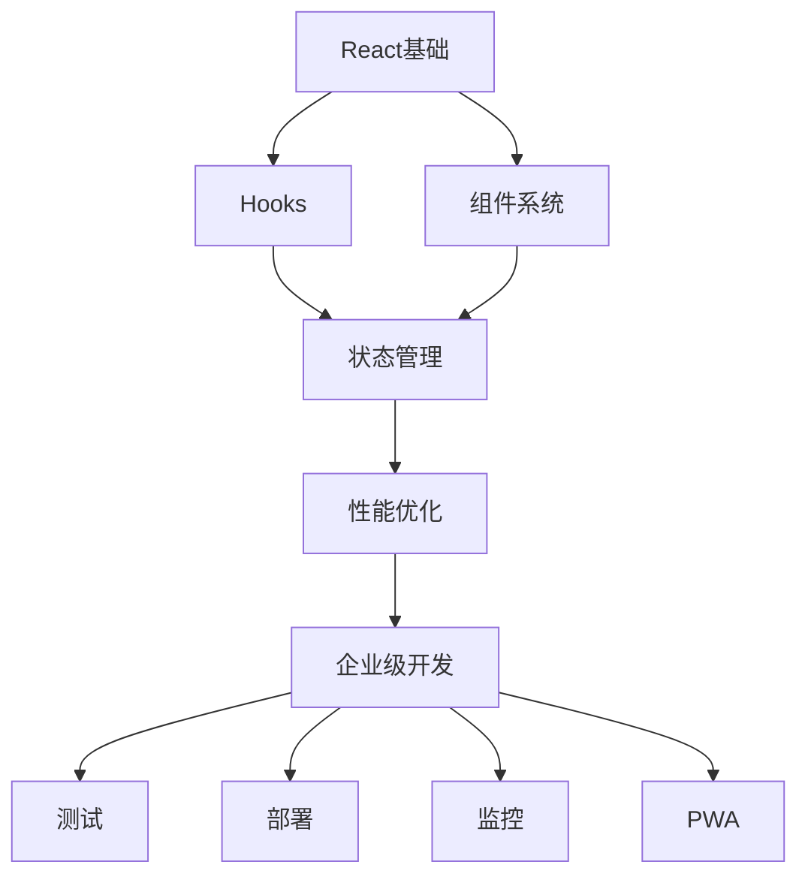

# React技术专栏：从入门到企业级的完整学习路线

> 🚀 欢迎来到React技术专栏！这里是一个从"会用"到"精通"再到"企业级"的完整学习路线图。就像从"会用筷子"到"成为米其林大厨"的进化过程！

## 📚 专栏介绍

本专栏包含6篇深度技术文章，每篇都是6000+字符的技术干货，从基础概念到企业级实战，构建完整的React知识体系。

## 🗺️ 学习路线图

```
基础夯实 → 进阶提升 → 性能优化 → 企业实战
    ↓        ↓        ↓        ↓
Hooks → 组件系统 → 状态管理 → 性能优化 → 生态系统 → 项目模板
```

## 📖 文章目录

### 📌 [01-React Hooks深度解析：从useState到useReducer的进化之旅.md](./01-React%20Hooks深度解析：从useState到useReducer的进化之旅.md)
**关键词**：Hooks、useState、useEffect、useReducer、自定义Hooks

**核心内容**：
- 🎯 useState的闭包陷阱与解决方案
- ⚡ useEffect的副作用管理艺术
- 🏗️ useReducer的工业级状态管理
- 🛠️ 自定义Hooks设计模式（useLocalStorage、useFetch等）
- 🛒 电商购物车完整实战案例

**技术亮点**：
- 手写实现useState原理
- 深度解析Hooks执行机制
- 提供可直接使用的自定义Hooks库

---

### 📌 [02-React组件系统深度剖析：从JSX到虚拟DOM的魔法变身.md](./02-React组件系统深度剖析：从JSX到虚拟DOM的魔法变身.md)
**关键词**：JSX、虚拟DOM、Diff算法、组件通信、性能优化

**核心内容**：
- 🎭 JSX编译原理与手写createElement
- 🎪 虚拟DOM原理与手写渲染器
- ⚖️ Diff算法核心策略与简化实现
- 🔄 组件通信模式（Props、Context、事件总线）
- 🚀 性能优化技巧（React.memo、useCallback、代码分割）

**技术亮点**：
- 手写虚拟DOM渲染器
- 实现简化版Diff算法
- 优化后的Todo应用完整实现

---

### 📌 [03-React Hooks实战：从useState到useReducer的进化之路.md](./03-React%20Hooks实战：从useState到useReducer的进化之路.md)
**关键词**：Hooks实战、状态管理、副作用处理、自定义Hooks

**核心内容**：
- 🧩 useState进阶技巧与状态拆分
- 🎣 useEffect数据获取与清理模式
- 🏛️ useReducer复杂状态管理
- 🎨 自定义Hooks设计模式
- 🛍️ 电商应用完整实战

**技术亮点**：
- 提供完整的Hooks工具库
- 电商项目架构设计
- 性能优化最佳实践

---

### 📌 [04-React状态管理方案：从Redux到Zustand的进化之路.md](./04-React状态管理方案：从Redux到Zustand的进化之路.md)
**关键词**：状态管理、Redux、Zustand、Context API、Recoil

**核心内容**：
- 🌐 Context API原理与主题系统实现
- 🏪 Redux核心概念与电商购物车
- ⚡ Zustand现代化状态管理
- 📊 状态管理方案对比分析
- 🎯 技术选型决策树

**技术亮点**：
- 完整的状态管理方案对比
- 电商应用状态架构设计
- 调试工具和最佳实践

---

### 📌 [05-React性能优化秘籍：从编译优化到运行时的极致追求.md](./05-React性能优化秘籍：从编译优化到运行时的极致追求.md)
**关键词**：性能优化、Web Vitals、编译优化、内存管理

**核心内容**：
- 📈 性能指标与监控体系（FCP、LCP、TTI）
- 🔧 编译优化黑科技（Webpack、Vite配置）
- ⚡ 运行时优化策略（虚拟列表、懒加载）
- 🧠 内存管理与垃圾回收
- 🎯 实战性能优化案例

**技术亮点**：
- 性能监控工具实现
- 构建配置优化方案
- 内存泄漏检测工具

---

### 📌 [06-React生态系统全景：从测试到部署的完整链路.md](./06-React生态系统全景：从测试到部署的完整链路.md)
**关键词**：测试、部署、CI/CD、PWA、监控、Docker

**核心内容**：
- 🧪 测试全家桶（Vitest、Cypress、组件测试）
- 🐳 Docker多阶段构建与部署
- 🔄 CI/CD自动化流水线
- 📊 监控与日志系统
- 📱 PWA与离线支持
- 🏗️ 企业级项目模板

**技术亮点**：
- 完整的DevOps工作流
- 企业级项目脚手架
- 生产环境最佳实践

---

## 🎯 学习建议

### 👶 初学者路径
1. **第1篇** → **第2篇** → **第3篇**（夯实基础）
2. **第4篇**（状态管理进阶）
3. **第5篇**（性能优化提升）
4. **第6篇**（企业级实战）

### 👨‍💻 进阶开发者路径
1. **第4篇** → **第5篇**（重点提升）
2. **第6篇**（企业级转型）
3. **第1-3篇**（查漏补缺）

### 🏢 企业开发者路径
1. **第6篇**（直接上手企业级开发）
2. **第5篇**（性能优化必备）
3. **第4篇**（状态管理选型）

## 🛠️ 配套资源

### 📦 代码仓库
- [GitHub项目模板](https://github.com/your-org/react-enterprise-template)
- [在线示例](https://react-enterprise-demo.vercel.app)

### 🎥 视频教程
- B站配套视频教程（正在制作中）
- 直播答疑（每周三晚8点）

### 💬 技术交流
- 微信群：React技术交流群
- Discord频道：React Enterprise

## 🎯 技能图谱



## 📊 学习成果检验

### 🎯 基础能力检验
- [ ] 能够手写useState和useEffect
- [ ] 理解虚拟DOM和Diff算法原理
- [ ] 掌握组件通信的各种方式

### 🎯 进阶能力检验
- [ ] 能够设计复杂的状态管理架构
- [ ] 能够优化React应用性能
- [ ] 能够处理内存泄漏问题

### 🎯 企业级能力检验
- [ ] 能够搭建完整的CI/CD流水线
- [ ] 能够实现PWA功能
- [ ] 能够配置生产级监控

## 🚀 下一步计划

### 📅 2024年路线图
- **Q1**: React 19新特性解读
- **Q2**: Next.js 14企业级实战
- **Q3**: React Native跨平台开发
- **Q4**: 微前端架构实践

### 📚 推荐阅读
- 《React设计模式与最佳实践》
- 《深入浅出React和Redux》
- 《React状态管理与同构实战》

## 🤝 贡献与反馈

如果你有好的建议或发现了错误，欢迎：
- 📝 提交Issue
- 🔄 提交Pull Request
- 💬 加入技术交流群
- 📧 发送邮件反馈

---

## 📞 联系方式

- **微信公众号**: 前端技术专栏
- **知乎专栏**: React技术深度解析
- **GitHub**: [github.com/your-username](https://github.com/your-username)
- **邮箱**: your-email@example.com

> 🎉 **专栏完成！** 从React新手到企业级开发大师，这一路的陪伴希望对你有所帮助。记住：学习永无止境，技术日新月异，保持学习的热情和探索的精神！

**最后更新**: 2024年1月
**专栏状态**: ✅ 已完成（6/6）