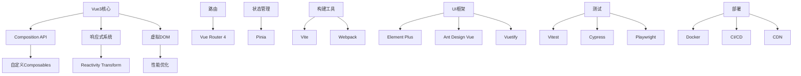

# Vue3生态系统全景：从测试到部署的完整链路

> 🌍 各位Vue生态探险家们，欢迎来到Vue3世界的"终极攻略"！
>
> 从"Hello World"到"生产环境王者"，这就像从新手村一路打怪升级到满级大佬！今天咱们就来解锁Vue3生态系统的所有隐藏关卡！

## 🎪 开场白：Vue生态的"宇宙地图"

想象一下Vue生态系统就像一座巨大的城市：
- **市中心**：Vue核心（响应式、组件、路由）
- **商业区**：UI框架（Element Plus、Ant Design Vue）
- **工业区**：构建工具（Vite、Webpack）
- **住宅区**：测试框架（Vitest、Cypress）
- **交通枢纽**：CI/CD（GitHub Actions、Docker）

今天咱们就来一次"城市一日游"！

## 🧪 第一站：测试全家桶

### 1. 单元测试 - Vitest全家桶

```typescript
// vitest.config.ts - Vue3测试配置
import { defineConfig } from 'vitest/config'
import vue from '@vitejs/plugin-vue'

export default defineConfig({
  plugins: [vue()],
  test: {
    globals: true,
    environment: 'jsdom',
    setupFiles: ['./src/test/setup.ts'],
    coverage: {
      provider: 'v8',
      reporter: ['text', 'json', 'html'],
      exclude: [
        'node_modules/',
        'src/test/',
        '**/*.d.ts',
      ]
    }
  }
})

// setup.ts - 测试环境配置
import { vi } from 'vitest'
import { config } from '@vue/test-utils'

// 全局mock
vi.mock('axios')
vi.mock('@/utils/api', () => ({
  api: {
    get: vi.fn(),
    post: vi.fn()
  }
}))

// Vue Test Utils全局配置
config.global.mocks = {
  $t: (key: string) => key,
  $router: {
    push: vi.fn(),
    replace: vi.fn()
  },
  $route: {
    params: {},
    query: {}
  }
}
```

### 2. 组件测试实战

```typescript
// ProductCard.test.ts - 组件测试示例
import { describe, it, expect, vi } from 'vitest'
import { mount } from '@vue/test-utils'
import ProductCard from '@/components/ProductCard.vue'

describe('ProductCard', () => {
  const mockProduct = {
    id: 1,
    name: 'iPhone 15',
    price: 5999,
    image: 'iphone15.jpg',
    rating: 4.5
  }

  it('渲染商品信息', () => {
    const wrapper = mount(ProductCard, {
      props: { product: mockProduct }
    })

    expect(wrapper.find('.product-name').text()).toBe('iPhone 15')
    expect(wrapper.find('.product-price').text()).toBe('¥5999')
  })

  it('点击添加购物车', async () => {
    const wrapper = mount(ProductCard, {
      props: { product: mockProduct },
      global: {
        mocks: {
          $store: {
            dispatch: vi.fn()
          }
        }
      }
    })

    await wrapper.find('.add-to-cart').trigger('click')
    expect(wrapper.vm.$store.dispatch).toHaveBeenCalledWith('cart/addItem', mockProduct)
  })

  it('响应式价格显示', async () => {
    const wrapper = mount(ProductCard, {
      props: { product: mockProduct }
    })

    await wrapper.setProps({
      product: { ...mockProduct, price: 6999 }
    })

    expect(wrapper.find('.product-price').text()).toBe('¥6999')
  })

  it('图片懒加载测试', async () => {
    const wrapper = mount(ProductCard, {
      props: { product: mockProduct }
    })

    const img = wrapper.find('img')
    expect(img.attributes('loading')).toBe('lazy')
    expect(img.attributes('src')).toBe('iphone15.jpg')
  })
})

// Composable测试
import { useCounter } from '@/composables/useCounter'

describe('useCounter', () => {
  it('增加计数器', () => {
    const { count, increment } = useCounter()
    expect(count.value).toBe(0)
    
    increment()
    expect(count.value).toBe(1)
  })

  it('设置初始值', () => {
    const { count } = useCounter(10)
    expect(count.value).toBe(10)
  })
})
```

### 3. E2E测试 - Cypress

```typescript
// cypress.config.ts
import { defineConfig } from 'cypress'

export default defineConfig({
  e2e: {
    baseUrl: 'http://localhost:5173',
    viewportWidth: 1280,
    viewportHeight: 720,
    video: false,
    screenshotOnRunFailure: true,
    setupNodeEvents(on, config) {
      // 环境变量配置
      config.env.apiUrl = process.env.VITE_API_URL
      return config
    }
  },
  component: {
    devServer: {
      framework: 'vue',
      bundler: 'vite'
    }
  }
})

// e2e测试用例
// cypress/e2e/shopping.cy.ts
describe('购物流程', () => {
  beforeEach(() => {
    cy.visit('/')
    cy.intercept('GET', '/api/products', { fixture: 'products.json' }).as('getProducts')
  })

  it('完整购物测试', () => {
    // 等待商品加载
    cy.wait('@getProducts')

    // 搜索商品
    cy.get('[data-testid="search-input"]').type('iPhone')
    cy.get('[data-testid="search-button"]').click()

    // 验证搜索结果
    cy.get('[data-testid="product-card"]').should('have.length', 1)
    cy.get('[data-testid="product-name"]').should('contain', 'iPhone 15')

    // 添加购物车
    cy.get('[data-testid="add-to-cart"]').first().click()
    cy.get('[data-testid="cart-count"]').should('contain', '1')

    // 进入购物车
    cy.get('[data-testid="cart-icon"]').click()
    cy.url().should('include', '/cart')

    // 结算
    cy.get('[data-testid="checkout-button"]').click()
    cy.url().should('include', '/checkout')
  })

  it('响应式测试', () => {
    // 桌面端
    cy.viewport(1280, 720)
    cy.get('[data-testid="desktop-menu"]').should('be.visible')

    // 移动端
    cy.viewport(375, 667)
    cy.get('[data-testid="mobile-menu"]').should('be.visible')
  })
})
```

## 🏗️ 第二站：构建与部署

### 1. Docker化部署

```dockerfile
# Dockerfile - 多阶段构建
FROM node:18-alpine AS builder

WORKDIR /app

# 复制依赖文件
COPY package*.json ./
RUN npm ci --only=production

# 复制源码并构建
COPY . .
RUN npm run build

# 生产环境镜像
FROM nginx:alpine

# 复制构建产物
COPY --from=builder /app/dist /usr/share/nginx/html

# 复制nginx配置
COPY nginx.conf /etc/nginx/nginx.conf

# 健康检查
HEALTHCHECK --interval=30s --timeout=3s --start-period=5s --retries=3 \
  CMD curl -f http://localhost/health || exit 1

EXPOSE 80
CMD ["nginx", "-g", "daemon off;"]

# nginx.conf - 高性能配置
user nginx;
worker_processes auto;
error_log /var/log/nginx/error.log warn;
pid /var/run/nginx.pid;

events {
    worker_connections 1024;
}

http {
    include /etc/nginx/mime.types;
    default_type application/octet-stream;

    # Gzip压缩
    gzip on;
    gzip_vary on;
    gzip_min_length 1024;
    gzip_types text/plain text/css application/json application/javascript text/xml application/xml application/xml+rss text/javascript;

    # 缓存策略
    map $sent_http_content_type $expires {
        default 1M;
        text/html epoch;
        text/css 1y;
        application/javascript 1y;
        ~image/ 1y;
    }

    server {
        listen 80;
        server_name _;
        root /usr/share/nginx/html;
        index index.html;

        # SPA路由
        location / {
            try_files $uri $uri/ /index.html;
        }

        # API代理
        location /api/ {
            proxy_pass http://backend:3000/;
            proxy_set_header Host $host;
            proxy_set_header X-Real-IP $remote_addr;
        }

        # 静态资源缓存
        location ~* \.(js|css|png|jpg|jpeg|gif|ico|svg)$ {
            expires 1y;
            add_header Cache-Control "public, immutable";
        }

        # 健康检查
        location /health {
            access_log off;
            return 200 "healthy\n";
            add_header Content-Type text/plain;
        }
    }
}
```

### 2. CI/CD流水线

```yaml
# .github/workflows/deploy.yml
name: Deploy Vue3 App

on:
  push:
    branches: [main]
  pull_request:
    branches: [main]

env:
  REGISTRY: ghcr.io
  IMAGE_NAME: ${{ github.repository }}

jobs:
  test:
    runs-on: ubuntu-latest
    
    steps:
      - uses: actions/checkout@v4
      
      - name: Setup Node.js
        uses: actions/setup-node@v4
        with:
          node-version: '18'
          cache: 'npm'
      
      - name: Install dependencies
        run: npm ci
      
      - name: Run linter
        run: npm run lint
      
      - name: Run unit tests
        run: npm run test:unit
      
      - name: Run component tests
        run: npm run test:component
      
      - name: Upload coverage
        uses: codecov/codecov-action@v3
        with:
          file: ./coverage/lcov.info

  build:
    needs: test
    runs-on: ubuntu-latest
    
    steps:
      - uses: actions/checkout@v4
      
      - name: Setup Node.js
        uses: actions/setup-node@v4
        with:
          node-version: '18'
          cache: 'npm'
      
      - name: Install dependencies
        run: npm ci
      
      - name: Build application
        run: npm run build
      
      - name: Upload build artifacts
        uses: actions/upload-artifact@v3
        with:
          name: dist
          path: dist/

  e2e:
    needs: build
    runs-on: ubuntu-latest
    
    steps:
      - uses: actions/checkout@v4
      
      - name: Download build artifacts
        uses: actions/download-artifact@v3
        with:
          name: dist
          path: dist/
      
      - name: Run E2E tests
        uses: cypress-io/github-action@v6
        with:
          start: npm run preview
          wait-on: 'http://localhost:4173'

  deploy:
    needs: [test, build, e2e]
    runs-on: ubuntu-latest
    if: github.ref == 'refs/heads/main'
    
    permissions:
      contents: read
      packages: write
    
    steps:
      - uses: actions/checkout@v4
      
      - name: Log in to Container Registry
        uses: docker/login-action@v3
        with:
          registry: ${{ env.REGISTRY }}
          username: ${{ github.actor }}
          password: ${{ secrets.GITHUB_TOKEN }}
      
      - name: Extract metadata
        id: meta
        uses: docker/metadata-action@v5
        with:
          images: ${{ env.REGISTRY }}/${{ env.IMAGE_NAME }}
          tags: |
            type=ref,event=branch
            type=ref,event=pr
            type=sha,prefix={{branch}}-
      
      - name: Build and push Docker image
        uses: docker/build-push-action@v5
        with:
          context: .
          push: true
          tags: ${{ steps.meta.outputs.tags }}
          labels: ${{ steps.meta.outputs.labels }}
      
      - name: Deploy to production
        run: |
          echo "Deploying to production..."
          # 这里可以添加部署到云服务器的命令
```

### 3. 环境配置管理

```typescript
// config/index.ts - 环境配置
interface Config {
  api: {
    baseURL: string
    timeout: number
  }
  features: {
    enableAnalytics: boolean
    enablePWA: boolean
    enableSentry: boolean
  }
  sentry?: {
    dsn: string
    environment: string
  }
}

const configs: Record<string, Config> = {
  development: {
    api: {
      baseURL: 'http://localhost:3000/api',
      timeout: 5000
    },
    features: {
      enableAnalytics: false,
      enablePWA: false,
      enableSentry: false
    }
  },
  
  staging: {
    api: {
      baseURL: 'https://staging-api.example.com/api',
      timeout: 10000
    },
    features: {
      enableAnalytics: true,
      enablePWA: true,
      enableSentry: true
    },
    sentry: {
      dsn: 'https://staging@sentry.io/123',
      environment: 'staging'
    }
  },
  
  production: {
    api: {
      baseURL: 'https://api.example.com/api',
      timeout: 15000
    },
    features: {
      enableAnalytics: true,
      enablePWA: true,
      enableSentry: true
    },
    sentry: {
      dsn: 'https://prod@sentry.io/456',
      environment: 'production'
    }
  }
}

export const config = configs[import.meta.env.MODE]

// 使用示例
import { config } from '@/config'

const api = axios.create({
  baseURL: config.api.baseURL,
  timeout: config.api.timeout
})

if (config.features.enableSentry && config.sentry) {
  Sentry.init({
    dsn: config.sentry.dsn,
    environment: config.sentry.environment
  })
}
```

## 🌐 第三站：监控与日志

### 1. 性能监控

```typescript
// utils/performance.ts - 性能监控
class PerformanceMonitor {
  private metrics: Map<string, number[]> = new Map()
  
  measure(name: string, fn: () => void) {
    const start = performance.now()
    const result = fn()
    const end = performance.now()
    
    this.recordMetric(name, end - start)
    return result
  }
  
  async measureAsync<T>(name: string, fn: () => Promise<T>): Promise<T> {
    const start = performance.now()
    const result = await fn()
    const end = performance.now()
    
    this.recordMetric(name, end - start)
    return result
  }
  
  recordMetric(name: string, value: number) {
    if (!this.metrics.has(name)) {
      this.metrics.set(name, [])
    }
    this.metrics.get(name)!.push(value)
  }
  
  getReport() {
    const report: Record<string, any> = {}
    
    this.metrics.forEach((values, name) => {
      const sorted = values.sort((a, b) => a - b)
      report[name] = {
        avg: values.reduce((a, b) => a + b, 0) / values.length,
        min: sorted[0],
        max: sorted[sorted.length - 1],
        p95: sorted[Math.floor(sorted.length * 0.95)]
      }
    })
    
    return report
  }
  
  sendToAnalytics() {
    const report = this.getReport()
    
    // 发送到分析服务
    if (config.features.enableAnalytics) {
      fetch('/api/analytics/performance', {
        method: 'POST',
        headers: { 'Content-Type': 'application/json' },
        body: JSON.stringify({
          timestamp: Date.now(),
          url: window.location.href,
          userAgent: navigator.userAgent,
          metrics: report
        })
      })
    }
  }
}

// Vue性能监控插件
export const performancePlugin = {
  install(app: App) {
    const monitor = new PerformanceMonitor()
    
    // 监控组件挂载时间
    app.mixin({
      mounted() {
        const start = performance.now()
        this.$nextTick(() => {
          const end = performance.now()
          monitor.recordMetric(`mount-${this.$options.name}`, end - start)
        })
      }
    })
    
    // 全局API
    app.config.globalProperties.$performance = monitor
  }
}

// 使用示例
import { performancePlugin } from '@/utils/performance'

const app = createApp(App)
app.use(performancePlugin)
```

### 2. 错误监控

```typescript
// utils/errorHandler.ts - 错误处理
class ErrorHandler {
  private queue: ErrorEvent[] = []
  
  init() {
    // 全局错误处理
    window.addEventListener('error', (event) => {
      this.handleError({
        type: 'javascript',
        message: event.message,
        filename: event.filename,
        lineno: event.lineno,
        colno: event.colno,
        stack: event.error?.stack,
        timestamp: Date.now(),
        url: window.location.href,
        userAgent: navigator.userAgent
      })
    })
    
    // Promise错误处理
    window.addEventListener('unhandledrejection', (event) => {
      this.handleError({
        type: 'promise',
        message: event.reason?.message || 'Unhandled Promise Rejection',
        stack: event.reason?.stack,
        timestamp: Date.now(),
        url: window.location.href
      })
    })
    
    // Vue错误处理
    if (config.features.enableSentry) {
      Sentry.init({
        dsn: config.sentry?.dsn,
        integrations: [
          new Sentry.BrowserTracing(),
          new Sentry.Replay()
        ],
        tracesSampleRate: 1.0,
        replaysSessionSampleRate: 0.1,
        replaysOnErrorSampleRate: 1.0
      })
    }
  }
  
  handleError(error: ErrorEvent) {
    console.error('Application Error:', error)
    
    // 发送到监控服务
    this.queue.push(error)
    this.flush()
  }
  
  private flush() {
    if (this.queue.length === 0) return
    
    const errors = [...this.queue]
    this.queue = []
    
    fetch('/api/errors', {
      method: 'POST',
      headers: { 'Content-Type': 'application/json' },
      body: JSON.stringify({ errors })
    }).catch(console.error)
  }
}

// 使用示例
const errorHandler = new ErrorHandler()
errorHandler.init()

// Vue错误边界
app.config.errorHandler = (error, instance, info) => {
  console.error('Vue Error:', error, info)
  
  if (config.features.enableSentry) {
    Sentry.captureException(error, {
      contexts: {
        vue: { info, component: instance?.$options.name }
      }
    })
  }
}
```

### 3. 用户行为分析

```typescript
// utils/analytics.ts - 用户行为分析
class Analytics {
  private sessionId: string
  private events: AnalyticsEvent[] = []
  
  constructor() {
    this.sessionId = this.generateSessionId()
  }
  
  private generateSessionId() {
    return `${Date.now()}-${Math.random().toString(36).substr(2, 9)}`
  }
  
  track(event: string, properties: Record<string, any> = {}) {
    const analyticsEvent = {
      event,
      properties: {
        ...properties,
        url: window.location.href,
        timestamp: Date.now(),
        sessionId: this.sessionId,
        userAgent: navigator.userAgent
      }
    }
    
    this.events.push(analyticsEvent)
    
    // 立即发送或批量发送
    if (navigator.sendBeacon) {
      navigator.sendBeacon('/api/analytics/track', JSON.stringify(analyticsEvent))
    } else {
      fetch('/api/analytics/track', {
        method: 'POST',
        headers: { 'Content-Type': 'application/json' },
        body: JSON.stringify(analyticsEvent)
      })
    }
  }
  
  trackPageView(path: string) {
    this.track('page_view', { path })
  }
  
  trackClick(element: string, text?: string) {
    this.track('click', { element, text })
  }
  
  trackForm(formName: string, action: string, data?: any) {
    this.track('form_interaction', { formName, action, data })
  }
  
  trackPurchase(orderId: string, amount: number, items: any[]) {
    this.track('purchase', { orderId, amount, items })
  }
}

// Vue指令
const analyticsDirective = {
  mounted(el: HTMLElement, binding: any) {
    const analytics = new Analytics()
    
    if (binding.arg === 'click') {
      el.addEventListener('click', () => {
        analytics.trackClick(
          el.getAttribute('data-analytics-element') || el.tagName,
          el.textContent?.trim()
        )
      })
    }
  }
}

// 使用示例
app.directive('analytics', analyticsDirective)

// 在组件中使用
export default {
  setup() {
    const analytics = new Analytics()
    
    onMounted(() => {
      analytics.trackPageView(router.currentRoute.value.path)
    })
    
    watch(() => router.currentRoute.value.path, (newPath) => {
      analytics.trackPageView(newPath)
    })
    
    const handlePurchase = (order: any) => {
      analytics.trackPurchase(order.id, order.total, order.items)
    }
    
    return { handlePurchase }
  }
}
```

## 🔧 第四站：开发工具与调试

### 1. VS Code配置

```json
// .vscode/settings.json
{
  "editor.formatOnSave": true,
  "editor.codeActionsOnSave": {
    "source.fixAll.eslint": true
  },
  "typescript.preferences.importModuleSpecifier": "relative",
  "vue.codeActions.enabled": true,
  "emmet.includeLanguages": {
    "vue": "html"
  },
  "files.associations": {
    "*.vue": "vue"
  },
  "eslint.validate": [
    "javascript",
    "javascriptreact",
    "typescript",
    "typescriptreact",
    "vue"
  ]
}

// .vscode/extensions.json
{
  "recommendations": [
    "Vue.volar",
    "bradlc.vscode-tailwindcss",
    "esbenp.prettier-vscode",
    "ms-vscode.vscode-typescript-next",
    "ms-playwright.playwright",
    "ms-vscode.vscode-json"
  ]
}

// .vscode/launch.json
{
  "version": "0.2.0",
  "configurations": [
    {
      "name": "Launch Chrome",
      "request": "launch",
      "type": "chrome",
      "url": "http://localhost:5173",
      "webRoot": "${workspaceFolder}/src"
    },
    {
      "name": "Debug Jest Tests",
      "type": "node",
      "request": "launch",
      "program": "${workspaceFolder}/node_modules/.bin/vitest",
      "args": ["run", "--reporter=verbose"],
      "cwd": "${workspaceFolder}",
      "console": "integratedTerminal",
      "internalConsoleOptions": "neverOpen"
    }
  ]
}
```

### 2. 浏览器调试工具

```typescript
// utils/devtools.ts - 开发工具
class DevTools {
  private isDev = import.meta.env.DEV
  
  init() {
    if (!this.isDev) return
    
    // 全局调试方法
    window.$debug = {
      store: () => console.log('Store:', useStore()),
      router: () => console.log('Router:', useRouter()),
      route: () => console.log('Route:', useRoute()),
      
      // 性能分析
      performance: () => {
        const observer = new PerformanceObserver((list) => {
          list.getEntries().forEach(entry => {
            console.table({
              name: entry.name,
              duration: entry.duration,
              startTime: entry.startTime,
              entryType: entry.entryType
            })
          })
        })
        observer.observe({ entryTypes: ['measure', 'navigation', 'paint'] })
      },
      
      // 内存分析
      memory: () => {
        if (performance.memory) {
          console.table({
            used: `${(performance.memory.usedJSHeapSize / 1024 / 1024).toFixed(2)} MB`,
            total: `${(performance.memory.totalJSHeapSize / 1024 / 1024).toFixed(2)} MB`,
            limit: `${(performance.memory.jsHeapSizeLimit / 1024 / 1024).toFixed(2)} MB`
          })
        }
      },
      
      // 网络请求监控
      network: () => {
        const originalFetch = window.fetch
        window.fetch = async (...args) => {
          console.log('Fetch:', args)
          const start = performance.now()
          const response = await originalFetch(...args)
          const end = performance.now()
          console.log(`Request took ${end - start}ms`)
          return response
        }
      }
    }
  }
}

// 使用示例
const devTools = new DevTools()
devTools.init()
```

## 🚀 第五站：PWA与离线支持

### 1. Service Worker配置

```typescript
// sw.ts - Service Worker
import { precacheAndRoute } from 'workbox-precaching'
import { registerRoute } from 'workbox-routing'
import { StaleWhileRevalidate, CacheFirst, NetworkFirst } from 'workbox-strategies'
import { ExpirationPlugin } from 'workbox-expiration'
import { RangeRequestsPlugin } from 'workbox-range-requests'

// 预缓存
precacheAndRoute(self.__WB_MANIFEST)

// API缓存
registerRoute(
  ({ url }) => url.pathname.startsWith('/api/'),
  new NetworkFirst({
    cacheName: 'api-cache',
    plugins: [
      new ExpirationPlugin({
        maxEntries: 50,
        maxAgeSeconds: 5 * 60 // 5分钟
      })
    ]
  })
)

// 静态资源缓存
registerRoute(
  ({ request }) => request.destination === 'image',
  new CacheFirst({
    cacheName: 'images',
    plugins: [
      new ExpirationPlugin({
        maxEntries: 100,
        maxAgeSeconds: 30 * 24 * 60 * 60 // 30天
      }),
      new RangeRequestsPlugin()
    ]
  })
)

// JS/CSS缓存
registerRoute(
  ({ request }) => request.destination === 'script' || request.destination === 'style',
  new StaleWhileRevalidate({
    cacheName: 'static-resources',
    plugins: [
      new ExpirationPlugin({
        maxEntries: 50,
        maxAgeSeconds: 24 * 60 * 60 // 1天
      })
    ]
  })
)

// 离线页面
registerRoute(
  ({ request }) => request.mode === 'navigate',
  new NetworkFirst({
    cacheName: 'pages',
    plugins: [
      new ExpirationPlugin({
        maxEntries: 50,
        maxAgeSeconds: 24 * 60 * 60
      })
    ]
  })
)

// 消息推送
self.addEventListener('push', (event) => {
  const data = event.data?.json() || {}
  
  const options = {
    body: data.body,
    icon: '/icon-192x192.png',
    badge: '/badge-72x72.png',
    vibrate: [100, 50, 100],
    data: {
      dateOfArrival: Date.now(),
      primaryKey: data.id
    },
    actions: [
      {
        action: 'explore',
        title: '查看详情',
        icon: '/checkmark.png'
      },
      {
        action: 'close',
        title: '关闭',
        icon: '/xmark.png'
      }
    ]
  }
  
  event.waitUntil(
    self.registration.showNotification(data.title, options)
  )
})

// 通知点击处理
self.addEventListener('notificationclick', (event) => {
  event.notification.close()
  
  if (event.action === 'explore') {
    event.waitUntil(
      clients.openWindow('/notifications/' + event.notification.data.primaryKey)
    )
  }
})
```

### 2. PWA配置

```json
// manifest.json
{
  "name": "Vue3电商应用",
  "short_name": "Vue3商店",
  "description": "基于Vue3的高性能电商应用",
  "start_url": "/",
  "display": "standalone",
  "background_color": "#ffffff",
  "theme_color": "#4f46e5",
  "orientation": "portrait-primary",
  "icons": [
    {
      "src": "/icon-192x192.png",
      "sizes": "192x192",
      "type": "image/png"
    },
    {
      "src": "/icon-512x512.png",
      "sizes": "512x512",
      "type": "image/png"
    }
  ],
  "categories": ["shopping", "business"],
  "lang": "zh-CN"
}

// vite.config.ts PWA配置
import { VitePWA } from 'vite-plugin-pwa'

export default defineConfig({
  plugins: [
    vue(),
    VitePWA({
      registerType: 'autoUpdate',
      workbox: {
        globPatterns: ['**/*.{js,css,html,ico,png,svg}']
      },
      manifest: {
        name: 'Vue3电商应用',
        short_name: 'Vue3商店',
        theme_color: '#4f46e5',
        icons: [
          {
            src: 'pwa-192x192.png',
            sizes: '192x192',
            type: 'image/png'
          },
          {
            src: 'pwa-512x512.png',
            sizes: '512x512',
            type: 'image/png'
          }
        ]
      },
      devOptions: {
        enabled: true
      }
    })
  ]
})
```

## 🎯 第六站：实战项目模板

### 1. 项目脚手架

```bash
# 创建项目
npm create vue@latest vue3-enterprise-template

# 选择特性
✔ Project name: vue3-enterprise-template
✔ Add TypeScript: Yes
✔ Add JSX Support: No
✔ Add Vue Router: Yes
✔ Add Pinia: Yes
✔ Add Vitest: Yes
✔ Add Cypress: Yes
✔ Add ESLint: Yes
✔ Add Prettier: Yes

# 安装依赖
cd vue3-enterprise-template
npm install

# 安装额外依赖
npm install @vueuse/core axios dayjs pinia-plugin-persistedstate
npm install -D @types/node tailwindcss autoprefixer postcss
```

### 2. 项目结构模板

```
src/
├── assets/                 # 静态资源
│   ├── icons/
│   ├── images/
│   └── styles/
├── components/             # 组件
│   ├── common/            # 通用组件
│   ├── ui/                # UI组件
│   └── layout/            # 布局组件
├── composables/           # 组合式函数
│   ├── useApi.ts
│   ├── useAuth.ts
│   ├── useInfiniteScroll.ts
│   └── useLocalStorage.ts
├── config/                # 配置文件
│   ├── index.ts
│   ├── routes.ts
│   └── api.ts
├── layouts/               # 布局
│   ├── AdminLayout.vue
│   ├── AuthLayout.vue
│   └── DefaultLayout.vue
├── pages/                 # 页面
│   ├── Home.vue
│   ├── About.vue
│   └── NotFound.vue
├── plugins/               # 插件
│   ├── i18n.ts
│   ├── sentry.ts
│   └── analytics.ts
├── stores/                # 状态管理
│   ├── auth.ts
│   ├── cart.ts
│   └── user.ts
├── types/                 # 类型定义
│   ├── api.ts
│   ├── models.ts
│   └── vue-shim.d.ts
├── utils/                 # 工具函数
│   ├── api.ts
│   ├── date.ts
│   └── validation.ts
├── App.vue
└── main.ts
```

### 3. 快速启动脚本

```json
// package.json脚本
{
  "scripts": {
    "dev": "vite",
    "build": "vue-tsc && vite build",
    "preview": "vite preview",
    "test:unit": "vitest",
    "test:component": "vitest --config vitest.component.config.ts",
    "test:e2e": "cypress run",
    "test:e2e:dev": "cypress open",
    "lint": "eslint . --ext .vue,.js,.jsx,.cjs,.mjs,.ts,.tsx,.cts,.mts --fix --ignore-path .gitignore",
    "format": "prettier --write src/",
    "type-check": "vue-tsc --noEmit",
    "docker:build": "docker build -t vue3-app .",
    "docker:run": "docker run -p 8080:80 vue3-app"
  }
}
```

## 📋 第七站：最佳实践清单

### 开发阶段
- [ ] 使用TypeScript
- [ ] 配置ESLint + Prettier
- [ ] 设置Husky + lint-staged
- [ ] 使用Vue DevTools
- [ ] 配置VS Code调试

### 测试阶段
- [ ] 单元测试覆盖率 > 80%
- [ ] 组件测试关键路径
- [ ] E2E测试核心流程
- [ ] 性能测试
- [ ] 跨浏览器测试

### 构建阶段
- [ ] 代码分割优化
- [ ] 图片压缩
- [ ] 缓存策略
- [ ] 安全检查
- [ ] 包体积分析

### 部署阶段
- [ ] Docker化
- [ ] CI/CD配置
- [ ] 环境变量管理
- [ ] 监控配置
- [ ] 回滚策略

### 维护阶段
- [ ] 错误监控
- [ ] 性能监控
- [ ] 用户反馈
- [ ] 定期更新
- [ ] 安全更新

## 🎯 Vue3生态系统全景图

### 核心生态


### 技术选型决策树

#### 状态管理
- **小型应用** → useState + provide/inject
- **中型应用** → Pinia
- **大型应用** → Pinia + 模块化

#### 路由方案
- **标准路由** → Vue Router
- **文件路由** → vite-plugin-pages
- **自动路由** → unplugin-vue-router

#### 样式方案
- **原子化CSS** → Tailwind CSS
- **组件库** → Element Plus
- **CSS模块** → CSS Modules
- **预处理器** → SCSS/Less

#### 测试策略
- **单元测试** → Vitest
- **组件测试** → Vue Test Utils
- **E2E测试** → Cypress
- **视觉测试** → Percy

## 🚀 总结：Vue3生态的"六脉神剑"

### 1. 开发效率剑：TypeScript + Volar
### 2. 状态管理剑：Pinia + Composables
### 3. 测试保障剑：Vitest + Cypress
### 4. 性能优化剑：Vite + PWA
### 5. 监控运维剑：Sentry + Analytics
### 6. 部署发布剑：Docker + CI/CD

## 🎉 Vue3专栏完结感言

从响应式系统的"魔法原理"到生态系统的"全景地图"，我们一起完成了Vue3技术的"九阳真经"！

### 专栏回顾
1. **响应式系统** - 从Proxy到Effect的魔法之旅
2. **组件系统** - 虚拟DOM到Diff算法的黑魔法
3. **Composition API** - 从Options到Composition的思维转换
4. **状态管理** - 从Vuex到Pinia的进化之路
5. **性能优化** - 从编译优化到运行时的极致追求
6. **生态系统** - 从测试到部署的完整链路

### 学习路线建议
```
初级开发者：1 → 2 → 3 → 项目实战
中级开发者：1 → 2 → 3 → 4 → 5 → 项目实战
高级开发者：1 → 2 → 3 → 4 → 5 → 6 → 架构设计
```

### 后续学习方向
- **微前端** - Module Federation + 微应用
- **SSR/SSG** - Nuxt3 + 服务端渲染
- **边缘计算** - Cloudflare Workers + Vite
- **WebAssembly** - Rust + Vue3
- **AI集成** - ChatGPT API + Vue3

## 🎯 终极思考题
你能设计一个基于Vue3的**微前端架构**吗？要求：
1. 支持独立部署
2. 共享状态管理
3. 样式隔离
4. 按需加载
5. 统一监控

---

> **Vue3就像一把瑞士军刀，功能强大但需要正确使用！** 🔪
> 
> **记住：技术是为了解决问题，不是为了炫技！**

**恭喜你，Vue3专栏毕业！** 🎓

现在你已经掌握了Vue3的完整技术栈，可以自信地说：
**"Vue3？我全会！"** 💪

## 📚 参考资料
- [Vue3官方文档](https://vuejs.org/)
- [Pinia官方文档](https://pinia.vuejs.org/)
- [Vue Router官方文档](https://router.vuejs.org/)
- [Vitest官方文档](https://vitest.dev/)
- [Cypress官方文档](https://docs.cypress.io/)
- [Vite官方文档](https://vitejs.dev/)