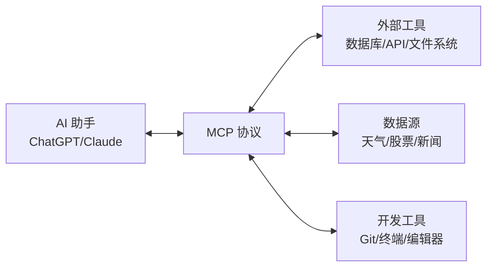
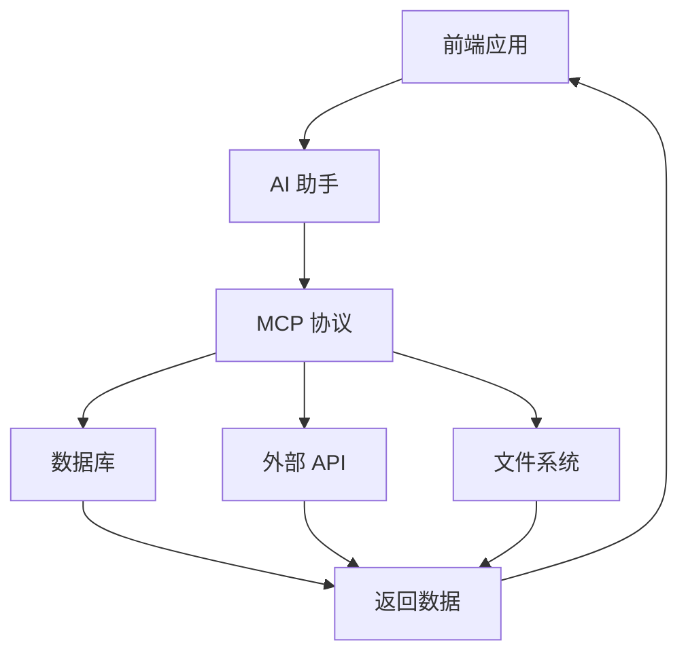
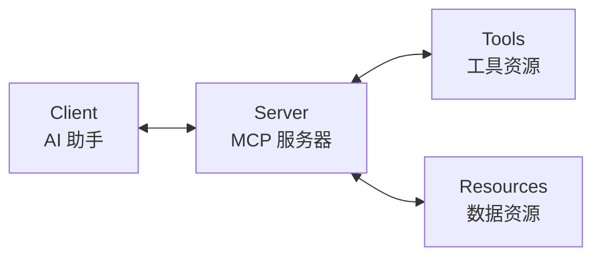

# 前端开发者应该掌握的 MCP 开发指南

## 前言：为什么前端开发者要学 MCP？

> "MCP 是什么？听起来像是某种新的前端框架？"

如果你还这么想，那你就 out 了！MCP（Model Context Protocol）是 OpenAI 在 2023 年推出的一个革命性协议，它让 AI 助手能够安全地访问外部工具和数据源。对于前端开发者来说，掌握 MCP 开发意味着你可以构建更智能、更强大的 AI 应用，让用户体验达到前所未有的高度。

想象一下，你的前端应用可以：
- 直接调用数据库查询，无需后端 API
- 实时获取天气、股票、新闻数据
- 自动生成代码、文档、测试用例
- 智能分析用户行为，提供个性化建议

这时候，如果你懂 MCP，就能轻松实现这些功能，让 AI 真正成为你的"编程搭档"！

## 一、MCP 是什么？为什么它这么重要？

### 1.1 MCP 的"前世今生"

MCP（Model Context Protocol）是由 OpenAI 开发的一个开放协议，它定义了 AI 助手与外部工具和数据源之间的安全通信标准。简单来说，它就像是一个"翻译官"，让 AI 能够理解和使用各种外部服务。



### 1.2 MCP 的核心价值

**1. 安全访问**
- 提供标准化的安全接口
- 支持权限控制和认证
- 保护敏感数据和系统资源

**2. 工具集成**
- 让 AI 能够使用各种开发工具
- 支持数据库查询和文件操作
- 集成第三方 API 和服务

**3. 扩展能力**
- 自定义工具和资源
- 支持多种编程语言
- 跨平台兼容性

## 二、前端开发中的 MCP 应用场景

### 2.1 AI 驱动的开发工具

这是前端开发者最常用的场景。通过 MCP，AI 助手可以直接操作你的开发环境。

```bash
# 典型的 MCP 工作流
AI 助手 → MCP 协议 → 开发工具 → 代码生成/修改
```

### 2.2 智能数据集成

AI 助手可以实时获取和处理各种数据，为前端应用提供动态内容。



### 2.3 自动化工作流

通过 MCP，AI 可以自动化执行复杂的开发任务，提升开发效率。

## 三、前端开发者必掌握的 MCP 概念

### 3.1 核心概念：理解 MCP 架构

#### 3.1.1 MCP 组件架构



**核心组件：**
- **Client（客户端）**：AI 助手，如 ChatGPT
- **Server（服务器）**：MCP 服务器，管理工具和资源
- **Tools（工具）**：可执行的操作，如文件读写、API 调用
- **Resources（资源）**：数据源，如数据库、文件系统

#### 3.1.2 MCP 通信协议

```json
{
  "jsonrpc": "2.0",
  "id": 1,
  "method": "tools/call",
  "params": {
    "name": "read_file",
    "arguments": {
      "path": "/path/to/file.js"
    }
  }
}
```

### 3.2 技术栈：掌握 MCP 开发工具

#### 3.2.1 官方 SDK 和工具

```bash
# 安装 MCP 官方工具
npm install @modelcontextprotocol/sdk

# 创建 MCP 服务器
npx @modelcontextprotocol/create-server my-mcp-server
```

#### 3.2.2 开发环境配置

```bash
# 项目结构示例
my-mcp-project/
├── src/
│   ├── tools/
│   │   ├── file-tools.js
│   │   ├── api-tools.js
│   │   └── database-tools.js
│   ├── resources/
│   │   ├── file-resources.js
│   │   └── data-resources.js
│   └── server.js
├── config/
│   └── mcp-config.json
└── package.json
```

### 3.3 开发模式：理解 MCP 开发流程

#### 3.3.1 工具开发模式

```javascript
// 示例：文件读取工具
import { Tool } from '@modelcontextprotocol/sdk';

export class FileReadTool extends Tool {
  constructor() {
    super({
      name: 'read_file',
      description: '读取指定路径的文件内容',
      inputSchema: {
        type: 'object',
        properties: {
          path: {
            type: 'string',
            description: '文件路径'
          }
        },
        required: ['path']
      }
    });
  }

  async execute({ path }) {
    try {
      const content = await fs.readFile(path, 'utf-8');
      return { content };
    } catch (error) {
      throw new Error(`读取文件失败: ${error.message}`);
    }
  }
}
```

#### 3.3.2 资源开发模式

```javascript
// 示例：数据库资源
import { Resource } from '@modelcontextprotocol/sdk';

export class DatabaseResource extends Resource {
  constructor() {
    super({
      name: 'user_database',
      description: '用户数据库',
      schema: {
        type: 'object',
        properties: {
          users: {
            type: 'array',
            items: {
              type: 'object',
              properties: {
                id: { type: 'string' },
                name: { type: 'string' },
                email: { type: 'string' }
              }
            }
          }
        }
      }
    });
  }

  async getData() {
    // 从数据库获取数据
    const users = await db.query('SELECT * FROM users');
    return { users };
  }
}
```

## 四、前端开发者 MCP 实战案例

### 4.1 智能代码生成器

#### 4.1.1 项目结构

```bash
smart-code-generator/
├── src/
│   ├── tools/
│   │   ├── code-generator.js
│   │   ├── file-manager.js
│   │   └── project-analyzer.js
│   ├── resources/
│   │   ├── templates.js
│   │   └── patterns.js
│   └── server.js
├── templates/
│   ├── react-components/
│   ├── vue-components/
│   └── utils/
└── config/
    └── mcp-config.json
```

#### 4.1.2 核心工具实现

```javascript
// src/tools/code-generator.js
import { Tool } from '@modelcontextprotocol/sdk';

export class CodeGeneratorTool extends Tool {
  constructor() {
    super({
      name: 'generate_component',
      description: '生成 React/Vue 组件',
      inputSchema: {
        type: 'object',
        properties: {
          framework: {
            type: 'string',
            enum: ['react', 'vue'],
            description: '框架类型'
          },
          componentName: {
            type: 'string',
            description: '组件名称'
          },
          props: {
            type: 'array',
            items: {
              type: 'object',
              properties: {
                name: { type: 'string' },
                type: { type: 'string' },
                required: { type: 'boolean' }
              }
            },
            description: '组件属性'
          }
        },
        required: ['framework', 'componentName']
      }
    });
  }

  async execute({ framework, componentName, props = [] }) {
    const template = await this.getTemplate(framework);
    const code = this.generateCode(template, componentName, props);
    
    return {
      code,
      filename: `${componentName}.${framework === 'react' ? 'jsx' : 'vue'}`
    };
  }

  async getTemplate(framework) {
    // 从模板资源获取代码模板
    const templates = await this.server.getResource('templates');
    return templates[framework];
  }

  generateCode(template, componentName, props) {
    // 根据模板和参数生成代码
    let code = template.replace(/\{\{componentName\}\}/g, componentName);
    
    if (props.length > 0) {
      const propsCode = props.map(prop => 
        `  ${prop.name}: ${prop.type}${prop.required ? '' : '?'}`
      ).join(',\n');
      code = code.replace(/\{\{props\}\}/g, propsCode);
    }
    
    return code;
  }
}
```

### 4.2 智能数据分析器

#### 4.2.1 数据获取工具

```javascript
// src/tools/data-analyzer.js
export class DataAnalyzerTool extends Tool {
  constructor() {
    super({
      name: 'analyze_data',
      description: '分析用户行为数据',
      inputSchema: {
        type: 'object',
        properties: {
          dataSource: {
            type: 'string',
            description: '数据源路径'
          },
          analysisType: {
            type: 'string',
            enum: ['user_behavior', 'performance', 'errors'],
            description: '分析类型'
          }
        },
        required: ['dataSource', 'analysisType']
      }
    });
  }

  async execute({ dataSource, analysisType }) {
    const data = await this.getData(dataSource);
    const analysis = await this.performAnalysis(data, analysisType);
    
    return {
      analysis,
      insights: this.generateInsights(analysis),
      recommendations: this.generateRecommendations(analysis)
    };
  }

  async getData(dataSource) {
    // 从各种数据源获取数据
    if (dataSource.startsWith('http')) {
      return await fetch(dataSource).then(res => res.json());
    } else {
      return await fs.readFile(dataSource, 'utf-8').then(JSON.parse);
    }
  }

  async performAnalysis(data, type) {
    switch (type) {
      case 'user_behavior':
        return this.analyzeUserBehavior(data);
      case 'performance':
        return this.analyzePerformance(data);
      case 'errors':
        return this.analyzeErrors(data);
      default:
        throw new Error(`不支持的分析类型: ${type}`);
    }
  }
}
```

### 4.3 自动化测试生成器

#### 4.3.1 测试工具实现

```javascript
// src/tools/test-generator.js
export class TestGeneratorTool extends Tool {
  constructor() {
    super({
      name: 'generate_tests',
      description: '为代码生成自动化测试',
      inputSchema: {
        type: 'object',
        properties: {
          codePath: {
            type: 'string',
            description: '代码文件路径'
          },
          testFramework: {
            type: 'string',
            enum: ['jest', 'mocha', 'vitest'],
            description: '测试框架'
          },
          testType: {
            type: 'string',
            enum: ['unit', 'integration', 'e2e'],
            description: '测试类型'
          }
        },
        required: ['codePath', 'testFramework']
      }
    });
  }

  async execute({ codePath, testFramework, testType = 'unit' }) {
    const code = await fs.readFile(codePath, 'utf-8');
    const ast = this.parseCode(code);
    const tests = this.generateTests(ast, testFramework, testType);
    
    return {
      tests,
      testFile: this.generateTestFile(codePath, testFramework)
    };
  }

  parseCode(code) {
    // 解析代码 AST
    return babel.parse(code, {
      sourceType: 'module',
      plugins: ['jsx', 'typescript']
    });
  }

  generateTests(ast, framework, type) {
    const functions = this.extractFunctions(ast);
    const tests = functions.map(func => 
      this.generateTestForFunction(func, framework, type)
    );
    
    return tests;
  }
}
```

## 五、前端开发者需要掌握的其他知识

### 5.1 基础技能要求

#### 5.1.1 编程语言
```bash
# 必须掌握
JavaScript/TypeScript    # 核心语言
Python                   # MCP 官方示例多用 Python
Node.js                  # 运行时环境

# 推荐掌握
Go                       # 高性能 MCP 服务器
Rust                     # 系统级 MCP 工具
```

#### 5.1.2 协议和标准
```bash
# 必须理解
JSON-RPC 2.0           # MCP 通信协议
HTTP/HTTPS              # 网络通信
WebSocket               # 实时通信

# 推荐了解
gRPC                    # 高性能 RPC
GraphQL                 # 数据查询语言
```

### 5.2 开发工具和框架

#### 5.2.1 开发环境
```bash
# 必备工具
VS Code / WebStorm      # 代码编辑器
Git                     # 版本控制
Docker                  # 容器化部署

# 推荐工具
Postman                 # API 测试
Insomnia                # API 开发
```

#### 5.2.2 测试和调试
```bash
# 测试框架
Jest                    # JavaScript 测试
Mocha                   # 通用测试框架
Cypress                 # E2E 测试

# 调试工具
Chrome DevTools         # 浏览器调试
Node.js Inspector       # Node.js 调试
```

### 5.3 AI 和机器学习基础

#### 5.3.1 基础概念
```bash
# 必须了解
Prompt Engineering       # 提示工程
Token 和 Embedding      # AI 基础概念
模型参数和限制          # AI 能力边界

# 推荐了解
机器学习基础            # 算法原理
深度学习入门            # 神经网络
```

#### 5.3.2 实践技能
```bash
# 必须掌握
AI 助手使用技巧         # ChatGPT/Claude
API 调用和集成          # OpenAI API
错误处理和重试          # 稳定性保障

# 推荐掌握
向量数据库              # Pinecone/Weaviate
LangChain               # AI 应用框架
```

## 六、MCP 开发最佳实践

### 6.1 安全性考虑

#### 6.1.1 权限控制
```javascript
// 示例：权限验证工具
export class PermissionValidator {
  static async validateAccess(user, resource, action) {
    const permissions = await this.getUserPermissions(user);
    return permissions.can(resource, action);
  }

  static async getUserPermissions(user) {
    // 从数据库或缓存获取用户权限
    return await permissionService.getPermissions(user.id);
  }
}
```

#### 6.1.2 数据验证
```javascript
// 示例：输入验证
export class InputValidator {
  static validateFilePath(path) {
    // 防止路径遍历攻击
    if (path.includes('..') || path.startsWith('/')) {
      throw new Error('无效的文件路径');
    }
    return true;
  }

  static validateApiUrl(url) {
    // 验证 API URL 安全性
    const allowedDomains = ['api.example.com', 'data.example.com'];
    const domain = new URL(url).hostname;
    if (!allowedDomains.includes(domain)) {
      throw new Error('不允许访问该域名');
    }
    return true;
  }
}
```

### 6.2 性能优化

#### 6.2.1 缓存策略
```javascript
// 示例：缓存管理器
export class CacheManager {
  constructor() {
    this.cache = new Map();
    this.ttl = 5 * 60 * 1000; // 5分钟
  }

  async get(key) {
    const item = this.cache.get(key);
    if (item && Date.now() - item.timestamp < this.ttl) {
      return item.value;
    }
    return null;
  }

  set(key, value) {
    this.cache.set(key, {
      value,
      timestamp: Date.now()
    });
  }
}
```

#### 6.2.2 异步处理
```javascript
// 示例：异步任务队列
export class TaskQueue {
  constructor() {
    this.queue = [];
    this.processing = false;
  }

  async add(task) {
    this.queue.push(task);
    if (!this.processing) {
      await this.process();
    }
  }

  async process() {
    this.processing = true;
    while (this.queue.length > 0) {
      const task = this.queue.shift();
      try {
        await task();
      } catch (error) {
        console.error('任务执行失败:', error);
      }
    }
    this.processing = false;
  }
}
```

### 6.3 错误处理和监控

#### 6.3.1 错误处理策略
```javascript
// 示例：错误处理器
export class ErrorHandler {
  static async handleError(error, context) {
    // 记录错误日志
    console.error('MCP 错误:', {
      error: error.message,
      stack: error.stack,
      context,
      timestamp: new Date().toISOString()
    });

    // 根据错误类型返回适当的响应
    if (error.name === 'ValidationError') {
      return {
        error: '输入验证失败',
        details: error.message
      };
    }

    if (error.name === 'PermissionError') {
      return {
        error: '权限不足',
        details: '您没有执行此操作的权限'
      };
    }

    return {
      error: '服务器内部错误',
      details: '请稍后重试'
    };
  }
}
```

#### 6.3.2 监控和日志
```javascript
// 示例：监控工具
export class Monitor {
  static async logOperation(operation, duration, success) {
    const log = {
      operation,
      duration,
      success,
      timestamp: new Date().toISOString(),
      memory: process.memoryUsage()
    };

    // 发送到监控系统
    await this.sendToMonitoring(log);
  }

  static async sendToMonitoring(log) {
    // 实现监控数据发送逻辑
    console.log('监控日志:', log);
  }
}
```

## 七、学习路径和资源

### 7.1 入门路径

#### 7.1.1 第一阶段：基础概念（1-2周）
- [x] 理解 MCP 协议和架构
- [x] 学习 JSON-RPC 通信
- [x] 掌握基本工具开发
- [x] 熟悉官方文档和示例

#### 7.1.2 第二阶段：实战开发（2-4周）
- [x] 开发简单的 MCP 工具
- [x] 集成外部 API 和服务
- [x] 实现数据资源管理
- [x] 测试和调试技巧

#### 7.1.3 第三阶段：高级应用（4-8周）
- [x] 构建复杂的 AI 应用
- [x] 性能优化和安全加固
- [x] 部署和运维实践
- [x] 团队协作和最佳实践

### 7.2 推荐资源

#### 7.2.1 官方资源
```bash
# 官方文档
https://modelcontextprotocol.io/     # MCP 官方文档
https://github.com/modelcontextprotocol # GitHub 仓库

# 官方示例
https://github.com/modelcontextprotocol/python-sdk # Python SDK
https://github.com/modelcontextprotocol/js-sdk    # JavaScript SDK
```

#### 7.2.2 学习资源
```bash
# 教程和指南
OpenAI 官方博客          # MCP 发布文章
YouTube 视频教程         # 实践演示
GitHub 示例项目          # 开源项目参考

# 社区资源
Discord MCP 社区         # 开发者交流
Stack Overflow           # 问题解答
Reddit r/MCP            # 社区讨论
```


## 结语

MCP 对于前端开发者来说，就像是一把打开 AI 世界的钥匙——它让你能够构建更智能、更强大的应用，让用户体验达到前所未有的高度。

记住，学习 MCP 不是为了成为 AI 专家，而是为了成为一名更全面的前端开发者。在这个 AI 驱动的时代，掌握 MCP 开发技能，绝对是你职业发展路上的重要加分项！

最后，送大家一句话：

> **"好的前端开发者不仅要会写代码，更要会让 AI 写代码。"**

希望这篇文章能帮助你在 MCP 开发的道路上走得更远！🚀

---

*如果你觉得这篇文章对你有帮助，欢迎点赞、收藏、分享！有任何问题或建议，也欢迎在评论区留言交流。* 