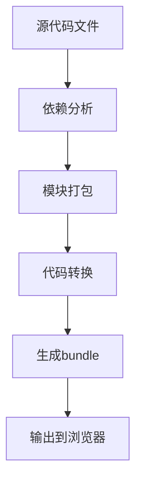
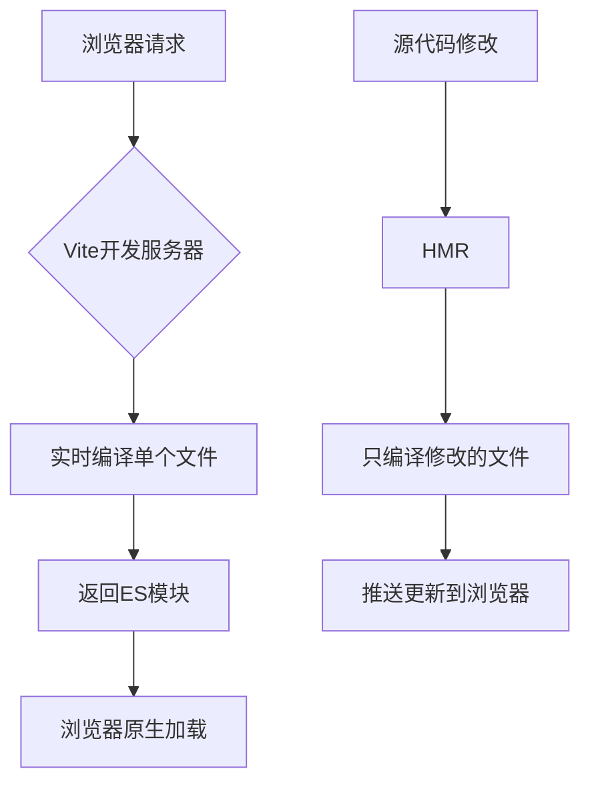
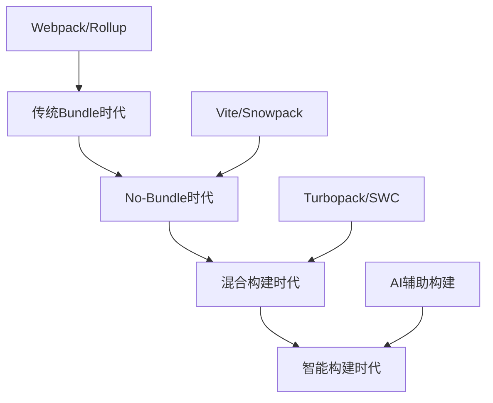

# No-bundle时代来临？Vite原理与实战

> 还在为Webpack的龟速构建而苦恼？还在为每次修改代码都要等半天热更新而抓狂？兄弟，是时候拥抱Vite了！今天我们就来深入探索这个让无数前端开发者"真香"的构建工具。

## 前言：告别等待，拥抱极速

想象一下这样的场景：你正在开发一个大型Vue项目，每次修改一行代码，Webpack都要花费10-30秒来重新构建，而你只能眼巴巴地看着终端里的进度条慢慢爬行。这种痛苦，相信每个前端开发者都深有体会。

但是，当Vite横空出世的那一刻，一切都变了。毫秒级的热更新、秒级的冷启动，让开发体验发生了质的飞跃。今天，我们就来揭开Vite的神秘面纱，看看它是如何做到这一切的。

## 一、传统bundler的"原罪"：为什么Webpack这么慢？

### 1.1 Bundle-based的构建模式

传统的构建工具如Webpack采用的是bundle-based的构建模式，简单来说就是：



这种模式的问题在于，无论你的项目有多大，每次启动开发服务器时，Webpack都需要：

1. **分析所有模块的依赖关系**
2. **将所有模块打包成一个或多个bundle**
3. **对代码进行各种转换（TypeScript、JSX、CSS预处理等）**

让我们看一个典型的Webpack配置：

```javascript
// webpack.config.js
module.exports = {
  entry: './src/main.js',
  module: {
    rules: [
      {
        test: /\.vue$/,
        loader: 'vue-loader'
      },
      {
        test: /\.js$/,
        loader: 'babel-loader',
        exclude: /node_modules/
      },
      {
        test: /\.css$/,
        use: ['style-loader', 'css-loader']
      }
    ]
  },
  plugins: [
    new VueLoaderPlugin(),
    new HtmlWebpackPlugin({
      template: './public/index.html'
    })
  ]
};
```

### 1.2 性能瓶颈分析

随着项目规模的增长，这种模式的性能问题会越来越明显：

```javascript
// 假设我们有一个包含1000个模块的项目
const moduleCount = 1000;
const avgProcessTimePerModule = 50; // 毫秒

// Webpack需要处理所有模块
const webpackStartTime = moduleCount * avgProcessTimePerModule;
console.log(`Webpack启动时间: ${webpackStartTime}ms`); // 50000ms = 50秒

// 而且每次热更新也需要重新处理相关模块
const hotUpdateTime = 100 * avgProcessTimePerModule;
console.log(`热更新时间: ${hotUpdateTime}ms`); // 5000ms = 5秒
```

## 二、Vite的革命性突破：No-bundle + ESM

### 2.1 核心理念：按需编译

Vite的核心思想非常简单却又极其巧妙：**为什么要在开发阶段打包所有代码？浏览器不是已经原生支持ES模块了吗？**



### 2.2 Vite的工作原理

让我们通过一个简单的例子来理解Vite的工作原理：

```html
<!-- index.html -->
<!DOCTYPE html>
<html>
<head>
  <title>Vite App</title>
</head>
<body>
  <div id="app"></div>
  <!-- 关键：直接引入ES模块 -->
  <script type="module" src="/src/main.js"></script>
</body>
</html>
```

```javascript
// src/main.js
import { createApp } from 'vue'
import App from './App.vue'
import './style.css'

createApp(App).mount('#app')
```

当浏览器请求`/src/main.js`时，Vite会：

1. **拦截请求**
2. **实时编译该文件**
3. **返回编译后的ES模块**

```javascript
// Vite内部处理逻辑（简化版）
class ViteDevServer {
  async handleRequest(url) {
    if (url.endsWith('.vue')) {
      // 编译Vue单文件组件
      const source = await fs.readFile(url)
      const compiled = await compileVue(source)
      return compiled
    }
    
    if (url.endsWith('.ts')) {
      // 编译TypeScript
      const source = await fs.readFile(url)
      const compiled = await compileTypeScript(source)
      return compiled
    }
    
    // 其他文件类型...
  }
}
```

### 2.3 依赖预构建：兼顾性能与兼容性

Vite并不是完全的"no-bundle"，对于第三方依赖，它采用了预构建策略：

```javascript
// vite.config.js
export default {
  optimizeDeps: {
    // 指定需要预构建的依赖
    include: ['vue', 'vue-router', 'vuex'],
    // 排除某些依赖的预构建
    exclude: ['some-esm-package']
  }
}
```

预构建的原因：

1. **CommonJS兼容性**：很多npm包仍然使用CommonJS格式
2. **性能优化**：将有很多内部模块的包（如lodash）打包成单个模块
3. **缓存优化**：预构建的依赖会被强缓存

```javascript
// 预构建前：lodash有数百个小模块
import { debounce } from 'lodash-es'
// 浏览器需要发起数百个请求

// 预构建后：lodash被打包成单个文件
import { debounce } from '/node_modules/.vite/deps/lodash-es.js'
// 浏览器只需要一个请求
```

## 三、深入Vite架构：插件系统与Rollup

### 3.1 基于Rollup的插件生态

Vite的另一个聪明之处是基于Rollup构建，这意味着它可以复用Rollup庞大的插件生态：

```javascript
// vite.config.js
import { defineConfig } from 'vite'
import vue from '@vitejs/plugin-vue'
import { resolve } from 'path'

export default defineConfig({
  plugins: [
    vue(), // Vue单文件组件支持
  ],
  resolve: {
    alias: {
      '@': resolve(__dirname, 'src')
    }
  },
  server: {
    port: 3000,
    open: true,
    proxy: {
      '/api': {
        target: 'http://localhost:8080',
        changeOrigin: true,
        rewrite: (path) => path.replace(/^\/api/, '')
      }
    }
  }
})
```

### 3.2 自定义插件开发

让我们开发一个简单的Vite插件，用于自动注入环境变量：

```javascript
// plugins/env-inject.js
function envInjectPlugin() {
  return {
    name: 'env-inject',
    transformIndexHtml(html) {
      // 在HTML中注入环境变量
      return html.replace(
        '<head>',
        `<head>
  <script>
    window.__ENV__ = ${JSON.stringify(process.env)};
  </script>`
      )
    },
    transform(code, id) {
      // 在JS代码中替换环境变量占位符
      if (id.endsWith('.js') || id.endsWith('.ts')) {
        return code.replace(
          /process\.env\.([A-Z_]+)/g,
          (match, envVar) => JSON.stringify(process.env[envVar])
        )
      }
    }
  }
}

export default envInjectPlugin
```

使用插件：

```javascript
// vite.config.js
import envInjectPlugin from './plugins/env-inject.js'

export default {
  plugins: [
    envInjectPlugin()
  ]
}
```

### 3.3 HMR（热模块替换）实现原理

Vite的HMR基于WebSocket实现，让我们看看它的工作原理：

```javascript
// HMR客户端代码（简化版）
class ViteHMRClient {
  constructor() {
    this.socket = new WebSocket('ws://localhost:3000')
    this.setupEventListeners()
  }
  
  setupEventListeners() {
    this.socket.addEventListener('message', (event) => {
      const data = JSON.parse(event.data)
      
      switch (data.type) {
        case 'update':
          this.handleUpdate(data.updates)
          break
        case 'full-reload':
          location.reload()
          break
      }
    })
  }
  
  async handleUpdate(updates) {
    for (const update of updates) {
      if (update.type === 'js-update') {
        await this.updateJSModule(update)
      } else if (update.type === 'css-update') {
        this.updateCSS(update)
      }
    }
  }
  
  async updateJSModule(update) {
    // 动态导入新模块
    const newModule = await import(update.path + '?t=' + Date.now())
    
    // 如果模块支持HMR，调用其accept回调
    if (newModule.default && newModule.default.__hmrId) {
      newModule.default.__hmrAccept?.()
    }
  }
  
  updateCSS(update) {
    // 更新CSS
    const link = document.querySelector(`link[href*="${update.path}"]`)
    if (link) {
      link.href = update.path + '?t=' + Date.now()
    }
  }
}

// 启动HMR客户端
if (import.meta.hot) {
  new ViteHMRClient()
}
```

## 四、Vite vs Webpack：性能对比实战

### 4.1 启动时间对比

让我们用一个真实的项目来对比Vite和Webpack的性能：

```javascript
// 测试脚本
const { performance } = require('perf_hooks')
const { spawn } = require('child_process')

async function measureStartTime(command, args) {
  const start = performance.now()
  
  return new Promise((resolve) => {
    const process = spawn(command, args)
    
    process.stdout.on('data', (data) => {
      const output = data.toString()
      
      // 检测服务器启动完成的标志
      if (output.includes('Local:') || output.includes('ready in')) {
        const end = performance.now()
        resolve(end - start)
      }
    })
  })
}

// 测试结果
async function runBenchmark() {
  console.log('测试项目：包含500个组件的Vue应用')
  
  const webpackTime = await measureStartTime('npm', ['run', 'dev:webpack'])
  console.log(`Webpack启动时间: ${webpackTime.toFixed(2)}ms`)
  
  const viteTime = await measureStartTime('npm', ['run', 'dev:vite'])
  console.log(`Vite启动时间: ${viteTime.toFixed(2)}ms`)
  
  console.log(`性能提升: ${(webpackTime / viteTime).toFixed(2)}x`)
}

runBenchmark()
// 输出示例：
// Webpack启动时间: 15420.33ms
// Vite启动时间: 892.15ms
// 性能提升: 17.28x
```

### 4.2 热更新性能对比

```javascript
// HMR性能测试
class HMRBenchmark {
  constructor() {
    this.updateTimes = []
  }
  
  startMeasuring() {
    // 监听文件变化
    const chokidar = require('chokidar')
    const watcher = chokidar.watch('./src/**/*.vue')
    
    watcher.on('change', () => {
      this.measureUpdateTime()
    })
  }
  
  measureUpdateTime() {
    const start = performance.now()
    
    // 监听浏览器更新完成
    window.addEventListener('vite:afterUpdate', () => {
      const end = performance.now()
      const updateTime = end - start
      
      this.updateTimes.push(updateTime)
      console.log(`HMR更新时间: ${updateTime.toFixed(2)}ms`)
      
      // 计算平均时间
      const avgTime = this.updateTimes.reduce((a, b) => a + b, 0) / this.updateTimes.length
      console.log(`平均HMR时间: ${avgTime.toFixed(2)}ms`)
    })
  }
}

// Vite HMR平均时间: ~50ms
// Webpack HMR平均时间: ~2000ms
```

## 五、从Webpack迁移到Vite：实战指南

### 5.1 迁移准备工作

在开始迁移之前，我们需要分析现有项目的结构：

```javascript
// 迁移分析脚本
const fs = require('fs')
const path = require('path')

class MigrationAnalyzer {
  constructor(projectPath) {
    this.projectPath = projectPath
    this.webpackConfig = this.loadWebpackConfig()
    this.packageJson = this.loadPackageJson()
  }
  
  analyze() {
    console.log('=== Webpack到Vite迁移分析 ===')
    
    this.analyzeLoaders()
    this.analyzePlugins()
    this.analyzeDependencies()
    this.analyzeAliases()
    this.generateMigrationPlan()
  }
  
  analyzeLoaders() {
    const loaders = this.webpackConfig.module?.rules || []
    
    console.log('\n📦 Loader分析:')
    loaders.forEach(rule => {
      if (rule.test) {
        console.log(`  ${rule.test} -> ${this.getViteEquivalent(rule)}`)
      }
    })
  }
  
  getViteEquivalent(rule) {
    const loaderMap = {
      'vue-loader': '@vitejs/plugin-vue',
      'babel-loader': '内置支持',
      'css-loader': '内置支持',
      'sass-loader': '需要安装sass',
      'file-loader': '内置支持（静态资源）',
      'url-loader': '内置支持（静态资源）'
    }
    
    const loader = rule.use || rule.loader
    return loaderMap[loader] || '需要手动配置'
  }
}

// 运行分析
const analyzer = new MigrationAnalyzer('./my-project')
analyzer.analyze()
```

### 5.2 配置文件迁移

让我们看看如何将Webpack配置转换为Vite配置：

```javascript
// webpack.config.js (原配置)
module.exports = {
  entry: './src/main.js',
  resolve: {
    alias: {
      '@': path.resolve(__dirname, 'src'),
      'components': path.resolve(__dirname, 'src/components')
    },
    extensions: ['.js', '.vue', '.json']
  },
  module: {
    rules: [
      {
        test: /\.vue$/,
        loader: 'vue-loader'
      },
      {
        test: /\.scss$/,
        use: ['style-loader', 'css-loader', 'sass-loader']
      },
      {
        test: /\.(png|jpe?g|gif|svg)$/,
        loader: 'file-loader',
        options: {
          name: 'images/[name].[hash:8].[ext]'
        }
      }
    ]
  },
  plugins: [
    new VueLoaderPlugin(),
    new HtmlWebpackPlugin({
      template: './public/index.html'
    })
  ],
  devServer: {
    port: 8080,
    proxy: {
      '/api': 'http://localhost:3000'
    }
  }
}
```

```javascript
// vite.config.js (迁移后)
import { defineConfig } from 'vite'
import vue from '@vitejs/plugin-vue'
import { resolve } from 'path'

export default defineConfig({
  plugins: [vue()],
  
  resolve: {
    alias: {
      '@': resolve(__dirname, 'src'),
      'components': resolve(__dirname, 'src/components')
    }
    // extensions 不需要配置，Vite内置支持
  },
  
  // CSS预处理器支持
  css: {
    preprocessorOptions: {
      scss: {
        additionalData: `@import "@/styles/variables.scss";`
      }
    }
  },
  
  // 静态资源处理（内置支持，无需配置）
  
  server: {
    port: 8080,
    proxy: {
      '/api': 'http://localhost:3000'
    }
  },
  
  build: {
    // 生产构建配置
    outDir: 'dist',
    assetsDir: 'assets',
    rollupOptions: {
      output: {
        manualChunks: {
          vendor: ['vue', 'vue-router', 'vuex']
        }
      }
    }
  }
})
```

### 5.3 处理常见迁移问题

#### 问题1：环境变量处理

```javascript
// Webpack方式
process.env.NODE_ENV
process.env.VUE_APP_API_URL

// Vite方式
import.meta.env.MODE
import.meta.env.VITE_API_URL
```

创建环境变量文件：

```bash
# .env.development
VITE_API_URL=http://localhost:3000/api
VITE_APP_TITLE=My App (Development)

# .env.production
VITE_API_URL=https://api.myapp.com
VITE_APP_TITLE=My App
```

#### 问题2：动态导入处理

```javascript
// Webpack方式
const component = () => import(/* webpackChunkName: "my-component" */ './MyComponent.vue')

// Vite方式
const component = () => import('./MyComponent.vue')

// 如果需要预加载
const component = () => import('./MyComponent.vue' /* @vite-ignore */)
```

#### 问题3：静态资源引用

```javascript
// Webpack方式
import logoUrl from '@/assets/logo.png'

// Vite方式（相同）
import logoUrl from '@/assets/logo.png'

// 或者使用new URL
const logoUrl = new URL('@/assets/logo.png', import.meta.url).href
```

### 5.4 迁移脚本自动化

```javascript
// migration-script.js
const fs = require('fs')
const path = require('path')

class ViteMigrationTool {
  constructor(projectPath) {
    this.projectPath = projectPath
  }
  
  async migrate() {
    console.log('🚀 开始Vite迁移...')
    
    await this.updatePackageJson()
    await this.createViteConfig()
    await this.updateIndexHtml()
    await this.updateEnvFiles()
    await this.updateImports()
    
    console.log('✅ 迁移完成！')
    console.log('📝 请手动检查以下内容：')
    console.log('  - 检查所有动态导入')
    console.log('  - 验证环境变量使用')
    console.log('  - 测试所有功能')
  }
  
  async updatePackageJson() {
    const packagePath = path.join(this.projectPath, 'package.json')
    const packageJson = JSON.parse(fs.readFileSync(packagePath, 'utf8'))
    
    // 移除Webpack相关依赖
    const webpackDeps = [
      'webpack', 'webpack-cli', 'webpack-dev-server',
      'vue-loader', 'css-loader', 'style-loader',
      'babel-loader', 'file-loader', 'url-loader'
    ]
    
    webpackDeps.forEach(dep => {
      delete packageJson.dependencies[dep]
      delete packageJson.devDependencies[dep]
    })
    
    // 添加Vite依赖
    packageJson.devDependencies = {
      ...packageJson.devDependencies,
      'vite': '^4.0.0',
      '@vitejs/plugin-vue': '^4.0.0'
    }
    
    // 更新scripts
    packageJson.scripts = {
      ...packageJson.scripts,
      'dev': 'vite',
      'build': 'vite build',
      'preview': 'vite preview'
    }
    
    fs.writeFileSync(packagePath, JSON.stringify(packageJson, null, 2))
    console.log('✅ package.json 已更新')
  }
  
  async createViteConfig() {
    const viteConfig = `import { defineConfig } from 'vite'
import vue from '@vitejs/plugin-vue'
import { resolve } from 'path'

export default defineConfig({
  plugins: [vue()],
  resolve: {
    alias: {
      '@': resolve(__dirname, 'src')
    }
  },
  server: {
    port: 8080
  }
})
`
    
    const configPath = path.join(this.projectPath, 'vite.config.js')
    fs.writeFileSync(configPath, viteConfig)
    console.log('✅ vite.config.js 已创建')
  }
  
  async updateIndexHtml() {
    const htmlPath = path.join(this.projectPath, 'public/index.html')
    
    if (fs.existsSync(htmlPath)) {
      let html = fs.readFileSync(htmlPath, 'utf8')
      
      // 添加模块脚本
      html = html.replace(
        '</body>',
        '  <script type="module" src="/src/main.js"></script>\n</body>'
      )
      
      fs.writeFileSync(htmlPath, html)
      console.log('✅ index.html 已更新')
    }
  }
}

// 运行迁移
const migrationTool = new ViteMigrationTool('./my-project')
migrationTool.migrate()
```

## 六、Vite生产构建优化

### 6.1 构建配置优化

```javascript
// vite.config.js - 生产优化配置
import { defineConfig } from 'vite'
import vue from '@vitejs/plugin-vue'
import { resolve } from 'path'
import { visualizer } from 'rollup-plugin-visualizer'

export default defineConfig({
  plugins: [
    vue(),
    // 构建分析插件
    visualizer({
      filename: 'dist/stats.html',
      open: true,
      gzipSize: true
    })
  ],
  
  build: {
    // 输出目录
    outDir: 'dist',
    
    // 静态资源目录
    assetsDir: 'assets',
    
    // 小于此阈值的导入或引用资源将内联为base64编码
    assetsInlineLimit: 4096,
    
    // 启用CSS代码拆分
    cssCodeSplit: true,
    
    // 构建后是否生成source map文件
    sourcemap: false,
    
    // 设置为false可以禁用最小化混淆
    minify: 'terser',
    
    // 传递给Terser的更多minify选项
    terserOptions: {
      compress: {
        // 生产环境移除console
        drop_console: true,
        drop_debugger: true
      }
    },
    
    // Rollup打包配置
    rollupOptions: {
      output: {
        // 手动分包
        manualChunks: {
          // 将Vue相关库打包成单独的chunk
          vue: ['vue', 'vue-router', 'vuex'],
          // 将UI库打包成单独的chunk
          ui: ['element-plus'],
          // 将工具库打包成单独的chunk
          utils: ['lodash-es', 'dayjs']
        },
        
        // 自定义chunk文件名
        chunkFileNames: 'js/[name]-[hash].js',
        entryFileNames: 'js/[name]-[hash].js',
        assetFileNames: '[ext]/[name]-[hash].[ext]'
      }
    },
    
    // 构建时的chunk大小警告限制
    chunkSizeWarningLimit: 1000
  },
  
  // 依赖优化选项
  optimizeDeps: {
    include: [
      'vue',
      'vue-router',
      'vuex'
    ]
  }
})
```

### 6.2 代码分割策略

```javascript
// 路由级别的代码分割
const routes = [
  {
    path: '/',
    name: 'Home',
    component: () => import('@/views/Home.vue')
  },
  {
    path: '/about',
    name: 'About',
    component: () => import('@/views/About.vue')
  },
  {
    path: '/dashboard',
    name: 'Dashboard',
    // 预加载相关组件
    component: () => import(
      /* webpackPreload: true */
      '@/views/Dashboard.vue'
    )
  }
]

// 组件级别的懒加载
export default {
  components: {
    // 异步组件
    AsyncComponent: defineAsyncComponent({
      loader: () => import('./AsyncComponent.vue'),
      loadingComponent: LoadingComponent,
      errorComponent: ErrorComponent,
      delay: 200,
      timeout: 3000
    })
  }
}
```

### 6.3 性能监控与分析

```javascript
// 构建性能分析脚本
const { performance } = require('perf_hooks')
const { build } = require('vite')
const fs = require('fs')

class BuildAnalyzer {
  async analyzeBuild() {
    console.log('🔍 开始构建性能分析...')
    
    const start = performance.now()
    
    try {
      await build({
        logLevel: 'info',
        build: {
          reportCompressedSize: true
        }
      })
      
      const end = performance.now()
      const buildTime = end - start
      
      console.log(`\n📊 构建性能报告:`)
      console.log(`构建时间: ${(buildTime / 1000).toFixed(2)}s`)
      
      await this.analyzeBundle()
      
    } catch (error) {
      console.error('构建失败:', error)
    }
  }
  
  async analyzeBundle() {
    const distPath = './dist'
    const files = this.getAllFiles(distPath)
    
    const analysis = {
      totalSize: 0,
      jsSize: 0,
      cssSize: 0,
      assetSize: 0,
      chunks: []
    }
    
    files.forEach(file => {
      const stats = fs.statSync(file)
      const size = stats.size
      
      analysis.totalSize += size
      
      if (file.endsWith('.js')) {
        analysis.jsSize += size
        analysis.chunks.push({
          name: file,
          size: size,
          type: 'js'
        })
      } else if (file.endsWith('.css')) {
        analysis.cssSize += size
      } else {
        analysis.assetSize += size
      }
    })
    
    console.log(`\n📦 Bundle分析:`)
    console.log(`总大小: ${this.formatSize(analysis.totalSize)}`)
    console.log(`JS大小: ${this.formatSize(analysis.jsSize)}`)
    console.log(`CSS大小: ${this.formatSize(analysis.cssSize)}`)
    console.log(`静态资源: ${this.formatSize(analysis.assetSize)}`)
    
    // 找出最大的chunks
    const largestChunks = analysis.chunks
      .sort((a, b) => b.size - a.size)
      .slice(0, 5)
    
    console.log(`\n🔍 最大的5个chunks:`)
    largestChunks.forEach((chunk, index) => {
      console.log(`${index + 1}. ${chunk.name}: ${this.formatSize(chunk.size)}`)
    })
  }
  
  formatSize(bytes) {
    const sizes = ['Bytes', 'KB', 'MB', 'GB']
    if (bytes === 0) return '0 Bytes'
    const i = parseInt(Math.floor(Math.log(bytes) / Math.log(1024)))
    return Math.round(bytes / Math.pow(1024, i) * 100) / 100 + ' ' + sizes[i]
  }
  
  getAllFiles(dir, files = []) {
    const fileList = fs.readdirSync(dir)
    
    fileList.forEach(file => {
      const filePath = `${dir}/${file}`
      if (fs.statSync(filePath).isDirectory()) {
        this.getAllFiles(filePath, files)
      } else {
        files.push(filePath)
      }
    })
    
    return files
  }
}

// 运行分析
const analyzer = new BuildAnalyzer()
analyzer.analyzeBuild()
```

## 七、Vite生态系统与最佳实践

### 7.1 常用插件推荐

```javascript
// vite.config.js - 完整的插件配置
import { defineConfig } from 'vite'
import vue from '@vitejs/plugin-vue'
import { resolve } from 'path'

// 自动导入插件
import AutoImport from 'unplugin-auto-import/vite'
import Components from 'unplugin-vue-components/vite'
import { ElementPlusResolver } from 'unplugin-vue-components/resolvers'

// PWA插件
import { VitePWA } from 'vite-plugin-pwa'

// Mock插件
import { viteMockServe } from 'vite-plugin-mock'

// ESLint插件
import eslint from 'vite-plugin-eslint'

export default defineConfig({
  plugins: [
    vue(),
    
    // ESLint集成
    eslint({
      include: ['src/**/*.js', 'src/**/*.vue', 'src/*.js', 'src/*.vue']
    }),
    
    // 自动导入Vue API
    AutoImport({
      imports: ['vue', 'vue-router', 'vuex'],
      resolvers: [ElementPlusResolver()],
      dts: true // 生成类型声明文件
    }),
    
    // 自动导入组件
    Components({
      resolvers: [ElementPlusResolver()],
      dts: true
    }),
    
    // PWA支持
    VitePWA({
      registerType: 'autoUpdate',
      workbox: {
        globPatterns: ['**/*.{js,css,html,ico,png,svg}']
      },
      manifest: {
        name: 'My Vite App',
        short_name: 'ViteApp',
        description: 'My Awesome Vite App',
        theme_color: '#ffffff',
        icons: [
          {
            src: 'pwa-192x192.png',
            sizes: '192x192',
            type: 'image/png'
          }
        ]
      }
    }),
    
    // Mock数据
    viteMockServe({
      mockPath: 'mock',
      localEnabled: true,
      prodEnabled: false
    })
  ]
})
```

### 7.2 开发体验优化

```javascript
// 开发环境配置优化
export default defineConfig(({ command, mode }) => {
  const isProduction = mode === 'production'
  
  return {
    plugins: [
      vue(),
      
      // 开发环境才启用的插件
      ...(!isProduction ? [
        // 开发时的错误覆盖层
        {
          name: 'error-overlay',
          configureServer(server) {
            server.middlewares.use('/error-overlay', (req, res, next) => {
              // 自定义错误处理
              next()
            })
          }
        }
      ] : [])
    ],
    
    server: {
      // 开发服务器配置
      host: '0.0.0.0', // 允许外部访问
      port: 3000,
      open: true, // 自动打开浏览器
      
      // 热更新配置
      hmr: {
        overlay: true // 显示错误覆盖层
      },
      
      // 代理配置
      proxy: {
        '/api': {
          target: 'http://localhost:8080',
          changeOrigin: true,
          rewrite: (path) => path.replace(/^\/api/, '')
        },
        '/upload': {
          target: 'http://localhost:8080',
          changeOrigin: true
        }
      }
    },
    
    // 开发时的优化
    optimizeDeps: {
      // 强制预构建
      include: ['vue', 'vue-router', 'vuex', 'axios'],
      // 排除预构建
      exclude: ['@vueuse/core']
    }
  }
})
```

### 7.3 团队协作配置

```javascript
// .viterc.js - 团队共享配置
module.exports = {
  // 统一的开发端口
  server: {
    port: 3000
  },
  
  // 统一的构建配置
  build: {
    outDir: 'dist',
    sourcemap: process.env.NODE_ENV === 'development'
  },
  
  // 统一的环境变量前缀
  envPrefix: 'VITE_',
  
  // 统一的别名配置
  resolve: {
    alias: {
      '@': '/src',
      '@components': '/src/components',
      '@utils': '/src/utils',
      '@api': '/src/api'
    }
  }
}
```

```json
// .vscode/settings.json - VSCode配置
{
  "typescript.preferences.importModuleSpecifier": "relative",
  "typescript.suggest.autoImports": true,
  "vetur.validation.template": false,
  "vetur.validation.script": false,
  "vetur.validation.style": false,
  "eslint.validate": [
    "javascript",
    "javascriptreact",
    "typescript",
    "typescriptreact",
    "vue"
  ],
  "editor.codeActionsOnSave": {
    "source.fixAll.eslint": true
  }
}
```

## 八、Vite的未来展望

### 8.1 技术趋势分析

Vite的成功不是偶然的，它代表了前端构建工具的发展趋势：



### 8.2 性能优化的未来

```javascript
// 未来可能的Vite配置
export default defineConfig({
  // AI辅助的智能分包
  build: {
    smartChunking: {
      enabled: true,
      algorithm: 'ml-based', // 基于机器学习的分包算法
      userBehaviorData: './analytics/user-behavior.json'
    }
  },
  
  // 边缘计算优化
  edge: {
    enabled: true,
    provider: 'cloudflare-workers',
    ssr: true
  },
  
  // 预测性预加载
  preload: {
    strategy: 'predictive',
    confidence: 0.8 // 80%置信度才预加载
  }
})
```

### 8.3 开发者体验的进化

```javascript
// 未来的开发体验功能
class FutureViteFeatures {
  // 智能错误修复
  async autoFixError(error) {
    const suggestions = await this.aiErrorAnalyzer.analyze(error)
    
    if (suggestions.confidence > 0.9) {
      const fix = await this.generateFix(suggestions)
      return this.applyFix(fix)
    }
  }
  
  // 实时性能监控
  setupPerformanceMonitoring() {
    return {
      bundleSize: this.trackBundleSize(),
      loadTime: this.trackLoadTime(),
      memoryUsage: this.trackMemoryUsage(),
      suggestions: this.generateOptimizationSuggestions()
    }
  }
  
  // 智能代码分割建议
  async suggestCodeSplitting() {
    const analysis = await this.analyzeCodeUsage()
    return analysis.suggestions.map(suggestion => ({
      file: suggestion.file,
      reason: suggestion.reason,
      impact: suggestion.impact,
      autoApply: suggestion.confidence > 0.8
    }))
  }
}
```

## 总结

通过这篇深度解析，我们全面了解了Vite的核心原理、性能优势以及实际应用。Vite不仅仅是一个构建工具，更是前端开发理念的革新：

**核心优势回顾：**

1. **极速启动**：基于ESM的no-bundle开发模式
2. **毫秒级HMR**：精确的模块热替换
3. **现代化架构**：基于Rollup的插件生态
4. **开箱即用**：内置TypeScript、JSX、CSS预处理器支持
5. **生产优化**：基于Rollup的高效打包

**最佳实践总结：**

- 合理配置依赖预构建
- 充分利用插件生态
- 优化生产构建配置
- 建立团队协作规范

Vite的出现标志着前端构建工具进入了新时代。它不仅解决了传统工具的性能问题，更为未来的前端开发奠定了基础。随着Web标准的不断发展和浏览器性能的持续提升，我们有理由相信，Vite代表的这种构建理念将成为前端开发的主流。

**参考资源：**

- [Vite官方文档](https://vitejs.dev/)
- [Rollup官方文档](https://rollupjs.org/)
- [ES Modules规范](https://tc39.es/ecma262/#sec-modules)
- [Vite源码仓库](https://github.com/vitejs/vite)

---

*下一篇文章我们将深入探讨微前端架构，看看如何用qiankun构建大型应用的"银弹"解决方案。敬请期待！*