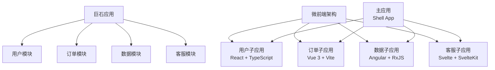
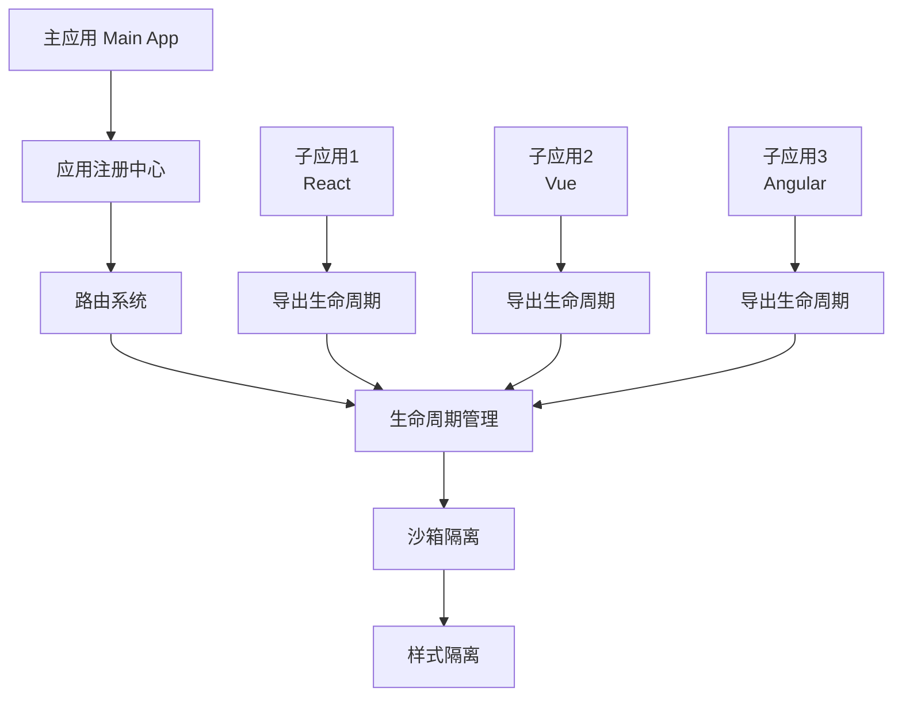
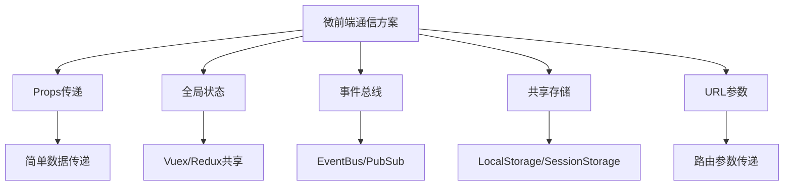
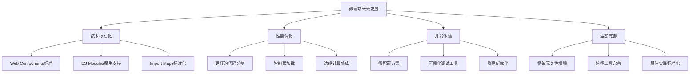

# 微前端架构：大型项目拆解的"银弹"

> 还在为巨石应用的维护而头疼？团队协作总是互相踩坑？不同技术栈无法共存？别急，微前端来拯救你了！今天我们就来深入探索这个被誉为大型前端项目"银弹"的架构模式。

## 前言：当前端项目变成"巨石怪"

想象一下这样的场景：你的公司有一个已经开发了3年的前端项目，代码量超过50万行，涉及用户管理、订单系统、数据分析、客服系统等十几个业务模块。现在的问题是：

- 🐌 **构建缓慢**：每次构建需要10分钟以上
- 🔥 **部署风险**：一个小改动可能影响整个系统
- 👥 **团队冲突**：多个团队在同一个代码库里开发，经常产生冲突
- 🔧 **技术债务**：想升级React版本？牵一发而动全身
- 📈 **扩展困难**：新增一个模块需要了解整个系统架构

这就是典型的"巨石应用"问题。而微前端，就是为了解决这些痛点而生的。

## 一、微前端的核心理念：分而治之

### 1.1 什么是微前端？

微前端是一种架构模式，它将大型前端应用拆分成多个独立的、可部署的小型前端应用。每个小应用都可以：

- **独立开发**：不同团队可以使用不同的技术栈
- **独立部署**：可以单独发布，不影响其他应用
- **独立运行**：在运行时组合成一个完整的应用



### 1.2 微前端的核心价值

```javascript
// 传统巨石应用的问题
class MonolithApp {
  constructor() {
    this.modules = {
      user: new UserModule(),
      order: new OrderModule(),
      analytics: new AnalyticsModule(),
      support: new SupportModule()
    }
    
    // 所有模块耦合在一起
    this.dependencies = {
      shared: ['react@16.8.0', 'antd@4.0.0', 'moment@2.24.0'],
      conflicts: ['版本冲突', '样式冲突', '全局状态冲突']
    }
  }
  
  deploy() {
    // 必须整体部署
    return this.buildAll().then(this.deployAll)
  }
  
  update(module) {
    // 更新一个模块需要重新构建整个应用
    return this.buildAll()
  }
}

// 微前端架构的优势
class MicroFrontendApp {
  constructor() {
    this.subApps = {
      user: new UserSubApp({ framework: 'React', version: '18.0.0' }),
      order: new OrderSubApp({ framework: 'Vue', version: '3.0.0' }),
      analytics: new AnalyticsSubApp({ framework: 'Angular', version: '15.0.0' }),
      support: new SupportSubApp({ framework: 'Svelte', version: '3.0.0' })
    }
  }
  
  deploy(subAppName) {
    // 可以独立部署单个子应用
    return this.subApps[subAppName].deploy()
  }
  
  update(subAppName) {
    // 只需要构建和更新特定的子应用
    return this.subApps[subAppName].build().then(deploy)
  }
}
```

## 二、微前端实现方案对比

### 2.1 主流实现方案概览

| 方案 | 技术原理 | 优势 | 劣势 | 适用场景 |
|------|----------|------|------|----------|
| **iframe** | 浏览器原生隔离 | 完全隔离、简单易用 | 性能差、体验割裂 | 简单集成场景 |
| **single-spa** | 路由劫持 | 生态成熟、灵活性高 | 学习成本高、配置复杂 | 大型企业应用 |
| **qiankun** | single-spa + 沙箱 | 开箱即用、隔离性好 | 阿里系技术栈绑定 | 中大型项目 |
| **MicroApp** | WebComponent | 类似iframe体验、隔离性好 | 相对较新、生态待完善 | 现代化项目 |
| **Module Federation** | Webpack 5原生 | 性能最优、共享依赖 | 需要Webpack 5 | 现代构建工具项目 |

### 2.2 qiankun深度解析

作为国内最受欢迎的微前端框架，qiankun基于single-spa进行了封装，提供了更好的开箱即用体验。

#### 核心架构



#### 主应用配置

```javascript
// main-app/src/main.js
import { registerMicroApps, start } from 'qiankun'

// 注册子应用
registerMicroApps([
  {
    name: 'user-app', // 应用名称
    entry: '//localhost:8081', // 应用入口
    container: '#user-container', // 应用挂载节点
    activeRule: '/user', // 激活路由
    props: {
      // 传递给子应用的数据
      userInfo: { id: 1, name: 'admin' },
      token: localStorage.getItem('token')
    }
  },
  {
    name: 'order-app',
    entry: '//localhost:8082',
    container: '#order-container',
    activeRule: '/order',
    props: {
      apiBase: 'https://api.example.com'
    }
  },
  {
    name: 'analytics-app',
    entry: '//localhost:8083',
    container: '#analytics-container',
    activeRule: '/analytics'
  }
])

// 启动qiankun
start({
  prefetch: true, // 预加载
  sandbox: {
    strictStyleIsolation: true, // 严格样式隔离
    experimentalStyleIsolation: true // 实验性样式隔离
  },
  singular: false // 是否单例模式
})
```

#### 主应用布局组件

```vue
<!-- main-app/src/components/Layout.vue -->
<template>
  <div class="main-layout">
    <!-- 全局导航 -->
    <nav class="main-nav">
      <div class="nav-brand">
        
        <span>企业管理系统</span>
      </div>
      
      <ul class="nav-menu">
        <li>
          <router-link to="/user" :class="{ active: isActive('/user') }">
            <i class="icon-user"></i>
            用户管理
          </router-link>
        </li>
        <li>
          <router-link to="/order" :class="{ active: isActive('/order') }">
            <i class="icon-order"></i>
            订单管理
          </router-link>
        </li>
        <li>
          <router-link to="/analytics" :class="{ active: isActive('/analytics') }">
            <i class="icon-chart"></i>
            数据分析
          </router-link>
        </li>
      </ul>
      
      <div class="nav-user">
        <span>{{ userInfo.name }}</span>
        <button @click="logout">退出</button>
      </div>
    </nav>
    
    <!-- 子应用容器 -->
    <main class="main-content">
      <!-- 用户管理子应用 -->
      <div id="user-container" v-show="currentApp === 'user'"></div>
      
      <!-- 订单管理子应用 -->
      <div id="order-container" v-show="currentApp === 'order'"></div>
      
      <!-- 数据分析子应用 -->
      <div id="analytics-container" v-show="currentApp === 'analytics'"></div>
    </main>
  </div>
</template>

<script>
import { defineComponent, ref, computed } from 'vue'
import { useRoute } from 'vue-router'

export default defineComponent({
  name: 'MainLayout',
  setup() {
    const route = useRoute()
    const userInfo = ref({ name: 'Admin' })
    
    const currentApp = computed(() => {
      const path = route.path
      if (path.startsWith('/user')) return 'user'
      if (path.startsWith('/order')) return 'order'
      if (path.startsWith('/analytics')) return 'analytics'
      return null
    })
    
    const isActive = (path) => {
      return route.path.startsWith(path)
    }
    
    const logout = () => {
      localStorage.removeItem('token')
      window.location.href = '/login'
    }
    
    return {
      userInfo,
      currentApp,
      isActive,
      logout
    }
  }
})
</script>

<style scoped>
.main-layout {
  height: 100vh;
  display: flex;
  flex-direction: column;
}

.main-nav {
  height: 60px;
  background: #001529;
  display: flex;
  align-items: center;
  padding: 0 20px;
  color: white;
}

.nav-brand {
  display: flex;
  align-items: center;
  margin-right: 40px;
}

.nav-brand img {
  width: 32px;
  height: 32px;
  margin-right: 12px;
}

.nav-menu {
  display: flex;
  list-style: none;
  margin: 0;
  padding: 0;
  flex: 1;
}

.nav-menu li {
  margin-right: 20px;
}

.nav-menu a {
  color: rgba(255, 255, 255, 0.65);
  text-decoration: none;
  padding: 0 16px;
  height: 60px;
  display: flex;
  align-items: center;
  transition: color 0.3s;
}

.nav-menu a:hover,
.nav-menu a.active {
  color: #1890ff;
}

.main-content {
  flex: 1;
  overflow: hidden;
}

#user-container,
#order-container,
#analytics-container {
  height: 100%;
  width: 100%;
}
</style>
```

### 2.3 子应用开发

#### React子应用（用户管理）

```javascript
// user-app/src/index.js
import React from 'react'
import ReactDOM from 'react-dom'
import App from './App'
import { BrowserRouter } from 'react-router-dom'

// 全局变量，用于判断是否在qiankun环境中
const isQiankun = window.__POWERED_BY_QIANKUN__

function render(props = {}) {
  const { container, userInfo, token } = props
  
  // 设置全局状态
  if (userInfo) {
    window.__USER_INFO__ = userInfo
  }
  if (token) {
    localStorage.setItem('token', token)
  }
  
  ReactDOM.render(
    <BrowserRouter basename={isQiankun ? '/user' : '/'}>
      <App />
    </BrowserRouter>,
    container ? container.querySelector('#root') : document.querySelector('#root')
  )
}

// 独立运行时直接渲染
if (!isQiankun) {
  render()
}

// 导出qiankun生命周期
export async function bootstrap() {
  console.log('[user-app] 应用启动')
}

export async function mount(props) {
  console.log('[user-app] 应用挂载', props)
  render(props)
}

export async function unmount(props) {
  console.log('[user-app] 应用卸载', props)
  const { container } = props
  ReactDOM.unmountComponentAtNode(
    container ? container.querySelector('#root') : document.querySelector('#root')
  )
}
```

```jsx
// user-app/src/App.jsx
import React, { useState, useEffect } from 'react'
import { Routes, Route, Link } from 'react-router-dom'
import UserList from './components/UserList'
import UserDetail from './components/UserDetail'
import UserCreate from './components/UserCreate'
import './App.css'

function App() {
  const [users, setUsers] = useState([])
  const [loading, setLoading] = useState(false)
  
  useEffect(() => {
    fetchUsers()
  }, [])
  
  const fetchUsers = async () => {
    setLoading(true)
    try {
      const response = await fetch('/api/users', {
        headers: {
          'Authorization': `Bearer ${localStorage.getItem('token')}`
        }
      })
      const data = await response.json()
      setUsers(data)
    } catch (error) {
      console.error('获取用户列表失败:', error)
    } finally {
      setLoading(false)
    }
  }
  
  return (
    <div className="user-app">
      <div className="user-header">
        <h1>用户管理</h1>
        <nav className="user-nav">
          <Link to="/list">用户列表</Link>
          <Link to="/create">新增用户</Link>
        </nav>
      </div>
      
      <div className="user-content">
        <Routes>
          <Route path="/list" element={
            <UserList 
              users={users} 
              loading={loading} 
              onRefresh={fetchUsers}
            />
          } />
          <Route path="/detail/:id" element={<UserDetail />} />
          <Route path="/create" element={
            <UserCreate onSuccess={fetchUsers} />
          } />
          <Route path="/" element={<UserList users={users} loading={loading} />} />
        </Routes>
      </div>
    </div>
  )
}

export default App
```

#### Vue子应用（订单管理）

```javascript
// order-app/src/main.js
import { createApp } from 'vue'
import { createRouter, createWebHistory } from 'vue-router'
import App from './App.vue'
import routes from './routes'

let app = null
let router = null

function render(props = {}) {
  const { container, apiBase } = props
  
  // 创建路由
  router = createRouter({
    history: createWebHistory(window.__POWERED_BY_QIANKUN__ ? '/order' : '/'),
    routes
  })
  
  // 创建应用
  app = createApp(App)
  app.use(router)
  
  // 全局配置
  if (apiBase) {
    app.config.globalProperties.$apiBase = apiBase
  }
  
  // 挂载应用
  const containerElement = container ? container.querySelector('#app') : '#app'
  app.mount(containerElement)
}

// 独立运行
if (!window.__POWERED_BY_QIANKUN__) {
  render()
}

// qiankun生命周期
export async function bootstrap() {
  console.log('[order-app] 应用启动')
}

export async function mount(props) {
  console.log('[order-app] 应用挂载', props)
  render(props)
}

export async function unmount() {
  console.log('[order-app] 应用卸载')
  app?.unmount()
  app = null
  router = null
}
```

```vue
<!-- order-app/src/App.vue -->
<template>
  <div class="order-app">
    <div class="order-header">
      <h1>订单管理</h1>
      <div class="order-stats">
        <div class="stat-item">
          <span class="stat-label">今日订单</span>
          <span class="stat-value">{{ todayOrders }}</span>
        </div>
        <div class="stat-item">
          <span class="stat-label">待处理</span>
          <span class="stat-value">{{ pendingOrders }}</span>
        </div>
        <div class="stat-item">
          <span class="stat-label">总金额</span>
          <span class="stat-value">¥{{ totalAmount }}</span>
        </div>
      </div>
    </div>
    
    <div class="order-content">
      <router-view />
    </div>
  </div>
</template>

<script>
import { defineComponent, ref, onMounted } from 'vue'
import { useOrderStore } from './stores/order'

export default defineComponent({
  name: 'OrderApp',
  setup() {
    const orderStore = useOrderStore()
    const todayOrders = ref(0)
    const pendingOrders = ref(0)
    const totalAmount = ref(0)
    
    onMounted(async () => {
      await loadOrderStats()
    })
    
    const loadOrderStats = async () => {
      try {
        const stats = await orderStore.getOrderStats()
        todayOrders.value = stats.todayOrders
        pendingOrders.value = stats.pendingOrders
        totalAmount.value = stats.totalAmount
      } catch (error) {
        console.error('加载订单统计失败:', error)
      }
    }
    
    return {
      todayOrders,
      pendingOrders,
      totalAmount
    }
  }
})
</script>

<style scoped>
.order-app {
  height: 100%;
  display: flex;
  flex-direction: column;
}

.order-header {
  padding: 20px;
  background: #f5f5f5;
  border-bottom: 1px solid #e8e8e8;
}

.order-header h1 {
  margin: 0 0 16px 0;
  color: #333;
}

.order-stats {
  display: flex;
  gap: 24px;
}

.stat-item {
  display: flex;
  flex-direction: column;
  align-items: center;
  padding: 16px;
  background: white;
  border-radius: 8px;
  box-shadow: 0 2px 8px rgba(0, 0, 0, 0.1);
  min-width: 120px;
}

.stat-label {
  font-size: 14px;
  color: #666;
  margin-bottom: 8px;
}

.stat-value {
  font-size: 24px;
  font-weight: bold;
  color: #1890ff;
}

.order-content {
  flex: 1;
  padding: 20px;
  overflow: auto;
}
</style>
```

## 三、微前端通信机制

### 3.1 通信方案对比



### 3.2 实现全局状态管理

```javascript
// shared/src/store/global-store.js
class GlobalStore {
  constructor() {
    this.state = {
      user: null,
      token: null,
      theme: 'light',
      language: 'zh-CN'
    }
    
    this.listeners = new Map()
    this.middlewares = []
  }
  
  // 订阅状态变化
  subscribe(key, callback) {
    if (!this.listeners.has(key)) {
      this.listeners.set(key, new Set())
    }
    this.listeners.get(key).add(callback)
    
    // 返回取消订阅函数
    return () => {
      this.listeners.get(key)?.delete(callback)
    }
  }
  
  // 更新状态
  setState(key, value) {
    const oldValue = this.state[key]
    
    // 执行中间件
    for (const middleware of this.middlewares) {
      const result = middleware(key, value, oldValue)
      if (result === false) {
        return // 中间件阻止更新
      }
    }
    
    this.state[key] = value
    
    // 通知订阅者
    this.listeners.get(key)?.forEach(callback => {
      callback(value, oldValue)
    })
    
    // 持久化到localStorage
    this.persistState(key, value)
  }
  
  // 获取状态
  getState(key) {
    return this.state[key]
  }
  
  // 添加中间件
  use(middleware) {
    this.middlewares.push(middleware)
  }
  
  // 持久化状态
  persistState(key, value) {
    const persistKeys = ['user', 'token', 'theme', 'language']
    if (persistKeys.includes(key)) {
      localStorage.setItem(`global_${key}`, JSON.stringify(value))
    }
  }
  
  // 从localStorage恢复状态
  restoreState() {
    const persistKeys = ['user', 'token', 'theme', 'language']
    persistKeys.forEach(key => {
      const stored = localStorage.getItem(`global_${key}`)
      if (stored) {
        try {
          this.state[key] = JSON.parse(stored)
        } catch (error) {
          console.warn(`恢复状态失败: ${key}`, error)
        }
      }
    })
  }
}

// 创建全局实例
const globalStore = new GlobalStore()

// 添加日志中间件
globalStore.use((key, newValue, oldValue) => {
  console.log(`[GlobalStore] ${key}: ${JSON.stringify(oldValue)} -> ${JSON.stringify(newValue)}`)
  return true
})

// 恢复持久化状态
globalStore.restoreState()

// 导出实例和工具函数
export default globalStore

// React Hook
export function useGlobalState(key) {
  const [value, setValue] = React.useState(globalStore.getState(key))
  
  React.useEffect(() => {
    const unsubscribe = globalStore.subscribe(key, setValue)
    return unsubscribe
  }, [key])
  
  const updateValue = React.useCallback((newValue) => {
    globalStore.setState(key, newValue)
  }, [key])
  
  return [value, updateValue]
}

// Vue Composition API
export function useGlobalStateVue(key) {
  const value = ref(globalStore.getState(key))
  
  onMounted(() => {
    const unsubscribe = globalStore.subscribe(key, (newValue) => {
      value.value = newValue
    })
    
    onUnmounted(() => {
      unsubscribe()
    })
  })
  
  const updateValue = (newValue) => {
    globalStore.setState(key, newValue)
  }
  
  return [value, updateValue]
}
```

### 3.3 事件总线实现

```javascript
// shared/src/event-bus.js
class EventBus {
  constructor() {
    this.events = new Map()
    this.onceEvents = new Set()
    this.middlewares = []
  }
  
  // 订阅事件
  on(eventName, callback, options = {}) {
    if (!this.events.has(eventName)) {
      this.events.set(eventName, new Set())
    }
    
    const listener = {
      callback,
      options,
      id: Symbol('listener')
    }
    
    this.events.get(eventName).add(listener)
    
    // 返回取消订阅函数
    return () => {
      this.events.get(eventName)?.delete(listener)
    }
  }
  
  // 一次性订阅
  once(eventName, callback) {
    const unsubscribe = this.on(eventName, (...args) => {
      callback(...args)
      unsubscribe()
    })
    
    return unsubscribe
  }
  
  // 发布事件
  emit(eventName, ...args) {
    // 执行中间件
    for (const middleware of this.middlewares) {
      const result = middleware(eventName, args)
      if (result === false) {
        return false // 中间件阻止事件发布
      }
    }
    
    const listeners = this.events.get(eventName)
    if (!listeners) return false
    
    let executed = 0
    
    listeners.forEach(listener => {
      try {
        // 检查条件
        if (listener.options.condition && !listener.options.condition(...args)) {
          return
        }
        
        // 异步执行
        if (listener.options.async) {
          setTimeout(() => listener.callback(...args), 0)
        } else {
          listener.callback(...args)
        }
        
        executed++
      } catch (error) {
        console.error(`事件处理器执行失败 [${eventName}]:`, error)
      }
    })
    
    return executed > 0
  }
  
  // 添加中间件
  use(middleware) {
    this.middlewares.push(middleware)
  }
  
  // 移除所有监听器
  off(eventName) {
    this.events.delete(eventName)
  }
  
  // 获取事件统计
  getStats() {
    const stats = {
      totalEvents: this.events.size,
      totalListeners: 0,
      events: {}
    }
    
    this.events.forEach((listeners, eventName) => {
      stats.totalListeners += listeners.size
      stats.events[eventName] = listeners.size
    })
    
    return stats
  }
}

// 创建全局事件总线
const eventBus = new EventBus()

// 添加日志中间件
eventBus.use((eventName, args) => {
  console.log(`[EventBus] 发布事件: ${eventName}`, args)
  return true
})

export default eventBus

// 常用事件定义
export const EVENTS = {
  USER_LOGIN: 'user:login',
  USER_LOGOUT: 'user:logout',
  THEME_CHANGE: 'theme:change',
  LANGUAGE_CHANGE: 'language:change',
  NOTIFICATION: 'notification:show',
  ROUTE_CHANGE: 'route:change'
}

// 便捷方法
export const userEvents = {
  login: (userInfo) => eventBus.emit(EVENTS.USER_LOGIN, userInfo),
  logout: () => eventBus.emit(EVENTS.USER_LOGOUT),
  onLogin: (callback) => eventBus.on(EVENTS.USER_LOGIN, callback),
  onLogout: (callback) => eventBus.on(EVENTS.USER_LOGOUT, callback)
}

export const themeEvents = {
  change: (theme) => eventBus.emit(EVENTS.THEME_CHANGE, theme),
  onChange: (callback) => eventBus.on(EVENTS.THEME_CHANGE, callback)
}
```

### 3.4 在子应用中使用通信机制

```jsx
// user-app/src/components/UserProfile.jsx
import React, { useEffect } from 'react'
import { useGlobalState } from '@shared/global-store'
import eventBus, { userEvents, EVENTS } from '@shared/event-bus'

function UserProfile() {
  const [user, setUser] = useGlobalState('user')
  const [theme, setTheme] = useGlobalState('theme')
  
  useEffect(() => {
    // 监听主题变化
    const unsubscribeTheme = eventBus.on(EVENTS.THEME_CHANGE, (newTheme) => {
      console.log('用户应用收到主题变化:', newTheme)
      // 应用主题到当前组件
      document.body.className = `theme-${newTheme}`
    })
    
    return () => {
      unsubscribeTheme()
    }
  }, [])
  
  const handleLogout = () => {
    // 清除用户信息
    setUser(null)
    
    // 发布登出事件
    userEvents.logout()
    
    // 显示通知
    eventBus.emit(EVENTS.NOTIFICATION, {
      type: 'success',
      message: '已成功退出登录'
    })
  }
  
  const handleThemeToggle = () => {
    const newTheme = theme === 'light' ? 'dark' : 'light'
    setTheme(newTheme)
    
    // 通知其他应用主题变化
    eventBus.emit(EVENTS.THEME_CHANGE, newTheme)
  }
  
  if (!user) {
    return <div>请先登录</div>
  }
  
  return (
    <div className={`user-profile theme-${theme}`}>
      <div className="profile-header">
        
        <div className="user-info">
          <h3>{user.name}</h3>
          <p>{user.email}</p>
        </div>
      </div>
      
      <div className="profile-actions">
        <button onClick={handleThemeToggle}>
          切换到{theme === 'light' ? '深色' : '浅色'}主题
        </button>
        <button onClick={handleLogout} className="logout-btn">
          退出登录
        </button>
      </div>
    </div>
  )
}

export default UserProfile
```

## 四、微前端部署与运维

### 4.1 独立部署策略

```yaml
# docker-compose.yml
version: '3.8'

services:
  # 主应用
  main-app:
    build: ./main-app
    ports:
      - "8080:80"
    environment:
      - NODE_ENV=production
    volumes:
      - ./nginx.conf:/etc/nginx/nginx.conf
    depends_on:
      - user-app
      - order-app
      - analytics-app
  
  # 用户管理子应用
  user-app:
    build: ./user-app
    ports:
      - "8081:80"
    environment:
      - NODE_ENV=production
      - API_BASE=http://api.example.com
  
  # 订单管理子应用
  order-app:
    build: ./order-app
    ports:
      - "8082:80"
    environment:
      - NODE_ENV=production
      - API_BASE=http://api.example.com
  
  # 数据分析子应用
  analytics-app:
    build: ./analytics-app
    ports:
      - "8083:80"
    environment:
      - NODE_ENV=production
      - API_BASE=http://api.example.com
  
  # Nginx反向代理
  nginx:
    image: nginx:alpine
    ports:
      - "80:80"
    volumes:
      - ./nginx/nginx.conf:/etc/nginx/nginx.conf
      - ./nginx/conf.d:/etc/nginx/conf.d
    depends_on:
      - main-app
      - user-app
      - order-app
      - analytics-app
```

```nginx
# nginx/nginx.conf
events {
    worker_connections 1024;
}

http {
    upstream main-app {
        server main-app:80;
    }
    
    upstream user-app {
        server user-app:80;
    }
    
    upstream order-app {
        server order-app:80;
    }
    
    upstream analytics-app {
        server analytics-app:80;
    }
    
    server {
        listen 80;
        server_name localhost;
        
        # 主应用
        location / {
            proxy_pass http://main-app;
            proxy_set_header Host $host;
            proxy_set_header X-Real-IP $remote_addr;
            proxy_set_header X-Forwarded-For $proxy_add_x_forwarded_for;
            
            # 支持WebSocket（用于HMR）
            proxy_http_version 1.1;
            proxy_set_header Upgrade $http_upgrade;
            proxy_set_header Connection "upgrade";
        }
        
        # 用户管理子应用
        location /user-app/ {
            proxy_pass http://user-app/;
            proxy_set_header Host $host;
            proxy_set_header X-Real-IP $remote_addr;
            
            # 处理CORS
            add_header Access-Control-Allow-Origin *;
            add_header Access-Control-Allow-Methods 'GET, POST, OPTIONS';
            add_header Access-Control-Allow-Headers 'DNT,X-Mx-ReqToken,Keep-Alive,User-Agent,X-Requested-With,If-Modified-Since,Cache-Control,Content-Type,Authorization';
        }
        
        # 订单管理子应用
        location /order-app/ {
            proxy_pass http://order-app/;
            proxy_set_header Host $host;
            proxy_set_header X-Real-IP $remote_addr;
            
            add_header Access-Control-Allow-Origin *;
            add_header Access-Control-Allow-Methods 'GET, POST, OPTIONS';
            add_header Access-Control-Allow-Headers 'DNT,X-Mx-ReqToken,Keep-Alive,User-Agent,X-Requested-With,If-Modified-Since,Cache-Control,Content-Type,Authorization';
        }
        
        # 数据分析子应用
        location /analytics-app/ {
            proxy_pass http://analytics-app/;
            proxy_set_header Host $host;
            proxy_set_header X-Real-IP $remote_addr;
            
            add_header Access-Control-Allow-Origin *;
            add_header Access-Control-Allow-Methods 'GET, POST, OPTIONS';
            add_header Access-Control-Allow-Headers 'DNT,X-Mx-ReqToken,Keep-Alive,User-Agent,X-Requested-With,If-Modified-Since,Cache-Control,Content-Type,Authorization';
        }
    }
}
```

### 4.2 CI/CD流水线

```yaml
# .github/workflows/deploy.yml
name: 微前端部署流水线

on:
  push:
    branches: [ main, develop ]
  pull_request:
    branches: [ main ]

jobs:
  # 检测变更的应用
  detect-changes:
    runs-on: ubuntu-latest
    outputs:
      main-app: ${{ steps.changes.outputs.main-app }}
      user-app: ${{ steps.changes.outputs.user-app }}
      order-app: ${{ steps.changes.outputs.order-app }}
      analytics-app: ${{ steps.changes.outputs.analytics-app }}
    steps:
      - uses: actions/checkout@v3
      - uses: dorny/paths-filter@v2
        id: changes
        with:
          filters: |
            main-app:
              - 'main-app/**'
              - 'shared/**'
            user-app:
              - 'user-app/**'
              - 'shared/**'
            order-app:
              - 'order-app/**'
              - 'shared/**'
            analytics-app:
              - 'analytics-app/**'
              - 'shared/**'
  
  # 构建和测试主应用
  build-main-app:
    needs: detect-changes
    if: needs.detect-changes.outputs.main-app == 'true'
    runs-on: ubuntu-latest
    steps:
      - uses: actions/checkout@v3
      
      - name: Setup Node.js
        uses: actions/setup-node@v3
        with:
          node-version: '18'
          cache: 'npm'
          cache-dependency-path: 'main-app/package-lock.json'
      
      - name: Install dependencies
        run: |
          cd main-app
          npm ci
      
      - name: Run tests
        run: |
          cd main-app
          npm run test:ci
      
      - name: Build application
        run: |
          cd main-app
          npm run build
      
      - name: Build Docker image
        run: |
          cd main-app
          docker build -t main-app:${{ github.sha }} .
      
      - name: Push to registry
        run: |
          echo ${{ secrets.DOCKER_PASSWORD }} | docker login -u ${{ secrets.DOCKER_USERNAME }} --password-stdin
          docker tag main-app:${{ github.sha }} ${{ secrets.DOCKER_REGISTRY }}/main-app:${{ github.sha }}
          docker push ${{ secrets.DOCKER_REGISTRY }}/main-app:${{ github.sha }}
  
  # 构建用户管理应用
  build-user-app:
    needs: detect-changes
    if: needs.detect-changes.outputs.user-app == 'true'
    runs-on: ubuntu-latest
    steps:
      - uses: actions/checkout@v3
      
      - name: Setup Node.js
        uses: actions/setup-node@v3
        with:
          node-version: '18'
          cache: 'npm'
          cache-dependency-path: 'user-app/package-lock.json'
      
      - name: Install dependencies
        run: |
          cd user-app
          npm ci
      
      - name: Run tests
        run: |
          cd user-app
          npm run test:ci
      
      - name: Build application
        run: |
          cd user-app
          npm run build
      
      - name: Build and push Docker image
        run: |
          cd user-app
          docker build -t user-app:${{ github.sha }} .
          echo ${{ secrets.DOCKER_PASSWORD }} | docker login -u ${{ secrets.DOCKER_USERNAME }} --password-stdin
          docker tag user-app:${{ github.sha }} ${{ secrets.DOCKER_REGISTRY }}/user-app:${{ github.sha }}
          docker push ${{ secrets.DOCKER_REGISTRY }}/user-app:${{ github.sha }}
  
  # 部署到生产环境
  deploy-production:
    needs: [detect-changes, build-main-app, build-user-app]
    if: github.ref == 'refs/heads/main'
    runs-on: ubuntu-latest
    environment: production
    steps:
      - name: Deploy to Kubernetes
        run: |
          # 更新Kubernetes部署
          kubectl set image deployment/main-app main-app=${{ secrets.DOCKER_REGISTRY }}/main-app:${{ github.sha }}
          kubectl set image deployment/user-app user-app=${{ secrets.DOCKER_REGISTRY }}/user-app:${{ github.sha }}
          
          # 等待部署完成
          kubectl rollout status deployment/main-app
          kubectl rollout status deployment/user-app
      
      - name: Run smoke tests
        run: |
          # 运行冒烟测试
          npm run test:smoke
```

### 4.3 监控与日志

```javascript
// shared/src/monitoring.js
class MicroFrontendMonitor {
  constructor() {
    this.metrics = {
      loadTime: new Map(),
      errorCount: new Map(),
      userActions: new Map()
    }
    
    this.setupErrorHandling()
    this.setupPerformanceMonitoring()
  }
  
  // 错误监控
  setupErrorHandling() {
    window.addEventListener('error', (event) => {
      this.reportError({
        type: 'javascript',
        message: event.message,
        filename: event.filename,
        lineno: event.lineno,
        colno: event.colno,
        stack: event.error?.stack,
        timestamp: Date.now(),
        userAgent: navigator.userAgent,
        url: window.location.href
      })
    })
    
    window.addEventListener('unhandledrejection', (event) => {
      this.reportError({
        type: 'promise',
        message: event.reason?.message || 'Unhandled Promise Rejection',
        stack: event.reason?.stack,
        timestamp: Date.now(),
        userAgent: navigator.userAgent,
        url: window.location.href
      })
    })
  }
  
  // 性能监控
  setupPerformanceMonitoring() {
    // 监控子应用加载时间
    const observer = new PerformanceObserver((list) => {
      list.getEntries().forEach((entry) => {
        if (entry.entryType === 'navigation') {
          this.reportMetric({
            type: 'navigation',
            name: 'page_load_time',
            value: entry.loadEventEnd - entry.loadEventStart,
            timestamp: Date.now()
          })
        }
        
        if (entry.entryType === 'resource') {
          // 监控子应用资源加载
          if (entry.name.includes('/user-app/') || 
              entry.name.includes('/order-app/') || 
              entry.name.includes('/analytics-app/')) {
            
            this.reportMetric({
              type: 'resource',
              name: 'subapp_resource_load',
              value: entry.duration,
              resource: entry.name,
              timestamp: Date.now()
            })
          }
        }
      })
    })
    
    observer.observe({ entryTypes: ['navigation', 'resource'] })
  }
  
  // 上报错误
  reportError(error) {
    const appName = this.getCurrentAppName()
    
    // 增加错误计数
    const currentCount = this.metrics.errorCount.get(appName) || 0
    this.metrics.errorCount.set(appName, currentCount + 1)
    
    // 发送到监控服务
    this.sendToMonitoringService({
      type: 'error',
      app: appName,
      data: error
    })
    
    // 本地存储（用于离线时重试）
    this.storeOfflineData('error', { app: appName, data: error })
  }
  
  // 上报指标
  reportMetric(metric) {
    const appName = this.getCurrentAppName()
    
    this.sendToMonitoringService({
      type: 'metric',
      app: appName,
      data: metric
    })
  }
  
  // 获取当前应用名称
  getCurrentAppName() {
    const path = window.location.pathname
    if (path.startsWith('/user')) return 'user-app'
    if (path.startsWith('/order')) return 'order-app'
    if (path.startsWith('/analytics')) return 'analytics-app'
    return 'main-app'
  }
  
  // 发送到监控服务
  async sendToMonitoringService(data) {
    try {
      await fetch('/api/monitoring', {
        method: 'POST',
        headers: {
          'Content-Type': 'application/json'
        },
        body: JSON.stringify({
          ...data,
          timestamp: Date.now(),
          sessionId: this.getSessionId(),
          userId: this.getUserId()
        })
      })
    } catch (error) {
      console.warn('监控数据发送失败:', error)
      this.storeOfflineData(data.type, data)
    }
  }
  
  // 离线数据存储
  storeOfflineData(type, data) {
    const key = `monitoring_${type}_${Date.now()}`
    localStorage.setItem(key, JSON.stringify(data))
    
    // 清理过期数据
    this.cleanupOfflineData()
  }
  
  // 清理过期的离线数据
  cleanupOfflineData() {
    const maxAge = 7 * 24 * 60 * 60 * 1000 // 7天
    const now = Date.now()
    
    Object.keys(localStorage).forEach(key => {
      if (key.startsWith('monitoring_')) {
        const timestamp = parseInt(key.split('_').pop())
        if (now - timestamp > maxAge) {
          localStorage.removeItem(key)
        }
      }
    })
  }
  
  // 获取会话ID
  getSessionId() {
    let sessionId = sessionStorage.getItem('monitoring_session_id')
    if (!sessionId) {
      sessionId = 'session_' + Date.now() + '_' + Math.random().toString(36).substr(2, 9)
      sessionStorage.setItem('monitoring_session_id', sessionId)
    }
    return sessionId
  }
  
  // 获取用户ID
  getUserId() {
    return localStorage.getItem('user_id') || 'anonymous'
  }
  
  // 获取监控统计
  getStats() {
    return {
      errors: Object.fromEntries(this.metrics.errorCount),
      loadTimes: Object.fromEntries(this.metrics.loadTime),
      userActions: Object.fromEntries(this.metrics.userActions)
    }
  }
}

// 创建全局监控实例
const monitor = new MicroFrontendMonitor()

export default monitor

// 便捷方法
export const trackUserAction = (action, data) => {
  monitor.reportMetric({
    type: 'user_action',
    name: action,
    data,
    timestamp: Date.now()
  })
}

export const trackPageView = (page) => {
  monitor.reportMetric({
    type: 'page_view',
    name: page,
    timestamp: Date.now()
  })
}
```

## 五、微前端最佳实践与避坑指南

### 5.1 技术选型原则

```javascript
// 微前端技术选型决策树
class TechStackDecision {
  static evaluate(requirements) {
    const factors = {
      teamSize: requirements.teamSize,
      projectComplexity: requirements.projectComplexity,
      performanceRequirements: requirements.performanceRequirements,
      existingTechStack: requirements.existingTechStack,
      timeToMarket: requirements.timeToMarket
    }
    
    // 决策矩阵
    const solutions = [
      {
        name: 'qiankun',
        score: this.calculateScore(factors, {
          teamSize: { small: 3, medium: 5, large: 5 },
          complexity: { low: 4, medium: 5, high: 4 },
          performance: { low: 4, medium: 4, high: 3 },
          learning: { easy: 5, medium: 4, hard: 3 }
        }),
        pros: ['开箱即用', '生态完善', '中文文档'],
        cons: ['与阿里技术栈绑定', '定制化程度有限']
      },
      {
        name: 'Module Federation',
        score: this.calculateScore(factors, {
          teamSize: { small: 2, medium: 4, large: 5 },
          complexity: { low: 3, medium: 4, high: 5 },
          performance: { low: 5, medium: 5, high: 5 },
          learning: { easy: 2, medium: 3, hard: 4 }
        }),
        pros: ['性能最优', '原生支持', '灵活性高'],
        cons: ['需要Webpack 5', '学习成本高']
      },
      {
        name: 'single-spa',
        score: this.calculateScore(factors, {
          teamSize: { small: 2, medium: 3, large: 4 },
          complexity: { low: 3, medium: 4, high: 5 },
          performance: { low: 4, medium: 4, high: 4 },
          learning: { easy: 2, medium: 3, hard: 4 }
        }),
        pros: ['灵活性最高', '社区活跃', '框架无关'],
        cons: ['配置复杂', '需要较多定制开发']
      }
    ]
    
    return solutions.sort((a, b) => b.score - a.score)
  }
  
  static calculateScore(factors, weights) {
    // 简化的评分算法
    let score = 0
    
    // 根据团队规模
    if (factors.teamSize <= 5) score += weights.teamSize.small
    else if (factors.teamSize <= 20) score += weights.teamSize.medium
    else score += weights.teamSize.large
    
    // 根据项目复杂度
    if (factors.projectComplexity <= 3) score += weights.complexity.low
    else if (factors.projectComplexity <= 7) score += weights.complexity.medium
    else score += weights.complexity.high
    
    return score
  }
}

// 使用示例
const recommendation = TechStackDecision.evaluate({
  teamSize: 15,
  projectComplexity: 8,
  performanceRequirements: 'high',
  existingTechStack: ['React', 'Vue'],
  timeToMarket: 'medium'
})

console.log('推荐方案:', recommendation[0])
```

### 5.2 常见问题与解决方案

#### 问题1：样式冲突

```css
/* 问题：全局样式污染 */
.button {
  background: red; /* 这会影响所有子应用的button */
}

/* 解决方案1：CSS Modules */
.userApp_button_1a2b3c {
  background: red;
}

/* 解决方案2：CSS-in-JS */
.css-1a2b3c-button {
  background: red;
}

/* 解决方案3：命名空间 */
.user-app .button {
  background: red;
}

/* 解决方案4：Shadow DOM（qiankun严格样式隔离） */
/* 自动隔离，无需手动处理 */
```

```javascript
// 样式隔离配置
registerMicroApps([
  {
    name: 'user-app',
    entry: '//localhost:8081',
    container: '#user-container',
    activeRule: '/user'
  }
], {
  beforeLoad: [app => {
    console.log('加载前', app.name)
  }],
  beforeMount: [app => {
    console.log('挂载前', app.name)
  }],
  afterMount: [app => {
    console.log('挂载后', app.name)
  }],
  beforeUnmount: [app => {
    console.log('卸载前', app.name)
  }],
  afterUnmount: [app => {
    console.log('卸载后', app.name)
  }]
})

start({
  sandbox: {
    strictStyleIsolation: true, // 开启严格样式隔离
    experimentalStyleIsolation: true // 开启实验性样式隔离
  }
})
```

#### 问题2：路由冲突

```javascript
// 问题：子应用路由与主应用冲突
// 主应用路由
const mainRoutes = [
  { path: '/', component: Home },
  { path: '/about', component: About },
  { path: '/user/*', component: MicroAppContainer } // 通配符路由
]

// 子应用路由
const userAppRoutes = [
  { path: '/', component: UserList }, // 冲突！
  { path: '/detail/:id', component: UserDetail }
]

// 解决方案：路由前缀
const userAppRoutes = [
  { path: '/user', component: UserList },
  { path: '/user/detail/:id', component: UserDetail }
]

// 或者在子应用中使用相对路由
const userAppRoutes = [
  { path: '', component: UserList }, // 相对于 /user
  { path: 'detail/:id', component: UserDetail } // 相对于 /user
]
```

#### 问题3：依赖冲突

```javascript
// 问题：不同版本的依赖冲突
// 主应用：React 17
// 子应用A：React 18
// 子应用B：React 16

// 解决方案1：externals配置
// webpack.config.js
module.exports = {
  externals: {
    'react': 'React',
    'react-dom': 'ReactDOM',
    'vue': 'Vue',
    'antd': 'antd'
  }
}

// 解决方案2：Module Federation共享依赖
const ModuleFederationPlugin = require('@module-federation/webpack')

module.exports = {
  plugins: [
    new ModuleFederationPlugin({
      name: 'user_app',
      shared: {
        'react': {
          singleton: true, // 确保只有一个实例
          requiredVersion: '^17.0.0'
        },
        'react-dom': {
          singleton: true,
          requiredVersion: '^17.0.0'
        }
      }
    })
  ]
}
```

#### 问题4：内存泄漏

```javascript
// 问题：子应用卸载时未清理资源
class ProblematicComponent {
  componentDidMount() {
    // 定时器未清理
    this.timer = setInterval(() => {
      this.fetchData()
    }, 1000)
    
    // 事件监听器未移除
    window.addEventListener('resize', this.handleResize)
    
    // 全局变量未清理
    window.globalData = this.data
  }
  
  componentWillUnmount() {
    // 忘记清理！
  }
}

// 解决方案：完善的清理机制
class ProperComponent {
  componentDidMount() {
    this.timer = setInterval(() => {
      this.fetchData()
    }, 1000)
    
    this.handleResize = this.handleResize.bind(this)
    window.addEventListener('resize', this.handleResize)
    
    window.globalData = this.data
  }
  
  componentWillUnmount() {
    // 清理定时器
    if (this.timer) {
      clearInterval(this.timer)
      this.timer = null
    }
    
    // 移除事件监听器
    window.removeEventListener('resize', this.handleResize)
    
    // 清理全局变量
    delete window.globalData
    
    // 取消未完成的请求
    if (this.abortController) {
      this.abortController.abort()
    }
  }
  
  fetchData() {
    this.abortController = new AbortController()
    
    fetch('/api/data', {
      signal: this.abortController.signal
    }).then(response => {
      // 处理响应
    }).catch(error => {
      if (error.name !== 'AbortError') {
        console.error('请求失败:', error)
      }
    })
  }
}
```

### 5.3 性能优化策略

```javascript
// 预加载策略
class PreloadManager {
  constructor() {
    this.preloadedApps = new Map()
    this.preloadQueue = []
  }
  
  // 智能预加载
  async intelligentPreload() {
    // 根据用户行为预测
    const userBehavior = this.analyzeUserBehavior()
    const predictions = this.predictNextApp(userBehavior)
    
    // 按优先级预加载
    for (const { app, probability } of predictions) {
      if (probability > 0.7 && !this.preloadedApps.has(app)) {
        await this.preloadApp(app)
      }
    }
  }
  
  async preloadApp(appName) {
    try {
      console.log(`预加载应用: ${appName}`)
      
      // 预加载资源
      const resources = await this.getAppResources(appName)
      await Promise.all(resources.map(url => this.preloadResource(url)))
      
      this.preloadedApps.set(appName, {
        timestamp: Date.now(),
        resources
      })
      
    } catch (error) {
      console.warn(`预加载失败: ${appName}`, error)
    }
  }
  
  preloadResource(url) {
    return new Promise((resolve, reject) => {
      const link = document.createElement('link')
      link.rel = 'prefetch'
      link.href = url
      link.onload = resolve
      link.onerror = reject
      document.head.appendChild(link)
    })
  }
  
  analyzeUserBehavior() {
    // 分析用户访问模式
    const history = JSON.parse(localStorage.getItem('user_navigation_history') || '[]')
    const patterns = this.extractPatterns(history)
    return patterns
  }
  
  predictNextApp(behavior) {
    // 简化的预测算法
    const predictions = [
      { app: 'user-app', probability: 0.8 },
      { app: 'order-app', probability: 0.6 },
      { app: 'analytics-app', probability: 0.3 }
    ]
    
    return predictions.sort((a, b) => b.probability - a.probability)
  }
}

// 资源共享优化
class ResourceOptimizer {
  constructor() {
    this.sharedResources = new Map()
    this.resourceCache = new Map()
  }
  
  // 提取公共依赖
  extractCommonDependencies(apps) {
    const dependencies = new Map()
    
    apps.forEach(app => {
      app.dependencies.forEach(dep => {
        if (!dependencies.has(dep.name)) {
          dependencies.set(dep.name, [])
        }
        dependencies.get(dep.name).push({
          app: app.name,
          version: dep.version
        })
      })
    })
    
    // 找出共同依赖
    const commonDeps = []
    dependencies.forEach((apps, depName) => {
      if (apps.length > 1) {
        const versions = apps.map(app => app.version)
        const commonVersion = this.findCompatibleVersion(versions)
        if (commonVersion) {
          commonDeps.push({
            name: depName,
            version: commonVersion,
            apps: apps.map(app => app.app)
          })
        }
      }
    })
    
    return commonDeps
  }
  
  findCompatibleVersion(versions) {
    // 简化的版本兼容性检查
    const majorVersions = versions.map(v => v.split('.')[0])
    const uniqueMajors = [...new Set(majorVersions)]
    
    if (uniqueMajors.length === 1) {
      // 主版本相同，选择最高的小版本
      return versions.sort((a, b) => b.localeCompare(a, undefined, { numeric: true }))[0]
    }
    
    return null // 不兼容
  }
  
  // 生成优化后的构建配置
  generateOptimizedConfig(commonDeps) {
    return {
      externals: commonDeps.reduce((acc, dep) => {
        acc[dep.name] = dep.name
        return acc
      }, {}),
      
      optimization: {
        splitChunks: {
          chunks: 'all',
          cacheGroups: {
            vendor: {
              test: /[\\/]node_modules[\\/]/,
              name: 'vendors',
              chunks: 'all'
            },
            common: {
              name: 'common',
              minChunks: 2,
              chunks: 'all',
              enforce: true
            }
          }
        }
      }
    }
  }
}
```

## 六、未来展望：微前端的发展趋势

### 6.1 技术发展方向



### 6.2 新兴技术集成

```javascript
// Web Components + 微前端
class MicroAppElement extends HTMLElement {
  constructor() {
    super()
    this.attachShadow({ mode: 'open' })
  }
  
  async connectedCallback() {
    const appName = this.getAttribute('app-name')
    const appEntry = this.getAttribute('app-entry')
    
    try {
      // 动态加载微应用
      const app = await this.loadMicroApp(appName, appEntry)
      
      // 在Shadow DOM中渲染
      await app.mount(this.shadowRoot)
      
    } catch (error) {
      this.renderError(error)
    }
  }
  
  async loadMicroApp(name, entry) {
    // 使用ES Modules动态导入
    const module = await import(entry)
    return module.default
  }
  
  disconnectedCallback() {
    // 清理资源
    this.cleanup()
  }
}

// 注册自定义元素
customElements.define('micro-app', MicroAppElement)

// 使用方式
// <micro-app app-name="user-app" app-entry="/apps/user-app/index.js"></micro-app>
```

### 6.3 AI辅助的微前端开发

```javascript
// AI驱动的应用拆分建议
class AIArchitectAssistant {
  constructor() {
    this.analyzer = new CodeAnalyzer()
    this.recommender = new ArchitectureRecommender()
  }
  
  async analyzeMigration(codebase) {
    // 分析现有代码库
    const analysis = await this.analyzer.analyze(codebase)
    
    // 识别业务边界
    const boundaries = this.identifyBusinessBoundaries(analysis)
    
    // 生成拆分建议
    const recommendations = this.recommender.generateSplitPlan(boundaries)
    
    return {
      currentArchitecture: analysis.architecture,
      businessBoundaries: boundaries,
      migrationPlan: recommendations,
      estimatedEffort: this.estimateEffort(recommendations)
    }
  }
  
  identifyBusinessBoundaries(analysis) {
    // 基于代码结构、依赖关系、业务逻辑识别边界
    const boundaries = []
    
    // 分析模块间的耦合度
    const coupling = this.calculateCoupling(analysis.modules)
    
    // 识别高内聚、低耦合的模块组
    const clusters = this.clusterModules(coupling)
    
    clusters.forEach(cluster => {
      boundaries.push({
        name: cluster.suggestedName,
        modules: cluster.modules,
        dependencies: cluster.externalDependencies,
        complexity: cluster.complexity,
        migrationPriority: cluster.priority
      })
    })
    
    return boundaries
  }
  
  generateMigrationCode(boundary) {
    // AI生成迁移代码
    return {
      mainAppChanges: this.generateMainAppCode(boundary),
      subAppScaffold: this.generateSubAppScaffold(boundary),
      sharedUtilities: this.generateSharedCode(boundary)
    }
  }
}
```

## 总结

微前端作为解决大型前端项目复杂性的重要架构模式，已经在众多企业中得到了成功应用。通过本文的深入探讨，我们可以看到：

### 核心价值
- **技术独立性**：不同团队可以选择最适合的技术栈
- **部署独立性**：降低发布风险，提高迭代效率
- **团队独立性**：减少团队间的协调成本
- **扩展性**：更容易应对业务快速增长

### 实施要点
1. **选择合适的技术方案**：根据团队规模、项目复杂度选择
2. **建立完善的通信机制**：确保应用间的协调工作
3. **重视监控和运维**：保障系统的稳定性
4. **遵循最佳实践**：避免常见的陷阱和问题

### 未来趋势
微前端技术正在向着更加标准化、智能化的方向发展。Web Components、ES Modules等原生技术的成熟，以及AI辅助开发工具的出现，将进一步降低微前端的实施门槛。

记住，微前端不是银弹，它解决了某些问题，但也带来了新的复杂性。在决定是否采用微前端架构时，需要综合考虑团队能力、项目需求和长期维护成本。

最重要的是，技术服务于业务，选择最适合当前阶段的架构方案，才是明智的决策。