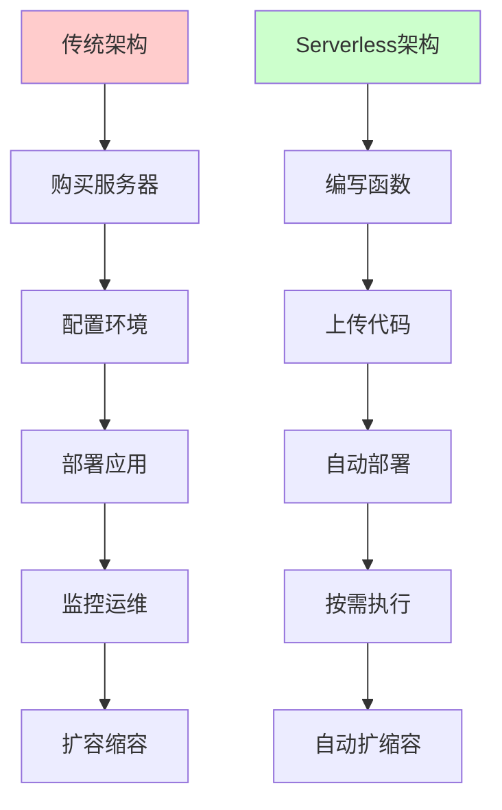
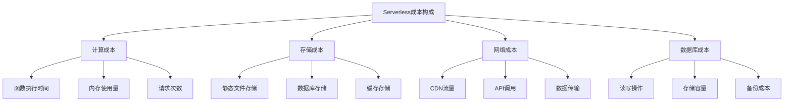
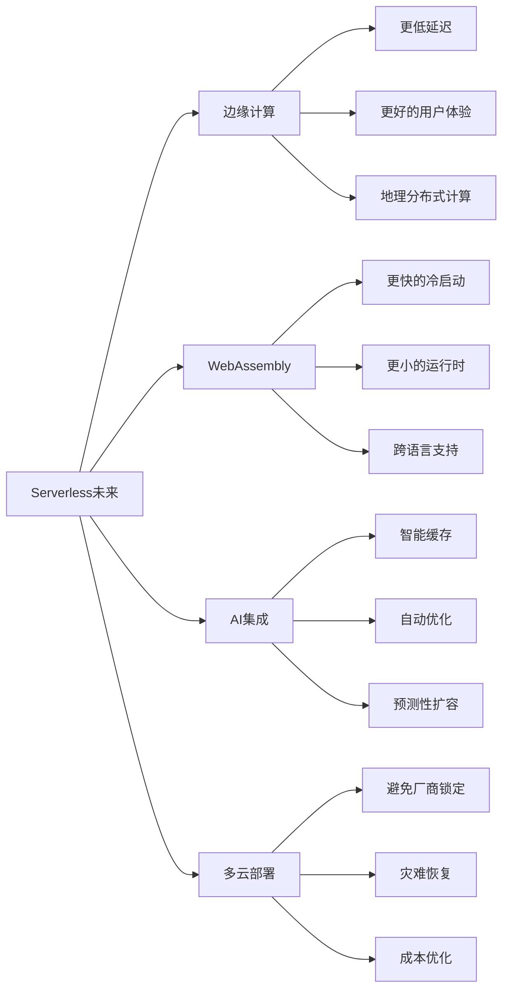

# Serverless前端：告别服务器运维的新时代

> 还在为服务器配置、扩容、监控而焦头烂额？还在半夜被服务器宕机的告警吵醒？Serverless时代已经到来，让我们彻底告别传统的服务器运维，拥抱更专注于业务逻辑的开发模式！

## 前言：从刀耕火种到云原生

回想一下你的开发经历，是不是经历过这样的痛苦：

- 🔧 **环境配置地狱**：本地能跑，测试环境挂，生产环境又是另一套问题
- 📈 **扩容焦虑症**：流量突增时手忙脚乱地加机器，流量下降后又要手动缩容
- 🌙 **半夜运维噩梦**：凌晨3点被监控告警吵醒，爬起来重启服务器
- 💰 **成本控制困难**：为了应对峰值流量，平时大量资源闲置
- 🐛 **运维复杂度**：除了写代码，还要懂Linux、Docker、Kubernetes...

而Serverless的出现，就像是给前端开发者插上了翅膀，让我们可以专注于最重要的事情——创造价值。

## 一、Serverless核心概念：重新定义前端架构

### 1.1 什么是Serverless？

Serverless并不是"没有服务器"，而是"无需关心服务器"。它是一种云计算执行模型，具有以下特征：



### 1.2 Serverless的核心优势

```javascript
// 传统服务器模式
class TraditionalServer {
  constructor() {
    this.server = new ExpressServer()
    this.database = new DatabaseConnection()
    this.cache = new RedisConnection()
    
    // 需要处理的运维问题
    this.concerns = [
      '服务器配置',
      '负载均衡',
      '自动扩容',
      '健康检查',
      '日志收集',
      '安全更新',
      '备份策略',
      '监控告警'
    ]
  }
  
  async handleRequest(request) {
    // 业务逻辑只占很小一部分
    try {
      const result = await this.processBusinessLogic(request)
      return result
    } catch (error) {
      // 还要处理各种基础设施相关的错误
      this.handleInfrastructureError(error)
    }
  }
  
  // 大量的运维代码...
  setupLoadBalancer() { /* ... */ }
  configureAutoScaling() { /* ... */ }
  setupMonitoring() { /* ... */ }
}

// Serverless模式
class ServerlessFunction {
  constructor() {
    // 只关注业务逻辑
    this.concerns = [
      '业务逻辑实现',
      '数据处理',
      '用户体验'
    ]
  }
  
  async handler(event, context) {
    // 100%专注于业务价值
    const result = await this.processBusinessLogic(event)
    return {
      statusCode: 200,
      body: JSON.stringify(result)
    }
  }
  
  async processBusinessLogic(event) {
    // 纯粹的业务逻辑
    return await this.calculateUserRecommendations(event.userId)
  }
}
```

### 1.3 Serverless生态全景

```mermaid
graph TB
    A[Serverless生态] --> B[计算服务]
    A --> C[存储服务]
    A --> D[数据库服务]
    A --> E[API网关]
    A --> F[CDN服务]
    A --> G[监控日志]
    
    B --> B1[AWS Lambda]
    B --> B2[Vercel Functions]
    B --> B3[Netlify Functions]
    B --> B4[Cloudflare Workers]
    
    C --> C1[AWS S3]
    C --> C2[Vercel Blob]
    C --> C3[Cloudflare R2]
    
    D --> D1[AWS DynamoDB]
    D --> D2[PlanetScale]
    D --> D3[Supabase]
    D --> D4[FaunaDB]
    
    E --> E1[AWS API Gateway]
    E --> E2[Vercel Edge]
    E --> E3[Cloudflare Workers]
    
    F --> F1[AWS CloudFront]
    F --> F2[Vercel Edge Network]
    F --> F3[Cloudflare CDN]
    
    G --> G1[AWS CloudWatch]
    G --> G2[Vercel Analytics]
    G --> G3[Datadog]
```



## 二、Jamstack架构：现代前端的最佳实践

### 2.1 Jamstack核心理念

Jamstack（JavaScript, APIs, Markup）是一种基于预构建标记和无服务器函数的现代Web开发架构。

```javascript
// 传统SSR架构
class TraditionalSSR {
  async renderPage(request) {
    // 每次请求都要:
    // 1. 连接数据库
    // 2. 查询数据
    // 3. 渲染HTML
    // 4. 返回响应
    
    const data = await this.database.query(request.params)
    const html = await this.templateEngine.render('page.html', data)
    return html
  }
  
  // 问题:
  // - 每次请求都有延迟
  // - 数据库压力大
  // - 服务器负载高
  // - 扩容复杂
}

// Jamstack架构
class JamstackApp {
  constructor() {
    // 构建时预生成所有页面
    this.prebuiltPages = this.generateStaticPages()
    
    // 动态内容通过API获取
    this.apiEndpoints = {
      user: '/api/user',
      posts: '/api/posts',
      comments: '/api/comments'
    }
  }
  
  async buildTime() {
    // 构建时生成静态页面
    const posts = await this.fetchAllPosts()
    const pages = posts.map(post => this.generatePostPage(post))
    
    // 部署到CDN
    await this.deployToCDN(pages)
  }
  
  async runtime() {
    // 运行时只处理动态交互
    const dynamicData = await fetch('/api/latest-comments')
    this.updatePageContent(dynamicData)
  }
  
  // 优势:
  // - 页面加载极快（CDN直接返回）
  // - 安全性高（没有服务器攻击面）
  // - 扩展性强（CDN自动扩容）
  // - 成本低（静态托管便宜）
}
```

### 2.2 Next.js + Vercel实战

#### 项目初始化

```bash
# 创建Next.js项目
npx create-next-app@latest my-jamstack-app --typescript --tailwind --eslint
cd my-jamstack-app

# 安装必要依赖
npm install @vercel/analytics @vercel/speed-insights
npm install prisma @prisma/client
npm install next-auth
```

#### 静态生成配置

```javascript
// next.config.js
/** @type {import('next').NextConfig} */
const nextConfig = {
  // 启用静态导出
  output: 'export',
  
  // 图片优化配置
  images: {
    unoptimized: true, // 静态导出时需要
    domains: ['example.com', 'cdn.example.com']
  },
  
  // 实验性功能
  experimental: {
    appDir: true, // 启用App Router
    serverComponentsExternalPackages: ['prisma']
  },
  
  // 重写规则
  async rewrites() {
    return [
      {
        source: '/api/:path*',
        destination: '/api/:path*'
      }
    ]
  },
  
  // 重定向规则
  async redirects() {
    return [
      {
        source: '/old-blog/:slug',
        destination: '/blog/:slug',
        permanent: true
      }
    ]
  }
}

module.exports = nextConfig
```

#### 静态页面生成

```typescript
// app/blog/[slug]/page.tsx
import { Metadata } from 'next'
import { notFound } from 'next/navigation'
import { getBlogPost, getAllBlogSlugs } from '@/lib/blog'
import BlogContent from '@/components/BlogContent'
import ShareButtons from '@/components/ShareButtons'
import RelatedPosts from '@/components/RelatedPosts'

interface BlogPostPageProps {
  params: {
    slug: string
  }
}

// 生成静态参数
export async function generateStaticParams() {
  const slugs = await getAllBlogSlugs()
  
  return slugs.map((slug) => ({
    slug: slug
  }))
}

// 生成元数据
export async function generateMetadata(
  { params }: BlogPostPageProps
): Promise<Metadata> {
  const post = await getBlogPost(params.slug)
  
  if (!post) {
    return {
      title: '文章未找到'
    }
  }
  
  return {
    title: post.title,
    description: post.excerpt,
    keywords: post.tags.join(', '),
    authors: [{ name: post.author.name }],
    openGraph: {
      title: post.title,
      description: post.excerpt,
      type: 'article',
      publishedTime: post.publishedAt,
      authors: [post.author.name],
      images: [
        {
          url: post.coverImage,
          width: 1200,
          height: 630,
          alt: post.title
        }
      ]
    },
    twitter: {
      card: 'summary_large_image',
      title: post.title,
      description: post.excerpt,
      images: [post.coverImage]
    }
  }
}

export default async function BlogPostPage({ params }: BlogPostPageProps) {
  const post = await getBlogPost(params.slug)
  
  if (!post) {
    notFound()
  }
  
  // 获取相关文章
  const relatedPosts = await getRelatedPosts(post.id, post.tags)
  
  return (
    <article className="max-w-4xl mx-auto px-4 py-8">
      {/* 文章头部 */}
      <header className="mb-8">
        <h1 className="text-4xl font-bold mb-4 text-gray-900 dark:text-white">
          {post.title}
        </h1>
        
        <div className="flex items-center justify-between mb-6">
          <div className="flex items-center space-x-4">
            
            <div>
              <p className="font-medium text-gray-900 dark:text-white">
                {post.author.name}
              </p>
              <p className="text-sm text-gray-500 dark:text-gray-400">
                {new Date(post.publishedAt).toLocaleDateString('zh-CN')}
              </p>
            </div>
          </div>
          
          <div className="flex items-center space-x-2">
            <span className="text-sm text-gray-500 dark:text-gray-400">
              阅读时间: {post.readingTime}分钟
            </span>
          </div>
        </div>
        
        {/* 标签 */}
        <div className="flex flex-wrap gap-2 mb-6">
          {post.tags.map((tag) => (
            <span
              key={tag}
              className="px-3 py-1 bg-blue-100 dark:bg-blue-900 text-blue-800 dark:text-blue-200 text-sm rounded-full"
            >
              {tag}
            </span>
          ))}
        </div>
        
        {/* 封面图 */}
        {post.coverImage && (
          
        )}
      </header>
      
      {/* 文章内容 */}
      <BlogContent content={post.content} />
      
      {/* 分享按钮 */}
      <ShareButtons
        url={`https://example.com/blog/${params.slug}`}
        title={post.title}
        description={post.excerpt}
      />
      
      {/* 相关文章 */}
      <RelatedPosts posts={relatedPosts} />
    </article>
  )
}
```

#### API路由实现

```typescript
// app/api/posts/route.ts
import { NextRequest, NextResponse } from 'next/server'
import { prisma } from '@/lib/prisma'
import { z } from 'zod'

// 请求验证schema
const GetPostsSchema = z.object({
  page: z.string().optional().default('1'),
  limit: z.string().optional().default('10'),
  category: z.string().optional(),
  tag: z.string().optional(),
  search: z.string().optional()
})

export async function GET(request: NextRequest) {
  try {
    const { searchParams } = new URL(request.url)
    const params = GetPostsSchema.parse({
      page: searchParams.get('page') || '1',
      limit: searchParams.get('limit') || '10',
      category: searchParams.get('category') || undefined,
      tag: searchParams.get('tag') || undefined,
      search: searchParams.get('search') || undefined
    })
    
    const page = parseInt(params.page)
    const limit = parseInt(params.limit)
    const offset = (page - 1) * limit
    
    // 构建查询条件
    const where: any = {
      published: true
    }
    
    if (params.category) {
      where.category = {
        slug: params.category
      }
    }
    
    if (params.tag) {
      where.tags = {
        some: {
          name: params.tag
        }
      }
    }
    
    if (params.search) {
      where.OR = [
        {
          title: {
            contains: params.search,
            mode: 'insensitive'
          }
        },
        {
          content: {
            contains: params.search,
            mode: 'insensitive'
          }
        }
      ]
    }
    
    // 查询文章
    const [posts, total] = await Promise.all([
      prisma.post.findMany({
        where,
        include: {
          author: {
            select: {
              id: true,
              name: true,
              avatar: true
            }
          },
          category: {
            select: {
              id: true,
              name: true,
              slug: true
            }
          },
          tags: {
            select: {
              id: true,
              name: true
            }
          },
          _count: {
            select: {
              comments: true,
              likes: true
            }
          }
        },
        orderBy: {
          publishedAt: 'desc'
        },
        skip: offset,
        take: limit
      }),
      prisma.post.count({ where })
    ])
    
    // 计算分页信息
    const totalPages = Math.ceil(total / limit)
    const hasNext = page < totalPages
    const hasPrev = page > 1
    
    return NextResponse.json({
      posts: posts.map(post => ({
        id: post.id,
        title: post.title,
        slug: post.slug,
        excerpt: post.excerpt,
        coverImage: post.coverImage,
        publishedAt: post.publishedAt,
        readingTime: post.readingTime,
        author: post.author,
        category: post.category,
        tags: post.tags.map(tag => tag.name),
        stats: {
          comments: post._count.comments,
          likes: post._count.likes
        }
      })),
      pagination: {
        page,
        limit,
        total,
        totalPages,
        hasNext,
        hasPrev
      }
    })
    
  } catch (error) {
    console.error('获取文章列表失败:', error)
    
    if (error instanceof z.ZodError) {
      return NextResponse.json(
        { error: '请求参数无效', details: error.errors },
        { status: 400 }
      )
    }
    
    return NextResponse.json(
      { error: '服务器内部错误' },
      { status: 500 }
    )
  }
}

export async function POST(request: NextRequest) {
  try {
    // 验证用户权限
    const session = await getServerSession(authOptions)
    if (!session || session.user.role !== 'ADMIN') {
      return NextResponse.json(
        { error: '权限不足' },
        { status: 403 }
      )
    }
    
    const body = await request.json()
    
    // 验证请求数据
    const CreatePostSchema = z.object({
      title: z.string().min(1).max(200),
      content: z.string().min(1),
      excerpt: z.string().max(500).optional(),
      coverImage: z.string().url().optional(),
      categoryId: z.string(),
      tags: z.array(z.string()).optional(),
      published: z.boolean().default(false)
    })
    
    const data = CreatePostSchema.parse(body)
    
    // 生成slug
    const slug = generateSlug(data.title)
    
    // 检查slug是否已存在
    const existingPost = await prisma.post.findUnique({
      where: { slug }
    })
    
    if (existingPost) {
      return NextResponse.json(
        { error: '文章标题已存在，请修改标题' },
        { status: 409 }
      )
    }
    
    // 创建文章
    const post = await prisma.post.create({
      data: {
        title: data.title,
        slug,
        content: data.content,
        excerpt: data.excerpt || generateExcerpt(data.content),
        coverImage: data.coverImage,
        readingTime: calculateReadingTime(data.content),
        authorId: session.user.id,
        categoryId: data.categoryId,
        published: data.published,
        publishedAt: data.published ? new Date() : null,
        tags: data.tags ? {
          connectOrCreate: data.tags.map(tag => ({
            where: { name: tag },
            create: { name: tag }
          }))
        } : undefined
      },
      include: {
        author: {
          select: {
            id: true,
            name: true,
            avatar: true
          }
        },
        category: true,
        tags: true
      }
    })
    
    // 如果发布了文章，触发重新构建
    if (data.published) {
      await triggerRevalidation(`/blog/${slug}`)
    }
    
    return NextResponse.json(post, { status: 201 })
    
  } catch (error) {
    console.error('创建文章失败:', error)
    
    if (error instanceof z.ZodError) {
      return NextResponse.json(
        { error: '请求数据无效', details: error.errors },
        { status: 400 }
      )
    }
    
    return NextResponse.json(
      { error: '服务器内部错误' },
      { status: 500 }
    )
  }
}

// 工具函数
function generateSlug(title: string): string {
  return title
    .toLowerCase()
    .replace(/[^a-z0-9\u4e00-\u9fa5]+/g, '-')
    .replace(/^-+|-+$/g, '')
}

function generateExcerpt(content: string, maxLength: number = 200): string {
  const plainText = content.replace(/<[^>]*>/g, '')
  return plainText.length > maxLength
    ? plainText.substring(0, maxLength) + '...'
    : plainText
}

function calculateReadingTime(content: string): number {
  const wordsPerMinute = 200
  const words = content.split(/\s+/).length
  return Math.ceil(words / wordsPerMinute)
}

async function triggerRevalidation(path: string) {
  // 触发Vercel的增量静态重新生成
  try {
    await fetch(`${process.env.VERCEL_URL}/api/revalidate`, {
      method: 'POST',
      headers: {
        'Content-Type': 'application/json',
        'Authorization': `Bearer ${process.env.REVALIDATE_TOKEN}`
      },
      body: JSON.stringify({ path })
    })
  } catch (error) {
    console.error('重新验证失败:', error)
  }
}
```

### 2.3 Vercel部署配置

```json
// vercel.json
{
  "version": 2,
  "builds": [
    {
      "src": "package.json",
      "use": "@vercel/next"
    }
  ],
  "functions": {
    "app/api/**/*.ts": {
      "maxDuration": 30
    }
  },
  "regions": ["hkg1", "sin1"],
  "env": {
    "DATABASE_URL": "@database-url",
    "NEXTAUTH_SECRET": "@nextauth-secret",
    "NEXTAUTH_URL": "@nextauth-url"
  },
  "headers": [
    {
      "source": "/api/(.*)",
      "headers": [
        {
          "key": "Access-Control-Allow-Origin",
          "value": "*"
        },
        {
          "key": "Access-Control-Allow-Methods",
          "value": "GET, POST, PUT, DELETE, OPTIONS"
        },
        {
          "key": "Access-Control-Allow-Headers",
          "value": "Content-Type, Authorization"
        }
      ]
    },
    {
      "source": "/(.*)",
      "headers": [
        {
          "key": "X-Frame-Options",
          "value": "DENY"
        },
        {
          "key": "X-Content-Type-Options",
          "value": "nosniff"
        },
        {
          "key": "Referrer-Policy",
          "value": "strict-origin-when-cross-origin"
        }
      ]
    }
  ],
  "redirects": [
    {
      "source": "/old-blog/:path*",
      "destination": "/blog/:path*",
      "permanent": true
    }
  ],
  "rewrites": [
    {
      "source": "/sitemap.xml",
      "destination": "/api/sitemap"
    },
    {
      "source": "/robots.txt",
      "destination": "/api/robots"
    }
  ]
}
```

## 三、Netlify Functions深度实践

### 3.1 Netlify Functions基础

```javascript
// netlify/functions/hello.js
exports.handler = async (event, context) => {
  // 获取请求信息
  const { httpMethod, path, queryStringParameters, body, headers } = event
  
  // 处理CORS
  const corsHeaders = {
    'Access-Control-Allow-Origin': '*',
    'Access-Control-Allow-Headers': 'Content-Type',
    'Access-Control-Allow-Methods': 'GET, POST, PUT, DELETE'
  }
  
  // 处理预检请求
  if (httpMethod === 'OPTIONS') {
    return {
      statusCode: 200,
      headers: corsHeaders,
      body: ''
    }
  }
  
  try {
    // 业务逻辑
    const result = await processRequest({
      method: httpMethod,
      query: queryStringParameters,
      body: body ? JSON.parse(body) : null,
      headers
    })
    
    return {
      statusCode: 200,
      headers: {
        ...corsHeaders,
        'Content-Type': 'application/json'
      },
      body: JSON.stringify(result)
    }
    
  } catch (error) {
    console.error('Function error:', error)
    
    return {
      statusCode: 500,
      headers: corsHeaders,
      body: JSON.stringify({
        error: 'Internal Server Error',
        message: error.message
      })
    }
  }
}

async function processRequest({ method, query, body, headers }) {
  switch (method) {
    case 'GET':
      return await handleGet(query)
    case 'POST':
      return await handlePost(body)
    case 'PUT':
      return await handlePut(body)
    case 'DELETE':
      return await handleDelete(query)
    default:
      throw new Error(`Unsupported method: ${method}`)
  }
}
```

### 3.2 实战案例：评论系统

```javascript
// netlify/functions/comments.js
const { MongoClient } = require('mongodb')
const validator = require('validator')
const rateLimit = require('lambda-rate-limiter')

// 速率限制配置
const limiter = rateLimit({
  interval: 60 * 1000, // 1分钟
  uniqueTokenPerInterval: 500 // 每分钟最多500个唯一token
})

let cachedDb = null

async function connectToDatabase() {
  if (cachedDb) {
    return cachedDb
  }
  
  const client = await MongoClient.connect(process.env.MONGODB_URI, {
    useNewUrlParser: true,
    useUnifiedTopology: true
  })
  
  const db = client.db('blog')
  cachedDb = db
  return db
}

exports.handler = async (event, context) => {
  const { httpMethod, queryStringParameters, body, headers } = event
  
  // CORS处理
  const corsHeaders = {
    'Access-Control-Allow-Origin': '*',
    'Access-Control-Allow-Headers': 'Content-Type, Authorization',
    'Access-Control-Allow-Methods': 'GET, POST, PUT, DELETE'
  }
  
  if (httpMethod === 'OPTIONS') {
    return { statusCode: 200, headers: corsHeaders, body: '' }
  }
  
  try {
    // 速率限制
    const clientIP = headers['x-forwarded-for'] || headers['x-real-ip'] || 'unknown'
    await limiter.check(10, clientIP) // 每分钟最多10次请求
    
    const db = await connectToDatabase()
    const commentsCollection = db.collection('comments')
    
    switch (httpMethod) {
      case 'GET':
        return await getComments(commentsCollection, queryStringParameters, corsHeaders)
      
      case 'POST':
        return await createComment(commentsCollection, JSON.parse(body), corsHeaders)
      
      case 'PUT':
        return await updateComment(commentsCollection, JSON.parse(body), corsHeaders)
      
      case 'DELETE':
        return await deleteComment(commentsCollection, queryStringParameters, corsHeaders)
      
      default:
        return {
          statusCode: 405,
          headers: corsHeaders,
          body: JSON.stringify({ error: 'Method not allowed' })
        }
    }
    
  } catch (error) {
    console.error('Comments function error:', error)
    
    // 速率限制错误
    if (error.message === 'Rate limit exceeded') {
      return {
        statusCode: 429,
        headers: corsHeaders,
        body: JSON.stringify({ error: '请求过于频繁，请稍后再试' })
      }
    }
    
    return {
      statusCode: 500,
      headers: corsHeaders,
      body: JSON.stringify({ error: '服务器内部错误' })
    }
  }
}

// 获取评论
async function getComments(collection, query, headers) {
  const { postId, page = '1', limit = '10' } = query
  
  if (!postId) {
    return {
      statusCode: 400,
      headers,
      body: JSON.stringify({ error: '缺少postId参数' })
    }
  }
  
  const pageNum = parseInt(page)
  const limitNum = parseInt(limit)
  const skip = (pageNum - 1) * limitNum
  
  // 查询评论
  const comments = await collection
    .find({ postId, approved: true })
    .sort({ createdAt: -1 })
    .skip(skip)
    .limit(limitNum)
    .toArray()
  
  // 获取总数
  const total = await collection.countDocuments({ postId, approved: true })
  
  // 构建评论树结构
  const commentTree = buildCommentTree(comments)
  
  return {
    statusCode: 200,
    headers: { ...headers, 'Content-Type': 'application/json' },
    body: JSON.stringify({
      comments: commentTree,
      pagination: {
        page: pageNum,
        limit: limitNum,
        total,
        totalPages: Math.ceil(total / limitNum)
      }
    })
  }
}

// 创建评论
async function createComment(collection, data, headers) {
  // 验证数据
  const { postId, content, author, email, parentId } = data
  
  if (!postId || !content || !author || !email) {
    return {
      statusCode: 400,
      headers,
      body: JSON.stringify({ error: '缺少必要字段' })
    }
  }
  
  // 验证邮箱格式
  if (!validator.isEmail(email)) {
    return {
      statusCode: 400,
      headers,
      body: JSON.stringify({ error: '邮箱格式无效' })
    }
  }
  
  // 内容长度限制
  if (content.length > 1000) {
    return {
      statusCode: 400,
      headers,
      body: JSON.stringify({ error: '评论内容过长' })
    }
  }
  
  // 内容过滤（简单的敏感词过滤）
  const filteredContent = filterSensitiveWords(content)
  
  // 创建评论对象
  const comment = {
    postId,
    content: filteredContent,
    author: validator.escape(author),
    email: validator.normalizeEmail(email),
    parentId: parentId || null,
    approved: false, // 需要审核
    createdAt: new Date(),
    updatedAt: new Date(),
    ip: headers['x-forwarded-for'] || 'unknown',
    userAgent: headers['user-agent'] || 'unknown'
  }
  
  // 插入数据库
  const result = await collection.insertOne(comment)
  
  // 发送通知邮件给管理员
  await sendNotificationEmail({
    type: 'new_comment',
    comment: { ...comment, _id: result.insertedId }
  })
  
  return {
    statusCode: 201,
    headers: { ...headers, 'Content-Type': 'application/json' },
    body: JSON.stringify({
      message: '评论提交成功，等待审核',
      commentId: result.insertedId
    })
  }
}

// 构建评论树
function buildCommentTree(comments) {
  const commentMap = new Map()
  const rootComments = []
  
  // 创建评论映射
  comments.forEach(comment => {
    comment.replies = []
    commentMap.set(comment._id.toString(), comment)
  })
  
  // 构建树结构
  comments.forEach(comment => {
    if (comment.parentId) {
      const parent = commentMap.get(comment.parentId)
      if (parent) {
        parent.replies.push(comment)
      }
    } else {
      rootComments.push(comment)
    }
  })
  
  return rootComments
}

// 敏感词过滤
function filterSensitiveWords(content) {
  const sensitiveWords = ['敏感词1', '敏感词2'] // 实际项目中应该从配置文件读取
  let filtered = content
  
  sensitiveWords.forEach(word => {
    const regex = new RegExp(word, 'gi')
    filtered = filtered.replace(regex, '*'.repeat(word.length))
  })
  
  return filtered
}

// 发送通知邮件
async function sendNotificationEmail({ type, comment }) {
  // 这里可以集成SendGrid、Mailgun等邮件服务
  console.log(`发送通知邮件: ${type}`, comment)
}
```

### 3.3 环境变量和部署配置

```toml
# netlify.toml
[build]
  command = "npm run build"
  functions = "netlify/functions"
  publish = "dist"

[build.environment]
  NODE_VERSION = "18"
  NPM_VERSION = "8"

# 函数配置
[functions]
  directory = "netlify/functions"
  node_bundler = "esbuild"

# 重定向规则
[[redirects]]
  from = "/api/*"
  to = "/.netlify/functions/:splat"
  status = 200

[[redirects]]
  from = "/*"
  to = "/index.html"
  status = 200

# 头部配置
[[headers]]
  for = "/*"
  [headers.values]
    X-Frame-Options = "DENY"
    X-XSS-Protection = "1; mode=block"
    X-Content-Type-Options = "nosniff"
    Referrer-Policy = "strict-origin-when-cross-origin"

[[headers]]
  for = "/api/*"
  [headers.values]
    Access-Control-Allow-Origin = "*"
    Access-Control-Allow-Methods = "GET, POST, PUT, DELETE, OPTIONS"
    Access-Control-Allow-Headers = "Content-Type, Authorization"

# 环境变量（在Netlify控制台配置）
# MONGODB_URI
# SENDGRID_API_KEY
# JWT_SECRET
```

## 四、Cloudflare Workers：边缘计算的力量

### 4.1 Workers基础概念

Cloudflare Workers运行在Cloudflare的边缘网络上，提供了极低延迟的计算能力。

```javascript
// workers/api.js
// 基础Worker结构
export default {
  async fetch(request, env, ctx) {
    // 获取请求信息
    const url = new URL(request.url)
    const { pathname, searchParams } = url
    const method = request.method
    
    // 路由处理
    const router = new Router()
    
    // 定义路由
    router.get('/api/health', () => handleHealth())
    router.get('/api/posts', (request) => handleGetPosts(request, env))
    router.post('/api/posts', (request) => handleCreatePost(request, env))
    router.get('/api/posts/:id', (request) => handleGetPost(request, env))
    
    // 处理请求
    try {
      const response = await router.handle(request)
      return response
    } catch (error) {
      return new Response(
        JSON.stringify({ error: 'Internal Server Error' }),
        {
          status: 500,
          headers: { 'Content-Type': 'application/json' }
        }
      )
    }
  }
}

// 简单的路由器实现
class Router {
  constructor() {
    this.routes = []
  }
  
  get(path, handler) {
    this.routes.push({ method: 'GET', path, handler })
  }
  
  post(path, handler) {
    this.routes.push({ method: 'POST', path, handler })
  }
  
  async handle(request) {
    const url = new URL(request.url)
    const method = request.method
    
    for (const route of this.routes) {
      if (route.method === method) {
        const match = this.matchPath(route.path, url.pathname)
        if (match) {
          request.params = match.params
          return await route.handler(request)
        }
      }
    }
    
    return new Response('Not Found', { status: 404 })
  }
  
  matchPath(pattern, path) {
    // 简单的路径匹配实现
    const patternParts = pattern.split('/')
    const pathParts = path.split('/')
    
    if (patternParts.length !== pathParts.length) {
      return null
    }
    
    const params = {}
    
    for (let i = 0; i < patternParts.length; i++) {
      const patternPart = patternParts[i]
      const pathPart = pathParts[i]
      
      if (patternPart.startsWith(':')) {
        params[patternPart.slice(1)] = pathPart
      } else if (patternPart !== pathPart) {
        return null
      }
    }
    
    return { params }
  }
}

// 处理函数
async function handleHealth() {
  return new Response(
    JSON.stringify({
      status: 'ok',
      timestamp: new Date().toISOString(),
      region: globalThis.cf?.colo || 'unknown'
    }),
    {
      headers: { 'Content-Type': 'application/json' }
    }
  )
}

async function handleGetPosts(request, env) {
  const url = new URL(request.url)
  const page = parseInt(url.searchParams.get('page') || '1')
  const limit = parseInt(url.searchParams.get('limit') || '10')
  
  // 从KV存储获取数据
  const cacheKey = `posts:page:${page}:limit:${limit}`
  let posts = await env.BLOG_KV.get(cacheKey, 'json')
  
  if (!posts) {
    // 从数据库获取数据
    posts = await fetchPostsFromDatabase(page, limit, env)
    
    // 缓存到KV存储（TTL: 1小时）
    await env.BLOG_KV.put(cacheKey, JSON.stringify(posts), {
      expirationTtl: 3600
    })
  }
  
  return new Response(JSON.stringify(posts), {
    headers: {
      'Content-Type': 'application/json',
      'Cache-Control': 'public, max-age=300' // 5分钟浏览器缓存
    }
  })
}

async function fetchPostsFromDatabase(page, limit, env) {
  // 使用D1数据库
  const offset = (page - 1) * limit
  
  const { results } = await env.DB.prepare(`
    SELECT 
      id, title, slug, excerpt, cover_image, 
      published_at, reading_time, author_name
    FROM posts 
    WHERE published = 1 
    ORDER BY published_at DESC 
    LIMIT ? OFFSET ?
  `).bind(limit, offset).all()
  
  const { results: [{ count }] } = await env.DB.prepare(`
    SELECT COUNT(*) as count FROM posts WHERE published = 1
  `).all()
  
  return {
    posts: results,
    pagination: {
      page,
      limit,
      total: count,
      totalPages: Math.ceil(count / limit)
    }
  }
}
```

### 4.2 实战案例：图片处理服务

```javascript
// workers/image-processor.js
export default {
  async fetch(request, env, ctx) {
    const url = new URL(request.url)
    
    // 解析图片处理参数
    const params = parseImageParams(url.searchParams)
    const imageUrl = url.searchParams.get('url')
    
    if (!imageUrl) {
      return new Response('Missing image URL', { status: 400 })
    }
    
    try {
      // 生成缓存键
      const cacheKey = generateCacheKey(imageUrl, params)
      
      // 检查缓存
      const cache = caches.default
      let response = await cache.match(cacheKey)
      
      if (!response) {
        // 处理图片
        response = await processImage(imageUrl, params)
        
        // 缓存处理后的图片
        if (response.ok) {
          const cacheResponse = response.clone()
          ctx.waitUntil(cache.put(cacheKey, cacheResponse))
        }
      }
      
      return response
      
    } catch (error) {
      console.error('Image processing error:', error)
      return new Response('Image processing failed', { status: 500 })
    }
  }
}

function parseImageParams(searchParams) {
  return {
    width: parseInt(searchParams.get('w') || '0'),
    height: parseInt(searchParams.get('h') || '0'),
    quality: parseInt(searchParams.get('q') || '80'),
    format: searchParams.get('f') || 'auto',
    fit: searchParams.get('fit') || 'cover',
    blur: parseInt(searchParams.get('blur') || '0'),
    brightness: parseFloat(searchParams.get('brightness') || '1'),
    contrast: parseFloat(searchParams.get('contrast') || '1'),
    saturation: parseFloat(searchParams.get('saturation') || '1')
  }
}

function generateCacheKey(imageUrl, params) {
  const paramString = Object.entries(params)
    .filter(([_, value]) => value !== 0 && value !== '0' && value !== 'auto' && value !== 1)
    .map(([key, value]) => `${key}=${value}`)
    .join('&')
  
  return `${imageUrl}?${paramString}`
}

async function processImage(imageUrl, params) {
  // 获取原始图片
  const originalResponse = await fetch(imageUrl)
  
  if (!originalResponse.ok) {
    return new Response('Failed to fetch original image', { status: 404 })
  }
  
  // 检查内容类型
  const contentType = originalResponse.headers.get('Content-Type')
  if (!contentType?.startsWith('image/')) {
    return new Response('Invalid image format', { status: 400 })
  }
  
  // 获取图片数据
  const imageData = await originalResponse.arrayBuffer()
  
  // 使用Cloudflare的图片处理API
  const processedImage = await applyImageTransformations(imageData, params)
  
  // 确定输出格式
  const outputFormat = determineOutputFormat(params.format, contentType)
  
  return new Response(processedImage, {
    headers: {
      'Content-Type': `image/${outputFormat}`,
      'Cache-Control': 'public, max-age=31536000', // 1年缓存
      'Vary': 'Accept'
    }
  })
}

async function applyImageTransformations(imageData, params) {
  // 这里使用Cloudflare的图片处理功能
  // 实际实现会调用Cloudflare Images API或使用WebAssembly图片处理库
  
  const transformations = []
  
  // 尺寸调整
  if (params.width || params.height) {
    transformations.push({
      type: 'resize',
      width: params.width || undefined,
      height: params.height || undefined,
      fit: params.fit
    })
  }
  
  // 质量调整
  if (params.quality !== 80) {
    transformations.push({
      type: 'quality',
      value: params.quality
    })
  }
  
  // 滤镜效果
  if (params.blur > 0) {
    transformations.push({
      type: 'blur',
      value: params.blur
    })
  }
  
  if (params.brightness !== 1) {
    transformations.push({
      type: 'brightness',
      value: params.brightness
    })
  }
  
  if (params.contrast !== 1) {
    transformations.push({
      type: 'contrast',
      value: params.contrast
    })
  }
  
  if (params.saturation !== 1) {
    transformations.push({
      type: 'saturation',
      value: params.saturation
    })
  }
  
  // 应用变换（这里是伪代码，实际需要使用图片处理库）
  return await applyTransformations(imageData, transformations)
}

function determineOutputFormat(requestedFormat, originalContentType) {
  if (requestedFormat === 'auto') {
    // 根据浏览器支持自动选择格式
    // 这里简化处理，实际应该检查Accept头
    return 'webp'
  }
  
  const supportedFormats = ['jpeg', 'png', 'webp', 'avif']
  return supportedFormats.includes(requestedFormat) ? requestedFormat : 'jpeg'
}

// 伪代码：实际的图片变换实现
async function applyTransformations(imageData, transformations) {
  // 这里需要使用WebAssembly图片处理库，如sharp的WASM版本
  // 或者调用Cloudflare的图片处理服务
  return imageData // 简化返回原始数据
}
```

### 4.3 Workers配置和部署

```toml
# wrangler.toml
name = "blog-api"
main = "src/index.js"
compatibility_date = "2023-10-01"

# 环境变量
[vars]
ENVIRONMENT = "production"
API_VERSION = "v1"

# KV存储绑定
[[kv_namespaces]]
binding = "BLOG_KV"
id = "your-kv-namespace-id"
preview_id = "your-preview-kv-namespace-id"

# D1数据库绑定
[[d1_databases]]
binding = "DB"
database_name = "blog-db"
database_id = "your-database-id"

# R2存储绑定
[[r2_buckets]]
binding = "BLOG_BUCKET"
bucket_name = "blog-assets"
preview_bucket_name = "blog-assets-preview"

# 路由配置
[routes]
pattern = "api.yourdomain.com/*"
zone_name = "yourdomain.com"

# 触发器配置
[triggers]
crons = ["0 0 * * *"] # 每天午夜执行

# 构建配置
[build]
command = "npm run build"

# 开发配置
[env.development]
name = "blog-api-dev"
vars = { ENVIRONMENT = "development" }

[env.development.kv_namespaces]
binding = "BLOG_KV"
preview_id = "your-dev-kv-namespace-id"
```

```javascript
// src/scheduled.js - 定时任务
export default {
  async scheduled(event, env, ctx) {
    // 定时清理过期缓存
    ctx.waitUntil(cleanupExpiredCache(env))
    
    // 生成站点地图
    ctx.waitUntil(generateSitemap(env))
    
    // 发送统计报告
    ctx.waitUntil(sendDailyReport(env))
  }
}

async function cleanupExpiredCache(env) {
  try {
    // 获取所有缓存键
    const { keys } = await env.BLOG_KV.list()
    
    // 检查并删除过期的缓存
    for (const key of keys) {
      const metadata = await env.BLOG_KV.getWithMetadata(key.name)
      if (metadata.metadata?.expired) {
        await env.BLOG_KV.delete(key.name)
      }
    }
    
    console.log(`清理了 ${keys.length} 个缓存项`)
  } catch (error) {
    console.error('缓存清理失败:', error)
  }
}

async function generateSitemap(env) {
  try {
    // 从数据库获取所有已发布的文章
    const { results: posts } = await env.DB.prepare(`
      SELECT slug, updated_at FROM posts WHERE published = 1
    `).all()
    
    // 生成XML站点地图
    const sitemap = generateSitemapXML(posts)
    
    // 存储到KV
    await env.BLOG_KV.put('sitemap.xml', sitemap, {
      metadata: { generated: new Date().toISOString() }
    })
    
    console.log('站点地图生成成功')
  } catch (error) {
    console.error('站点地图生成失败:', error)
  }
}

function generateSitemapXML(posts) {
  const urls = posts.map(post => `
    <url>
      <loc>https://yourdomain.com/blog/${post.slug}</loc>
      <lastmod>${post.updated_at}</lastmod>
      <changefreq>weekly</changefreq>
      <priority>0.8</priority>
    </url>
  `).join('')
  
  return `<?xml version="1.0" encoding="UTF-8"?>
<urlset xmlns="http://www.sitemaps.org/schemas/sitemap/0.9">
  <url>
    <loc>https://yourdomain.com</loc>
    <lastmod>${new Date().toISOString()}</lastmod>
    <changefreq>daily</changefreq>
    <priority>1.0</priority>
  </url>
  ${urls}
</urlset>`
}
```

## 五、性能优化与监控

### 5.1 性能优化策略

```javascript
// 性能优化工具类
class PerformanceOptimizer {
  constructor() {
    this.metrics = new Map()
    this.observers = []
    this.setupPerformanceMonitoring()
  }
  
  setupPerformanceMonitoring() {
    // 监控Core Web Vitals
    this.observeWebVitals()
    
    // 监控资源加载
    this.observeResourceTiming()
    
    // 监控长任务
    this.observeLongTasks()
  }
  
  observeWebVitals() {
    // LCP (Largest Contentful Paint)
    new PerformanceObserver((list) => {
      const entries = list.getEntries()
      const lastEntry = entries[entries.length - 1]
      this.recordMetric('LCP', lastEntry.startTime)
    }).observe({ entryTypes: ['largest-contentful-paint'] })
    
    // FID (First Input Delay)
    new PerformanceObserver((list) => {
      list.getEntries().forEach((entry) => {
        this.recordMetric('FID', entry.processingStart - entry.startTime)
      })
    }).observe({ entryTypes: ['first-input'] })
    
    // CLS (Cumulative Layout Shift)
    let clsValue = 0
    new PerformanceObserver((list) => {
      list.getEntries().forEach((entry) => {
        if (!entry.hadRecentInput) {
          clsValue += entry.value
          this.recordMetric('CLS', clsValue)
        }
      })
    }).observe({ entryTypes: ['layout-shift'] })
  }
  
  observeResourceTiming() {
    new PerformanceObserver((list) => {
      list.getEntries().forEach((entry) => {
        // 分析资源加载性能
        const resourceTiming = {
          name: entry.name,
          duration: entry.duration,
          transferSize: entry.transferSize,
          encodedBodySize: entry.encodedBodySize,
          decodedBodySize: entry.decodedBodySize
        }
        
        this.analyzeResourcePerformance(resourceTiming)
      })
    }).observe({ entryTypes: ['resource'] })
  }
  
  observeLongTasks() {
    new PerformanceObserver((list) => {
      list.getEntries().forEach((entry) => {
        // 记录长任务
        this.recordMetric('LongTask', {
          duration: entry.duration,
          startTime: entry.startTime,
          attribution: entry.attribution
        })
      })
    }).observe({ entryTypes: ['longtask'] })
  }
  
  analyzeResourcePerformance(resource) {
    // 分析资源性能问题
    const issues = []
    
    // 检查资源大小
    if (resource.transferSize > 1024 * 1024) { // 1MB
      issues.push({
        type: 'large_resource',
        message: `资源过大: ${(resource.transferSize / 1024 / 1024).toFixed(2)}MB`,
        resource: resource.name
      })
    }
    
    // 检查加载时间
    if (resource.duration > 3000) { // 3秒
      issues.push({
        type: 'slow_loading',
        message: `加载时间过长: ${resource.duration.toFixed(2)}ms`,
        resource: resource.name
      })
    }
    
    // 检查压缩率
    const compressionRatio = resource.encodedBodySize / resource.decodedBodySize
    if (compressionRatio > 0.8) {
      issues.push({
        type: 'poor_compression',
        message: `压缩率较低: ${(compressionRatio * 100).toFixed(1)}%`,
        resource: resource.name
      })
    }
    
    if (issues.length > 0) {
      this.reportPerformanceIssues(issues)
    }
  }
  
  recordMetric(name, value) {
    if (!this.metrics.has(name)) {
      this.metrics.set(name, [])
    }
    
    this.metrics.get(name).push({
      value,
      timestamp: Date.now()
    })
    
    // 发送到分析服务
    this.sendMetricToAnalytics(name, value)
  }
  
  async sendMetricToAnalytics(name, value) {
    // 发送到Vercel Analytics或其他分析服务
    if (typeof window !== 'undefined' && window.va) {
      window.va('track', 'Performance', {
        metric: name,
        value: typeof value === 'object' ? JSON.stringify(value) : value
      })
    }
  }
  
  reportPerformanceIssues(issues) {
    console.warn('性能问题检测:', issues)
    
    // 发送到错误监控服务
    if (typeof window !== 'undefined' && window.Sentry) {
      window.Sentry.captureMessage('Performance Issues Detected', {
        level: 'warning',
        extra: { issues }
      })
    }
  }
}

// 使用示例
const optimizer = new PerformanceOptimizer()
```

### 5.2 Serverless监控最佳实践

```javascript
// 监控中间件
class ServerlessMonitoring {
  constructor(options = {}) {
    this.serviceName = options.serviceName || 'serverless-app'
    this.environment = options.environment || 'production'
    this.enableTracing = options.enableTracing !== false
    this.enableMetrics = options.enableMetrics !== false
    this.enableLogs = options.enableLogs !== false
  }
  
  // 函数执行监控装饰器
  monitor(functionName) {
    return (target, propertyKey, descriptor) => {
      const originalMethod = descriptor.value
      
      descriptor.value = async function(...args) {
        const startTime = Date.now()
        const traceId = generateTraceId()
        
        // 记录开始日志
        this.logFunctionStart(functionName, traceId, args)
        
        try {
          // 执行原函数
          const result = await originalMethod.apply(this, args)
          
          // 记录成功指标
          const duration = Date.now() - startTime
          this.recordSuccess(functionName, duration, traceId)
          
          return result
          
        } catch (error) {
          // 记录错误指标
          const duration = Date.now() - startTime
          this.recordError(functionName, error, duration, traceId)
          
          throw error
        }
      }
      
      return descriptor
    }
  }
  
  logFunctionStart(functionName, traceId, args) {
    if (!this.enableLogs) return
    
    console.log(JSON.stringify({
      level: 'info',
      message: 'Function execution started',
      service: this.serviceName,
      environment: this.environment,
      function: functionName,
      traceId,
      timestamp: new Date().toISOString(),
      args: this.sanitizeArgs(args)
    }))
  }
  
  recordSuccess(functionName, duration, traceId) {
    // 记录成功指标
    if (this.enableMetrics) {
      this.sendMetric('function.duration', duration, {
        function: functionName,
        status: 'success'
      })
      
      this.sendMetric('function.invocation', 1, {
        function: functionName,
        status: 'success'
      })
    }
    
    // 记录成功日志
    if (this.enableLogs) {
      console.log(JSON.stringify({
        level: 'info',
        message: 'Function execution completed',
        service: this.serviceName,
        environment: this.environment,
        function: functionName,
        traceId,
        duration,
        status: 'success',
        timestamp: new Date().toISOString()
      }))
    }
  }
  
  recordError(functionName, error, duration, traceId) {
    // 记录错误指标
    if (this.enableMetrics) {
      this.sendMetric('function.duration', duration, {
        function: functionName,
        status: 'error'
      })
      
      this.sendMetric('function.invocation', 1, {
        function: functionName,
        status: 'error'
      })
      
      this.sendMetric('function.error', 1, {
        function: functionName,
        errorType: error.constructor.name
      })
    }
    
    // 记录错误日志
    if (this.enableLogs) {
      console.error(JSON.stringify({
        level: 'error',
        message: 'Function execution failed',
        service: this.serviceName,
        environment: this.environment,
        function: functionName,
        traceId,
        duration,
        status: 'error',
        error: {
          name: error.name,
          message: error.message,
          stack: error.stack
        },
        timestamp: new Date().toISOString()
      }))
    }
  }
  
  sendMetric(name, value, tags = {}) {
    // 发送到监控服务（如DataDog、CloudWatch等）
    const metric = {
      name,
      value,
      tags: {
        service: this.serviceName,
        environment: this.environment,
        ...tags
      },
      timestamp: Date.now()
    }
    
    // 这里可以集成具体的监控服务
    this.sendToMonitoringService(metric)
  }
  
  async sendToMonitoringService(metric) {
    // 示例：发送到DataDog
    try {
      await fetch('https://api.datadoghq.com/api/v1/series', {
        method: 'POST',
        headers: {
          'Content-Type': 'application/json',
          'DD-API-KEY': process.env.DATADOG_API_KEY
        },
        body: JSON.stringify({
          series: [{
            metric: metric.name,
            points: [[metric.timestamp / 1000, metric.value]],
            tags: Object.entries(metric.tags).map(([k, v]) => `${k}:${v}`)
          }]
        })
      })
    } catch (error) {
      console.error('Failed to send metric:', error)
    }
  }
  
  sanitizeArgs(args) {
    // 清理敏感信息
    return args.map(arg => {
      if (typeof arg === 'object' && arg !== null) {
        const sanitized = { ...arg }
        
        // 移除敏感字段
        const sensitiveFields = ['password', 'token', 'secret', 'key', 'authorization']
        sensitiveFields.forEach(field => {
          if (sanitized[field]) {
            sanitized[field] = '[REDACTED]'
          }
        })
        
        return sanitized
      }
      return arg
    })
  }
}

function generateTraceId() {
  return Math.random().toString(36).substring(2, 15) + 
         Math.random().toString(36).substring(2, 15)
}

// 使用示例
const monitoring = new ServerlessMonitoring({
  serviceName: 'blog-api',
  environment: process.env.NODE_ENV || 'development'
})

class BlogService {
  @monitoring.monitor('getUserPosts')
  async getUserPosts(userId) {
    // 业务逻辑
    const posts = await this.database.findPostsByUser(userId)
    return posts
  }
  
  @monitoring.monitor('createPost')
  async createPost(postData) {
    // 业务逻辑
    const post = await this.database.createPost(postData)
    return post
  }
}
```

## 六、成本优化策略

### 6.1 Serverless成本分析



### 6.2 成本优化实践

```javascript
// 成本优化工具类
class CostOptimizer {
  constructor() {
    this.cache = new Map()
    this.requestCounts = new Map()
    this.setupCostMonitoring()
  }
  
  // 智能缓存策略
  async smartCache(key, fetchFunction, options = {}) {
    const {
      ttl = 3600, // 默认1小时
      staleWhileRevalidate = 300, // 5分钟内允许返回过期数据
      maxAge = 86400, // 最大缓存24小时
      tags = []
    } = options
    
    const cacheEntry = this.cache.get(key)
    const now = Date.now()
    
    // 缓存命中且未过期
    if (cacheEntry && (now - cacheEntry.timestamp) < ttl * 1000) {
      this.recordCacheHit(key)
      return cacheEntry.data
    }
    
    // 缓存过期但在stale-while-revalidate时间内
    if (cacheEntry && (now - cacheEntry.timestamp) < (ttl + staleWhileRevalidate) * 1000) {
      // 异步更新缓存
      this.updateCacheAsync(key, fetchFunction, { ttl, maxAge, tags })
      this.recordCacheHit(key, true) // 标记为stale hit
      return cacheEntry.data
    }
    
    // 缓存未命中或完全过期
    this.recordCacheMiss(key)
    const data = await fetchFunction()
    
    this.cache.set(key, {
      data,
      timestamp: now,
      ttl,
      tags
    })
    
    return data
  }
  
  async updateCacheAsync(key, fetchFunction, options) {
    try {
      const data = await fetchFunction()
      this.cache.set(key, {
        data,
        timestamp: Date.now(),
        ttl: options.ttl,
        tags: options.tags
      })
    } catch (error) {
      console.error('异步缓存更新失败:', error)
    }
  }
  
  // 请求合并
  async batchRequests(requests, batchSize = 10) {
    const results = []
    
    for (let i = 0; i < requests.length; i += batchSize) {
      const batch = requests.slice(i, i + batchSize)
      const batchResults = await Promise.all(
        batch.map(request => this.executeRequest(request))
      )
      results.push(...batchResults)
    }
    
    return results
  }
  
  // 冷启动优化
  optimizeColdStart() {
    // 预热关键依赖
    this.preloadDependencies()
    
    // 连接池复用
    this.setupConnectionPooling()
    
    // 减少包大小
    this.optimizeBundleSize()
  }
  
  preloadDependencies() {
    // 预加载常用模块
    const criticalModules = [
      'crypto',
      'util',
      'querystring'
    ]
    
    criticalModules.forEach(module => {
      try {
        require(module)
      } catch (error) {
        console.warn(`预加载模块失败: ${module}`, error)
      }
    })
  }
  
  setupConnectionPooling() {
    // 数据库连接池
    if (!global.dbPool) {
      global.dbPool = new DatabasePool({
        max: 10,
        min: 2,
        idleTimeoutMillis: 30000
      })
    }
    
    return global.dbPool
  }
  
  // 成本监控
  setupCostMonitoring() {
    setInterval(() => {
      this.analyzeCosts()
    }, 60000) // 每分钟分析一次
  }
  
  analyzeCosts() {
    const analysis = {
      cacheHitRate: this.calculateCacheHitRate(),
      requestFrequency: this.analyzeRequestFrequency(),
      resourceUsage: this.analyzeResourceUsage(),
      recommendations: []
    }
    
    // 生成优化建议
    if (analysis.cacheHitRate < 0.8) {
      analysis.recommendations.push({
        type: 'cache_optimization',
        message: '缓存命中率较低，建议优化缓存策略',
        impact: 'high'
      })
    }
    
    if (analysis.requestFrequency.peak > analysis.requestFrequency.average * 3) {
      analysis.recommendations.push({
        type: 'load_balancing',
        message: '请求峰值较高，建议实施负载均衡',
        impact: 'medium'
      })
    }
    
    this.sendCostAnalysis(analysis)
  }
  
  calculateCacheHitRate() {
    const hits = Array.from(this.requestCounts.values())
      .reduce((sum, count) => sum + count.hits, 0)
    const total = Array.from(this.requestCounts.values())
      .reduce((sum, count) => sum + count.total, 0)
    
    return total > 0 ? hits / total : 0
  }
  
  recordCacheHit(key, isStale = false) {
    if (!this.requestCounts.has(key)) {
      this.requestCounts.set(key, { hits: 0, misses: 0, total: 0 })
    }
    
    const count = this.requestCounts.get(key)
    count.hits++
    count.total++
    
    if (isStale) {
      count.staleHits = (count.staleHits || 0) + 1
    }
  }
  
  recordCacheMiss(key) {
    if (!this.requestCounts.has(key)) {
      this.requestCounts.set(key, { hits: 0, misses: 0, total: 0 })
    }
    
    const count = this.requestCounts.get(key)
    count.misses++
    count.total++
  }
}

// 使用示例
const costOptimizer = new CostOptimizer()

// 优化的API处理函数
export async function optimizedHandler(event, context) {
  // 冷启动优化
  costOptimizer.optimizeColdStart()
  
  const cacheKey = `posts:${event.queryStringParameters?.page || 1}`
  
  // 智能缓存
  const posts = await costOptimizer.smartCache(
    cacheKey,
    () => fetchPostsFromDatabase(event.queryStringParameters),
    {
      ttl: 300, // 5分钟缓存
      staleWhileRevalidate: 60, // 1分钟内允许返回过期数据
      tags: ['posts', 'public']
    }
  )
  
  return {
    statusCode: 200,
    headers: {
      'Content-Type': 'application/json',
      'Cache-Control': 'public, max-age=300, stale-while-revalidate=60'
    },
    body: JSON.stringify(posts)
  }
}
```

## 七、未来展望：Serverless的发展趋势

### 7.1 技术发展方向



### 7.2 新兴技术集成

```javascript
// WebAssembly + Serverless示例
class WasmServerlessFunction {
  constructor() {
    this.wasmModule = null
    this.initializeWasm()
  }
  
  async initializeWasm() {
    // 加载WebAssembly模块
    const wasmBytes = await fetch('/path/to/module.wasm')
      .then(response => response.arrayBuffer())
    
    this.wasmModule = await WebAssembly.instantiate(wasmBytes, {
      env: {
        // 提供JavaScript函数给WASM调用
        log: (ptr, len) => {
          const memory = new Uint8Array(this.wasmModule.instance.exports.memory.buffer)
          const message = new TextDecoder().decode(memory.slice(ptr, ptr + len))
          console.log(message)
        }
      }
    })
  }
  
  async processImageWithWasm(imageData) {
    if (!this.wasmModule) {
      await this.initializeWasm()
    }
    
    // 调用WASM函数处理图片
    const result = this.wasmModule.instance.exports.processImage(
      imageData.ptr,
      imageData.length
    )
    
    return result
  }
}

// AI增强的Serverless函数
class AIEnhancedFunction {
  constructor() {
    this.model = null
    this.loadModel()
  }
  
  async loadModel() {
    // 加载TensorFlow.js模型
    this.model = await tf.loadLayersModel('/path/to/model.json')
  }
  
  async intelligentCaching(request) {
    // 使用AI预测缓存需求
    const features = this.extractFeatures(request)
    const prediction = await this.model.predict(features)
    
    // 根据预测结果调整缓存策略
    const cacheStrategy = this.determineCacheStrategy(prediction)
    
    return cacheStrategy
  }
  
  extractFeatures(request) {
    // 提取请求特征
    return tf.tensor2d([[
      request.timestamp % 86400, // 一天中的时间
      request.userAgent.includes('Mobile') ? 1 : 0, // 是否移动设备
      request.headers['accept-language']?.includes('zh') ? 1 : 0, // 语言偏好
      request.queryParams?.page || 1 // 页码
    ]])
  }
  
  determineCacheStrategy(prediction) {
    const confidence = prediction.dataSync()[0]
    
    if (confidence > 0.8) {
      return { ttl: 3600, priority: 'high' } // 高置信度，长缓存
    } else if (confidence > 0.5) {
      return { ttl: 1800, priority: 'medium' } // 中等置信度，中等缓存
    } else {
      return { ttl: 300, priority: 'low' } // 低置信度，短缓存
    }
  }
}
```

## 总结

Serverless前端开发代表了Web开发的未来方向，它让我们能够：

🚀 **专注业务价值**：告别繁琐的服务器运维，将精力投入到用户体验和业务逻辑上

⚡ **极致性能体验**：通过边缘计算和智能缓存，为用户提供毫秒级的响应速度

💰 **成本效益最大化**：按需付费模式，避免资源浪费，实现真正的成本优化

🔧 **开发效率提升**：简化的部署流程和自动化运维，让开发团队更加敏捷

🌍 **全球化部署**：借助CDN和边缘网络，轻松实现全球用户的就近访问

Serverless不仅仅是一种技术架构，更是一种思维方式的转变。它让我们从"如何管理服务器"转向"如何创造价值"，从"担心扩容问题"转向"专注用户需求"。

在这个云原生的时代，掌握Serverless技术栈已经成为前端工程师的必备技能。无论是Jamstack的静态生成，Vercel的边缘函数，还是Cloudflare Workers的边缘计算，都为我们提供了强大的工具来构建下一代Web应用。

未来已来，让我们拥抱Serverless，告别服务器运维的烦恼，专注于创造更好的用户体验！