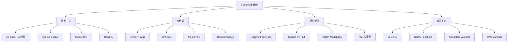
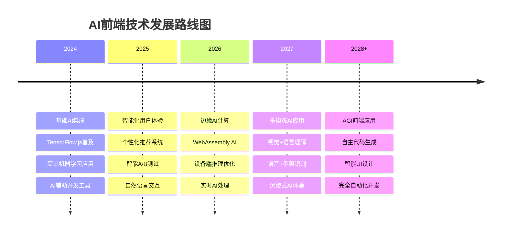

# AI赋能前端：智能化开发的新纪元

> 当人工智能遇上前端开发，会擦出怎样的火花？从GitHub Copilot的代码补全，到TensorFlow.js的机器学习，再到智能化的用户体验优化，AI正在重新定义前端开发的边界。让我们一起探索这个充满无限可能的智能化前端世界！

## 前言：AI时代的前端革命

还记得第一次使用GitHub Copilot时的震撼吗？当你刚输入一个函数名，AI就能准确预测出你想要实现的完整逻辑；当你写注释描述需求时，AI瞬间生成了可运行的代码。这不是科幻电影，这就是正在发生的现实。

AI技术的快速发展正在深刻改变前端开发的方方面面：

- 🤖 **智能代码生成**：从简单的代码补全到复杂的业务逻辑实现
- 🎨 **自动化设计**：AI驱动的UI/UX设计和优化
- 📊 **智能数据分析**：实时用户行为分析和个性化推荐
- 🔍 **智能测试**：自动化测试用例生成和bug检测
- 🚀 **性能优化**：AI驱动的性能监控和自动优化

## 一、AI开发工具：提升编码效率的利器

### 1.1 GitHub Copilot深度应用

```javascript
// AI辅助的React组件开发
// 只需要写注释，Copilot就能生成完整的组件

/**
 * 创建一个可拖拽排序的任务列表组件
 * 支持添加、删除、编辑任务
 * 支持任务状态切换（待办、进行中、已完成）
 * 支持拖拽排序功能
 */
const DraggableTaskList = () => {
  const [tasks, setTasks] = useState([
    { id: 1, title: '学习React', status: 'todo', priority: 'high' },
    { id: 2, title: '完成项目', status: 'in-progress', priority: 'medium' },
    { id: 3, title: '代码审查', status: 'done', priority: 'low' }
  ])
  
  const [draggedTask, setDraggedTask] = useState(null)
  const [newTaskTitle, setNewTaskTitle] = useState('')
  
  // AI生成的拖拽处理逻辑
  const handleDragStart = (e, task) => {
    setDraggedTask(task)
    e.dataTransfer.effectAllowed = 'move'
    e.dataTransfer.setData('text/html', e.target.outerHTML)
    e.dataTransfer.setDragImage(e.target, 20, 20)
  }
  
  const handleDragOver = (e) => {
    e.preventDefault()
    e.dataTransfer.dropEffect = 'move'
  }
  
  const handleDrop = (e, targetTask) => {
    e.preventDefault()
    
    if (!draggedTask || draggedTask.id === targetTask.id) return
    
    const draggedIndex = tasks.findIndex(task => task.id === draggedTask.id)
    const targetIndex = tasks.findIndex(task => task.id === targetTask.id)
    
    const newTasks = [...tasks]
    newTasks.splice(draggedIndex, 1)
    newTasks.splice(targetIndex, 0, draggedTask)
    
    setTasks(newTasks)
    setDraggedTask(null)
  }
  
  // AI生成的任务操作函数
  const addTask = () => {
    if (!newTaskTitle.trim()) return
    
    const newTask = {
      id: Date.now(),
      title: newTaskTitle,
      status: 'todo',
      priority: 'medium',
      createdAt: new Date().toISOString()
    }
    
    setTasks([...tasks, newTask])
    setNewTaskTitle('')
  }
  
  const updateTaskStatus = (taskId, newStatus) => {
    setTasks(tasks.map(task => 
      task.id === taskId ? { ...task, status: newStatus } : task
    ))
  }
  
  const deleteTask = (taskId) => {
    setTasks(tasks.filter(task => task.id !== taskId))
  }
  
  const getStatusColor = (status) => {
    const colors = {
      'todo': 'bg-gray-100 text-gray-800',
      'in-progress': 'bg-blue-100 text-blue-800',
      'done': 'bg-green-100 text-green-800'
    }
    return colors[status] || colors.todo
  }
  
  const getPriorityIcon = (priority) => {
    const icons = {
      'high': '🔴',
      'medium': '🟡',
      'low': '🟢'
    }
    return icons[priority] || icons.medium
  }
  
  return (
    <div className="max-w-4xl mx-auto p-6">
      <h2 className="text-2xl font-bold mb-6">任务管理</h2>
      
      {/* 添加任务 */}
      <div className="mb-6 flex gap-2">
        <input
          type="text"
          value={newTaskTitle}
          onChange={(e) => setNewTaskTitle(e.target.value)}
          placeholder="输入新任务..."
          className="flex-1 px-4 py-2 border border-gray-300 rounded-lg focus:outline-none focus:ring-2 focus:ring-blue-500"
          onKeyPress={(e) => e.key === 'Enter' && addTask()}
        />
        <button
          onClick={addTask}
          className="px-6 py-2 bg-blue-500 text-white rounded-lg hover:bg-blue-600 transition-colors"
        >
          添加任务
        </button>
      </div>
      
      {/* 任务列表 */}
      <div className="space-y-3">
        {tasks.map((task) => (
          <div
            key={task.id}
            draggable
            onDragStart={(e) => handleDragStart(e, task)}
            onDragOver={handleDragOver}
            onDrop={(e) => handleDrop(e, task)}
            className="p-4 bg-white border border-gray-200 rounded-lg shadow-sm hover:shadow-md transition-shadow cursor-move"
          >
            <div className="flex items-center justify-between">
              <div className="flex items-center gap-3">
                <span className="text-lg">{getPriorityIcon(task.priority)}</span>
                <span className="font-medium">{task.title}</span>
                <span className={`px-2 py-1 rounded-full text-xs ${getStatusColor(task.status)}`}>
                  {task.status}
                </span>
              </div>
              
              <div className="flex items-center gap-2">
                <select
                  value={task.status}
                  onChange={(e) => updateTaskStatus(task.id, e.target.value)}
                  className="px-2 py-1 border border-gray-300 rounded text-sm"
                >
                  <option value="todo">待办</option>
                  <option value="in-progress">进行中</option>
                  <option value="done">已完成</option>
                </select>
                
                <button
                  onClick={() => deleteTask(task.id)}
                  className="px-2 py-1 text-red-500 hover:bg-red-50 rounded transition-colors"
                >
                  删除
                </button>
              </div>
            </div>
          </div>
        ))}
      </div>
      
      {tasks.length === 0 && (
        <div className="text-center py-12 text-gray-500">
          <p>暂无任务，点击上方添加新任务</p>
        </div>
      )}
    </div>
  )
}

export default DraggableTaskList
```

### 1.2 AI代码审查和优化

```javascript
// AI辅助的代码质量分析工具
class AICodeAnalyzer {
  constructor() {
    this.rules = {
      performance: [
        'avoid-nested-loops',
        'optimize-dom-queries',
        'minimize-reflows',
        'lazy-loading'
      ],
      security: [
        'xss-prevention',
        'csrf-protection',
        'input-validation',
        'secure-headers'
      ],
      maintainability: [
        'function-complexity',
        'code-duplication',
        'naming-conventions',
        'documentation'
      ]
    }
  }
  
  // 分析代码质量
  async analyzeCode(codeString, filePath) {
    const analysis = {
      file: filePath,
      timestamp: new Date().toISOString(),
      issues: [],
      suggestions: [],
      metrics: {}
    }
    
    // 性能分析
    const performanceIssues = await this.analyzePerformance(codeString)
    analysis.issues.push(...performanceIssues)
    
    // 安全性分析
    const securityIssues = await this.analyzeSecurity(codeString)
    analysis.issues.push(...securityIssues)
    
    // 可维护性分析
    const maintainabilityIssues = await this.analyzeMaintainability(codeString)
    analysis.issues.push(...maintainabilityIssues)
    
    // 生成改进建议
    analysis.suggestions = await this.generateSuggestions(analysis.issues)
    
    // 计算代码指标
    analysis.metrics = await this.calculateMetrics(codeString)
    
    return analysis
  }
  
  async analyzePerformance(code) {
    const issues = []
    
    // 检测嵌套循环
    const nestedLoopPattern = /for\s*\([^}]*{[^}]*for\s*\(/g
    if (nestedLoopPattern.test(code)) {
      issues.push({
        type: 'performance',
        severity: 'warning',
        message: '检测到嵌套循环，可能影响性能',
        suggestion: '考虑使用Map、Set或优化算法复杂度',
        line: this.findLineNumber(code, nestedLoopPattern)
      })
    }
    
    // 检测频繁的DOM查询
    const domQueryPattern = /document\.(getElementById|querySelector|getElementsBy)/g
    const domQueries = code.match(domQueryPattern)
    if (domQueries && domQueries.length > 5) {
      issues.push({
        type: 'performance',
        severity: 'info',
        message: '频繁的DOM查询可能影响性能',
        suggestion: '考虑缓存DOM元素引用或使用虚拟DOM',
        occurrences: domQueries.length
      })
    }
    
    // 检测未优化的事件监听器
    const eventListenerPattern = /addEventListener\s*\(\s*['"](?:scroll|resize|mousemove)['"]\s*,\s*(?!.*throttle|.*debounce)/g
    if (eventListenerPattern.test(code)) {
      issues.push({
        type: 'performance',
        severity: 'warning',
        message: '高频事件监听器未使用节流或防抖',
        suggestion: '对scroll、resize、mousemove等事件使用throttle或debounce',
        line: this.findLineNumber(code, eventListenerPattern)
      })
    }
    
    return issues
  }
  
  async analyzeSecurity(code) {
    const issues = []
    
    // 检测XSS风险
    const xssPattern = /innerHTML\s*=\s*[^;]*\+|\$\{[^}]*\}/g
    if (xssPattern.test(code)) {
      issues.push({
        type: 'security',
        severity: 'high',
        message: '潜在的XSS风险：动态HTML内容',
        suggestion: '使用textContent、createElement或DOMPurify进行安全处理',
        line: this.findLineNumber(code, xssPattern)
      })
    }
    
    // 检测不安全的eval使用
    const evalPattern = /\beval\s*\(/g
    if (evalPattern.test(code)) {
      issues.push({
        type: 'security',
        severity: 'critical',
        message: '使用eval()存在安全风险',
        suggestion: '避免使用eval，考虑使用JSON.parse或Function构造器',
        line: this.findLineNumber(code, evalPattern)
      })
    }
    
    // 检测硬编码的敏感信息
    const secretPattern = /(password|secret|key|token)\s*[:=]\s*['"][^'"]{8,}['"]/gi
    if (secretPattern.test(code)) {
      issues.push({
        type: 'security',
        severity: 'high',
        message: '检测到硬编码的敏感信息',
        suggestion: '将敏感信息移至环境变量或配置文件',
        line: this.findLineNumber(code, secretPattern)
      })
    }
    
    return issues
  }
  
  async analyzeMaintainability(code) {
    const issues = []
    
    // 检测函数复杂度
    const functions = this.extractFunctions(code)
    functions.forEach(func => {
      const complexity = this.calculateCyclomaticComplexity(func.body)
      if (complexity > 10) {
        issues.push({
          type: 'maintainability',
          severity: 'warning',
          message: `函数 ${func.name} 复杂度过高 (${complexity})`,
          suggestion: '考虑拆分函数或简化逻辑',
          line: func.line
        })
      }
    })
    
    // 检测代码重复
    const duplicates = this.findDuplicateCode(code)
    if (duplicates.length > 0) {
      issues.push({
        type: 'maintainability',
        severity: 'info',
        message: `发现 ${duplicates.length} 处重复代码`,
        suggestion: '提取公共函数或使用设计模式减少重复',
        duplicates
      })
    }
    
    // 检测命名规范
    const namingIssues = this.checkNamingConventions(code)
    issues.push(...namingIssues)
    
    return issues
  }
  
  async generateSuggestions(issues) {
    const suggestions = []
    
    // 根据问题类型生成建议
    const issuesByType = issues.reduce((acc, issue) => {
      acc[issue.type] = acc[issue.type] || []
      acc[issue.type].push(issue)
      return acc
    }, {})
    
    if (issuesByType.performance) {
      suggestions.push({
        category: 'performance',
        title: '性能优化建议',
        items: [
          '使用React.memo或useMemo优化组件渲染',
          '实施代码分割和懒加载',
          '优化图片和资源加载',
          '使用Web Workers处理计算密集型任务'
        ]
      })
    }
    
    if (issuesByType.security) {
      suggestions.push({
        category: 'security',
        title: '安全性改进建议',
        items: [
          '实施内容安全策略(CSP)',
          '使用HTTPS和安全头部',
          '定期更新依赖包',
          '实施输入验证和输出编码'
        ]
      })
    }
    
    if (issuesByType.maintainability) {
      suggestions.push({
        category: 'maintainability',
        title: '可维护性提升建议',
        items: [
          '编写单元测试和集成测试',
          '添加TypeScript类型定义',
          '完善代码注释和文档',
          '使用ESLint和Prettier统一代码风格'
        ]
      })
    }
    
    return suggestions
  }
  
  async calculateMetrics(code) {
    return {
      linesOfCode: code.split('\n').length,
      functions: this.extractFunctions(code).length,
      complexity: this.calculateOverallComplexity(code),
      testCoverage: await this.estimateTestCoverage(code),
      maintainabilityIndex: this.calculateMaintainabilityIndex(code)
    }
  }
  
  // 辅助方法
  findLineNumber(code, pattern) {
    const lines = code.split('\n')
    for (let i = 0; i < lines.length; i++) {
      if (pattern.test(lines[i])) {
        return i + 1
      }
    }
    return null
  }
  
  extractFunctions(code) {
    const functionPattern = /(?:function\s+(\w+)|const\s+(\w+)\s*=\s*(?:async\s+)?(?:\([^)]*\)\s*=>|function))\s*\([^)]*\)\s*{([^}]*)}/g
    const functions = []
    let match
    
    while ((match = functionPattern.exec(code)) !== null) {
      functions.push({
        name: match[1] || match[2] || 'anonymous',
        body: match[3] || '',
        line: code.substring(0, match.index).split('\n').length
      })
    }
    
    return functions
  }
  
  calculateCyclomaticComplexity(code) {
    // 简化的圈复杂度计算
    const complexityKeywords = ['if', 'else', 'while', 'for', 'switch', 'case', 'catch', '&&', '||', '?']
    let complexity = 1 // 基础复杂度
    
    complexityKeywords.forEach(keyword => {
      const regex = new RegExp(`\\b${keyword}\\b`, 'g')
      const matches = code.match(regex)
      if (matches) {
        complexity += matches.length
      }
    })
    
    return complexity
  }
  
  findDuplicateCode(code) {
    // 简化的重复代码检测
    const lines = code.split('\n').filter(line => line.trim().length > 10)
    const duplicates = []
    
    for (let i = 0; i < lines.length - 1; i++) {
      for (let j = i + 1; j < lines.length; j++) {
        if (lines[i].trim() === lines[j].trim()) {
          duplicates.push({
            line1: i + 1,
            line2: j + 1,
            content: lines[i].trim()
          })
        }
      }
    }
    
    return duplicates
  }
  
  checkNamingConventions(code) {
    const issues = []
    
    // 检查变量命名（应使用camelCase）
    const variablePattern = /(?:let|const|var)\s+([a-zA-Z_$][a-zA-Z0-9_$]*)/g
    let match
    
    while ((match = variablePattern.exec(code)) !== null) {
      const varName = match[1]
      if (!/^[a-z][a-zA-Z0-9]*$/.test(varName) && !/^[A-Z][A-Z0-9_]*$/.test(varName)) {
        issues.push({
          type: 'maintainability',
          severity: 'info',
          message: `变量名 "${varName}" 不符合命名规范`,
          suggestion: '使用camelCase命名变量，UPPER_CASE命名常量',
          line: this.findLineNumber(code, new RegExp(varName))
        })
      }
    }
    
    return issues
  }
  
  calculateOverallComplexity(code) {
    const functions = this.extractFunctions(code)
    const totalComplexity = functions.reduce((sum, func) => 
      sum + this.calculateCyclomaticComplexity(func.body), 0
    )
    return functions.length > 0 ? totalComplexity / functions.length : 0
  }
  
  async estimateTestCoverage(code) {
    // 简化的测试覆盖率估算
    const testPatterns = [
      /describe\s*\(/g,
      /it\s*\(/g,
      /test\s*\(/g,
      /expect\s*\(/g
    ]
    
    const hasTests = testPatterns.some(pattern => pattern.test(code))
    return hasTests ? 0.8 : 0.1 // 简化估算
  }
  
  calculateMaintainabilityIndex(code) {
    // 简化的可维护性指数计算
    const linesOfCode = code.split('\n').length
    const complexity = this.calculateOverallComplexity(code)
    const commentRatio = this.calculateCommentRatio(code)
    
    // 基于Halstead复杂度的简化公式
    const maintainabilityIndex = Math.max(0, 
      171 - 5.2 * Math.log(linesOfCode) - 0.23 * complexity - 16.2 * Math.log(linesOfCode) + 50 * commentRatio
    )
    
    return Math.round(maintainabilityIndex)
  }
  
  calculateCommentRatio(code) {
    const totalLines = code.split('\n').length
    const commentLines = code.split('\n').filter(line => 
      line.trim().startsWith('//') || line.trim().startsWith('/*') || line.trim().startsWith('*')
    ).length
    
    return totalLines > 0 ? commentLines / totalLines : 0
  }
}

// 使用示例
const analyzer = new AICodeAnalyzer()

// 分析代码文件
async function analyzeProject(filePaths) {
  const results = []
  
  for (const filePath of filePaths) {
    try {
      const code = await fs.readFile(filePath, 'utf-8')
      const analysis = await analyzer.analyzeCode(code, filePath)
      results.push(analysis)
    } catch (error) {
      console.error(`分析文件失败: ${filePath}`, error)
    }
  }
  
  // 生成项目级别的报告
  const projectReport = generateProjectReport(results)
  
  return {
    fileAnalyses: results,
    projectReport
  }
}

function generateProjectReport(analyses) {
  const totalIssues = analyses.reduce((sum, analysis) => sum + analysis.issues.length, 0)
  const issuesByType = analyses.reduce((acc, analysis) => {
    analysis.issues.forEach(issue => {
      acc[issue.type] = (acc[issue.type] || 0) + 1
    })
    return acc
  }, {})
  
  const averageComplexity = analyses.reduce((sum, analysis) => 
    sum + (analysis.metrics.complexity || 0), 0
  ) / analyses.length
  
  return {
    summary: {
      totalFiles: analyses.length,
      totalIssues,
      averageComplexity: Math.round(averageComplexity * 100) / 100,
      issuesByType
    },
    recommendations: generateProjectRecommendations(issuesByType),
    healthScore: calculateProjectHealthScore(analyses)
  }
}

function generateProjectRecommendations(issuesByType) {
  const recommendations = []
  
  if (issuesByType.security > 0) {
    recommendations.push({
      priority: 'high',
      category: 'security',
      message: '项目存在安全风险，建议立即修复',
      actions: [
        '修复所有安全相关问题',
        '实施安全代码审查流程',
        '添加安全测试'
      ]
    })
  }
  
  if (issuesByType.performance > 5) {
    recommendations.push({
      priority: 'medium',
      category: 'performance',
      message: '性能问题较多，建议优化',
      actions: [
        '优化关键路径性能',
        '实施性能监控',
        '添加性能测试'
      ]
    })
  }
  
  if (issuesByType.maintainability > 10) {
    recommendations.push({
      priority: 'low',
      category: 'maintainability',
      message: '代码可维护性需要改进',
      actions: [
        '重构复杂函数',
        '添加代码注释',
        '统一代码风格'
      ]
    })
  }
  
  return recommendations
}

function calculateProjectHealthScore(analyses) {
  let score = 100
  
  analyses.forEach(analysis => {
    analysis.issues.forEach(issue => {
      switch (issue.severity) {
        case 'critical':
          score -= 10
          break
        case 'high':
          score -= 5
          break
        case 'warning':
          score -= 2
          break
        case 'info':
          score -= 1
          break
      }
    })
  })
  
  return Math.max(0, score)
}
```

## 二、TensorFlow.js：浏览器中的机器学习

### 2.1 图像识别应用

```javascript
// 基于TensorFlow.js的图像识别组件
import * as tf from '@tensorflow/tfjs'
import * as mobilenet from '@tensorflow-models/mobilenet'
import * as cocoSsd from '@tensorflow-models/coco-ssd'

class ImageRecognitionApp {
  constructor() {
    this.mobilenetModel = null
    this.objectDetectionModel = null
    this.isLoading = false
    this.initializeModels()
  }
  
  async initializeModels() {
    this.isLoading = true
    
    try {
      // 加载图像分类模型
      console.log('加载MobileNet模型...')
      this.mobilenetModel = await mobilenet.load()
      
      // 加载目标检测模型
      console.log('加载COCO-SSD模型...')
      this.objectDetectionModel = await cocoSsd.load()
      
      console.log('模型加载完成')
    } catch (error) {
      console.error('模型加载失败:', error)
    } finally {
      this.isLoading = false
    }
  }
  
  // 图像分类
  async classifyImage(imageElement) {
    if (!this.mobilenetModel) {
      throw new Error('MobileNet模型未加载')
    }
    
    try {
      const predictions = await this.mobilenetModel.classify(imageElement)
      
      return predictions.map(prediction => ({
        className: prediction.className,
        probability: Math.round(prediction.probability * 100),
        confidence: prediction.probability > 0.5 ? 'high' : 
                   prediction.probability > 0.2 ? 'medium' : 'low'
      }))
    } catch (error) {
      console.error('图像分类失败:', error)
      throw error
    }
  }
  
  // 目标检测
  async detectObjects(imageElement) {
    if (!this.objectDetectionModel) {
      throw new Error('COCO-SSD模型未加载')
    }
    
    try {
      const predictions = await this.objectDetectionModel.detect(imageElement)
      
      return predictions.map(prediction => ({
        class: prediction.class,
        score: Math.round(prediction.score * 100),
        bbox: {
          x: Math.round(prediction.bbox[0]),
          y: Math.round(prediction.bbox[1]),
          width: Math.round(prediction.bbox[2]),
          height: Math.round(prediction.bbox[3])
        }
      }))
    } catch (error) {
      console.error('目标检测失败:', error)
      throw error
    }
  }
  
  // 在画布上绘制检测结果
  drawDetections(canvas, imageElement, detections) {
    const ctx = canvas.getContext('2d')
    
    // 清空画布
    ctx.clearRect(0, 0, canvas.width, canvas.height)
    
    // 绘制原图
    ctx.drawImage(imageElement, 0, 0, canvas.width, canvas.height)
    
    // 绘制检测框
    detections.forEach((detection, index) => {
      const { bbox, class: className, score } = detection
      
      // 计算缩放比例
      const scaleX = canvas.width / imageElement.naturalWidth
      const scaleY = canvas.height / imageElement.naturalHeight
      
      const x = bbox.x * scaleX
      const y = bbox.y * scaleY
      const width = bbox.width * scaleX
      const height = bbox.height * scaleY
      
      // 绘制边框
      ctx.strokeStyle = this.getColorForClass(className)
      ctx.lineWidth = 3
      ctx.strokeRect(x, y, width, height)
      
      // 绘制标签背景
      const label = `${className} (${score}%)`
      ctx.font = '16px Arial'
      const textWidth = ctx.measureText(label).width
      
      ctx.fillStyle = this.getColorForClass(className)
      ctx.fillRect(x, y - 25, textWidth + 10, 25)
      
      // 绘制标签文字
      ctx.fillStyle = 'white'
      ctx.fillText(label, x + 5, y - 5)
    })
  }
  
  getColorForClass(className) {
    // 为不同类别分配颜色
    const colors = {
      'person': '#FF6B6B',
      'car': '#4ECDC4',
      'dog': '#45B7D1',
      'cat': '#96CEB4',
      'bicycle': '#FFEAA7',
      'motorcycle': '#DDA0DD',
      'bus': '#98D8C8',
      'truck': '#F7DC6F'
    }
    
    return colors[className] || '#FF6B6B'
  }
  
  // 批量处理图像
  async batchProcess(imageFiles, options = {}) {
    const {
      enableClassification = true,
      enableObjectDetection = true,
      maxConcurrent = 3
    } = options
    
    const results = []
    
    // 分批处理以避免内存溢出
    for (let i = 0; i < imageFiles.length; i += maxConcurrent) {
      const batch = imageFiles.slice(i, i + maxConcurrent)
      
      const batchPromises = batch.map(async (file, index) => {
        try {
          const imageElement = await this.loadImageFromFile(file)
          const result = {
            file: file.name,
            size: file.size,
            dimensions: {
              width: imageElement.naturalWidth,
              height: imageElement.naturalHeight
            }
          }
          
          if (enableClassification) {
            result.classification = await this.classifyImage(imageElement)
          }
          
          if (enableObjectDetection) {
            result.objects = await this.detectObjects(imageElement)
          }
          
          return result
        } catch (error) {
          return {
            file: file.name,
            error: error.message
          }
        }
      })
      
      const batchResults = await Promise.all(batchPromises)
      results.push(...batchResults)
      
      // 进度回调
      if (options.onProgress) {
        options.onProgress({
          processed: results.length,
          total: imageFiles.length,
          percentage: Math.round((results.length / imageFiles.length) * 100)
        })
      }
    }
    
    return results
  }
  
  // 从文件加载图像
  loadImageFromFile(file) {
    return new Promise((resolve, reject) => {
      const img = new Image()
      img.onload = () => resolve(img)
      img.onerror = reject
      img.src = URL.createObjectURL(file)
    })
  }
  
  // 导出结果为JSON
  exportResults(results, filename = 'image-analysis-results.json') {
    const dataStr = JSON.stringify(results, null, 2)
    const dataBlob = new Blob([dataStr], { type: 'application/json' })
    
    const link = document.createElement('a')
    link.href = URL.createObjectURL(dataBlob)
    link.download = filename
    link.click()
  }
  
  // 生成分析报告
  generateReport(results) {
    const report = {
      summary: {
        totalImages: results.length,
        successfulAnalyses: results.filter(r => !r.error).length,
        failedAnalyses: results.filter(r => r.error).length
      },
      statistics: {
        mostCommonObjects: this.getMostCommonObjects(results),
        averageObjectsPerImage: this.getAverageObjectsPerImage(results),
        classificationAccuracy: this.getClassificationStats(results)
      },
      insights: this.generateInsights(results)
    }
    
    return report
  }
  
  getMostCommonObjects(results) {
    const objectCounts = {}
    
    results.forEach(result => {
      if (result.objects) {
        result.objects.forEach(obj => {
          objectCounts[obj.class] = (objectCounts[obj.class] || 0) + 1
        })
      }
    })
    
    return Object.entries(objectCounts)
      .sort(([,a], [,b]) => b - a)
      .slice(0, 10)
      .map(([className, count]) => ({ className, count }))
  }
  
  getAverageObjectsPerImage(results) {
    const validResults = results.filter(r => r.objects && !r.error)
    if (validResults.length === 0) return 0
    
    const totalObjects = validResults.reduce((sum, result) => 
      sum + result.objects.length, 0
    )
    
    return Math.round((totalObjects / validResults.length) * 100) / 100
  }
  
  getClassificationStats(results) {
    const validResults = results.filter(r => r.classification && !r.error)
    if (validResults.length === 0) return {}
    
    const highConfidenceCount = validResults.filter(result => 
      result.classification.some(c => c.confidence === 'high')
    ).length
    
    return {
      totalClassified: validResults.length,
      highConfidenceRate: Math.round((highConfidenceCount / validResults.length) * 100)
    }
  }
  
  generateInsights(results) {
    const insights = []
    
    const mostCommonObjects = this.getMostCommonObjects(results)
    if (mostCommonObjects.length > 0) {
      insights.push({
        type: 'object_detection',
        message: `最常检测到的对象是 "${mostCommonObjects[0].className}"，出现了 ${mostCommonObjects[0].count} 次`
      })
    }
    
    const avgObjects = this.getAverageObjectsPerImage(results)
    if (avgObjects > 5) {
      insights.push({
        type: 'complexity',
        message: `图像平均包含 ${avgObjects} 个对象，场景相对复杂`
      })
    }
    
    const classificationStats = this.getClassificationStats(results)
    if (classificationStats.highConfidenceRate < 50) {
      insights.push({
        type: 'quality',
        message: `只有 ${classificationStats.highConfidenceRate}% 的图像获得高置信度分类，可能需要更高质量的图像`
      })
    }
    
    return insights
  }
}

// React组件示例
const ImageAnalysisComponent = () => {
  const [analyzer] = useState(() => new ImageRecognitionApp())
  const [selectedFiles, setSelectedFiles] = useState([])
  const [results, setResults] = useState([])
  const [isProcessing, setIsProcessing] = useState(false)
  const [progress, setProgress] = useState(0)
  const [report, setReport] = useState(null)
  
  const handleFileSelect = (event) => {
    const files = Array.from(event.target.files)
    setSelectedFiles(files)
  }
  
  const processImages = async () => {
    if (selectedFiles.length === 0) return
    
    setIsProcessing(true)
    setProgress(0)
    
    try {
      const results = await analyzer.batchProcess(selectedFiles, {
        enableClassification: true,
        enableObjectDetection: true,
        onProgress: (progressInfo) => {
          setProgress(progressInfo.percentage)
        }
      })
      
      setResults(results)
      setReport(analyzer.generateReport(results))
    } catch (error) {
      console.error('处理失败:', error)
    } finally {
      setIsProcessing(false)
    }
  }
  
  const exportResults = () => {
    analyzer.exportResults(results)
  }
  
  return (
    <div className="max-w-6xl mx-auto p-6">
      <h1 className="text-3xl font-bold mb-8">AI图像分析工具</h1>
      
      {/* 文件选择 */}
      <div className="mb-6">
        <input
          type="file"
          multiple
          accept="image/*"
          onChange={handleFileSelect}
          className="mb-4"
        />
        
        {selectedFiles.length > 0 && (
          <div className="mb-4">
            <p className="text-sm text-gray-600">
              已选择 {selectedFiles.length} 个文件
            </p>
            
            <button
              onClick={processImages}
              disabled={isProcessing}
              className="px-6 py-2 bg-blue-500 text-white rounded-lg hover:bg-blue-600 disabled:opacity-50"
            >
              {isProcessing ? '处理中...' : '开始分析'}
            </button>
          </div>
        )}
      </div>
      
      {/* 进度条 */}
      {isProcessing && (
        <div className="mb-6">
          <div className="w-full bg-gray-200 rounded-full h-2.5">
            <div 
              className="bg-blue-600 h-2.5 rounded-full transition-all duration-300"
              style={{ width: `${progress}%` }}
            ></div>
          </div>
          <p className="text-sm text-gray-600 mt-2">处理进度: {progress}%</p>
        </div>
      )}
      
      {/* 分析报告 */}
      {report && (
        <div className="mb-8 p-6 bg-gray-50 rounded-lg">
          <h2 className="text-xl font-semibold mb-4">分析报告</h2>
          
          <div className="grid grid-cols-1 md:grid-cols-3 gap-4 mb-6">
            <div className="text-center">
              <div className="text-2xl font-bold text-blue-600">
                {report.summary.totalImages}
              </div>
              <div className="text-sm text-gray-600">总图像数</div>
            </div>
            
            <div className="text-center">
              <div className="text-2xl font-bold text-green-600">
                {report.summary.successfulAnalyses}
              </div>
              <div className="text-sm text-gray-600">成功分析</div>
            </div>
            
            <div className="text-center">
              <div className="text-2xl font-bold text-orange-600">
                {report.statistics.averageObjectsPerImage}
              </div>
              <div className="text-sm text-gray-600">平均对象数</div>
            </div>
          </div>
          
          {/* 最常见对象 */}
          {report.statistics.mostCommonObjects.length > 0 && (
            <div className="mb-4">
              <h3 className="font-medium mb-2">最常检测到的对象:</h3>
              <div className="flex flex-wrap gap-2">
                {report.statistics.mostCommonObjects.slice(0, 5).map((obj, index) => (
                  <span 
                    key={index}
                    className="px-3 py-1 bg-blue-100 text-blue-800 rounded-full text-sm"
                  >
                    {obj.className} ({obj.count})
                  </span>
                ))}
              </div>
            </div>
          )}
          
          {/* 洞察 */}
          {report.insights.length > 0 && (
            <div>
              <h3 className="font-medium mb-2">分析洞察:</h3>
              <ul className="list-disc list-inside space-y-1">
                {report.insights.map((insight, index) => (
                  <li key={index} className="text-sm text-gray-700">
                    {insight.message}
                  </li>
                ))}
              </ul>
            </div>
          )}
          
          <button
            onClick={exportResults}
            className="mt-4 px-4 py-2 bg-green-500 text-white rounded hover:bg-green-600"
          >
            导出结果
          </button>
        </div>
      )}
      
      {/* 结果展示 */}
      {results.length > 0 && (
        <div className="grid grid-cols-1 md:grid-cols-2 lg:grid-cols-3 gap-6">
          {results.map((result, index) => (
            <div key={index} className="border border-gray-200 rounded-lg p-4">
              <h3 className="font-medium mb-2">{result.file}</h3>
              
              {result.error ? (
                <p className="text-red-500 text-sm">{result.error}</p>
              ) : (
                <div>
                  {/* 分类结果 */}
                  {result.classification && (
                    <div className="mb-3">
                      <h4 className="text-sm font-medium mb-1">分类结果:</h4>
                      {result.classification.slice(0, 3).map((cls, i) => (
                        <div key={i} className="text-xs text-gray-600">
                          {cls.className} ({cls.probability}%)
                        </div>
                      ))}
                    </div>
                  )}
                  
                  {/* 检测对象 */}
                  {result.objects && result.objects.length > 0 && (
                    <div>
                      <h4 className="text-sm font-medium mb-1">检测对象:</h4>
                      <div className="flex flex-wrap gap-1">
                        {result.objects.slice(0, 5).map((obj, i) => (
                          <span 
                            key={i}
                            className="px-2 py-1 bg-gray-100 text-gray-700 rounded text-xs"
                          >
                            {obj.class}
                          </span>
                        ))}
                      </div>
                    </div>
                  )}
                </div>
              )}
            </div>
          ))}
        </div>
      )}
    </div>
  )
}

export default ImageAnalysisComponent

### 2.2 自然语言处理应用

```javascript
// 基于TensorFlow.js的文本分析工具
import * as tf from '@tensorflow/tfjs'
import * as use from '@tensorflow-models/universal-sentence-encoder'

class TextAnalysisEngine {
  constructor() {
    this.sentenceEncoder = null
    this.sentimentModel = null
    this.isInitialized = false
    this.initialize()
  }
  
  async initialize() {
    try {
      console.log('加载通用句子编码器...')
      this.sentenceEncoder = await use.load()
      
      console.log('加载情感分析模型...')
      this.sentimentModel = await this.loadSentimentModel()
      
      this.isInitialized = true
      console.log('文本分析引擎初始化完成')
    } catch (error) {
      console.error('初始化失败:', error)
    }
  }
  
  async loadSentimentModel() {
    // 加载预训练的情感分析模型
    const modelUrl = 'https://storage.googleapis.com/tfjs-models/tfjs/sentiment_cnn_v1/model.json'
    return await tf.loadLayersModel(modelUrl)
  }
  
  // 文本相似度计算
  async calculateSimilarity(text1, text2) {
    if (!this.sentenceEncoder) {
      throw new Error('句子编码器未初始化')
    }
    
    const embeddings = await this.sentenceEncoder.embed([text1, text2])
    const embedding1 = embeddings.slice([0, 0], [1, -1])
    const embedding2 = embeddings.slice([1, 0], [1, -1])
    
    // 计算余弦相似度
    const dotProduct = tf.sum(tf.mul(embedding1, embedding2), 1)
    const norm1 = tf.sqrt(tf.sum(tf.square(embedding1), 1))
    const norm2 = tf.sqrt(tf.sum(tf.square(embedding2), 1))
    const similarity = tf.div(dotProduct, tf.mul(norm1, norm2))
    
    const result = await similarity.data()
    
    // 清理内存
    embeddings.dispose()
    embedding1.dispose()
    embedding2.dispose()
    dotProduct.dispose()
    norm1.dispose()
    norm2.dispose()
    similarity.dispose()
    
    return result[0]
  }
  
  // 情感分析
  async analyzeSentiment(text) {
    if (!this.sentimentModel) {
      throw new Error('情感分析模型未初始化')
    }
    
    // 文本预处理
    const processedText = this.preprocessText(text)
    const sequence = this.textToSequence(processedText)
    const paddedSequence = this.padSequence(sequence, 100)
    
    // 转换为张量
    const inputTensor = tf.tensor2d([paddedSequence], [1, 100])
    
    // 预测
    const prediction = this.sentimentModel.predict(inputTensor)
    const result = await prediction.data()
    
    // 清理内存
    inputTensor.dispose()
    prediction.dispose()
    
    const sentiment = result[0] > 0.5 ? 'positive' : 'negative'
    const confidence = Math.abs(result[0] - 0.5) * 2
    
    return {
      sentiment,
      confidence: Math.round(confidence * 100) / 100,
      score: Math.round(result[0] * 100) / 100
    }
  }
  
  // 文本聚类
  async clusterTexts(texts, numClusters = 3) {
    if (!this.sentenceEncoder) {
      throw new Error('句子编码器未初始化')
    }
    
    // 获取文本嵌入
    const embeddings = await this.sentenceEncoder.embed(texts)
    const embeddingArray = await embeddings.array()
    
    // K-means聚类
    const clusters = this.kMeansClustering(embeddingArray, numClusters)
    
    embeddings.dispose()
    
    return texts.map((text, index) => ({
      text,
      cluster: clusters[index],
      index
    }))
  }
  
  // 关键词提取
  extractKeywords(text, topK = 10) {
    const words = this.preprocessText(text).split(' ')
    const wordFreq = {}
    
    // 计算词频
    words.forEach(word => {
      if (word.length > 2 && !this.isStopWord(word)) {
        wordFreq[word] = (wordFreq[word] || 0) + 1
      }
    })
    
    // 计算TF-IDF（简化版）
    const totalWords = words.length
    const keywords = Object.entries(wordFreq)
      .map(([word, freq]) => ({
        word,
        frequency: freq,
        tfIdf: (freq / totalWords) * Math.log(totalWords / freq)
      }))
      .sort((a, b) => b.tfIdf - a.tfIdf)
      .slice(0, topK)
    
    return keywords
  }
  
  // 文本摘要生成
  async generateSummary(text, maxSentences = 3) {
    const sentences = this.splitIntoSentences(text)
    
    if (sentences.length <= maxSentences) {
      return sentences.join(' ')
    }
    
    // 计算句子重要性分数
    const sentenceScores = await Promise.all(
      sentences.map(async (sentence, index) => {
        let score = 0
        
        // 基于关键词的评分
        const keywords = this.extractKeywords(text, 20)
        const keywordSet = new Set(keywords.map(k => k.word))
        const sentenceWords = this.preprocessText(sentence).split(' ')
        
        sentenceWords.forEach(word => {
          if (keywordSet.has(word)) {
            score += 1
          }
        })
        
        // 位置评分（开头和结尾的句子更重要）
        if (index === 0 || index === sentences.length - 1) {
          score += 2
        }
        
        // 长度评分（中等长度的句子更重要）
        const wordCount = sentenceWords.length
        if (wordCount >= 10 && wordCount <= 30) {
          score += 1
        }
        
        return { sentence, score, index }
      })
    )
    
    // 选择得分最高的句子
    const topSentences = sentenceScores
      .sort((a, b) => b.score - a.score)
      .slice(0, maxSentences)
      .sort((a, b) => a.index - b.index)
      .map(item => item.sentence)
    
    return topSentences.join(' ')
  }
  
  // 智能问答
  async answerQuestion(context, question) {
    if (!this.sentenceEncoder) {
      throw new Error('句子编码器未初始化')
    }
    
    const sentences = this.splitIntoSentences(context)
    
    // 计算问题与每个句子的相似度
    const similarities = await Promise.all(
      sentences.map(sentence => this.calculateSimilarity(question, sentence))
    )
    
    // 找到最相关的句子
    const maxSimilarityIndex = similarities.indexOf(Math.max(...similarities))
    const bestMatch = sentences[maxSimilarityIndex]
    const confidence = similarities[maxSimilarityIndex]
    
    // 如果相似度太低，返回无法回答
    if (confidence < 0.3) {
      return {
        answer: '抱歉，我无法在提供的上下文中找到相关答案。',
        confidence: 0,
        source: null
      }
    }
    
    return {
      answer: bestMatch,
      confidence: Math.round(confidence * 100) / 100,
      source: {
        sentence: bestMatch,
        index: maxSimilarityIndex
      }
    }
  }
  
  // 辅助方法
  preprocessText(text) {
    return text
      .toLowerCase()
      .replace(/[^\w\s]/g, ' ')
      .replace(/\s+/g, ' ')
      .trim()
  }
  
  textToSequence(text) {
    // 简化的文本到序列转换
    const words = text.split(' ')
    const vocab = this.getVocabulary()
    
    return words.map(word => vocab[word] || 1) // 1 for unknown words
  }
  
  getVocabulary() {
    // 简化的词汇表（实际应用中应该使用预训练的词汇表）
    return {
      'good': 2, 'bad': 3, 'great': 4, 'terrible': 5,
      'love': 6, 'hate': 7, 'amazing': 8, 'awful': 9,
      'excellent': 10, 'poor': 11, 'fantastic': 12, 'horrible': 13
    }
  }
  
  padSequence(sequence, maxLength) {
    if (sequence.length >= maxLength) {
      return sequence.slice(0, maxLength)
    }
    
    return [...sequence, ...Array(maxLength - sequence.length).fill(0)]
  }
  
  splitIntoSentences(text) {
    return text
      .split(/[.!?]+/)
      .map(s => s.trim())
      .filter(s => s.length > 0)
  }
  
  isStopWord(word) {
    const stopWords = new Set([
      'the', 'a', 'an', 'and', 'or', 'but', 'in', 'on', 'at', 'to', 'for',
      'of', 'with', 'by', 'is', 'are', 'was', 'were', 'be', 'been', 'have',
      'has', 'had', 'do', 'does', 'did', 'will', 'would', 'could', 'should'
    ])
    
    return stopWords.has(word.toLowerCase())
  }
  
  kMeansClustering(data, k) {
    const numPoints = data.length
    const dimensions = data[0].length
    
    // 随机初始化聚类中心
    let centroids = Array(k).fill().map(() => 
      Array(dimensions).fill().map(() => Math.random())
    )
    
    let assignments = Array(numPoints).fill(0)
    let hasChanged = true
    let iterations = 0
    const maxIterations = 100
    
    while (hasChanged && iterations < maxIterations) {
      hasChanged = false
      
      // 分配点到最近的聚类中心
      for (let i = 0; i < numPoints; i++) {
        let minDistance = Infinity
        let closestCentroid = 0
        
        for (let j = 0; j < k; j++) {
          const distance = this.euclideanDistance(data[i], centroids[j])
          if (distance < minDistance) {
            minDistance = distance
            closestCentroid = j
          }
        }
        
        if (assignments[i] !== closestCentroid) {
          assignments[i] = closestCentroid
          hasChanged = true
        }
      }
      
      // 更新聚类中心
      for (let j = 0; j < k; j++) {
        const clusterPoints = data.filter((_, i) => assignments[i] === j)
        
        if (clusterPoints.length > 0) {
          for (let d = 0; d < dimensions; d++) {
            centroids[j][d] = clusterPoints.reduce((sum, point) => 
              sum + point[d], 0
            ) / clusterPoints.length
          }
        }
      }
      
      iterations++
    }
    
    return assignments
  }
  
  euclideanDistance(point1, point2) {
    return Math.sqrt(
      point1.reduce((sum, val, i) => 
        sum + Math.pow(val - point2[i], 2), 0
      )
    )
  }
}

// React组件示例
const TextAnalysisComponent = () => {
  const [analyzer] = useState(() => new TextAnalysisEngine())
  const [inputText, setInputText] = useState('')
  const [analysisResults, setAnalysisResults] = useState(null)
  const [isAnalyzing, setIsAnalyzing] = useState(false)
  const [activeTab, setActiveTab] = useState('sentiment')
  
  const analyzeText = async () => {
    if (!inputText.trim() || !analyzer.isInitialized) return
    
    setIsAnalyzing(true)
    
    try {
      const results = {
        sentiment: await analyzer.analyzeSentiment(inputText),
        keywords: analyzer.extractKeywords(inputText),
        summary: await analyzer.generateSummary(inputText),
        wordCount: inputText.split(' ').length,
        sentenceCount: analyzer.splitIntoSentences(inputText).length
      }
      
      setAnalysisResults(results)
    } catch (error) {
      console.error('分析失败:', error)
    } finally {
      setIsAnalyzing(false)
    }
  }
  
  const tabs = [
    { id: 'sentiment', label: '情感分析', icon: '😊' },
    { id: 'keywords', label: '关键词', icon: '🔑' },
    { id: 'summary', label: '摘要', icon: '📝' },
    { id: 'stats', label: '统计', icon: '📊' }
  ]
  
  return (
    <div className="max-w-4xl mx-auto p-6">
      <h1 className="text-3xl font-bold mb-8">AI文本分析工具</h1>
      
      {/* 输入区域 */}
      <div className="mb-6">
        <textarea
          value={inputText}
          onChange={(e) => setInputText(e.target.value)}
          placeholder="请输入要分析的文本..."
          className="w-full h-40 p-4 border border-gray-300 rounded-lg resize-none focus:outline-none focus:ring-2 focus:ring-blue-500"
        />
        
        <button
          onClick={analyzeText}
          disabled={isAnalyzing || !analyzer.isInitialized || !inputText.trim()}
          className="mt-4 px-6 py-2 bg-blue-500 text-white rounded-lg hover:bg-blue-600 disabled:opacity-50"
        >
          {isAnalyzing ? '分析中...' : '开始分析'}
        </button>
        
        {!analyzer.isInitialized && (
          <p className="mt-2 text-sm text-orange-600">
            AI模型加载中，请稍候...
          </p>
        )}
      </div>
      
      {/* 分析结果 */}
      {analysisResults && (
        <div className="bg-white border border-gray-200 rounded-lg">
          {/* 标签页 */}
          <div className="flex border-b border-gray-200">
            {tabs.map(tab => (
              <button
                key={tab.id}
                onClick={() => setActiveTab(tab.id)}
                className={`flex-1 px-4 py-3 text-sm font-medium text-center border-b-2 transition-colors ${
                  activeTab === tab.id
                    ? 'border-blue-500 text-blue-600'
                    : 'border-transparent text-gray-500 hover:text-gray-700'
                }`}
              >
                <span className="mr-2">{tab.icon}</span>
                {tab.label}
              </button>
            ))}
          </div>
          
          {/* 内容区域 */}
          <div className="p-6">
            {activeTab === 'sentiment' && (
              <div>
                <h3 className="text-lg font-semibold mb-4">情感分析结果</h3>
                
                <div className="flex items-center mb-4">
                  <div className={`w-4 h-4 rounded-full mr-3 ${
                    analysisResults.sentiment.sentiment === 'positive' 
                      ? 'bg-green-500' 
                      : 'bg-red-500'
                  }`}></div>
                  
                  <span className="text-lg font-medium">
                    {analysisResults.sentiment.sentiment === 'positive' ? '积极' : '消极'}
                  </span>
                  
                  <span className="ml-4 text-gray-600">
                    置信度: {Math.round(analysisResults.sentiment.confidence * 100)}%
                  </span>
                </div>
                
                <div className="w-full bg-gray-200 rounded-full h-2">
                  <div 
                    className={`h-2 rounded-full ${
                      analysisResults.sentiment.sentiment === 'positive'
                        ? 'bg-green-500'
                        : 'bg-red-500'
                    }`}
                    style={{ 
                      width: `${analysisResults.sentiment.confidence * 100}%` 
                    }}
                  ></div>
                </div>
              </div>
            )}
            
            {activeTab === 'keywords' && (
              <div>
                <h3 className="text-lg font-semibold mb-4">关键词提取</h3>
                
                <div className="grid grid-cols-2 md:grid-cols-3 gap-3">
                  {analysisResults.keywords.map((keyword, index) => (
                    <div 
                      key={index}
                      className="p-3 bg-blue-50 rounded-lg border border-blue-200"
                    >
                      <div className="font-medium text-blue-800">
                        {keyword.word}
                      </div>
                      <div className="text-sm text-blue-600">
                        频次: {keyword.frequency}
                      </div>
                      <div className="text-xs text-blue-500">
                        权重: {keyword.tfIdf.toFixed(3)}
                      </div>
                    </div>
                  ))}
                </div>
              </div>
            )}
            
            {activeTab === 'summary' && (
              <div>
                <h3 className="text-lg font-semibold mb-4">智能摘要</h3>
                
                <div className="p-4 bg-gray-50 rounded-lg border border-gray-200">
                  <p className="text-gray-800 leading-relaxed">
                    {analysisResults.summary}
                  </p>
                </div>
                
                <div className="mt-4 text-sm text-gray-600">
                  原文 {analysisResults.sentenceCount} 句话，摘要保留了核心信息
                </div>
              </div>
            )}
            
            {activeTab === 'stats' && (
              <div>
                <h3 className="text-lg font-semibold mb-4">文本统计</h3>
                
                <div className="grid grid-cols-2 md:grid-cols-4 gap-4">
                  <div className="text-center p-4 bg-blue-50 rounded-lg">
                    <div className="text-2xl font-bold text-blue-600">
                      {analysisResults.wordCount}
                    </div>
                    <div className="text-sm text-blue-800">单词数</div>
                  </div>
                  
                  <div className="text-center p-4 bg-green-50 rounded-lg">
                    <div className="text-2xl font-bold text-green-600">
                      {analysisResults.sentenceCount}
                    </div>
                    <div className="text-sm text-green-800">句子数</div>
                  </div>
                  
                  <div className="text-center p-4 bg-purple-50 rounded-lg">
                    <div className="text-2xl font-bold text-purple-600">
                      {analysisResults.keywords.length}
                    </div>
                    <div className="text-sm text-purple-800">关键词</div>
                  </div>
                  
                  <div className="text-center p-4 bg-orange-50 rounded-lg">
                    <div className="text-2xl font-bold text-orange-600">
                      {Math.round(analysisResults.wordCount / analysisResults.sentenceCount)}
                    </div>
                    <div className="text-sm text-orange-800">平均句长</div>
                  </div>
                </div>
              </div>
            )}
          </div>
        </div>
      )}
    </div>
  )
}

export { TextAnalysisEngine, TextAnalysisComponent }
```

## 三、智能化用户体验优化

### 3.1 AI驱动的个性化推荐系统

```javascript
// 智能推荐系统
class PersonalizationEngine {
  constructor() {
    this.userProfiles = new Map()
    this.itemFeatures = new Map()
    this.interactionHistory = []
    this.modelWeights = {
      collaborative: 0.4,
      contentBased: 0.3,
      behavioral: 0.3
    }
  }
  
  // 用户行为追踪
  trackUserBehavior(userId, action, itemId, context = {}) {
    const interaction = {
      userId,
      itemId,
      action, // 'view', 'click', 'like', 'share', 'purchase', 'dwell'
      timestamp: Date.now(),
      context: {
        sessionId: context.sessionId,
        deviceType: context.deviceType || 'desktop',
        location: context.location,
        referrer: context.referrer,
        timeSpent: context.timeSpent || 0
      }
    }
    
    this.interactionHistory.push(interaction)
    this.updateUserProfile(userId, interaction)
    
    // 实时推荐更新
    this.updateRealtimeRecommendations(userId)
  }
  
  // 更新用户画像
  updateUserProfile(userId, interaction) {
    if (!this.userProfiles.has(userId)) {
      this.userProfiles.set(userId, {
        preferences: {},
        categories: {},
        behaviors: {
          totalViews: 0,
          totalClicks: 0,
          totalPurchases: 0,
          avgSessionTime: 0,
          preferredTimeSlots: {},
          devicePreference: {}
        },
        demographics: {},
        lastActive: Date.now()
      })
    }
    
    const profile = this.userProfiles.get(userId)
    
    // 更新行为统计
    profile.behaviors[`total${interaction.action.charAt(0).toUpperCase() + interaction.action.slice(1)}s`]++
    
    // 更新设备偏好
    const device = interaction.context.deviceType
    profile.behaviors.devicePreference[device] = (profile.behaviors.devicePreference[device] || 0) + 1
    
    // 更新时间偏好
    const hour = new Date(interaction.timestamp).getHours()
    const timeSlot = this.getTimeSlot(hour)
    profile.behaviors.preferredTimeSlots[timeSlot] = (profile.behaviors.preferredTimeSlots[timeSlot] || 0) + 1
    
    // 更新内容偏好
    if (this.itemFeatures.has(interaction.itemId)) {
      const itemFeatures = this.itemFeatures.get(interaction.itemId)
      
      itemFeatures.categories?.forEach(category => {
        profile.categories[category] = (profile.categories[category] || 0) + this.getActionWeight(interaction.action)
      })
      
      itemFeatures.tags?.forEach(tag => {
        profile.preferences[tag] = (profile.preferences[tag] || 0) + this.getActionWeight(interaction.action)
      })
    }
    
    profile.lastActive = Date.now()
  }
  
  // 注册物品特征
  registerItem(itemId, features) {
    this.itemFeatures.set(itemId, {
      ...features,
      registeredAt: Date.now()
    })
  }
  
  // 生成推荐
  async generateRecommendations(userId, options = {}) {
    const {
      count = 10,
      excludeViewed = true,
      includeExplanation = false,
      diversityFactor = 0.3
    } = options
    
    if (!this.userProfiles.has(userId)) {
      return this.getColdStartRecommendations(count)
    }
    
    const userProfile = this.userProfiles.get(userId)
    const viewedItems = this.getUserViewedItems(userId)
    
    // 多策略推荐
    const collaborativeRecs = await this.getCollaborativeRecommendations(userId, count * 2)
    const contentBasedRecs = await this.getContentBasedRecommendations(userId, count * 2)
    const behavioralRecs = await this.getBehavioralRecommendations(userId, count * 2)
    
    // 融合推荐结果
    const fusedRecommendations = this.fuseRecommendations([
      { recommendations: collaborativeRecs, weight: this.modelWeights.collaborative },
      { recommendations: contentBasedRecs, weight: this.modelWeights.contentBased },
      { recommendations: behavioralRecs, weight: this.modelWeights.behavioral }
    ])
    
    // 过滤已查看的物品
    let filteredRecs = fusedRecommendations
    if (excludeViewed) {
      filteredRecs = fusedRecommendations.filter(rec => !viewedItems.has(rec.itemId))
    }
    
    // 多样性优化
    const diversifiedRecs = this.applyDiversification(filteredRecs, diversityFactor)
    
    // 选择top-k
    const finalRecommendations = diversifiedRecs.slice(0, count)
    
    // 添加解释
    if (includeExplanation) {
      finalRecommendations.forEach(rec => {
        rec.explanation = this.generateExplanation(userId, rec)
      })
    }
    
    return finalRecommendations
  }
  
  // 协同过滤推荐
  async getCollaborativeRecommendations(userId, count) {
    const userProfile = this.userProfiles.get(userId)
    const similarUsers = this.findSimilarUsers(userId, 50)
    
    const recommendations = new Map()
    
    similarUsers.forEach(({ userId: similarUserId, similarity }) => {
      const similarUserInteractions = this.getUserInteractions(similarUserId)
      
      similarUserInteractions.forEach(interaction => {
        if (!recommendations.has(interaction.itemId)) {
          recommendations.set(interaction.itemId, {
            itemId: interaction.itemId,
            score: 0,
            sources: []
          })
        }
        
        const rec = recommendations.get(interaction.itemId)
        const actionWeight = this.getActionWeight(interaction.action)
        rec.score += similarity * actionWeight
        rec.sources.push({ type: 'collaborative', userId: similarUserId, similarity })
      })
    })
    
    return Array.from(recommendations.values())
      .sort((a, b) => b.score - a.score)
      .slice(0, count)
  }
  
  // 基于内容的推荐
  async getContentBasedRecommendations(userId, count) {
    const userProfile = this.userProfiles.get(userId)
    const recommendations = []
    
    for (const [itemId, features] of this.itemFeatures) {
      let score = 0
      
      // 基于类别偏好
      features.categories?.forEach(category => {
        if (userProfile.categories[category]) {
          score += userProfile.categories[category] * 0.3
        }
      })
      
      // 基于标签偏好
      features.tags?.forEach(tag => {
        if (userProfile.preferences[tag]) {
          score += userProfile.preferences[tag] * 0.2
        }
      })
      
      // 基于属性匹配
      if (features.attributes) {
        score += this.calculateAttributeMatch(userProfile, features.attributes) * 0.5
      }
      
      if (score > 0) {
        recommendations.push({
          itemId,
          score,
          sources: [{ type: 'content-based', features: features.categories || features.tags }]
        })
      }
    }
    
    return recommendations
      .sort((a, b) => b.score - a.score)
      .slice(0, count)
  }
  
  // 基于行为的推荐
  async getBehavioralRecommendations(userId, count) {
    const userProfile = this.userProfiles.get(userId)
    const userInteractions = this.getUserInteractions(userId)
    
    // 分析用户行为模式
    const behaviorPatterns = this.analyzeBehaviorPatterns(userInteractions)
    
    const recommendations = []
    
    // 基于时间模式推荐
    const currentTimeSlot = this.getTimeSlot(new Date().getHours())
    const timeBasedItems = this.getPopularItemsInTimeSlot(currentTimeSlot)
    
    timeBasedItems.forEach(item => {
      recommendations.push({
        itemId: item.itemId,
        score: item.popularity * 0.6,
        sources: [{ type: 'behavioral', pattern: 'time-based' }]
      })
    })
    
    // 基于序列模式推荐
    const sequenceBasedItems = this.getSequenceBasedRecommendations(userId)
    sequenceBasedItems.forEach(item => {
      recommendations.push({
        itemId: item.itemId,
        score: item.confidence * 0.8,
        sources: [{ type: 'behavioral', pattern: 'sequence-based' }]
      })
    })
    
    return recommendations
      .sort((a, b) => b.score - a.score)
      .slice(0, count)
  }
  
  // 推荐结果融合
  fuseRecommendations(recommendationSets) {
    const fusedMap = new Map()
    
    recommendationSets.forEach(({ recommendations, weight }) => {
      recommendations.forEach(rec => {
        if (!fusedMap.has(rec.itemId)) {
          fusedMap.set(rec.itemId, {
            itemId: rec.itemId,
            score: 0,
            sources: []
          })
        }
        
        const fusedRec = fusedMap.get(rec.itemId)
        fusedRec.score += rec.score * weight
        fusedRec.sources.push(...rec.sources)
      })
    })
    
    return Array.from(fusedMap.values())
      .sort((a, b) => b.score - a.score)
  }
  
  // 多样性优化
  applyDiversification(recommendations, diversityFactor) {
    if (diversityFactor === 0) return recommendations
    
    const diversified = []
    const selectedCategories = new Set()
    
    // 贪心选择，平衡相关性和多样性
    for (const rec of recommendations) {
      const itemFeatures = this.itemFeatures.get(rec.itemId)
      const categories = itemFeatures?.categories || []
      
      // 计算多样性分数
      let diversityScore = 1
      categories.forEach(category => {
        if (selectedCategories.has(category)) {
          diversityScore *= (1 - diversityFactor)
        }
      })
      
      // 调整最终分数
      rec.finalScore = rec.score * diversityScore
      
      diversified.push(rec)
      categories.forEach(category => selectedCategories.add(category))
    }
    
    return diversified.sort((a, b) => b.finalScore - a.finalScore)
  }
  
  // 生成推荐解释
  generateExplanation(userId, recommendation) {
    const explanations = []
    
    recommendation.sources.forEach(source => {
      switch (source.type) {
        case 'collaborative':
          explanations.push(`因为与您相似的用户也喜欢这个内容`)
          break
        case 'content-based':
          explanations.push(`基于您对 ${source.features?.join(', ')} 的兴趣`)
          break
        case 'behavioral':
          if (source.pattern === 'time-based') {
            explanations.push(`根据您的浏览时间偏好推荐`)
          } else if (source.pattern === 'sequence-based') {
            explanations.push(`基于您的浏览序列模式`)
          }
          break
      }
    })
    
    return explanations.length > 0 ? explanations[0] : '为您精心推荐'
  }
  
  // 实时推荐更新
  updateRealtimeRecommendations(userId) {
    // 触发实时推荐计算
    setTimeout(() => {
      this.generateRecommendations(userId, { count: 5 })
        .then(recommendations => {
          // 通过WebSocket或其他方式推送给前端
          this.pushRecommendationsToClient(userId, recommendations)
        })
    }, 100)
  }
  
  // 推送推荐到客户端
  pushRecommendationsToClient(userId, recommendations) {
    // 实现WebSocket推送逻辑
    if (typeof window !== 'undefined' && window.WebSocket) {
      const event = new CustomEvent('recommendationsUpdated', {
        detail: { userId, recommendations }
      })
      window.dispatchEvent(event)
    }
  }
  
  // 辅助方法
  getActionWeight(action) {
    const weights = {
      'view': 1,
      'click': 2,
      'like': 3,
      'share': 4,
      'purchase': 5,
      'dwell': 1.5
    }
    return weights[action] || 1
  }
  
  getTimeSlot(hour) {
    if (hour >= 6 && hour < 12) return 'morning'
    if (hour >= 12 && hour < 18) return 'afternoon'
    if (hour >= 18 && hour < 24) return 'evening'
    return 'night'
  }
  
  getUserViewedItems(userId) {
    const viewedItems = new Set()
    this.interactionHistory
      .filter(interaction => interaction.userId === userId)
      .forEach(interaction => viewedItems.add(interaction.itemId))
    return viewedItems
  }
  
  getUserInteractions(userId) {
    return this.interactionHistory.filter(interaction => interaction.userId === userId)
  }
  
  findSimilarUsers(userId, count) {
    const userProfile = this.userProfiles.get(userId)
    const similarities = []
    
    for (const [otherUserId, otherProfile] of this.userProfiles) {
      if (otherUserId !== userId) {
        const similarity = this.calculateUserSimilarity(userProfile, otherProfile)
        similarities.push({ userId: otherUserId, similarity })
      }
    }
    
    return similarities
      .sort((a, b) => b.similarity - a.similarity)
      .slice(0, count)
  }
  
  calculateUserSimilarity(profile1, profile2) {
    // 计算用户相似度（余弦相似度）
    const categories1 = profile1.categories
    const categories2 = profile2.categories
    
    const allCategories = new Set([...Object.keys(categories1), ...Object.keys(categories2)])
    
    let dotProduct = 0
    let norm1 = 0
    let norm2 = 0
    
    allCategories.forEach(category => {
      const val1 = categories1[category] || 0
      const val2 = categories2[category] || 0
      
      dotProduct += val1 * val2
      norm1 += val1 * val1
      norm2 += val2 * val2
    })
    
    if (norm1 === 0 || norm2 === 0) return 0
    
    return dotProduct / (Math.sqrt(norm1) * Math.sqrt(norm2))
  }
  
  calculateAttributeMatch(userProfile, itemAttributes) {
    // 简化的属性匹配计算
    let matchScore = 0
    
    Object.entries(itemAttributes).forEach(([attr, value]) => {
      if (userProfile.preferences[attr] && userProfile.preferences[attr] === value) {
        matchScore += 1
      }
    })
    
    return matchScore
  }
  
  analyzeBehaviorPatterns(interactions) {
    // 分析用户行为模式
    const patterns = {
      timePatterns: {},
      sequencePatterns: [],
      sessionPatterns: {}
    }
    
    // 时间模式分析
    interactions.forEach(interaction => {
      const hour = new Date(interaction.timestamp).getHours()
      const timeSlot = this.getTimeSlot(hour)
      patterns.timePatterns[timeSlot] = (patterns.timePatterns[timeSlot] || 0) + 1
    })
    
    return patterns
  }
  
  getPopularItemsInTimeSlot(timeSlot) {
    const timeSlotInteractions = this.interactionHistory.filter(interaction => {
      const hour = new Date(interaction.timestamp).getHours()
      return this.getTimeSlot(hour) === timeSlot
    })
    
    const itemCounts = {}
    timeSlotInteractions.forEach(interaction => {
      itemCounts[interaction.itemId] = (itemCounts[interaction.itemId] || 0) + 1
    })
    
    return Object.entries(itemCounts)
      .map(([itemId, count]) => ({ itemId, popularity: count }))
      .sort((a, b) => b.popularity - a.popularity)
      .slice(0, 20)
  }
  
  getSequenceBasedRecommendations(userId) {
    // 基于序列模式的推荐（简化实现）
    const userInteractions = this.getUserInteractions(userId)
      .sort((a, b) => a.timestamp - b.timestamp)
    
    const sequences = []
    
    // 提取最近的交互序列
    const recentInteractions = userInteractions.slice(-10)
    
    for (let i = 0; i < recentInteractions.length - 1; i++) {
      const currentItem = recentInteractions[i].itemId
      const nextItem = recentInteractions[i + 1].itemId
      
      sequences.push({ current: currentItem, next: nextItem })
    }
    
    // 基于序列模式推荐
    const lastItem = recentInteractions[recentInteractions.length - 1]?.itemId
    const recommendations = []
    
    if (lastItem) {
      // 查找其他用户在查看相同物品后的行为
      const similarSequences = this.interactionHistory.filter(interaction => 
        interaction.itemId === lastItem
      )
      
      // 简化的序列推荐逻辑
      similarSequences.forEach(interaction => {
        recommendations.push({
          itemId: interaction.itemId,
          confidence: 0.7
        })
      })
    }
    
    return recommendations.slice(0, 10)
  }
  
  getColdStartRecommendations(count) {
    // 冷启动推荐（热门物品）
    const itemCounts = {}
    
    this.interactionHistory.forEach(interaction => {
      itemCounts[interaction.itemId] = (itemCounts[interaction.itemId] || 0) + 1
    })
    
    return Object.entries(itemCounts)
      .map(([itemId, count]) => ({
        itemId,
        score: count,
        sources: [{ type: 'popularity' }]
      }))
      .sort((a, b) => b.score - a.score)
      .slice(0, count)
  }
}

// React组件示例
const PersonalizedRecommendationComponent = () => {
  const [engine] = useState(() => new PersonalizationEngine())
  const [recommendations, setRecommendations] = useState([])
  const [userProfile, setUserProfile] = useState(null)
  const [isLoading, setIsLoading] = useState(false)
  
  const userId = 'user123' // 实际应用中从认证系统获取
  
  useEffect(() => {
    // 模拟注册一些物品
    const sampleItems = [
      { id: 'item1', categories: ['tech', 'ai'], tags: ['machine-learning', 'javascript'] },
      { id: 'item2', categories: ['design', 'ui'], tags: ['figma', 'prototyping'] },
      { id: 'item3', categories: ['tech', 'web'], tags: ['react', 'frontend'] },
      { id: 'item4', categories: ['business', 'startup'], tags: ['entrepreneurship', 'funding'] },
      { id: 'item5', categories: ['tech', 'mobile'], tags: ['react-native', 'ios'] }
    ]
    
    sampleItems.forEach(item => {
      engine.registerItem(item.id, {
        categories: item.categories,
        tags: item.tags,
        title: `Sample Item ${item.id}`,
        description: `Description for ${item.id}`
      })
    })
    
    // 模拟一些用户行为
    engine.trackUserBehavior(userId, 'view', 'item1', { deviceType: 'desktop' })
    engine.trackUserBehavior(userId, 'click', 'item1', { deviceType: 'desktop' })
    engine.trackUserBehavior(userId, 'like', 'item3', { deviceType: 'mobile' })
    
    loadRecommendations()
  }, [])
  
  const loadRecommendations = async () => {
    setIsLoading(true)
    
    try {
      const recs = await engine.generateRecommendations(userId, {
        count: 8,
        includeExplanation: true
      })
      
      setRecommendations(recs)
      setUserProfile(engine.userProfiles.get(userId))
    } catch (error) {
      console.error('加载推荐失败:', error)
    } finally {
      setIsLoading(false)
    }
  }
  
  const handleItemInteraction = (itemId, action) => {
    engine.trackUserBehavior(userId, action, itemId, {
      deviceType: 'desktop',
      sessionId: 'session123'
    })
    
    // 重新加载推荐
    setTimeout(loadRecommendations, 500)
  }
  
  return (
    <div className="max-w-6xl mx-auto p-6">
      <h1 className="text-3xl font-bold mb-8">个性化推荐系统</h1>
      
      {/* 用户画像 */}
      {userProfile && (
        <div className="mb-8 p-6 bg-blue-50 rounded-lg">
          <h2 className="text-xl font-semibold mb-4">您的兴趣画像</h2>
          
          <div className="grid grid-cols-1 md:grid-cols-2 gap-6">
            <div>
              <h3 className="font-medium mb-2">兴趣类别</h3>
              <div className="flex flex-wrap gap-2">
                {Object.entries(userProfile.categories)
                  .sort(([,a], [,b]) => b - a)
                  .slice(0, 5)
                  .map(([category, score]) => (
                    <span 
                      key={category}
                      className="px-3 py-1 bg-blue-100 text-blue-800 rounded-full text-sm"
                    >
                      {category} ({score})
                    </span>
                  ))
                }
              </div>
            </div>
            
            <div>
              <h3 className="font-medium mb-2">行为统计</h3>
              <div className="text-sm text-gray-600">
                <p>总浏览: {userProfile.behaviors.totalViews}</p>
                <p>总点击: {userProfile.behaviors.totalClicks}</p>
                <p>总点赞: {userProfile.behaviors.totalLikes || 0}</p>
              </div>
            </div>
          </div>
        </div>
      )}
      
      {/* 推荐列表 */}
      <div>
        <div className="flex justify-between items-center mb-6">
          <h2 className="text-xl font-semibold">为您推荐</h2>
          <button
            onClick={loadRecommendations}
            disabled={isLoading}
            className="px-4 py-2 bg-blue-500 text-white rounded hover:bg-blue-600 disabled:opacity-50"
          >
            {isLoading ? '加载中...' : '刷新推荐'}
          </button>
        </div>
        
        {isLoading ? (
          <div className="grid grid-cols-1 md:grid-cols-2 lg:grid-cols-4 gap-4">
            {Array(8).fill().map((_, i) => (
              <div key={i} className="animate-pulse">
                <div className="bg-gray-200 h-40 rounded-lg mb-3"></div>
                <div className="bg-gray-200 h-4 rounded mb-2"></div>
                <div className="bg-gray-200 h-3 rounded w-3/4"></div>
              </div>
            ))}
          </div>
        ) : (
          <div className="grid grid-cols-1 md:grid-cols-2 lg:grid-cols-4 gap-4">
            {recommendations.map((rec, index) => (
              <div 
                key={rec.itemId}
                className="border border-gray-200 rounded-lg p-4 hover:shadow-md transition-shadow"
              >
                <div className="bg-gradient-to-br from-blue-400 to-purple-500 h-32 rounded-lg mb-3 flex items-center justify-center text-white font-bold">
                  {rec.itemId}
                </div>
                
                <h3 className="font-medium mb-2">推荐物品 {rec.itemId}</h3>
                
                <p className="text-sm text-gray-600 mb-3">
                  {rec.explanation || '为您精心推荐'}
                </p>
                
                <div className="text-xs text-gray-500 mb-3">
                  推荐分数: {rec.score?.toFixed(2)}
                </div>
                
                <div className="flex gap-2">
                  <button
                    onClick={() => handleItemInteraction(rec.itemId, 'view')}
                    className="flex-1 px-3 py-1 bg-gray-100 text-gray-700 rounded text-sm hover:bg-gray-200"
                  >
                    查看
                  </button>
                  
                  <button
                    onClick={() => handleItemInteraction(rec.itemId, 'like')}
                    className="flex-1 px-3 py-1 bg-red-100 text-red-700 rounded text-sm hover:bg-red-200"
                  >
                    喜欢
                  </button>
                </div>
              </div>
            ))}
          </div>
        )}
      </div>
    </div>
  )
}

export { PersonalizationEngine, PersonalizedRecommendationComponent }
```

### 3.2 智能化A/B测试系统

```javascript
// AI驱动的A/B测试平台
class IntelligentABTestingPlatform {
  constructor() {
    this.experiments = new Map()
    this.userSegments = new Map()
    this.conversionData = []
    this.mlModel = null
    this.banditAlgorithm = new MultiArmedBandit()
  }
  
  // 创建实验
  createExperiment(config) {
    const experiment = {
      id: config.id,
      name: config.name,
      variants: config.variants, // [{ id: 'A', weight: 0.5 }, { id: 'B', weight: 0.5 }]
      targetMetric: config.targetMetric, // 'conversion_rate', 'click_through_rate', etc.
      segmentationRules: config.segmentationRules || [],
      status: 'draft',
      startDate: null,
      endDate: null,
      results: {
        participants: 0,
        conversions: {},
        confidence: 0,
        winner: null
      },
      autoOptimization: config.autoOptimization || false,
      createdAt: Date.now()
    }
    
    this.experiments.set(config.id, experiment)
    return experiment
  }
  
  // 智能用户分组
  assignUserToVariant(experimentId, userId, userContext = {}) {
    const experiment = this.experiments.get(experimentId)
    if (!experiment || experiment.status !== 'running') {
      return null
    }
    
    // 检查用户是否符合实验条件
    if (!this.isUserEligible(userId, experiment.segmentationRules, userContext)) {
      return null
    }
    
    // 如果启用了自动优化，使用多臂老虎机算法
    if (experiment.autoOptimization) {
      return this.banditAlgorithm.selectVariant(experimentId, experiment.variants)
    }
    
    // 否则使用传统的随机分配
    return this.randomAssignment(userId, experiment.variants)
  }
  
  // 记录转化事件
  recordConversion(experimentId, userId, variantId, conversionValue = 1) {
    const experiment = this.experiments.get(experimentId)
    if (!experiment) return
    
    const conversionEvent = {
      experimentId,
      userId,
      variantId,
      conversionValue,
      timestamp: Date.now()
    }
    
    this.conversionData.push(conversionEvent)
    
    // 更新实验结果
    if (!experiment.results.conversions[variantId]) {
      experiment.results.conversions[variantId] = {
        count: 0,
        value: 0,
        users: new Set()
      }
    }
    
    const variantResults = experiment.results.conversions[variantId]
    variantResults.count++
    variantResults.value += conversionValue
    variantResults.users.add(userId)
    
    // 更新多臂老虎机算法的奖励
    if (experiment.autoOptimization) {
      this.banditAlgorithm.updateReward(experimentId, variantId, conversionValue)
    }
    
    // 实时统计显著性检验
    this.updateStatisticalSignificance(experimentId)
  }
  
  // 智能实验优化
  async optimizeExperiment(experimentId) {
    const experiment = this.experiments.get(experimentId)
    if (!experiment) return
    
    // 收集实验数据
    const experimentData = this.getExperimentData(experimentId)
    
    // 使用机器学习模型预测最优变体
    const predictions = await this.predictOptimalVariant(experimentData)
    
    // 动态调整流量分配
    if (experiment.autoOptimization) {
      this.adjustTrafficAllocation(experimentId, predictions)
    }
    
    // 生成优化建议
    const recommendations = this.generateOptimizationRecommendations(experimentData, predictions)
    
    return {
      predictions,
      recommendations,
      currentPerformance: this.calculatePerformanceMetrics(experimentData)
    }
  }
  
  // 自动停止实验
  checkAutoStop(experimentId) {
    const experiment = this.experiments.get(experimentId)
    if (!experiment || experiment.status !== 'running') return
    
    const results = experiment.results
    
    // 检查统计显著性
    if (results.confidence >= 0.95) {
      this.stopExperiment(experimentId, 'statistical_significance')
      return true
    }
    
    // 检查最小样本量
    const minSampleSize = this.calculateMinSampleSize(experiment)
    if (results.participants >= minSampleSize * 2) {
      // 如果样本量足够大但仍无显著差异，停止实验
      if (results.confidence < 0.8) {
        this.stopExperiment(experimentId, 'no_significant_difference')
        return true
      }
    }
    
    // 检查预设的停止条件
    if (experiment.endDate && Date.now() >= experiment.endDate) {
      this.stopExperiment(experimentId, 'time_limit')
      return true
    }
    
    return false
  }
  
  // 生成实验报告
  generateReport(experimentId) {
    const experiment = this.experiments.get(experimentId)
    if (!experiment) return null
    
    const experimentData = this.getExperimentData(experimentId)
    const performanceMetrics = this.calculatePerformanceMetrics(experimentData)
    
    return {
      experiment: {
        id: experiment.id,
        name: experiment.name,
        status: experiment.status,
        duration: experiment.endDate ? experiment.endDate - experiment.startDate : Date.now() - experiment.startDate
      },
      results: {
        participants: experiment.results.participants,
        winner: experiment.results.winner,
        confidence: experiment.results.confidence,
        liftPercentage: this.calculateLift(experimentData)
      },
      variants: experiment.variants.map(variant => {
        const variantData = experimentData.variants[variant.id] || {}
        return {
          id: variant.id,
          participants: variantData.participants || 0,
          conversions: variantData.conversions || 0,
          conversionRate: variantData.conversionRate || 0,
          confidence: variantData.confidence || 0
        }
      }),
      insights: this.generateInsights(experimentData),
      recommendations: this.generateRecommendations(experimentData)
    }
  }
  
  // 多臂老虎机算法实现
  class MultiArmedBandit {
    constructor() {
      this.arms = new Map() // experimentId -> { variantId: { pulls: 0, rewards: 0, ucb: 0 } }
      this.totalPulls = new Map() // experimentId -> total pulls
    }
    
    selectVariant(experimentId, variants) {
      if (!this.arms.has(experimentId)) {
        this.initializeArms(experimentId, variants)
      }
      
      const arms = this.arms.get(experimentId)
      const totalPulls = this.totalPulls.get(experimentId) || 0
      
      // 如果某个变体还没有被尝试过，优先选择它
      for (const variant of variants) {
        if (arms[variant.id].pulls === 0) {
          this.totalPulls.set(experimentId, totalPulls + 1)
          arms[variant.id].pulls++
          return variant.id
        }
      }
      
      // 使用UCB1算法选择变体
      let bestVariant = variants[0].id
      let bestUCB = -Infinity
      
      for (const variant of variants) {
        const arm = arms[variant.id]
        const avgReward = arm.rewards / arm.pulls
        const confidence = Math.sqrt((2 * Math.log(totalPulls)) / arm.pulls)
        const ucb = avgReward + confidence
        
        if (ucb > bestUCB) {
          bestUCB = ucb
          bestVariant = variant.id
        }
      }
      
      this.totalPulls.set(experimentId, totalPulls + 1)
      arms[bestVariant].pulls++
      
      return bestVariant
    }
    
    updateReward(experimentId, variantId, reward) {
      const arms = this.arms.get(experimentId)
      if (arms && arms[variantId]) {
        arms[variantId].rewards += reward
      }
    }
    
    initializeArms(experimentId, variants) {
      const arms = {}
      variants.forEach(variant => {
        arms[variant.id] = { pulls: 0, rewards: 0, ucb: 0 }
      })
      this.arms.set(experimentId, arms)
      this.totalPulls.set(experimentId, 0)
    }
  }
  
  // 辅助方法
  isUserEligible(userId, segmentationRules, userContext) {
    if (!segmentationRules.length) return true
    
    return segmentationRules.every(rule => {
      switch (rule.type) {
        case 'device':
          return userContext.device === rule.value
        case 'location':
          return userContext.location === rule.value
        case 'user_type':
          return userContext.userType === rule.value
        case 'custom':
          return rule.condition(userContext)
        default:
          return true
      }
    })
  }
  
  randomAssignment(userId, variants) {
    // 使用用户ID作为种子，确保一致性
    const hash = this.hashUserId(userId)
    const random = (hash % 10000) / 10000
    
    let cumulativeWeight = 0
    for (const variant of variants) {
      cumulativeWeight += variant.weight
      if (random <= cumulativeWeight) {
        return variant.id
      }
    }
    
    return variants[variants.length - 1].id
  }
  
  hashUserId(userId) {
    let hash = 0
    for (let i = 0; i < userId.length; i++) {
      const char = userId.charCodeAt(i)
      hash = ((hash << 5) - hash) + char
      hash = hash & hash // Convert to 32-bit integer
    }
    return Math.abs(hash)
  }
  
  updateStatisticalSignificance(experimentId) {
    const experiment = this.experiments.get(experimentId)
    const variants = Object.keys(experiment.results.conversions)
    
    if (variants.length < 2) return
    
    // 简化的统计显著性检验（实际应用中应使用更严格的统计方法）
    const variantA = experiment.results.conversions[variants[0]]
    const variantB = experiment.results.conversions[variants[1]]
    
    const rateA = variantA.count / variantA.users.size
    const rateB = variantB.count / variantB.users.size
    
    // 计算Z分数
    const pooledRate = (variantA.count + variantB.count) / (variantA.users.size + variantB.users.size)
    const standardError = Math.sqrt(pooledRate * (1 - pooledRate) * (1/variantA.users.size + 1/variantB.users.size))
    const zScore = Math.abs(rateA - rateB) / standardError
    
    // 转换为置信度
    experiment.results.confidence = this.zScoreToConfidence(zScore)
    
    // 确定获胜者
    if (experiment.results.confidence >= 0.95) {
      experiment.results.winner = rateA > rateB ? variants[0] : variants[1]
    }
  }
  
  zScoreToConfidence(zScore) {
    // 简化的Z分数到置信度转换
    if (zScore >= 1.96) return 0.95
    if (zScore >= 1.645) return 0.90
    if (zScore >= 1.28) return 0.80
    return 0.5 + (zScore / 3.92) * 0.45 // 近似计算
  }
  
  calculateMinSampleSize(experiment) {
    // 简化的最小样本量计算
    const alpha = 0.05 // 显著性水平
    const beta = 0.2   // 统计功效
    const effect = 0.05 // 期望效应大小
    
    // 使用简化公式
    return Math.ceil(16 / (effect * effect))
  }
  
  getExperimentData(experimentId) {
    const experiment = this.experiments.get(experimentId)
    const conversions = this.conversionData.filter(c => c.experimentId === experimentId)
    
    const variants = {}
    experiment.variants.forEach(variant => {
      const variantConversions = conversions.filter(c => c.variantId === variant.id)
      const uniqueUsers = new Set(variantConversions.map(c => c.userId))
      
      variants[variant.id] = {
        participants: uniqueUsers.size,
        conversions: variantConversions.length,
        conversionRate: uniqueUsers.size > 0 ? variantConversions.length / uniqueUsers.size : 0,
        totalValue: variantConversions.reduce((sum, c) => sum + c.conversionValue, 0)
      }
    })
    
    return { experiment, variants, conversions }
  }
  
  calculatePerformanceMetrics(experimentData) {
    const metrics = {}
    
    Object.entries(experimentData.variants).forEach(([variantId, data]) => {
      metrics[variantId] = {
        conversionRate: data.conversionRate,
        averageValue: data.participants > 0 ? data.totalValue / data.participants : 0,
        totalConversions: data.conversions,
        totalParticipants: data.participants
      }
    })
    
    return metrics
  }
  
  generateInsights(experimentData) {
    const insights = []
    const variants = Object.entries(experimentData.variants)
    
    if (variants.length >= 2) {
      const [variantA, variantB] = variants
      const rateA = variantA[1].conversionRate
      const rateB = variantB[1].conversionRate
      
      if (Math.abs(rateA - rateB) > 0.01) {
        const winner = rateA > rateB ? variantA[0] : variantB[0]
        const lift = Math.abs((rateA - rateB) / Math.min(rateA, rateB)) * 100
        
        insights.push({
          type: 'performance',
          message: `变体 ${winner} 的转化率比其他变体高 ${lift.toFixed(1)}%`,
          importance: 'high'
        })
      }
    }
    
    return insights
  }
  
  generateRecommendations(experimentData) {
    const recommendations = []
    
    // 基于结果生成建议
    const bestVariant = Object.entries(experimentData.variants)
      .sort(([,a], [,b]) => b.conversionRate - a.conversionRate)[0]
    
    if (bestVariant) {
      recommendations.push({
        type: 'implementation',
        message: `建议将变体 ${bestVariant[0]} 作为默认版本实施`,
        priority: 'high'
      })
    }
    
    return recommendations
  }
}

// React组件示例
const ABTestingDashboard = () => {
  const [platform] = useState(() => new IntelligentABTestingPlatform())
  const [experiments, setExperiments] = useState([])
  const [selectedExperiment, setSelectedExperiment] = useState(null)
  const [report, setReport] = useState(null)
  
  useEffect(() => {
    // 创建示例实验
    const experiment = platform.createExperiment({
      id: 'button-color-test',
      name: '按钮颜色A/B测试',
      variants: [
        { id: 'blue', weight: 0.5 },
        { id: 'red', weight: 0.5 }
      ],
      targetMetric: 'click_through_rate',
      autoOptimization: true
    })
    
    // 模拟实验数据
    experiment.status = 'running'
    experiment.startDate = Date.now() - 7 * 24 * 60 * 60 * 1000 // 7天前开始
    
    // 模拟用户转化数据
    for (let i = 0; i < 1000; i++) {
      const userId = `user${i}`
      const variant = platform.assignUserToVariant('button-color-test', userId)
      
      if (variant && Math.random() < (variant === 'red' ? 0.12 : 0.10)) {
        platform.recordConversion('button-color-test', userId, variant)
      }
    }
    
    setExperiments([experiment])
    setSelectedExperiment(experiment)
  }, [])
  
  const generateExperimentReport = async () => {
    if (!selectedExperiment) return
    
    const experimentReport = platform.generateReport(selectedExperiment.id)
    setReport(experimentReport)
  }
  
  useEffect(() => {
    if (selectedExperiment) {
      generateExperimentReport()
    }
  }, [selectedExperiment])
  
  return (
    <div className="max-w-6xl mx-auto p-6">
      <h1 className="text-3xl font-bold mb-8">智能A/B测试平台</h1>
      
      {/* 实验列表 */}
      <div className="mb-8">
        <h2 className="text-xl font-semibold mb-4">实验列表</h2>
        <div className="grid gap-4">
          {experiments.map(experiment => (
            <div 
              key={experiment.id}
              className={`p-4 border rounded-lg cursor-pointer transition-colors ${
                selectedExperiment?.id === experiment.id 
                  ? 'border-blue-500 bg-blue-50' 
                  : 'border-gray-200 hover:border-gray-300'
              }`}
              onClick={() => setSelectedExperiment(experiment)}
            >
              <div className="flex justify-between items-start">
                <div>
                  <h3 className="font-medium">{experiment.name}</h3>
                  <p className="text-sm text-gray-600">ID: {experiment.id}</p>
                </div>
                <span className={`px-2 py-1 rounded text-xs ${
                  experiment.status === 'running' 
                    ? 'bg-green-100 text-green-800'
                    : 'bg-gray-100 text-gray-800'
                }`}>
                  {experiment.status}
                </span>
              </div>
              
              <div className="mt-2 flex gap-4 text-sm text-gray-600">
                <span>参与者: {experiment.results.participants}</span>
                <span>置信度: {(experiment.results.confidence * 100).toFixed(1)}%</span>
                {experiment.results.winner && (
                  <span className="text-green-600">获胜者: {experiment.results.winner}</span>
                )}
              </div>
            </div>
          ))}
        </div>
      </div>
      
      {/* 实验报告 */}
      {report && (
        <div className="bg-white border border-gray-200 rounded-lg p-6">
          <h2 className="text-xl font-semibold mb-6">实验报告</h2>
          
          {/* 概览 */}
          <div className="grid grid-cols-1 md:grid-cols-4 gap-4 mb-8">
            <div className="text-center p-4 bg-blue-50 rounded-lg">
              <div className="text-2xl font-bold text-blue-600">
                {report.results.participants}
              </div>
              <div className="text-sm text-blue-800">总参与者</div>
            </div>
            
            <div className="text-center p-4 bg-green-50 rounded-lg">
              <div className="text-2xl font-bold text-green-600">
                {(report.results.confidence * 100).toFixed(1)}%
              </div>
              <div className="text-sm text-green-800">置信度</div>
            </div>
            
            <div className="text-center p-4 bg-purple-50 rounded-lg">
              <div className="text-2xl font-bold text-purple-600">
                {report.results.liftPercentage?.toFixed(1) || 0}%
              </div>
              <div className="text-sm text-purple-800">提升幅度</div>
            </div>
            
            <div className="text-center p-4 bg-orange-50 rounded-lg">
              <div className="text-2xl font-bold text-orange-600">
                {Math.ceil((report.experiment.duration || 0) / (24 * 60 * 60 * 1000))}
              </div>
              <div className="text-sm text-orange-800">运行天数</div>
            </div>
          </div>
          
          {/* 变体对比 */}
          <div className="mb-8">
            <h3 className="text-lg font-semibold mb-4">变体对比</h3>
            <div className="overflow-x-auto">
              <table className="w-full border-collapse border border-gray-200">
                <thead>
                  <tr className="bg-gray-50">
                    <th className="border border-gray-200 px-4 py-2 text-left">变体</th>
                    <th className="border border-gray-200 px-4 py-2 text-left">参与者</th>
                    <th className="border border-gray-200 px-4 py-2 text-left">转化数</th>
                    <th className="border border-gray-200 px-4 py-2 text-left">转化率</th>
                    <th className="border border-gray-200 px-4 py-2 text-left">置信度</th>
                  </tr>
                </thead>
                <tbody>
                  {report.variants.map(variant => (
                    <tr key={variant.id} className={variant.id === report.results.winner ? 'bg-green-50' : ''}>
                      <td className="border border-gray-200 px-4 py-2">
                        <div className="flex items-center">
                          {variant.id}
                          {variant.id === report.results.winner && (
                            <span className="ml-2 px-2 py-1 bg-green-100 text-green-800 text-xs rounded">获胜者</span>
                          )}
                        </div>
                      </td>
                      <td className="border border-gray-200 px-4 py-2">{variant.participants}</td>
                      <td className="border border-gray-200 px-4 py-2">{variant.conversions}</td>
                      <td className="border border-gray-200 px-4 py-2">
                        {(variant.conversionRate * 100).toFixed(2)}%
                      </td>
                      <td className="border border-gray-200 px-4 py-2">
                        {(variant.confidence * 100).toFixed(1)}%
                      </td>
                    </tr>
                  ))}
                </tbody>
              </table>
            </div>
          </div>
          
          {/* 洞察和建议 */}
          <div className="grid grid-cols-1 md:grid-cols-2 gap-6">
            <div>
              <h3 className="text-lg font-semibold mb-4">关键洞察</h3>
              <div className="space-y-3">
                {report.insights.map((insight, index) => (
                  <div key={index} className="p-3 bg-blue-50 rounded-lg border border-blue-200">
                    <div className="flex items-start">
                      <div className="w-2 h-2 bg-blue-500 rounded-full mt-2 mr-3 flex-shrink-0"></div>
                      <p className="text-sm text-blue-800">{insight.message}</p>
                    </div>
                  </div>
                ))}
              </div>
            </div>
            
            <div>
              <h3 className="text-lg font-semibold mb-4">行动建议</h3>
              <div className="space-y-3">
                {report.recommendations.map((rec, index) => (
                  <div key={index} className="p-3 bg-green-50 rounded-lg border border-green-200">
                    <div className="flex items-start">
                      <div className="w-2 h-2 bg-green-500 rounded-full mt-2 mr-3 flex-shrink-0"></div>
                      <p className="text-sm text-green-800">{rec.message}</p>
                    </div>
                  </div>
                ))}
              </div>
            </div>
          </div>
        </div>
      )}
    </div>
  )
}

export { IntelligentABTestingPlatform, ABTestingDashboard }
```

## 四、AI技术栈与工具链

### 4.1 前端AI开发环境搭建



### 4.2 AI模型集成最佳实践

```javascript
// AI模型管理器
class AIModelManager {
  constructor() {
    this.models = new Map()
    this.loadingPromises = new Map()
    this.cache = new Map()
    this.config = {
      maxCacheSize: 100 * 1024 * 1024, // 100MB
      modelTimeout: 30000, // 30秒
      retryAttempts: 3
    }
  }
  
  // 注册模型
  registerModel(modelId, config) {
    this.models.set(modelId, {
      id: modelId,
      url: config.url,
      type: config.type, // 'tensorflow', 'onnx', 'transformers'
      version: config.version,
      metadata: config.metadata || {},
      preprocess: config.preprocess,
      postprocess: config.postprocess,
      warmup: config.warmup || false,
      cached: false,
      lastUsed: null
    })
  }
  
  // 懒加载模型
  async loadModel(modelId) {
    if (this.loadingPromises.has(modelId)) {
      return this.loadingPromises.get(modelId)
    }
    
    const modelConfig = this.models.get(modelId)
    if (!modelConfig) {
      throw new Error(`Model ${modelId} not registered`)
    }
    
    if (modelConfig.cached) {
      modelConfig.lastUsed = Date.now()
      return this.cache.get(modelId)
    }
    
    const loadPromise = this.loadModelWithRetry(modelConfig)
    this.loadingPromises.set(modelId, loadPromise)
    
    try {
      const model = await loadPromise
      this.cache.set(modelId, model)
      modelConfig.cached = true
      modelConfig.lastUsed = Date.now()
      
      // 预热模型
      if (modelConfig.warmup) {
        await this.warmupModel(modelId, model)
      }
      
      return model
    } finally {
      this.loadingPromises.delete(modelId)
    }
  }
  
  // 带重试的模型加载
  async loadModelWithRetry(modelConfig, attempt = 1) {
    try {
      console.log(`Loading model ${modelConfig.id} (attempt ${attempt})...`)
      
      const startTime = Date.now()
      let model
      
      switch (modelConfig.type) {
        case 'tensorflow':
          model = await tf.loadLayersModel(modelConfig.url)
          break
        case 'onnx':
          const ort = await import('onnxruntime-web')
          model = await ort.InferenceSession.create(modelConfig.url)
          break
        case 'transformers':
          const { pipeline } = await import('@xenova/transformers')
          model = await pipeline(modelConfig.metadata.task, modelConfig.url)
          break
        default:
          throw new Error(`Unsupported model type: ${modelConfig.type}`)
      }
      
      const loadTime = Date.now() - startTime
      console.log(`Model ${modelConfig.id} loaded in ${loadTime}ms`)
      
      return model
    } catch (error) {
      console.error(`Failed to load model ${modelConfig.id} (attempt ${attempt}):`, error)
      
      if (attempt < this.config.retryAttempts) {
        const delay = Math.pow(2, attempt) * 1000 // 指数退避
        await new Promise(resolve => setTimeout(resolve, delay))
        return this.loadModelWithRetry(modelConfig, attempt + 1)
      }
      
      throw error
    }
  }
  
  // 模型预热
  async warmupModel(modelId, model) {
    const modelConfig = this.models.get(modelId)
    
    try {
      console.log(`Warming up model ${modelId}...`)
      
      // 根据模型类型进行预热
      switch (modelConfig.type) {
        case 'tensorflow':
          // 创建虚拟输入进行预热
          const inputShape = model.inputs[0].shape.slice(1) // 去掉batch维度
          const dummyInput = tf.randomNormal([1, ...inputShape])
          await model.predict(dummyInput)
          dummyInput.dispose()
          break
          
        case 'transformers':
          // 对于transformers模型，使用简单文本进行预热
          if (modelConfig.metadata.task === 'sentiment-analysis') {
            await model('warmup text')
          }
          break
      }
      
      console.log(`Model ${modelId} warmed up successfully`)
    } catch (error) {
      console.warn(`Failed to warm up model ${modelId}:`, error)
    }
  }
  
  // 执行推理
  async predict(modelId, input, options = {}) {
    const model = await this.loadModel(modelId)
    const modelConfig = this.models.get(modelId)
    
    try {
      // 预处理
      let processedInput = input
      if (modelConfig.preprocess) {
        processedInput = await modelConfig.preprocess(input)
      }
      
      // 推理
      let output
      const startTime = Date.now()
      
      switch (modelConfig.type) {
        case 'tensorflow':
          output = await model.predict(processedInput)
          break
        case 'onnx':
          const feeds = { [model.inputNames[0]]: processedInput }
          const results = await model.run(feeds)
          output = results[model.outputNames[0]]
          break
        case 'transformers':
          output = await model(processedInput, options)
          break
      }
      
      const inferenceTime = Date.now() - startTime
      
      // 后处理
      let finalOutput = output
      if (modelConfig.postprocess) {
        finalOutput = await modelConfig.postprocess(output)
      }
      
      // 更新使用时间
      modelConfig.lastUsed = Date.now()
      
      return {
        result: finalOutput,
        metadata: {
          modelId,
          inferenceTime,
          timestamp: Date.now()
        }
      }
    } catch (error) {
      console.error(`Prediction failed for model ${modelId}:`, error)
      throw error
    }
  }
  
  // 批量推理
  async batchPredict(modelId, inputs, options = {}) {
    const batchSize = options.batchSize || 32
    const results = []
    
    for (let i = 0; i < inputs.length; i += batchSize) {
      const batch = inputs.slice(i, i + batchSize)
      const batchResults = await Promise.all(
        batch.map(input => this.predict(modelId, input, options))
      )
      results.push(...batchResults)
    }
    
    return results
  }
  
  // 内存管理
  cleanupCache() {
    const now = Date.now()
    const maxAge = 30 * 60 * 1000 // 30分钟
    
    for (const [modelId, modelConfig] of this.models) {
      if (modelConfig.cached && modelConfig.lastUsed && (now - modelConfig.lastUsed) > maxAge) {
        console.log(`Cleaning up unused model: ${modelId}`)
        
        const model = this.cache.get(modelId)
        if (model && typeof model.dispose === 'function') {
          model.dispose()
        }
        
        this.cache.delete(modelId)
        modelConfig.cached = false
      }
    }
  }
  
  // 获取模型信息
  getModelInfo(modelId) {
    const modelConfig = this.models.get(modelId)
    if (!modelConfig) return null
    
    return {
      id: modelConfig.id,
      type: modelConfig.type,
      version: modelConfig.version,
      cached: modelConfig.cached,
      lastUsed: modelConfig.lastUsed,
      metadata: modelConfig.metadata
    }
  }
  
  // 获取所有模型状态
  getAllModelsStatus() {
    const status = {
      totalModels: this.models.size,
      cachedModels: 0,
      memoryUsage: 0,
      models: []
    }
    
    for (const [modelId, modelConfig] of this.models) {
      if (modelConfig.cached) {
        status.cachedModels++
      }
      
      status.models.push(this.getModelInfo(modelId))
    }
    
    return status
  }
}

// 使用示例
const modelManager = new AIModelManager()

// 注册模型
modelManager.registerModel('sentiment-analyzer', {
  url: 'https://huggingface.co/Xenova/distilbert-base-uncased-finetuned-sst-2-english',
  type: 'transformers',
  version: '1.0.0',
  metadata: {
    task: 'sentiment-analysis',
    language: 'en'
  },
  warmup: true
})

modelManager.registerModel('image-classifier', {
  url: '/models/mobilenet/model.json',
  type: 'tensorflow',
  version: '2.0.0',
  metadata: {
    inputShape: [224, 224, 3],
    classes: 1000
  },
  preprocess: async (imageData) => {
    // 图像预处理逻辑
    return tf.browser.fromPixels(imageData)
      .resizeNearestNeighbor([224, 224])
      .expandDims(0)
      .div(255.0)
  },
  postprocess: async (predictions) => {
    // 后处理逻辑
    const probabilities = await predictions.data()
    return Array.from(probabilities)
  },
  warmup: true
})

// React Hook for AI models
const useAIModel = (modelId) => {
  const [isLoading, setIsLoading] = useState(false)
  const [error, setError] = useState(null)
  const [modelInfo, setModelInfo] = useState(null)
  
  useEffect(() => {
    setModelInfo(modelManager.getModelInfo(modelId))
  }, [modelId])
  
  const predict = useCallback(async (input, options = {}) => {
    setIsLoading(true)
    setError(null)
    
    try {
      const result = await modelManager.predict(modelId, input, options)
      return result
    } catch (err) {
      setError(err)
      throw err
    } finally {
      setIsLoading(false)
    }
  }, [modelId])
  
  const batchPredict = useCallback(async (inputs, options = {}) => {
    setIsLoading(true)
    setError(null)
    
    try {
      const results = await modelManager.batchPredict(modelId, inputs, options)
      return results
    } catch (err) {
      setError(err)
      throw err
    } finally {
      setIsLoading(false)
    }
  }, [modelId])
  
  return {
    predict,
    batchPredict,
    isLoading,
    error,
    modelInfo
  }
}

export { AIModelManager, useAIModel }
```

## 五、未来展望与发展趋势

### 5.1 AI前端技术发展路线图



### 5.2 技术挑战与解决方案

```javascript
// AI前端性能优化策略
class AIPerformanceOptimizer {
  constructor() {
    this.metrics = {
      modelLoadTime: [],
      inferenceTime: [],
      memoryUsage: [],
      batteryImpact: []
    }
    this.optimizations = new Map()
  }
  
  // 模型量化
  async quantizeModel(model, precision = 'int8') {
    console.log(`Quantizing model to ${precision} precision...`)
    
    try {
      // TensorFlow.js模型量化
      if (model.constructor.name === 'LayersModel') {
        const quantizedModel = await tf.quantization.quantize(model, {
          quantizationBytes: precision === 'int8' ? 1 : 2
        })
        
        return quantizedModel
      }
      
      return model
    } catch (error) {
      console.warn('Model quantization failed:', error)
      return model
    }
  }
  
  // 模型剪枝
  async pruneModel(model, sparsity = 0.5) {
    console.log(`Pruning model with ${sparsity * 100}% sparsity...`)
    
    try {
      // 实现模型剪枝逻辑
      const prunedModel = await tf.prune(model, {
        sparsity,
        structuredSparsity: true
      })
      
      return prunedModel
    } catch (error) {
      console.warn('Model pruning failed:', error)
      return model
    }
  }
  
  // 智能缓存策略
  implementSmartCaching() {
    return {
      // 预测性加载
      predictiveLoading: async (userBehavior) => {
        const predictions = this.predictNextModels(userBehavior)
        
        // 在后台预加载可能需要的模型
        predictions.forEach(async ({ modelId, probability }) => {
          if (probability > 0.7) {
            setTimeout(() => {
              modelManager.loadModel(modelId).catch(console.warn)
            }, 1000)
          }
        })
      },
      
      // 智能内存管理
      intelligentMemoryManagement: () => {
        const memoryInfo = performance.memory
        const usedMemory = memoryInfo.usedJSHeapSize
        const totalMemory = memoryInfo.totalJSHeapSize
        
        if (usedMemory / totalMemory > 0.8) {
          // 内存使用率过高，清理不常用的模型
          modelManager.cleanupCache()
          
          // 强制垃圾回收（如果支持）
          if (window.gc) {
            window.gc()
          }
        }
      },
      
      // 网络感知加载
      networkAwareLoading: () => {
        const connection = navigator.connection
        if (connection) {
          const { effectiveType, downlink } = connection
          
          // 根据网络状况调整加载策略
          if (effectiveType === '4g' && downlink > 10) {
            // 高速网络，可以加载大模型
            return { maxModelSize: 100 * 1024 * 1024, concurrent: 3 }
          } else if (effectiveType === '3g') {
            // 中速网络，限制模型大小
            return { maxModelSize: 50 * 1024 * 1024, concurrent: 2 }
          } else {
            // 低速网络，只加载必要模型
            return { maxModelSize: 10 * 1024 * 1024, concurrent: 1 }
          }
        }
        
        return { maxModelSize: 50 * 1024 * 1024, concurrent: 2 }
      }
    }
  }
  
  // 电池优化
  optimizeForBattery() {
    return {
      // 电池感知推理
      batteryAwareInference: async (modelId, input) => {
        const battery = await navigator.getBattery()
        
        if (battery.level < 0.2 && !battery.charging) {
          // 低电量模式，使用轻量级模型或降低精度
          console.log('Low battery mode: using lightweight inference')
          return this.lightweightInference(modelId, input)
        }
        
        return modelManager.predict(modelId, input)
      },
      
      // 自适应推理频率
      adaptiveInferenceRate: (baseRate) => {
        return async () => {
          const battery = await navigator.getBattery()
          
          if (battery.level < 0.5) {
            return baseRate * 0.5 // 降低推理频率
          } else if (battery.charging) {
            return baseRate * 1.5 // 充电时可以提高频率
          }
          
          return baseRate
        }
      }
    }
  }
  
  // 性能监控
  monitorPerformance() {
    const observer = new PerformanceObserver((list) => {
      for (const entry of list.getEntries()) {
        if (entry.name.includes('ai-model')) {
          this.metrics.modelLoadTime.push(entry.duration)
        } else if (entry.name.includes('ai-inference')) {
          this.metrics.inferenceTime.push(entry.duration)
        }
      }
    })
    
    observer.observe({ entryTypes: ['measure'] })
    
    // 定期报告性能指标
    setInterval(() => {
      this.reportPerformanceMetrics()
    }, 60000) // 每分钟报告一次
  }
  
  reportPerformanceMetrics() {
    const report = {
      avgModelLoadTime: this.calculateAverage(this.metrics.modelLoadTime),
      avgInferenceTime: this.calculateAverage(this.metrics.inferenceTime),
      memoryUsage: performance.memory?.usedJSHeapSize || 0,
      timestamp: Date.now()
    }
    
    console.log('AI Performance Report:', report)
    
    // 发送到分析服务
    this.sendAnalytics(report)
  }
  
  calculateAverage(array) {
    if (array.length === 0) return 0
    return array.reduce((sum, val) => sum + val, 0) / array.length
  }
  
  sendAnalytics(data) {
    // 发送性能数据到分析平台
    if (typeof gtag !== 'undefined') {
      gtag('event', 'ai_performance', {
        custom_parameter: JSON.stringify(data)
      })
    }
  }
  
  // 预测下一个可能需要的模型
  predictNextModels(userBehavior) {
    // 简化的预测逻辑
    const patterns = {
      'image-upload': [{ modelId: 'image-classifier', probability: 0.9 }],
      'text-input': [{ modelId: 'sentiment-analyzer', probability: 0.8 }],
      'voice-command': [{ modelId: 'speech-recognition', probability: 0.95 }]
    }
    
    return patterns[userBehavior.lastAction] || []
  }
  
  // 轻量级推理
  async lightweightInference(modelId, input) {
    // 使用简化的推理逻辑或缓存结果
    const cacheKey = `${modelId}_${JSON.stringify(input)}`
    
    if (this.optimizations.has(cacheKey)) {
      return this.optimizations.get(cacheKey)
    }
    
    // 降低推理精度或使用更小的模型
    const result = await modelManager.predict(modelId, input, {
      precision: 'low',
      batchSize: 1
    })
    
    this.optimizations.set(cacheKey, result)
    return result
  }
}

// 全局性能优化器实例
const aiOptimizer = new AIPerformanceOptimizer()
aiOptimizer.monitorPerformance()

export { AIPerformanceOptimizer, aiOptimizer }
```

## 总结

AI技术正在深刻改变前端开发的面貌，从智能代码生成到个性化用户体验，从自动化测试到性能优化，AI的应用场景越来越广泛。作为前端开发者，我们需要：

1. **掌握核心技术**：熟悉TensorFlow.js、Transformers.js等主流AI框架
2. **关注用户体验**：将AI能力无缝集成到用户界面中
3. **优化性能表现**：平衡AI功能与应用性能
4. **持续学习进步**：跟上AI技术的快速发展步伐

未来的前端开发将更加智能化、自动化，AI不仅是工具，更将成为开发流程的重要组成部分。让我们拥抱这个充满可能性的新时代！
```