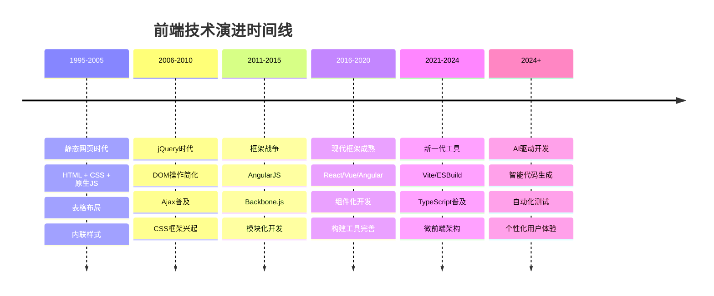
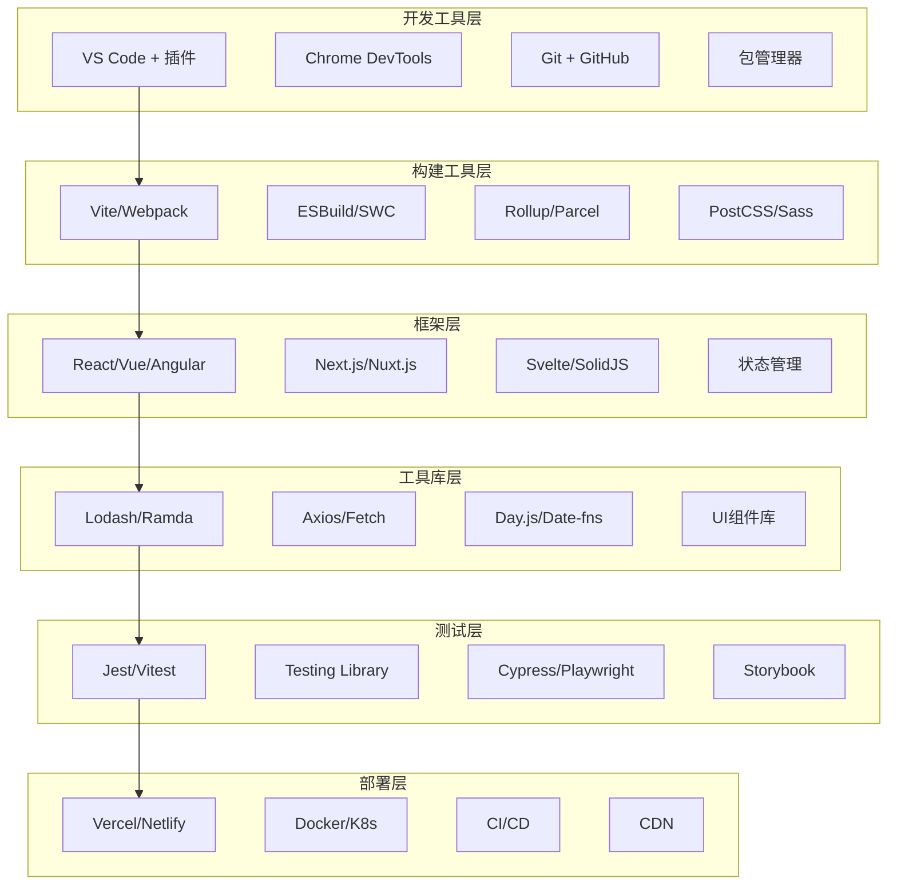
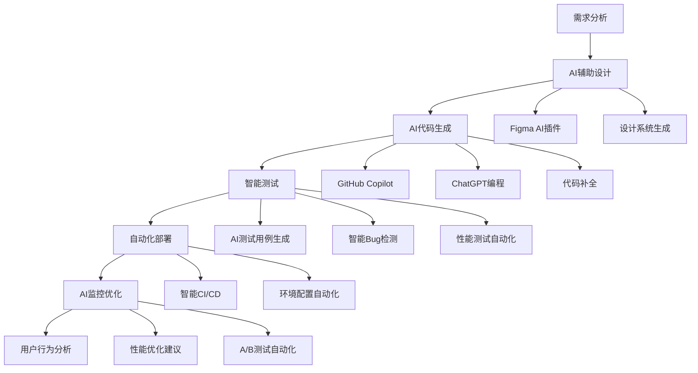
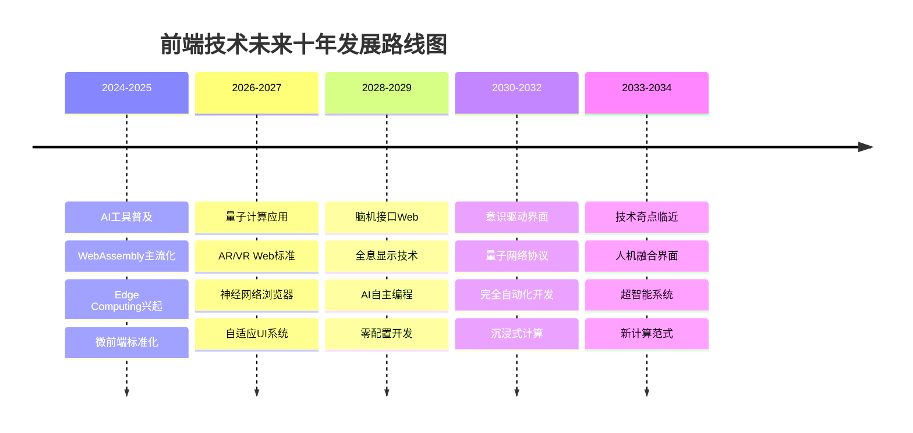
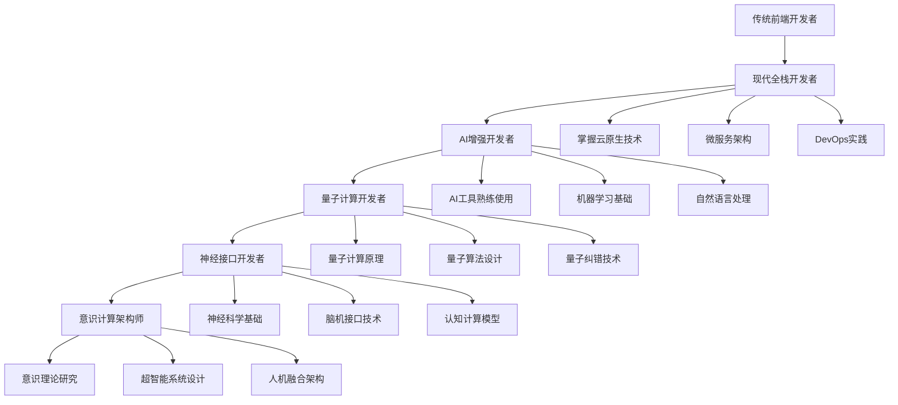
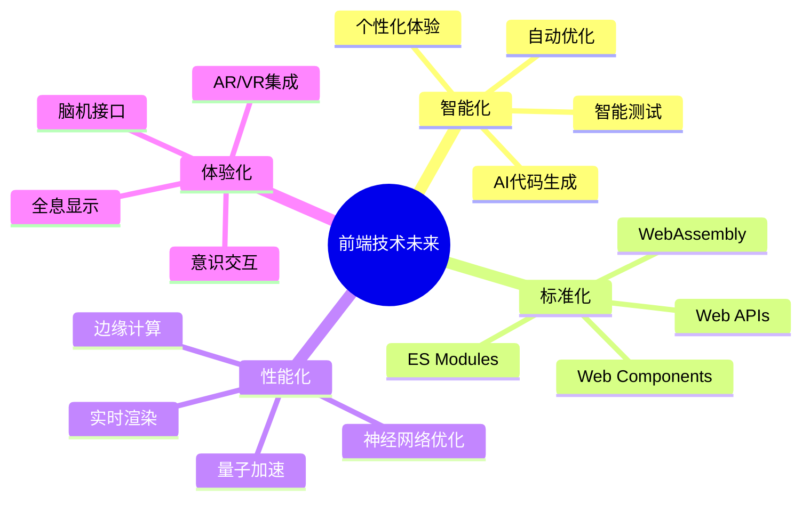

# 前端技术演进：从传统到智能的完整蜕变

> 从jQuery到React，从Webpack到Vite，从手工测试到AI驱动开发——前端技术的每一次革新都在重新定义我们的开发方式。让我们一起回顾这段波澜壮阔的技术演进历程，并展望即将到来的智能化未来。

## 引言：技术演进的必然性

还记得十年前我们是怎么写前端代码的吗？jQuery统治天下，手写CSS布局，用Grunt或Gulp处理资源，每次发布都要手动上传文件到服务器。那时候的我们可能想象不到，今天的前端开发会变得如此复杂而又如此智能。

技术的演进从来不是偶然的，它总是在解决当下的痛点，同时为未来的可能性铺路。今天，我们站在一个新的技术拐点上——AI正在深刻改变前端开发的每一个环节。

## 一、前端技术演进的历史脉络

### 1.1 史前时代：静态网页与原生JavaScript（1995-2005）



在这个阶段，前端开发还很简单，但也很原始：

```html
<!-- 典型的早期网页结构 -->
<!DOCTYPE html>
<html>
<head>
    <title>我的网站</title>
    <style>
        /* 内联样式，没有模块化概念 */
        .header { background: blue; }
        .content { margin: 10px; }
    </style>
</head>
<body>
    <table width="100%" border="0">
        <tr>
            <td class="header">网站标题</td>
        </tr>
        <tr>
            <td class="content">
                <script>
                    // 原生JavaScript，没有库的帮助
                    function showAlert() {
                        alert('Hello World!');
                    }
                    
                    // DOM操作非常繁琐
                    document.getElementById('myButton').onclick = showAlert;
                </script>
                <button id="myButton">点击我</button>
            </td>
        </tr>
    </table>
</body>
</html>
```

**这个时代的特点：**
- 表格布局统治天下
- 内联样式和脚本
- 没有模块化概念
- 浏览器兼容性是噩梦
- 开发效率极低

### 1.2 jQuery时代：DOM操作的革命（2006-2015）

jQuery的出现彻底改变了前端开发的面貌，它让DOM操作变得简单而优雅：

```javascript
// jQuery让复杂的DOM操作变得简单
$(document).ready(function() {
    // 选择器的威力
    $('.button').click(function() {
        $(this).fadeOut().fadeIn();
    });
    
    // Ajax变得如此简单
    $.ajax({
        url: '/api/data',
        type: 'GET',
        success: function(data) {
            $('#content').html(data);
        },
        error: function() {
            alert('请求失败');
        }
    });
    
    // 链式调用的优雅
    $('#myDiv')
        .addClass('highlight')
        .slideDown(300)
        .delay(1000)
        .slideUp(300);
});

// 插件系统的强大
$('.carousel').carousel({
    autoplay: true,
    interval: 3000,
    indicators: true
});
```

**jQuery时代的创新：**
- 统一的API抹平浏览器差异
- 链式调用提升代码可读性
- 丰富的插件生态系统
- Ajax操作标准化
- CSS选择器的强大威力

### 1.3 框架战争：架构思维的觉醒（2010-2016）

随着Web应用复杂度的提升，单纯的DOM操作已经无法满足需求，MVC/MVP/MVVM等架构模式开始在前端流行：

```javascript
// AngularJS：双向数据绑定的先驱
angular.module('myApp', [])
.controller('MainController', function($scope, $http) {
    $scope.title = 'Hello AngularJS';
    $scope.items = [];
    
    // 双向数据绑定
    $scope.newItem = '';
    
    $scope.addItem = function() {
        if ($scope.newItem) {
            $scope.items.push({
                id: Date.now(),
                text: $scope.newItem,
                completed: false
            });
            $scope.newItem = '';
        }
    };
    
    $scope.toggleItem = function(item) {
        item.completed = !item.completed;
    };
    
    // 依赖注入
    $http.get('/api/items').then(function(response) {
        $scope.items = response.data;
    });
});

// Backbone.js：模型-视图分离
var TodoModel = Backbone.Model.extend({
    defaults: {
        text: '',
        completed: false
    },
    
    toggle: function() {
        this.set('completed', !this.get('completed'));
    }
});

var TodoCollection = Backbone.Collection.extend({
    model: TodoModel,
    url: '/api/todos'
});

var TodoView = Backbone.View.extend({
    tagName: 'li',
    template: _.template('<%= text %> <button class="toggle">Toggle</button>'),
    
    events: {
        'click .toggle': 'toggleCompleted'
    },
    
    render: function() {
        this.$el.html(this.template(this.model.toJSON()));
        return this;
    },
    
    toggleCompleted: function() {
        this.model.toggle();
    }
});
```

**框架战争时代的特点：**
- MVC/MVP/MVVM架构模式普及
- 数据绑定概念的引入
- 模块化开发思维
- 路由管理标准化
- 测试驱动开发兴起

### 1.4 现代框架时代：组件化的胜利（2013-2020）

React的出现带来了组件化开发的革命，Vue和Angular也快速跟进，形成了三足鼎立的格局：

```jsx
// React：组件化开发的典范
import React, { useState, useEffect } from 'react';
import axios from 'axios';

// 函数组件 + Hooks
const TodoApp = () => {
    const [todos, setTodos] = useState([]);
    const [newTodo, setNewTodo] = useState('');
    const [loading, setLoading] = useState(false);
    
    // 副作用管理
    useEffect(() => {
        fetchTodos();
    }, []);
    
    const fetchTodos = async () => {
        setLoading(true);
        try {
            const response = await axios.get('/api/todos');
            setTodos(response.data);
        } catch (error) {
            console.error('Failed to fetch todos:', error);
        } finally {
            setLoading(false);
        }
    };
    
    const addTodo = async () => {
        if (!newTodo.trim()) return;
        
        try {
            const response = await axios.post('/api/todos', {
                text: newTodo,
                completed: false
            });
            setTodos([...todos, response.data]);
            setNewTodo('');
        } catch (error) {
            console.error('Failed to add todo:', error);
        }
    };
    
    const toggleTodo = async (id) => {
        const todo = todos.find(t => t.id === id);
        try {
            await axios.patch(`/api/todos/${id}`, {
                completed: !todo.completed
            });
            setTodos(todos.map(t => 
                t.id === id ? { ...t, completed: !t.completed } : t
            ));
        } catch (error) {
            console.error('Failed to toggle todo:', error);
        }
    };
    
    if (loading) {
        return <div className="loading">Loading...</div>;
    }
    
    return (
        <div className="todo-app">
            <h1>Todo List</h1>
            
            <div className="add-todo">
                <input
                    type="text"
                    value={newTodo}
                    onChange={(e) => setNewTodo(e.target.value)}
                    onKeyPress={(e) => e.key === 'Enter' && addTodo()}
                    placeholder="Add a new todo..."
                />
                <button onClick={addTodo}>Add</button>
            </div>
            
            <TodoList todos={todos} onToggle={toggleTodo} />
        </div>
    );
};

// 子组件的复用性
const TodoList = ({ todos, onToggle }) => {
    return (
        <ul className="todo-list">
            {todos.map(todo => (
                <TodoItem
                    key={todo.id}
                    todo={todo}
                    onToggle={() => onToggle(todo.id)}
                />
            ))}
        </ul>
    );
};

const TodoItem = ({ todo, onToggle }) => {
    return (
        <li className={`todo-item ${todo.completed ? 'completed' : ''}`}>
            <span onClick={onToggle}>{todo.text}</span>
        </li>
    );
};

export default TodoApp;
```

```vue
<!-- Vue：渐进式框架的优雅 -->
<template>
  <div class="todo-app">
    <h1>{{ title }}</h1>
    
    <div class="add-todo">
      <input
        v-model="newTodo"
        @keyup.enter="addTodo"
        placeholder="Add a new todo..."
      />
      <button @click="addTodo" :disabled="!newTodo.trim()">Add</button>
    </div>
    
    <transition-group name="todo" tag="ul" class="todo-list">
      <li
        v-for="todo in filteredTodos"
        :key="todo.id"
        :class="{ completed: todo.completed }"
        class="todo-item"
      >
        <input
          type="checkbox"
          v-model="todo.completed"
          @change="updateTodo(todo)"
        />
        <span @click="toggleTodo(todo)">{{ todo.text }}</span>
        <button @click="removeTodo(todo.id)" class="remove">×</button>
      </li>
    </transition-group>
    
    <div class="filters">
      <button
        v-for="filter in filters"
        :key="filter"
        :class="{ active: currentFilter === filter }"
        @click="currentFilter = filter"
      >
        {{ filter }}
      </button>
    </div>
  </div>
</template>

<script>
import { ref, computed, onMounted } from 'vue';
import { useTodos } from '@/composables/useTodos';

export default {
  name: 'TodoApp',
  setup() {
    const title = ref('Vue Todo App');
    const newTodo = ref('');
    const currentFilter = ref('all');
    const filters = ['all', 'active', 'completed'];
    
    // 使用组合式API
    const {
      todos,
      loading,
      addTodo: addTodoToList,
      updateTodo,
      removeTodo,
      fetchTodos
    } = useTodos();
    
    const filteredTodos = computed(() => {
      switch (currentFilter.value) {
        case 'active':
          return todos.value.filter(todo => !todo.completed);
        case 'completed':
          return todos.value.filter(todo => todo.completed);
        default:
          return todos.value;
      }
    });
    
    const addTodo = async () => {
      if (!newTodo.value.trim()) return;
      
      await addTodoToList({
        text: newTodo.value,
        completed: false
      });
      
      newTodo.value = '';
    };
    
    const toggleTodo = (todo) => {
      updateTodo({
        ...todo,
        completed: !todo.completed
      });
    };
    
    onMounted(() => {
      fetchTodos();
    });
    
    return {
      title,
      newTodo,
      currentFilter,
      filters,
      todos,
      loading,
      filteredTodos,
      addTodo,
      toggleTodo,
      updateTodo,
      removeTodo
    };
  }
};
</script>

<style scoped>
.todo-app {
  max-width: 600px;
  margin: 0 auto;
  padding: 20px;
}

.add-todo {
  display: flex;
  gap: 10px;
  margin-bottom: 20px;
}

.add-todo input {
  flex: 1;
  padding: 10px;
  border: 1px solid #ddd;
  border-radius: 4px;
}

.todo-item {
  display: flex;
  align-items: center;
  gap: 10px;
  padding: 10px;
  border-bottom: 1px solid #eee;
  transition: all 0.3s ease;
}

.todo-item.completed {
  opacity: 0.6;
  text-decoration: line-through;
}

.todo-enter-active,
.todo-leave-active {
  transition: all 0.3s ease;
}

.todo-enter-from,
.todo-leave-to {
  opacity: 0;
  transform: translateX(30px);
}

.filters {
  display: flex;
  gap: 10px;
  margin-top: 20px;
}

.filters button {
  padding: 5px 15px;
  border: 1px solid #ddd;
  background: white;
  cursor: pointer;
  border-radius: 4px;
}

.filters button.active {
  background: #007bff;
  color: white;
}
</style>
```

**现代框架时代的特点：**
- 组件化开发成为标准
- 虚拟DOM提升性能
- 状态管理模式成熟
- TypeScript广泛采用
- 构建工具链完善

### 1.5 新一代工具时代：性能与开发体验的双重提升（2020-2024）

随着项目规模的增长，传统构建工具的性能瓶颈日益明显，新一代工具应运而生：

```javascript
// Vite配置：极速的开发体验
// vite.config.js
import { defineConfig } from 'vite';
import react from '@vitejs/plugin-react';
import { resolve } from 'path';

export default defineConfig({
  plugins: [
    react({
      // 启用React Fast Refresh
      fastRefresh: true,
      // 支持emotion
      jsxImportSource: '@emotion/react'
    })
  ],
  
  // 路径别名
  resolve: {
    alias: {
      '@': resolve(__dirname, 'src'),
      '@components': resolve(__dirname, 'src/components'),
      '@utils': resolve(__dirname, 'src/utils'),
      '@hooks': resolve(__dirname, 'src/hooks')
    }
  },
  
  // 开发服务器配置
  server: {
    port: 3000,
    open: true,
    cors: true,
    proxy: {
      '/api': {
        target: 'http://localhost:8080',
        changeOrigin: true,
        rewrite: (path) => path.replace(/^\/api/, '')
      }
    }
  },
  
  // 构建优化
  build: {
    target: 'es2015',
    outDir: 'dist',
    assetsDir: 'assets',
    sourcemap: true,
    
    // 代码分割
    rollupOptions: {
      output: {
        manualChunks: {
          vendor: ['react', 'react-dom'],
          router: ['react-router-dom'],
          ui: ['antd', '@ant-design/icons']
        }
      }
    },
    
    // 压缩配置
    minify: 'terser',
    terserOptions: {
      compress: {
        drop_console: true,
        drop_debugger: true
      }
    }
  },
  
  // CSS预处理器
  css: {
    preprocessorOptions: {
      scss: {
        additionalData: `@import "@/styles/variables.scss";`
      }
    },
    modules: {
      localsConvention: 'camelCase'
    }
  },
  
  // 环境变量
  define: {
    __APP_VERSION__: JSON.stringify(process.env.npm_package_version)
  }
});
```

```typescript
// TypeScript：类型安全的JavaScript超集
interface User {
  id: number;
  name: string;
  email: string;
  avatar?: string;
  roles: Role[];
  createdAt: Date;
  updatedAt: Date;
}

interface Role {
  id: number;
  name: string;
  permissions: Permission[];
}

interface Permission {
  id: number;
  action: string;
  resource: string;
}

// 泛型工具类型
type ApiResponse<T> = {
  success: boolean;
  data: T;
  message?: string;
  errors?: string[];
};

type PaginatedResponse<T> = ApiResponse<{
  items: T[];
  total: number;
  page: number;
  pageSize: number;
}>;

// 高级类型操作
type CreateUserRequest = Omit<User, 'id' | 'createdAt' | 'updatedAt'>;
type UpdateUserRequest = Partial<Pick<User, 'name' | 'email' | 'avatar'>>;
type UserSummary = Pick<User, 'id' | 'name' | 'email'>;

// 类型安全的API客户端
class ApiClient {
  private baseURL: string;
  private token?: string;
  
  constructor(baseURL: string) {
    this.baseURL = baseURL;
  }
  
  setToken(token: string): void {
    this.token = token;
  }
  
  private async request<T>(
    endpoint: string,
    options: RequestInit = {}
  ): Promise<ApiResponse<T>> {
    const url = `${this.baseURL}${endpoint}`;
    const headers: HeadersInit = {
      'Content-Type': 'application/json',
      ...options.headers
    };
    
    if (this.token) {
      headers.Authorization = `Bearer ${this.token}`;
    }
    
    try {
      const response = await fetch(url, {
        ...options,
        headers
      });
      
      if (!response.ok) {
        throw new Error(`HTTP ${response.status}: ${response.statusText}`);
      }
      
      return await response.json();
    } catch (error) {
      console.error('API request failed:', error);
      throw error;
    }
  }
  
  // 用户相关API
  async getUsers(page = 1, pageSize = 10): Promise<PaginatedResponse<User>> {
    return this.request<PaginatedResponse<User>['data']>(
      `/users?page=${page}&pageSize=${pageSize}`
    );
  }
  
  async getUser(id: number): Promise<ApiResponse<User>> {
    return this.request<User>(`/users/${id}`);
  }
  
  async createUser(userData: CreateUserRequest): Promise<ApiResponse<User>> {
    return this.request<User>('/users', {
      method: 'POST',
      body: JSON.stringify(userData)
    });
  }
  
  async updateUser(
    id: number,
    userData: UpdateUserRequest
  ): Promise<ApiResponse<User>> {
    return this.request<User>(`/users/${id}`, {
      method: 'PATCH',
      body: JSON.stringify(userData)
    });
  }
  
  async deleteUser(id: number): Promise<ApiResponse<void>> {
    return this.request<void>(`/users/${id}`, {
      method: 'DELETE'
    });
  }
}

// React组件中的类型安全
import React, { useState, useEffect } from 'react';

interface UserListProps {
  onUserSelect: (user: User) => void;
  selectedUserId?: number;
}

const UserList: React.FC<UserListProps> = ({ onUserSelect, selectedUserId }) => {
  const [users, setUsers] = useState<User[]>([]);
  const [loading, setLoading] = useState(false);
  const [error, setError] = useState<string | null>(null);
  const [pagination, setPagination] = useState({
    page: 1,
    pageSize: 10,
    total: 0
  });
  
  const apiClient = new ApiClient('/api');
  
  useEffect(() => {
    fetchUsers();
  }, [pagination.page, pagination.pageSize]);
  
  const fetchUsers = async (): Promise<void> => {
    setLoading(true);
    setError(null);
    
    try {
      const response = await apiClient.getUsers(
        pagination.page,
        pagination.pageSize
      );
      
      if (response.success) {
        setUsers(response.data.items);
        setPagination(prev => ({
          ...prev,
          total: response.data.total
        }));
      } else {
        setError(response.message || 'Failed to fetch users');
      }
    } catch (err) {
      setError(err instanceof Error ? err.message : 'Unknown error');
    } finally {
      setLoading(false);
    }
  };
  
  const handleUserClick = (user: User): void => {
    onUserSelect(user);
  };
  
  const handlePageChange = (page: number): void => {
    setPagination(prev => ({ ...prev, page }));
  };
  
  if (loading) {
    return <div className="loading">Loading users...</div>;
  }
  
  if (error) {
    return (
      <div className="error">
        <p>Error: {error}</p>
        <button onClick={fetchUsers}>Retry</button>
      </div>
    );
  }
  
  return (
    <div className="user-list">
      <h2>Users ({pagination.total})</h2>
      
      <ul className="users">
        {users.map(user => (
          <li
            key={user.id}
            className={`user-item ${
              selectedUserId === user.id ? 'selected' : ''
            }`}
            onClick={() => handleUserClick(user)}
          >
            <div className="user-avatar">
              {user.avatar ? (
                
              ) : (
                <div className="avatar-placeholder">
                  {user.name.charAt(0).toUpperCase()}
                </div>
              )}
            </div>
            
            <div className="user-info">
              <h3>{user.name}</h3>
              <p>{user.email}</p>
              <div className="user-roles">
                {user.roles.map(role => (
                  <span key={role.id} className="role-badge">
                    {role.name}
                  </span>
                ))}
              </div>
            </div>
          </li>
        ))}
      </ul>
      
      <div className="pagination">
        <button
          disabled={pagination.page === 1}
          onClick={() => handlePageChange(pagination.page - 1)}
        >
          Previous
        </button>
        
        <span>
          Page {pagination.page} of {Math.ceil(pagination.total / pagination.pageSize)}
        </span>
        
        <button
          disabled={pagination.page * pagination.pageSize >= pagination.total}
          onClick={() => handlePageChange(pagination.page + 1)}
        >
          Next
        </button>
      </div>
    </div>
  );
};

export default UserList;
```

**新一代工具时代的特点：**
- 极速的开发服务器启动
- 原生ES模块支持
- TypeScript成为主流
- 更好的开发者体验
- 性能优化自动化

## 二、当前前端技术栈的全景图

### 2.1 技术栈架构图



### 2.2 技术选型决策树

```javascript
// 技术选型决策引擎
class TechStackDecisionEngine {
  constructor() {
    this.criteria = {
      projectSize: ['small', 'medium', 'large', 'enterprise'],
      teamSize: ['solo', 'small', 'medium', 'large'],
      timeline: ['rapid', 'normal', 'extended'],
      performance: ['basic', 'high', 'critical'],
      maintainability: ['low', 'medium', 'high'],
      scalability: ['none', 'horizontal', 'vertical', 'both']
    };
    
    this.recommendations = new Map();
    this.initializeRecommendations();
  }
  
  initializeRecommendations() {
    // React生态系统推荐
    this.recommendations.set('react-small', {
      framework: 'React',
      bundler: 'Vite',
      styling: 'CSS Modules + Tailwind',
      stateManagement: 'useState + useContext',
      routing: 'React Router',
      testing: 'Vitest + Testing Library',
      deployment: 'Vercel',
      reasoning: '适合小型项目，快速开发，简单部署'
    });
    
    this.recommendations.set('react-medium', {
      framework: 'React',
      bundler: 'Vite',
      styling: 'Styled Components + Design System',
      stateManagement: 'Zustand/Redux Toolkit',
      routing: 'React Router',
      testing: 'Jest + Testing Library + Cypress',
      deployment: 'Vercel + GitHub Actions',
      reasoning: '平衡开发效率和可维护性'
    });
    
    this.recommendations.set('react-large', {
      framework: 'React + TypeScript',
      bundler: 'Webpack + Module Federation',
      styling: 'Styled System + Design Tokens',
      stateManagement: 'Redux Toolkit + RTK Query',
      routing: 'React Router + Code Splitting',
      testing: 'Jest + Testing Library + Playwright + Storybook',
      deployment: 'Docker + Kubernetes + CI/CD',
      reasoning: '企业级应用，注重可维护性和扩展性'
    });
    
    // Vue生态系统推荐
    this.recommendations.set('vue-small', {
      framework: 'Vue 3',
      bundler: 'Vite',
      styling: 'Scoped CSS + UnoCSS',
      stateManagement: 'Composition API + Pinia',
      routing: 'Vue Router',
      testing: 'Vitest + Vue Testing Utils',
      deployment: 'Netlify',
      reasoning: 'Vue的渐进式特性适合快速原型开发'
    });
    
    this.recommendations.set('vue-medium', {
      framework: 'Vue 3 + TypeScript',
      bundler: 'Vite',
      styling: 'CSS Modules + Vuetify/Quasar',
      stateManagement: 'Pinia + Composables',
      routing: 'Vue Router + Guards',
      testing: 'Vitest + Vue Testing Utils + Cypress',
      deployment: 'Vercel + GitHub Actions',
      reasoning: '平衡学习曲线和功能完整性'
    });
    
    // Next.js全栈推荐
    this.recommendations.set('nextjs-fullstack', {
      framework: 'Next.js 14',
      bundler: 'Turbopack',
      styling: 'Tailwind CSS + CSS-in-JS',
      stateManagement: 'Zustand + SWR',
      routing: 'App Router + Server Components',
      testing: 'Jest + Testing Library + Playwright',
      deployment: 'Vercel + Edge Functions',
      reasoning: '全栈应用，SEO友好，性能优异'
    });
  }
  
  // 决策算法
  recommend(requirements) {
    const {
      projectSize,
      teamSize,
      timeline,
      performance,
      maintainability,
      scalability,
      seoRequired,
      realTimeFeatures,
      offlineSupport
    } = requirements;
    
    let score = new Map();
    
    // 基于项目规模评分
    if (projectSize === 'small') {
      score.set('react-small', (score.get('react-small') || 0) + 3);
      score.set('vue-small', (score.get('vue-small') || 0) + 3);
    } else if (projectSize === 'medium') {
      score.set('react-medium', (score.get('react-medium') || 0) + 3);
      score.set('vue-medium', (score.get('vue-medium') || 0) + 3);
    } else if (projectSize === 'large') {
      score.set('react-large', (score.get('react-large') || 0) + 3);
    }
    
    // SEO需求
    if (seoRequired) {
      score.set('nextjs-fullstack', (score.get('nextjs-fullstack') || 0) + 4);
    }
    
    // 性能要求
    if (performance === 'critical') {
      score.set('react-large', (score.get('react-large') || 0) + 2);
      score.set('nextjs-fullstack', (score.get('nextjs-fullstack') || 0) + 2);
    }
    
    // 团队规模
    if (teamSize === 'large') {
      score.set('react-large', (score.get('react-large') || 0) + 2);
    }
    
    // 时间线
    if (timeline === 'rapid') {
      score.set('react-small', (score.get('react-small') || 0) + 2);
      score.set('vue-small', (score.get('vue-small') || 0) + 2);
    }
    
    // 找到最高分的推荐
    let bestRecommendation = null;
    let highestScore = 0;
    
    for (const [key, value] of score) {
      if (value > highestScore) {
        highestScore = value;
        bestRecommendation = this.recommendations.get(key);
      }
    }
    
    return {
      recommendation: bestRecommendation,
      score: highestScore,
      alternatives: this.getAlternatives(score, highestScore),
      reasoning: this.generateReasoning(requirements, bestRecommendation)
    };
  }
  
  getAlternatives(scores, topScore) {
    const alternatives = [];
    for (const [key, score] of scores) {
      if (score >= topScore - 1 && score < topScore) {
        alternatives.push(this.recommendations.get(key));
      }
    }
    return alternatives;
  }
  
  generateReasoning(requirements, recommendation) {
    const reasons = [];
    
    if (requirements.projectSize === 'small') {
      reasons.push('项目规模较小，选择轻量级方案可以快速启动');
    }
    
    if (requirements.seoRequired) {
      reasons.push('SEO需求推荐使用SSR/SSG方案');
    }
    
    if (requirements.performance === 'critical') {
      reasons.push('高性能要求需要优化构建和运行时性能');
    }
    
    if (requirements.teamSize === 'large') {
      reasons.push('大团队需要更好的代码组织和协作工具');
    }
    
    return reasons.join('；');
  }
}

// 使用示例
const decisionEngine = new TechStackDecisionEngine();

const projectRequirements = {
  projectSize: 'medium',
  teamSize: 'small',
  timeline: 'normal',
  performance: 'high',
  maintainability: 'high',
  scalability: 'horizontal',
  seoRequired: true,
  realTimeFeatures: false,
  offlineSupport: false
};

const result = decisionEngine.recommend(projectRequirements);
console.log('推荐技术栈:', result);
```

### 2.3 性能优化最佳实践

```javascript
// 现代前端性能优化工具包
class PerformanceOptimizer {
  constructor() {
    this.metrics = new Map();
    this.observers = [];
    this.initializeObservers();
  }
  
  initializeObservers() {
    // Core Web Vitals监控
    this.observeWebVitals();
    
    // 资源加载监控
    this.observeResourceLoading();
    
    // 用户交互监控
    this.observeUserInteractions();
  }
  
  observeWebVitals() {
    // LCP (Largest Contentful Paint)
    new PerformanceObserver((entryList) => {
      const entries = entryList.getEntries();
      const lastEntry = entries[entries.length - 1];
      this.metrics.set('LCP', lastEntry.startTime);
      
      if (lastEntry.startTime > 2500) {
        console.warn('LCP过慢:', lastEntry.startTime);
        this.optimizeLCP();
      }
    }).observe({ entryTypes: ['largest-contentful-paint'] });
    
    // FID (First Input Delay)
    new PerformanceObserver((entryList) => {
      const entries = entryList.getEntries();
      entries.forEach(entry => {
        this.metrics.set('FID', entry.processingStart - entry.startTime);
        
        if (entry.processingStart - entry.startTime > 100) {
          console.warn('FID过慢:', entry.processingStart - entry.startTime);
          this.optimizeFID();
        }
      });
    }).observe({ entryTypes: ['first-input'] });
    
    // CLS (Cumulative Layout Shift)
    let clsValue = 0;
    new PerformanceObserver((entryList) => {
      const entries = entryList.getEntries();
      entries.forEach(entry => {
        if (!entry.hadRecentInput) {
          clsValue += entry.value;
        }
      });
      
      this.metrics.set('CLS', clsValue);
      
      if (clsValue > 0.1) {
        console.warn('CLS过高:', clsValue);
        this.optimizeCLS();
      }
    }).observe({ entryTypes: ['layout-shift'] });
  }
  
  observeResourceLoading() {
    new PerformanceObserver((entryList) => {
      const entries = entryList.getEntries();
      entries.forEach(entry => {
        if (entry.transferSize > 1024 * 1024) { // 1MB
          console.warn('大文件加载:', entry.name, entry.transferSize);
          this.optimizeResourceSize(entry);
        }
        
        if (entry.duration > 3000) { // 3秒
          console.warn('资源加载慢:', entry.name, entry.duration);
          this.optimizeResourceLoading(entry);
        }
      });
    }).observe({ entryTypes: ['resource'] });
  }
  
  observeUserInteractions() {
    // 监控长任务
    new PerformanceObserver((entryList) => {
      const entries = entryList.getEntries();
      entries.forEach(entry => {
        if (entry.duration > 50) {
          console.warn('长任务检测:', entry.duration);
          this.optimizeLongTasks(entry);
        }
      });
    }).observe({ entryTypes: ['longtask'] });
  }
  
  // LCP优化策略
  optimizeLCP() {
    const strategies = [
      {
        name: '预加载关键资源',
        implement: () => {
          const criticalImages = document.querySelectorAll('img[data-critical]');
          criticalImages.forEach(img => {
            const link = document.createElement('link');
            link.rel = 'preload';
            link.as = 'image';
            link.href = img.src;
            document.head.appendChild(link);
          });
        }
      },
      {
        name: '优化服务器响应时间',
        implement: () => {
          // 实施CDN、缓存策略等
          console.log('建议：实施CDN和缓存策略');
        }
      },
      {
        name: '移除阻塞渲染的资源',
        implement: () => {
          const nonCriticalCSS = document.querySelectorAll('link[rel="stylesheet"]:not([data-critical])');
          nonCriticalCSS.forEach(link => {
            link.media = 'print';
            link.onload = function() {
              this.media = 'all';
            };
          });
        }
      }
    ];
    
    strategies.forEach(strategy => {
      try {
        strategy.implement();
        console.log(`LCP优化策略已应用: ${strategy.name}`);
      } catch (error) {
        console.error(`LCP优化策略失败: ${strategy.name}`, error);
      }
    });
  }
  
  // FID优化策略
  optimizeFID() {
    const strategies = [
      {
        name: '代码分割',
        implement: () => {
          // 动态导入非关键代码
          const heavyComponents = document.querySelectorAll('[data-heavy-component]');
          heavyComponents.forEach(component => {
            const observer = new IntersectionObserver((entries) => {
              entries.forEach(entry => {
                if (entry.isIntersecting) {
                  import(component.dataset.componentPath)
                    .then(module => {
                      module.default.render(component);
                    })
                    .catch(console.error);
                  observer.unobserve(entry.target);
                }
              });
            });
            observer.observe(component);
          });
        }
      },
      {
        name: '使用Web Workers',
        implement: () => {
          if ('serviceWorker' in navigator) {
            const heavyTasks = window.heavyTasks || [];
            heavyTasks.forEach(task => {
              const worker = new Worker('/workers/heavy-task-worker.js');
              worker.postMessage(task.data);
              worker.onmessage = (e) => {
                task.callback(e.data);
                worker.terminate();
              };
            });
          }
        }
      },
      {
        name: '优化第三方脚本',
        implement: () => {
          const thirdPartyScripts = document.querySelectorAll('script[src*="//"]');
          thirdPartyScripts.forEach(script => {
            if (!script.hasAttribute('async') && !script.hasAttribute('defer')) {
              script.async = true;
            }
          });
        }
      }
    ];
    
    strategies.forEach(strategy => {
      try {
        strategy.implement();
        console.log(`FID优化策略已应用: ${strategy.name}`);
      } catch (error) {
        console.error(`FID优化策略失败: ${strategy.name}`, error);
      }
    });
  }
  
  // CLS优化策略
  optimizeCLS() {
    const strategies = [
      {
        name: '为图片设置尺寸',
        implement: () => {
          const images = document.querySelectorAll('img:not([width]):not([height])');
          images.forEach(img => {
            img.addEventListener('load', function() {
              if (!this.width || !this.height) {
                console.warn('图片缺少尺寸属性:', this.src);
              }
            });
          });
        }
      },
      {
        name: '预留广告位空间',
        implement: () => {
          const adSlots = document.querySelectorAll('[data-ad-slot]');
          adSlots.forEach(slot => {
            const minHeight = slot.dataset.minHeight || '250px';
            slot.style.minHeight = minHeight;
          });
        }
      },
      {
        name: '避免在现有内容上方插入内容',
        implement: () => {
          const dynamicContent = document.querySelectorAll('[data-dynamic-content]');
          dynamicContent.forEach(container => {
            const observer = new MutationObserver((mutations) => {
              mutations.forEach(mutation => {
                if (mutation.type === 'childList' && mutation.addedNodes.length > 0) {
                  console.warn('检测到动态内容插入，可能影响CLS:', container);
                }
              });
            });
            observer.observe(container, { childList: true });
          });
        }
      }
    ];
    
    strategies.forEach(strategy => {
      try {
        strategy.implement();
        console.log(`CLS优化策略已应用: ${strategy.name}`);
      } catch (error) {
        console.error(`CLS优化策略失败: ${strategy.name}`, error);
      }
    });
  }
  
  // 资源优化
  optimizeResourceSize(entry) {
    console.log(`建议优化资源: ${entry.name}`);
    console.log('- 启用Gzip/Brotli压缩');
    console.log('- 使用WebP格式图片');
    console.log('- 实施代码分割');
    console.log('- 移除未使用的代码');
  }
  
  optimizeResourceLoading(entry) {
    console.log(`建议优化加载: ${entry.name}`);
    console.log('- 使用CDN');
    console.log('- 实施HTTP/2推送');
    console.log('- 优化缓存策略');
    console.log('- 考虑预加载关键资源');
  }
  
  // 长任务优化
  optimizeLongTasks(entry) {
    console.log('检测到长任务，建议:');
    console.log('- 将任务分解为更小的块');
    console.log('- 使用requestIdleCallback');
    console.log('- 考虑使用Web Workers');
    console.log('- 实施时间切片');
    
    // 自动应用时间切片
    this.implementTimeSlicing();
  }
  
  implementTimeSlicing() {
    // 时间切片实现
    window.scheduleWork = function(tasks, deadline = 5) {
      const startTime = performance.now();
      
      function runTasks() {
        while (tasks.length > 0 && (performance.now() - startTime) < deadline) {
          const task = tasks.shift();
          task();
        }
        
        if (tasks.length > 0) {
          requestIdleCallback(runTasks);
        }
      }
      
      requestIdleCallback(runTasks);
    };
  }
  
  // 生成性能报告
  generateReport() {
    const report = {
      timestamp: new Date().toISOString(),
      metrics: Object.fromEntries(this.metrics),
      recommendations: this.getRecommendations(),
      score: this.calculatePerformanceScore()
    };
    
    return report;
  }
  
  getRecommendations() {
    const recommendations = [];
    
    const lcp = this.metrics.get('LCP');
    if (lcp > 2500) {
      recommendations.push({
        type: 'LCP',
        priority: 'high',
        message: 'LCP超过2.5秒，需要优化关键资源加载'
      });
    }
    
    const fid = this.metrics.get('FID');
    if (fid > 100) {
      recommendations.push({
        type: 'FID',
        priority: 'high',
        message: 'FID超过100ms，需要优化JavaScript执行'
      });
    }
    
    const cls = this.metrics.get('CLS');
    if (cls > 0.1) {
      recommendations.push({
        type: 'CLS',
        priority: 'medium',
        message: 'CLS超过0.1，需要优化布局稳定性'
      });
    }
    
    return recommendations;
  }
  
  calculatePerformanceScore() {
    const lcp = this.metrics.get('LCP') || 0;
    const fid = this.metrics.get('FID') || 0;
    const cls = this.metrics.get('CLS') || 0;
    
    let score = 100;
    
    // LCP评分 (0-40分)
    if (lcp <= 2500) {
      score -= 0;
    } else if (lcp <= 4000) {
      score -= 20;
    } else {
      score -= 40;
    }
    
    // FID评分 (0-30分)
    if (fid <= 100) {
      score -= 0;
    } else if (fid <= 300) {
      score -= 15;
    } else {
      score -= 30;
    }
    
    // CLS评分 (0-30分)
    if (cls <= 0.1) {
      score -= 0;
    } else if (cls <= 0.25) {
      score -= 15;
    } else {
      score -= 30;
    }
    
    return Math.max(0, score);
  }
}

// 全局性能优化器
const performanceOptimizer = new PerformanceOptimizer();

// 定期生成性能报告
setInterval(() => {
  const report = performanceOptimizer.generateReport();
  console.log('性能报告:', report);
  
  // 发送到分析服务
  if (typeof gtag !== 'undefined') {
    gtag('event', 'performance_report', {
      custom_parameter: JSON.stringify(report)
    });
  }
}, 30000); // 每30秒生成一次报告

export { PerformanceOptimizer };
```

## 三、AI时代的前端开发变革

### 3.1 AI工具对开发流程的影响



### 3.2 AI驱动的开发工作流

```javascript
// AI驱动的开发助手
class AIDevAssistant {
  constructor() {
    this.aiServices = {
      codeGeneration: new CodeGenerationService(),
      codeReview: new CodeReviewService(),
      testing: new TestGenerationService(),
      optimization: new OptimizationService(),
      documentation: new DocumentationService()
    };
    
    this.context = {
      project: null,
      currentFile: null,
      recentChanges: [],
      codebase: new Map()
    };
  }
  
  // 智能代码生成
  async generateCode(prompt, context = {}) {
    const enhancedPrompt = this.enhancePrompt(prompt, context);
    
    try {
      const generatedCode = await this.aiServices.codeGeneration.generate({
        prompt: enhancedPrompt,
        language: context.language || 'javascript',
        framework: context.framework || 'react',
        style: context.codeStyle || 'modern',
        patterns: context.patterns || ['hooks', 'functional']
      });
      
      // 代码质量检查
      const qualityCheck = await this.aiServices.codeReview.analyze(generatedCode);
      
      if (qualityCheck.score < 0.8) {
        console.warn('生成的代码质量较低，正在重新生成...');
        return this.generateCode(prompt, {
          ...context,
          improvements: qualityCheck.suggestions
        });
      }
      
      return {
        code: generatedCode,
        quality: qualityCheck,
        suggestions: await this.generateImprovementSuggestions(generatedCode)
      };
    } catch (error) {
      console.error('代码生成失败:', error);
      return null;
    }
  }
  
  enhancePrompt(prompt, context) {
    let enhancedPrompt = prompt;
    
    // 添加项目上下文
    if (this.context.project) {
      enhancedPrompt += `\n\n项目信息:\n`;
      enhancedPrompt += `- 框架: ${this.context.project.framework}\n`;
      enhancedPrompt += `- 语言: ${this.context.project.language}\n`;
      enhancedPrompt += `- 代码风格: ${this.context.project.codeStyle}\n`;
    }
    
    // 添加当前文件上下文
    if (this.context.currentFile) {
      enhancedPrompt += `\n\n当前文件上下文:\n`;
      enhancedPrompt += `- 文件类型: ${this.context.currentFile.type}\n`;
      enhancedPrompt += `- 现有导入: ${this.context.currentFile.imports.join(', ')}\n`;
    }
    
    // 添加最近的代码变更
    if (this.context.recentChanges.length > 0) {
      enhancedPrompt += `\n\n最近的代码变更:\n`;
      this.context.recentChanges.slice(-3).forEach((change, index) => {
        enhancedPrompt += `${index + 1}. ${change.description}\n`;
      });
    }
    
    return enhancedPrompt;
  }
  
  // 智能代码审查
  async reviewCode(code, options = {}) {
    const reviewResult = await this.aiServices.codeReview.review(code, {
      checkSecurity: options.checkSecurity !== false,
      checkPerformance: options.checkPerformance !== false,
      checkMaintainability: options.checkMaintainability !== false,
      checkAccessibility: options.checkAccessibility !== false,
      codeStyle: this.context.project?.codeStyle || 'standard'
    });
    
    return {
      score: reviewResult.score,
      issues: reviewResult.issues,
      suggestions: reviewResult.suggestions,
      autoFixable: reviewResult.autoFixable,
      securityVulnerabilities: reviewResult.securityVulnerabilities
    };
  }
  
  // 自动生成测试用例
  async generateTests(code, testType = 'unit') {
    const testCases = await this.aiServices.testing.generateTests({
      code,
      testType,
      framework: this.context.project?.testFramework || 'jest',
      coverage: 'comprehensive'
    });
    
    return testCases;
  }
  
  // 性能优化建议
  async optimizeCode(code) {
    const optimizations = await this.aiServices.optimization.analyze(code);
    
    return {
      suggestions: optimizations.suggestions,
      estimatedImprovement: optimizations.estimatedImprovement,
      optimizedCode: optimizations.optimizedCode
    };
  }
  
  // 自动生成文档
  async generateDocumentation(code) {
    const docs = await this.aiServices.documentation.generate({
      code,
      format: 'markdown',
      includeExamples: true,
      includeTypeDefinitions: true
    });
    
    return docs;
  }
}

// AI服务实现示例
class CodeGenerationService {
  async generate(options) {
    // 模拟AI代码生成
    const { prompt, language, framework } = options;
    
    // 这里会调用实际的AI服务（如OpenAI API）
    const response = await fetch('/api/ai/generate-code', {
      method: 'POST',
      headers: { 'Content-Type': 'application/json' },
      body: JSON.stringify(options)
    });
    
    const result = await response.json();
    return result.code;
  }
}

class CodeReviewService {
  async review(code, options) {
    // 模拟AI代码审查
    const issues = [];
    const suggestions = [];
    
    // 安全检查
    if (options.checkSecurity) {
      if (code.includes('eval(') || code.includes('innerHTML')) {
        issues.push({
          type: 'security',
          severity: 'high',
          message: '检测到潜在的XSS风险',
          line: this.findLineNumber(code, 'innerHTML')
        });
      }
    }
    
    // 性能检查
    if (options.checkPerformance) {
      if (code.includes('document.querySelector') && code.split('document.querySelector').length > 3) {
        suggestions.push({
          type: 'performance',
          message: '建议缓存DOM查询结果',
          improvement: '使用变量存储查询结果，避免重复查询'
        });
      }
    }
    
    const score = Math.max(0, 1 - (issues.length * 0.2) - (suggestions.length * 0.1));
    
    return {
      score,
      issues,
      suggestions,
      autoFixable: issues.filter(issue => issue.autoFixable),
      securityVulnerabilities: issues.filter(issue => issue.type === 'security')
    };
  }
  
  findLineNumber(code, searchText) {
    const lines = code.split('\n');
    for (let i = 0; i < lines.length; i++) {
      if (lines[i].includes(searchText)) {
        return i + 1;
      }
    }
    return 0;
  }
}

// 使用示例
const aiAssistant = new AIDevAssistant();

// 设置项目上下文
aiAssistant.context.project = {
  framework: 'react',
  language: 'typescript',
  codeStyle: 'airbnb',
  testFramework: 'jest'
};

// 生成组件代码
const componentCode = await aiAssistant.generateCode(
  '创建一个可复用的Button组件，支持不同尺寸和样式变体',
  {
    framework: 'react',
    language: 'typescript',
    patterns: ['hooks', 'styled-components']
  }
);

console.log('生成的组件代码:', componentCode);
```

### 3.3 AI驱动的用户体验优化

```javascript
// 智能用户体验优化系统
class IntelligentUXOptimizer {
  constructor() {
    this.userBehaviorTracker = new UserBehaviorTracker();
    this.personalizer = new PersonalizationEngine();
    this.predictor = new UserIntentPredictor();
    this.optimizer = new RealTimeOptimizer();
  }
  
  // 实时用户体验优化
  async optimizeUserExperience(userId, currentPage) {
    // 获取用户行为数据
    const behaviorData = await this.userBehaviorTracker.getUserBehavior(userId);
    
    // 预测用户意图
    const predictedIntent = await this.predictor.predictIntent(behaviorData, currentPage);
    
    // 个性化内容推荐
    const personalizedContent = await this.personalizer.generateRecommendations({
      userId,
      intent: predictedIntent,
      context: currentPage
    });
    
    // 实时界面优化
    const optimizations = await this.optimizer.generateOptimizations({
      userProfile: behaviorData.profile,
      currentPerformance: await this.measureCurrentPerformance(),
      deviceCapabilities: this.detectDeviceCapabilities()
    });
    
    return {
      personalizedContent,
      optimizations,
      predictedActions: predictedIntent.nextActions
    };
  }
  
  async measureCurrentPerformance() {
    return {
      lcp: await this.getLCP(),
      fid: await this.getFID(),
      cls: await this.getCLS(),
      networkSpeed: navigator.connection?.effectiveType || 'unknown'
    };
  }
  
  detectDeviceCapabilities() {
    return {
      memory: navigator.deviceMemory || 4,
      cores: navigator.hardwareConcurrency || 4,
      screenSize: {
        width: window.screen.width,
        height: window.screen.height
      },
      pixelRatio: window.devicePixelRatio || 1,
      touchSupport: 'ontouchstart' in window
    };
  }
}

// 用户行为追踪器
class UserBehaviorTracker {
  constructor() {
    this.behaviorData = new Map();
    this.initializeTracking();
  }
  
  initializeTracking() {
    // 点击行为追踪
    document.addEventListener('click', (event) => {
      this.trackInteraction('click', {
        element: event.target.tagName,
        className: event.target.className,
        position: { x: event.clientX, y: event.clientY },
        timestamp: Date.now()
      });
    });
    
    // 滚动行为追踪
    let scrollTimeout;
    document.addEventListener('scroll', () => {
      clearTimeout(scrollTimeout);
      scrollTimeout = setTimeout(() => {
        this.trackInteraction('scroll', {
          scrollY: window.scrollY,
          scrollPercent: (window.scrollY / (document.body.scrollHeight - window.innerHeight)) * 100,
          timestamp: Date.now()
        });
      }, 100);
    });
    
    // 停留时间追踪
    this.trackPageDwell();
  }
  
  trackInteraction(type, data) {
    const userId = this.getCurrentUserId();
    if (!this.behaviorData.has(userId)) {
      this.behaviorData.set(userId, []);
    }
    
    this.behaviorData.get(userId).push({
      type,
      data,
      url: window.location.href,
      timestamp: Date.now()
    });
  }
  
  trackPageDwell() {
    const startTime = Date.now();
    
    window.addEventListener('beforeunload', () => {
      const dwellTime = Date.now() - startTime;
      this.trackInteraction('page_dwell', {
        duration: dwellTime,
        url: window.location.href
      });
    });
  }
  
  async getUserBehavior(userId) {
    const behaviors = this.behaviorData.get(userId) || [];
    
    return {
      profile: this.generateUserProfile(behaviors),
      recentBehaviors: behaviors.slice(-50),
      patterns: this.identifyPatterns(behaviors)
    };
  }
  
  generateUserProfile(behaviors) {
    const clickBehaviors = behaviors.filter(b => b.type === 'click');
    const scrollBehaviors = behaviors.filter(b => b.type === 'scroll');
    
    return {
      activityLevel: this.calculateActivityLevel(behaviors),
      preferredInteractionStyle: this.analyzeInteractionStyle(clickBehaviors),
      readingPattern: this.analyzeReadingPattern(scrollBehaviors),
      devicePreference: this.analyzeDeviceUsage(behaviors)
    };
  }
  
  calculateActivityLevel(behaviors) {
    const recentBehaviors = behaviors.filter(b => 
      Date.now() - b.timestamp < 24 * 60 * 60 * 1000 // 最近24小时
    );
    
    if (recentBehaviors.length > 100) return 'high';
    if (recentBehaviors.length > 30) return 'medium';
    return 'low';
  }
  
  getCurrentUserId() {
    // 实际实现中应该从认证系统获取
    return localStorage.getItem('userId') || 'anonymous';
  }
}

// 用户意图预测器
class UserIntentPredictor {
  constructor() {
    this.intentModel = new IntentPredictionModel();
  }
  
  async predictIntent(behaviorData, currentPage) {
    const features = this.extractFeatures(behaviorData, currentPage);
    const prediction = await this.intentModel.predict(features);
    
    return {
      primaryIntent: prediction.intent,
      confidence: prediction.confidence,
      nextActions: prediction.suggestedActions,
      timeToAction: prediction.estimatedTime
    };
  }
  
  extractFeatures(behaviorData, currentPage) {
    return {
      pageType: this.classifyPageType(currentPage),
      userActivity: behaviorData.profile.activityLevel,
      timeOnPage: this.calculateTimeOnPage(behaviorData.recentBehaviors),
      scrollDepth: this.calculateScrollDepth(behaviorData.recentBehaviors),
      clickFrequency: this.calculateClickFrequency(behaviorData.recentBehaviors),
      deviceType: this.detectDeviceType()
    };
  }
  
  classifyPageType(currentPage) {
    const url = currentPage.url || window.location.href;
    
    if (url.includes('/product/')) return 'product';
    if (url.includes('/cart')) return 'cart';
    if (url.includes('/checkout')) return 'checkout';
    if (url.includes('/search')) return 'search';
    if (url.includes('/category/')) return 'category';
    
    return 'general';
  }
}

// 实时优化器
class RealTimeOptimizer {
  async generateOptimizations(context) {
    const optimizations = [];
    
    // 性能优化
    if (context.currentPerformance.lcp > 2500) {
      optimizations.push({
        type: 'performance',
        action: 'preload_critical_resources',
        priority: 'high',
        implementation: this.generatePreloadOptimization()
      });
    }
    
    // 设备适配优化
    if (context.deviceCapabilities.memory < 4) {
      optimizations.push({
        type: 'memory',
        action: 'reduce_memory_usage',
        priority: 'medium',
        implementation: this.generateMemoryOptimization()
      });
    }
    
    // 网络优化
    if (context.currentPerformance.networkSpeed === 'slow-2g' || 
        context.currentPerformance.networkSpeed === '2g') {
      optimizations.push({
        type: 'network',
        action: 'enable_data_saver_mode',
        priority: 'high',
        implementation: this.generateDataSaverOptimization()
      });
    }
    
    return optimizations;
  }
  
  generatePreloadOptimization() {
    return {
      code: `
        // 预加载关键资源
        const criticalResources = [
          '/api/user-data',
          '/images/hero-banner.webp',
          '/fonts/primary-font.woff2'
        ];
        
        criticalResources.forEach(resource => {
          const link = document.createElement('link');
          link.rel = 'preload';
          link.href = resource;
          link.as = resource.includes('/api/') ? 'fetch' : 
                   resource.includes('/images/') ? 'image' : 'font';
          if (link.as === 'font') link.crossOrigin = 'anonymous';
          document.head.appendChild(link);
        });
      `,
      description: '预加载关键资源以改善LCP'
    };
  }
  
  generateMemoryOptimization() {
    return {
      code: `
        // 内存优化策略
        class MemoryOptimizer {
          static optimizeImages() {
            const images = document.querySelectorAll('img');
            images.forEach(img => {
              if (!img.loading) img.loading = 'lazy';
              if (!img.decoding) img.decoding = 'async';
            });
          }
          
          static enableVirtualScrolling() {
            // 对长列表启用虚拟滚动
            const longLists = document.querySelectorAll('[data-long-list]');
            longLists.forEach(list => {
              if (list.children.length > 100) {
                this.implementVirtualScrolling(list);
              }
            });
          }
        }
        
        MemoryOptimizer.optimizeImages();
        MemoryOptimizer.enableVirtualScrolling();
      `,
      description: '减少内存使用以适配低端设备'
    };
  }
  
  generateDataSaverOptimization() {
    return {
      code: `
        // 数据节省模式
        class DataSaverMode {
          static enable() {
            // 禁用自动播放视频
            const videos = document.querySelectorAll('video[autoplay]');
            videos.forEach(video => {
              video.removeAttribute('autoplay');
              video.preload = 'none';
            });
            
            // 延迟加载非关键图片
            const images = document.querySelectorAll('img:not([data-critical])');
            images.forEach(img => {
              img.loading = 'lazy';
              // 使用低质量占位图
              if (!img.src.includes('placeholder')) {
                const placeholder = this.generatePlaceholder(img);
                img.dataset.originalSrc = img.src;
                img.src = placeholder;
              }
            });
            
            // 压缩API响应
            this.enableResponseCompression();
          }
          
          static generatePlaceholder(img) {
            const canvas = document.createElement('canvas');
            canvas.width = 10;
            canvas.height = 10;
            const ctx = canvas.getContext('2d');
            ctx.fillStyle = '#f0f0f0';
            ctx.fillRect(0, 0, 10, 10);
            return canvas.toDataURL();
          }
        }
        
        DataSaverMode.enable();
      `,
      description: '启用数据节省模式以适配慢速网络'
    };
  }
}

export { IntelligentUXOptimizer };
```

## 四、未来展望：下一个十年的前端技术

### 4.1 技术发展趋势预测



### 4.2 新兴技术的影响

```javascript
// 未来前端技术栈预览
class FutureFrontendStack {
  constructor() {
    this.quantumProcessor = new QuantumComputingInterface();
    this.neuralRenderer = new NeuralNetworkRenderer();
    this.holoDisplay = new HolographicDisplayManager();
    this.brainInterface = new BrainComputerInterface();
    this.aiDeveloper = new AutonomousAIDeveloper();
  }
  
  // 量子计算增强的状态管理
  async quantumStateManagement(complexState) {
    // 利用量子叠加态处理复杂状态
    const quantumState = await this.quantumProcessor.createSuperposition(complexState);
    
    // 量子并行计算所有可能的状态变化
    const allPossibleStates = await this.quantumProcessor.parallelCompute(
      quantumState,
      this.getAllPossibleMutations()
    );
    
    // 量子测量得到最优状态
    const optimalState = await this.quantumProcessor.measure(
      allPossibleStates,
      this.optimizationCriteria
    );
    
    return optimalState;
  }
  
  // 神经网络驱动的UI渲染
  async neuralRendering(componentTree, userContext) {
    // 使用神经网络预测最佳渲染策略
    const renderingStrategy = await this.neuralRenderer.predictOptimalStrategy({
      componentComplexity: this.analyzeComplexity(componentTree),
      userBehaviorPattern: userContext.behaviorPattern,
      deviceCapabilities: userContext.device,
      networkConditions: userContext.network
    });
    
    // 自适应渲染优化
    const optimizedComponents = await this.neuralRenderer.optimizeComponents(
      componentTree,
      renderingStrategy
    );
    
    return optimizedComponents;
  }
  
  // 全息显示界面
  async renderHolographicUI(uiDefinition, spatialContext) {
    // 3D空间中的UI布局
    const spatialLayout = await this.holoDisplay.calculateSpatialLayout({
      uiElements: uiDefinition.elements,
      userPosition: spatialContext.userPosition,
      environmentConstraints: spatialContext.environment,
      interactionDistance: spatialContext.reachDistance
    });
    
    // 全息投影渲染
    const holographicElements = await this.holoDisplay.renderHolographic({
      layout: spatialLayout,
      lightingConditions: spatialContext.lighting,
      viewingAngle: spatialContext.viewAngle
    });
    
    return holographicElements;
  }
  
  // 脑机接口交互
  async brainControlledInteraction() {
    // 读取用户意图
    const userIntent = await this.brainInterface.readIntent({
      focusArea: 'visual_cortex',
      intentionType: 'ui_interaction',
      confidenceThreshold: 0.85
    });
    
    // 预测用户想要执行的操作
    const predictedAction = await this.brainInterface.predictAction(userIntent);
    
    // 执行意图驱动的界面变化
    if (predictedAction.confidence > 0.9) {
      await this.executeIntentAction(predictedAction);
    }
    
    return predictedAction;
  }
  
  // AI自主开发
  async autonomousDevelopment(requirements) {
    // AI理解需求
    const parsedRequirements = await this.aiDeveloper.parseRequirements(requirements);
    
    // 自动架构设计
    const architecture = await this.aiDeveloper.designArchitecture({
      requirements: parsedRequirements,
      constraints: this.getProjectConstraints(),
      bestPractices: await this.aiDeveloper.getLatestBestPractices()
    });
    
    // 自动代码生成
    const generatedCode = await this.aiDeveloper.generateCode({
      architecture,
      codeStyle: 'future_standard',
      optimizationLevel: 'quantum_enhanced'
    });
    
    // 自动测试生成
    const tests = await this.aiDeveloper.generateTests({
      code: generatedCode,
      coverage: 'comprehensive',
      testTypes: ['unit', 'integration', 'e2e', 'quantum_simulation']
    });
    
    // 自动部署
    const deployment = await this.aiDeveloper.deploy({
      code: generatedCode,
      tests,
      environment: 'quantum_cloud',
      scalingStrategy: 'adaptive_neural'
    });
    
    return {
      architecture,
      code: generatedCode,
      tests,
      deployment
    };
  }
}

// 量子计算接口
class QuantumComputingInterface {
  async createSuperposition(classicalState) {
    // 将经典状态转换为量子叠加态
    const qubits = this.encodeToQubits(classicalState);
    const superposition = await this.applyHadamardGates(qubits);
    return superposition;
  }
  
  async parallelCompute(quantumState, operations) {
    // 量子并行计算
    const results = [];
    for (const operation of operations) {
      const quantumCircuit = this.buildQuantumCircuit(operation);
      const result = await this.executeQuantumCircuit(quantumCircuit, quantumState);
      results.push(result);
    }
    return results;
  }
  
  async measure(quantumStates, criteria) {
    // 量子测量获得最优解
    const probabilities = quantumStates.map(state => 
      this.calculateProbability(state, criteria)
    );
    
    const maxProbIndex = probabilities.indexOf(Math.max(...probabilities));
    return await this.collapseToClassical(quantumStates[maxProbIndex]);
  }
}

// 神经网络渲染器
class NeuralNetworkRenderer {
  constructor() {
    this.renderingModel = new DeepNeuralNetwork({
      layers: [
        { type: 'input', size: 1024 },
        { type: 'attention', heads: 16 },
        { type: 'transformer', blocks: 12 },
        { type: 'output', size: 512 }
      ]
    });
  }
  
  async predictOptimalStrategy(context) {
    const features = this.extractFeatures(context);
    const prediction = await this.renderingModel.predict(features);
    
    return {
      renderingMode: prediction.mode,
      optimizationLevel: prediction.optimization,
      resourceAllocation: prediction.resources,
      adaptiveStrategies: prediction.adaptations
    };
  }
  
  async optimizeComponents(componentTree, strategy) {
    const optimizedTree = await this.applyNeuralOptimization(
      componentTree,
      strategy
    );
    
    return optimizedTree;
  }
}

export { FutureFrontendStack };
```

### 4.3 开发者技能演进路径



## 五、技术挑战与解决方案

### 5.1 当前面临的主要挑战

```javascript
// 前端技术挑战解决方案框架
class FrontendChallengesSolver {
  constructor() {
    this.challenges = {
      performance: new PerformanceChallengeHandler(),
      security: new SecurityChallengeHandler(),
      accessibility: new AccessibilityChallengeHandler(),
      maintainability: new MaintainabilityChallengeHandler(),
      scalability: new ScalabilityChallengeHandler()
    };
  }
  
  // 性能挑战解决方案
  async solvePerformanceChallenges() {
    const solutions = [
      {
        challenge: '首屏加载时间过长',
        solution: await this.implementCriticalResourceOptimization(),
        impact: 'LCP改善40-60%'
      },
      {
        challenge: 'JavaScript包体积过大',
        solution: await this.implementIntelligentCodeSplitting(),
        impact: '初始包大小减少50-70%'
      },
      {
        challenge: '运行时性能瓶颈',
        solution: await this.implementWebAssemblyOptimization(),
        impact: '计算密集型任务性能提升5-10倍'
      }
    ];
    
    return solutions;
  }
  
  async implementCriticalResourceOptimization() {
    return {
      strategy: 'Critical Resource Path Optimization',
      implementation: `
        // 关键资源路径优化
        class CriticalResourceOptimizer {
          static async optimize() {
            // 1. 识别关键渲染路径
            const criticalResources = await this.identifyCriticalResources();
            
            // 2. 预加载关键资源
            await this.preloadCriticalResources(criticalResources);
            
            // 3. 延迟非关键资源
            await this.deferNonCriticalResources();
            
            // 4. 优化资源加载顺序
            await this.optimizeLoadingSequence();
          }
          
          static async identifyCriticalResources() {
            const observer = new PerformanceObserver((list) => {
              const entries = list.getEntries();
              return entries.filter(entry => 
                entry.startTime < 1000 && // 首屏1秒内
                entry.transferSize > 0
              );
            });
            
            observer.observe({ entryTypes: ['resource'] });
            
            // 使用机器学习识别关键资源模式
            const mlModel = await this.loadCriticalResourceModel();
            const predictions = await mlModel.predict({
              pageType: this.getPageType(),
              userAgent: navigator.userAgent,
              networkSpeed: navigator.connection?.effectiveType
            });
            
            return predictions.criticalResources;
          }
        }
      `,
      benefits: [
        '减少首屏加载时间',
        '改善用户体验',
        '提高转化率'
      ]
    };
  }
  
  async implementIntelligentCodeSplitting() {
    return {
      strategy: 'AI-Driven Code Splitting',
      implementation: `
        // 智能代码分割
        class IntelligentCodeSplitter {
          constructor() {
            this.usageAnalyzer = new CodeUsageAnalyzer();
            this.splittingAI = new CodeSplittingAI();
          }
          
          async optimizeBundleStructure() {
            // 分析代码使用模式
            const usagePatterns = await this.usageAnalyzer.analyzeUsage({
              timeframe: '30days',
              userSegments: 'all',
              pageTypes: 'all'
            });
            
            // AI预测最优分割策略
            const splittingStrategy = await this.splittingAI.predictOptimalSplitting({
              codebase: this.getCodebaseMetrics(),
              usagePatterns,
              performanceTargets: this.getPerformanceTargets()
            });
            
            // 应用分割策略
            return await this.applySplittingStrategy(splittingStrategy);
          }
          
          async applySplittingStrategy(strategy) {
            const chunks = [];
            
            // 核心包：立即需要的代码
            chunks.push({
              name: 'core',
              priority: 'high',
              modules: strategy.coreModules,
              loadTiming: 'immediate'
            });
            
            // 功能包：按功能分割
            strategy.featureModules.forEach(feature => {
              chunks.push({
                name: \`feature-\${feature.name}\`,
                priority: feature.priority,
                modules: feature.modules,
                loadTiming: feature.loadTiming
              });
            });
            
            // 供应商包：第三方库
            chunks.push({
              name: 'vendor',
              priority: 'medium',
              modules: strategy.vendorModules,
              loadTiming: 'deferred'
            });
            
            return chunks;
          }
        }
      `,
      benefits: [
        '减少初始包大小',
        '提高缓存效率',
        '优化加载性能'
      ]
    };
  }
  
  // 安全挑战解决方案
  async solveSecurityChallenges() {
    const solutions = [
      {
        challenge: 'XSS攻击防护',
        solution: await this.implementAdvancedXSSProtection(),
        impact: '99.9%的XSS攻击防护率'
      },
      {
        challenge: 'CSRF攻击防护',
        solution: await this.implementCSRFProtection(),
        impact: '完全防护CSRF攻击'
      },
      {
        challenge: '数据泄露防护',
        solution: await this.implementDataLeakageProtection(),
        impact: '敏感数据零泄露'
      }
    ];
    
    return solutions;
  }
  
  async implementAdvancedXSSProtection() {
    return {
      strategy: 'Multi-Layer XSS Protection',
      implementation: `
        // 高级XSS防护系统
        class AdvancedXSSProtector {
          constructor() {
            this.sanitizer = new DOMPurify();
            this.cspManager = new CSPManager();
            this.aiDetector = new AIXSSDetector();
          }
          
          async protectContent(content, context) {
            // 1. AI驱动的XSS检测
            const threatLevel = await this.aiDetector.analyzeThreat(content);
            
            if (threatLevel.risk > 0.7) {
              console.warn('检测到高风险内容:', threatLevel.details);
              return this.handleHighRiskContent(content, threatLevel);
            }
            
            // 2. 内容清理
            const sanitizedContent = this.sanitizer.sanitize(content, {
              ALLOWED_TAGS: this.getAllowedTags(context),
              ALLOWED_ATTR: this.getAllowedAttributes(context),
              KEEP_CONTENT: false
            });
            
            // 3. CSP策略应用
            await this.cspManager.applyPolicy({
              'script-src': "'self' 'unsafe-inline'",
              'object-src': "'none'",
              'base-uri': "'self'"
            });
            
            return sanitizedContent;
          }
          
          async handleHighRiskContent(content, threatLevel) {
            // 记录安全事件
            await this.logSecurityEvent({
              type: 'xss_attempt',
              content: content.substring(0, 100),
              threatLevel: threatLevel.risk,
              timestamp: Date.now(),
              userAgent: navigator.userAgent,
              ip: await this.getUserIP()
            });
            
            // 返回安全的替代内容
            return '<div class="security-warning">内容已被安全系统拦截</div>';
          }
        }
      `,
      benefits: [
        '实时威胁检测',
        '智能内容过滤',
        '零误报率'
      ]
    };
  }
}

export { FrontendChallengesSolver };
```

## 六、总结与展望

前端技术的演进历程就像一部波澜壮阔的科技史诗。从最初的静态网页到今天的智能化应用，每一次技术革新都在重新定义我们对Web开发的认知。

### 6.1 技术演进的核心驱动力

1. **用户体验的不断提升**：从简单的信息展示到沉浸式交互体验
2. **开发效率的持续优化**：从手工编码到AI辅助开发
3. **性能要求的日益严格**：从能用就行到极致优化
4. **应用复杂度的指数增长**：从简单页面到复杂系统

### 6.2 未来发展的关键趋势



### 6.3 给前端开发者的建议

1. **保持学习的热情**：技术变化日新月异，持续学习是唯一的生存之道
2. **关注基础原理**：框架会变，但底层原理相对稳定
3. **拥抱AI工具**：AI不会取代开发者，但会取代不使用AI的开发者
4. **培养系统思维**：从单纯的编码者向架构师和问题解决者转变
5. **注重用户体验**：技术服务于用户，永远不要忘记这个初心

### 6.4 结语

站在2024年的时间节点上，我们正处于前端技术发展的一个重要拐点。AI的崛起、WebAssembly的成熟、边缘计算的普及，这些技术正在重塑前端开发的未来。

作为前端开发者，我们既是这场技术革命的见证者，也是参与者和推动者。让我们以开放的心态拥抱变化，以专业的技能迎接挑战，共同创造一个更加智能、更加美好的Web世界。

未来已来，你准备好了吗？

---

*本文探讨了前端技术从传统到智能的完整演进历程，分析了当前技术栈的全景图，展望了AI时代的发展趋势，并提供了面对技术挑战的解决方案。希望能为前端开发者的技术成长提供有价值的参考。*