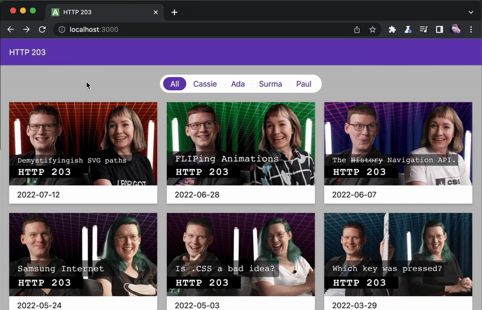
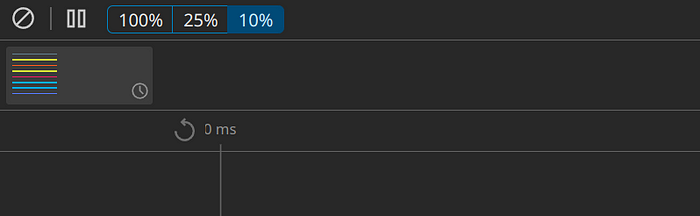
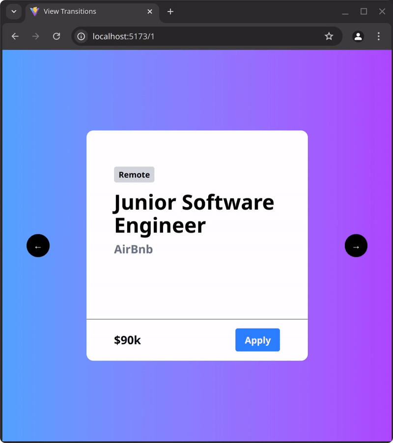
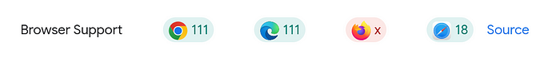

# View Transitions API：网站导航从未如此酷炫

> 原文：[View Transitions API: Navigating Websites Has Never Been Cooler](https://javascript.plainenglish.io/view-transitions-api-navigating-websites-has-never-been-cooler-3d35bc8a8676)
>
> 作者：[Digvijay Mahapatra](https://medium.com/@gitfudge)

View Transition API 彻底革新了我们在 Web 应用中处理导航的方式。跟那些生硬、突兀的页面跳转说拜拜，迎接流畅、电影般的体验，让你的网站感觉如此原生和精致，简直不要太爽！

### 传统网页导航为何如此糟糕（以及为什么你应该关心这个问题）

让我们面对现实吧：网页上的导航一直都有点...无聊透顶。点击一个链接，等待页面加载，然后砰——你来到了一个新页面。没错，它能用，但绝对称不上令人兴奋。多年来，开发者们一直依赖 JavaScript 黑魔法、CSS 动画和第三方库来创造页面之间更平滑的过渡。然而，这些解决方案通常伴随着各种代价：复杂度增加、性能开销，以及在不同浏览器之间的不一致行为。

我还记得第一次偶然发现 View Transition API 的时候，我简直惊呆了。这是一个原生的、浏览器级别的解决方案，它承诺让导航过渡变得无缝、高效，而且易于实现。感觉就像魔法一样神奇！



View Transitions 的惊艳能力展示

### View Transitions 背后的魔法

View Transition API 是一个全新的 Web 标准，它允许开发者在不同页面路由之间创建流畅、动画化的过渡。无论是在单页应用（SPA）还是多文档应用中导航，View Transition API 都让添加电影般的过渡变得超级简单，让用户体验原生而精致。

从本质上讲，这个 API 的工作原理是捕获 DOM 的旧状态和新状态的快照，在它们之间进行动画处理，然后应用最终状态。所有这些都在底层自动完成，所以你不必担心那些繁琐的细节。

### 5分钟搞定你的第一个 View Transition 动画

#### 步骤 1：JavaScript 方法

最基本的部分是使用 `document.startViewTransition(cb)` 方法。通过一个回调函数作为参数，该方法触发路由转换和快照之间的动画。

```javascript
document.startViewTransition(() => {
  performRouteChange();
});
```

#### 步骤 2：CSS 选择器

由于它保存了旧页面和新页面的快照，这些快照可以使用以下方式进行样式设置：

```css
::view-transition-old(el) {}
::view-transition-new(el) {}
```

#### 步骤 3：命名

下一个重要步骤是指定页面上哪些元素是过渡的一部分。你可以这样做：

```css
el {
  view-transition-name: content;
}

::view-transition-old(content),
::view-transition-new(content) {
  animation-duration: 5s;
}
```

`view-transition-name` 是分配给参与过渡的元素的唯一标识符。只有具有此属性的元素才会包含在过渡快照中。由于元素名称必须是唯一的，为多个元素使用相同的名称将导致运行时错误（是的，它会对你发脾气！）。

每个 `view-transition-name` 都在自己的时间线上运行，并且可以附加不同的动画。如果你希望多个元素在同一时间线上过渡，可以使用 `view-transition-class`：

```css
#card1, #card2, #card3 {
  view-transition-class: cards;
}

::view-transition-old(.cards),
::view-transition-new(.cards) {
  animation-duration: 5s;
}
```

### 超越简单的淡入淡出

值得注意的是，默认情况下，动画是页面快照之间的简单交叉淡入淡出。它可能不像上面的例子那样花哨，但这只是一个起点而已。

不过，对于那些被赋予了 `view-transition-name/class` 的元素，你可以天马行空地发挥创意，没有任何限制！

```css
::view-transition-old(content) {
  animation-duration: 5s;
  animation: slide-out-to-left;
}

::view-transition-new(content) {
  animation-duration: 5s;
  animation: slide-in-from-right;
}
```

在这个例子中，当在页面之间过渡时，当前内容会从左侧动画滑出，而新内容从右侧进入。我们稍后将探索这种动画的更多高级变体，让你的用户惊叹不已！

### 像专业人士一样调试

在构建视图过渡时，你经常需要验证和调试动画的表现。幸运的是，**动画时间线**来拯救你了！



这个强大的工具允许你放慢或停止动画，确保它们按照预期运行，让你成为动画调试大师！

### 与你喜欢的框架/库集成

虽然 `document.startViewTransition` 可以不需要任何额外代码就能运行，但一些框架/库提供了内置集成，让一切变得更加顺滑。以 React 为例：

```typescript
import { NavLink } from 'react-router-dom';

<NavLink
  to={`/${itemIndex - 1}`}
  viewTransition
  className="left-arrow"
>
  &#8594;
</NavLink>
```

`viewTransition` 属性为这个链接启用了视图过渡。默认情况下，在过渡期间，会向 `<a>` 元素添加一个 `transitioning` 类，你可以用它来自定义视图过渡，简直不要太方便！

### 构建方向性示例

让我们构建以下效果（准备好被震撼吧）：



带有视图过渡的路由导航，看起来是不是酷毙了？

你可能是比我更好的设计师，所以我会把页面的设计和样式留给你。让我们专注于实现过渡效果。

我们正在定制过渡，使其根据移动方向在屏幕内外移动。为此，你可以使用视图过渡类型，它允许你为活动的视图过渡分配一个或多个类型。例如，当转换到分页序列中的更高页面时，使用 `forwards` 类型，而当转到较低页面时，使用 `backwards` 类型。这些类型仅在捕获或执行过渡时处于活动状态，每种类型都可以通过 CSS 自定义以使用不同的动画。

```typescript
document.startViewTransition({
  update: () => navigate(`/${itemIndex - 1}`),
  types: ["backwards"],
});
```

要响应这些类型，请使用 `:active-view-transition-type()` 选择器。将你想要定位的 `type` 传递到选择器中。这让你可以将多个视图过渡的样式彼此分开，而不会让一个的声明干扰另一个的声明。

```css
html:active-view-transition-type(forwards) {
  &::view-transition-old(content) {
    animation-name: slide-out-to-left;
  }
  &::view-transition-new(content) {
    animation-name: slide-in-from-right;
  }
}

/* 仅针对 backwards 类型的动画样式 */
html:active-view-transition-type(backwards) {
  &::view-transition-old(content) {
    animation-name: slide-out-to-right;
  }
  &::view-transition-new(content) {
    animation-name: slide-in-from-left;
  }
}
```

### 浏览器支持

就像我写过的大多数东西一样，这个功能也有有限的浏览器支持，希望今年能看到这些限制被消除（让我们一起祈祷吧！）。



浏览器支持情况

### 导航的未来

View Transition API 代表了 Web 开发的重大进步。它是一个强大的工具，可以轻松创建流畅、电影般的过渡，感觉原生而精致。虽然浏览器支持仍在不断发展，但今天就可以开始在项目中使用这个 API 了。

那么，你还在等什么？开始在你的 React 应用中尝试 View Transition API，看看它如何彻底改变你的用户体验。网页导航的未来已经到来，而且比以往任何时候都更加激动人心！

### 进一步阅读

- [MDN 文档](https://developer.mozilla.org/en-US/docs/Web/API/View_Transition_API)
- [跨文档过渡](https://developer.mozilla.org/en-US/docs/Web/API/View_Transition_API/Using#a_javascript-powered_custom_cross-document_mpa_transition)
