# 14 个逻辑驱动的 UI 设计技巧，助您改善任何界面

> 原文： [《14 logic-driven UI design tips to improve any interface》](https://uxplanet.org/14-logic-driven-ui-design-tips-145ee08ea5a5)
>
> 作者：[Adham Dannaway](https://medium.com/@adhamdannaway)

> UI design tips to improve your interface designs using logic rather than gut feel.

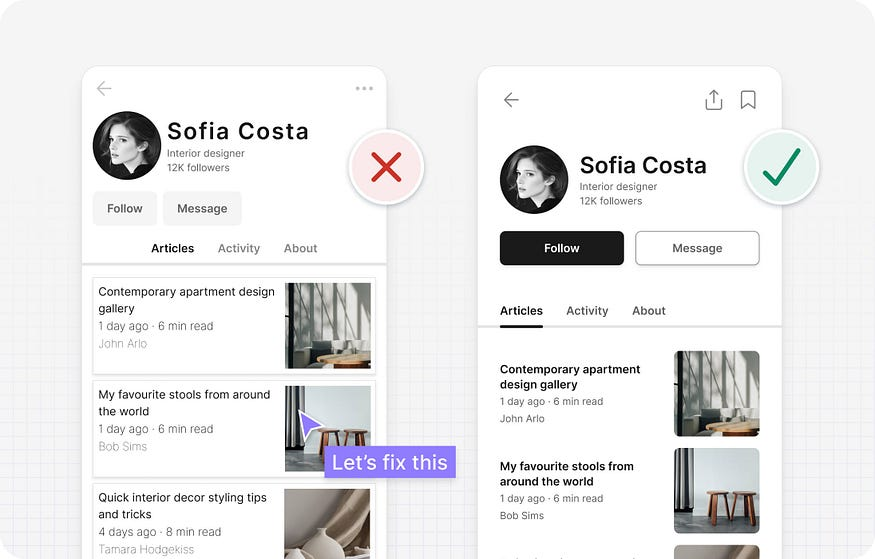

Designing user interfaces is no easy task. With countless choices around layout, spacing, typography, and colour, it’s easy to feel overwhelmed. And when you layer in considerations like usability, accessibility, and human psychology, the challenge only grows.

But here’s the good news, UI design doesn’t have to feel so complex. After more than 20 years as a product designer, I’ve found that most of my visual and interaction design decisions are guided by a clear set of logical guidelines.
Not by artistic genius or gut instinct, but by straightforward guidelines.

Of course, creative flair comes in handy, but much of what makes an interface intuitive, inclusive, and visually pleasing can absolutely be learned. Having a structured approach allows you to make smart, consistent design choices.
Without it, you’re essentially relying on trial and error to make things “look right.”

And the best way to learn? By doing. So let’s dive into some practical UI design tips.

# UI design tips to fix an example interface

The following design is for the profile page of a community blogging platform. The first example is the original design. The second is the result of quickly applying some logic-driven UI design tips.

Even if you don’t have much experience with UI design, you can probably tell that the original design just doesn’t feel “right”. That’s because it contains a bunch of design flaws that can negatively impact usability. You might already have spotted some of them.

Now, let’s walk through the process of improving the original design, addressing each issue step by step with these UI design tips:

1. [Space elements based on how closely related they are](https://uxplanet.org/14-logic-driven-ui-design-tips-145ee08ea5a5#3c5c)
2. [Ensure interface elements have a 3:1 contrast ratio](https://uxplanet.org/14-logic-driven-ui-design-tips-145ee08ea5a5#1d27)
3. [Use a single primary button for the most important action](https://uxplanet.org/14-logic-driven-ui-design-tips-145ee08ea5a5#b278)
4. [Ensure buttons have a sufficient target size](https://uxplanet.org/14-logic-driven-ui-design-tips-145ee08ea5a5#b126)
5. [Make sure important content is visible](https://uxplanet.org/14-logic-driven-ui-design-tips-145ee08ea5a5#51f3)
6. [Decrease letter spacing for large text](https://uxplanet.org/14-logic-driven-ui-design-tips-145ee08ea5a5#9a70)
7. [Don’t rely on colour alone as an indicator](https://uxplanet.org/14-logic-driven-ui-design-tips-145ee08ea5a5#95e1)
8. [Try to avoid using multiple alignments](https://uxplanet.org/14-logic-driven-ui-design-tips-145ee08ea5a5#7605)
9. [Ensure text has a 4.5:1 contrast ratio](https://uxplanet.org/14-logic-driven-ui-design-tips-145ee08ea5a5#f4d6)
10. [Consider removing containers to simplify an interface](https://uxplanet.org/14-logic-driven-ui-design-tips-145ee08ea5a5#f9ab)
11. [Use regular and bold font weights only](https://uxplanet.org/14-logic-driven-ui-design-tips-145ee08ea5a5#6488)
12. [Be consistent](https://uxplanet.org/14-logic-driven-ui-design-tips-145ee08ea5a5#dec6)
13. [Don’t confuse minimalism with simplicity](https://uxplanet.org/14-logic-driven-ui-design-tips-145ee08ea5a5#2bf4)
14. [Balance icon and text pairs](https://uxplanet.org/14-logic-driven-ui-design-tips-145ee08ea5a5#1adc)

# 1. Space elements based on how closely related they are

The amount of spacing between interface elements should depend on how closely related the elements are. More closely related elements should generally be closer together to show that they’re related. Unrelated elements should be separated by placing more space between them.

Using spacing in this way is one of the most powerful methods of breaking up information into smaller groups. If you think of each group as a rectangle, you’ll start to notice that interfaces are made up of many small rectangles within larger ones.
Start by applying small spacing to the innermost rectangles and gradually increase the spacing between rectangles as you move outwards.

Deciding on the ideal spacing between interface elements can be a frustrating and time consuming task. There are endless options to choose from. Rather than using trial and error, one pixel at a time, create a simple set of predefined spacing options to make decisions faster.

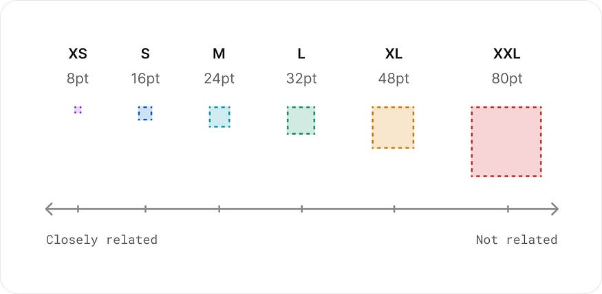

Set simple t-shirt sized spacing options based on increments of 8 points. This is also known as using an 8 point grid, as all interface elements will end up aligning to a series of vertical and horizontal guidelines separated by 8 points.
For more detailed interfaces, you could use 4 point increments for a bit more control.

Much like a typography scale, your spacing options should grow by larger amounts as they get bigger. This ensures that spacing is proportional for larger interface elements.

In our example, only the extra small (8pt) and small (16pt) predefined spacing options are used between rectangles, regardless of how closely related they are. This results in a design that looks cluttered, squashed, and difficult to understand.
Increasing the spacing between elements based on how closely related they are helps to clearly separate and group content.

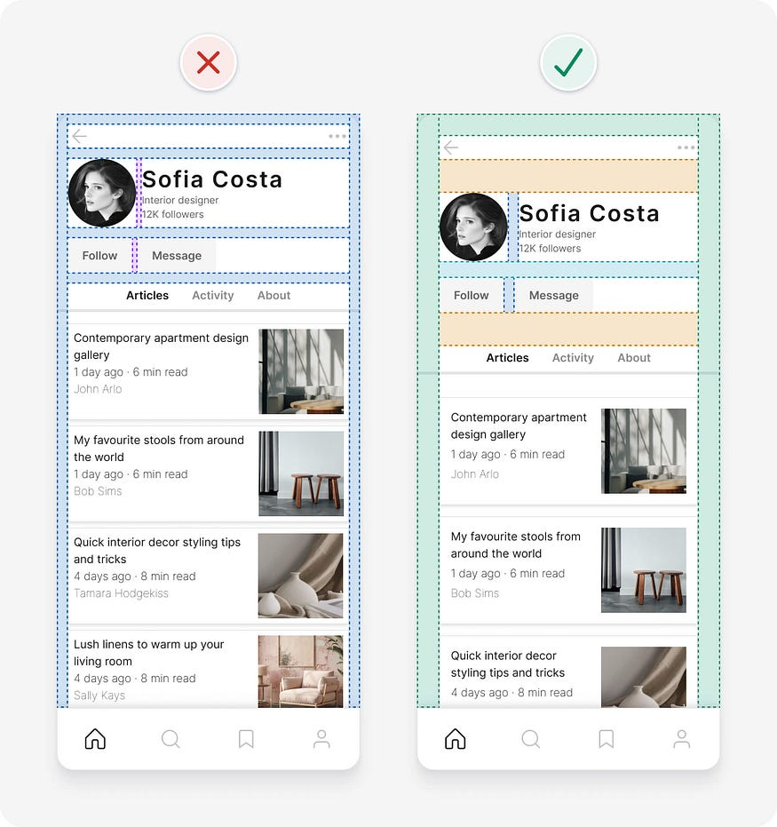

Here’s what our example looks like before and after the predefined spacing options are applied.

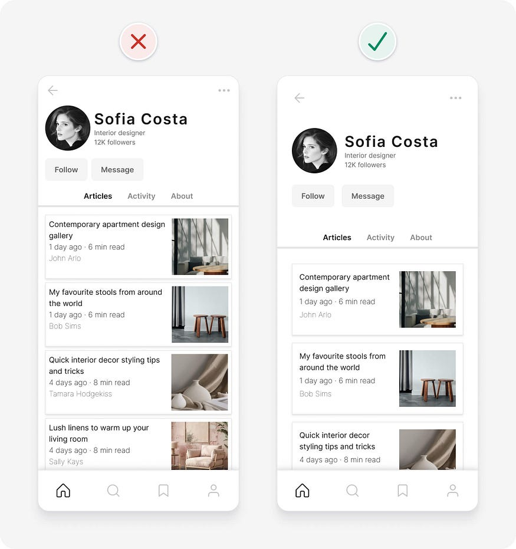

# 2. Ensure interface elements have a 3:1 contrast ratio

Contrast is a measure of the difference in perceived brightness between two colours. It’s expressed as a ratio ranging from 1:1 to 21:1.
For example, black text on a black background has the lowest 1:1 contrast ratio, whereas black text on a white background has the highest 21:1 ratio. There are lots of tools and [Figma plugins](https://www.adhamdannaway.com/blog/web-design/10-best-figma-plugins-for-web-design-in-2024) to help you measure colour contrast, my favourites are the [Web AIM online contrast check tool](https://webaim.org/resources/contrastchecker/) and the [Contrast Figma plugin](https://www.figma.com/community/plugin/748533339900865323/contrast).

In order to help ensure people with vision impairments can clearly see interface details, aim to at least meet [Web Content Accessibility Guidelines (WCAG) 2.1](https://www.w3.org/TR/WCAG21/) level AA colour contrast requirements. This means user interface elements, like form fields and buttons, need to have at least a 3:1 contrast ratio.

In our example, the contrast of the icons and buttons is too low. The risk with the low contrast buttons is that people with low vision might not identify them as buttons, as they can’t see the button shape.
Adding a border with sufficient contrast to the buttons makes them accessible. The light grey background fill is also removed from the buttons, so people don’t mistake them for being disabled or inactive.
The low contrast of the icons is easily fixed by using a darker shade of grey.

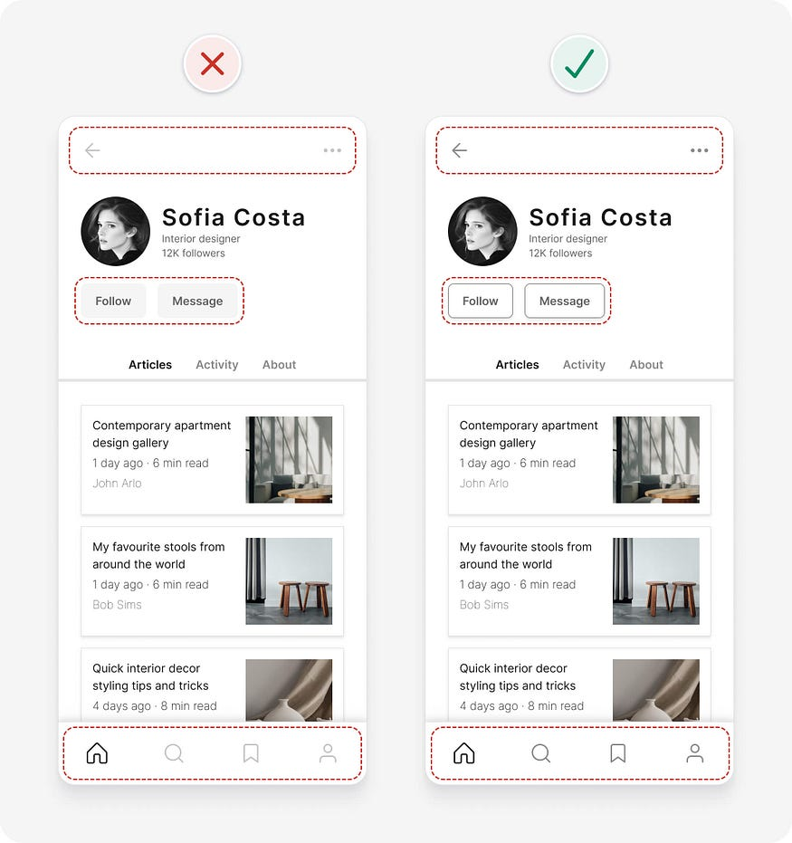

# 3. Use a single primary button for the most important action

For most website or app projects, you’ll need 3 button weights to indicate the importance of actions: primary, secondary, and tertiary. You may also require smaller and/or larger button sizes depending on the complexity of the interface.

The following button styles are familiar, accessible, and have a clear visual hierarchy that isn’t dependent on colour alone. They’re not the only way to style buttons, but they’re a safe option. Learn more [button design tips](https://www.adhamdannaway.com/blog/ui-design/button-design-tips) to avoid common mistakes.

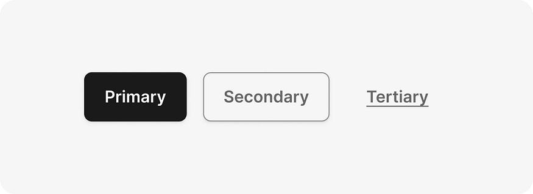

The purpose of a primary button is to highlight the most important action on an interface. This helps people understand what to do next in order to complete their task.

Guidelines for using primary buttons:

- If there isn’t a single most important action on an interface, use secondary or tertiary buttons for those actions.
- Avoid using multiple primary buttons on a screen. They can compete for attention and cause confusion around what to do next.

In our example, let’s assume that the “follow” action is the most important and make it a primary button.

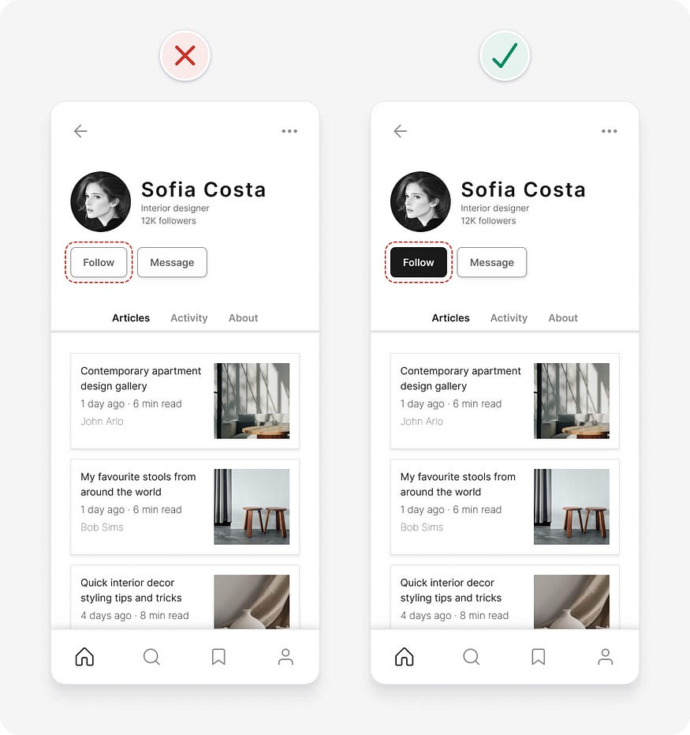

# 4. Ensure buttons have a sufficient target size

Small targets are more difficult to click or touch than large ones. This is especially true for those with impaired motor control, or even someone holding their phone with one hand and using their thumb.

Try and stick to the following guidelines to ensure buttons (and other interactive elements) have a sufficient target size:

- Make buttons at least 48pt by 48pt in size. This aligns with an 8pt grid and is slightly larger than the WCAG recommendation of 44pt by 44pt.
- Make frequently used buttons even larger to improve efficiency and to help avoid them being missed.
- Separate buttons by at least 8pt to help prevent people mistakenly pressing the wrong one.

In our example, the target size of the 2 buttons is already sufficient, but there’s plenty of room to make the buttons wider. Since there’s room, you can widen the buttons to increase their target size.

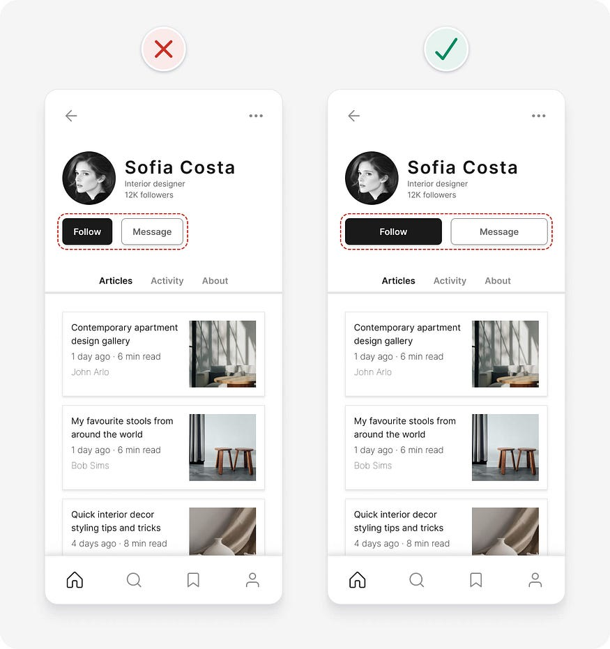

# 5. Make sure important content is visible

People don’t use what they can’t see. Hiding things behind interactive menus is a convenient way to keep an interface clean and minimal, but it’s risky, as some people might miss those things.
If there’s space, try to ensure important content and actions are visible when they’re needed.

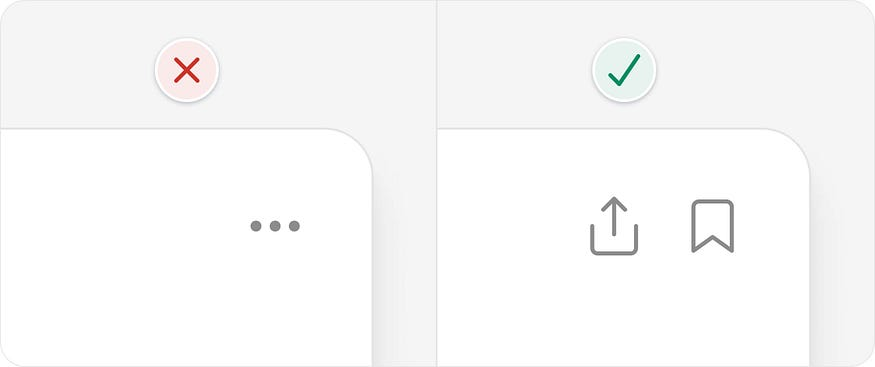

In our example, actions are hidden inside an interactive menu to help declutter the design. While it looks clean and minimal, there’s a risk that some might miss the actions.
Since there’s space to display the 2 actions, “share” and “bookmark”, make them visible to help ensure they’re not missed.

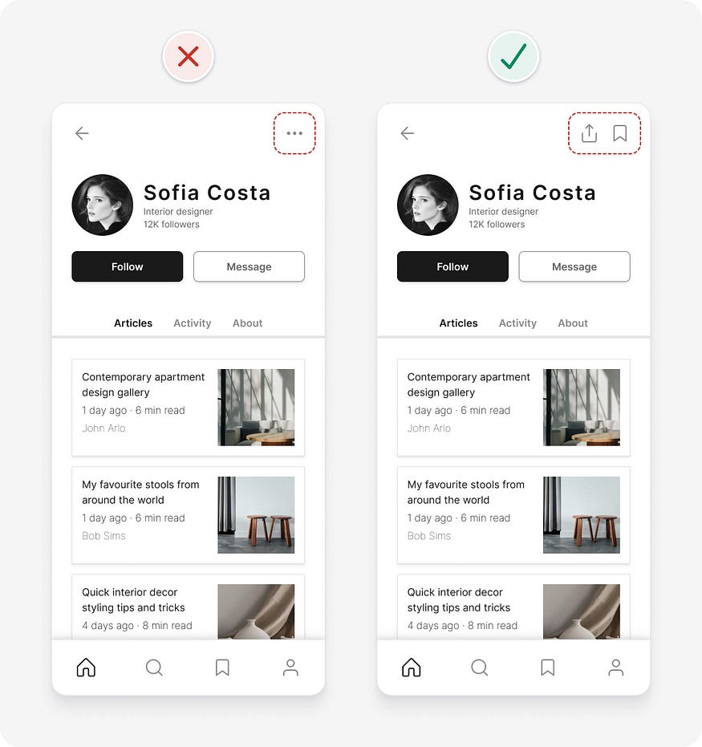

# 6. Decrease letter spacing for large text

A small trick to make large headings look better is to decrease their letter spacing (space between letters). How much you decrease letter spacing depends on the typeface and size, but generally, you’ll want to decrease letter spacing more as text gets bigger.

This is because many typefaces were designed to be read at small sizes in long body text. They’re known as “text type” typefaces and have wide letter spacing to make them more legible at small sizes.
You probably won’t need to decrease letter spacing for “display type” typefaces, as they were designed to be used at large sizes and generally have closer letter spacing.

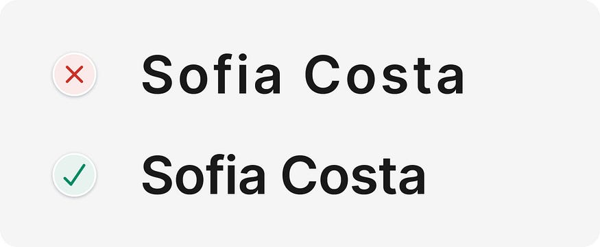

In our example, the letter spacing of the person’s name is decreased to improve aesthetics.

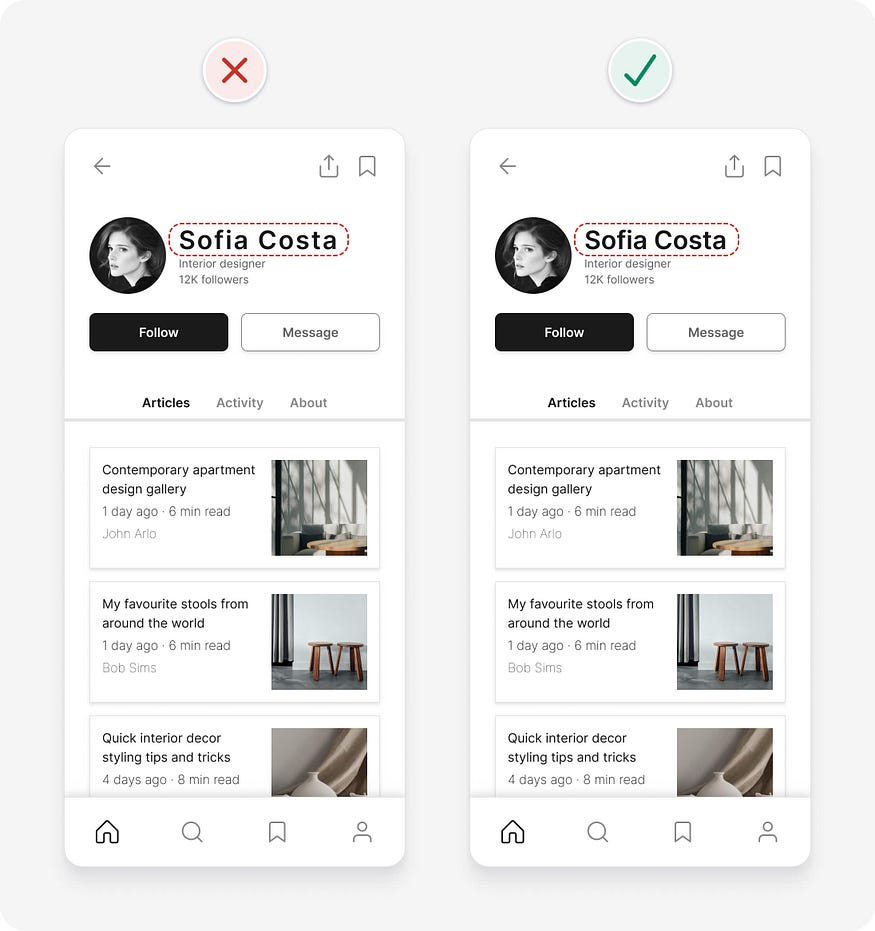

# 7. Don’t rely on colour alone as an indicator

Don’t rely on colour alone to convey meaning or distinguish visual elements, as those with low vision or colour blindness might not be able to see the indicator. Use additional visual cues to differentiate interface elements.

In our example, there are 2 areas that could be confusing. Let’s make them clearer.

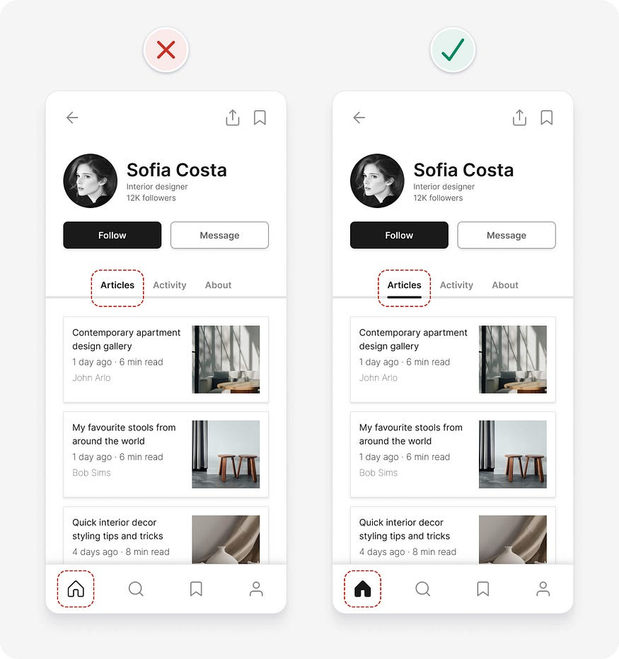

If you look at the 3 tabs above the article list, it might not be obvious that “articles” is the selected tab. This is because a very subtle difference in colour is being used to indicate that a tab is selected. Adding an underline to the selected tab helps to make it clearer.

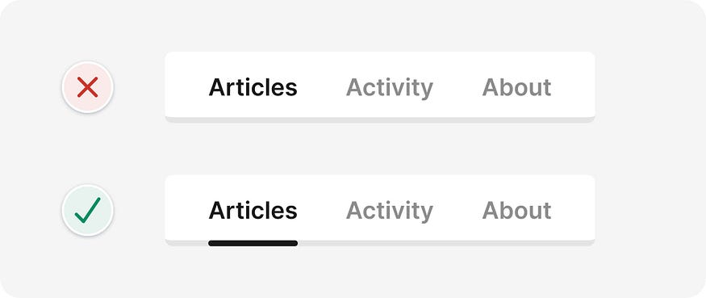

Similarly, in the bottom navigation, a subtle colour change is being used to differentiate the selected icon from others. To make it more obvious, the selected icon is filled.

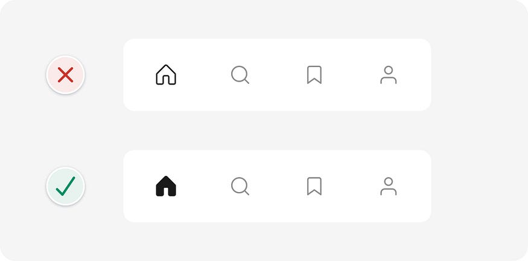

# 8. Try to avoid using multiple alignments

The more different types of alignment you use (left, right, or centre), the more complex and messy an interface can look. Our eyes are forced to work harder as they move around to try and follow each alignment.
This is highlighted when multiple different alignments are used within a small component or section of an interface.

Sticking with a single alignment (or as few as possible) helps to simplify an interface, making it look neater and tidier.

In our example, the tabs are centre aligned, while most of the other elements on the page are left aligned. The mixture of alignments adds unnecessary complexity, resulting in a slightly increased cognitive load (the amount of brain power required to use an interface).
Left aligning the tabs helps to tidy things up.

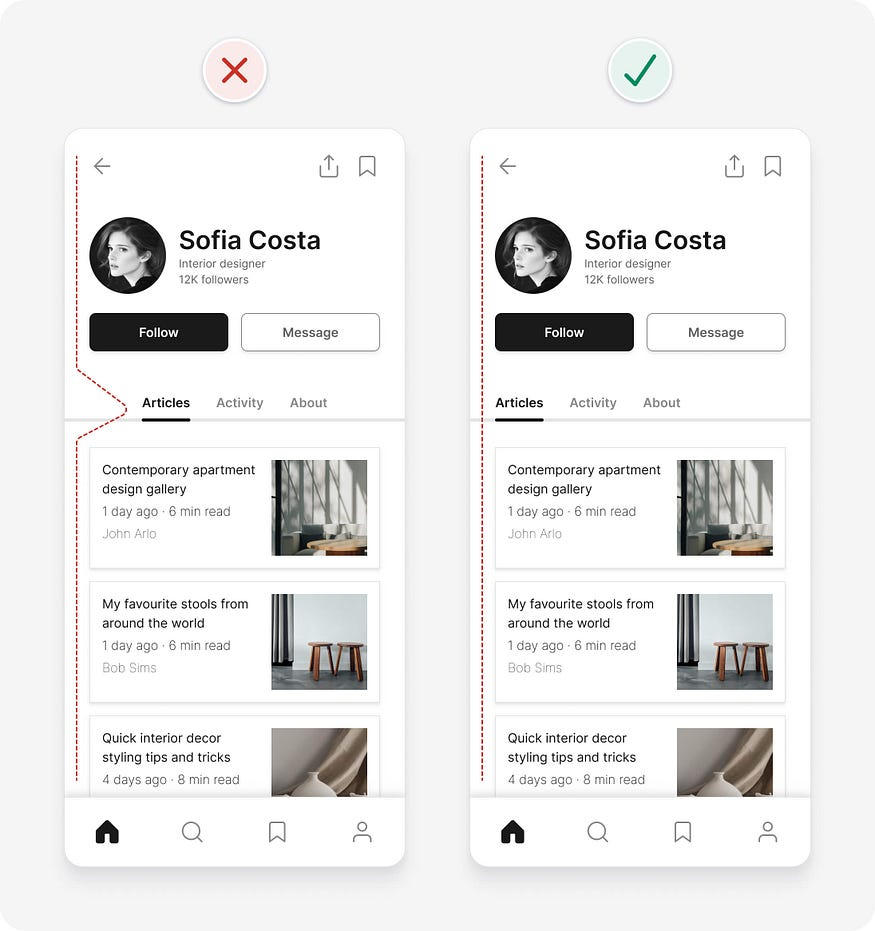

# 9. Ensure text has a 4.5:1 contrast ratio

In order to help ensure people with vision impairments can clearly read text, it needs to meet the following WCAG 2.1 level AA contrast requirements:

- Small text (18px and under) needs a minimum contrast of 4.5:1.
- Large text (above 18px with bold weight or above 24px with regular weight) needs a minimum contrast of 3:1.

In our example, the small text on the unselected tabs has insufficient contrast. Using a darker grey gives us sufficient contrast.

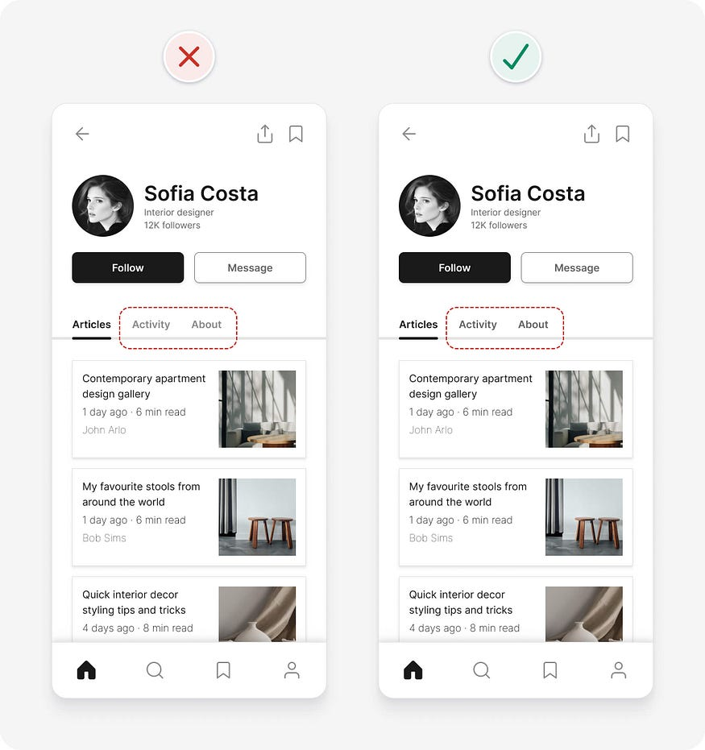

# 10. Consider removing containers to simplify an interface

Breaking up information into smaller groups of related elements helps to structure and organise an interface. This makes it faster and easier for people to understand and remember.

You can group related elements using the following methods:

1. Place related elements in the same container
2. Space related elements close together
3. Make related elements look similar
4. Align related elements in a continuous line

Using containers is the strongest visual cue to group interface elements, but it can add unnecessary clutter. Look for opportunities to use other grouping methods, they’re often more subtle and can help simplify designs.

In our example, the containers around each article are unnecessary, as multiple other grouping methods are already being used. Removing the containers also creates more room for the content.

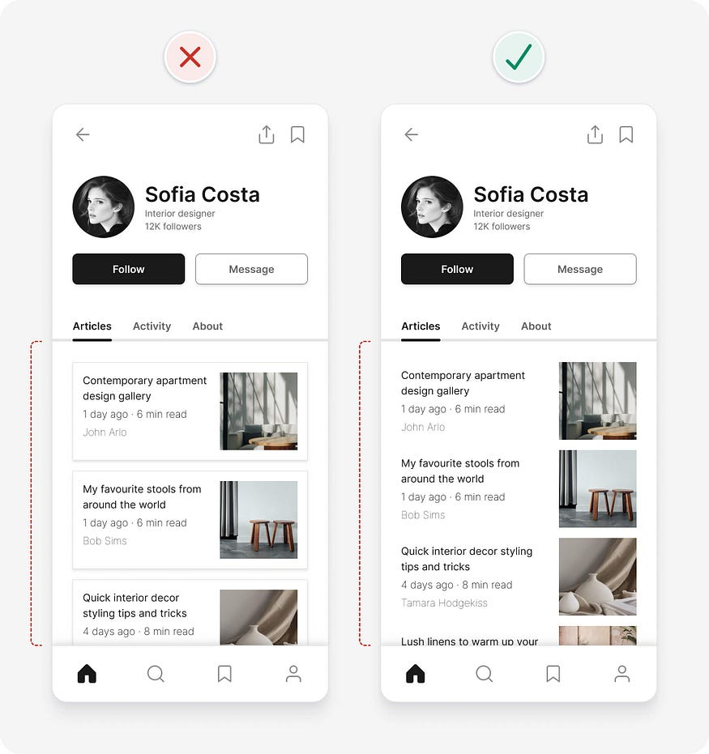

# 11. Use regular and bold font weights only

Just because there are lots of font weights available in a typeface, doesn’t mean you need to use all of them in your UI designs. Using lots of different font weights can add noise and clutter to your interface.
It also makes it more difficult to use each font weight consistently.

Keep your [design system](https://www.practical-ui.com/design-system/) simple and concise by using regular and bold font weights only. Some typefaces have a semi-bold font option that you can use instead of bold if bold is too heavy.

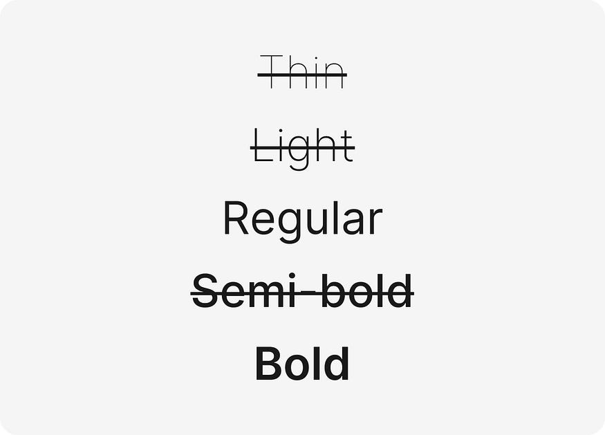

Quick usage tips:

- Use bold font weight for headings to emphasise them.
- Use regular font weight for other smaller text.
- If you decide to use very thin or thick font weights, reserve them for headings and larger text, as they can be difficult to read at smaller sizes.

In our example, 3 different font weights are used for the article details. Even though the contrast of the “extra light” and “thin” font weights is above the required 4.5:1 contrast ratio, the characters could still be difficult for some people to read.
Increasing the font weight to “regular” helps improve readability and simplifies the design. Using “semi-bold” for the article title helps it stand out.

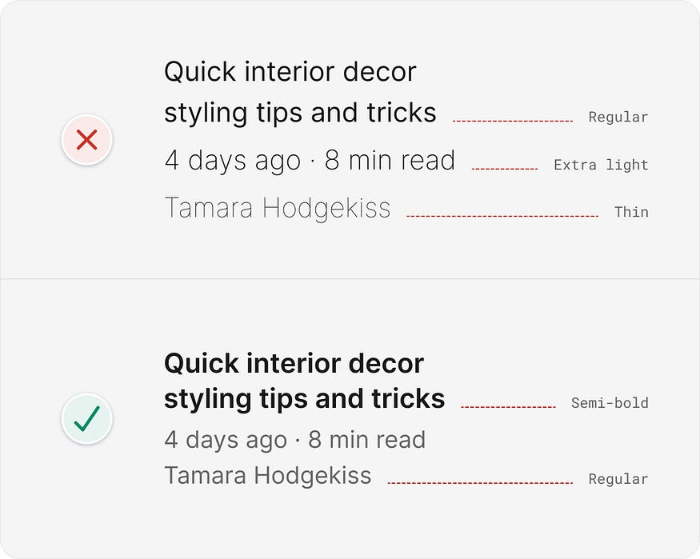

Using only 2 font weights results in the following design. We’re making good progress applying the UI design tips, but we’ve still got a few more issues to fix.

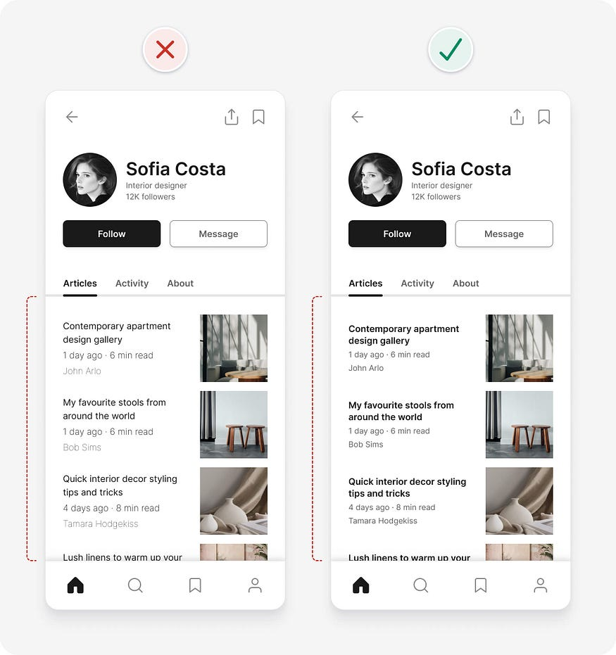

# 12. Be consistent

Consistency in UI design means that similar elements look and work in a similar way. This should be true both within your product and when compared with other well-established products.
This predictable functionality improves usability and reduces errors, as people don’t need to keep learning how things work.

In our example, the photos for each article have sharp corners, which doesn’t match the soft rounded corners of the buttons and icons. Rounding the corners of the photos helps to create a more consistent visual language.
You might not think that tiny details like this make much difference, but they all add up to make a design feel “right”.

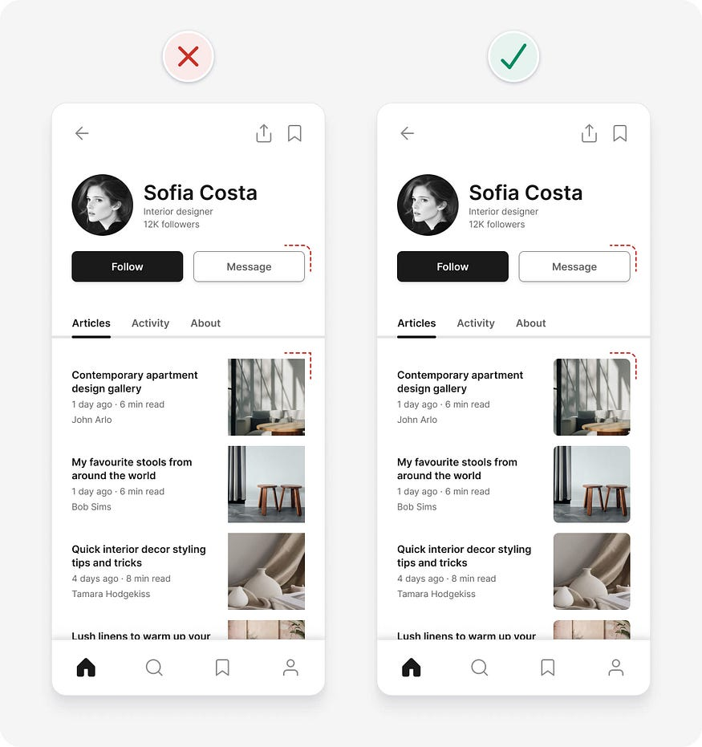

# 13. Don’t confuse minimalism with simplicity

Minimal doesn’t mean simple. Designers have a tendency to favour minimal interfaces, as they can look beautiful and clean. A minimal interface has fewer elements and styles, but isn’t necessarily simple to understand and use.

Minimal interfaces can often be vague or confusing as they lack crucial details needed for good usability. Simplification isn’t just about reduction. Removing or hiding too much can harm usability. You need to make sure that you’re not removing critical information or details.

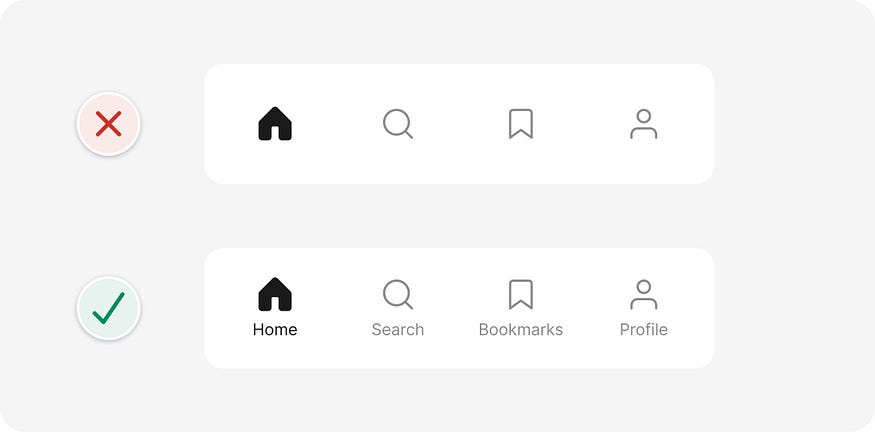

In our example, the bottom navigation icons look clean and minimal, but is it clear what they mean? It might not be to everyone.
Adding text labels to the icons helps ensure people can understand what they mean, especially those using screen readers (software that describes an interface, using speech or braille, to someone who can’t see it).

# 14. Balance icon and text pairs

When pairing icons with text, try to ensure they have a similar visual prominence for a more balanced and cohesive look.

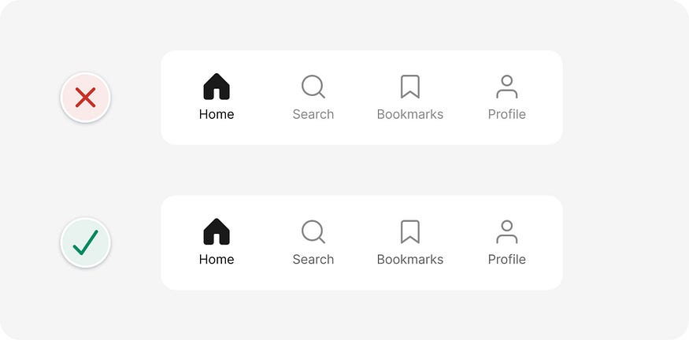

In our example, the icon and text pairs in the bottom navigation are slightly imbalanced. The icons and text are the same colour, but the icons are thicker and larger, which gives them more prominence. Darkening the text increases its prominence, so it’s balanced with the icons.
Increasing the text contrast to at least 4.5:1 also ensures it’s accessible to those with low vision.

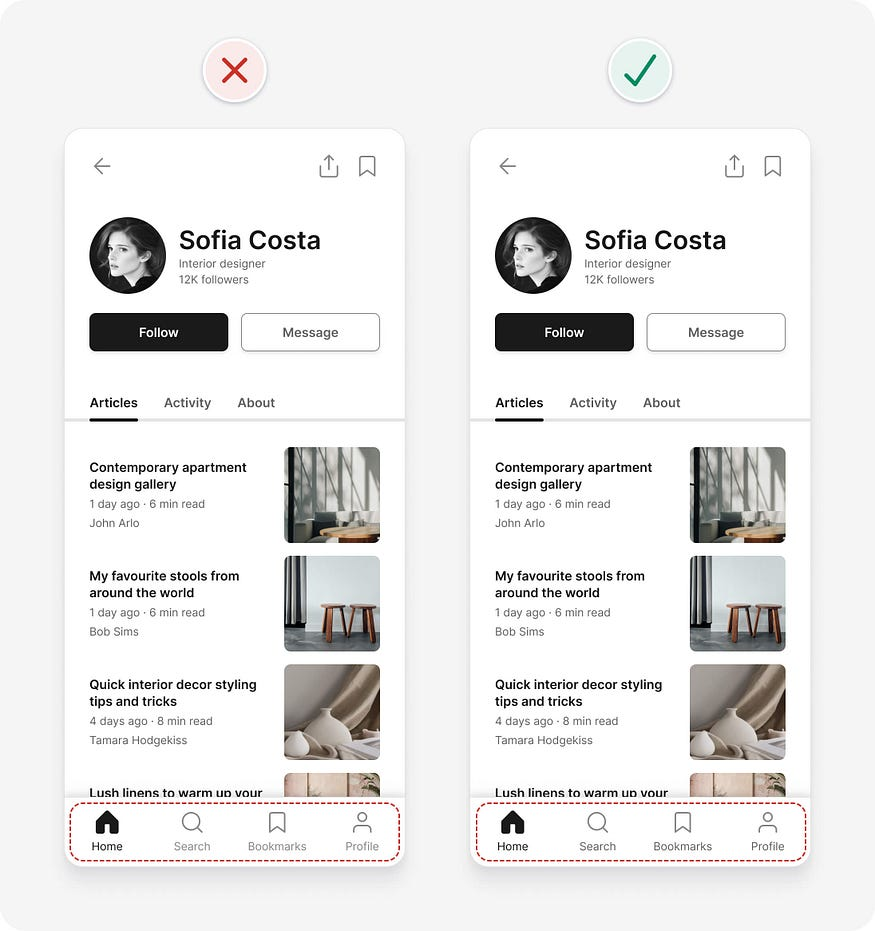

# We did it!

With just a few straightforward UI design tips, we were able to identify and resolve a range of issues in our example interface. Of course, you could take things further by adapting the visual style to suit a particular brand personality if needed.
For this example though, we were focused on getting the fundamentals right.

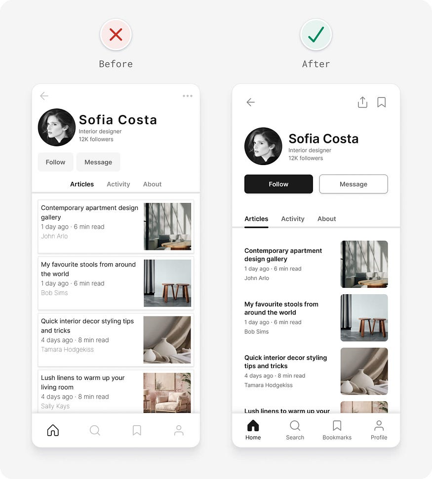

I hope you’re starting to see that UI design doesn’t need to feel overwhelming. While it can sometimes seem like a mysterious art reserved for the naturally talented, much of great interface design is rooted in clear, logical guidelines like the ones you’ve learned here.

Relying on objective guidelines, rather than subjective opinion, makes it far easier (and faster) to design interfaces that are intuitive, accessible, and visually polished.
The more you practise using these UI design tips, the more naturally they’ll become part of your design process. Use them as a foundation and don’t be afraid to explore, experiment, and push your creativity from there.

# Want more UI design tips?

These are just a few of the logic-driven UI design tips from my [UI design book](https://www.practical-ui.com/). You’ll find hundreds more with detailed examples in the book. You can also take a behind the scenes look at the [making of the book](https://www.adhamdannaway.com/portfolio/ui-design-book) if you’re interested.

🚨 [**Get 40% off the book until 30 June 2025.**](https://www.practical-ui.com/)

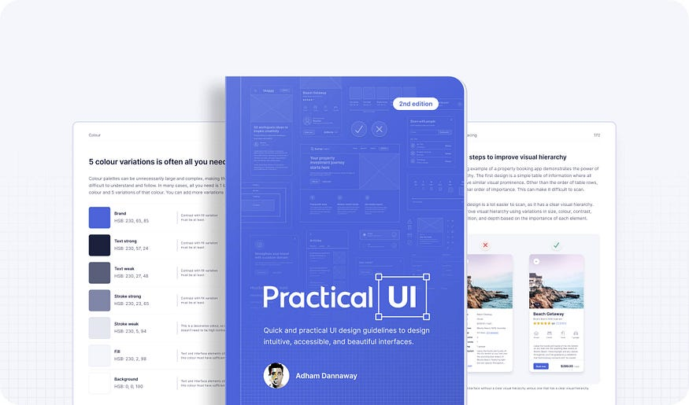

PS If you found this article helpful, giving it a few claps👏 would mean the world to me. Follow me on [X](https://x.com/AdhamDannaway) and [LinkedIn](https://au.linkedin.com/in/adhamdannaway) for daily design tips, tools, resources, and inspiration.