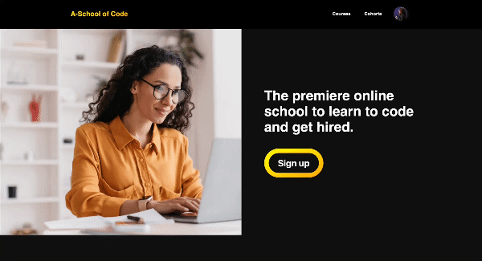
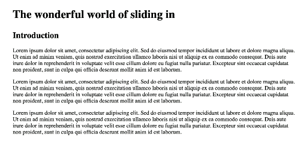

# 仅用CSS实现滚动驱动动画完全指南

> 原文：[《A guide to Scroll-driven Animations with just CSS》](https://webkit.org/blog/17101/a-guide-to-scroll-driven-animations-with-just-css/)
>
> 作者：WebKit 团队 - Saron Yitbarek

自从[苹果在2007年首次将CSS动画引入网络](https://webkit.org/blog/138/css-animation/)以来，CSS动画已经走过了漫长的道路。最初只是像从一种颜色过渡到另一种颜色这样的[简单效果](https://webkit.org/blog/324/css-animation-2/)，如今已经演变成华丽、复杂的图像在页面上飞舞、变形。

但是，将这些动画与用户的滚动等行为联系起来，传统实现上需要第三方库和相当多的JavaScript，这会给你的代码增加一些复杂性。但现在，我们只需几行CSS，就能让这些动画由用户的滚动行为来进行驱动。

目前，滚动驱动的动画得到了更多浏览器的支持，并在Safari 26 beta中也变得可用了，这让你更容易在页面上创造出引人注目的效果。

现在，就让我来告诉你怎么实现滚动驱动的动画吧。

首先，让我们来分解一下滚动驱动动画的组成部分。

一个滚动驱动的动画有三个部分：


- **目标（target）：** 我们要在页面上制作动画的东西。
- **关键帧（keyframes）：** 用户滚动时元素会发生什么变化。
- **时间线（timeline）：** 决定动画是否进行。

这三个部分最棒的地方在于，其中两个你可能已经很熟悉了。

第一个，target。可以是你想在页面上移动的任何东西，随心所欲地设置样式。

第二个，关键帧，是已经存在多年的经典CSS动画。创造出惊艳的滚动驱动动画在很大程度上取决于你的动画有多棒。如果你是CSS动画的新手，可以看看[MDN的资源](https://developer.mozilla.org/en-US/docs/Web/CSS/animation)。

第三个部分，时间线，可能不太熟悉，但它是滚动驱动动画的重要组成部分。让我们来更详细地探讨一下。

## **什么是时间线？**

动画有开始、中间和结束，沿着时间线顺序进行。网络上的默认时间线叫做**文档时间线（document timeline）**，它是基于时间的。这意味着随着时间的推移，时间线也会前进。

如果我有一个使用默认时间线的动画，它会随着时间的推移而动。如果我从一个绿色的圆圈开始，想用默认时间线来制作一个颜色变化的动画，那么我可能会让它在第一秒变成红色，一秒后变成蓝色，第三秒变成黄色。颜色随着时间而变化。

这就是动画多年来的工作方式。然后，在[2023年6月的CSS动画第二级规范](https://www.w3.org/TR/css-animations-2/#changes-level-1)中引入了`animation-timeline`属性。这让我们能够思考除了时间流逝之外，可能影响动画的其他因素，比如用户在我们的网页上上下滚动，从而使滚动驱动的动画成为可能。

有了滚动驱动的动画，我们不再使用时间。取而代之的是，我们有两种新的时间线可以使用：滚动（scroll）和视图（view）。

### `scroll()` 时间线

使用滚动时间线，动画不会随时间推移而进行——它会根据用户的滚动而进行。

如果用户开始滚动，动画就开始。滚动停止的那一刻，动画也停止。正是这种新的时间线在滚动和动画之间建立了联系。

演示滚动驱动动画工作原理的一个常见方法是创建一个进度条。实际上，既然你已经有了滚动条，你并不需要这样的进度条，但这是一个很容易理解的例子，所以我们就用它吧。

首先要做的是**创建我的目标**，也就是我们要制作动画的元素。

让我们把这个目标作为我的一个编程学校网站“A-School of Code”的一部分来构建。如果我们要创建一个在页面底部的进度条，我们可能会把它作为我们页脚的一个伪元素添加。我们希望它从左下角开始，向右前进。

代码可能看起来像这样：

```css
footer::after {
  content: "";
  height: 1em;
  width: 100%;
  background: rgba(254, 178, 16, 1);
  left: 0;
  bottom: 0;
  position: fixed;
}
```

这会让我们在页面上得到一个窄窄的黄色条（由粉色箭头高亮显示）：


接下来，我们需要我们的**关键帧**来创建实际的动画。

我们要给我们的关键帧一个自定义的名字，比如说“progress-expand”，像这样：

```css
@keyframes progress-expand {
  from { width: 0% }
  to { width: 100% }
}
```

第三，我们需要使用我们新的**时间线**——`scroll()`。这告诉我的浏览器，动画只应该在我的用户滚动时生效，使其成为一个滚动驱动的动画。

```css
footer::after {
  ...
  animation-timeline: scroll();
}
```

最后，我们需要通过向我们的进度条添加`animation`属性来将我们的三个组件联系在一起，像这样：

```css
footer::after {
  ...
  animation: progress-expand;
  animation-timeline: scroll();
}
```

注意：你的`animation-timeline`属性必须在你的`animation`属性之后设置，否则这将不起作用。

就这样，你就有了你的第一个滚动驱动的动画。

因为我们在页面上添加了动效，所以在发布之前我们需要考虑一件事。我们刚刚添加的动效会给我们的用户带来任何运动不适吗？我们的页面是否无障碍？

进度条的微妙、通常缓慢的移动不太可能成为运动敏感性的触发因素，部分原因是因为它没有占据观察者视野的太多部分。相比之下，更大、更宽视野的动画通常模拟三维空间中的运动，使用视差、缩放或其他景深技术（如焦距模糊）等技术。有运动敏感性的用户更有可能将这些更大的动画体验为三维空间中的真实运动，因此更有可能经历不适或头晕等其他负面症状。

如有疑问，最好将你的动画包裹在一个检查减少动效偏好的媒体查询中，像这样：

```css
@media not (prefers-reduced-motion) {
    /* 动画在这里 */
}
```

这样，你的动画只会在用户没有设置减少动效偏好的情况下运行。要了解更多关于何时使用prefers-reduce-motion的信息，请阅读我们的文章《响应式动效设计》(https://webkit.org/blog/7551/responsive-design-for-motion/)。在这种情况下，我认为我们的动画是安全的。

这是我们的最终效果：



为了方便查看，这里是所有的代码：

```css
footer::after {
  content: "";
  height: 1em;
  width: 100%;
  background: rgba(254, 178, 16, 1);
  inset-inline-start: 0;
  bottom: 0;
  position: fixed;
  transform-origin: top left;
  animation: grow-progress linear;
  animation-timeline: scroll();
}

@keyframes grow-progress {
  from { transform: scaleX(0); }
  to { transform: scaleX(1); }
}
```

### `view()` 时间线

我们在上面例子中使用的`scroll()`时间线，一旦我们开始滚动就会激活，而不管用户能看到什么，或者它何时出现在视口中。

这可能正是你想要的，但更多时候，你希望动画在你的目标元素出现在页面上时发生。

你的元素可以是任何东西——一个轮播图、一个菜单、一个图片库。但无论它是什么，在大多数网站上，你想要制作动画的元素通常不会永久地在页面上可见。相反，当用户探索你的网站，向下滚动足够远时，它才会探出头来进入视口。

所以，我们不希望在用户开始滚动时激活时间线，而是希望在元素出现在视口中时激活时间线，为此，我们需要为我们的动画使用一个不同的时间线——`view()`时间线。

为了看看它是如何工作的，让我们看一个简单的例子，当我们在滚动时，一张图片进入我的视口时滑入到位。

我将从一篇使用占位符文本的基本文章开始，并在页面的不同部分插入几张图片。由于图片在文章的更下方，所以在页面首次加载时它们不在视口中。

让我们重新审视一下我需要的滚动驱动动画的三件事：

- **目标：** 我们要在页面上制作动画的东西
- **关键帧：** 用户滚动时元素会发生什么变化
- **时间线：** 决定动画是否进行

我的目标是文章中的图片，我已经在我的HTML中有了。太棒了！搞定一个，还剩两个。

接下来，我需要设置我的关键帧。这是滚动驱动动画的动画部分。

我希望这里发生两件事——我希望图片淡入，并且我希望它从右侧滑入。我可以用以下代码实现：

```css
@keyframes slideIn {
  0% {
    transform: translateX(100%);
    opacity: 0;
  }
  100% {
    transform: translateX(0%);
    opacity: 1;
  }
}
```

最后，我需要在我的图片标签中设置我新的`animation-timeline`，以便它在视口中时激活。

```css
img {
  animation-timeline: view();
}
```

现在我已经有了我的三个部分，我需要通过在我的图片上设置`animation`属性来将它们全部整合在一起。

记住，首先设置`animation`属性很重要。否则，这将不起作用。

```css
img {
  animation: slideIn;
  animation-timeline: view();
}
```

这就给了我们想要的漂亮的滑动效果。



但是对于这个动画，我还有一件事想做。你会注意到，图片直到几乎要离开视口时才完成滑入。这意味着我们的图片在它可见的整个时间内都在运动，这对我们的用户来说不是一个很好的体验。

我们真正想要的是让它滑入到位，然后在那里停留一会儿，这样用户就可以在没有所有运动干扰的情况下适当地欣赏它。我们可以使用另一个叫做`animation-range`的属性来做到这一点。

`animation-range`告诉我们的浏览器在我们的时间线上何时开始和停止动画。默认范围是0%到100%。0%代表目标元素开始进入我们视口的那一刻。100%代表目标元素完全退出我们视口的那一刻。

因为我们没有设置我们的`animation-range`，所以我们使用的是默认值。这意味着我的图片第一个像素一进入我的视口，我的动画就开始了，直到最后一个像素退出才结束。

为了让我的用户更容易地看到这些图片，我希望动画在它们大约穿过视口一半时停止。在那时，我希望图片找到它的位置并停在那里。要做到这一点，我将把我的范围改为0%和50%，像这样：

```css
img {
  animation: slideIn;
  animation-timeline: view();
  animation-range: 0% 50%;
}
```

而这一次，动画在图片到达页面一半时停止，就像我想要的那样。


你感觉到这个变化的区别了吗？它是否让看图片更容易了？你认为一个不同的范围会更好吗？问我们自己这些问题可以让我们更好地理解这些变化对我们的用户意味着什么，所以花点时间反思是很好的。

在发布之前要考虑的另一件事是这个动画对我们运动敏感用户的影响。就像我们之前的例子一样，因为我们引入了运动，我们必须检查我们是否触发了可能的运动不适。

在这种情况下，我有一个比我的进度条更大的动画。我页面上的图片相当大，如果你不期望它们移动并且你滚动得太快，它们可能会飞速掠过。这可能会引起不适。因为我想安全起见，我将把它放在一个减少动效的查询中，所以我的最终代码将看起来像这样：

```css
img {
  @media not (prefers-reduced-motion) {
    animation: slideIn;
    animation-timeline: view();
    animation-range: 0% 50%;
  }
}
```

现在，我可以发布了。

## 后续

你可以用动画时间线和动画范围做更多的事情。因为`scroll()`和`view()`是函数，你可以传入特定的值来真正地定制你的滚动驱动动画的工作方式。你可以改变默认的滚动器元素。那是设置了时间线的带有滚动条的元素。如果你什么都不传，这个的默认值是`nearest`，它会找到最近的有滚动条的祖先。但你也可以把它设置为`root`和`self`。你可以改变的第二个值是滚动条轴。默认是`block`，但你也可以把它设置为`inline`、`x`和`y`。自己试试不同的值，看看它们是如何工作的。

你还可以在你的动画元素的进入和退出周围做更多的事情，以获得你想要的确切效果。我们将在未来的文章中介绍这些。与此同时，在Safari 26 beta中玩转滚动和视图时间线，看看你如何提升你的网站或网络应用的用户交互。

当你这么做的时候，告诉我们你对滚动驱动动画的想法。给我，Saron Yitbarek，在[BlueSky](https://bsky.app/profile/saron.bsky.social)上发个消息，或者联系我们的其他布道者——Jen Simmons，在[Bluesky](https://bsky.app/profile/jensimmons.bsky.social) / [Mastodon](https://front-end.social/@jensimmons)上，和Jon Davis，在[Bluesky](https://bsky.app/profile/jondavis.bsky.social) / [Mastodon](https://mastodon.social/@jondavis)上。你也可以在[LinkedIn](https://www.linkedin.com/in/apple-webkit/)上关注WebKit。如果你发现一个bug或问题，请提交一个[WebKit bug报告](https://bugs.webkit.org/)。