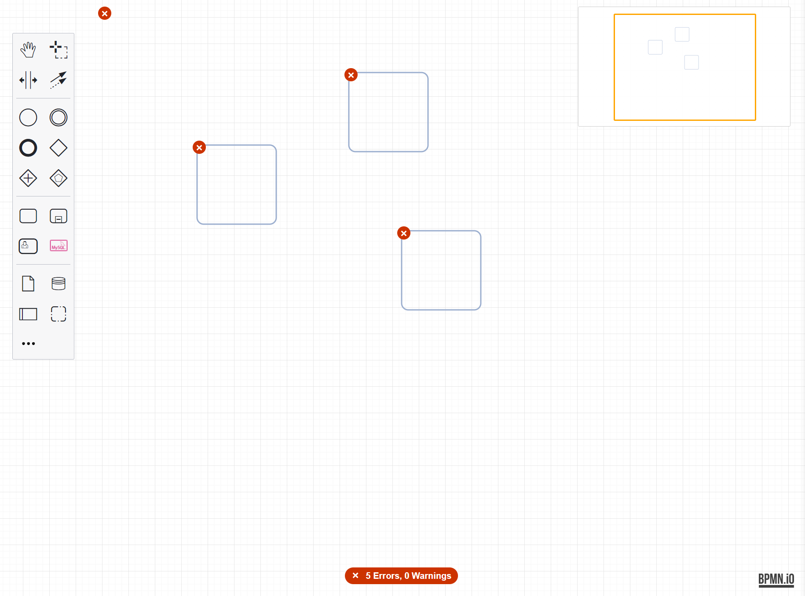
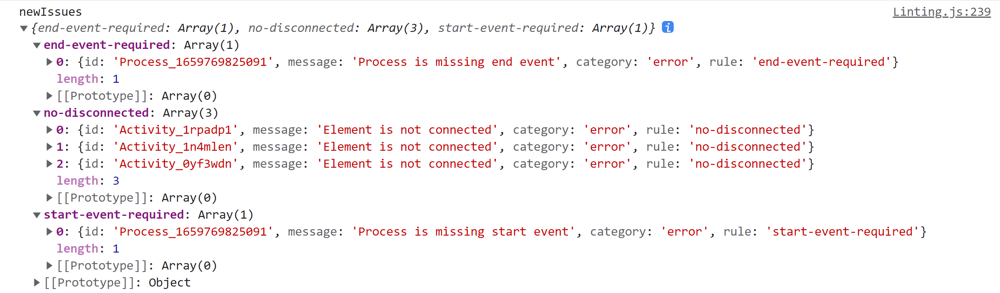

携手创作，共同成长！这是我参与「掘金日新计划 · 8 月更文挑战」的第11天，[点击查看活动详情](https://juejin.cn/post/7123120819437322247)

## 前言

在之前的文章中已经把 **bpmn.js** 的执行原理和模块扩展方式都做了一些简单介绍，对 **Renderer** 和 **Rules** 等常用功能也进行了说明。这个时候基本上已经可以满足大部分情况下的需求场景，但是也有小伙伴反应产品有新需求，需要在前端对流程完整性进行校验。

之前的两节已经讲了 **bpmn.js** 的校验模块如何使用的问题，以及 **bpmn-js-bpmnlint** 包的核心模块和校验方法。本小节主要将一下 **bpmnlint** 的 **Linter** 模块如何根据配置文件进行校验的。

-----

## 整体流程

第一节已经说过，**bpmnlint** 内部预设了有十几个校验规则，在 **bpmn.js** 中使用时可以通过配置 **linting.bpmnlint** 来配置 **rules** 使用规则。在触发校验的时候，是通过初始化一个 **Linter** 实例并调用 **linter.lint()** 来执行流程校验的。

这里对这几个参数做一下简单说明：

```typescript
const modeler = new BpmnModeler({
  container: 'xxx',
  //...
  linting: {
    active: true, // 是否在实例化之后就开启流程校验
    bpmnlint: {
      config: {
        resolver, // 解析器
        config: {
          rules: {}  // 规则配置对象
        }
      }
    }
  }
})
```

在 **new Modeler** 过程中会也会实例化对应的其他 **additionalModule** 实例，这里就会实例化一个 **Linting**。

### 1.1 new Linting

该构造函数就是实现界面错误信息显示，控制校验开关等功能的模块，依赖的 **config** 配置包含 **active** 和 **bpmnlint** 两个字段，并将 **bpmnlint** 保存到 **this._linterConfig** 中；并提供一个方法 **setLinterConfig(linterConfig)** 用来修改该配置。

而当规则配置改变或者流程图发生改变时，就会触发 **Linting.lint()** 来校验当前流程。

### 1.2 Linting.lint()

该方法逻辑很简单，即实例化一个 **Linter** 并执行校验。

```javascript
Linting.prototype.lint = function() {
  var definitions = this._bpmnjs.getDefinitions();
  var linter = new bpmnlint.Linter(this._linterConfig);
  return linter.lint(definitions);
};
```

其中，**this._bpmnjs** 指代 **modeler** 实例，**bpmnlint.Linter** 则是 **bpmnlint** 中的 **Linter** 模块。

### 1.3 new Linter

```javascript
function Linter(options = {}) {
  const { config,  resolver } = options;
  this.config = config;
  this.resolver = resolver;
  this.cachedRules = {};
  this.cachedConfigs = {};
}
```

这个过程很简单，就是保存传入的 **options** 参数，也就是上面的 **linting._linterConfig** 配置。因为每次校验时都会重新实例化一个 **linter**，所以可以通过 **linting.setLinterConfig** 重新配置规则，实现动态化配置。

### 1.4 linter.lint

这一步则是最关键的部分，会解析 **linter.config** 中的规则配置，并依次校验流程是否符合。

```javascript
Linter.prototype.lint = function(moddleRoot, config) {
  config = config || this.config;
  
  return this.resolveRules(config).then((ruleDefinitions) => {
    const allReports = {};

    ruleDefinitions.forEach((ruleDefinition) => {

      const { name } = ruleDefinition;

      const reports = this.applyRule(moddleRoot, ruleDefinition);

      if (reports.length) {
        allReports[name] = reports;
      }
    });

    return allReports;
  });
};
```

> 这里在实际执行过程中只有第一个参数。

**resolveRules** 规则配置处理

```javascript
Linter.prototype.resolveRules = function(config) {

  // resolveConfiguredRules: 解析 extends 继承关系，并合并配置
  return this.resolveConfiguredRules(config).then((rulesConfig) => {

    // 根据合并后的规则配置对象，解析为正式格式的配置项数组
    const parsedRules = Object.entries(rulesConfig).map(([ name, value ]) => {
      const { category, config } = this.parseRuleValue(value);
      return { name, category, config };
    });

    // 筛选出没有被关闭的规则
    const enabledRules = parsedRules.filter(definition => definition.category !== 'off');

    // 遍历可用规则配置，从 cachedRules 中读取到对应的规则校验函数
    const loaders = enabledRules.map((definition) => {

      const {  name, config } = definition;

      return this.resolveRule(name, config).then(function(rule) {
        return { ...definition, rule };
      });
    });

    return Promise.all(loaders);
  });
};
```

**applyRule** 校验流程

上文解析完规则配置之后，就会遍历配置调用 **applyRule** 来检查流程。这个过程其实也很简单，就是根据规则函数中的 **check** 方法来检查传入的这个流程图根节点，并将检查结果返回出来

```javascript
Linter.prototype.applyRule = function applyRule(moddleRoot, ruleDefinition) {

  const { config, rule,  category, name } = ruleDefinition;

  try {
    const reports = testRule({ moddleRoot, rule, config });

    return reports.map(function(report) {
      return { ...report, category  };
    });
  } catch (e) {
    console.error('rule <' + name + '> failed with error: ', e);
    return [
      {  message: 'Rule error: ' + e.message, category: 'error' }
    ];
  }

};
```

> 这里的 **testRule** 就是一个校验方法，内部会实例化一个 **Reporter** 对象，对校验结果进行格式化输出。

## 校验结果

假设我们有这样一个流程图：



这个图按照默认的规则来看，包含以下三个类型的错误：

1. 没有开始节点
2. 没有结束节点
3. 流程节点没有被连接（也就是没有关联到一个流程上）

所以 **bpmnlint** 的校验结果也是如此，按照不同的规则配置分为不同的错误信息，并作为一个对象输出。



但是这个结果不能直接给用户提示，所以 **bpmn-js-bpmnlint** 的 **Linting** 模块对这些信息进行了解析，并分别为错误元素创建不同的 **overlays** 图层来显示错误信息。

> 错误信息格式化与图层创建等，后续与 **Overlays** 模块结合讲解
