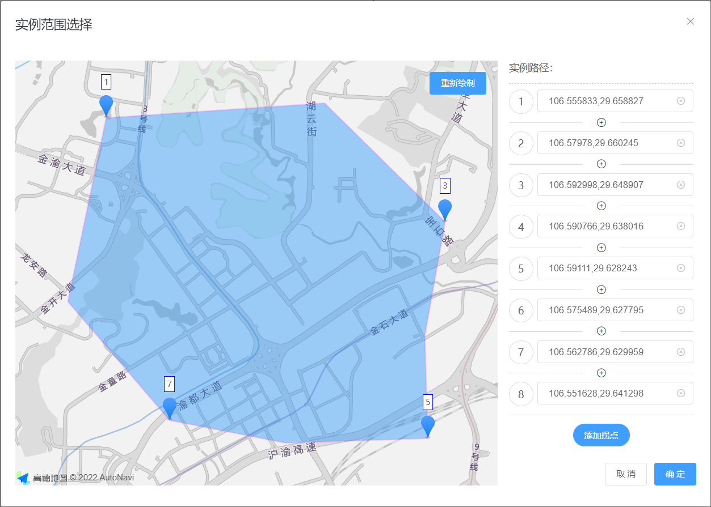

## 基于 Vue 2 与 高德地图 2.0 的“线面编辑器”

### 前言

很早之前笔者写过一篇 vue 2 引入和初始化高德地图的文章 [Vue项目中使用高德地图](https://juejin.cn/post/6920103004259500045)，介绍了三种常见的高德地图 AMap API 的加载方式，当然现在肯定是更推荐官方的加载器 **amap-jsapi-loader**。

至于饿了么团队封装的高德地图组件 [vue-amap](https://github.com/ElemeFE/vue-amap)，个人并不是很推荐，原因大概有以下两点：

1. 也是最重要的一点，这个库在 19 年 7 月之后就已经停止了更新，有很多遗留问题没有解决，官方文档示例也已经消失
2. 封装配置太过复杂，不方便多个功能结合使用；很多功能也不支持响应式配置

> **如果需要统一地图或者覆盖物的样式以及配置的话，笔者更建议封装一下高德地图的相关构造函数，这也更加符合设计模式**

为了更加更加清晰的讲解高德地图的使用方式，抽离了一个以前的项目中的覆盖物编辑器来进行讲解，目标是实现如下功能：

1. 可以通过鼠标进行绘制
2. 可以绘制 折线 或者 多边形
3. 可以手动在右侧调整数据根据图形



### 1. 引入高德地图

首先，我们安装 **amap-jsapi-loader**

```shell
npm install @amap/amap-jsapi-loader --save
// or
yarn add @amap/amap-jsapi-loader --save
// or
pnpm install @amap/amap-jsapi-loader --save
```

然后，简单封装一下加载函数 **MapLoader**

```typescript
import AMapLoader from "@amap/amap-jsapi-loader";

/**
 * 高德地图 API 加载函数，默认不加载 plugin，key 秘钥 (推荐将秘钥保存在配置文件中)
 * @param [v] 地图版本
 * @param [uiOpts] AMapUI 配置
 * @param [locaV] loca 配置
 * @returns {Promise<void>}
 */
export default async function (v, uiOpts, locaV) {
  const key = config.amap.key
  const version = v || '2.0'
  const AMapUI = uiOpts || null
  const Loca = locaV ? { version: locaV } : null

  const AMap = await AMapLoader.load({
    key,
    version,
    AMapUI,
    Loca
  })
  return AMap
}
```

此时，在 API 加载成功后，会在 **window** 对象中添加一个 AMap 对象；如果引入了 AMapUI 或者 Loca，也会在 window 中添加相应的对象。

> 但是因为官方加载器的写法问题，不管有没有引入 AMapUI 或者 Loca，函数返回的 Promise 对象中的参数都只有 AMap；不过默认这些对象都会挂载到 window 下，所以也可以直接使用 **window.xxx**

### 2. 创建编辑组件 MapOverlayEdit

这里笔者采用的是一个弹窗形式，通过 **v-model** 绑定覆盖物轨迹数据。

> 因为使用的 Vue 2，所以组件库使用的是 ElementUI，使用方式就不赘述了，相信大家都会。至于为啥上面吐槽了 element 团队的 vue-amap，下面又在用他们的组件库，，，，只能说，一码归一码了

```vue
<template>
  <el-dialog
    title="实例范围选择"
    width="1000px"
    :close-on-click-modal="false"
    :visible="visible"
    destroy-on-close
    append-to-body
    @close="closeDialog"
  >
    <div class="edit-main-body">
      <div style="position: relative; width: 100%; height: 100%; grid-column: 1 / 3; grid-row: 1 / 3">
        <div ref="map" class="overplay-edit_map"></div>
      </div>
      <div class="path-list">
        <div class="path-item">实例路径：</div>
      </div>
      <div class="dialog-control-btns">
        <el-button size="small" @click="closeDialog">取 消</el-button>
        <el-button v-show="!disabled" size="small" type="primary" @click="submitDrawn">确 定</el-button>
      </div>
    </div>
  </el-dialog>
</template>

<script>
import MapLoader from '@/utils/MapLoader'
export default {
  name: "MapOverlayEdit",
  props: {
    version: {
      type: String,
      default: "2.0"
    },
    visible: {
      type: Boolean,
      default: false
    },
    disabled: {
      type: Boolean,
      default: false
    },
    value: {
      type: Object,
      default: () => null
    },
    type: {
      type: String,
      default: "polygon"
    }
  },
  data() {
    return {
      overlayPath: [],
      zoom: 14,
      mapCenter: [106, 29]
    };
  },
  methods: {
    closeDialog() {
      this.$emit("update:visible", false);
    },
    submitDrawn() {
      this.$emit("input", {})
      this.$emit("update:visible", false);
    }
  },
  watch: {
    visible: {
      handler: function (newVal) {
        if (!newVal) return;
      },
      immediate: true
    }
  }
}
</script>
```

> 当然，此时只是创建了一个可以打开关闭的弹窗，采用网格布局的方式来实现了快速布局。

### 3. 加载地图与插件

通常情况下，在组件打开的时候应该加载地址，在组件销毁时一样要销毁地图；但是在组件没有被销毁时，打开和关闭弹窗时应该保留地图数据和已绘制的覆盖物数据。

所以我们增加一个地图初始化方法与打开状态 visible 的 watch handler；并且为了回显上次的编辑结果，还需要一个覆盖物初始化方法。

```javascript
methods: {
  async initMap(center) {
    if (!window.AMap) {
      await MapLoader();
    }
    if (!this.$refs.map) {
      return this.initMap(center)
    }
    this.map = new window.AMap.Map(this.$refs.map, {
      center: center || this.mapCenter,
      zoom: this.zoom,
      mapStyle: "amap://styles/light",
      features: ["bg", "road", "building"]
    });
    // 加载地图鼠标工具
    if (!window.AMap.MouseTool) {
      window.AMap.plugin("AMap.MouseTool");
    }
  },
  // 加载多边形/折线
  async initOverlay() {
    this.clearMap(); // 清空原有的覆盖物
    setTimeout(() => {
      if (this.type === "polygon" || this.type === "area") {
        this._overlay = new window.AMap.Polygon({
          path: this.overlayPath.map(o => o.split(",")),
          strokeColor: "#FF33FF",
          strokeWeight: 2,
          strokeOpacity: 0.2,
          fillOpacity: 0.4,
          fillColor: "#1791fc",
          zIndex: 50
        });
      } else {
        this._overlay = new window.AMap.Polyline({
          path: this.overlayPath.map(o => o.split(",")),
          strokeColor: "#2d8cf0",
          strokeWeight: 4,
          zIndex: 50
        });
      }
      let markers = [];
      let dis = Math.floor(this.overlayPath.length / 4);
      if (dis > 2) {
        for (let i = 0; i < 5; i++) {
          let marker = new window.AMap.Marker({
            position:
            i === 4
            ? this.overlayPath[this.overlayPath.length - 1].split(",")
            : this.overlayPath[i * dis].split(","),
            label: {
              offset: new window.AMap.Pixel(0, -8), //设置文本标注偏移量
              content: `<div class='overplay-edit_info'>${
              i === 4 ? this.overlayPath.length : i * dis + 1
            }</div>`, //设置文本标注内容
              direction: "top" //设置文本标注方位
            }
          });
          markers.push(marker);
        }
      } else {
        this.overlayPath.forEach((i, k) => {
          if (k % 2 === 0) {
            let marker = new window.AMap.Marker({
              position: i.split(","),
              label: {
                offset: new window.AMap.Pixel(0, -8), //设置文本标注偏移量
                content: `<div class='overplay-edit_info'>${k + 1}</div>`, //设置文本标注内容
                direction: "top" //设置文本标注方位
              }
            });
            markers.push(marker);
          }
        });
      }
      this.map.add([this._overlay, ...markers]);
      this.map.setFitView();
    }, 16);
  },
},
watch: {
  visible: {
    handler: function (newVal) {
      if (!newVal) return;
      this.$nextTick(async () => {
        if (this.value && this.value.length) {
          this.overlayPath = this.value.map(i => i.join(","));
          this.initMap(this.mapCenter).then(() => this.initOverlay());
        } else {
          this.overlayPath = []
          await this.initMap(this.mapCenter);
        }
      });
    },
    immediate: true
  },
}
```

> 上面的 dis 是 distance 的缩写，用来计算所有点位之间间隔多少显示计数 marker，默认 marker 总数不超过 5 个。可以根据实际情况进行修改

### 4. 覆盖物绘制

在组件的配置项 Props 中，我们接收了一个 type 参数，用来确定覆盖物的类型（折线还是多边形），为了兼容以前的项目，这里接收的 type 有四个值可选（可以给 props 添加 validator 用来校验）：polygon 和 area 表示多边形，polyline 和 line 则表示折线。

确定好参数以后，就可以编写覆盖物绘制方法了（该方法依然是在 methods 中）

```javascript
redrawOverlay() {
  if (this.map) this.map.clearMap();
  this.overlayPath = [];
  this._mouseTool = new window.AMap.MouseTool(this._map);
  if (this.type === "polygon" || this.type === "area") {
    this._mouseTool.polygon({
      strokeColor: "#FF33FF",
      strokeWeight: 2,
      strokeOpacity: 0.2,
      fillOpacity: 0.4,
      fillColor: "#1791fc",
    });
  } else {
    this._mouseTool.polyline({
      strokeColor: "#2d8cf0",
      strokeWeight: 4
    });
  }
  this._mouseTool.on("draw", e => {
    this.overlayPath = e.obj.getPath().map(o => o.lng + "," + o.lat);
    this._mouseTool.close(); // 绘制完成后关闭鼠标工具
    this._mouseTool = null; // 解除引用
  });
}
```

内部的逻辑可以适当调整，但是核心部分需要包含这些内容：

1. 重绘覆盖物需要清空地图
2. 折线与多边形开启绘制的方法不同
3. 绘制结束采用事件回调的形式，回调函数包含绘制的路径信息
4. 如果有需要，也可以通过 **`this._mouseTool.xx`** 来使用鼠标创建其他的图形，例如圆形 circle、矩形 rectangle 等；具体支持方式见 [Amap.MouseTool](https://lbs.amap.com/api/jsapi-v2/documentation#mousetool)
5. 默认绘制结束后会保留绘制覆盖物，但是为了保证后面的逻辑一致，可以在绘制完成后使用 **`this._mouseTool.close(true)`** 清除掉覆盖物元素再使用 **initOverlay()** 重新初始化

### 5. 右侧路径列表

在需求中，我们可以通过修改右侧的路径数据来更新覆盖物，并且可以增加中间节点等。

所以这里需要实现路径遍历，并监听数组改变重新生成覆盖物。

#### 5.1 首先，我们实现右侧的模板部分

为了方便编辑，直接使用了 **ElInput** 绑定每一个路径节点数据，配合插槽实现删除；

使用 **ElDivider** 配合 **slot** 插槽实现两个节点之间的添加操作；

末尾创建一个按钮用来创建末尾节点。

```vue
<div class="path-list">
  <div class="path-item">实例路径：</div>
  <div class="path-item" v-for="(i, k) in overlayPath" :key="k">
    <span class="path-index">{{ k + 1 }}</span>
    <el-input size="small" v-model="overlayPath[k]">
      <i
         v-if="!disabled"
         slot="suffix"
         class="el-input__icon el-icon-circle-close"
         @click="removeTurningPoint(k)"
         ></i>
    </el-input>
    <el-divider v-if="!disabled && k !== overlayPath.length - 1">
      <i
         class="el-icon-circle-plus-outline"
         title="添加拐点"
         @click="addTurningPoint(i, k)"
         ></i>
    </el-divider>
    <el-divider v-else />
  </div>
  <div class="path-item" style="justify-content: center" v-if="!disabled">
    <el-button size="small" type="primary" round @click="addLastTurningPoint">添加拐点</el-button>
  </div>
</div>
```

#### 5.2 节点的新增删除

这里笔者写的逻辑比较简单，就是复制上一节点的值作为插入的新节点，实际项目中可以添加相关计算逻辑来计算前后两个节点的值。

至于移除操作的话，可以增加二次确认或者移除节点高亮提示等等。

```javascript
addTurningPoint(i, k) {
  this.overlayPath.splice(k, 0, i);
}

addLastTurningPoint() {
  if (this.overlayPath && this.overlayPath.length) {
    this.overlayPath.splice(
      this.overlayPath.length - 1,
      0,
      this.overlayPath[this.overlayPath.length - 1]
    );
  } else {
    this.overlayPath.push(this.mapCenter.join(","));
  }
}

removeTurningPoint(k) {
  this.overlayPath.splice(k, 1);
}
```

#### 5.3 监听路径变化

个人觉得这样监听也有一丢丢性能损耗，但是目前也没有啥更好的想法。

```javascript
watch: {
  overlayPath: {
    handler: function () {
      if (this._map) {
        this.$nextTick(() => this.initOverlay());
      } else {
        this.$nextTick(async () => {
          await this.initMap(this.center);
          await this.initOverlay();
        });
      }
    },
    deep: true,
    immediate: false
  }
}
```

#### 5.4 数据返回

这里采用的是 **v-model** 指令，所以需要绑定 **input** 事件

```javascript
submitDrawn() {
  // 因为业务里面需要的是一个 二维数组，所以这里进行了转换
  this.$emit("input", this.overlayPath.map(o => o.split(",")));
  // 关闭弹窗
  this.$emit("update:visible", false);
}
```

### 6. css 部分与使用方式

因为这里再贴完整代码的话，文章代码就太大了，看起来也很累，所以这里将剩下的 css 部分代码贴上来

```css
.edit-main-body {
  width: 100%;
  height: 600px;
  display: grid;
  grid-template-columns: auto 280px 280px;
  grid-template-rows: auto 32px;
}
.overplay-edit_map {
  position: absolute;
  width: 100%;
  height: 100%;
}
.edit-btns {
  position: absolute;
  top: 16px;
  right: 16px;
  z-index: 999;
}
.path-list {
  box-sizing: border-box;
  padding: 0 4px 0 16px;
  overflow-y: auto;
  height: calc(100% - 8px);
}
.path-item {
  display: flex;
  /*height: 40px;*/
  width: 100%;
  flex-wrap: wrap;
  justify-content: space-between;
}
.path-item:first-child {
  font-size: 14px;
  height: 32px;
  background: #ffffff;
  position: sticky;
  top: 0;
  z-index: 2;
  margin-bottom: 8px;
  font-family: "Helvetica Neue", Helvetica, "PingFang SC", "Hiragino Sans GB", "Microsoft YaHei", "微软雅黑", Arial, sans-serif;
  border-bottom: 1px dashed #d2d2d2;
}
.path-item .path-index {
  display: inline-block;
  width: 32px;
  height: 32px;
  border: 1px solid #dddde2;
  border-radius: 50%;
  line-height: 32px;
  text-align: center;
}
.path-item .el-input {
  width: calc(100% - 40px);
}
.path-item .el-input i:hover {
  cursor: pointer;
  color: #2d8cf0;
}
.path-list::-webkit-scrollbar {
  width: 5px;
  height: 4px;
}
.path-list::-webkit-scrollbar-thumb {
  border-radius: 5px;
  box-shadow: inset 0 0 5px rgba(0, 0, 0, 0.6);
  background: #eaedf1;
}
.path-list::-webkit-scrollbar-track {
  box-shadow: inset 0 0 5px rgba(0, 0, 0, 0.2);
  border-radius: 5px;
  background: rgba(0, 0, 0, 0);
}
.dialog-control-btns {
  display: inline-flex;
  justify-content: flex-end;
}
.el-divider--horizontal {
  margin: 12px 0;
}
.amap-marker-label {
  background-color: #fff;
  border-radius: 4px;
  box-sizing: border-box;
  padding: 8px;
  border: 1px solid #2d8cf0;
  box-shadow: 0 0 4px 4px rgba(45, 140, 240, 0.6);
}
.overplay-edit_info {
  position: relative;
  top: 0;
  right: 0;
  width: 24px;
  text-align: center;
}
```

至于使用的话，就和普通组件一样引入即可

```vue
<div>
  <p>
    <el-switch v-model="type" active-text="区域" inactive-text="折线" active-value="polygon" inactive-value="line" />
  </p>
  <p>
    <el-button type="primary" size="small" @click="mapVisible = true">编辑</el-button>
  </p>
  <p>paths: {{ pathStr }}</p>
</div>
<map-overlay-edit  v-model="paths" :type="type" :visible.sync="mapVisible" />
//...
<script>
  data() {
    return {
      mapVisible: false,
      paths: [],
      type: "polygon"
    }
  }，
  computed: {
    pathStr() {
      return this.paths.map(point => `[${point.join(",")}]`).join(", ");
    }
  }
</script>

```

### 7. 总结

整个组件功能层面来说比较单一，而且涉及逻辑也不复杂，但是依旧有一些值得修改和优化的地方。

例如本身高德地图提供了覆盖物编辑组件 **PolygonEditor，PolylineEditor，CircleEditor** 等等，直接在右边通过修改坐标来改变覆盖物路径没有办法直接定位到需要的位置，而且新增的节点也没有办法明显的体现出来，那么这时通过覆盖物编辑组件来修改就会很直观。

在用变量保存高德地图 API 的生成实例产物时，个人建议通过直接使用 **`this._xxx`** 来保存，避免被 Vue Observer 处理，影响部分属性和方法的使用；当然切记在组件销毁时需要手动清除这些变量的引用。


### 往期推荐

[Vue 2 源码阅读理解](https://juejin.cn/column/7136858810605371399)

[bpmn.js 全面进阶指南](https://juejin.cn/column/6964382482007490590)