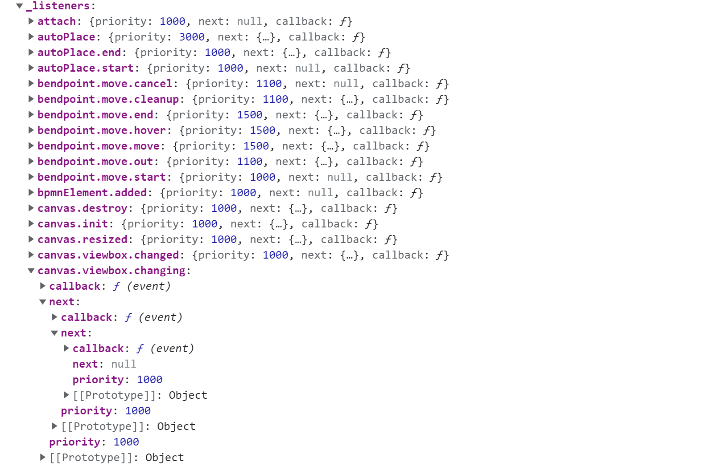

# BpmnEventBus - 带权重的事件总线设计（一）

## 1. 事件总线

事件总线，也可以叫做事件订阅器，也被称为 EventBus。一般用在模块化系统中作为各个模块的通信机制，本质是“发布-订阅模式”的 JavaScript 实现方式。

一个最基本的 EventBus 至少需要包含一个事件注册（on）和一个事件触发（fire/emit）两个方法，最好也包含单次事件触发（once）和事件取消订阅（remove/off)。

一般情况下，一个 EventBus 通常会封装成一个类（class），在项目中使用时会进行一次实例化；也可以直接使用静态方法和属性来取消实例化步骤。

## 2. 发布订阅模式

根据维基百科的定义，发布-订阅模式属于一种消息范式，消息发布者不会直接将消息发送给特定订阅者，而是将发布的消息分为不同的类别，不需要了解每个类别有哪些或者有没有对应的订阅者；而订阅者也只需要接收一个或者多个类别的事件，而不需要去绑定对应的消息发布者。

**优点：**

- 低耦合：发布者与订阅者不直接联系
- 易扩展：可以任意添加新的发布者或者订阅者

**缺点：**

- 太过解耦，可能导致订阅者无法订阅正确的消息，不同发布者发布同类型事件时消息格式不一致等情况

## 3. 传统的事件总线设计

目前很多基础的事件总线模块，基本上都没有设计注册事件的权重问题，默认都按照注册顺序进行相应，并且每个事件的执行过程和返回值互不影响。

以 [mitt](https://github.com/developit/mitt) 为例，纯粹实现一个基础事件总线的话，代码量并不多。

```javascript
export default function mitt(all) {
  all = all || new Map()
  
  return {
    all,
    on(type, handler) {
      const handlers = all.get(type)
      if (handlers) {
        handlers.push(handler)
      } else {
        all.set(type, [handler])
      }
    },
    off(type, handler) {
      const handlers = all.get(type)
      if (handler) {
        handlers.splice(handlers.indexOf(handler) >>> 0, 1)
      } else {
        all.set(type, [])
      }
    },
    emit(type, event) {
      let handlers = all.get(type)
      
			if (handlers) {
				handlers.slice().map((handler) => handler(evt));
			}

			handlers = all.get('*');
			if (handlers) {
				handlers.slice().map((handler) => handler(type, evt));
			}
    }
  }
}
```

因为 mitt 最大的优势就是轻量，所以内部没有太多复杂的判断逻辑和处理方法，仅仅提供了消息注册、消息发布、取消订阅三个方法。

如果我们要增加一个 **once** 类型的订阅者配置，可以对其进行一点更改，增加一个 **once** 的标志位，在消息发布和触发订阅者执行后直接移除该订阅。

```javascript
export default function mitt(all) {
  all = all || new Map()
  
  return {
    all,
    on(type, handler) {
      const handlers = all.get(type)
      if (handlers) {
        handlers.push({handler})
      } else {
        all.set(type, [{handler}])
      }
    },
    once(type, handler) {
      const handlers = all.get(type)
      if (handlers) {
        handlers.push({ handler, once: true })
      } else {
        all.set(type, [{ handler, once: true }])
      }
    },
    off(type, handler) {
      const handlers = all.get(type)
      if (handler) {
        all.get(type) = handlers.filter((v) => v.handler !== handler)
      } else {
        all.set(type, [])
      }
    },
    emit(type, event) {
      let handlers = all.get(type)
      let onceHanlders = []
      
			if (handlers) {
				handlers.slice().forEach(({handler, once}, index) => {
          handler(evt)
          if(once) onceHanlders.push(handler)
        });
			}
      all.get(type) = handlers.filter((v) => onceHanlders.includes(handler))

			handlers = all.get('*');
			if (handlers) {
				handlers.slice().forEach(({handler, once}) => {
          handler(type, evt)
          if(once) onceHanlders.push(handler)
        });
			}
      all.get('*') = handlers.filter((v) => onceHanlders.includes(handler))
    }
  }
}
```

## 4. 带权重的 EventBus

不管是上面的 mitt，还是我们通常自己使用的事件总线，基本上每个类型的事件订阅者都是通过数组保存的，在事件触发时通过遍历数组来依次执行每个订阅者方法。

但是如果带上权重配置，数组还能实现么？

嗯。。。答案肯定是可以的，只需要再改造一下，给每个订阅者对象中增加一个权重字段 **priority**，在注册订阅者或者在执行订阅函数时通过排序方法更新一下订阅者数组，理论上也能实现。

但是还有一种更优雅的实现方式---“**链表**”

[bpmn.js](https://github.com/bpmn-io/bpmn-js) 的事件总线 **EventBus** 模块，为了满足整个过程中的事件执行顺序和数据流转逻辑，不仅增加了权重配置，还增加了一个订阅者函数返回值的流转处理；并且具有中途停止订阅者执行的相关逻辑。

内部的订阅者保存格式如下：



**整个事件系统在注册新的订阅者的时候，首先判断权重！在同权重的情况下，则按注册顺序来插入；不然则权重更高的订阅者会优先执行。**


那么整个 BpmnEventBus 模块的内部机制是怎么样的，下一节再进行源码部分的讲解啦~