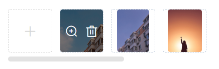

# ElUpload不好用？一文实现一个简易图片上传预览组件


## 前言

嗯，，，跟之前封装“全局 Loading”的出发点基本一样，因为产品觉得 ElementUI 提供的默认上传组件，使用“照片墙”或者“缩略图”模式都需要去改动原本的组件样式，并且缩略图尺寸也不能调整，预览模式也会对原始图片进行缩放和处理，不符合系统本身的样式规范。

> 最离谱的是，预览模式居然有背景色，但是背景色又没有填满整个 model 的背景区域，，，甚至还出现了滚动条！！！

所以，为了更好的配合产品和UI，特地重新编写了一个图片上传组件。

## 1. 功能设计

嗯，既然是图片上传，那么肯定只支持图片文件了。因为是内部项目，所以也保留了 http 上传部分，大家可以参照 ElementUI 适当修改。

修改后的上传组件支持以下功能：

1. 上传（基础中的基础）
2. 实现 v-model 语法糖绑定上传数据列表（嗯，，，也很基础）
3. 需要支持大图预览
4. 不能换行，超出宽度显示滚动条且支持鼠标控制（不用 shift 的那种）

功能设计完成之后，大致的页面样式就是这样的：



## 2. 实现

为了能够适应更多的场景，我决定把预览部分也直接提取出来。

### 2.1 图片预览 PicturePreviewer

这里的图片预览是基于 ElDialog 开发的，支持翻页、循环等。

本身不依赖外部的图片元素，可以和 ElDialog 一样直接使用 **visible** 属性来控制显示和隐藏。

```vue
<template>
  <el-dialog
    :title="title"
    :visible="visible"
    :close-on-click-modal="false"
    width="1000px"
    destroy-on-close
    append-to-body
    @close="closeDialog"
  >
    <div class="q-picture__img-box">
      <div
        class="q-picture__prev-btn"
        @mouseover="leftBtnStatus = true"
        @mouseleave="leftBtnStatus = false"
      >
        <transition name="btn-fade">
          <el-button
            v-show="leftBtnStatus && isNeeding"
            circle
            icon="el-icon-arrow-left"
            @click="lastImage()"
          />
        </transition>
      </div>
      
      <div
        class="q-picture__next-btn"
        @mouseover="rightBtnStatus = true"
        @mouseleave="rightBtnStatus = false"
      >
        <transition name="btn-fade">
          <el-button
            v-show="rightBtnStatus && isNeeding"
            circle
            icon="el-icon-arrow-right"
            @click="nextImage()"
          />
        </transition>
      </div>
    </div>
  </el-dialog>
</template>

<script>
export default {
  name: "PicturePreviewer",
  props: {
    visible: { type: Boolean, default: false },
    pageable: { type: Boolean, default: true },
    recyclable: { type: Boolean, default: true },
    src: { type: [String, Array], required: true },
    title: { type: String, default: "图片预览" },
    current: { type: Number, default: 0 }
  },
  data() {
    return {
      currentKey: -1,
      leftBtnStatus: false,
      rightBtnStatus: false,
      loading: false
    };
  },
  computed: {
    isNeeding: function () {
      return typeof this.src === "object" && this.pageable && this.src && this.src.length > 1;
    },
    currentSrc: function () {
      if (typeof this.src === "string") return this.src;
      if (this.src && this.src.length) {
        return this.src[this.currentKey] || "";
      }
      return "";
    }
  },
  methods: {
    closeDialog() {
      this.$emit("update:visible", false);
    },

    lastImage() {
      if (this.currentKey - 1 === -1) {
        if (this.recyclable) this.currentKey = this.src.length - 1;
        else this.$message.info("当前已经是第一张图片");
      } else {
        this.currentKey = this.currentKey - 1;
      }
    },

    nextImage() {
      if (this.currentKey + 1 === this.src.length) {
        if (this.recyclable) this.currentKey = 0;
        else this.$message.info("当前已经是最后一张图片");
      } else {
        this.currentKey = this.currentKey + 1;
      }
    }
  },
  watch: {
    current: {
      handler: function (val) {
        if (val) this.currentKey = val;
        else this.currentKey = 0;
      },
      immediate: true
    }
  }
};
</script>
```

> 样式部分就放到 马上掘金 了。

### 2.2 图片上传 ImageUpload

图片预览处理完成够，就可以处理图片上传了。

```vue
<template>
  <div
    class="q-upload__preview"
    ref="pictures"
    :title="messageInfo"
    @mouseenter="horizontalRolling"
  >
    <slot name="preSlot"></slot>
    <input
      class="q-upload__file-input"
      type="file"
      ref="fileInput"
      name="fileInput"
      @change="fileChange"
      :accept="accept"
    />
    <div
      class="q-upload__file-label"
      v-loading="fileLoading"
      @click="selectFile"
      v-show="fileLists.length < limitNum && !disabled"
    >
      <i class="el-icon-plus"></i>
    </div>
    <slot name="middle"></slot>
    <div class="q-upload__pre-img" v-for="(i, k) in fileLists" :key="i.smallUrl">
      
      <div class="q-upload__mask">
        <i v-if="prev" class="el-icon-zoom-in" @click="imgPreview(i, k)"></i>
        <i class="el-icon-delete" v-if="!disabled" @click="imgRemove(k)"></i>
      </div>
    </div>
    <slot name="endSlot"></slot>
    <picture-previewer
      :visible.sync="dialogImageVisible"
      :src="imageUrls"
      :current="currentImage"
    />
  </div>
</template>
<script>
import Utils from "../../src/utils/commonUtils";

export default {
  name: "ImageUpload",
  props: {
    active: { type: String, default: "/api/file/upload" },
    accept: { type: String, default: "" },
    limitNum: { type: Number, default: 9 },
    size: { type: Number, default: 10 },
    prev: { type: Boolean, default: true },
    disabled: { type: Boolean, default: false },
    value: { type: Array, default: () => [] }
  },
  data() {
    return {
      fileLoading: false,
      dialogImageVisible: false,
      dialogImageUrl: "",
      currentImage: 0,
      fileLists: [],
      messageInfo: ""
    };
  },
  computed: {
    imageUrls: function () {
      return this.fileLists.map(o => o.url);
    }
  },
  methods: {
    async validateImage(file) {
      const isJPEG = file.type === "image/jpeg";
      const isJPG = file.type === "image/jpg";
      const isPNG = file.type === "image/png";
      const isBMP = file.type === "image/bmp";
      const isLtSize = file.size / 1024 / 1024 < this.size;

      if (!(isJPEG || isJPG || isPNG || isBMP)) {
        return {
          status: false,
          message: `上传图片必须是${this.accept}格式!`
        };
      }
      if (!isLtSize) {
        return {
          status: false,
          message: "上传图片大小不能超过 " + this.size + " MB!"
        };
      }
      return { status: true, message: "" };
    },

    // 选择文件
    selectFile() {
      this.$refs.fileInput.value = null; // 置空，防止删除后无法再次选择
      this.$refs.fileInput.click();
      return true;
    },

    // 文件选取之后·
    async fileChange(el) {
      const file = [...el.target.files][0];
      let { status, message } = await this.validateImage(file);
      if (status) {
        this.fileLoading = true;
        await this.customHttpRequest(file);
      } else {
        this.$message.error(message);
        return false;
      }
    },

    // 上传
    async customHttpRequest(file) {
      try {
        let fData = Utils.createUploadForm(file);
        let {
          data: { data, status, message }
        } = await this.$http.post(this.active, fData.formData, fData.config);
        if (status) {
          this.fileLists.unshift(data);
          this.$emit("success", data);
        } else {
          this.$message.error(message);
          this.$emit("error");
        }
      } finally {
        this.fileLoading = false;
      }
    },

    imgPreview(file, k) {
      this.dialogImageUrl = file.url;
      this.dialogImageVisible = true;
      this.currentImage = k;
    },

    imgRemove(index) {
      this.fileLists.splice(index, 1);
      this.$emit("input", this.fileLists);
      this.$emit("change", this.fileLists);
      this.$emit("blur", this.fileLists);
    },

    horizontalRolling() {
      if (this.$refs["pictures"].clientWidth < this.$refs["pictures"].scrollWidth) {
        this.messageInfo = "滚动滚轮查看所有信息";
      } else {
        this.messageInfo = "";
      }
      this.$refs["pictures"].addEventListener("mousewheel", this.$_scrollEvent);
      this.$once("hook:beforeDestroy", () => {
        this.$refs["pictures"].removeEventListener("mousewheel", this.$_scrollEvent);
      });
    },

    $_scrollEvent(e) {
      let left = this.$refs["pictures"].scrollLeft;
      this.$refs["pictures"].scrollLeft = e.deltaY > 0 ? left + 40 : left - 40;
    }
  },
  watch: {
    value: {
      deep: true,
      immediate: true,
      handler: function () {
        this.fileLists = typeof this.value === "string" ? JSON.parse(this.value) : this.value;
        if (!this.fileLists) this.fileLists = [];
      }
    },
    fileLists: {
      deep: true,
      immediate: false,
      handler: function () {
        if (this.value && this.value.length > this.limitNum) {
          this.$message.warning(`最多可以上传【 ${this.limitNum} 】张图片！！`);
        }
        this.$emit("input", this.fileLists);
        this.$emit("change", this.fileLists);
      }
    }
  }
};
</script>
```

> 因为是内部项目，所以上传方法还是使用的实例上的 axios 方法来发送上传请求的；在独立组件库中依然应该通过 props 的方式传递项目中定义的 http 请求方法。

组件接收一个最大张数限制 **limitNum** 和文件大小限制 **size**，以及预览控制 **prev** 和禁用状态 **disabled**。

在选择文件之后会立即上传、点击已上传文件则是预览当前文件；当前内部也依赖了 ElementUI 的 Message 组件，用来显示提示信息。

在预览区域前后也增加了一个插槽，用来插入开发者需要的其他信息。

在整个组件的 Dom 节点上，会添加一个鼠标的 **mouseenter** 事件，**当鼠标在组件内部的时候**，则计算内部的缩略图区域与外层节点的大小进行比较，如果大于外层父节点的宽度的话，则提示用户通过鼠标滚轮来控制缩略图区域的滚动。

## 3. 后记

整个组件虽然可以满足当时的系统的一个需求，但是仔细研究代码的话会发现依然有很多细节的地方需要修复。例如：

- 组件的 **mouseenter** 事件，每次被触发时都会给 dom 添加一个鼠标监听事件，而没有在鼠标移出时及时销毁监听
- 没有增加自定义 http 配置
- 没有控制预览组件的配置项
- 缩略图区域没有尺寸控制

等等一系列的问题，所以我们在抽离组件、公共逻辑的时候，还是需要尽可能的保留以后扩展的可能性，减少与外界逻辑或者业务的关联。