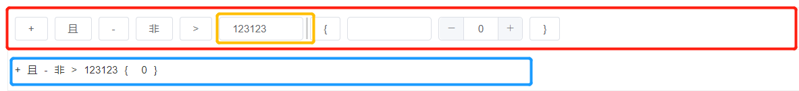
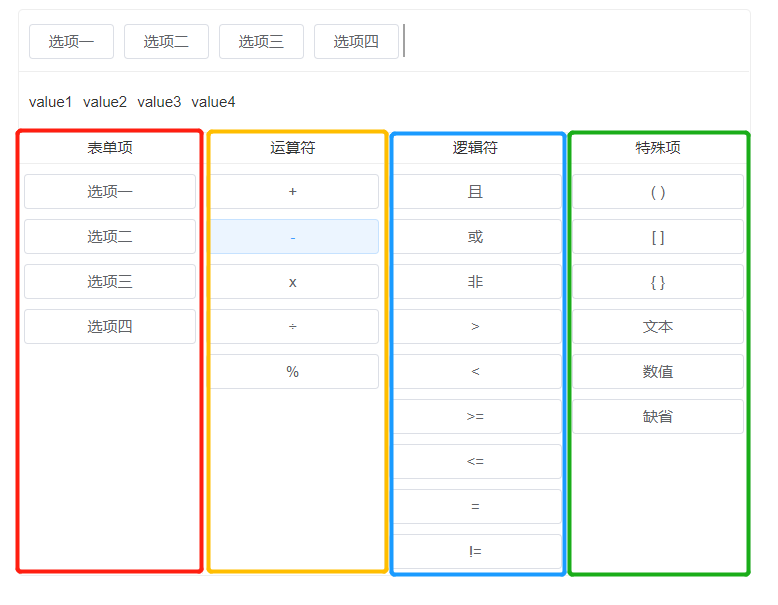

持续创作，加速成长！这是我参与「掘金日新计划 · 10 月更文挑战」的第N天，[点击查看活动详情](https://juejin.cn/post/7147654075599978532)


# 一个“非常简单”的Vue表达式编辑组件

## 前言

嗯，，，又是一个公司的需求产生的想法😓😓

为了配合后端使用的规则引擎，实现事件自动上报、状态自动更新等功能，需要在后台管理的页面上增加一个规则配置模块，其中涉及到设备属性、事件、自定义参数、且或非逻辑运算等多种配置元素。在外面找了一下没有找到符合界面设计和操作方式的开源库/组件，所以内部自己根据需求实现了一个简单的表达式编辑组件。

先上效果：

[代码片段](https://code.juejin.cn/pen/7148821349778063375)

## 1. 需求

在经过多次讨论（撕逼）之后，与产品和后端讨论出来了以下需求：

- 支持外部配置表达式备选元素
- 支持加减乘除等简单数学计算
- 支持选择且或非、大小于之类的逻辑运算
- 支持自定义文本、数字输入
- 支持括号、验证括号匹配

> 看到括号匹配是不是就想到力扣的括号匹配算法了？😏

## 2. 设计

为了满足从外部配置新的表达式备选元素，所以肯定需要接收一个备选元素数组，并约定好特定格式；而且，为了方便用户选择，还需要单独将这一类选项进行划分。

另外的自定义文本、数字，则需要能实现表达式直接输入和更改（类似双向绑定吧），可以直观的在生成的表达式中直接输入最好。

其他的部分则可以看做是内置的特殊选项，我们一一配置即可。

当然，为了优化用户体验，方便寻找需要的表达式元素，我们对所有的备选项进行了分组：

1. 扩展选项列：用来填充上级组件传递进来的选项
2. 运算符：包含加减乘除和百分比
3. 逻辑符：包含且或非，大于小于等于、大于等于、小于等于和不等于
4. 特殊项：括号、文本、数字，以及一个缺省项

并且表达式需要只是用户可读和代码可读两种情况，就需要增加每个选项对应的 label 和 value 字段了。

## 3. 代码

在设计完成之后，就是写代码的时候了。因为代码比较多，这里只介绍几个核心部分：

### 3.1 模拟输入框光标与键盘控制

因为每个选项的显示元素宽度不一样，所以模拟的光标肯定不能放在最外层（当然给最外层加也能实现，但是会多很多不必要的尺寸计算）。所以我们的方案是将光标放置在已选的表单项上面，通过设置激活状态和伪类来实现。

整个 Dom 结构如下：



其中红色部分是整个已选选项的显示和编辑区域，黄色选项为当前激活项，蓝色区域为表达式的 “用户可读” 预览。

上面的已选表单项也通过一个数组来存储，而 “用户可读” 表达式和 “代码可读” 表达式都通过计算属性来监听已选选项数组的改变，再次进行转换。

```vue
<template>
  <div class="q-formula-designer" v-click-outside="() => (isActive = false)">
    <div
        class="q-formula__editor"
        :class="{ 'is-focus': isActive && activeOperatorIndex === null, 'is-error': isError }"
        ref="formula-editor"
        @click.stop="handleEditExpression"
    >
      <template v-for="(op, opk) in designedExpression">
        <div
            class="q-formula__editor-cursor"
            :class="{ 'is-focus': isActive && activeOperatorIndex === opk }"
            :key="'cursor' + opk"
            @click.stop="activeOperatorIndex = opk"
        ></div>
        <div class="q-formula__operator" :key="'operator' + opk">
          <el-input v-if="op.key && op.key === 'string'" v-model="op.value" size="mini" clearable @focus="keyboardFocus = false" />
          <el-input-number v-else-if="op.key && op.key === 'number'" v-model="op.value" size="mini" clearable @focus="keyboardFocus = false" />
          <el-button v-else size="mini">{{op.label}}</el-button>
        </div>
      </template>
    </div>
    <div class="q-formula__previewer">
      <span class="q-formula__previewer-item" v-for="(t, k) in designedExpression" :key="k">{{ t.key && t.key !== "()" ? t.value : t.label }}</span>
    </div>
  </div>
</template>
<script>
  export default {
    props: {},
    data() {
      return {
        keyboardFocus: false,
        arithmeticOperators: [], // 加减乘除
        logicalOperators: [], // 且或非等
        specialOperators: [], // 数值文本括号
        designedExpression: [], // 已选选项
        activeOperatorIndex: null, // 激活选项下标
      }
    },
    computed: {
      expressionValue() {
        if (!this.designedExpression.length) return "";
        return `${this.designedExpression.map((o) => o.value).join(" ")}`;
      },
      expressionPreview() {
        return this.designedExpression.map((t) => (t.key && t.key !== "()" ? t.value : t.label)).join(" ");
      }
    },
    methods: {
      // 键盘快捷键处理（这里只处理了左右移动和删除按钮）
      handleKeydown(e) {
        if (!this.reactKeydownEvent) return;
        if (document.activeElement !== document.body) return;
        switch (e.code.toLocaleLowerCase()) {
          case "backspace":
            this.handleDeleteOperator();
            break;
          case "arrowleft":
            this.handleMoveCursor(false);
            break;
          case "arrowright":
            this.handleMoveCursor(true);
            break;
        }
      },
    }
  }
</script>
```

### 3.2 备选项面板

备选项面板部分则设计成了一个计算器的布局，作为自定义选项部分，则优先显示在第一列。



总的来说，这部分应该是最简单的一部分，遍历各个备选项数组分别插入按钮即可。

```html
<!-- 表单项列 -->
<div class="q-parameters form-operators" v-if="parameterType === 'formItem'">
  <div class="q-parameters__operator-label">表单项</div>
  <div class="q-parameter__item" v-for="(fi, fk) in formParameters" :key="fk">
    <el-button size="mini" :title="fi.label" @click="increaseNewParameter(fi)">{{ fi.label }}</el-button>
  </div>
</div>
<div class="q-parameters arithmetic-operators">
  <div class="q-parameters__operator-label">运算符</div>
  <div class="q-parameter__item" v-for="(ai, ak) in arithmeticOperators" :key="ak">
    <el-button size="mini" :title="ai.name" @click="increaseNewParameter(ai)">{{ ai.label }}</el-button>
  </div>
</div>
<div class="q-parameters logical-operators">
  <div class="q-parameters__operator-label">逻辑符</div>
  <div class="q-parameter__item" v-for="(li, lk) in logicalOperators" :key="lk">
    <el-button size="mini" :title="li.name" @click="increaseNewParameter(li)">{{ li.label }}</el-button>
  </div>
</div>
<div class="q-parameters special-operators">
  <div class="q-parameters__operator-label">特殊项</div>
  <div class="q-parameter__item" v-for="(si, sk) in specialOperators" :key="sk">
    <el-button size="mini" :title="si.name" @click="increaseNewParameter(si, true)">{{ si.label }}</el-button>
  </div>
</div>
```

```javascript
// 插入表达式单元
increaseNewParameter(parameter, special = false) {
  let index = this.activeOperatorIndex === null ? this.designedExpression.length : this.activeOperatorIndex;
  const parameterSelf = JSON.parse(JSON.stringify(parameter));
  if (special) {
    // 特殊项
    // 括号
    if (['()', '[]', '{}'].includes(parameterSelf.key)) {
      let p = parameterSelf.value;
      this.designedExpression.splice(index, 0, { label: p[0], value: p[0], name: p[0] });
      this.designedExpression.splice(index + 1, 0, { label: p[1], value: p[1], name: p[1] });
      this.activeOperatorIndex = index + 1;
      return;
    }
    // 文本
    // 数值
    this.designedExpression.splice(index, 0, parameterSelf);
  } else {
    this.designedExpression.splice(index, 0, parameterSelf);
  }
  // 光标移动
  if (this.activeOperatorIndex !== null) this.activeOperatorIndex++;
}
```

只是这里对特殊项做了一些判断处理，如果是括号的话，会直接插入一对表达式元素，并且把光标移动到括号中间。

## 4. 总结

总的来说，这个组件的功能看起来很复杂，但是核心逻辑其实很简单，只是需要处理好焦点在不同元素上时的事件绑定（现在这个组件的焦点判断也还有一点问题）。而且结合实际情况的话，自定义部分可以需要更深层次的操作，比如下拉选择、联合选择等。

这部分功能个人倒是感觉可以配合 Vue 的作用域插槽来完成，由二开人员来完善这部分功能。
