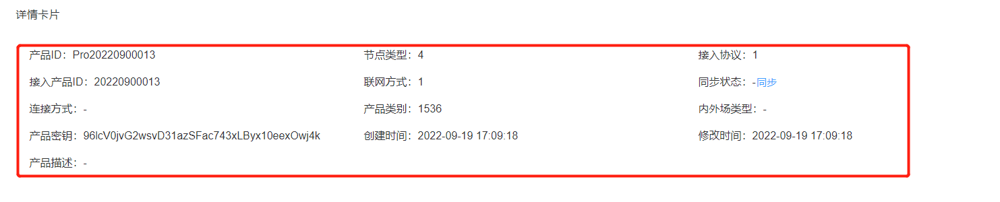

持续创作，加速成长！这是我参与「掘金日新计划 · 10 月更文挑战」的第N天，[点击查看活动详情](https://juejin.cn/post/7147654075599978532)


# 前端基础向--从项目入手封装公共组件

## 前言

在上一篇 [前端基础向~从项目入手封装工具函数](https://juejin.cn/post/7150321895970177060) 中简单介绍了封装项目通用工具函数的几种思路和函数设计方式，用来适配多种情况下的 **数据处理**，也提到了哪些情况下需要封装业务公共组件。

本文就从 “详情卡片” 业务组件的封装的几个阶段来说明我在编写公共组件的设计思路。

## 1. 阶段一：基础需求

假设我们现在有这样一个需求：需要满足显示产品的详细信息；需要可以根据不同分辨率适配不同的显示方式（2列，3列，4列）。基础样式如下：



为了快速实现不同分辨率实现不同的列数，最先想到的就是使用 UI 库的布局组件，这里我们选择的是 ElementUI 的 Row/Col 组件。

在满足当前的需求下的代码如下：

```vue
<script>
export default {
  name: "DetailPageInfoContent",
  props: {
    details: {
      type: Object,
      default: () => ({})
    },
    sizes: {
      type: Object,
      default: () => ({ xs: 12, sm: 12, md: 12, lg: 8, xl: 6 })
    },
    prop: {
      type: Object,
      default: () => ({})
    }
  },
  computed: {
    detailInfoList() {
      if (!this.details) return [];
      return Object.keys(this.prop).reduce((list, propKey, index) => {
        let label, value;
        label = this.prop[propKey];
        value = (this.details[propKey] || "-").toString();
        list.push({ index, label, value });
        return list;
      }, []);
    }
  },
  render(h) {
    return h("div", { class: "detail-page-info-content" }, [
      h("el-row", { props: { gutter: 16 } }, [
        this.detailInfoList.map((item) =>
          h(
            "el-col",
            {
              props: { ...this.sizes },
              class: "info-item-content",
              key: item.index
            },
            [
              h("div", { class: "info-content_label" }, item.label),
              item.value.length < 32
              ? h("div", { class: "info-content_value" }, item.value)
              : h("el-tooltip", { props: { content: item.value } }, [
                h("div", { class: "info-content_value" }, item.value)
              ])
            ]
          )
        )
      ])
    ]);
  }
};
</script>

<style lang="scss">
.detail-page-info-content {
  box-sizing: border-box;
}
.info-item-content {
  font-size: 0.8rem;
  line-height: 32px;
  display: flex;
  align-items: center;
  color: $--font-color-secondary;
}
.info-content_value {
  flex: 1;
  overflow: hidden;
  word-break: break-word;
  text-overflow: ellipsis;
  white-space: nowrap;
  color: $--font-color-base;
}
</style>
```

此时的组件仅仅满足传入一个配置对象 **prop** 和详情数据 **details**，以及一个默认的 ElRow 的布局配置。在 Value 长度大于 32 时使用 Tooltip 来显示超长的信息部分。

## 2. 阶段二：插槽

上面的组件仅仅满足已经符合正确格式的 **prop** 配置和 **details**，但是在需要增加图片预览按钮、操作按钮等情况时，则无法满足。

所以可以增加两个插槽，用在最前面和最末尾显示扩展信息。

```vue
<script>
export default {
  name: "DetailPageInfoContent",
  props: {},
  computed: {
    detailInfoList() {
      if (!this.details) return [];
      return Object.keys(this.prop).reduce((list, propKey, index) => {
        let label, value;
        label = this.prop[propKey];
        value = (this.details[propKey] || "-").toString();
        list.push({ index, label, value });
        return list;
      }, []);
    }
  },
  render(h) {
    return h("div", { class: "detail-page-info-content" }, [
      this.$scopedSlots.append && this.$scopedSlots.append(),
      h("el-row", { props: { gutter: 16 } }, [
        this.detailInfoList.map((item) =>
          h(
            "el-col",
            {
              props: { ...this.sizes },
              class: "info-item-content",
              key: item.index
            },
            [
              h("div", { class: "info-content_label" }, item.label),
              item.value.length < 32
              ? h("div", { class: "info-content_value" }, item.value)
              : h("el-tooltip", { props: { content: item.value } }, [
                h("div", { class: "info-content_value" }, item.value)
              ])
            ]
          )
        ),
        this.$scopedSlots.prepend && this.$scopedSlots.prepend()
      ])
    ]);
  }
};
</script>
```

此时开发者可以在外面通过插槽的形式注入一个 ElCol 组件或者其他组件，用来显示自定义的内容。

但是这时还有缺点：不能使用函数 **format** 转换需要显示的值，这种情况经常出现在处理字典值、时间日期等时候。

## 3. 阶段三：接收转换函数

这里的转换函数一般都用于单独的一个字段的处理，所以统一放在 **prop** 中。

```vue
<script>
export default {
  name: "DetailPageInfoContent",
  props: {
  },
  computed: {
    detailInfoList() {
      if (!this.details) return [];
      return Object.keys(this.prop).reduce((list, propKey, index) => {
        let label, value;
        if (typeof this.prop[propKey] === "string") {
          label = this.prop[propKey];
          value = (this.details[propKey] || "-").toString();
        } else {
          label = this.prop[propKey].label;
          props = this.prop[propKey].props;
          const format = this.prop[propKey].format;
          value =
            format && typeof format === "function"
              ? (format(propKey, this.details[propKey]) || "-").toString()
              : (this.details[propKey] || "-").toString();
        }
        list.push({ index, label, value, props });
        return list;
      }, []);
    }
  },
  render(h) {
    return h("div", { class: "detail-page-info-content", style: this.computedStyle }, [
      h("el-row", { props: { gutter: 16 } }, [
        this.$scopedSlots.append && this.$scopedSlots.append(),
        this.detailInfoList.map((item) =>
          h(
            "el-col",
            {
              props: { ...this.sizes, ...(item.props || {}) },
              class: "info-item-content",
              key: item.index
            },
            [
              h("div", { class: "info-content_label" }, item.label),
              item.value.length < 32
              ? h("div", { class: "info-content_value" }, item.value)
              : h("el-tooltip", { props: { content: item.value } }, [
                h("div", { class: "info-content_value" }, item.value)
              ])
            ]
          )
        ),
        this.$scopedSlots.prepend && this.$scopedSlots.prepend()
      ])
    ]);
  }
};
</script>
```

这里依旧遵循一个原则：**改造影响最小化，不影响原有代码逻辑**。所以这里在组装数据显示用的数组时，需要判断原有的 **prop** 配置格式。在单独一个配置项依旧为对象时，才调用其中的转换函数 format 处理显示结果。

另外为每一个显示项目增加了一个 **props** 配置，用来绑定到 **ElCol** 组件中，进行特定配置。

## 4. 阶段四：自定义 render 与配置化

如果上面的几种方式依然不满足情况：需要显示的不止有数据信息，还有其他按钮；需要根据条件隐藏某些显示项；需要增加四周的边距适配不同的页面；不需要显示信息，只需要自定义的显示内容。

所以重新对其进行改造：增加自定义 **render** 与配置项 **onlyRender**、**hidden** 等配置。

```vue
<script>
export default {
  name: "DetailPageInfoContent",
  props: {
    details: {
      type: Object,
      default: () => ({})
    },
    padding: {
      type: [String, Array],
      default: "8px 16px"
    },
    sizes: {
      type: Object,
      default: () => ({ xs: 12, sm: 12, md: 12, lg: 8, xl: 6 })
    },
    prop: {
      type: Object,
      default: () => ({})
    },
    labelPrefix: {
      type: String,
      default: "："
    }
  },
  computed: {
    detailInfoList() {
      if (!this.details) return [];
      return Object.keys(this.prop).reduce((list, propKey, index) => {
        let label, value, render, hidden, onlyRender, props;
        if (typeof this.prop[propKey] === "string") {
          label = this.prop[propKey] + this.labelPrefix;
          value = (this.details[propKey] || "-").toString();
        } else {
          label = this.prop[propKey].label + this.labelPrefix;
          render = this.prop[propKey].render;
          hidden = this.prop[propKey].hidden;
          onlyRender = this.prop[propKey].onlyRender;
          props = this.prop[propKey].props;
          const format = this.prop[propKey].format;
          value =
            format && typeof format === "function"
              ? (format(propKey, this.details[propKey]) || "-").toString()
              : (this.details[propKey] || "-").toString();
        }
        !hidden && list.push({ index, label, value, render, onlyRender, props });
        return list;
      }, []);
    },
    computedStyle() {
      const padding = this.padding;
      if (typeof this.padding === "object") return { padding: padding.join(" ") };
      return { padding };
    }
  },
  render(h) {
    return h("div", { class: "detail-page-info-content", style: this.computedStyle }, [
      h("el-row", { props: { gutter: 16 } }, [
        this.$scopedSlots.append && this.$scopedSlots.append(),
        this.detailInfoList.map((item) =>
          h(
            "el-col",
            {
              props: { ...this.sizes, ...(item.props || {}) },
              class: "info-item-content",
              key: item.index
            },
            item.onlyRender
              ? [h("div", { class: "info-content_label" }, item.label), item.render && item.render(h, item)]
              : [
                  h("div", { class: "info-content_label" }, item.label),
                  item.value.length < 32
                    ? h("div", { class: "info-content_value" }, item.value)
                    : h("el-tooltip", { props: { content: item.value } }, [
                        h("div", { class: "info-content_value" }, item.value)
                      ]),
                  item.render && item.render(h, item)
                ]
          )
        ),
        this.$scopedSlots.prepend && this.$scopedSlots.prepend()
      ])
    ]);
  }
};
</script>
```

此时，我们的组件就可以满足绝大多数详情卡片的显示情况了，并且可以适应不同分辨率下的不同布局。

在使用时，我们只需要进行详情数据的配置，增加相关操作即可。

```vue
<detail-page-info-content :details="productDetails" :prop="baseInfoProps">
  <template #append>
    <el-col :xs="12" :sm="12" :md="12" :lg="8" :xl="6" class="info-item-content">
      <div class="info-content_label">产品图片：</div>
      <image-preview url="https://fuss10.elemecdn.com/a/3f/3302e58f9a181d2509f3dc0fa68b0jpeg.jpeg" />
  </el-col>
</template>
</detail-page-info-content>
//...
baseInfoProps: {
  productId: "产品ID",
  nodeType: { label: "节点类型", format: getEnumLabel, render: null },
  protocolType: { label: "接入协议", format: getEnumLabel },
  reserveProductNo: "接入产品ID",
  netWorkMethod: { label: "联网方式", format: getEnumLabel },
  syncState: {
  label: "同步状态",
  hidden: !this.isChannelEdition,
  render: (h) => h("el-button", { props: { type: "text", onClick: this.syncProduct.bind(this) } }, "同步")
  },
  connectType: { label: "连接方式", format: getEnumLabel },
  prdCode: { label: "产品类别", format: this.prdName.bind(this) },
  placeType: { label: "内外场类型", format: getEnumLabel },
  cipher: "产品密钥",
  createDt: "创建时间",
  updateDt: "修改时间",
  description: "产品描述"
},
productDetails: {}
```

## 5. 总结

与封装项目工具函数一样，封装项目公共组件常常需要配合项目需求，在结合项目需求与UI规范的情况下，脱离具体业务操作逻辑来封装组件。

在经历多个项目或者产品之后，小组内通常就能根据以往的项目经验与实际情况，封装一套自己内部的“半业务向组件库”。为什么说是“半业务”？

个人总结的就是：组件封装需要结合小组实际项目情况、组件需要脱离业务实际逻辑、组件需要在“最简单的配置使用”下满足常规使用场景、组件需要有较高的自由度支持配置化与二次扩展。

在实际的项目迭代过程中，我们封装的组件或者函数终究很难做到尽善尽美，所以我们能做的就是在封装的时候留下足够的余地，在迭代的过程中做好对原始代码的兼容；并且需要做好代码的可读性。
