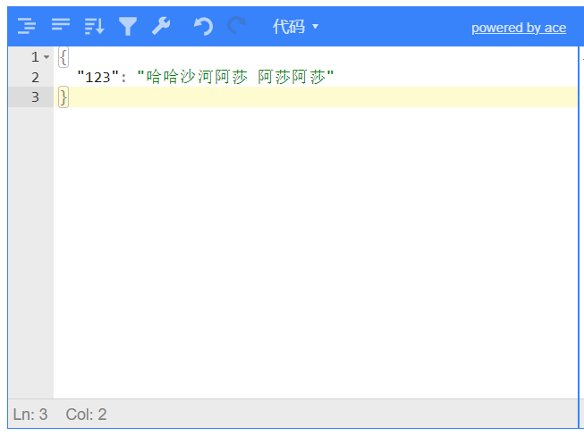

持续创作，加速成长！这是我参与「掘金日新计划 · 10 月更文挑战」的第N天，[点击查看活动详情](https://juejin.cn/post/7147654075599978532)

# 从封装JSONEditor和ElButton看如何二次封装第三方插件/库

## 前言

[JSONEditorJS](https://github.com/josdejong/jsoneditor) 是一个适用于浏览器（web端）的一个 JavaScript 工具库，可以用来查看、编辑、校验和格式化 Json 对象，并且内置了树、代码、文本、表单等多种编辑模式。

目前 GitHub 的官方仓库已经有了 React 的封装示例，并且社区也有相关的封装文章 [徐小夕 - 基于jsoneditor二次封装一个可实时预览的json编辑器组件(react版)](https://juejin.cn/post/6844904053781037064)。但是与 **BpmnJS** 类似，这个库都缺少对应的 TypeScript 声明与中文文档，所以在文章后面也会加上相关的 TypeScript 声明地址（包含参数说明）。


## 1. 封装思路

与 徐小夕 大佬的封装思路一致，在我看来，封装一个第三方库（插件或者UI组件库）都需要遵循设计模式的 **SOLID** 原则，或者说需要 **在不改变原有库的使用方式** 的情况下根据我们的项目需求进行二次封装。

本身 JSONEditorJS 库入口默认导出的是一个 **构造函数**，并且在原型上暴露了相关的实例操作方法。所以在封装时，应该保留原有的构造函数的配置项参数，并对外暴露相关原型方法，保证使用者在使用时不会因为原始库被封装导致无法调用原始方法。

而封装 ElButton 则是为了增加一种文本按钮时没有办法修改字体颜色（当然这里可以使用 class 或者 style 处理，但是个人感觉不够优雅）的问题，所以在默认的 type 类型中增加 danger-text 和 success-text 两个选项，其他状态与原始 ElButton 保持一致。

## 2. JSONEditorJS 基础封装步骤

### 2.1 引入 JSONEditorJS

使用包管理工具安装 JSONEditorJS 的方式与其他库的安装方式一样：

```shell
npm install jsoneditor
// or
yarn add jsoneditor
// or 
pnpm add jsoneditor
```

然后创建一个 JsonEditor.vue

```html
<template>
  <div class="json-editor" ref="editorEl"></div>
</template>

<script>
import JSONEditor from "jsoneditor";
import { debounce } from "jsoneditor/src/js/util";

export default {
  name: "JsonEditor",
  mounted() {
    this.initEditor();
  },
  methods: {
    initEditor() {
      this._editor = new JSONEditor(this.$refs.editorEl, {
        onChange: this.onChange,
        modes: ["tree", "view", "form", "code", "text"],
        mode: "code"
      });
    },
    // 默认事件响应
    onChange: debounce(function () {
      const jsonString = this._editor.getText();
      this._editor && this.$emit("change", jsonString);
    }, 200),
  }
};
</script>
<style lang="scss">
@import "jsoneditor/dist/jsoneditor.min.css";
</style>
```

这样我们就得到了一个最基础的json编辑组件：



### 2.2 编辑和预览

与上面的 React 版的一样，我们可以在右侧增加一个实时预览的界面。

这时需要对布局进行一点修改：

```html
<template>
  <div class="json-editor-container">
    <div class="json-editor" ref="editorEl"></div>
    <div v-if="preview" class="json-viewer" ref="viewerEl"></div>
  </div>
</template>

<script>
import JSONEditor from "jsoneditor";
import { debounce } from "jsoneditor/src/js/util";

export default {
  name: "JsonEditor",
  props: {
    preview: { type: Boolean, default: true }
  },
  mounted() {
    this.initEditor();
  },
  methods: {
    initEditor() {
      this._editor = new JSONEditor(this.$refs.editorEl, {
        onChange: this.onChange,
        modes: ["tree", "view", "form", "code", "text"],
        mode: "code"
      });
      if (this.preview) {
        this._viewer = new JSONEditor(this.$refs.viewerEl, {
          mode: "preview"
        });
      }
    },
    // 默认事件响应
    onChange: debounce(function () {
      const jsonString = this._editor.getText();
      this._editor && this.$emit("change", jsonString);
      this.preview && this._viewer && this._viewer.setText(jsonString);
    }, 200)
  }
};
</script>
<style lang="scss" scoped>
@import "jsoneditor/dist/jsoneditor.min.css";
.json-editor-container {
  height: 100%;
  overflow: hidden;
  display: flex;
  justify-content: space-between;
  box-sizing: border-box;
  .json-editor,
  .json-viewer {
    flex: 1;
    height: 100%;
  }
}
</style>
```

这里将预览部分的模式固定为 "preview" 模式，避免用户编辑导致两侧数据不一致；

采用 **debounce** 防抖处理，也是为了避免左侧编辑时去频繁的改变右侧数据，防止数据量过大时造成卡顿。

### 2.3 接收数据和自定义配置

JSONEditorJS 默认在初始化时可以接收一个配置对象，该对象包含 **27** 项配置 与 **20** 个事件处理函数。这里列举一下常用的配置和事件。

**配置项：**

- mode: 当前编辑模式
- modes：提供给工具栏切换的编辑模式备选项
- limitDragging： 是否限制跨层级拖拽
- history： 是否在工具栏显示撤销恢复的按钮（仅适用于 mode 为 tree 、form 或 preview）
- name：根节点字段对应的 key，默认是 undefined（（仅适用于 mode 为 tree 、form 或 view））
- mainMenuBar：主工具栏显示状态
- navigationBar：在 mode 为 tree 、form 或 view 是否显示面包屑部分
- statusBar：底部状态栏

- search：是否开启工具栏的搜索框
- theme：使用主题（参加 Ace 编辑器的主题设置）

**事件回调：**

- onChange: 发生改变时会触发的事件
- onChangeJSON：仅在 mode 为 tree 、form 或 view 时可用；回调函数为当前 JSON 对象，且当内容无效时会抛出异常；也不会响应更新函数造成的数据改变
- onChangeText：与 onChangeJSON 相反，回调参数为当前数据的字符串形式（无效 JSON 序列也会正常触发）；一样不会响应更新函数造成的数据改变
- onExpand：仅在 mode 为 tree 、form 或 view 时可用；回调参数为相关字段数组、状态、递归状态
- onError：在解析或者格式化等情况下发生错误时调用


我们可以将一部分常用配置通过 props 的形式由使用者传递，并配置默认值（本身 JSONEditorJS 也有对应的默认值，我们可以通过这种方法来改变默认配置）；为了支持扩展其他配置，也可以接收一个单独的 options 用来保证配置的完整性。此外还需要接收一个初始值 value，实现 v-model 语法。

```javascript
export default {
  name: "JsonEditor",
  props: {
    mode: {
      type: String,
      default: "code",
      validator(val) {
        return ["tree", "view", "form", "code", "text"].includes(val);
      }
    },
    modes: {
      type: Array,
      default: () => ["tree", "view", "form", "code", "text"]
    },
    mainMenuBar: { type: Boolean, default: true },
    navigationBar: { type: Boolean, default: true },
    statusBar: { type: Boolean, default: true },
    language: { type: String, default: 'zh-CN' },
    options: {
      type: Object,
      default: () => ({})
    },
    preview: { type: Boolean, default: true },
    value: {
      type: [Object, String],
      default: ""
    }
  },
  methods: {
    initEditor() {
      this._editor = new JSONEditor(this.$refs.editorEl, {
        ...this.options,
        modes: this.modes,
        mode: this.mode,
        // ... 其他 props
        onChange: this.onChange
      });
      if (this.preview) {
        this._viewer = new JSONEditor(this.$refs.viewerEl, {
          mode: "preview"
        });
      }
      this.setValue(this.value)
    },
    setValue(val) {
      if(!val) return
      if(typeof val === 'string') {
        this._isString = true
        this._editor.setText(val)
      }
      else {
        this._isString = false
        this._editor.set(val)
      }
    },
    onChange: debounce(function () {
      try {
      const jsonString = this._editor.getText();
      const json = this._editor.get();
      this.$emit("input", jsonString);
      this.preview && this._viewer && this._viewer.setText(jsonString);
      } catch (error) {
        
      }
    }, 200),
  }
}
```

> 注意不要同时使用 watch 监听 value 的值来 setValue，更建议通过调用方法来更新；否则可能会陷入死循环 😏

### 2.4 暴露方法

原始的 JSONEditorJS 在原型上暴露了 21 个方法，包含数据、状态的更新和获取，展开/收起，刷新销毁等。

为了能将这些方法方便的提供给上级组件使用，可以在 methods 中重新绑定这些方法。

```javascript
// 默认 JSONEditor 的方法
destroy() {
  this._editor && this._editor.destroy();
}
expand(options) {
  this._editor && this._editor.expand(options);
}
refresh() {
  this._editor && this._editor.refresh();
}
focus() {
  this._editor && this._editor.focus();
}
// ...
get() {
  return this._editor && this._editor.get();
}
getMode() {
  return this._editor && this._editor.getMode();
}
// ...
set(json) {
  this._editor && this._editor.set(json);
}
setMode(mode) {
  this._editor && this._editor.setMode(mode);
}
// ...
```

> 这里的方法笔者分成了三类：
>
> 1. 操作方法，像focus，expand 这样的方法我们直接调用
> 2. 数据/状态获取方法，大部分以 get 开头，需要我们返回对应的操作数据，则可以直接返回原始方法的执行结果
> 3. 数据/状态更新方法，大部分以 set 开够，这些方法与 操作方法 类似，不需要返回值，可以在内部直接 **透传参数调用原始方法**
>
> **为了保证正确执行，这些方法都需要预先判断实例是否存在，否则会报错**。方法说明和参数定义在文章末尾会给出项目地址

### 2.5 其他处理

因为代码中为了减少 Vue 去响应式处理相关数据/实例的问题，一些实例或者标志位都是用过 **this._xxx** 来定义的；所以在组件销毁时应该删除掉相关的方法或者重置为 undefined。

```javascript
beforeDestory() {
  this._editor && this._editor.destory();
  this._viewer && this._viewer.destory();
  this._editor = undefined;
  this._viewer = undefined;
  this._isString = undefined;
}
```

> 如果需要动态修改 options 配置项参数，也可以通过 watch 相关的 props（或者使用 computed 将所有的配置项整合一下），在配置项变化时销毁和清空当前的组件状态与实例，重新执行初始化。
>
> 在封装过程中，**如果频繁的根据用户操作去更新某个状态/属性，建议对更新操作增加一个防抖或者节流操作，避免频繁更新而使用大量资源导致卡顿，影响用户体验**。

## 3. ElButton 的基础封装

因为本身 Button 就是一个非常简单的组件，且我们的封装并不是为了改变原有的按钮使用方式，而是扩展新的功能。

```html
<template>
  <el-button
    v-bind="$attrs"
    v-on="$listeners"
    :type="buttonType"
    :class="[
      {
        'danger-text-button': type === 'danger-text',
        'success-text-button': type === 'success-text'
      }
    ]"
  >
    <template v-if="!!text">{{ text }}</template>
    <slot v-else></slot>
  </el-button>
</template>

<script>
export default {
  name: "MButton",
  props: {
    type: { type: String },
    text: { type: String }
  },
  computed: {
    buttonType() {
      if (this.type === "danger-text") return "text";
      if (this.type === "success-text") return "text";
      return this.type;
    }
  }
};
</script>
<style lang="scss">
.el-button.el-button--text.danger-text-button {
	color: #f56c6c;
	&:hover {
		color: #f78989;
	}
}
.el-button.el-button--text.success-text-button {
	color: #67c23a;
	&:hover {
		color: mix(#ffffff, #67c23a, 0.9);
	}
}
</style>
```

这里对代码部分进行一点说明：

1. 为了不影响原有的 ElButton 的参数校验（以前的 ElementUI 对 type 添加的 validator 参数校验，限制了可用类型）和内部的默认动态 class 类名绑定，这里依然是将新增的两个 type 类型通过动态属性和动态 Class 绑定，改回 text 类型并增加 class 类名来处理的。
2. 为了配合自闭合标签的写法，增加了一个 text 配置，替代原有的默认插槽；但是为了不影响以前的代码，依然保留了插槽形式。
3. style 部分，添加了 ElButton 相应的 class 前置部分，可以增加样式权重的同时也能避免外部其他元素使用 **danger-text-button** 造成的样式混乱。

## 4. 简单总结一下

上面的两个组件封装也是笔者目前在项目中常用的两种二次封装方式，虽然核心思想与之前的封装业务组件一样，都是 **保证不改变原有组件/库的使用习惯，也不影响已有代码的正常逻辑**，但是个人认为两者还是有一定的区别：

**1. 封装第三方库**

这里的第三方库一般是指纯 JS 库，或者其他与当前使用的框架不一致的组件库。封装这类组件时，通常是 **保留原有的配置项、暴露原有的操作方法**，在这个前提下，根据业务需求来确认是否需要增加其他处理逻辑，例如上文的 v-model 语法糖实现、动态 options 销毁重建、覆盖原始默认配置 等。

这样虽然改变了使用方式，但是配置与方法都与原始代码基本一致，使用者可以快速上手和查询文档，也方便在第三方库迭代后同步迭代。

**2. 二次封装UI组件**

**这种封装一般都是对原有的 UI 组件进行扩展**，如果需要改变一个组件库的使用方式或者内部逻辑，更建议修改源代码重建一个新组件。

这种扩展封装，一般需要保留原有的配置项和事件响应（Vue 中可以通过 $attrs 和 $listeners 直接透传，或者使用 extend 继承原始组件，区别在下面进行说明），在封装过程中也要确保新增加的逻辑或者样式不会对外界代码和已有代码造成污染。

使用 $attrs/$listeners 与 extend 的区别：

- $attrs/$listeners 属于透传上级组件的绑定数据给下级组件，在使用时会分别实例化两个组件实例（上文的 MButton 和 ElButton），可以在封装组件（MButton）中定义特定参数进行处理，也能在template 中添加其他元素。
- extend 则是继承原始组件的配置，在实例化时会合并两者的配置实例化一个组件；但是也因为是继承关系，按照 Vue 的设计方式，实例化时会通过合并策略合并两者的所有配置，如果需要修改 template 或者 computed 等内容，需要注意对原始组件内部其他逻辑的影响。

