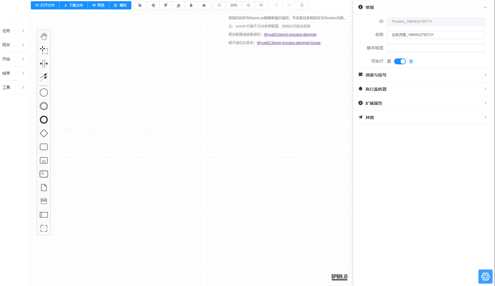
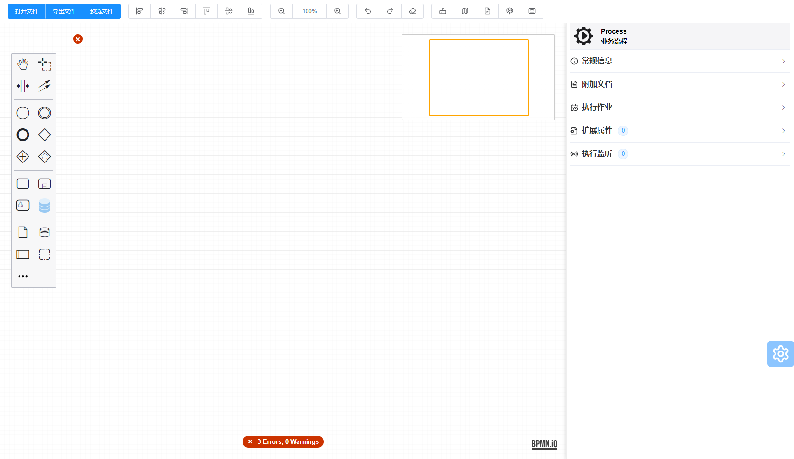

持续创作，加速成长！这是我参与「掘金日新计划 · 10 月更文挑战」的第N天，[点击查看活动详情](https://juejin.cn/post/7147654075599978532)

# 关于2k Star项目BpmnProcessDesigner的开发过程与扩展说明

## 开篇

这个项目的正式开源应该是在2020年左右了，当时做这个的初衷也是为了能在后面的工作中有用到这个的时候能比较快的完成吧（虽然后面就离职了hahaha）。在后续的开发过程中，也迭代了一个 Vue 2 的新版本和一个 Vue 3 的项目。目前这个项目在 GitHub 大约接近 1k star 了，在 Gitee 的话有 1k+，过程中有很多群友因为刚接触 Bpmn.js，对其中的一些代码不是很明白，也不好进行扩展，所以希望通过本文对这个项目的结构和扩展方式进行一些说明；在加上 Vue 2 的初始版本有很多遗留问题，也借此机会提供一点修改的思路吧。

> Bpmn.js 的相关文档和说明，也可以查看我的专栏：[Bpmn.js 进阶指南](https://juejin.cn/column/6964382482007490590)
>
> 项目地址：[GitHub](https://github.com/miyuesc/bpmn-process-designer)， [Gitee](https://gitee.com/miyuesc/bpmn-process-designer)
>
> **项目其实很简单，肯定也一样有缺陷，也希望技术大佬们轻点儿喷**

## 回归正题

因为第一版的代码个人认为缺陷比较大，所以这里从迭代后的版本开始。

### 项目搭建

项目最初就是使用 Vue CLI 创建的项目，后面配置了 Eslint 和 Prettier，用来保证代码格式统一；也添加了 git hook 校验。

后面就是目录的划分，为了区分编辑器的组成部分与演示页面，对原有的目录结构进行了重新规划，新目录如下：

```
|-- public
|-- packages
|-- utils
|-- types
|-- playground
|   |-- utils
|   |-- App.vue
|   |-- main.ts
|   |-- env.d.ts
|-- LICENSE
|-- README.md
|-- package.json
|-- vue.config.js
```

原始的 public 目录不变，将原有的 src 目录改为了 playground，用来提示该部分是演示代码。

新增了 types，utils，packages 目录，分别包含bpmn.js即相关插件的 TypeScript 声明文件、项目全局使用的工具函数、编辑器组件部分。

其中的核心当然就是 packages 中的内容了，这里分为以下部分：

1. additional-components：包含一些依赖 bpmn.js 原有插件的功能模块，因为可能与页面的某些功能有关，所以依旧命名为 components
2. additional-modules：包含对 bpmn.js 原有功能模块的扩展/自定义部分
3. bo-utils：因为 bpmn.js 中元素的相关属性都在 businessObject 中，简写为 bo，这里包含 bo 中相关属性/实例的获取、更新等操作方法，按照不同的属性分组进行了划分
4. bpmn-icons：包含默认的 bpmn.js 默认可用元素的标识图标，以及一个 类型和图标 的对应关系文件
5. bpmn-utils：包含 bpmn.js 的元素相关的处理、校验等方法
6. components：设计器的 Vue 组件部分
7. highlight：引入的第三方代码高亮组件 highlightjs
8. moddle-extensions：bpmn.js 基础描述文件，以及三大浏览器的基础描述文件（另外也有一个自定义的示例文件）
9. preset-configuration、theme、store：项目的预设配置、样式文件、Vuex 数据共享配置等

到此就是整个项目的一个基本结构了。本身项目是使用的 JavaScript 编写的，types 文件是为了支持 Vue 3 版本特意编写的声明文件，放到这里也是为了提供给用 ts 开发 Vue 2 的同学。

### 界面设计

根据市面上大部分的编辑器类型的应用程序来看，一个编辑器至少应该包含这些内容：

1. toolbar 工具栏
2. palette 元素选择区
3. content 编辑区域
4. panel 属性配置面板

所以初版的 ProcessDesigner 与迭代后的版本界面的基本一致：

初版：



新版：



> 上方都是工具栏部分，右侧为固定属性面板，中间为编辑区域；只是因为 bpmn.js 内部支持 palette 元素选择区域，所以迭代后的版本取消了左侧的自定义 palette。
>
> 另外，为了方便查看编辑器的可用配置，都固定了一个配置按钮，用来打开项目配置面板，这个在实际项目中可以省略。

所以，components 中包含一下组件：Designer 编辑区域、Toolbar 工具栏、Panel 属性面板、Settings 项目配置面板。

**整个编辑器的开发过程，个人建议是从 Designer 开始，到实现 Toolbar，最后是 Panel 属性面板**，至于为什么是这个过程，我们先回顾一下 bpmn.js。

### 回顾 Bpmn.js

Bpmn.js，官方仓库中的说明是一个可以在 web 网页查看和编辑 BPMN2.0 规范的工具，并且可以生成与解析相关的 XML/BPMN 文件。

再看一下代码（不了解的可以查看文章：[Bpmn.js 进阶指南之原理分析与模块改造](https://juejin.cn/post/7117481147277246500)），整个 bpmn.js 的项目采用的是全模块化的方式，通过依赖注入与全局事件总线实现各模块之前的联合执行。在默认的 Modeler 编辑模式下，差不多引入了全部的业务模块；并且可以通过使用官方 Panel 仓库，实现对 camunda 流程引擎的完美支持（因为是一个团队出品的）。

> 官方 Panel 面板的使用教程和扩展方式有比较完善的例子，这里不再赘述。
>
> 但是如果只使用了部分 camunda 流程引擎功能，或者使用其他流程引擎、UI 界面要求较高的情况下，更建议取消使用官方的属性面板，而是自己实现。

在使用时，Modeler 可以接收一些配置项，并且所有的配置参数都会保存在依赖系统中，可以通过 modeler.get('config') 获取到所有配置。在使用时，通常只需要定义一个 **container** 配置，确定挂载节点即可。

后续可以通过配置 additionalModules 和 moddleExtensions 来适配其他的样式或者流程引擎。

### 正式开始

### 绘制区域：Designer

> 因为增加了项目配置面板用来改变整个项目的偏好，但是在实际项目中是不需要这部分的。所以这里会保留一个 editorConfig 的偏好配置对象，但是不会做过多的说明。

我在项目中这一部分是拆分成了两个函数和一个 Vue 组件的。

**1. Vue 组件**

这部分就是单纯的定义了一个 Dom 结构，并且调用另外两个函数来获取配置和实例化 Modeler；也接受一个 xml 字符串用来初始化流程图框架（watch 部分则是监听偏好设置来重建 Modeler 实例的）。

**2. moduleAndExtensions** 函数

这个函数接收 editorConfig 对象作为参数，内部会引入所有的自定义/扩展插件和三大流程引擎的json声明文件，最后根配置组合成一个三个元素的数组，分别对应 additionalModules， moddleExtentions，options

**3. initModeler** 函数

这个函数接收了三个参数：挂载的 dom 元素，moduleAndExtensions 的返回值，组件实例。函数内部会根据 moduleAndExtensions 的返回值重新实例化一个 modeler，并更新到 store 中；并在实例中注册需要的事件。

这个函数中对注册到 store 的 modeler 实例，以及后面通过 Vue 组件事件抛出的元素等实例，都使用 unObserver 进行了处理。

> 末尾还有一个注册 右键菜单方法。

### 工具栏：Toolbar

工具栏在个人看来是一个直接提示用户的快捷操作按钮组，按照不同的功能类型对这些按钮进行了拆分：

1. 文件操作：包含导入导出和预览
2. 元素操作：包含所有的对齐操作
3. 视图操作：包含放大缩小和重置
4. 记录操作：撤销恢复和删除重做
5. 其他操作：这一部分则是与 bpmn.js 的插件相关的部分，包含流程模拟、快捷键说明、小地图等

**以上的内容都可以根据项目需求来进行调整或者增减**。

内部的功能实现，其实就是调用 bpmn.js 内置的各个功能模块的 API。

因为每个按钮的功能实现都比较简单，这里只是简单说明一下其中的一些逻辑：

1. 封装的 getModeler 方法内部就是直接获取的 store 中的保存的 modeler 实例，提出来只是为了方便查看。不在 store 中注册 getter 是因为之前进行了阻止响应式的操作。
2. 以导出为例，调用 modeler 的 saveXML/saveSVG 方法，得到的是一个字符串文件，仍然需要我们进行一些处理才能正常下载，所以在调用方法时也需要注意结果是否符合我们的需求。
3. 如果是小地图、流程模拟等 bpmn.js 本身不包含的插件的操作，最好在通过 try/catch 来使用，不然可能会对后续操作造成影响。

### 属性面板：Panel

这个部分其实也是大多数小伙伴最头疼的问题之一，因为官方的属性面板内部与 camunda 流程引擎是一个强关联的关系，在我们使用 flowable，activiti 等其他流程引擎时不适用；并且官方的 v1 版本还进行了重构，采用 preact 来实现，也不支持异步数据获取，所以在对官方的属性面板进行扩展或者修改时很有挑战性。

> 当然，v1版本的属性面板属性分组标题（GroupLabel）目前好像还不支持国际化，对要求实现中文面板的同学来说也不大友好；而且样式也不容易修改。

所以，**创建一个自己的属性面板才是最快的解决途径**。

不过因为篇幅有限，这里只对如何编写做一些说明，具体的属性更新请查看我的 GitHub 项目代码。

#### 1. 面板入口与每个配置项的拆分

以项目中的 Panel/index.vue 来说，该组件中只包含了 header 部分（显示当前图标类型），与一个for循环部分。

在面板组件实例化之后，会通过项目的事件总线 EventEmitter 设置一个 modeler-init 的订阅事件，在触发时为 modeler 实例添加 `import.done`, `selection.changed`, `element.changed`，三个事件分别在流程初始化结束时、选择的元素变化时、元素的内容被改变时 触发，通过这三个事件来**确定和更新**属性面板中的对应数据。

但是需要注意的是：

1. import.done 事件没有回调参数，可以默认显示当前的流程节点元素 Process 或者 Collaboration

2. selection.changed 事件的回调参数中包含一个 newSelection 属性，值为当前选中的元素集合，没有时为空；这里与官方的属性面板一样，默认选择数组第一个元素，没有时选择最外层流程节点元素。

3. element.changed 事件发生在元素的属性、位置等被改变时触发，参数为当前元素 element；可以在此时更新属性面板对应元素为该元素。

   但是，这个事件需要注意的是，需要对比回调参数中的元素是否是当前属性面板中选择的元素，如果是的话才更新属性面板，否则不更新。原因是属性面板一般是对应的选中的第一个元素，但是我们可以通过 api 去修改非选中元素的属性，此时也会触发该事件；如果此时更新属性面板，容易让用户误解，也容易造成后续属性更新错误的问题。

在这些事件触发之后，会调用 setCurrentElement 方法来更新 store 中的当前元素与元素ID。然后调用 setCurrentComponents 来根据当前元素类型显示不同的属性配置项。

大致代码如下：

```html
<template>
  <div class="bpmn-panel" ref="panel">
    <div class="panel-header">
      <bpmn-icon :name="bpmnIconName" />
      <p>{{ bpmnElementName }}</p>
      <p>{{ customTranslate(currentElementType || "Process") }}</p>
    </div>
    <el-collapse>
      <component v-for="cp in this.renderComponents" :key="cp.name" :is="cp" />
    </el-collapse>
  </div>
</template>

<script>
export default {
  name: "BpmnPanel",
  components: {
    BpmnIcon,
    ElementGenerations
  },
  data() {
    return {
      bpmnElementName: "Process",
      bpmnIconName: "Process",
      currentElementType: undefined,
      currentElementId: undefined,
      customTranslate,
      renderComponents: []
    };
  },
  created() {
    EventEmitter.on("modeler-init", (modeler) => {
      // 导入完成后默认选中 process 节点
      modeler.on("import.done", () => {
        this.setCurrentElement(null);
      });
      // 监听选择事件，修改当前激活的元素以及表单
      modeler.on("selection.changed", ({ newSelection }) => {
        this.setCurrentElement(newSelection[0] || null);
      });
      modeler.on("element.changed", ({ element }) => {
        // 保证 修改 "默认流转路径" 等类似需要修改多个元素的事件发生的时候，更新表单的元素与原选中元素不一致。
        if (element && element.id === this.currentElementId) {
          this.setCurrentElement(element);
        }
      });
    });
  },
  methods: {
    setCurrentElement: debounce(function (element) {
      let activatedElement = element,
        activatedElementTypeName = "";
      if (!activatedElement) {
        const modeler = getModeler();
        activatedElement =
          modeler.get("elementRegistry")?.find((el) => el.type === "bpmn:Process") ||
          modeler.get("elementRegistry")?.find((el) => el.type === "bpmn:Collaboration");

        if (!activatedElement) {
          return catchError("No Element found!");
        }
      }
      activatedElementTypeName = getBpmnIconType(activatedElement);
      this.$store.commit("setElement", { element: activatedElement, id: activatedElement.id });
      // ... 组件 header 图标等
      this.setCurrentComponents(activatedElement);
      EventEmitter.emit("element-update", activatedElement);
    }, 100),
    setCurrentComponents(element) {
      this.renderComponents.splice(0, this.renderComponents.length); // 清空
      // 重设
      this.renderComponents.push(ElementGenerations);
      // ...
    }
  }
};
</script>
```


**在这里对 store 中的数据状态配置简单说明一下**:

```javascript
const store = new Vuex.Store({
  state: {
    bpmn: {}
  },
  getters: {
    getActive: (state) => state.bpmn._activeElement
  },
  mutations: {
    clearBpmnState(state) {
      state.bpmn = {};
    },
    setModeler(state, modeler) {
      state.bpmn._modeler = unObserver(modeler);
    },
    setElement(state, { element, id }) {
      state.bpmn.activeElement = { element: unObserver(element), id };
    }
  }
});

export default store;
```

这里对 modeler 实例和当前的元素实例都用 unObserver 处理了一下，但是保留了元素 id 字符串，也是为了后续可以通过每次更新 activeElement 来触发每一个属性表单组件的更新（后来才想起来这里是直接更新了引用地址。。。）

另外也在 bpmn-utils/BpmnDesignerUtils 中定义了 getModeler 和 getActive 的方法，用来获取两个实例的实时状态；大家在实际开发过程中也可以进行对应修改。

#### 2. 属性表单

这里的拆分方式与官方的属性面板拆分方式一致，也是从官方代码中获得的灵感。

在官方项目中，每一个属性都是通过不同配置来实例化组件的，以官方的 **ID 属性配置** 来说，简化代码如下：

```javascript
export function IdProps() {
  return [{
    id: 'id',
    component: Id,
    isEdited: isTextFieldEntryEdited
  }];
}

function Id(props) {
  const { element } = props;
  const setValue = (value) => {
    modeling.updateProperties(element, { id: value });
  };
  const getValue = (element) => {
    return element.businessObject.id;
  };
  const validate = (value) => {
    const businessObject = getBusinessObject(element);
    return isIdValid(businessObject, value, translate);
  };

  return TextFieldEntry({
    element,
    id: 'id',
    label: translate(is(element, 'bpmn:Participant') ? 'Participant ID' : 'ID'),
    getValue,
    setValue,
    debounce,
    validate
  });
}
```

在入口处，会导入所有这样的属性配置函数，根据不同的元素类型进行判断，返回不同的属性配置函数 **返回值** 组成的 **数组**，最后通过 propertiesProvider 等模块实例化成真实的 dom 结构。

> 对属性面板源代码有兴趣的可以查看 **bpmn-js-properties-panel/src/provider/bpmn(or camuda-platform)/PropertiesProvider.js** 

所以在项目中，我也采用了类似的方式，通过判断元素类型来组合对应的属性配置组件。

**扯远了，回到单个属性配置项上**。

虽然我们的属性面板一般不会拆分的这么细，但是依然可以借鉴一部分。这里我们将 ID，name 等属性全部通过一个 **ElementGenerations.vue** 组件来实现。

```html
<template>
  <el-collapse-item name="base-info">
    <template #title>
      <collapse-title title="常规信息"><lucide-icon name="Info" /></collapse-title>
    </template>
    <edit-item label="ID">
      <el-input v-model="elementId" maxlength="32" @change="updateElementId" />
    </edit-item>
    <edit-item label="Name">
      <el-input v-model="elementName" maxlength="20" @change="updateElementName" />
    </edit-item>
    <template v-if="isProcess">
      <edit-item key="version" label="Version">
        <el-input v-model="elementVersion" maxlength="20" @change="updateElementVersion" />
      </edit-item>
      <edit-item key="executable" label="Executable">
        <el-switch v-model="elementExecutable" @change="updateElementExecutable" />
      </edit-item>
    </template>
  </el-collapse-item>
</template>

<script>
  export default {
    mounted() {
      this.reloadGenerationData();
      EventEmitter.on("element-update", this.reloadGenerationData);
    },
    methods: {
      reloadGenerationData() {
        this.isProcess = !!getActive() && getActive().type === "bpmn:Process";
        this.elementId = getActive().id;
        this.elementName = getNameValue(getActive()) || "";
        if (this.isProcess) {
          this.elementExecutable = getProcessExecutable(getActive());
          this.elementVersion = getProcessVersionTag(getActive()) || "";
        }
      },
      updateElementName(value) {
        setNameValue(getActive(), value);
      },
      updateElementId(value) {
        setIdValue(getActive(), value);
      },
      updateElementVersion(value) {
        const reg = /((\d|([1-9](\d*))).){2}(\d|([1-9](\d*)))/;
        if (reg.test(value)) {
          setProcessVersionTag(getActive(), value);
        } else {
          catchError("版本号必须符合语义化版本2.0.0 要点");
        }
      },
      updateElementExecutable(value) {
        setProcessExecutable(getActive(), value);
      }
    }
  };
</script>
```

> 为了减少点代码量，这里把 data() 变量声明和 import 部分都去掉了。

因为 Id，name 等可以说都是元素的基本属性，所以这里放在了同一个 Vue 文件中；然后值的获取、更新就通过在 bo-utils 中定义对应的方法来实现，以上面的 version 字段 为例：

```javascript
export function getProcessVersionTag(element) {
  const prefix = getProcessEngine();
  return element.businessObject.get(`${prefix}:versionTag`);
}

export function setProcessVersionTag(element, value) {
  const modeling = getModeler.getModeling();
  const prefix = getProcessEngine();
  modeling.updateProperties(element, {
    [`${prefix}:versionTag`]: value
  });
}
```

为了保证项目能够适配多个流程引擎的 流程图绘制，会对每个流程引擎配置特定的属性前缀来提供给流程引擎解析，所以有 **getProcessEngine** 的方法。

之后的数据获取、更新就是通过本身的 API 来实现了。

#### 3. 复杂属性

上面的属性属于非常简单的属性更新，但是像配置执行监听器、任务监听器、超时等配置时，则会涉及到很多的属性获取、更新以及逻辑判断。

以 执行监听器 ExecutionListeners 为例，在提出了对应的方法之后Vue 文件内部依然还有两百行代码，而提取出去的方法部分也有两三百行左右。在我们更新某个监听器的时候，如果每更新一个属性就去更新元素属性的话，会频繁的触发 element.changed 操作，所以这里也是通过一个弹窗来保证用户在把一个监听器需要的数据都填写完之后在调用方法更新到元素实例上；至于移除，其实就是根据下标找到对应的监听器然后从原有的数组中去除掉。

```html
<template>
  <el-collapse-item name="element-execution-listeners">
    <template #title>
      <collapse-title title="执行监听"><lucide-icon name="Radio" /></collapse-title>
      <number-tag :value="listeners.length" margin-left="12px" />
    </template>
    <div class="element-extension-listeners">
      <el-table border :data="listeners" style="width: 100%" height="200px">
        <el-table-column label="操作" width="140">
          <template slot-scope="{ row, $index }">
            <el-button type="text" @click="openListenerModel($index, row)">编辑</el-button>
            <el-button type="text" @click="removeListener($index)">移除</el-button>
          </template>
        </el-table-column>
      </el-table>
      <el-button type="primary" class="inline-large-button" icon="el-icon-plus" @click="openListenerModel(-1)">
        添加执行监听
      </el-button>
    </div>
    <el-dialog :visible.sync="modelVisible" title="添加执行监听器" width="640px" append-to-body destroy-on-close>
      <el-form ref="formRef" :model="newListener" :rules="formRules" class="need-filled" aria-modal="true">
      </el-form>
      <template #footer>
        <el-button type="primary" @click="saveExecutionListener">确 认</el-button>
      </template>
    </el-dialog>
  </el-collapse-item>
</template>

<script>
export default {
  name: "ElementExecutionListeners",
  mounted() {
    this.reloadExtensionListeners();
    EventEmitter.on("element-update", this.reloadExtensionListeners);
  },
  methods: {
    reloadExtensionListeners() {
      this.modelVisible = false;
      this.updateListenerType("class");
      this.newListener = { event: getDefaultEvent(getActive()), type: "class" };
      this.listenerEventTypeOptions = getExecutionListenerTypes(getActive());
      this._listenersRaw = getExecutionListeners(getActive());
      const list = this._listenersRaw.map((item) => ({
        // ... 拷贝处理
      }));
      this.listeners = JSON.parse(JSON.stringify(list));
    },
    removeListener(index) {
      const listener = this._listenersRaw[index];
      removeExecutionListener(getActive(), listener);
    },
    async saveExecutionListener(index) {
      await this.$refs.formRef.validate();
      this.activeIndex === -1
        ? addExecutionListener(getActive(), this.newListener)
        : updateExecutionListener(getActive(), this.newListener, this._listenersRaw[this.activeIndex]);
    }
  }
};
</script>
```

在提出去的 addExecutionListener，updateExecutionListener，removeExecutionListener 三个方法中，最终都是通过调用一个方法来更新的

```javascript
export function addExecutionListener(element, props) {
  const prefix = getProcessEngine();
  const moddle = getModeler.getModdle();
  const businessObject = getListenersContainer(element);
  const listener = moddle.create(`${prefix}:ExecutionListener`, {});
  updateListenerProperty(element, listener, props);
  addExtensionElements(element, businessObject, listener);
}

export function updateExecutionListener(element, props, listener) {
  removeExtensionElements(element, getListenersContainer(element), listener);
  addExecutionListener(element, props);
}

export function removeExecutionListener(element, listener) {
  removeExtensionElements(element, getListenersContainer(element), listener);
}

export function addExtensionElements(element, businessObject, extensionElementToAdd) {
  const modeling = getModeler.get("modeling");
  let extensionElements = businessObject.get("extensionElements");
  if (!extensionElements) {
    extensionElements = createModdleElement("bpmn:ExtensionElements", { values: [] }, businessObject);
    modeling.updateModdleProperties(element, businessObject, { extensionElements });
  }
  extensionElementToAdd.$parent = extensionElements;
  modeling.updateModdleProperties(element, extensionElements, {
    values: [...extensionElements.get("values"), extensionElementToAdd]
  });
}
export function removeExtensionElements(element, businessObject, extensionElementsToRemove) {
  if (!isArray(extensionElementsToRemove)) {
    extensionElementsToRemove = [extensionElementsToRemove];
  }
  const extensionElements = businessObject.get("extensionElements"),
    values = extensionElements.get("values").filter((value) => !extensionElementsToRemove.includes(value));
  const modeling = getModeler.get("modeling");
  modeling.updateModdleProperties(element, extensionElements, { values });
}
```

最终，在处理好移除、新增之后，都会更新原有的扩展配置数组 **extensionElements** 的数据。

> 这里的 update 操作也是通过先移除再添加的方式来实现的，其实也有一定缺陷。在后面介绍 bpmn.js 的属性更新方法之后大家可以尝试修改一下

#### 4. 属性更新方法

bpmn.js 内实现的属性更新方法有两个：modeling.updateProperties 与 modeling.updateModdleProperties。

大体区别如下：

**updateProperties**：

接收两个参数：element 和 properties，会将 properties 中的内容全部更新到 element.businessObject 中，如果有相同属性，则以新属性为准。可以看做是 Object.assign(element.businessObject, properties)

**updateModdleProperties**：

接收三个参数：element，moddleElement，properties；其中 moddleElement 必须是 element.businessObject 或者 element.businessObject 内部某一个层级的属性；在更新时一样类似 Object.assign(moddleElement, properties)

在源代码中，updateProperties 这个方法就是调用 updateModdleProperties 实现的，其中第二个参数就是 element.businessObject。除了更新 bo 上的直接属性之外，个人更建议都通过 updateModdleProperties 这个方法来更新元素属性。

#### 5. 解答一下在节点元素生成的 xml 标签中插入新标签

这个问题其实与我们的json 声明文件有关，详情可以查看 [bpmn.js自定义描述文件说明](https://juejin.cn/post/6912331982701592590)。

在文件中定义的每一个属性，都可以在符合定义规则的条件下使用，会在xml中体现为标签属性、标签内部内容或者在内部创建一个新的标签，这些都取决于每个属性的 superClass 和 extend 定义。superClass 与 js 的 extends 一样，会有一个链式的继承关系，在这个关系只要有继承到 Element 属性，即可以创建一个 xml 标签；而 extend 则是扩展目标属性，自身只作为一个增强配置。

### 扩展属性面板

因为该项目没有打包为 npm 依赖的计划，所以使用时都是建议直接拉取源码进行使用，也方便修改和扩展。

在需要配合后端的需求增加配置的时候，可以仿照项目中的每个属性表单组件进行编写；核心就是通过事件总线 EventEmitter 来监听元素变化，重新设置表单数据。在更新时通过 getModeler.get() 和 getActive() 获取相应的 bpmn.js 插件和当前元素来进行更新操作。

面板的编写过程其实不是难点，难的是根据 json 声明文件来进行正确的属性实例化操作；或者根据后端需求来编写相应的 json 声明文件；在面板的编写中，也要注意的就是 两个属性更新方法 的调用次数！这两个方法的每次调用都会在 commandStack 中插入一条记录，影响正常的撤销恢复操作。

### 旧版项目的调整

因为旧版的项目没有用到 Vuex，而是通过在 window 对象中添加一个 bpmnInstances 的对象用来保存 modeler、element 等实例，在属性面板中又是通过 props 直接传递了元素的 businessObject 属性来实现的，在实际项目可能会因为页面需要多个流程编辑器/查看器的时候造成 bpmnInstances 混乱的问题。而且 Vue 默认会对 props 参数也进行 Observe 处理，有可能导致后面的属性更新、获取异常。

如果因为已经使用且进行了很多改动的话，建议就保持原样；如果还只是才引入的话，建议切换为最新的版本或者更改之前的数据保存方式；针对属性面板的改动的话，原本的代码基本上也可以使用，只是属性面板的入口文件代码有些累赘，且部分判断方法有问题，建议参照新版的入口文件进行修改。

## 后语

在写完这篇文章之后，个人也感觉有些地方说的不是很清楚，但是奈何 bpmn.js 这个东西的自定义方式太多，针对不同的流程引擎不同的项目需求都有不同的处理方式，每一个属性面板的内容和布局也不尽相同，所以我这里能做的只能是尽可能把自定义属性面板的重点部分进行说明。

在平时的讨论中，也有同学的需求是修改元素的渲染方式（也就是自定义 render），或者修改左侧的 palette，又或者是需要在创建时附带各种默认配置。虽然这些需求大部分都能实现，但是因为文档的缺失（不仅是中文文档，英文文档也很少），导致在实现这些效果的时候经常会摸不着头脑。虽然我也在这个项目中进行了一些其他功能的扩展和重写，也希望能给大家提供一点帮助或者提示，不过目前看起来好像效果都不是很好，只能说大家有问题可以联系 霖呆呆LinDaiDai 来讨论。

至于说使用 logicFlow、antd x6 等来进行开发，只能说看项目需求。在项目需要的是显示效果而不是流程复杂度的时候，可以通过这两个来进行开发，毕竟在自定义渲染和交互上面这两个库有很大的优势；但如果对流程引擎的使用程度比较深，需要很多各种配置的情况下，个人觉得还是 bpmn.js 更胜一筹，毕竟专业的。

最后，如果本文对您有帮助的话，也希望有一个点赞和收藏，如果有疑问，也可以在评论里面提出来。

### 往期精彩

[Bpmn.js 进阶指南](https://juejin.cn/column/6964382482007490590)

[Vue 2 源码阅读理解](https://juejin.cn/column/7136858810605371399)

[一行指令实现大屏元素分辨率适配(Vue)](https://juejin.cn/post/7148476639343542279)

[基于 Vue 2 与 高德地图 2.0 的“线面编辑器”](https://juejin.cn/post/7142746736690200612)
