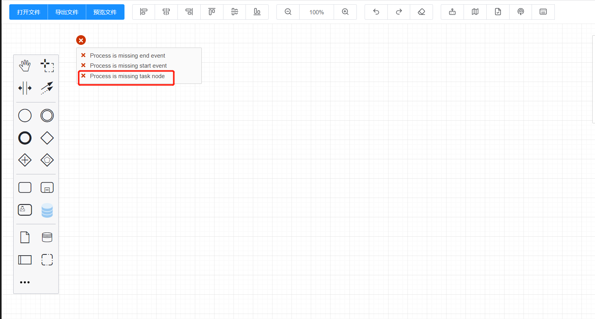

持续创作，加速成长！这是我参与「掘金日新计划 · 10 月更文挑战」的第N天，[点击查看活动详情](https://juejin.cn/post/7147654075599978532)

## 前言

关于 bpmn.js 的流程图校验工具 “bpmnLint”，在之前已经分了三小节讲解了默认规则的使用方式和整个校验过程。如果有没有看过的同学可以查看专栏 [bpmn.js 进阶指南](https://juejin.cn/column/6964382482007490590) 中的 【Bpmn.js 进阶指南之Lint流程校验（1，2,3）】

当然个人更加推荐的是将默认规则提取到自己的项目中，有利于理解校验过程和二次开发。**本小节则侧重于自定义规则的编写**。

## 1. 回顾 bpmnlint 的使用

因为最终所有的规则配置和bpmnlint校验模块都会打包成一个 js 代码，提供给浏览器编译和执行，所以这里只简单回顾一下默认规则的js文件编写。

### 1.1 首先，安装相关依赖

这里需要安装两个依赖包：

1. **bpmnlint**：规则校验的执行者，通过 **Resolver** 函数来引用和解析规则配置，并输出校验结果
2. **bpmn-js-bpmnlint**：负责触发规则校验和显示校验结果

我们可以直接在项目中进行安装：

```
npm install bpmnlint bpmn-js-bpmnlint
```

### 1.2 配置编译规则

在 [Bpmn.js 进阶指南之Lint流程校验(三)](https://juejin.cn/post/7128995058879037447) 中已经大致讲述了，我们可以直接使用 **bpmn-js-bpmnlint** 来注册校验模块，引用 **bpmnlint** 中的规则来进行二次规则开发。但是在初始化 **bpmn-js-bpmnlint** 就需要传入一个规则配置对象和 **Resolver** 规则解析函数。

所以，首先我们新建一个 **bpmnlintModule.js** 的文件，用来引入默认规则和 Resolver:

```javascript
import conditionalFlowRule from "bpmnlint/rules/conditional-flows";
// ... 剩余规则同样方式引入

// 规则缓存对象
const cache = {}

// 缓存规则函数
cache["bpmnlint/conditional-flows"] = conditionalFlowRule;

// Resolver 构造函数（这里可以直接使用官方提供的编译后版本）
function Resolver() {}
Resolver.prototype.resolveRule = function (pkg, ruleName) {
  const rule = cache[pkg + "/" + ruleName];
  if (!rule) {
    throw new Error("cannot resolve rule <" + pkg + "/" + ruleName + ">");
  }
  return rule;
};
Resolver.prototype.resolveConfig = function (pkg, configName) {
  throw new Error("cannot resolve config <" + configName + "> in <" + pkg + ">");
};

// 导出 resolver 实例
export const resolver = new Resolver();

// 导出 需要启用的规则
const rules = {
  "conditional-flows": "error",
  // ...
};
```

### 1.3 配置 Modeler

在以上规则配置完成之后，就可以进行 Modeler 的实例化了。

```javascript
import Modeler from "bpmn-js/lib/Modeler";
// 流程图校验部分
import lintModule from "bpmn-js-bpmnlint";
import { resolver, rules } from "@packages/additional-modules/Lint/bpmnlint";

const modeler = new Modeler({
  container: document.querySelector('#bpmn-canvas'),
  additionalModules: [
    lintModule
  ],
  linting: {
    active: true, // 默认直接开启校验
    bpmnlint: {
      config: {
        rules: { ...rules, "task-node-required": "error" }
      },
      resolver
    }
  }
})
```

> 至此，一个包含有默认规则校验配置的流程图实例就算是结束了。

## 2. 自定义校验规则

在上一节 [Bpmn.js 进阶指南之Lint流程校验(三)](https://juejin.cn/post/7128995058879037447#heading-2) 中，讲过了 **bpmnlint** 提供的 **Linter** 实例，在执行流程校验时其实就是遍历了 **rules** 中的配置规则，找到相应的校验函数来校验；通过 **applyRule** 方法调用 **testRule** 来执行校验函数中的 **check()** 方法。

所以，**每一个规则校验函数都至少需要包含一个 check 方法**。

> 本身每个 rule 规则函数可以配置还有 enter 和 leave，但是通常情况下我们直接返回一个 check 函数即可，这里直接根据官方的例子来说明。

### 2.1 创建规则函数

这里，我们假设有一个新规则：每个流程或者子流程必须包含一个任务类型节点。

首先，创建一个校验文件 **task-required.js**

```javascript
const { is, isAny } = require("bpmnlint-utils");

module.exports = function () {
  function hasTask(node) {
    const flowElements = node.flowElements || [];
    return flowElements.some((node) => is(node, "bpmn:Task"));
  }

  function check(node, reporter) {
    if (!isAny(node, ["bpmn:Process", "bpmn:SubProcess"])) {
      return;
    }

    if (!hasTask(node)) {
      const type = is(node, "bpmn:SubProcess") ? "Sub process" : "Process";

      reporter.report(node.id, type + " is missing task node");
    }
  }

  return { check };
};
```

>  上面的 is 和 isAny 函数可以改成 **bpmn-js** 中的一些函数，或者一些自定义方法。

### 2.2 注册新建规则

这一步其实很简单，只需要在上面创建的 **bpmnlintModule.js** 中将该规则函数引入，并添加到 **cache** 和 **rules** 中。

```javascript
import taskRequired from "./customLintRules/task-required";

// ... 省略上面的部分

cache["bpmnlint/task-required"] = taskRequired;

rules["task-required"] = "error"; // 校验结果分类，分为 error 错误类 和 warning 警告类
```

最后，刷新页面重新实例化 Modeler 即可使用新建规则



## 3. check 函数

**check** 函数接收两个参数：node 和 reporter

- node：当前遍历到的元素实例
- reporter：负责输出校验结果

其中 reporter 函数也接受两个参数：

- id：节点的 id，用来处理错误信息的保存位置
- message：错误信息


整个自定义规则函数需要返回一个对象，其中 **check** 函数就作为返回对象的方法，提供给后面 Linter 执行校验时执行。


> 至此，Bpmn.js 的校验配置和解析就大致结束了。但是怎么去美化错误信息提示、默认的错误信息提示的实现方式，都可以在后面慢慢说明。