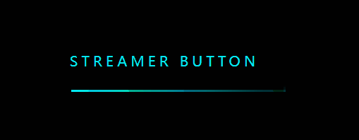
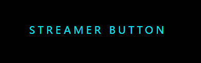
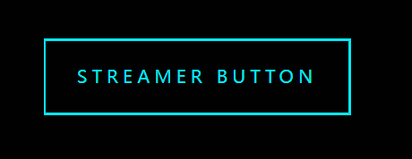
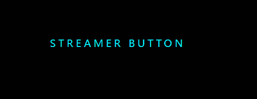

持续创作，加速成长！这是我参与「掘金日新计划 · 10 月更文挑战」的第N天，[点击查看活动详情](https://juejin.cn/post/7147654075599978532)

# CSS进阶向--纯css实现流光边框

CSS 作为“前端三剑客”之一，也是前端程序员入门时必须学习的基础技术之一。但是大家常常都局限于使用简单的 CSS 布局或者使用 UI 库提供的一些样式组件来实现 UI 需求，那么如何深入学习 CSS，并结合 CSS 动画实现一些炫酷的效果呢？

我们从最简单的按钮开始。

## 1. 效果

假设 UI 同学提供了一个这样的需求，需要实现一个“流光”效果边框的按钮。



当然，这个效果已经有一些著名的 CSS 样式库内置了这种样式，但是我们依然需要弄清楚他们的实现原理。

## 2. 实现

首先，这样的效果基本上是很难用传统的一个 Button 按钮来实现的，都需要我们增加其他的 dom 元素来实现动画效果。

假设我们这个按钮是需要用来进行跳转操作的，所以这里就直接用一个 a 标签来实现。

```html
<a href="#streamer">
  Streamer button
</a>

<style type="text/css">
  a{
    position: relative;
    display: inline-block;
    padding: 25px 30px;
    margin: 40px 0;
    color: #03e9f4;
    text-decoration: none;
    text-transform: uppercase;
    transition: 0.5s;
    letter-spacing: 4px;
    overflow: hidden;
    margin-left: 50px;  
  }
</style>
```

这样，我们就得到了一个按钮的雏形：



**然后，我们来实现边框**。

因为默认的边框很难做到切分和异步动画效果，所以这里采用几个 span 元素来模拟按钮边框。

```html
<a href="#">
  <span></span>
  <span></span>
  <span></span>
  <span></span>
  Streamer button
</a>
<style type="text/css">
  a span{
    position: absolute;
    display: block;
  }
  a span:nth-child(1){
    top: 0;
    left: 0;
    width: 100%;
    height: 2px;
  }
  a span:nth-child(2){
    top: 0;
    right: 0;
    width: 2px;
    height: 100%;
  }
  a span:nth-child(3){
    bottom: 0;
    right: 0;
    width: 100%;
    height: 2px;
  }
  a span:nth-child(4){
    bottom: 0;
    left: 0;
    width: 2px;
    height: 100%;
  }
</style>
```

此时，我们就得到了这样一个比较完善的按钮：



**然后，我们就需要让边框动起来。**

因为四个 span 位置都不同，所以每一个 span 标签对应的动画也不一样（这里就省略 html 的 dom 部分）。

```css
body {
  background-color: #010101;
}
a{
    position: relative;
    display: inline-block;
    padding: 25px 30px;
    margin: 40px 0;
    color: #03e9f4;
    text-decoration: none;
    text-transform: uppercase;
    transition: 0.5s;
    letter-spacing: 4px;
    overflow: hidden;
    margin-left: 50px;
   
}

a span{
    position: absolute;
    display: block;
}
a span:nth-child(1){
    top: 0;
    left: 0;
    width: 100%;
    height: 2px;
    background: linear-gradient(90deg,transparent,#03e9f4);
    animation: animate1 1s linear infinite;
}
@keyframes animate1{
    0%{
        left: -100%;
    }
    50%,100%{
        left: 100%;
    }
}
a span:nth-child(2){
    top: -100%;
    right: 0;
    width: 2px;
    height: 100%;
    background: linear-gradient(180deg,transparent,#03e9f4);
    animation: animate2 1s linear infinite;
}
@keyframes animate2{
    0%{
        top: -100%;
    }
    50%,100%{
        top: 100%;
    }
}
a span:nth-child(3){
    bottom: 0;
    right: 0;
    width: 100%;
    height: 2px;
    background: linear-gradient(270deg,transparent,#03e9f4);
    animation: animate3 1s linear infinite;
}
@keyframes animate3{
    0%{
        right: -100%;
    }
    50%,100%{
        right: 100%;
    }
}
a span:nth-child(4){
    bottom: -100%;
    left: 0;
    width: 2px;
    height: 100%;
    background: linear-gradient(360deg,transparent,#03e9f4);
    animation: animate4 1s linear infinite;
}
@keyframes animate4{
    0%{
        bottom: -100%;
    }
    50%,100%{
        bottom: 100%;
    }
}
```

这时，我们得到了这样一个效果：



**最后，我们需要通过延迟每个边框的动画开始时间**。

这里就用到了一个重要属性：**animation-delay**，该属性接收一个时间配置（"number" + "s/ms"）,表示该动画的开始帧触发时刻，可以接收负数，表示提前多少执行。

> 一般提前部分我们都无法看见，所以也可以理解为动画的第一帧被移动到该时刻与完整动画时长对应比例的位置。

我们分别为每一个 span 增加一个 animation-delay 配置。

```css
a span:nth-child(1){
    animation-delay: 0s;
}
a span:nth-child(2){
    animation-delay: 0.25s;
}
a span:nth-child(3){
    animation-delay: 0.50s;
}
a span:nth-child(4){
    animation-delay: 0.75s;
}
```

因为 设置为 0 时是正常触发和执行动画，所以也可以省略。

最终的效果如下：


[代码片段](https://code.juejin.cn/pen/7151052557979222046)
