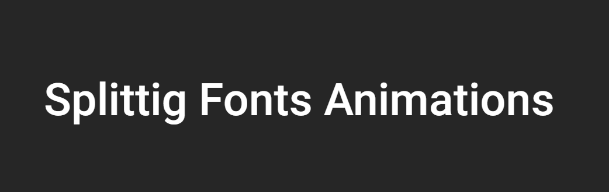

持续创作，加速成长！这是我参与「掘金日新计划 · 10 月更文挑战」的第N天，[点击查看活动详情](https://juejin.cn/post/7147654075599978532)

# 利用SplitingJS配合CSS实现文字蠕动效果

## 前言

这效果是在 CodePen 上发现的，感觉比较有意思，也有很多值得参考的地方，所以借更文的机会来分析一下。

这个效果目前包含了 SplittingJS，CSS 变量，requestAnimationFrame 重绘回调等，因为本身是使用 js 来持续改变每个元素的样式的，后面也会修改成 css 动画的形式。

## SplittingJS

首先，我们来介绍一下 SplittingJS。

[SplittingJS](https://splitting.js.org/guide.html)，是一个小型的 JavaScript 方法库，主要用来 **按配置分割元素**，例如 单词、字符、子节点、图片等。

这个库本身不处理任何动画，仅做元素的拆分；开发者可以利用 JavaScript 或者 CSS 为元素创建动画。拆分后的内容大多数都是通过一系列 span 标签重新组合成原来的显示效果，并为每个 span 标签添加一个 **索引属性作为 css 变量 `--char-index`**。

举个例子：

我们有这样一个文本标签：

```html
<div data-splitting>ABC</div>
```

而在调用 Spliting() 方法之后，该节点会被拆分成：

```html
<div data-splitting class="words chars splitting" style="--word-total:1; --char-total:3;">
  <span class="word" data-word="ABC" style="--word-index:0;">
    <span class="char" data-char="A" style="--char-index:0;">A</span>
    <span class="char" data-char="B" style="--char-index:1;">B</span>
    <span class="char" data-char="C" style="--char-index:2;">C</span>
  </span>
</div>
```

### 使用

可以直接通过 cdn 的方式引入，也可以使用包管理工具安装。

```
<script src="https://unpkg.com/splitting/dist/splitting.min.js"></script>
// or
npm install splitting
```

在引入 JavaScript 文件之后，还需要引入两个预设值的样式文件：

- **splitting.css**：包括许多额外的 CSS 变量和伪元素，有助于为高级动画提供动力，尤其是文本。
- **splitting-cell.css**：包含基于单元格/网格的效果的基本设置样式，需要浏览器支持 grid 布局

SplitingJS 的 JavaScript 文件默认导出一个 **Splitting** 函数，该函数接收三个可选参数：

1. **target**：可选的元素列表或者选择器，也可以是元素属性；**默认是元素属性 [data-splitting]** 
2. **by**：需要使用的 **拆分模式**，默认是按字符进行拆分
3. **key**：作为索引属性的前缀，本身默认是 **--char-index**，如果传递了一个前缀为 **vue**，则生成元素的索引属性会变为 **--vue-char-index**

该函数根据不同的拆分模式，也有不同的返回值，具体可以查看官方文档 [splitting js](https://splitting.js.org/guide.html#what-is-splitting)

## CSS 变量

css 变量在17年微软宣布 Edge 浏览器也支持之后，市面上所有的主流浏览器都支持了这个功能。

CSS 变量的声明以 `--` 作为标志符，用来声明一个 **变量值**。变量的声明还 **可以通过行内样式声明，在外部样式中使用**。

> CSS 变量的声明是 **大小写敏感的**

在使用时，可以通过 **var()** 函数使用该变量，并且该函数还接收 **第二个参数** 作为 **变量不存在时的默认值**。

另外，CSS **变量也有作用域的概念**。

通过 **:root** 声明的变量属于 **全局变量**，而在选择器内声明的变量，则只能在该选择器中使用。

## requestAnimationFrame 函数

该函数是 window 对象下的一个函数，主要用来提示浏览器 **此时需要执行动画** ，并且在 **下一次重绘之前调用该函数传入的回调函数来更新动画**。

> 如果需要 **持续更新动画**，则需要在 **回调函数中再次调用 requestAnimationFrame(callback)**

- requestAnimationFrame() 与 setInterval、setTimeout 类似，属于定时任务；但是它不需要手动设置间隔时间，而是 **以屏幕刷新率为依据计算时间间隔**
- callback 回调函数会接收一个时间戳参数，默认是 **当前刷新时刻的时间戳格式**，即使配置了多个 **requestAnimationFrame(callback)**，每个 callback 接收到的时间戳参数 **值都是一样的**
- 在当前标签页被隐藏或者浏览器被最小化时（**即当前页面不可见**），此时 requestAnimationFrame **会暂停调用**，在页面重新可见后在继续执行

## requestAnimationFrame 配合 CSS 实现

> 因为该效果需要字体支持 **多种粗细程度**，系统默认的 微软雅黑 或者 苹方 是没有的，所以外部引入了一种新的字体 Roboto-VF

**首先，我们创建一个基础的文本节点和 css 样式**

```html
<p>
  <span class="line" data-splitting>Splittig Fonts Animations</span>
</p>

<style>
@font-face {
  font-family: 'Roboto VF';
  src: url("https://s3-us-west-2.amazonaws.com/s.cdpn.io/57225/Roboto-VF.woff2") format("woff2-variations");
  font-stretch: 75% 100%;
  font-style: oblique 0deg 12deg;
  font-weight: 100 900;
}
:root {
  --text-weight: 500;
  --text-width: 100;
}
body {
  font-family: "Roboto VF", sans-serif;
  min-height: 100vh;
  display: flex;
  flex-direction: column;
  justify-content: center;
  align-items: center;
  background: #262626;
  color: #fff;
  padding: 7vmin;
}
p {
  max-width: 100%;
  text-align: center;
  font-size: 5vw;
}
.line {
  display: block;
}
.char {
  font-weight: var(--text-weight);
  text-shadow: 0 0 calc(var(--glow-size) * 1px) hsla(var(--glow-hue), 100%, 77%, 1);
}
</style>
```

此时效果如下：



**然后，我们开始编写 JavaScript 部分**。

通过引入 SplitingJS 对文本部分进行拆分之后，再通过 **requestAnimationFrame** 来持续更新动画状态。

```javascript
const WEIGHTS = {
  MIN: 100,
  MAX: 900,
};
let offset = 0;

// 拆分字符
Splitting();

const letters = document.querySelectorAll('.char');
let numLetters = letters.length;

function map(value, min1, max1, min2, max2) {
  return (value - min1) * (max2 - min2) / (max1 - min1) + min2;
}
function mirror(val) {
  return Math.abs(val * 2 - 1) * -1 + 1;
}

function loop() {
  letters.forEach((letter, index) => {
    let offsetIndex = (index + offset) % numLetters;
    let indexNorm = offsetIndex / numLetters;
    indexNorm = mirror(indexNorm);
    const weight = map(indexNorm, 0, 1, WEIGHTS.MIN, WEIGHTS.MAX);
    const hue = map(indexNorm, 0, 1, 0, 255);
    const glowSize = map(indexNorm, 0, 1, 0, 100);
    letter.style.setProperty('--text-weight', weight);
    letter.style.setProperty('--glow-hue', hue);
    letter.style.setProperty('--glow-size', glowSize);
  });
  // 每次执行动画之后都把偏移量进行调整
  offset += 0.1;
  requestAnimationFrame(loop);
}

window.requestAnimationFrame(loop);
```

这我们先不看两个辅助函数 map 和 mirror。核心方法就是 loop 函数。

在 loop 执行过程中，首先是遍历 **所有拆分后的字符元素集合**，按照顺序为每个元素添加 **不同的 class 变量值**；而因为元素的 css 变量发生改变，元素本身的显示效果也随之更改。

最后将 偏移量 offset 进行调整，重新调用 requestAnimationFrame。

这样每次执行 loop 函数时，所有字符元素的变量值都发生了改变，从而实现“蠕动”的效果。

[代码片段](https://code.juejin.cn/pen/7154401358819524642)

## CSS 动画实现

因为该效果的核心其实就是 **改变字体的 fontWeight 属性和文字阴影 textShadow** 来实现的，所以我们也可以通过 **animation 配合 animationDelay** 来实现。

> 本身的 dom 部分和基础样式部分不变。这里了省略该部分代码

我们首先定义元素的 **动画帧** 和拆分后的样式，上文说到默认拆分后的每个字符的类名都为 **char**，所以这里直接编写 css 的部分。

```css
.char {
  animation: wordScale infinite 4s ease;
}

@keyframes wordScale {
  0%, 100% {
    font-weight: 800;
    text-shadow: 0 0 calc(34px) rgb(255, 208, 138);
  }
  50% {
    font-weight: 10;
  }
}
```

此时我们可以得到这样的效果：


当然，此时每个元素的动画都是同时进行的，所以需要配置 **animationDelay** 来调整每个动画的开始时刻。

这里我们可以**用 js 去计算总字符长度来动态设置动画延迟**，也可以通过 SplittingJS 拆分后添加的索引属性变量 **--char-index** 来设置。两种方式代码如下：

```css
/* 当然，此时依然要在 js 部分执行 Splitting()，进行字符拆分 */
.char {
  animation: wordScale infinite 4s ease;
  animation-delay: calc(var(--char-index) * -0.4s);
}
```

```javascript
// 方式2
Splitting();

const letters = document.querySelectorAll('.char');
let numLetters = letters.length;
(function() {
  for(let i = 0; i <= numLetters; i++) {
    letters[i].style.animationDelay = 4 * i / numLetters + 's'
  }
})()
```

> 但是因为字符的长度我们不一定能完全的预先确认，如果 **依然要使用 css 方案的话**，建议在外部增加一个 CSS 变量用来设置字符串总长度。不然更加推荐使用 JavaScript 来设置。

此时效果如下：

[代码片段](https://code.juejin.cn/pen/7154636223146000399)

## 最后

从两种实现方式与实现效果来看，使用 **js 配合 css 变量** 来实现动画效果是比较完美的，第二种使用 css 动画的方式虽然也能实现类似的效果，但是总体而言还是差了一些。

如果需要用纯 css 实现的话，代码量上也要比 js+css 的方案来的更多（当然个人的 css 功底不足也占很大一部分原因😓）。

而 SplittingJS 除了可以实现文字的拆分之外，也可以对图片进行切分，从而实现更加炫酷的效果；也希望借此次机会能尝试一下~~