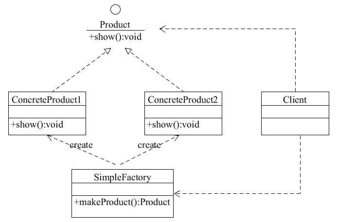
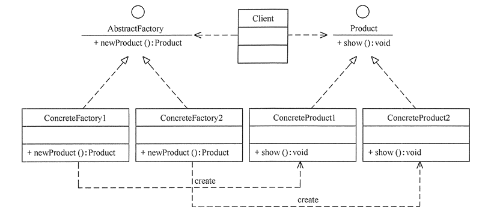
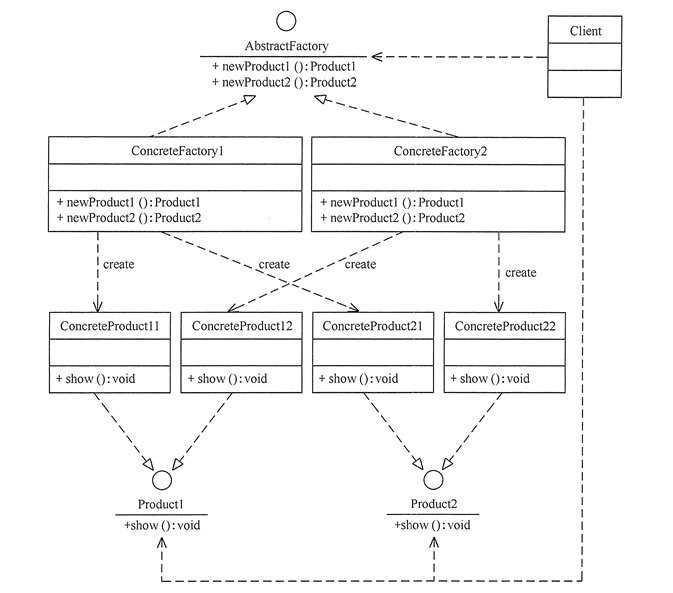
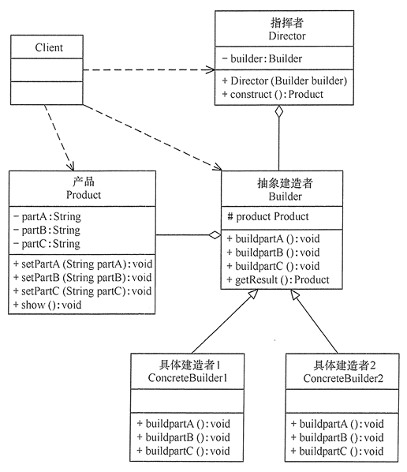
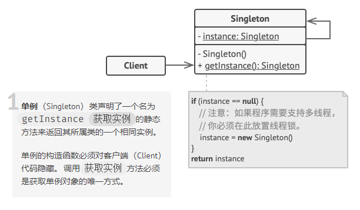

# 设计模式（二）——创建型模式

**创建型模式**，即处理对象创建过程的设计模式，根据实际情况来使用合适的模式创建对象。

创建型模式主要是将系统所需要的用到的**具体类**封装起来，在内部实现这些具体类的创建和结合，并对外隐藏这个过程细节。外部无法直接访问这个对象的创建和组合过程。使用者只需要关心**何时、何地、由谁、怎样**创建这个对象。

创建型模式主要包含以下几种：
 - 简单工厂模式 `Simple Factory`
- 工厂方法模式 `Factory Method`
- 抽象工厂模式 `Abstract Factory`
- 建造者模式 `Builder`
- 原型模式 `Prototype`
- 单例模式 `Singleton`

## 使用场景

《设计模式：可复用面向对象软件的基础（Design Patterns: Elements of Reusable Object-Oriented Software）》中使用了一个实现迷宫游戏的程序来说明创建型模式相关的集中模式的关系。

> “这个迷宫和游戏将随着各种模式不同而略有区别。有时这个游戏将紧紧是找到一个迷宫的出口；在这种情况下，游戏者可能仅能进到这个迷宫的局部。有时迷宫包含一些需要解决的问题和要战胜的危险，并且这些游戏可能会提供已经被探索过的那部分迷宫地图。我们将忽略许多迷宫中的细节以及一个迷宫游戏中有一个还是多个游戏者，我们仅关注迷宫是怎样被**创建**的。”
>
>  --- 《设计模式：可复用面向对象软件的基础》 P 54

在创建这个迷宫游戏的时候，我们可以将迷宫的所有部件简化成一个正方形的房间，整个迷宫由很多部件组成。

每个房间我们可以定义一个基础类 `MapSite` ，内部包含这个房间的四个墙面（或者说方向）的属性 `direction: ["North", "South", "East", "West"]` ，并且都有一个方法 `Enter()` ，即进入这个房间。

在这个基础类之上，我们需要定义一个具体类 `Zoom` ，这个类包含自身的房间编号 `zoomNumber` ，以及与周围房间的关联关系的引用 `sides` 。

因为不是所有的房间的每一面都是门，所以我们还需要两个类：墙壁 `Wall` 和 门 `Door` 。

现在部件所需要的内容定义完成之后，我们还需要一个表示房间集合的类 `Maze`，来实现根据房间号 `zoomNumber` 查找具体房间的方法，最后我们需要一个类 `MazeGame` ，用来创建一个完整的迷宫游戏，内部实现了一个实例化迷宫游戏的方法 `createMaze()`。


上面这个例子看上去比较简单，但是定义了很多的类，这样可能会造成在最终创建迷宫游戏实例的时候变得很复杂。当然可以在定义 `Zoom` 的时候就初始化房间的每一个面是墙壁还是门，但是这样如果在以后需要增加新的部件（比如一个咒语门 `DoorNeedSpell` ，或者有“宝藏”的房间 `EnchantedRoom`），就需要修改多处代码，不符合设计模式复用的原则。

从这个例子可以大致总结出来，创建型模式的适用范围：

1. 内部的对象、产品、接口等相互独立，类似墙壁和门；
2. 隐藏类库的具体实现，只对外提供接口和方法，以及可访问的属性；
3. 一个类希望它的子类实现它所创建的对象；
4. 一组相关的对象被设计为需要一起使用。

另外还有一个"单例模式"，在一个类有且只能有一个实例的时候使用。

## 1. 简单工厂模式（不属于23种GoF模式）

在了解创建型模式的五个具体模式之前，我们可以先了解一下“简单工厂模式”。

**简单工厂模式**(Simple Factory Pattern)：又称为**静态工厂方法**(Static Factory Method)模式，原则上**不属于**23种GoF（《Design Patterns: Elements of Reusable Object-Oriented Software》一书的四位作者的别称“四人组（Gang of Four）”的简写）设计模式。

### 1.1 特点

简单工厂模式通常只对外提供一个创建实例对象的工厂方法接口，而将具体的对象实例过程转移到具体的子类工厂中。使用时只需要传入对应的类型参数便可以创建对应类型的实例对象。

### 1.2 优缺点

优点：

1. 工厂类中有具体的判断逻辑，可以决定在什么时候什么情况下创建哪一类的实例对象
2. 可以用外部的配置文件，在不修改客户端代码的情况下更换和添加新的具体子类
3. 客户端可以不需要知道内部的具体实现，只需要知道类型便能得到对应的实例对象

个人认为，在 JavaScript 中，第一个优点是比较有吸引力的一点。但是简单工厂模式的缺点更多。

缺点：

1. 工厂类职责过重，在类型较多时会异常臃肿
2. 每增加新的子类，便要增加新的判断逻辑，不利于阅读和维护，违背开闭原则
3. 扩展困难
4. 无法继承

### 1.3 结构

简单工厂主要包含三个部分：

1. 外层简单工厂类
2. 所有实例的基础抽象类，是所有类型实例的父类
3. 具体的工厂子类，负责创建指定类型的实例



### 1.4 实现

简单工厂模式主要是编写一个实例对象的公用基础抽象类，在工厂类中根据传入的参数不同来调用不同的具体类创建实例对象并返回。

```typescript
abstract class Creator {
    public someOperation(type: string): string {
        if (type === "prod") {
            return new ConcreteProduct1();
        } else {
            return new ConcreteProduct2();
        }
    }
}

interface Product {
    operation(): string;
}

class ConcreteProduct1 implements Product {
    public operation(): string {
        return '{Result of the ConcreteProduct1}';
    }
}

class ConcreteProduct2 implements Product {
    public operation(): string {
        return '{Result of the ConcreteProduct2}';
    }
}
```

### 1.5 应用场景

当工厂类负责的对象类型较少，或者模式固定几乎不改变的情况下可以使用。


## 2. 工厂方法模式

在上一小节的"简单工厂模式"中，知道简单工厂模式违背了“开闭原则”，而工厂方法模式则是对简单工厂模式的进一步抽象化，以满足“开闭原则”。

### 2.1 特点

"工厂方法模式"相较于"简单工厂模式"，对工厂类进行了拆分，创建了一个基础工厂类，从而使代码结构更加清晰，在引入新的类型的时候，也不需要修改原有代码，而是在基础工厂类上创建新的具体工厂类。

### 2.2 结构

工厂方法模式包含四个部分：

1. 基础（抽象）工厂类
2. 具体工厂类
3. 基础（抽象）实例类
4. 具体实例类，与具体工厂类对应



### 2.3 优缺点

根据该模式的结构，可以很明显的看出几个部分的关系，对两个基础类进行拆分来创建对应的具体的实现类，代码结构更清晰，但是取而代之的是代码量和重复代码的增加。

优点：

- 用户只需要知道具体工厂的名称就可得到所要的产品，无须知道产品的具体创建过程。
- 灵活性增强，对于新产品的创建，只需多写一个相应的工厂类。
- 典型的解耦框架。高层模块只需要知道产品的抽象类，无须关心其他实现类，满足迪米特法则、依赖倒置原则和里氏替换原则。

缺点：

- 类的个数容易过多，增加复杂度
- 增加了系统的抽象性和理解难度
- 抽象产品只能生产一种产品，此弊端可使用[抽象工厂模式](http://c.biancheng.net/view/1351.html)解决。

### 2.4 实现

由 “1.4 简单工厂模式--实现” 的例子，我们对工厂类进行拆分，就可以得到一个工厂方法模式的简单实现。

```typescript
abstract class Creator {
    public abstract factoryMethod(): Product;
    public someOperation(): string {
        const product = this.factoryMethod();
        return product.operation();
    }
}
class ConcreteCreator1 extends Creator {
    public factoryMethod(): Product {
        return new ConcreteProduct1();
    }
}

class ConcreteCreator2 extends Creator {
    public factoryMethod(): Product {
        return new ConcreteProduct2();
    }
}

interface Product {
    operation(): string;
}

class ConcreteProduct1 implements Product {
    public operation(): string {
        return '{Result of the ConcreteProduct1}';
    }
}

class ConcreteProduct2 implements Product {
    public operation(): string {
        return '{Result of the ConcreteProduct2}';
    }
}
```

##  3 抽象工厂模式

在1.2 工厂方法模式里面，我们知道了工厂方法模式是将“简单工厂模式”的工厂类进行了拆分，拆分之后的"具体工厂类"与"具体实例类"一一对应。但是所有的“具体工厂类”和“具体实例类”都分别是共用同一个抽象工厂类和同一个抽象实例类，这样所有的实例以及创建方法都在一个层级上。

"抽象工厂模式"则是可以创建一组相关或者有相互依赖关系的对象的接口。

定义：**一种为访问类提供一个创建一组相关或相互依赖对象的接口，且访问类无须指定所要产品的具体类就能得到同族的不同等级的产品的模式结构。**

### 3.1 特点

抽象工厂模式 可以看做是 工厂方法模式的升级版本，工厂方法模式只能生产出同一个层级的产品，而抽象工厂模式可以生产多个层级的产品。

每个具体工厂类可以创建同一族（品牌）的不同类型的实例。

例如 "华为公司" 和 "苹果公司"，两个公司都基于一个基础类 "科技公司"，"苹果公司" 可以设计生产 "手机"、"电脑"、"平板电脑"，"华为公司" 一样可以生产 "手机"、"电脑"、"平板电脑"。但是 "华为手机" 和 "苹果手机" 都属于 "手机" 这个基础类，"苹果电脑" 和 "华为电脑" 都属于 "电脑" 这个基础类等等。组成抽象工厂模式的各个部分互相交叉，互相影响。

### 3.2 优缺点

优点：

从抽象工厂模式的命名和特点，可以知道它是为了优化工厂方法模式而诞生的，所以它也具有了工厂方法模式的所有优点；并且它引入了产品族的概念，系统在使用的时候只能同时使用同一族的实例对象；抽象工厂模式也隔离了每个具体类的实现方式，更换原有工厂会更加容易，在引入新的具体类的时候，也不需要修改已有的具体类。

缺点：

因为各个部分的联系比较深入，在新增一个具体类的时候需要为新的类增加与外界的联系，改动的范围较大。

### 3.3 结构

因为该模式中对应的工厂类、实例类个数都不确定，只能根据各个部分的功能和职责分为四个组成要素：

1. 抽象（基础）工厂类：该产品族下所有具体工厂类的父类，定义创建各种实例对象的方法
2. 具体工厂类：实现抽象类定义的方法，创建对应的实例对象
3. 抽象（基础）实例类：定义该类型下所有实例对象的属性、方法等
4. 具体实例类：实现抽象实例类定义的所有属性和方法等

以两种具体工厂类和两种抽象实例类来解析：



### 3.4 实现

```typescript
interface AbstractFactory {
    newProduct1(): Product1;
    newProduct2(): Product2;
}

class ConcreteFactory1 implements AbstractFactory {
    public newProduct1(): Product1 {
        return new ConcreteProduct11();
    }

    public newProduct2(): Product2 {
        return new ConcreteProduct21();
    }
}

class ConcreteFactory2 implements AbstractFactory {
    public newProduct1(): Product1 {
        return new ConcreteProduct12();
    }

    public newProduct2(): Product2 {
        return new ConcreteProduct22();
    }
}

interface Product1 {
    usefulFunctionA(): string;
}

class ConcreteProduct11 implements Product1 {
    public usefulFunctionA(): string {
        return 'The result of the product A1.';
    }
}

class ConcreteProduct12 implements Product1 {
    public usefulFunctionA(): string {
        return 'The result of the product A2.';
    }
}
interface Product2 {
    usefulFunctionB(): string;
    anotherUsefulFunctionB(collaborator: Product1): string;
}

class ConcreteProduct21 implements Product2 {
    public usefulFunctionB(): string {
        return 'The result of the product B1.';
    }
    public anotherUsefulFunctionB(collaborator: Product1): string {
        const result = collaborator.usefulFunctionA();
        return `The result of the B1 collaborating with the (${result})`;
    }
}

class ConcreteProduct22 implements Product2 {
    public usefulFunctionB(): string {
        return 'The result of the product B2.';
    }
    public anotherUsefulFunctionB(collaborator: Product1): string {
        const result = collaborator.usefulFunctionA();
        return `The result of the B2 collaborating with the (${result})`;
    }
}
```

## 4. 建造者模式

定义：将一个复杂对象的构建与它的表示分离，使得同样的构建过程可以创建不同的表示。

### 4.1 特点

由定义可知，建造者模式可以将一个复杂对象的创建过程分解成一步一步的创建过程，每一步都是一个组成部分，建造者模式最终创建的对象的组成部分是不变的，但是每一个组成部分（每一步）可以根据不同条件灵活选择。

### 4.2 优缺点

优点：

1. 过程解耦，封装性好：对象的创建过程与对象本身解耦，客户端或者使用者只需要知道对象对应参数便可以得到对应对象
2. 扩展性较好：内部各个部分相互独立，互不影响，符合开闭原则
3. 每个具体组成部分符合单一职责原则

缺点：

1. 只适合生成共同点多的对象，如果需要的对象差异性大，则不适用该模式
2. 内部代码冗余，对内部组成较多的对象，可能会导致系统变得十分庞大；并且后期维护与修改较为困难

> 虽然内部的具体组成部分可能功能很明确，也相互独立，但是在需要生成的对象属性过于复杂时，会导致最外层的建造者代码量过大，并且不适合其余类型的对象。

### 4.3 结构

由建造者模式的特点就可以看出，该模式下没有固定数目的组成部分，只能按照组成部分（要素）来划分，大致包含4个要素：

1. 抽象建造者（抽象工厂类 Builder）：最外层抽象类，定义生成对象的各种属性与方法，通常还包含一个返回生成对象的方法
2. 具体建造者（具体工厂类 Concrete Builder，多个）：负责实现对象内部的各种属性或者方法的工厂类
3. 产品角色（Products， 多个）：一个包含了对应组成部分的复杂对象，由抽象工厂类来创建和实现各个组成部分（也可以认为是最终生成的那个对象）
4. 导向器（Director）：充当一个管理角色，按照不同参数（需要的类型）调用对应的组成部分或者步骤来完成对象的创建，不涉及最终对象的具体信息



### 4.4 实现

```typescript
interface Builder {
    producePartA(): void;
    producePartB(): void;
    producePartC(): void;
}

class Product1 {
    public parts: string[] = [];
    public listParts(): void {
        console.log(`Product parts: ${this.parts.join(', ')}\n`);
    }
}

class ConcreteBuilder1 implements Builder {
    private product: Product1;
    constructor() {
        this.reset();
    }
    public reset(): void {
        this.product = new Product1();
    }
    public producePartA(): void {
        this.product.parts.push('PartA1');
    }
    public producePartB(): void {
        this.product.parts.push('PartB1');
    }
    public producePartC(): void {
        this.product.parts.push('PartC1');
    }
    public getProduct(): Product1 {
        const result = this.product;
        this.reset();
        return result;
    }
}

class Director {
    private builder: Builder;
    public setBuilder(builder: Builder): void {
        this.builder = builder;
    }
    public buildMinimalViableProduct(): void {
        this.builder.producePartA();
    }
    public buildFullFeaturedProduct(): void {
        this.builder.producePartA();
        this.builder.producePartB();
        this.builder.producePartC();
    }
}
```

> 具体实现步骤：
>
> 1. 创建抽象工厂类/接口 `Builder`，定义公共抽象方法
> 2. 定义产品类（最终实例的类型定义） `Product1` 的属性和方法
> 3. 继承 `Builder` ，创建具体实现类 `ConcreteBuilder1`，并提供一个获取最终实例对象的公共方法 `getProduct()`
> 4. 定义导向器 `Director`，提供不同的方法来创建对应的产品（对象实例）

使用：

```typescript
// 客户端方法
// 创建一个导向器实例
const director = new Director();

// 创建执行函数
function clientFunc(director: Director) {
    // 创建一个 具体实现类 对应的实例，并将这个实例作为导向器实例的配置参数传入配置方法。
    const builder = new ConcreteBuilder1();
    director.setBuilder(builder);
	
    // 使用 已经配置过的导向器实例，创建一个 mini 实例
    director.buildMinimalViableProduct();
    builder.getProduct().listParts(); // Product parts: PartA1

    // 使用 已经配置过的导向器实例，创建一个 完整 实例
    director.buildFullFeaturedProduct();
    builder.getProduct().listParts(); // Product parts: PartA1, PartB1, PartC1

    // 可以直接使用 具体实现类 对应的实例，创建新的实例
    builder.producePartA();
    builder.producePartC();
    builder.getProduct().listParts(); // Product parts: PartA1, PartC1
}

// 执行客户端方法
clientFunc(director);
```

### 4.5 应用场景

在产品类非常复杂，并且不同执行顺序可以得到不同结果；或者针对不同的产品，需要用到不同顺序的组成部分时，可以使用这个模式。

个人认为，该模式是对 “对象创建” 过程的一种简化方式，通过统一管理（导向器），来避免客户端在使用时的多次传参与重复定义。使用该模式设计代码时可以避免后续开发过程中产生的冗余代码，对具有多种相同属性或方法的对象而言该模式有良好的适用性，但是将多个创建方法都封装在 导向器 内，带来的就是后期维护与升级时的困难。

## 5. 原型模式

定义：**用一个已经创建的实例作为原型，通过复制该原型对象来创建一个和原型相同或相似的新对象。**

### 5.1 特点

可以复制已有对象，并且不需要依赖已有对象所属的类。并且使用该方式创建对象非常高效，可以不需要知道原对象的创建过程和细节。

### 5.2 优缺点

优点：

1. 可以直接复制对象，无需与原对象所属的具体类耦合，可以更方便的生成复杂对象
2. 可以避免反复运行初始代码

缺点：

1. 克隆循环引用类型的复杂对象会非常麻烦
2. 需要对每一个类都配置一个 `clone()` 方法，并且该方法位于类的内部，每次修改都需要修改类的代码，违背开闭原则

### 5.3 结构

原型模式包含以下主要角色。

1. 抽象原型类：规定了具体原型对象必须实现的接口
2. 具体原型类：实现抽象原型类的 `clone()` 方法，它是可被复制的对象
3. 访问类：使用具体原型类中的 `clone()` 方法来复制新的对象


### 5.4 实现

```typescript
class Prototype {
    public primitive: any;
    public component: object;
    public circularReference: ComponentWithBackReference;
	// 定义公共的克隆方法， 返回克隆结果
    public clone(): this {
        const clone = Object.create(this);
        clone.component = Object.create(this.component);
        clone.circularReference = {
            ...this.circularReference,
            prototype: { ...this },
        };
        return clone;
    }
}

class ComponentWithBackReference {
    public prototype;

    constructor(prototype: Prototype) {
        this.prototype = prototype;
    }
}
```


## 6. 单例模式

定义：**指一个类只有一个实例，且该类能自行创建这个实例的一种模式。**

单例模式的目的是创建一个类的实例，保证这个类只有一个实例，并对外提供一个全局的访问节点。比如一个国家只有一个官方政府，一个封建王朝只有一个皇帝，一个学校只有一个校长等。

### 6.1 特点

单例模式具有以下特点：

1. 只有一个实例对象
2. 这个实例对象只能有这个单例类自行创建
3. 只对外提供一个该单例类的实例的全局访问节点

### 6.2 优缺点

因为单例模式只有一个实例，可以减少内存和资源的开销，优化共享资源的访问；但是单例模式也有几个比较严重的缺点：

1. 一般没有抽象类，扩展困难
2. 单例类职责过重，既充当了工厂角色，提供创建对象的工厂方法，又充当了产品角色，包含了一些业务逻辑
3. 代码过多，不利于后期调试

> 单例模式在多线程中还可能被创建多个实例（JavaScript 中则不存在这个问题）

### 6.3 结构

单例模式内部主要包含一个角色：单例类



> 截图来自[REFEACTORING](https://refactoringguru.cn/design-patterns/singleton)

### 6.4 实现

单例模式的实现有两种方式：“懒汉式单例”和“饿汉式单例”，其实两者的区别就是是否在类加载的时候就初始化一个单例实例。

#### 6.4.1 懒汉式单例

通常会对外提供一个获取单例的方法，在第一次调用的时候进行实例化。

`TypeScript`：

```typescript
class LazySingleton {
    private static instance: Singleton;
    // 构造函数必须是私有的，避免外部使用 new 关键字进行实例化
    private constructor() { }
    // 对外提供的访问方法，如果方式没有则创建一个实例
    public static getInstance(): Singleton {
        if (!Singleton.instance) {
            Singleton.instance = new Singleton();
        }
        return Singleton.instance;
    }
    // 业务逻辑
    public someBusinessLogic() {
        // ...
    }
}
```

`JavaScript`：

```javascript
function LazySingleton() {
    this.instance = null;
}
LazySingleton.getInstance = function() {
    if(!this.instance) {
        this.instance = new LazySingleton();
    }
    return this.instance;
}
LazySingleton.someBusinessLogic = function() {}
```

#### 6.4.2 饿汉式单例

在类中直接进行单例类的实例化，保证对外提供的接口在调用的时候已经创建了对应的实例。

```typescript
class LazySingleton {
    private static instance: Singleton = new Singleton();
    // 构造函数必须是私有的，避免外部使用 new 关键字进行实例化
    private constructor() { }
    // 对外提供的访问方法，如果方式没有则创建一个实例
    public static getInstance(): Singleton {
        return Singleton.instance;
    }
    // 业务逻辑
    public someBusinessLogic() {
        // ...
    }
}
```

> 这里不再实现 `JavaScript` 的实现

在实现单例模式的时候必须注意：1. 类构造函数必须是私有，2. 需要对外提供一个自身对应的实例变量（即上面的 `instance`），3. 需要有一个对外的静态工厂方法（或者说获取实例变量的方法，即 `getInstance()`）

### 6.5 应用场景

因为单例模式可以很好的节省资源开销，并且只有一个自身产生的实例，在系统有且只需要某一个程序或者对象的时候，就可以采用这种方式。

比如数据库连接池、全局缓存、浏览的window对象，或者说系统中的用户信息弹窗等等。

### 6.6 优化

我们知道单例模式最大的好处就是可以控制全局内只有一个对应的实例变量，但是如果有多种类型的话，我们就需要编写多个单例类。为了简化代码量和代码逻辑，可以将管理单例（也就是判断单例类是否已有实例的部分）的逻辑提出来。对于实现/创建单例类实例的部分，将它作为一个参数传递给管理方法。

```javascript
const GetSingle = function(fn) {
    let instance = null;
    return function() {
        if(!instance) {
            instance = fn.apply(this, arguments);
        }
        return instance;
        // 可以简化为 return instance || fn.apply(this, arguments)
    }
}

const createLoginLayer = function() {
    const div = document.createElement("div");
    div.innerHTML = "我是登录浮窗";
    div.style.display = "none";
    document.body.appendChild(div);
    return div;
}

const CreateSingleLoginLayer = GetSingle(createLoginLayer);
```


> 文中部分内容可能存在描述误差，欢迎大佬们批评指正 :smile::smile::smile:


#### 参考资料：

1. [refactoringguru: 设计模式，重构](https://refactoringguru.cn/)

2. [设计模式（C语言中文网）](http://c.biancheng.net/view/1317.html)

3. [图说设计模式](https://design-patterns.readthedocs.io/zh_CN/latest/index.html#)

4. 《设计模式之禅》 秦小波 著 ，机械工业出版社


