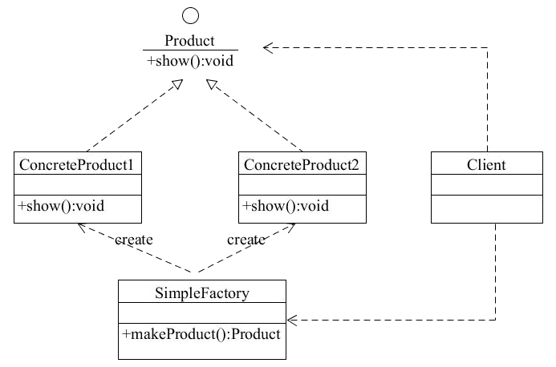
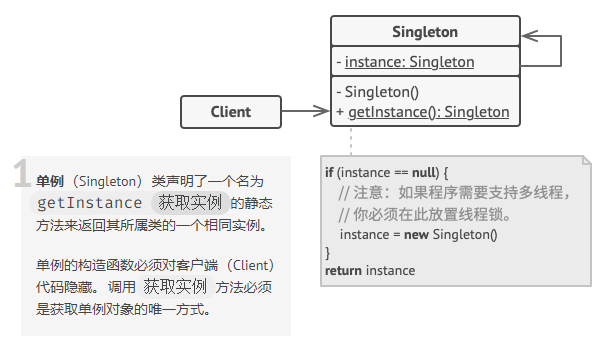

# 设计模式（二）——创建型模式

**创建型模式**，即处理对象创建过程的设计模式，根据实际情况来使用合适的模式创建对象。

创建型模式主要是将系统所需要的用到的**具体类**封装起来，在内部实现这些具体类的创建和结合，并对外隐藏这个过程细节。外部无法直接访问这个对象的创建和组合过程。使用者只需要关心**何时、何地、由谁、怎样**创建这个对象。

## 使用场景

《设计模式：可复用面向对象软件的基础（Design Patterns: Elements of Reusable Object-Oriented Software）》中使用了一个实现迷宫游戏的程序来说明创建型模式相关的集中模式的关系。

> “这个迷宫和游戏将随着各种模式不同而略有区别。有时这个游戏将紧紧是找到一个迷宫的出口；在这种情况下，游戏者可能仅能进到这个迷宫的局部。有时迷宫包含一些需要解决的问题和要战胜的危险，并且这些游戏可能会提供已经被探索过的那部分迷宫地图。我们将忽略许多迷宫中的细节以及一个迷宫游戏中有一个还是多个游戏者，我们仅关注迷宫是怎样被**创建**的。”
>
>  --- 《设计模式：可复用面向对象软件的基础》 P 54

在创建这个迷宫游戏的时候，我们可以将迷宫的所有部件简化成一个正方形的房间，整个迷宫由很多部件组成。

每个房间我们可以定义一个基础类 `MapSite` ，内部包含这个房间的四个墙面（或者说方向）的属性 `direction: ["North", "South", "East", "West"]` ，并且都有一个方法 `Enter()` ，即进入这个房间。

在这个基础类之上，我们需要定义一个具体类 `Zoom` ，这个类包含自身的房间编号 `zoomNumber` ，以及与周围房间的关联关系的引用 `sides` 。

因为不是所有的房间的每一面都是门，所以我们还需要两个类：墙壁 `Wall` 和 门 `Door` 。

现在部件所需要的内容定义完成之后，我们还需要一个表示房间集合的类 `Maze`，来实现根据房间号 `zoomNumber` 查找具体房间的方法，最后我们需要一个类 `MazeGame` ，用来创建一个完整的迷宫游戏，内部实现了一个实例化迷宫游戏的方法 `createMaze()`。


上面这个例子看上去比较简单，但是定义了很多的类，这样可能会造成在最终创建迷宫游戏实例的时候变得很复杂。当然可以在定义 `Zoom` 的时候就初始化房间的每一个面是墙壁还是门，但是这样如果在以后需要增加新的部件（比如一个咒语门 `DoorNeedSpell` ，或者有“宝藏”的房间 `EnchantedRoom`），就需要修改多处代码，不符合设计模式复用的原则。

从这个例子可以大致总结出来，创建型模式的适用范围：

1. 内部的对象、产品、接口等相互独立，类似墙壁和门；
2. 隐藏类库的具体实现，只对外提供接口和方法，以及可访问的属性；
3. 一个类希望它的子类实现它所创建的对象；
4. 一组相关的对象被设计为需要一起使用。

另外还有一个"单例模式"，在一个类有且只能有一个实例的时候使用。

## 1. 简单工厂模式

在了解创建型模式的五个具体模式之前，我们可以先了解一下“简单工厂模式”。

**简单工厂模式**(Simple Factory Pattern)：又称为**静态工厂方法**(Static Factory Method)模式，原则上**不属于**23种GoF（《Design Patterns: Elements of Reusable Object-Oriented Software》一书的四位作者的别称“四人组（Gang of Four）”的简写）设计模式。

### 1.1 特点

简单工厂模式通常只对外提供一个创建实例对象的工厂方法接口，而将具体的对象实例过程转移到具体的子类工厂中。使用时只需要传入对应的类型参数便可以创建对应类型的实例对象。

### 1.2 优缺点

优点：

1. 工厂类中有具体的判断逻辑，可以决定在什么时候什么情况下创建哪一类的实例对象
2. 可以用外部的配置文件，在不修改客户端代码的情况下更换和添加新的具体子类
3. 客户端可以不需要知道内部的具体实现，只需要知道类型便能得到对应的实例对象

个人认为，在 JavaScript 中，第一个优点是比较有吸引力的一点。但是简单工厂模式的缺点更多。

缺点：

1. 工厂类职责过重，在类型较多时会异常臃肿，违背高聚合原则
2. 每增加新的子类，便要增加新的判断逻辑，不利于阅读和维护
3. 扩展困难
4. 无法继承

### 1.3 结构

简单工厂主要包含三个部分：

1. 外层简单工厂类
2. 所有实例的基础抽象类，是所有类型实例的父类
3. 具体的工厂子类，负责创建指定类型的实例




## 1. 单例模式

单例模式的目的是创建一个类的实例，保证这个类只有一个实例，并对外提供一个全局的访问节点。比如一个国家只有一个官方政府，一个封建王朝只有一个皇帝，一个学校只有一个校长等。

### 1.1 特点

单例模式具有以下特点：

1. 只有一个实例对象
2. 这个实例对象只能有这个单例类自行创建
3. 只对外提供一个该单例类的实例的全局访问节点

### 1.2 优缺点

因为单例模式只有一个实例，可以减少内存和资源的开销，优化共享资源的访问；但是单例模式也有几个比较严重的缺点：

1. 一般没有抽象类，扩展困难
2. 单例类职责过重，既充当了工厂角色，提供创建对象的工厂方法，又充当了产品角色，包含了一些业务逻辑
3. 代码过多，不利于后期调试

> 单例模式在多线程中还可能被创建多个实例（JavaScript 中则不存在这个问题）

### 1.3 结构

单例模式内部主要包含一个角色：单例类



> 截图来自[REFEACTORING](https://refactoringguru.cn/design-patterns/singleton)

### 1.4 实现

单例模式的实现有两种方式：“懒汉式单例”和“饿汉式单例”，其实两者的区别就是是否在类加载的时候就初始化一个单例实例。

#### 1.4.1 懒汉式单例

通常会对外提供一个获取单例的方法，在第一次调用的时候进行实例化。

`TypeScript`：

```typescript
class LazySingleton {
    private static instance: Singleton;
    // 构造函数必须是私有的，避免外部使用 new 关键字进行实例化
    private constructor() { }
    // 对外提供的访问方法，如果方式没有则创建一个实例
    public static getInstance(): Singleton {
        if (!Singleton.instance) {
            Singleton.instance = new Singleton();
        }
        return Singleton.instance;
    }
    // 业务逻辑
    public someBusinessLogic() {
        // ...
    }
}
```

`JavaScript`：

```javascript
function LazySingleton() {
    this.instance = null;
}
LazySingleton.getInstance = function() {
    if(!this.instance) {
        this.instance = new LazySingleton();
    }
    return this.instance;
}
LazySingleton.someBusinessLogic = function() {}
```

#### 1.4.2 饿汉式单例

在类中直接进行单例类的实例化，保证对外提供的接口在调用的时候已经创建了对应的实例。

```typescript
class LazySingleton {
    private static instance: Singleton = new Singleton();
    // 构造函数必须是私有的，避免外部使用 new 关键字进行实例化
    private constructor() { }
    // 对外提供的访问方法，如果方式没有则创建一个实例
    public static getInstance(): Singleton {
        return Singleton.instance;
    }
    // 业务逻辑
    public someBusinessLogic() {
        // ...
    }
}
```

> 这里不再实现 `JavaScript` 的实现

在实现单例模式的时候必须注意：1. 类构造函数必须是私有，2. 需要对外提供一个自身对应的实例变量（即上面的 `instance`），3. 需要有一个对外的静态工厂方法（或者说获取实例变量的方法，即 `getInstance()`）

### 1.5 应用场景

因为单例模式可以很好的节省资源开销，并且只有一个自身产生的实例，在系统有且只需要某一个程序或者对象的时候，就可以采用这种方式。

比如数据库连接池、全局缓存、浏览的window对象，或者说系统中的用户信息弹窗等等。

### 1.6 优化

我们知道单例模式最大的好处就是可以控制全局内只有一个对应的实例变量，但是如果有多种类型的话，我们就需要编写多个单例类。为了简化代码量和代码逻辑，可以将管理单例（也就是判断单例类是否已有实例的部分）的逻辑提出来。对于实现/创建单例类实例的部分，将它作为一个参数传递给管理方法。

```javascript
const GetSingle = function(fn) {
    let instance = null;
    return function() {
        if(!instance) {
            instance = fn.apply(this, arguments);
        }
        return instance;
        // 可以简化为 return instance || fn.apply(this, arguments)
    }
}

const createLoginLayer = function() {
    const div = document.createElement("div");
    div.innerHTML = "我是登录浮窗";
    div.style.display = "none";
    document.body.appendChild(div);
    return div;
}

const CreateSingleLoginLayer = GetSingle(createLoginLayer);
```


