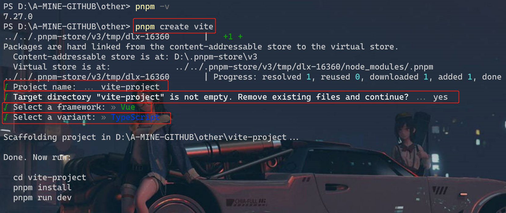
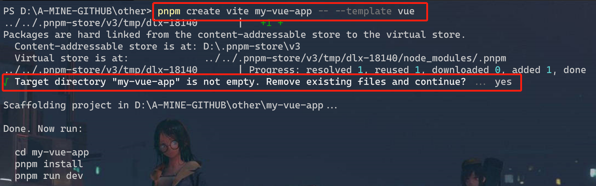
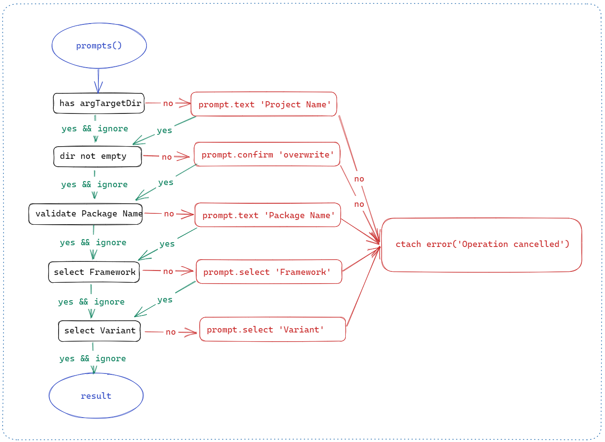

# create-vite 4.2 揭秘

***本文正在参加[「金石计划」](https://juejin.cn/post/7207698564641996856/)***

---

## 前言

之前关注 [川佬（若川）](https://juejin.cn/user/1415826704971918) 的源码共读活动已经很久了，只是一直没有没有静下心来跟着川佬一起学习，直到今年年初才加入了川佬的源码共读交流群。对于如何学习源码也是一头雾水，所以川哥建议我从 `create-vite` 开始，所以就有了这篇文章~

在 Vue 3 发布之际，尤大出于对 `Webpack` 性能的不满，发布了基于 `esbuild` 的新构建工具 —— `Vite`，号称是 **下一代前端开发与构建工具**。

当然，在构建工具有了之后，为了支持快速构建一个模板项目，vue 团队也随之发布了 `Vite` 关联的脚手架 —— `create-vite`，并且经过这几年的飞速迭代，如今 `create-vite` 已经来到了 `4.2-beta` 版本，并且通过 `TypeScript` 对其进行了重写。

现在，就让我们从利用 `create-vite` 创建项目开始吧🎉

## 如何使用

根据官方文档，通过 `create-vite` 创建一个空白项目，只需要使用对应的 **包管理工具（NPM，Yarn，pNpm）** 执行 `create` 操作即可：

```bash
npm create vite@latest
# or
yarn create vite
# or
pnpm create vite
```

执行后我们需要手动输入和确认 **项目名称、使用框架、语言类型**等，如果有和项目同名的文件夹，还会提示 **是否清空已有文件夹**。如下图：



当然，我们也可以直接 **将项目名和选择的模板** 作为参数直接拼接在命令后，例如：

```bash
# npm 6.x
npm init vite@latest my-vue-app --template vue

# npm 7+, 需要额外的双横线：
npm init vite@latest my-vue-app -- --template vue

# yarn
yarn create vite my-vue-app --template vue

# pnpm
pnpm create vite my-vue-app -- --template vue
```

当然，这个过程中如果存在同名非空文件夹的话，依然会提示是否清空，此时运行结果如下：



此时就创建完成了，只需要进入该项目目录并执行 `install` 命令安装好项目依赖，即可正常运行。

## Create 创建过程

简单来说，不管是 `npm create` 还是 `yarn create`、`pnpm create`，这三个命令的大致流程都是类似的：

1. 解析命令行参数，得到 **初始化器名称 `initerName` 和项目名称 `projectName`**
2. 解析 `initerName`，确定对应的依赖包名称和版本号
3. 根据依赖包名称和版本号下载安装初始化器
4. 执行初始化器的 `create` 方法
5. 成功后打印提示信息，退出进程

**我们以 `npm create vite@latest` 来分析项目的具体创建过程**：

### create 命令

NPM 在之前迁移了一次仓库，目前仓库地址为：[npm/cli](https://github.com/npm/cli)，通过 `package.json` 指定的 `index.js` 可以找到 `npm` 命令的实际执行是 **调用 `lib/cli.js` 并传入所有参数 `process`** ，可见核心目录为 `lib`。

在 `lib/cli.js` 中则又是调用 `lib/npm.js` 的构造函数 `Npm` 进行实例化得到 `npm`，并解析出来 `process` 中的核心命令 `cmd`，通过 `npm.exec(cmd)` 执行相关命令。

因为 `npm.js` 中代码较多，所以大致描述一下 `npm.exec(cmd)` 的过程吧：

1. 通过 `deref` 解析 `cmd` 对应的实际命令 `command`
2. 根据 `command` 加载 `lib/commands` 中的指定文件，得到命令对应的 **构造函数**
3. 传入当前的 `npm` 实例作为构造函数参数得到命令实例
4. 调用命令实例的 `cmdExec(args)` 执行命令的真实逻辑

可见，`commands` 中包含了所有的 `NPM CLI` 的可用命令，例如 `version`、`install`、`help` 等，但是这个目录中是不存在 `create` 命令的，在 `deref` 过程中发现 npm 会通过 `utils/cmd-list.js` 解析实际命令。该文件中定义了一个 `aliases` 别名对象，而 `create`、`innit` 实际对应的命令都是 `init` 命令。

所以，**`npm create` 和 `npm innit` 命令最终的实际执行命令都是 `npm init`**，只需要找到 `init` 的文件即可。

### init 命令

根据上文可以知道，init.js 文件内部应该提供的是一个 `class`，进入文件后可发现该这个类会继承一个 `BaseCommand`，并且 `constructor` 构造函数也是在 `BaseCommand` 中。

进入 `BaseCommand`，构造函数中只是在实例中保存了 `npm` 实例，并提供了 `name`、`description` 等属性的get方法，并且 **提供了 `cmdExec` 方法**，这个方法中主要是 **判断是否是在 `workplace` 工作区目录中执行，是则执行 `execWorkspaces`，不是则执行 `exec()`**。这里我们直接进入 `exec`。

```js
async exec (args) {
  // npm exec style
  if (args.length) {
    return await this.execCreate(args)
  }
  // no args, uses classic init-package-json boilerplate
  await this.template()
}
```

这里 `execCreate` 方法内部其实就是上面所说的 `npm create` 的过程的实现：

```js
  async execCreate (args, path = process.cwd()) {
    const [initerName, ...otherArgs] = args
    let packageName = initerName

    if (/^@[^/]+$/.test(initerName)) {
      // ...
    } else {
      const req = npa(initerName)
      if (req.type === 'git' && req.hosted) {
        const { user, project } = req.hosted
        packageName = initerName.replace(`${user}/${project}`, `${user}/create-${project}`)
      } else if (req.registry) {
        packageName = `${req.name.replace(/^(@[^/]+\/)?/, '$1create-')}@${req.rawSpec}`
      } else {
        throw Object.assign(new Error('...'), { code: 'EUNSUPPORTED' })
      }
    }

    const newArgs = [packageName, ...otherArgs]
    const { color } = this.npm.flatOptions
    const { flatOptions, localBin, globalBin } = this.npm
    const output = this.npm.output.bind(this.npm)
    const runPath = path
    const scriptShell = this.npm.config.get('script-shell') || undefined
    const yes = this.npm.config.get('yes')

    await libexec({
      ...flatOptions,
      args: newArgs,
      color,
      localBin,
      globalBin,
      output,
      path,
      runPath,
      scriptShell,
      yes,
    })
  }
```

这里的第一步就是 **解析 `initerName`**。

`if` 判断中首先是判断是否是 `scoped`，也就是是否是以 `@` 符号开头，这里 `vite` 走 `else` 部分。

这里会将 `vite@latest` 通过 `npm(npm-package-arg)` 进行解析，得到开发者名称 `user` 和 项目名称 `project`，并将其进行修改得到新的包名：`vitejs/create-vite`，然后调用 `libexec` 进行安装和执行。

> `libexec` 与 `npm/cli` 同一仓库，入口文件位于 [index.js](https://github.com/npm/cli/blob/latest/workspaces/libnpmexec/lib/index.js)，由于代码太多，就省略这部分的内容

最终在依赖加载和查找到之后，会通过 `runScript` 找到这个包的 `package.json` 中指定的 `bash` 脚本（`bin` 命令配置），并执行其 `create-*` 命令，与 `vite` 相关的即是 `create-vite`。

## create-vite

经过上面的分析，可以确认最终与 `vite` 相关的命令的起始位置就是 `vitejs/create-vite/package.json` 中的 `create-vite` 脚本。

那么就让我正式进入 `create-vite` 项目开始解析这个项目脚手架的执行过程吧~

### 入口

`create-vite` 项目目前位于 `vitejs` 团队的 `vite` 项目中，具体地址为：[create-vite](https://github.com/vitejs/vite/tree/main/packages/create-vite)。

通过 `package.json` 中 `bin` 配置的 `create-vite` 命令，指定入口文件为根目录下的 `index.js`，当然这里的引入的是打包后的资源路径，实际文件为 `src/index.ts`。

整个文件加上类型定义和分隔行一共 488 行代码，依赖 Node.js 自带的 `fs` 文件模块、`path` 路径处理模块、`url` 中的 `fileURLToPath` url 转文件路径模块，以及外部的 `cross-spawn` 跨平台进程库、`minimist` 命令解析、`prompts` 命令行交互、`kolorist` 命令行彩色文本 四个库。

然后定义了一系列的变量和函数，最终执行 `init().catch(e => console.error(e))`。

### init 初始化函数

整个 `init` 函数贯穿了模板项目初始化的整个流程，文件内定义的所有方法和参数也都在这个方法中得以执行。我们对其进行拆分再分析每一部分的作用。

### 1. 路径分析与项目名称

在 `init` 执行的第一步，就是解析项目创建的 `dir` 位置：

```typescript
const argv = minimist<{
  t?: string
  template?: string
}>(process.argv.slice(2), { string: ['_'] })

function formatTargetDir(targetDir: string | undefined) {
  return targetDir?.trim().replace(/\/+$/g, '')
}

const defaultTargetDir = 'vite-project'

async function init() {
	const argTargetDir = formatTargetDir(argv._[0])
  let targetDir = argTargetDir || defaultTargetDir
  const getProjectName = () =>
  targetDir === '.' ? path.basename(path.resolve()) : targetDir
}
```

这里是从命令行的 **第三个参数** 开始，将其解析到一个包含键名为 `_` 值为 **字符串数组** 的对象 `argv` 中，并且该对象可能包含两个字符串属性 `t` 和 `template`。

然后从 `argv._[0]` 中读取第一个参数并去除其最前面的空格和末尾的反斜杠，如果这个参数不存在则使用默认的文件路径 `vite-project`。

### 2. 获取预设模板

这里就是从 `argv` 中读取相关属性。

```js
const argTemplate = argv.template || argv.t
```

### 3. 参数确认

这一步主要是通过 `prompts` 询问用户并确认所用项目名称、所用框架等。

```typescript
let result: prompts.Answers<'projectName' | 'overwrite' | 'packageName' | 'framework' | 'variant'>

try {
  result = await prompts(
    [
      {
        type: argTargetDir ? null : 'text',
        name: 'projectName',
        message: reset('Project name:'),
        initial: defaultTargetDir,
        onState: (state) => targetDir = formatTargetDir(state.value) || defaultTargetDir,
      },
      {
        type: () => !fs.existsSync(targetDir) || isEmpty(targetDir) ? null : 'confirm',
        name: 'overwrite',
        message: () => '',
      },
      {
        type: (_, { overwrite }: { overwrite?: boolean }) => null,
        name: 'overwriteChecker',
      },
      {
        type: () => (isValidPackageName(getProjectName()) ? null : 'text'),
        name: 'packageName',
        message: reset('Package name:'),
        initial: () => toValidPackageName(getProjectName()),
        validate: (dir) => isValidPackageName(dir) || 'Invalid package.json name',
      },
      {
        type: argTemplate && TEMPLATES.includes(argTemplate) ? null : 'select',
        name: 'framework',
        message:
          typeof argTemplate === 'string' && !TEMPLATES.includes(argTemplate)
            ? reset(`"${argTemplate}" isn't a valid template. Please choose from below: `)
            : reset('Select a framework:'),
        initial: 0,
        choices: FRAMEWORKS.map((framework) => {
          const frameworkColor = framework.color
          return {
            title: frameworkColor(framework.display || framework.name),
            value: framework,
          }
        }),
      },
      {
        type: (framework: Framework) => framework && framework.variants ? 'select' : null,
        name: 'variant',
        message: reset('Select a variant:'),
        choices: (framework: Framework) =>
          framework.variants.map((variant) => {
            const variantColor = variant.color
            return {
              title: variantColor(variant.display || variant.name),
              value: variant.name,
            }
          }),
      },
    ],
    {
      onCancel: () => {
        throw new Error(red('✖') + ' Operation cancelled')
      },
    },
  )
} catch (cancelled: any) {
  console.log(cancelled.message)
  return
}
```

这里的大致过程如下：



- 首先是校验目标路径，如果存在的话直接忽略 `has argTargetDir` 进入下一步判断
- 如果上一步目标路径不是空则提示是否清空文件夹
- 再次判断输入的项目名（也就是路径）是否符合 `package.json` 的命名规范，不然需要重新输入
- 选择框架
- 如果选择的框架有对应的变体，需要再次选择对应的框架变体

最终每一步的选择结果都是保存到一个 `result` 对象中，如果其中有任何一步用户进行了不合法操作，则会进入 `catch` 错误捕获，打印 `Operation cancelled` 并退出创建过程。

然后，会通过结构的形式将 `result` 中的数据重新用变量进行保存：

```js
const { framework, overwrite, packageName, variant } = result
```

### 4. 清空文件夹

这里涉及以下内容：

```typescript
const cwd = process.cwd()
const root = path.join(cwd, targetDir)

if (overwrite) {
  emptyDir(root)
} else if (!fs.existsSync(root)) {
  fs.mkdirSync(root, { recursive: true })
}

//// helpers
function emptyDir(dir: string) {
  if (!fs.existsSync(dir)) {
    return
  }
  for (const file of fs.readdirSync(dir)) {
    if (file === '.git') {
      continue
    }
    fs.rmSync(path.resolve(dir, file), { recursive: true, force: true })
  }
}
```

逻辑如下：

1. 获取 `root` 目录，也就是通过 `process.cwd()` 获取当前的 **工作目录** 并拼接上 `targetDir` 作为项目的根目录
2. 如果前一步 `prompt` 中确认了 `overwrite` 参数存在且为 `true`，则调用 `emptyDir` 进行清空
3. 如果 `overwrite` 不存在或者为 `false`，并且不存在该目录，则通过 `fs.mkdir` 创建一个空目录

`emptyDir` 函数首先也会判断目录是否存在，避免后续逻辑报错；然后则是遍历目录中的所有文件和文件夹，对 **非 `.git` 文件夹** 进行 **递归删除并且强制删除只读文件**。

### 5. 模板处理

这一步已经是项目创建的最后一步了，大致内容如下：

```typescript
// determine template
let template: string = variant || framework?.name || argTemplate
let isReactSwc = false
if (template.includes('-swc')) {
  isReactSwc = true
  template = template.replace('-swc', '')
}

const pkgInfo = pkgFromUserAgent(process.env.npm_config_user_agent)
const pkgManager = pkgInfo ? pkgInfo.name : 'npm'
const isYarn1 = pkgManager === 'yarn' && pkgInfo?.version.startsWith('1.')

const { customCommand } =
  FRAMEWORKS.flatMap((f) => f.variants).find((v) => v.name === template) ?? {}

if (customCommand) {
  const fullCustomCommand = customCommand
    .replace(/^npm create/, `${pkgManager} create`)
    .replace('@latest', () => (isYarn1 ? '' : '@latest'))
    .replace(/^npm exec/, () => {
      if (pkgManager === 'pnpm') {
        return 'pnpm dlx'
      }
      if (pkgManager === 'yarn' && !isYarn1) {
        return 'yarn dlx'
      }
      return 'npm exec'
    })

  const [command, ...args] = fullCustomCommand.split(' ')
  const replacedArgs = args.map((arg) => arg.replace('TARGET_DIR', targetDir))
  const { status } = spawn.sync(command, replacedArgs, { stdio: 'inherit' })
  process.exit(status ?? 0)
}

console.log(`\nScaffolding project in ${root}...`)

const templateDir = path.resolve(
  fileURLToPath(import.meta.url),
  '../..',
  `template-${template}`,
)

const write = (file: string, content?: string) => {
const targetPath = path.join(root, renameFiles[file] ?? file)
  if (content) {
    fs.writeFileSync(targetPath, content)
  } else {
    copy(path.join(templateDir, file), targetPath)
  }
}

const files = fs.readdirSync(templateDir)
for (const file of files.filter((f) => f !== 'package.json')) {
  write(file)
}

const pkg = JSON.parse(fs.readFileSync(path.join(templateDir, `package.json`), 'utf-8'))

pkg.name = packageName || getProjectName()

write('package.json', JSON.stringify(pkg, null, 2) + '\n')

if (isReactSwc) {
	setupReactSwc(root, template.endsWith('-ts'))
}

const cdProjectName = path.relative(cwd, root)
console.log(`\nDone. Now run:\n`)
if (root !== cwd) {
  console.log(`cd ${cdProjectName.includes(' ') ? `"${cdProjectName}"` : cdProjectName}`)
}
switch (pkgManager) {
  case 'yarn':
    console.log('  yarn')
    console.log('  yarn dev')
    break
  default:
    console.log(`  ${pkgManager} install`)
    console.log(`  ${pkgManager} run dev`)
    break
  }
console.log()
```

这里首先是根据 **参数优先级**，确定最终选择的模板 `template` ，其中优先级顺序为：`variant > framework > argTemplate`

根据 `create-vite` 代码中给出的模板选项，存在以下 **框架**：

- `Vanilla`
- `Vue`
- `React`
- `Preact`
- `Lit`
- `Svelte`
- `Others`

并且每个框架都有至少一个 `Variant` 变种，变种其实也就是 **对其他开发语言的基础支持**，最常见的就是对 `JS/TS` 两种语言的支持。当然 `others` 则是一个例外，需要用户自己指定，后面会进行说明。

#### SWC

注意这里在 `template` 确定之后，还有一个 `swc` 的处理： `isReactSwc`

关于 `swc（Speedy Web Compiler）`，官方释意是：“**SWC is an extensible Rust-based platform for the next generation of fast developer tools. SWC can be used for both compilation and bundling. For compilation, it takes JavaScript / TypeScript files using modern JavaScript features and outputs valid code that is supported by all major browsers**”

翻译过来也就是：SWC 是基于 Rust 的下一代快速开发工具，可以用于代码编译和绑定；在代码编译上面，它可以使用现代 JavaScript 功能来处理 JavaScript/TypeScript 代码文件并输出适用于所有主流浏览器都支持的有效代码。

在代码编译上面，我们可以把它当成与 Babel 同等的代码处理插件，但是由于其基于 Rust 开发，所以在速度上比 `Babel` 快很多倍：

> SWC在单线程上**比 Babel 快 20 倍**，在四核上 **快 70 倍**。

如果用户选择的模板具有 `swc` 配置，则会将 `isReactSwc` 变量置为 `true`，并从 `template` 中移除 `-swc` 部分。

#### pkgManager

随后紧接着的就是处理 `node packages manager` 包管理工具。

首先会通过 `pkgFromUserAgent` 来读取 **用户代理字符串** 中的相关信息，并返回 `name` 包管理工具名称、`version` 包管理工具版本。

然后通过 `const pkgManager = pkgInfo ? pkgInfo.name : 'npm'` 处理，如果上面的 `pkgFromUserAgent` 返回为空则会默认使用 `npm`。

对于 `yarn` 的话，由于 `yarn@1.x` 版本不支持在 `create` 阶段指定版本，所以需要一个变量来保存它的版本信息以供后面进行初始化命令的拼接：

`const isYarn1 = pkgManager === 'yarn' && pkgInfo?.version.startsWith('1.')`

此时，我们已经确定了用户当前的一个大致的工作环境了，包括工作目录、包管理工具等。

#### customCommand

在 `v3.1.0` 版本中，`create-vite` 增加了一个 `feature`：`add support for custom init commands (create-vue, Nuxt, and SvelteKit)`。

这一步在确认了用户的工作环境之后，就会在用户选择的 模板和变种 中提取出对应的 `customCommand` 自定义命令，然后根据上面确定的环境来 **重新处理命令语句**。

核心逻辑就是：替换默认语句中的包管理工具，指定当前的工作目录，通过 `spawn.sync` 启动一个 **子进程** 执行脚本，并且设置 `stdio: 'inherit'` 让子进程继承当前进程的输入输出，将输出信息同步输出在当前进程上。

#### writeTemplate

在以上步骤结束之后，就进入到 **模板项目创建** 的过程了，这一步的主要内容就是 **复制和创建模板中的对应文件**。

这部分的 **第一步** 就是，找到所选 `template` 对应的模板文件夹 `template-${template}`，例如我们选择的模板是 `vue` 变种是 `vue-ts`，则这里的模板目录就是 `template-vue-ts`。

紧接着会定义 `write(), files()` 两个函数，然后读取模板中的 `package.json` 最为一个 `json` 对象，修改其 `name` 属性为用户输入的项目名称 `projectName`。

然后遍历模板目录中的文件将其复制到工作目录中，将新的 `pkg.json` 转换成字符串格式重新写入当前工作目录中。

如果上面新增的 `isReactSwc` 为 `true` 的话，还会通过 `editFile` 方法在 `vite.config.js/ts` 和 `package.json` 中插入 `swc` 的相关插件，但是目前 **仅支持 `react` 项目**。

#### logInfo

最后，就是通过几个 `console` 命令，打印创建成功与使用的命令。


## 小结

至此，从输入 `npm create vite@latest` 到项目创建完成，期间的完整过程就已经解析完了。

命令的第一步就是 `npm cli` 等相关包管理工具提供的命令行脚手架，从查找 `create` 命令开始一直到解析参数找到相应的 `npm dependence` 执行对应脚本，最终进入到 `create-vite` 的内部逻辑。

在理解了这个过程之后，我们也可以仿照该过程，创建我们自己的 `create-xxx` 的模板项目创建工具~

并且在项目的编写过程中，必须仔细处理可能发生的各种异常情况，比如参数缺失、用户操作错误等，保证能完整详细的提示用户如何操作或者操作异常发生的位置，同时保证整个流程的顺利执行。


