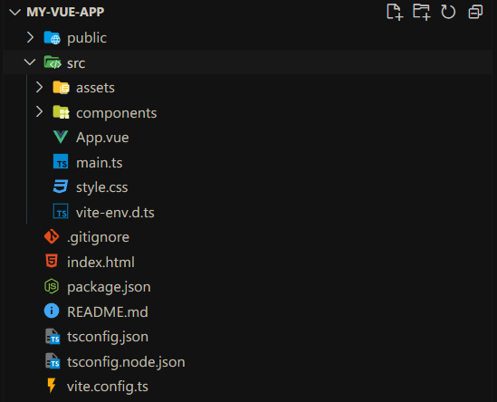
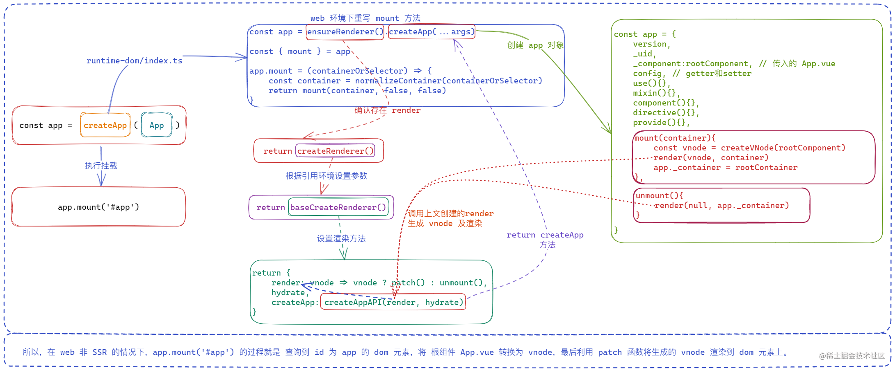

# 从 CreateApp 开始学习 Vue 源码

## 前言

大家好，我是 Miyue，人称“小米”（不是那个小米）~

从 Vue 3 在 2020 年 9 月发布到现在，也已经两年半的时间了，期间经过大大小小的优化和迭代，目前 Vue 3 已经快成为 Vue 新项目的首选版本，Vue 2 也即将停止维护，所以现在写 Vue 2 的文章也已经不再吃香了。好在，现在开始学习 Vue 3 也不算晚。

在之前的 [Vue2与Vue3响应式原理与依赖收集详解](https://juejin.cn/post/7202454684657107005) 等相关的几篇文章里，大致解析了 Vue 3 中对 **数据响应式** 的 `Proxy` 实现，以及 `Effect` 副作用和依赖收集。但是直接分析每一部分的实现原理或者运行逻辑，总是会缺乏对系统整体的认知，所以现在决定从Vue项目的第一步开始。

## 从项目开始

前面跟随  [川哥（若川）](https://juejin.cn/user/1415826704971918) 的脚步，写了一篇 create-vite 这个脚手架的实现原理，现在我们就通过这个脚手架创建一个简易的 Vue + TS 的项目吧。

```bash
pnpm create vite my-vue-app -- --template vue-ts
```

此时我们可以得到这样一个项目：



根据 Vue 2 项目的经验，我们可以很快的找到项目的真实入口：`src/main.ts`。

进入到该文件，最初只有以下代码：

```typescript
import { createApp } from 'vue'
import './style.css'
import App from './App.vue'

createApp(App).mount('#app')
```

结合 Vue 2 的开发习惯，其中的 `#app` 肯定就是 `html` 页面上的一个元素 id；所以这部分逻辑为：

- 引入 `createApp`
- 引入基础样式 `style.css`
- 引入入口单文件组件 `App.vue`
- 调用 `createApp` 传入引用组件 `App.vue` 并执行 `mount` 挂载到 `#app` 元素上

可见，**`createApp` 是一个接收 Vue 组件并返回一个具有 `mount` 方法的对象**。

### 进入 createApp

通过 Ctrl 加左键，可以很快的进入到 Vue 中 `createApp` 对应的类型声明文件中，此时我们可以留意一下这个声明文件对应的目录是 `@vue/runtime-dom/dist/runtime-dom.d.ts`，由目录也可以看出这个声明文件是自动生成的，所以如果要查看源码的话，还是得去官方仓库查看原始代码。

根据打包后的路径，可以直接进入 Vue 3 仓库下的 `runtime-dom` 包来查找对应的方法（当然这种方式只是我个人喜好，川哥其实推荐从官方仓库的  `README.md` 和 `contributing.md` 贡献指南文档 来查找项目入口和测试方案等），一般来说会直接导出的方法都可以在 `index.ts` 中找到。

幸运的是确实能在 `core/packages/runtime-dom/src/index.ts` 中找到这个方法 [手动狗头~~]

> 一般来说，肯多开源项目使用 `monorepo` 的方式进行开发的话，各个模块一般都会在 **根目录下的 `packages` 中按照不同的模块名创建不同的子项目**。

`createApp` 源码如下：

```typescript
export const createApp = ((...args) => {
  const app = ensureRenderer().createApp(...args)
  
  const { mount } = app
  app.mount = (containerOrSelector: Element | ShadowRoot | string): any => {
    const container = normalizeContainer(containerOrSelector)
    if (!container) return

    const component = app._component
    if (!isFunction(component) && !component.render && !component.template) {
      component.template = container.innerHTML
    }

    container.innerHTML = ''
    const proxy = mount(container, false, container instanceof SVGElement)
    if (container instanceof Element) {
      container.removeAttribute('v-cloak')
      container.setAttribute('data-v-app', '')
    }
    return proxy
  }

  return app
}) as CreateAppFunction<Element>
```

可以发现这部分只是对  `ensureRenderer().createApp(...args)` 返回的 `app` 实例的 `mount` 方法进行了一次重写，**增加了对传入参数的校验（是否能找到指定元素）和元素清空的方法**。其核心依然是 `ensureRenderer` 方法和它返回值的 `createApp` 方法。

进入 `ensureRenderer` 方法，发现他也只是调用了 `createRenderer`。

### createRenderer 创建渲染器

顾名思义，这个方法就是创建一个用来渲染的 `renderer` 渲染器实例。

在 `ensureRenderer` 方法中，其实是通过 **模块** 的方式，确保了 `renderer` 实例的 **存在性和唯一性** ，个人认为这种方式也可以看做是闭包或者单例模式。

```typescript
const rendererOptions = /*#__PURE__*/ extend({ patchProp }, nodeOps)
let renderer: Renderer<Element | ShadowRoot> | HydrationRenderer
function ensureRenderer() {
  return (
    renderer ||
    (renderer = createRenderer<Node, Element | ShadowRoot>(rendererOptions))
  )
}
```

这种情况下，即使多次调用 `ensureRenderer` 方法，返回的 `renderer` 实例始终是同一个。

那么话不多说，进入正题吧~

**首先，`createRenderer ` 接收一个 `rendererOptions` 参数并返回一个 `Renderer | HydrationRenderer` 类型的实例**。

这个 `rendererOptions`，是 `nodeOps` 和 `patchOps`两个对象的合集，包含了 `insertBefore、remove(removeChild)、createElement` 等 `Dom` 操作方法，以及 `patchProp` 节点属性对比方法。

而这里的 `createRenderer` 方法位于 `packages\runtime-core\src\renderer.ts` 中，通过 `baseCreateRenderer` 来创建渲染器。

### baseCreateRenderer

整个 `baseCreateRenderer` 方法的实现部分差不多有两千行，除了创建渲染器的逻辑之外，还 **定义了一系列与更新和渲染相关的方法，其中就包括我们的 `diff` 算法，也就是 `patch` 函数**。不过目前我们的主要目的是研究 Vue 项目的初始化，这里先省略 `patch` 相关的部分。

我们先找到这个返回的 `return` 部分，它返回了一个包含 `render、hydrate` 两个属性，以及一个由 `createAppAPI(render, hydrate)` 返回的 **方法** `createApp`。

然后返回正文查看 `render` 和 `hydrate` 属性的定义：

```typescript
function baseCreateRenderer(
  options: RendererOptions,
  createHydrationFns?: typeof createHydrationFunctions
): any {
	const render: RootRenderFunction = (vnode, container, isSVG) => {
    if (vnode == null) {
      if (container._vnode) {
        unmount(container._vnode, null, null, true)
      }
    } else {
      patch(container._vnode || null, vnode, container, null, null, null, isSVG)
    }
    flushPreFlushCbs()
    flushPostFlushCbs()
    container._vnode = vnode
  }

  const internals: RendererInternals = {
    p: patch,
    um: unmount,
    m: move,
    r: remove,
    mt: mountComponent,
    mc: mountChildren,
    pc: patchChildren,
    pbc: patchBlockChildren,
    n: getNextHostNode,
    o: options
  }

  let hydrate: ReturnType<typeof createHydrationFunctions>[0] | undefined
                          
  return {
    render,
    hydrate,
    createApp: createAppAPI(render, hydrate)
  }
}
```

当然，由于我们此时 **不是服务端渲染**，所以 `createHydrationFns` 参数没有值，`hydrate` 是 `undefined`；而 `render` 作为渲染方法，主要负责更新和卸载。

`render` 函数接收三个参数：`vnode` 虚拟节点树、`container` 组件实例，`isSvg` 是否是 svg 标签节点。内部逻辑也很简单，如果 `vnode` 是空，说明更新后的内容是清空挂载元素，所以直接执行卸载操作；如果存在的话，则通过 `patch` 方法进行新旧 `vnode` 树的对比和更新，然后执行相应的副作用函数队列，最后把传入的 `vnode` 更新到实例的 `_vnode` 属性上作为下次对比的旧节点数据。

言归正传，让我们进入 `createAppAPI` 来一探究竟吧~

### createAppAPI

由上文可以知道，`createAppAPI` 肯定是返回的一个函数，并且这个返回的函数是一个用来创建 Vue 单页应用根实例的方法。

那么先上源码：

```typescript
let uid = 0

export function createAppAPI<HostElement>(
  render: RootRenderFunction<HostElement>,
  hydrate?: RootHydrateFunction
): CreateAppFunction<HostElement> {
  return function createApp(rootComponent, rootProps = null) {
    if (!isFunction(rootComponent)) {
      rootComponent = extend({}, rootComponent)
    }

    if (rootProps != null && !isObject(rootProps)) {
      __DEV__ && warn(`root props passed to app.mount() must be an object.`)
      rootProps = null
    }

    const context = createAppContext()
    const installedPlugins = new Set()

    let isMounted = false

    const app: App = (context.app = {
      _uid: uid++,
      _component: rootComponent as ConcreteComponent,
      _props: rootProps,
      _container: null,
      _context: context,
      _instance: null,

      version,

      get config() {
        return context.config
      },

      set config(v) {},

      use(plugin: Plugin, ...options: any[]) {
        if (installedPlugins.has(plugin)) {
          __DEV__ && warn(`Plugin has already been applied to target app.`)
        } else if (plugin && isFunction(plugin.install)) {
          installedPlugins.add(plugin)
          plugin.install(app, ...options)
        } else if (isFunction(plugin)) {
          installedPlugins.add(plugin)
          plugin(app, ...options)
        }
        return app
      },

      mixin(mixin: ComponentOptions) {
        if (__FEATURE_OPTIONS_API__) {
          if (!context.mixins.includes(mixin)) {
            context.mixins.push(mixin)
          }
        }
        return app
      },

      component(name: string, component?: Component): any {
        if (!component) {
          return context.components[name]
        }
        context.components[name] = component
        return app
      },

      directive(name: string, directive?: Directive) {
        if (!directive) {
          return context.directives[name] as any
        }
        context.directives[name] = directive
        return app
      },

      mount(rootContainer: HostElement, isHydrate?: boolean, isSVG?: boolean): any {
        if (!isMounted) {
          const vnode = createVNode(rootComponent as ConcreteComponent, rootProps)
          vnode.appContext = context

          if (isHydrate && hydrate) {
            hydrate(vnode as VNode<Node, Element>, rootContainer as any)
          } else {
            render(vnode, rootContainer, isSVG)
          }
          isMounted = true
          app._container = rootContainer
          ;(rootContainer as any).__vue_app__ = app

          return getExposeProxy(vnode.component!) || vnode.component!.proxy
        }
      },

      unmount() {
        if (isMounted) {
          render(null, app._container)
          delete app._container.__vue_app__
        }
      },

      provide(key, value) {
        context.provides[key as string | symbol] = value
        return app
      }
    })

    return app
  }
}
```

省略掉部分开发环境的错误提示逻辑之后，只剩下一百行左右的代码。

> 这里建议结合该文件上面的 `AppContext` 与 `App` 两个类型定义。

`createAppContext` 方法返回一个 `AppContext` 类型的对象，该对象包含了 `app`、`components`、`provides` 等多个属性，并且还有一个兼容 Vue 2 的 `mixins` 数组。

其实这个对象的格式与 Vue 2 构造函数最初生成的 app 实例属性基本一致了。

然后，则是声明一个 `Set` 变量 `installedPlugins`，用来 **确保重复安装插件时不会多次安装**。

最后，就是定义并返回 **根实例对象 `app`**。

> 不过 `app` 与 `context` 两个对象之间存在互相引用，方便在开发过程中 **调用公共方法和模板解析等**。
>
> 并且也提供了 `component(), directive(), use()` 等方法，下文会在对比部分进行解释

**与上文的 `进入 createApp` 相对应的是，这里的 `app` 实例默认已经定义了一个 `mount` 方法**。但是这里的 `mount` 方法比较简陋，**只是在 `isMounted` 为 `false`，也就是还未首次挂载的情况下，通过传入的 `render` 或者 `hydrate` 方法进行渲染**，修改挂载状态，最后会创建一个根组件的 `exposed` 暴露对象的 `proxy` 代理。

## 与 Vue 2 的对比

Vue 3 与 Vue 2 在响应式的实现上已经做了很多改变，也在之前的文章中简单介绍过，所以这里单纯讨论一下应用的最初创建和公共资源处理。

### 相似

在使用 Vue 2 时，我们的所有 **公共资源** 一般都是直接通过 `Vue.proptotype.xxx = xxx` 来将其添加到 Vue 的原型链上，所以后面的 **所有 Vue 实例都可以直接通过 `this.xxx` 对其进行访问**，例如 `axios` 的使用。

而在 Vue 3 中，挂载公共资源的方法变成了使用 `app.config.globalProperties.xxx = xxx`，在组件开发中也可以通过 `this.xxx` 进行访问。

> 这里的 `this.xxx` 指的是使用 `options API` 方式进行开发的组件，如果是使用的 `setup` 模式，则需要通过 `getCurrentInstance` 方法读取当前组件实例来使用，但是这个 API 在最近的版本中已经被废弃，所以大家也可以先思考一下在该方法被废弃之后组合式API开发的组件如何在 `setup` 函数中使用自定义属性。

在 Vue 2 中，提供了基础的 `use, directive, component` 等方法用来注册 **全局资源**，只是与 `Vue.prototype` 方式存在细微区别：**通过这些方式注册的应用公共资源不会再往原型上添加新的属性**。

Vue 2 的这几个方法，都是在 `initGlobalAPI` 方法中去定义的，而 Vue 3 中则是变成在 `createAppAPI` 阶段直接往对象上面添加这些方法，并且它们的 **作用都是一样的，用来注册公共内容或者获取已注册内容**。

### 区别

Vue 3 与 Vue 2 的相同 API 设计，估计也是为了不让开发者有太大的割裂感（我猜的~），但是 Vue 2 和 Vue 3 看起来在内部的设计上已经发生了很大的改变，从以前的原型链方式改成了直接定义对象。

以 `component` 方法为例，在 Vue 2 中，该方法是 **Vue 构造函数的一个静态方法**，注册全局组件时会将新组件 **注册发哦 Vue 构造函数的静态属性 `options` 下，以 `options.component[component.name]: component`** 的形式存在。

而在 Vue 3 中，则是通过 `app.component` 来注册，会将新注册的组件保存到 `app` 关联的 `context` 中，保存为 `context.components[name]：component`。

上文提到 `createApp` 会返回一个新的 `app` 对象，用来作为应用实例；每次调用 `createApp` 创建的应用都是独立的，互不影响。而 Vue 2 的注册形式则是直接修改 `Vue` 构造函数原型链，以后创建的应用都会具有相同的公共内容。

由此看来，Vue 3 中使用 `app.use` 等方法注册的 **是单个应用级的公共内容**，而 Vue 2 则是注册的 **整个工程层面的公共内容**，会应用所有的应用实例。

## CreateApp().mount() 过程总览



