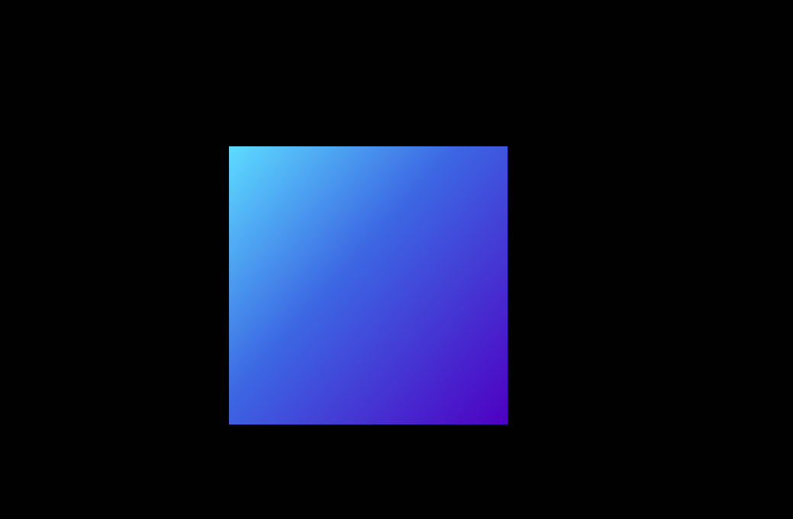
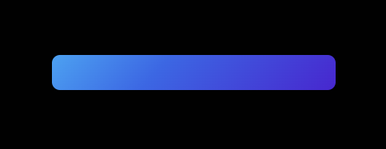

持续创作，加速成长！这是我参与「掘金日新计划 · 10 月更文挑战」的第N天，[点击查看活动详情](https://juejin.cn/post/7147654075599978532)

# CSS进阶向--纯css实现流光边框（二）

上一篇 [CSS进阶向--纯css实现流光边框](https://juejin.cn/post/7151717597715628039) 实现了一个类似激光灯带的按钮边框效果，但是使用了四个 **span** 标签来模拟按钮边框，并且不同位置的边框对应的 css 样式与 animation 动画都需要单独配置，可能会增加一定的开发和调试成本。

所以这一节我们利用背景图片来实现一个流光效果的边框。先上代码和最终效果：

[代码片段](https://code.juejin.cn/pen/7151936653253148711)

然后，我们开始分步编写：

## 1. 逻辑拆解和设计

我们先对该实现方式的大体逻辑进行拆分：

首先，需要一个背景图片（颜色）来持续旋转，模拟边框的颜色变化，此时该元素背景颜色一般会铺满或者占据部分整体（最外层） dom 元素，所以内部还需要一个元素来继承外部的背景色，用来覆盖背景图片颜色部分，保证只有一个“边框”透出颜色；为了保证具有背景颜色的部分不会超出我们预设的 dom 元素区域，所以外层 dom 还需要隐藏内部元素的超出部分。

为了减少 dom 标签，模拟边框的带背景图片元素还可以使用 **伪类** 来实现。

所以整体的 dom 结构如下：

```html
<div class="streamer-button">
  <!-- ::before -->
  <div class="streamer-content">Streamer Frame Button 2</div>
</div>
```

其中：

1. **div.streamer-button** 作为最外层元素，负责基础样式和隐藏内部元素超出部分
2. **div.streamer-button::before** 作为背景图片（颜色）的挂载元素，并添加动画来模拟“流光”效果
3. **div.streamer-content** 作为文本内容区域，需要继承外部背景色来覆盖 before 伪元素的背景图片（颜色）

为了保证元素层级，还需要给元素添加定位配置。

## 2. 背景与动画

我们先处理外层元素与伪元素的样式部分。

首先，定义一个基础背景色变量，用来表示最外层通用背景颜色，并设置 body 样式（这里只是为了演示效果，实际上不需要设置 body 样式）：

```css
@property --bg-color {
  syntax: "<color>";
  initial-value: #010101;
  inherits: false;
}
body {
  height: 100vh;
  background: var(--bg-color);
  display: flex;
  flex-direction: column;
  align-items: center;
  justify-content: center;
  box-sizing: border-box;
}
```

然后，配置 **div.streamer-button** 与 **div.streamer-button::before** 的基础样式：

```css
.streamer-button {
  background: var(--bg-color);
  padding: 4px;
  position: relative;
  border-radius: 8px;
  justify-content: center;
  align-items: center;
  text-align: center;
  display: flex;
  font-size: 1.5em;
  color: rgb(88 199 250 / 100%);
  cursor: pointer;
  font-family: cursive;
}

.streamer-button::before {
  content: "";
  background-image: linear-gradient(132deg, #5ddcff, #3c67e3 43%, #4e00c2);
  position: absolute;
  z-index: 0;
  left: -4px;
  right: -4px;
  padding-bottom: calc(100% + 8px);
}
```

此时，我们得到了这样一个效果：



通过元素审查会发现 **before** 伪类已经超出了父元素，所以需要给父元素增加一个 **overflow: hidden**。就可以得到正确效果



然后，我们再来实现旋转动画，并将动画添加到 **before** 伪元素上：

```css
@keyframes spin {
  0% {
    rotate: 0deg;
  }
  100% {
    rotate: 360deg;
  }
}
.streamer-button::before {
  animation: spin 2s linear infinite;
}
```

最后，给内层元素添加一个背景色和需要的基础样式即可：

```css
.streamer-content {
  padding: 24px 40px;
  background: var(--bg-color);
  z-index: 10;
  border-radius: 6px;
}
```

## 3. Tips

本节除了提供另外一种实现流光边框的效果外，也有一些其他的小技巧：

### 3.1 padding 实现固定宽高比元素

因为 padding 的四个值如果是百分比形式，则都是以该元素的 **父元素** 的 **”横向“** 宽度作为基础单位进行计算的，所以我们可以利用这个特性来实现一个固定宽高比的元素。

```html
<div class="parent">
  <div class="rectangle"></div>
</div>

<style type="text/css">
  .parent {
    width: 400px;
    height: auto;
  }
  .rectangle {
    width: 200px;
    padding-bottom: 60%;
  }
</style>
```

此时， **div.rectangle** 的高度则为 **400 * 0.6 = 240 px **。

最后我们在 **div.rectangle** 内部使用 “相对定位+绝对定位” 即可实现固定宽高比例。本节里面的伪类就是采用这种方式，避免高度不够导致旋转时无法正常模拟边框。

### 3.2 animation-play-state 控制动画状态

该属性具有两个值：paused 和 running。

其中 **paused ** 表示暂停动画，**running** 表示正常执行动画过程。

为了减少一些动画效果对文本阅读的影响，可以在 **hover** 状态下添加 **animation-play-state: paused;** 停止动画。 

### 3.3 css @property 自定义属性

该属性是一个实验性属性，允许用户 **显示的定义** 需要的自定义属性，包含三个部分：属性类型检查、设定默认值以及定义该自定义属性是否可以被继承。

语法如下：

```css
@property --property-name {
  syntax: '<color>';
  inherits: false;
  initial-value: #c0ffee;
}
```

具体说明可以查看以下文档：

[MDN - @property](https://developer.mozilla.org/zh-CN/docs/Web/CSS/@property)

[chokcoco - CSS @property，让不可能变可能](https://juejin.cn/post/6951201528543707150)


## 往期精彩

[Bpmn.js 进阶指南](https://juejin.cn/column/6964382482007490590)

[Vue 2 源码阅读理解](https://juejin.cn/column/7136858810605371399)

[一行指令实现大屏元素分辨率适配(Vue)](https://juejin.cn/post/7148476639343542279)

[基于 Vue 2 与 高德地图 2.0 的“线面编辑器”](https://juejin.cn/post/7142746736690200612)