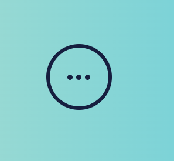
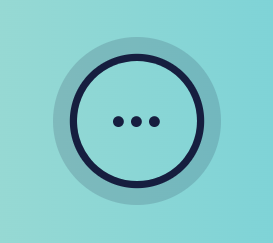
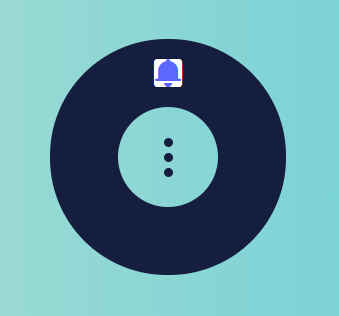

持续创作，加速成长！这是我参与「掘金日新计划 · 10 月更文挑战」的第N天，[点击查看活动详情](https://juejin.cn/post/7147654075599978532)

# CSS进阶向--配合Vue动态样式实现“超炫酷”圆环菜单

## 前言

在前面的两节 【CSS 进阶向】 中，我们通过纯粹的 CSS 结合 HTML 元素实现了两种不同的“流光边框”效果的按钮。两者都是通过元素（或者伪元素）配合 CSS 动画属性 **animation** 与自定义动画帧 **@keyframes** 来实现的。

这次我们通过 Vue 的动态样式和计算属性，来实现一个点击展开的圆环菜单，并且实现菜单图标的顺序显示。

先上最终效果和代码：

[代码片段](https://code.juejin.cn/pen/7152045673334964239)

## 实现

在实现过程中，我们按照以下步骤：

1. 整体结构 和 控制菜单展开/首起的按钮
2. 控制按钮的 hover 状态
3. 展开后的圆环
4. 每个菜单的样式计算与动画配置

### 1. 整体结构与基础按钮

整个菜单内部包含两个部分：控制按钮 和 菜单列表，分别用一个 **label** 和 **ul** 填充。label 内部使用三个 span 标签实现圆点；并用动态样式绑定一个展开状态的 class 类名。

```html
<template>
  <div class="circle-menu-button">
    <div :class="{ menu: true, active: isActive }">
      <label class="menu-dots" for="menu" @click="isActive = !isActive">
        <span class="menu-dot"></span>
        <span class="menu-dot"></span>
        <span class="menu-dot"></span>
      </label>
      <ul class="menu-items">
      </ul>
    </div>
  </div>
</template>

<script>
export default {
  name: "CircleMenuButton",
  data() {
    return {
      isActive: false
    };
  }
};
</script>

<style scoped lang="scss">
.menu {
  position: relative;
}

.menu-dots {
  width: 5rem;
  height: 5rem;
  border-radius: 50%;
  box-shadow: 0 0 0 0.3rem #161e3f;
  display: flex;
  flex-direction: column;
  align-items: center;
  justify-content: center;
  transform: rotate(90deg);
  transition: 0.3s;
  cursor: pointer;
}
.menu-dot {
  width: 0.45rem;
  height: 0.45rem;
  background-color: #161e3f;
  border-radius: 50%;
}
.menu-dot + .menu-dot {
  margin-top: 0.3rem;
}
</style>
```

此时得到如下的样式：



### 2. 添加按钮 hover 样式

为了让用户直观的感受到这个元素是一个可以点击的元素，我们可以增加一个 hover 状态的特殊样式，以提示用户。

```css
.menu-dots:hover {
  box-shadow: 0 0 0 0.3rem #161e3f, 0 0 0 1rem rgba(#161e3f, 0.16);
  transform: scale(1.2) rotate(90deg);
}
```

此时会方法整个dom元素，并扩大外层阴影，提示用户点击：



### 3. 展开状态的菜单放置圆环

在用户点击后，可以旋转中心的 label 标签表示菜单已展开，并且在外层显示 **ul** 对应的菜单列表和圆环。

```css
.menu.active > .menu-dots {
  transform: none;
  box-shadow: 0 0 0 3.4rem #161e3f;
}

.menu-items {
  position: absolute;
  top: -3.4rem;
  left: -3.4rem;
  right: -3.4rem;
  bottom: -3.4rem;
  transition: 0.3s;
  opacity: 0;
  pointer-events: none;
}
```

为了增加辨识度，这时会取消掉最外层的浅色 box-shadow 阴影。

**ul** 元素会通过绝对定位的形式，填满整个元素与 box-shadow 覆盖的区域。

> 需要禁用该元素的鼠标事件，避免无法点击到内部的 label 元素，造成无法收起菜单。并且设置 opacity 为 0，隐藏内部的菜单按钮部分

此时会得到这样一个效果：


_乍一看，有点像个 iPod 播放器的按钮 ？_

### 4. 每个菜单元素的样式计算

首先，我们先模拟一下菜单数据：

```json
menus: [
  { icon: "el-icon-question", name: "1" },
  { icon: "el-icon-platform-eleme", name: "2" },
  { icon: "el-icon-camera-solid", name: "3" },
  { icon: "el-icon-info", name: "4" },
  { icon: "el-icon-s-shop", name: "5" },
  { icon: "el-icon-message-solid", name: "6" }
]
```

然后，在 template 中渲染对应的菜单项：

```html
<ul class="menu-items">
  <li v-for="(m, k) in menus" class="menu-item" :style="iconStyle(k)" :key="m.name">
    <i :class="m.icon" />
  </li>
</ul>
```

随后是样式部分：

```scss
.menu.active .menu-items {
  opacity: 1;
}
.menu-item {
  position: absolute;
  top: 0;
  left: 0;
  right: 0;
  bottom: 0;
  padding: 0.9rem;
  font-size: 1.6rem;
  filter: blur(2px);
  opacity: 0;
  display: inline-block;
  text-align: center;
  transition: 0.3s;
  pointer-events: none;
  i {
    pointer-events: auto;
    display: inline-block;
    cursor: pointer;
  }
  &:hover {
    color: #5c67ff;
  }
}

.menu.active .menu-items > .menu-item {
  opacity: 1;
  transform: none;
  filter: none;
}
```

这时得到这样的效果：



我们会发现所有的菜单图标都挤在一个位置，并且也无法看到顺序出现的动画。

这时就需要使用 Vue 的计算属性了。我们可以通过计算属性返回一个依赖 menus 菜单数组的函数，接收当前菜单元素下标并返回对应的样式。

```javascript
export default {
  name: "CircleMenuButton",
  data() {
    return {
      menus: [
        { icon: "el-icon-question", name: "1" },
        { icon: "el-icon-platform-eleme", name: "2" },
        { icon: "el-icon-camera-solid", name: "3" },
        { icon: "el-icon-info", name: "4" },
        { icon: "el-icon-s-shop", name: "5" },
        { icon: "el-icon-message-solid", name: "6" }
      ],
      isActive: false
    };
  },
  computed: {
    iconStyle() {
      const length = this.menus.length;
      const transitionStep = 0.5 / (this.menus.length - 1);
      return (i) => {
        return { transform: `rotate(${Math.floor((i * 360) / length)}deg)`, transitionDelay: `${transitionStep * i}s` };
      };
    }
  }
};
```

该函数返回一个 transform 属性和一个 transitionDelay 属性。

为了保证形成一个完整的圆环，需要通过 menus 的长度计算每个菜单之间的旋转角度，使用 **transform：rotate()** 进行旋转；

**transitionDelay** 则是 **transition** 动画的延迟时间控制，为了避免菜单过多时导致动画时长太长，可以通过一个总的时间（这里是 0.5s）与菜单长度计算延迟时间单位，保证动画总时长不超过固定时长。

## 扩展

整个组件的数据都在内部，后续其实也可以通过 **props** 的形式控制菜单项与动画总时长等；颜色调整也可以使用变量的形式让其更加可控。

内部为了保证每个菜单项都在圆环上，采用了固定数值的定位配置；并且每个 menu-item 的大小都与整体区域大小一致，所以也需要取消他们的 dom 事件，在最内层的 i 标签上恢复事件响应，整个设计上来说个人感觉并不是很完美。也希望大家有好主意的话可以告诉我，后续再对其进行一些优化。

## 往期精彩

[Bpmn.js 进阶指南](https://juejin.cn/column/6964382482007490590)

[Vue 2 源码阅读理解](https://juejin.cn/column/7136858810605371399)

[一行指令实现大屏元素分辨率适配(Vue)](https://juejin.cn/post/7148476639343542279)

[基于 Vue 2 与 高德地图 2.0 的“线面编辑器”](https://juejin.cn/post/7142746736690200612)