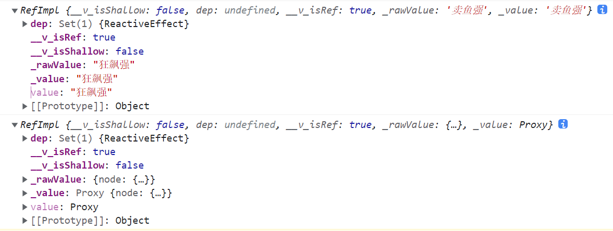

# Ref — Vue 3 基础类型响应方案


我正在参加「掘金·启航计划」


在之前的 [Vue2与Vue3响应式原理与依赖收集详解](https://juejin.cn/post/7202454684657107005) 和 [通过一个例子解析 Vue 3 Watch 的工作原理](https://juejin.cn/post/7204735262961041465) 中，已经大致讲述了 Vue 3 中对 **对象** 的响应式处理方案，核心是通过 `Proxy` 代理对象配合 `Effect` 实现；当然其他的 **引用类型数据**（例如数组、Map 等）也是通过类似的方法实现的。

但是 `Proxy` 代理的对象 **只能是引用类型数据**，基础类型的数据是无法通过 `proxy` 来实现响应处理的，并且由于其是 **按值存储**，在执行过程中随时都会发生改变，所以 **实现基础数据响应式的唯一方案就是将基础数据封装为一个对象**。所以在 Vue 3 中使用 `ref` 定义的变量都需要通过 `.value` 来获取值。

## 从使用开始

根据官方文档的描述，因为 **`reactive()` 的种种限制归根结底是因为 JavaScript 没有可以作用于所有值类型的 “引用” 机制**，所以才增加了一个 `ref` 方法来 **允许创建任何值类型的响应式 ref**：

```typescript
function ref<T>(value: T): Ref<UnwrapRef<T>>

interface Ref<T> {
  value: T
}
```

> ref 对象是可更改的，也就是说你可以为 `.value` 赋予新的值。它也是响应式的，即所有对 `.value` 的操作都将被追踪，并且写操作会触发与之相关的副作用。
>
> 如果将一个对象赋值给 ref，那么这个对象将通过 `reactive()` 转为具有深层次响应式的对象。这也意味着如果对象中包含了嵌套的 ref，它们将被深层地解包。

例如我们创建以下两个 `Ref` 变量：

```typescript
const userRef: Ref<string> = ref('卖鱼强')
const objRef = ref({ node: { name: 'div' } })
console.log(userRef)
console.log(objRef)
```

此时我们会得到两个类型为 `RefImpl` 的实例：



这里可以看出，`ref` 函数内部肯定是通过 `class RefImpl` 来构建了一个实例，通过这个实例来实现数据响应的；并且这个实例对应的 **简单类型原始数据** 会同时保存在实例的 `_value` 属性和 `_rawValue` 上，而引用类型则是将其进行响应式处理后在把 `proxy` 代理对象绑定到 `_value` 上，`_rawValue` 保存原始值。

> 思考：如果用的是 `shallowRef` 声明的一个引用类型数据，值是怎么样的？

另外这个实例上还会绑定两个 **标识属性** 和 `dep` **关联副作用**，其中

- `__v_isShallow`：标识是否是浅层响应
- `__v_isRef`：标识这个对象是不是一个 `ref` 响应对象

所以，带着这些信息我们来看一下 `ref` 部分的源码吧

## 源码实现

`ref` 模块的源码位于 `reactivity/src/ref.ts` 中，与 `ref()` 方法相关的主要是以下代码：

```js
const toReactive = (value) => isObject(value) ? reactive(value) : value;
function trackRefValue(ref2) {
  if (shouldTrack && activeEffect) {
    ref2 = toRaw(ref2);
    trackEffects(ref2.dep || (ref2.dep = createDep()));
  }
}
function triggerRefValue(ref2, newVal) {
  ref2 = toRaw(ref2);
  if (ref2.dep) {
    triggerEffects(ref2.dep);
  }
}
function isRef(r) {
  return !!(r && r.__v_isRef === true);
}
function ref(value) {
  return createRef(value, false);
}
function shallowRef(value) {
  return createRef(value, true);
}
function createRef(rawValue, shallow) {
  if (isRef(rawValue)) {
    return rawValue;
  }
  return new RefImpl(rawValue, shallow);
}
const RefImpl = class {
  constructor(value, __v_isShallow) {
    this.__v_isShallow = __v_isShallow;
    this.dep = void 0;
    this.__v_isRef = true;
    this._rawValue = __v_isShallow ? value : toRaw(value);
    this._value = __v_isShallow ? value : toReactive(value);
  }
  get value() {
    trackRefValue(this);
    return this._value;
  }
  set value(newVal) {
    const useDirectValue = this.__v_isShallow || isShallow(newVal) || isReadonly(newVal);
    newVal = useDirectValue ? newVal : toRaw(newVal);
    if (hasChanged(newVal, this._rawValue)) {
      this._rawValue = newVal;
      this._value = useDirectValue ? newVal : toReactive(newVal);
      triggerRefValue(this, newVal);
    }
  }
};
```

由上可知：

- `ref` 与 `shallowRef` 都是使用 `createRef` 方法创建的，只是参数不同
- `createRef` 方法内部优先判断传入对象是否已经是一个 `Ref` 格式数据，是则直接返回
- `RefImpl` 是 `ref` 部分核心方法，创建了一个 `RefImpl` 格式实例，并定义了该实例的 `value` 属性的 `get/set` 方法
- 在 `new RefImpl()` 过程中，会处理实例的几个默认属性
  1. `shallowRef` 创建的响应式对象，`__v_isShallow` 为 `true`，`_rawValue` 与 `_value` 皆是原始数据
  2. `ref` 创建的响应式对象，`__v_isShallow` 为 `false`，`_rawValue` 会深层处理获取最原始的数据，`_value` 会使用 `toReactive` 函数进行处理
- 对 `value` 属性进行读取时，最终会通过 `trackEffects` 函数收集与该属性相关的副作用函数，返回 `_value`
- 对 `value` 属性进行更新时
  1. 判断当前实例的 `__v_isShallow` 配置与传入的新值类型，**如果任意值为真，则默认使用新值对应的最原始数据**
  2. 通过 `Object.is` 判断新旧值是否发生改变，确定发生改变后重新处理新值并通过 `triggerRefValue` 通知相关副作用执行

## 小节

回到上面的那个思考题，当使用 `shallowRef` 传入一个对象数据的时候，它的 `_rawValue` 与 `_value` 的处理与简单数据类型是一样的，都等于原始数据。

而 `ref` 响应式数据的实际逻辑 **只是处理简单类型数据值或者引用类型数据引用地址的响应式**，当使用 `ref` 处理引用类型数据时，内部实际依然是调用 `reactive` 来创建响应式对象的。
