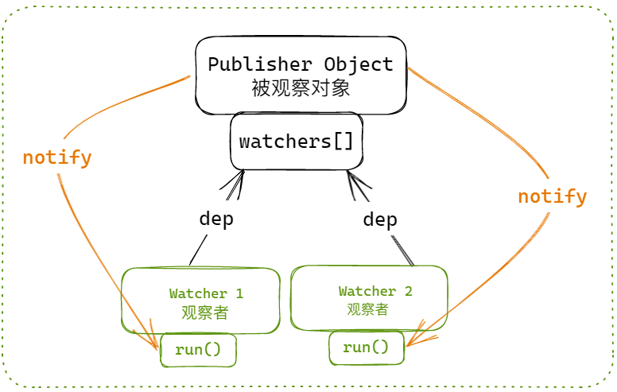
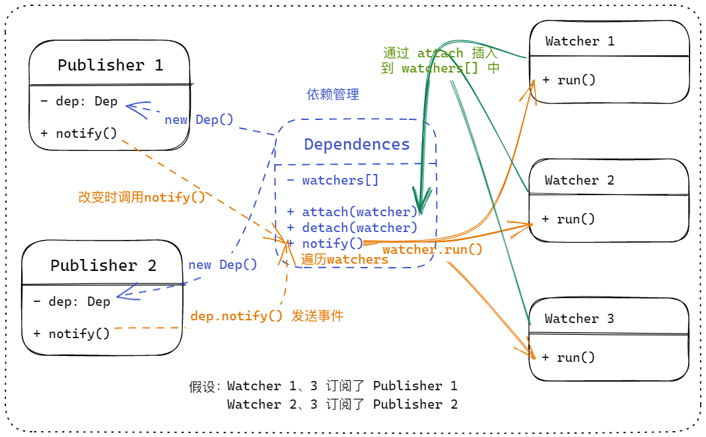
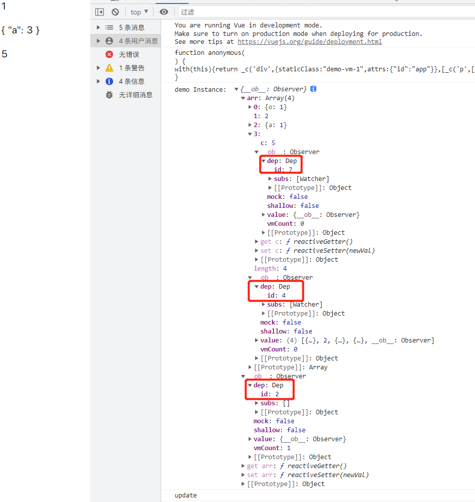

# Vue2与Vue3响应式原理与依赖收集详解

我正在参加「掘金·启航计划」

## 前言

继 Angular 和 React 之后，尤大在 2016 年发布了如今“前端三剑客”之一的 Vue 2.0，并凭借其简单易用、轻量高效的特点受到了广泛的欢迎，特别是在国内环境中。然而 Vue 2 中基于 `Object.defineProperty` 实现的响应式系统，随着 JavaScript 与浏览器技术的不断升级，其缺陷也愈加明显~

所以 Vue 团队在 Vue 2 的基础上，通过基于 `Proxy` 的全新响应式系统发布了 Vue 3.0，带来了更好的性能表现。

本文将深入剖析 Vue 2 与 Vue 3 的响应式系统实现，解释其实现原理和优势对比，如果你正在学习和了解 Vue 源码相关的内容，那本文肯定值得一看~

## Vue 的响应式系统设计思路

虽然 Vue 2 与 Vue 3 实现响应式系统的方式不同，但是他们的核心思想还是一致的，都是通过 **发布-订阅模式** 来实现（因为发布者和观察者之间多了一个 **dependence** 依赖收集者，与传统观察者模式不同）。

> 个人理解，**观察者模式** 与 **发布-订阅模式** 都是 **消息传递的一种实现方式**，用来实现 **对象间的通信（消息传递）**，只是发布订阅模式可以看做是观察者模式的 **升级版**，避免了 **被观察对象与观察者之间的直接联系**。

观察者模式：一个被观察对象对应多个观察者，两者直接联系；被观察这改变时直接向所有观察者发送消息（调用观察者的更新方法）

 

发布订阅模式：被观察对象与观察者之间可能是 **多对多** 的关系，两者都可以绑定多个另一角色；而两个角色之间还有一个 **依赖收集和管理** 的角色（提供一些观察者的操作方法）。



> **在 Vue 中我们视图中依赖的每一个数据其实就是一个被观察者，我们的视图渲染函数（renderWatcher）和其他的 watcher/effect 函数则都是订阅者**。

当数据改变时，就会发送一个事件去触发我们的观察者进行更新，即视图更新。

## Vue 2 的响应式实现

刚刚我们简述了一下 Vue 实现响应式的基础方案，就是通过发布订阅模式收集数据依赖，当数据更新时触发 render 等一系列 Watcher 函数的执行来实现视图更新的。

大家也都知道 Vue 2 是通过 `Object.defineProperty` 来实现数据 **读取和更新时的操作劫持**，通过更改默认的 **getter/setter** 函数，在 **get** 过程中收集依赖，在 **set** 过程中派发更新的。

我们可以通过下面的简易代码来分析：

```js
// 响应式数据处理，构造一个响应式对象
class Observer {
  constructor(data) {
    this.data = data
    this.walk(data)
  }

  // 遍历对象的每个 已定义 属性，分别执行 defineReactive
  walk(data) {
    if (!data || typeof data !== 'object') {
      return
    }

    Object.keys(data).forEach(key => {
      this.defineReactive(data, key, data[key])
    })
  }

  // 为对象的每个属性重新设置 getter/setter
  defineReactive(obj, key, val) {
    // 每个属性都有单独的 dep 依赖管理
    const dep = new Dep()

    // 通过 defineProperty 进行操作代理定义
    Object.defineProperty(obj, key, {
      enumerable: true,
      configurable: true,
      // 值的读取操作，进行依赖收集
      get() {
        if (Dep.target) {
          dep.depend()
        }
        return val
      },
      // 值的更新操作，触发依赖更新
      set(newVal) {
        if (newVal === val) {
          return
        }
        val = newVal
        dep.notify()
      }
    })
  }
}

// 观察者的构造函数，接收一个表达式和回调函数
class Watcher {
  constructor(vm, expOrFn, cb) {
    this.vm = vm
    this.getter = parsePath(expOrFn)
    this.cb = cb
    this.value = this.get()
  }

  // watcher 实例触发值读取时，将依赖收集的目标对象设置成自身，
 	// 通过 call 绑定当前 Vue 实例进行一次函数执行，在运行过程中收集函数中用到的数据
  // 此时会在所有用到数据的 dep 依赖管理中插入该观察者实例
  get() {
    Dep.target = this
    const value = this.getter.call(this.vm, this.vm)
    // 函数执行完毕后将依赖收集目标清空，避免重复收集
    Dep.target = null
    return value
  }

  // dep 依赖更新时会调用，执行回调函数
  update() {
    const oldValue = this.value
    this.value = this.get()
    this.cb.call(this.vm, this.value, oldValue)
  }
}

// 依赖收集管理者的构造函数
class Dep {
  constructor() {
    // 保存所有 watcher 观察者依赖数组
    this.subs = []
  }

  // 插入一个观察者到依赖数组中
  addSub(sub) {
    this.subs.push(sub)
  }

  // 收集依赖，只有此时的依赖目标（watcher 实例）存在时才收集依赖
  depend() {
    if (Dep.target) {
      this.addSub(Dep.target)
    }
  }

  // 发送更新，遍历依赖数组分别执行每个观察者定义好的 update 方法
  notify() {
    this.subs.forEach(sub => {
      sub.update()
    })
  }
}

Dep.target = null

// 表达式解析
function parsePath(path) {
  const segments = path.split('.')
  return function (obj) {
    for (let i = 0; i < segments.length; i++) {
      if (!obj) {
        return
      }
      obj = obj[segments[i]]
    }
    return obj
  }
}

```

> 这里省略了数组部分，但是 **数组本身的响应式监听** 是通过重写数组方法来实现的，而 **每个数组元素** 则会再次进行 **Observer** 处理（需要数组在定义时就已经声明的数组元素）。

当然，因为 **Object.definePorperty** 只能对 **对象的已知属性** 进行操作，所有才会导致 **没有在 data 中进行声明的对象属性直接赋值时无法触发视图更新，需要通过魔法（`$set`）来处理**。而数组也应为是通过重新数组方法和遍历数组元素进行的响应式处理，也会导致按照数组下标进行赋值或者更改元素时无法触发视图更新。

例如：

```html
<body>
  <div id="app" class="demo-vm-1">
    <p>{{arr[0]}}</p>
    <p>{{arr[2]}}</p>
    <p>{{arr[3].c}}</p>
  </div>
</body>

<script>
  new Vue({
    el: "#app",
    data() {
      return {
        arr: [1, 2, { a: 3 },{ c: 5 }]
      }
    },
    mounted() {
      console.log("demo Instance: ", this.$data);

      setTimeout(() => {
        console.log('update')
        this.arr[0] = { o: 1 }
        this.arr[2] = { a: 1 }
      },2000)
    },
  })
</script>
```

因为数组元素的前三个元素 **在定义时都是简单类型**，所以即使在模板中使用了该数据，也无法进行依赖收集和更新响应：



而本身的 `data` 返回对象与 `arr, arr[3]` 都有各自的 `dep` 依赖数组，并且 `arr` 和 `arr[3]` 的依赖中都有同一个 `Watcher` —— `RenderWacther` 模板渲染。

> 当然整个响应系统还包含依赖清理等其他操作，具体过程可以查看 [Vue 2 阅读理解（十八）之响应式系统（一 ~ 四）Watcher](https://juejin.cn/post/7140516806321504292)


## Vue 3 的响应式实现

碍于 `Object.defineProperty` 的局限性，Vue 3 采用了全新的 `Proxy` 对象来实现整个响应式系统基础。

### 什么是 Proxy ？

`Proxy` 是 `ES6` 新增的一个构造函数，用来创建一个 **目标对象的代理对象，拦截对原对象的所有操作；用户可以通过注册相应的拦截方法来实现对象操作时的自定义行为**。

目前 `Proxy` 支持的拦截方法包含一下内容：

- `get(target, propKey, receiver)`：拦截对象属性的读取操作；
- `set(target, propKey, value, receiver)`：拦截对象属性的赋值操作；
- `apply(target, thisArg, argArray)`：拦截函数的调用操作；
- `construct(target, argArray, newTarget)`：拦截对象的实例化操作；
- `has(target, propKey)`：拦截 `in` 操作符；
- `deleteProperty(target, propKey)`：拦截 `delete` 操作符；
- `defineProperty(target, propKey, propDesc)`：拦截 `Object.defineProperty` 方法；
- `getOwnPropertyDescriptor(target, propKey)`：拦截 `Object.getOwnPropertyDescriptor` 方法；
- `getPrototypeOf(target)`：拦截 `Object.getPrototypeOf` 方法；
- `setPrototypeOf(target, proto)`：拦截 `Object.setPrototypeOf` 方法；
- `isExtensible(target)`：拦截 `Object.isExtensible` 方法；
- `preventExtensions(target)`：拦截 `Object.preventExtensions` 方法；
- `enumerate(target)`：拦截 `for...in` 循环；
- `ownKeys(target)`：拦截 `Object.getOwnPropertyNames`、`Object.getOwnPropertySymbols`、`Object.keys`、`JSON.stringify` 方法。

与 `Object,defineProperty` 比起来，有非常明显的优势：

- 拦截操作更加多样
- 拦截定义更加直接
- 性能更加高效

在 Vue 中体现最为明显的一点就是：`Proxy` 代理对象之后不仅可以拦截对象属性的读取、更新、方法调用之外，对整个对象的新增、删除、枚举等也能直接拦截，而 `Object.defineProperty` 只能针对对象的已知属性进行读取和更新的操作拦截。

例如：

```js
const obj = { name: 'MiyueFE', age: 28 };
const proxy = new Proxy(obj, {
  get(target, property) {
    console.log(`Getting ${property} value: ${target[property]}`);
    return target[property];
  },
  set(target, property, value) {
    console.log(`Setting ${property} value: ${value}`);
    target[property] = value;
  },
  deleteProperty(target, property) {
    console.log(`Deleting ${property} property`);
    delete target[property];
  },
});

console.log(proxy.name); // Getting name value: MiyueFE, 输出 "MiyueFE"
proxy.name = 'MY'; // Setting name value: MY
console.log(proxy.name); // Getting name value: MY, 输出 "MY"
delete proxy.age; // Deleting age property
console.log(proxy.age); // undefined
```

### 响应式系统

