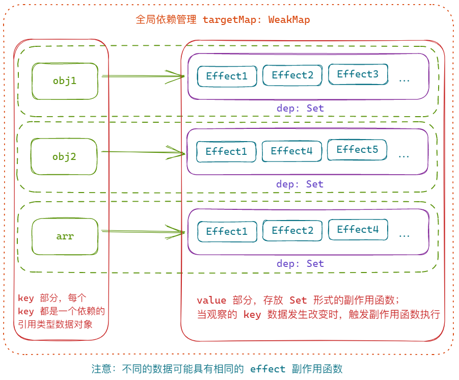

# Vue2与Vue3响应式原理与依赖收集详解

我正在参加「掘金·启航计划」

## 前言

继 Angular 和 React 之后，尤大在 2016 年发布了如今“前端三剑客”之一的 Vue 2.0，并凭借其简单易用、轻量高效的特点受到了广泛的欢迎，特别是在国内环境中。然而 Vue 2 中基于 `Object.defineProperty` 实现的响应式系统，随着 JavaScript 与浏览器技术的不断升级，其缺陷也愈加明显~

所以 Vue 团队在 Vue 2 的基础上，通过基于 `Proxy` 的全新响应式系统发布了 Vue 3.0，带来了更好的性能表现。

本文将深入剖析 Vue 2 与 Vue 3 的响应式系统实现，解释其实现原理和优势对比，如果你正在学习和了解 Vue 源码相关的内容，那本文肯定值得一看~

## Vue 的响应式系统设计思路

虽然 Vue 2 与 Vue 3 实现响应式系统的方式不同，但是他们的核心思想还是一致的，都是通过 **发布-订阅模式** 来实现（因为发布者和观察者之间多了一个 **dependence** 依赖收集者，与传统观察者模式不同）。

> 个人理解，**观察者模式** 与 **发布-订阅模式** 都是 **消息传递的一种实现方式**，用来实现 **对象间的通信（消息传递）**，只是发布订阅模式可以看做是观察者模式的 **升级版**，避免了 **被观察对象与观察者之间的直接联系**。

观察者模式：一个被观察对象对应多个观察者，两者直接联系；被观察这改变时直接向所有观察者发送消息（调用观察者的更新方法）

 

发布订阅模式：被观察对象与观察者之间可能是 **多对多** 的关系，两者都可以绑定多个另一角色；而两个角色之间还有一个 **依赖收集和管理** 的角色（提供一些观察者的操作方法）。


> **在 Vue 中我们视图中依赖的每一个数据其实就是一个被观察者，我们的视图渲染函数（renderWatcher）和其他的 watcher/effect 函数则都是订阅者**。

当数据改变时，就会发送一个事件去触发我们的观察者进行更新，即视图更新。

## Vue 2 的响应式实现

刚刚我们简述了一下 Vue 实现响应式的基础方案，就是通过发布订阅模式收集数据依赖，当数据更新时触发 render 等一系列 Watcher 函数的执行来实现视图更新的。

### 对象的响应式处理

大家也都知道 Vue 2 是通过 `Object.defineProperty` 来实现数据 **读取和更新时的操作劫持**，通过更改默认的 **getter/setter** 函数，在 **get** 过程中收集依赖，在 **set** 过程中派发更新的。

> 这里指的是 **对象**，也就是为什么 Vue 的 SFC 文件里面 `data` 返回的都是一个 **返回对象的函数**，因为只有对象才能通过 `Object.defineProperty` 去处理；而数组的响应式处理则是通过重写数组方法来操作的。

我们可以通过下面的简易代码来分析：

```js
// 响应式数据处理，构造一个响应式对象
class Observer {
  constructor(data) {
    this.data = data
    this.walk(data)
  }

  // 遍历对象的每个 已定义 属性，分别执行 defineReactive
  walk(data) {
    if (!data || typeof data !== 'object') {
      return
    }

    Object.keys(data).forEach(key => {
      this.defineReactive(data, key, data[key])
    })
  }

  // 为对象的每个属性重新设置 getter/setter
  defineReactive(obj, key, val) {
    // 每个属性都有单独的 dep 依赖管理
    const dep = new Dep()

    // 通过 defineProperty 进行操作代理定义
    Object.defineProperty(obj, key, {
      enumerable: true,
      configurable: true,
      // 值的读取操作，进行依赖收集
      get() {
        if (Dep.target) {
          dep.depend()
        }
        return val
      },
      // 值的更新操作，触发依赖更新
      set(newVal) {
        if (newVal === val) {
          return
        }
        val = newVal
        dep.notify()
      }
    })
  }
}

// 观察者的构造函数，接收一个表达式和回调函数
class Watcher {
  constructor(vm, expOrFn, cb) {
    this.vm = vm
    this.getter = parsePath(expOrFn)
    this.cb = cb
    this.value = this.get()
  }

  // watcher 实例触发值读取时，将依赖收集的目标对象设置成自身，
 	// 通过 call 绑定当前 Vue 实例进行一次函数执行，在运行过程中收集函数中用到的数据
  // 此时会在所有用到数据的 dep 依赖管理中插入该观察者实例
  get() {
    Dep.target = this
    const value = this.getter.call(this.vm, this.vm)
    // 函数执行完毕后将依赖收集目标清空，避免重复收集
    Dep.target = null
    return value
  }

  // dep 依赖更新时会调用，执行回调函数
  update() {
    const oldValue = this.value
    this.value = this.get()
    this.cb.call(this.vm, this.value, oldValue)
  }
}

// 依赖收集管理者的构造函数
class Dep {
  constructor() {
    // 保存所有 watcher 观察者依赖数组
    this.subs = []
  }

  // 插入一个观察者到依赖数组中
  addSub(sub) {
    this.subs.push(sub)
  }

  // 收集依赖，只有此时的依赖目标（watcher 实例）存在时才收集依赖
  depend() {
    if (Dep.target) {
      this.addSub(Dep.target)
    }
  }

  // 发送更新，遍历依赖数组分别执行每个观察者定义好的 update 方法
  notify() {
    this.subs.forEach(sub => {
      sub.update()
    })
  }
}

Dep.target = null

// 表达式解析
function parsePath(path) {
  const segments = path.split('.')
  return function (obj) {
    for (let i = 0; i < segments.length; i++) {
      if (!obj) {
        return
      }
      obj = obj[segments[i]]
    }
    return obj
  }
}

```

当然，因为 **Object.definePorperty** 只能对 **对象的已知属性** 进行操作，所有才会导致 **没有在 data 中进行声明的对象属性直接赋值时无法触发视图更新，需要通过魔法（`$set`）来处理**。而数组也应为是通过重新数组方法和遍历数组元素进行的响应式处理，也会导致按照数组下标进行赋值或者更改元素时无法触发视图更新。

例如：

```html
<body>
  <div id="app" class="demo-vm-1">
    <p>{{arr[0]}}</p>
    <p>{{arr[2]}}</p>
    <p>{{arr[3].c}}</p>
  </div>
</body>

<script>
  new Vue({
    el: "#app",
    data() {
      return {
        arr: [1, 2, { a: 3 },{ c: 5 }]
      }
    },
    mounted() {
      console.log("demo Instance: ", this.$data);

      setTimeout(() => {
        console.log('update')
        this.arr[0] = { o: 1 }
        this.arr[2] = { a: 1 }
      },2000)
    },
  })
</script>
```

因为数组元素的前三个元素 **在定义时都是简单类型**，所以即使在模板中使用了该数据，也无法进行依赖收集和更新响应：


而本身的 `data` 返回对象与 `arr, arr[3]` 都有各自的 `dep` 依赖数组，并且 `arr` 和 `arr[3]` 的依赖中都有同一个 `Watcher` —— `RenderWacther` 模板渲染。

### 数组的响应式

从上面的例子中我们不难看出，Vue 2 对 **数组** 进行响应式处理时，一样会对数组添加 `__ob__` 属性，用来 **保存数组的订阅器依赖**，不过这个 `dep` 依赖数组中的每个订阅器，依赖的对象其实是 **该数组的长度与其引用地址**。


> 当然整个响应系统还包含依赖清理等其他操作，即 **为了保证每次视图发生改变后，重新收集的依赖确定是视图中明确依赖的数据，因为依赖收集就是从 `render` 渲染函数执行开始的，与视图不相关的数据不会触发 `get` 操作，即不会收集视图未使用的相关数据依赖**。

例如：

```js
export default {
  data() {
    return {
      obj: {
        prop: "property"
      }
    }
  },
  computed: {
    computedProp() {
      console.log('unuse computed property');
      return this.obj.prop;
    }
  }
}
```

如果 `computedProp` 最终没有与模板发生关联，则 `console.log` 就永远不会打印。因为在组件的渲染更新等过程中，不会触发对该数据的 `get` 读取操作，自然不会收集它的依赖。

### 小节

>  具体过程可以查看 [Vue 2 阅读理解（十八）之响应式系统（一 ~ 四）Watcher](https://juejin.cn/post/7140516806321504292)


## Vue 3 的响应式实现

碍于 `Object.defineProperty` 的局限性，Vue 3 采用了全新的 `Proxy` 对象来实现整个响应式系统基础。

### 什么是 Proxy ？

`Proxy` 是 `ES6` 新增的一个构造函数，用来创建一个 **目标对象的代理对象，拦截对原对象的所有操作；用户可以通过注册相应的拦截方法来实现对象操作时的自定义行为**。

目前 `Proxy` 支持的拦截方法包含一下内容：

- `get(target, propKey, receiver)`：拦截对象属性的读取操作；
- `set(target, propKey, value, receiver)`：拦截对象属性的赋值操作；
- `apply(target, thisArg, argArray)`：拦截函数的调用操作；
- `construct(target, argArray, newTarget)`：拦截对象的实例化操作；
- `has(target, propKey)`：拦截 `in` 操作符；
- `deleteProperty(target, propKey)`：拦截 `delete` 操作符；
- `defineProperty(target, propKey, propDesc)`：拦截 `Object.defineProperty` 方法；
- `getOwnPropertyDescriptor(target, propKey)`：拦截 `Object.getOwnPropertyDescriptor` 方法；
- `getPrototypeOf(target)`：拦截 `Object.getPrototypeOf` 方法；
- `setPrototypeOf(target, proto)`：拦截 `Object.setPrototypeOf` 方法；
- `isExtensible(target)`：拦截 `Object.isExtensible` 方法；
- `preventExtensions(target)`：拦截 `Object.preventExtensions` 方法；
- `enumerate(target)`：拦截 `for...in` 循环；
- `ownKeys(target)`：拦截 `Object.getOwnPropertyNames`、`Object.getOwnPropertySymbols`、`Object.keys`、`JSON.stringify` 方法。

与 `Object,defineProperty` 比起来，有非常明显的优势：

- 拦截操作更加多样
- 拦截定义更加直接
- 性能更加高效

在 Vue 中体现最为明显的一点就是：`Proxy` 代理对象之后不仅可以拦截对象属性的读取、更新、方法调用之外，对整个对象的新增、删除、枚举等也能直接拦截，而 `Object.defineProperty` 只能针对对象的已知属性进行读取和更新的操作拦截。

例如：

```js
const obj = { name: 'MiyueFE', age: 28 };
const proxyObj = new Proxy(obj, {
  get(target, property) {
    console.log(`Getting ${property} value: ${target[property]}`);
    return target[property];
  },
  set(target, property, value) {
    console.log(`Setting ${property} value: ${value}`);
    target[property] = value;
  },
  deleteProperty(target, property) {
    console.log(`Deleting ${property} property`);
    delete target[property];
  },
});

console.log(proxyObj.name); // Getting name value: MiyueFE, 输出 "MiyueFE"
proxyObj.name = 'MY'; // Setting name value: MY
console.log(proxyObj.name); // Getting name value: MY, 输出 "MY"
delete proxyObj.age; // Deleting age property
console.log(proxyObj.age); // undefined
```

> 但是 **只有通过 `proxyObj` 进行操作的时候才能通过定义的操作拦截方法进行处理，直接使用原对象则无法触发拦截器**。
>
> 这也是 Vue 3 中要求的 `reactive` 声明的对象修改原对象无法触发视图更新的原因。
>
> 并且 `Proxy` 也只针对 **引用类型数据** 才能进行代理，所以这也是 Vue 的基础数据都需要通过 `ref` 进行声明的原因，内部会建立一个新对象保存原有的基础数据值。

例如：

```js
// 接上面的代码
obj.name = "newName"; // "newName"
console.log(proxyObj.name); // Getting name value: newName;  "newName"
```

### 响应式的实现

在选择了使用 `Proxy` 代理来进行数据的操作拦截时，Vue 对依赖收集的逻辑也进行了修改，让我们分别来解析一下这两者的实现。

#### 核心方法

Vue 提供了一下几个 **响应式数据声明** 的核心 API：

- `ref`：接受一个内部值，返回一个响应式的、可更改的 ref 对象，此对象只有一个指向其内部值的属性 `.value`。

  ```typescript
  function ref<T>(value: T): Ref<UnwrapRef<T>>
  
  interface Ref<T> {
    value: T
  }
  ```

- `shallowRef`：`ref()` 的浅层作用形式。

  ```typescript
  function shallowRef<T>(value: T): ShallowRef<T>
  
  interface ShallowRef<T> {
    value: T
  }
  ```


- `reactive`：返回一个对象的响应式代理。

  ```typescript
  function reactive<T extends object>(target: T): UnwrapNestedRefs<T>
  ```
  
- `shallowReactive`：`reactive()` 的浅层作用形式。

  ```typescript
  function shallowReactive<T extends object>(target: T): T
  ```

- `readonly`：接受一个对象 (不论是响应式还是普通的) 或是一个 [ref](https://cn.vuejs.org/api/reactivity-core.html#ref)，返回一个原值的只读代理。

  ```typescript
  function readonly<T extends object>(target: T): DeepReadonly<UnwrapNestedRefs<T>>
  ```

- `shallowReadonly`：`readonly` 的浅层作用形式

  ```typescript
  function shallowReadonly<T extends object>(target: T): Readonly<T>
  ```

其中 `ref` 虽然常常有文章说一般只用来 **声明基础数据的响应式**，但是其实 **所有的数据类型声明响应式时都可以使用 `ref`**，只是内部为了同时实现基础数据的响应式处理，封装成了一个具有 `value` 属性的对象，所以我们访问时必须通过 `xxx.value` 的形式访问。

`ref` 函数内部执行时会创建一个 `RefImpl` 类型的实例，其中的 `_value` 就保存响应式数据，并定义了对象的 `get` 和 `set` 方法，用来收集依赖和发布更新事件。如果不是 `shallowRef` 声明的浅层响应式数据的话，其 `_value` 其实也会通过 `reactive` 方法进行深层数据处理。


而 `reactive` 与 `readonly` 则比较相似，都是通过 `createReactiveObject` 方法来创建一个 `Proxy` 对象返回，只是 `readonly` 的 `set` 和 `deleteProperty` 操作会直接拦截报错，提示禁止更新。

至于 `get` 操作的拦截两者的大体思路差不多，不过 **`readonly` 因为只读的原因，数据不会发生改变，所以不会进行依赖收集操作**，如果有深层数据则会继续向内部进行同样的处理操作。


带有 `shallow` 前缀的数据声明方法，结合官方的解释其实就明白了，整个定义 **类似深拷贝与浅拷贝的区别，即只处理首层数据**。代表假设使用 `shadowRef`、`shallowReactive` 声明的对象，如果对象的某个属性也是对象，则 **只有当这个属性的引用地址发生改变时才会触发更新**；至于 `shallowReadobly` 的话，其实就是读取什么返回什么，基本没有别的处理了。

#### 操作拦截

因为篇幅的问题，我们直接从核心方法 `reactive` 开始。

当我们通过 `reactive` 创建一个响应式数据时，会调用以下方法：

```js
const reactiveMap = new WeakMap();
function reactive(target) {
  return createReactiveObject(target, false, mutableHandlers, mutableCollectionHandlers, reactiveMap);
}
function createReactiveObject(target, isReadonly, baseHandlers, collectionHandlers, proxyMap) {
  if (target["__v_raw"] && !(isReadonly && target["__v_isReactive"])) {
    return target;
  }
  const existingProxy = proxyMap.get(target);
  if (existingProxy) {
    return existingProxy;
  }
  const targetType = getTargetType(target);
  if (targetType === 0) {
    return target;
  }
  const proxy = new Proxy(target, targetType === 2 ? collectionHandlers : baseHandlers);
  proxyMap.set(target, proxy);
  return proxy;
}
```

> 省略了 `readonly` 判断和非引用数据判断。

在 `createReactiveObject` 中首先判断了是否是 **保留原始数据** 和 只读数据校验，然后判断这个目标数据时候已经处理过，这两种情况都直接返回。

然后通过 `getTargetType` 判断数据类型：

```js
function targetTypeMap(rawType) {
  switch (rawType) {
    case "Object":
    case "Array":
      return 1 /* COMMON */;
    case "Map":
    case "Set":
    case "WeakMap":
    case "WeakSet":
      return 2 /* COLLECTION */;
    default:
      return 0 /* INVALID */;
  }
}
```

这里将数组和对象与 `ES6` 新增的 `Set、Map` 等进行了区分，非引用类型直接返回 `invalid` 错误。

最后则是根据数据类型选择合适的处理程序进行拦截定义。

这里我们假设是一个对象或者数组，此时 `targetTypeMap` 函数返回 1，也就是使用上面定义的 `mutableHandlers` 进行处理。

```js
const mutableHandlers = {
  get: createGetter(),
  set: createSetter(),
  deleteProperty,
  has,
  ownKeys
};
function createGetter(isReadonly2 = false, shallow = false) {
  return function get(target, key, receiver) {
    if (key === "__v_isReactive" /* IS_REACTIVE */) {
      return !isReadonly2;
    } else if (key === "__v_isReadonly" /* IS_READONLY */) {
      return isReadonly2;
    } else if (key === "__v_isShallow" /* IS_SHALLOW */) {
      return shallow;
    } else if (key === "__v_raw" /* RAW */ && receiver === (isReadonly2 ? shallow ? shallowReadonlyMap : readonlyMap : shallow ? shallowReactiveMap : reactiveMap).get(target)) {
      return target;
    }
    const targetIsArray = isArray(target);
    if (!isReadonly2 && targetIsArray && hasOwn(arrayInstrumentations, key)) {
      return Reflect.get(arrayInstrumentations, key, receiver);
    }
    const res = Reflect.get(target, key, receiver);
    if (isSymbol(key) ? builtInSymbols.has(key) : isNonTrackableKeys(key)) {
      return res;
    }
    if (!isReadonly2) {
      track(target, "get" /* GET */, key);
    }
    if (shallow) {
      return res;
    }
    if (isRef(res)) {
      return targetIsArray && isIntegerKey(key) ? res : res.value;
    }
    if (isObject(res)) {
      return isReadonly2 ? readonly(res) : reactive(res);
    }
    return res;
  };
}
function has(target, key) {
  const result = Reflect.has(target, key);
  if (!isSymbol(key) || !builtInSymbols.has(key)) {
    track(target, "has" /* HAS */, key);
  }
  return result;
}
function ownKeys(target) {
  track(target, "iterate" /* ITERATE */, isArray(target) ? "length" : ITERATE_KEY);
  return Reflect.ownKeys(target);
}


function createSetter(shallow = false) {
  return function set(target, key, value, receiver) {
    let oldValue = target[key];
    if (isReadonly(oldValue) && isRef(oldValue) && !isRef(value)) {
      return false;
    }
    if (!shallow) {
      if (!isShallow(value) && !isReadonly(value)) {
        oldValue = toRaw(oldValue);
        value = toRaw(value);
      }
      if (!isArray(target) && isRef(oldValue) && !isRef(value)) {
        oldValue.value = value;
        return true;
      }
    } else {
    }
    const hadKey = isArray(target) && isIntegerKey(key) ? Number(key) < target.length : hasOwn(target, key);
    const result = Reflect.set(target, key, value, receiver);
    if (target === toRaw(receiver)) {
      if (!hadKey) {
        trigger(target, "add" /* ADD */, key, value);
      } else if (hasChanged(value, oldValue)) {
        trigger(target, "set" /* SET */, key, value, oldValue);
      }
    }
    return result;
  };
}
function deleteProperty(target, key) {
  const hadKey = hasOwn(target, key);
  const oldValue = target[key];
  const result = Reflect.deleteProperty(target, key);
  if (result && hadKey) {
    trigger(target, "delete" /* DELETE */, key, void 0, oldValue);
  }
  return result;
}
```

在 `mutableHandlers` 定义了 `get, set, deleteProperty, has, ownKeys` 五个方法的拦截操作，其中 `set、deleteProperty` 属于数据修改操作，会改变原有数据，所以在这两个方法中 **主要进行“更新消息派发”，也就是 `trigger` 方法**，而剩下的 `get、has、ownKeys` 三个方法则只会访问数据的值，不改变原数据，所以这三个方法中 **主要进行“数据依赖收集”， 也就是 `track` 方法**。

#### 依赖收集

在数据读取和更新时定义好了依赖收集和更新派发事件的执行时机之后，我们再回头看一下 Vue 3 的依赖收集系统。

> 通过上文我们也知道在 Vue 2 中是给每个对象增加一个 `Dep` 实例来保存每个对象所关联的 `Watcher` 数组，然后更新时遍历执行，那么 Vue 3 是不是也是这么操作的呢？

答案是没有的。

因为 Vue 3 采用的 `Proxy` 可以直接拦截对象的访问和更新，而无需像 `Object.defineProperty` 一样单独为每个属性定义拦截，所以 **一个引用类型数据我们只需要收集一个依赖即可，通过一个全局变量进行所有的依赖数据的依赖管理**。

```js
const targetMap = new WeakMap();
let shouldTrack = true;
let activeEffect = null;

function track(target, type, key) {
  if (shouldTrack && activeEffect) {
    let depsMap = targetMap.get(target)
    if (!depsMap) targetMap.set(target, (depsMap = new Map()))
    let dep = depsMap.get(key)
    if (!dep) depsMap.set(key, (dep = createDep()))
    const eventInfo = { effect: activeEffect, target, type, key }
    trackEffects(dep, eventInfo)
  }
}
function trackEffects(dep, debuggerEventExtraInfo) {
  let shouldTrack2 = false;
  if (effectTrackDepth <= maxMarkerBits) {
    if (!newTracked(dep)) {
      dep.n |= trackOpBit;
      shouldTrack2 = !wasTracked(dep);
    }
  } else {
    shouldTrack2 = !dep.has(activeEffect);
  }
  if (shouldTrack) {
    dep.add(activeEffect)
    activeEffect.deps.push(dep)
  }
}
```

> 以上代码就是依赖收集部分的大致逻辑，通过 `track` 函数，在 `shouldTrack` 标识为 `true` 且存在激活副作用函数 `activeEffect` 时，会在 **全局的依赖管理中心 `targetMap` 中插入该数据，并为该数据添加一个 `Set` 格式的 `dep` 依赖，将激活状态的副作用 `activeEffect` 插入到 `dep` 中**

收集到的依赖内容如下：



####  副作用定义

Vue 3 中的副作用函数称为 `effect`，官方也提供了该函数的直接调用，在 **执行时能自动收集相关依赖**。其定义如下：

```js
function effect(fn, options) {
  if (fn.effect) {
    fn = fn.effect.fn;
  }
  const _effect = new ReactiveEffect(fn);
  if (options) {
    extend(_effect, options);
    if (options.scope)
      recordEffectScope(_effect, options.scope);
  }
  if (!options || !options.lazy) {
    _effect.run();
  }
  const runner = _effect.run.bind(_effect);
  runner.effect = _effect;
  return runner;
}
```

它的本质呢其实就是 **返回一个绑定了当前作用域并且在内部封装过其他操作的 `fn` 函数的新函数**（`render` 最终也会封装成一个 副作用函数），`effect` 函数内部的核心逻辑还是创建一个 `ReactiveEffect` 实例。

那么我们接着进入 `ReactiveEffect` 内部看看。

```js
class ReactiveEffect {
    constructor(fn, scheduler) {
        this.fn = fn;
        this.scheduler = scheduler;
        this.active = true;
        this.deps = [];
    }
    run() {
        if (!this.active) {
            return this.fn();
        }
        shouldTrack = true;
        activeEffect = this;
        const result = this.fn();
        shouldTrack = false;
        activeEffect = undefined;
        return result;
    }
    stop() {
        if (this.active) {
            cleanupEffect(this);
            if (this.onStop) {
                this.onStop();
            }
            this.active = false;
        }
    }
}
function cleanupEffect(effect) {
    effect.deps.forEach((dep) => {
        dep.delete(effect);
    });
    effect.deps.length = 0;
}
```

>  这里对部分代码进行了简化，保留了依赖收集和停止处理的相关逻辑。

在上文的 `effect` 函数执行时，会调用 `ReactiveEffect` 实例的 `run` 方法，执行副作用定义的函数 `fn` 并将当前的 `activeEffect` 设置为该实例。

`fn` 函数执行时，遇到定义的响应式变量就会触发相应的 `get` 操作，此时就会将当前的副作用实例（也就是 `ReactiveEffect` 实例）插入到该变量的 `dep` 数据，完成依赖收集过程。

并且 Vue 3 中的 `ReactiveEffect` 提供了一个 `stop` 方法，在调用时会清空该副作用相关的所有数据依赖，并且将 `this.active` 设置为 `false`，避免后续执行时的依赖收集。

#### 派发更新

当数据更新时，即触发 `set、deleteProperty` 等拦截时，就需要触发相应的依赖函数执行（也就是视图更新、`watch` 执行等），其核心就是 **遍历 `targetMap` 中该数据对应的 `dep` 中的每个副作用函数执行**。

大致代码如下：

```js
function trigger(target, type, key, newValue, oldValue, oldTarget) {
  const depsMap = targetMap.get(target);
  if (!depsMap) return;
  let deps = [];
  if (type === "clear") {
    deps = [...depsMap.values()];
  } else if (key === "length" && isArray(target)) {
    depsMap.forEach((dep, key2) => ((key2 === "length" || key2 >= newValue) && deps.push(dep)));
  } else {
    if (key !== void 0) {
      deps.push(depsMap.get(key));
    }
  }
  const effects = [];
  for (const dep of deps) {
    dep && effects.push(...dep);
  }
  triggerEffects(createDep(effects));
}

function triggerEffects(dep) {
  const effects = isArray(dep) ? dep : [...dep];
  for (const effect of effects) {
    triggerEffect(effect)
  }
}

function triggerEffect(effect) {
  if (effect !== activeEffect || effect.allowRecurse) {
    effect.scheduler ? effect.scheduler() : effect.run();
  }
}
```

简单理解就是：

1. 通过 `targetMap.get(target)` 获取到该数据对应的 `depsMap` 依赖数据
2. 在 `deps` 数组中插入这个操作 `key` 对应的副作用函数，也就是 `deps.push(depsMap.get(key))`
3. 通过 `createDep` 去除重复 `effect` 副作用，调用 `triggerEffect`
4. 遍历 `effects` 并执行副作用函数

## 小结一下

对比起 Vue 2 通过 `Object.defineProperty` 在数据定义时为指定具体属性添加 `getter/setter` 拦截、为每个对象添加 `deps` 依赖数组的响应式系统实现方式，Vue 3 采用 `ES6` 的 `Proxy` 结合 `WeakMap、WeakSet` ，通过代理在运行时拦截对象的基本操作来收集依赖并全局管理，在性能上就得到了很大的提升，也为开发者带来了更好的开发体验。

并且通过全局的依赖管理模式，也让 Vue 3 的组合式 API 和 `hooks` 开发模式得以实现，在进行大型项目开发时，公共逻辑拆分也会变得更加清晰。


